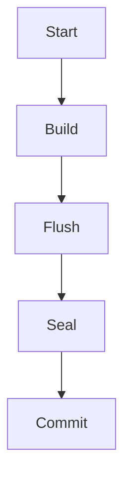

# IndexLib 系列文章图表格式分析

## 图表类型分类

### 1. 流程图（Flow Chart）- 适合 Mermaid

**特点**：展示步骤流程、决策分支、循环等

**适合用 Mermaid 的图表**：
- ✅ `indexlib-build-complete-flow.svg` - 索引构建完整流程
- ✅ `indexlib-build-process.svg` - Build 流程
- ✅ `indexlib-flush-process.svg` - Flush 流程
- ✅ `indexlib-seal-process.svg` - Seal 流程
- ✅ `indexlib-commit-process.svg` - Commit 流程
- ✅ `indexlib-query-complete-flow.svg` - 查询完整流程
- ✅ `indexlib-query-flow-overview.svg` - 查询流程概览
- ✅ `indexlib-segment-merge-flow.svg` - Segment 合并流程
- ✅ `indexlib-incremental-update-flow.svg` - 增量更新流程
- ✅ `indexlib-version-load-flow.svg` - 版本加载流程

**Mermaid 优势**：
- 文本格式，易于版本控制
- 可以直接在 Markdown 中渲染
- 易于编辑和维护
- 适合展示流程步骤

### 2. 序列图（Sequence Diagram）- 适合 Mermaid

**特点**：展示组件之间的交互、消息传递

**适合用 Mermaid 的图表**：
- ✅ `indexlib-tablet-lifecycle.svg` - Tablet 生命周期（可以改为序列图）
- ✅ `indexlib-build-realtime-scenario.svg` - 实时写入场景（可以改为序列图）
- ✅ `indexlib-query-scenario.svg` - 查询场景（可以改为序列图）
- ✅ `indexlib-commit-committer-flow.svg` - VersionCommitter 流程（可以改为序列图）
- ✅ `indexlib-flush-dumper-flow.svg` - SegmentDumper 流程（可以改为序列图）

**Mermaid 优势**：
- 清晰展示组件交互
- 易于理解时序关系
- 适合展示异步操作

### 3. 类图/接口图（Class Diagram）- 适合 Mermaid

**特点**：展示类、接口、继承关系

**适合用 Mermaid 的图表**：
- ✅ `indexlib-core-components.svg` - 核心组件关系
- ✅ `indexlib-filesystem-architecture.svg` - 文件系统架构
- ✅ `indexlib-tabletreader-structure.svg` - TabletReader 结构
- ✅ `indexlib-indexreader-types.svg` - IndexReader 类型
- ✅ `indexlib-merge-strategy-interface.svg` - MergeStrategy 接口

**Mermaid 优势**：
- 清晰展示类关系
- 易于理解继承和组合
- 适合展示接口定义

### 4. 状态图（State Diagram）- 适合 Mermaid

**特点**：展示状态转换、生命周期

**适合用 Mermaid 的图表**：
- ✅ `indexlib-segment-lifecycle.svg` - Segment 生命周期
- ✅ `indexlib-version-evolution.svg` - 版本演进
- ✅ `indexlib-tablet-lifecycle.svg` - Tablet 生命周期（状态图视角）

**Mermaid 优势**：
- 清晰展示状态转换
- 易于理解生命周期
- 适合展示状态机

### 5. 架构图（Architecture Diagram）- 适合 Draw.io 或保持 SVG

**特点**：展示整体架构、组件布局、层次关系

**适合用 Draw.io 的图表**：
- ✅ `indexlib-architecture-overview.svg` - 整体架构
- ✅ `indexlib-tablet-structure.svg` - Tablet 结构
- ✅ `indexlib-tabletdata-structure.svg` - TabletData 结构
- ✅ `indexlib-version-architecture.svg` - Version 架构
- ✅ `indexlib-memory-architecture.svg` - 内存架构

**Draw.io 优势**：
- 可视化编辑，易于修改
- 支持复杂布局
- 适合展示层次结构

### 6. 知识结构图（Mind Map）- 适合 XMind

**特点**：展示概念关系、分类、知识体系

**适合用 XMind 的图表**：
- ✅ IndexLib 整体知识结构
- ✅ 索引类型对比
- ✅ 核心概念关系
- ✅ 设计原则总结

**XMind 优势**：
- 清晰展示知识结构
- 易于理解概念关系
- 适合学习和复习

## 实施建议

### 方案 1：补充 Mermaid 版本（推荐）

**优点**：
- 文本格式，易于维护
- 可以直接在 Markdown 中渲染
- 不增加文件数量（可以内嵌在 Markdown 中）

**实施**：
1. 为关键流程图创建 Mermaid 版本
2. 在文章中同时提供 SVG 和 Mermaid 版本
3. 读者可以选择查看哪种格式

### 方案 2：创建 Draw.io 源文件

**优点**：
- 可视化编辑
- 易于修改和更新

**实施**：
1. 为复杂架构图创建 Draw.io 源文件
2. 导出为 SVG 用于文章
3. 源文件保存在 `images/diagrams/source/` 目录

### 方案 3：创建 XMind 知识结构图

**优点**：
- 清晰展示知识体系
- 适合学习和复习

**实施**：
1. 创建 IndexLib 整体知识结构图
2. 作为系列文章的导航和总结
3. 可以单独提供下载

## 优先级建议

### 高优先级（立即实施）
1. **关键流程图**：用 Mermaid 补充
   - 索引构建完整流程
   - 查询完整流程
   - Segment 合并流程

2. **序列图**：用 Mermaid 补充
   - 实时写入场景
   - 查询场景
   - Commit 流程

### 中优先级（后续实施）
1. **类图/接口图**：用 Mermaid 补充
   - 核心组件关系
   - 文件系统架构

2. **状态图**：用 Mermaid 补充
   - Segment 生命周期
   - 版本演进

### 低优先级（可选）
1. **架构图**：保持 SVG 或创建 Draw.io 源文件
2. **知识结构图**：创建 XMind 版本

## 技术实现

### Jekyll Mermaid 支持

需要在 Jekyll 中配置 Mermaid 支持：

1. 在 `_config.yml` 中添加：
```yaml
plugins:
  - jekyll-mermaid
```

2. 在文章中使用：
````markdown

````

### 文件组织

```
images/diagrams/
├── indexlib-*.svg          # SVG 图片（保持现有）
├── source/                  # 源文件目录
│   ├── *.drawio            # Draw.io 源文件
│   └── *.xmind             # XMind 源文件
└── mermaid/                # Mermaid 代码（可选）
    └── *.mmd               # Mermaid 代码文件
```

## 总结

- **流程图、序列图、类图、状态图**：优先用 Mermaid 补充
- **架构图**：保持 SVG 或创建 Draw.io 源文件
- **知识结构图**：创建 XMind 版本作为补充

建议先为关键流程创建 Mermaid 版本，然后逐步补充其他类型的图表。
