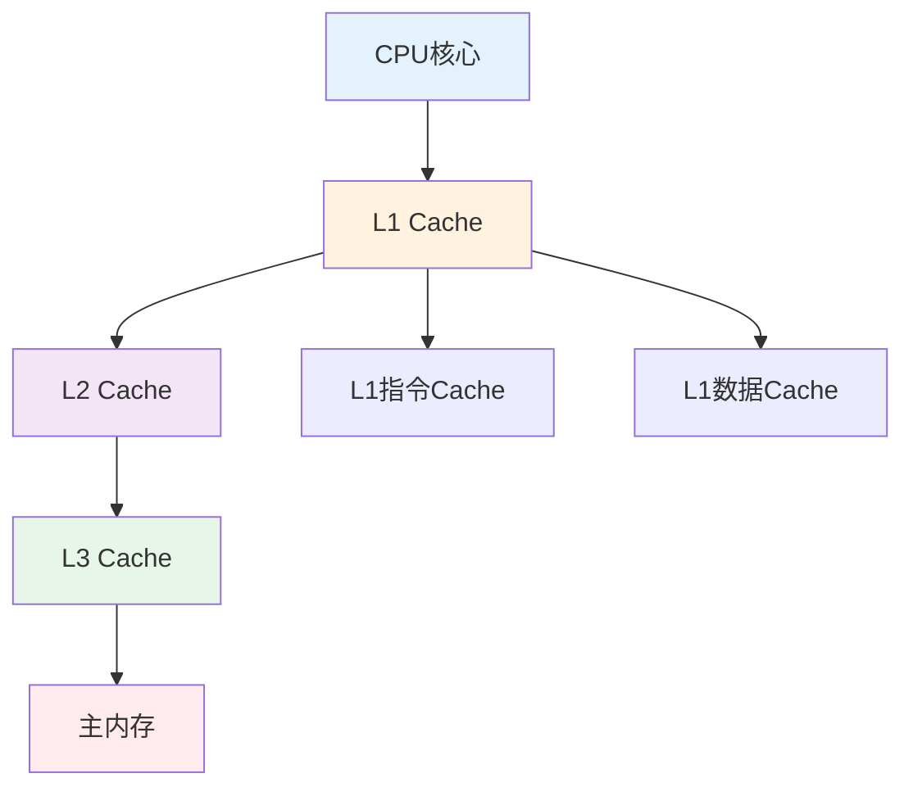
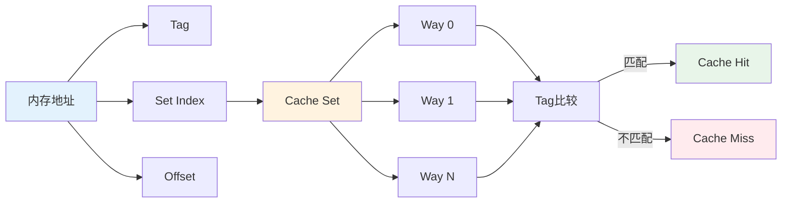
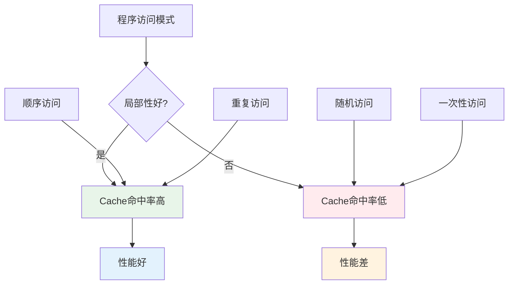
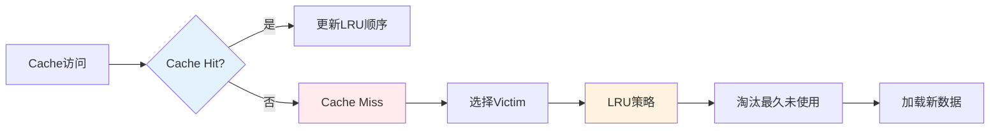

## 前言

CPU Cache 是现代计算机系统性能的关键，它通过利用程序的局部性原理，大幅提升了内存访问速度。理解 Cache 的工作原理和局部性的影响，不仅是掌握计算机组成原理的关键，更是进行性能优化的基础。本文将从原理、实现、性能等多个维度深入解析 CPU Cache 和局部性，帮助读者全面理解这一重要机制。

## 1. 为什么需要 Cache

CPU 计算越来越快，但内存访问相对更慢。
Cache 的目标是：把“可能马上要用的数据”放在更快的层级里（L1/L2/L3）。

## 2. 两种局部性

- **时间局部性**：刚用过的数据，短时间内还会再用
- **空间局部性**：访问某个地址后，附近地址很可能也会被访问

这也是为什么顺序扫描通常比随机访问更快。

## 3. CPU Cache 的层次结构

### 3.1 多级 Cache 架构

现代 CPU 通常采用多级 Cache 架构：



**Cache 层次特征**：

| 层级 | 容量 | 延迟 | 位置 |
|------|------|------|------|
| L1 | 32-64KB | 1-3 周期 | CPU 核心内 |
| L2 | 256KB-1MB | 10-20 周期 | CPU 核心内 |
| L3 | 8-32MB | 40-75 周期 | 共享 |
| 主内存 | GB 级 | 100-300 周期 | 片外 |

### 3.2 Cache 的组织方式

Cache 通常采用组相联（Set-Associative）组织方式：



## 4. 局部性原理的深入分析

### 4.1 时间局部性（Temporal Locality）

时间局部性是指：**刚访问过的数据，短时间内很可能再次被访问**。

```cpp
// 时间局部性的例子
int sum = 0;
for (int i = 0; i < 1000; ++i) {
    sum += array[i];  // array[i] 在循环中多次访问，时间局部性好
}
```

### 4.2 空间局部性（Spatial Locality）

空间局部性是指：**访问某个地址后，附近地址很可能也会被访问**。

```cpp
// 空间局部性的例子
for (int i = 0; i < 1000; ++i) {
    process(array[i]);  // 顺序访问，空间局部性好
}

// 随机访问，空间局部性差
for (int i = 0; i < 1000; ++i) {
    int index = random() % 1000;
    process(array[index]);  // 随机访问，空间局部性差
}
```

### 4.3 局部性对性能的影响



## 5. Cache 替换策略

### 5.1 常见的替换策略

1. **LRU（Least Recently Used）**：淘汰最近最少使用的 Cache line
2. **FIFO（First In First Out）**：淘汰最早进入的 Cache line
3. **Random**：随机淘汰

### 5.2 LRU 的实现



## 6. 实际工程案例

### 6.1 数据结构对 Cache 性能的影响

```cpp
// 数组：顺序访问，Cache 友好
int sum_array(int* arr, int n) {
    int sum = 0;
    for (int i = 0; i < n; ++i) {
        sum += arr[i];  // 顺序访问，空间局部性好
    }
    return sum;
}

// 链表：随机访问，Cache 不友好
int sum_list(Node* head) {
    int sum = 0;
    while (head) {
        sum += head->value;  // 随机访问，空间局部性差
        head = head->next;
    }
    return sum;
}
```

### 6.2 False Sharing 问题

```cpp
// False Sharing：多个变量在同一 Cache line，导致性能下降
struct BadAlignment {
    int counter1;  // 与 counter2 在同一 Cache line
    int counter2;  // 不同线程写这两个变量会导致 Cache line 失效
};

// 解决：使用 padding 或 alignas 分离
struct GoodAlignment {
    alignas(64) int counter1;  // 64 字节对齐，确保不在同一 Cache line
    alignas(64) int counter2;
};
```

## 7. 性能分析与优化

### 7.1 Cache 性能指标

1. **Cache Hit Rate**：Cache 命中率，越高越好
2. **Cache Miss Penalty**：Cache miss 的代价，取决于内存延迟
3. **AMAT（Average Memory Access Time）**：平均内存访问时间

### 7.2 性能优化策略

1. **提升局部性**：
   - 顺序访问而非随机访问
   - 重用数据而非一次性访问
   - 紧凑的数据结构

2. **减少 False Sharing**：
   - 使用 padding 分离热点变量
   - 使用 `alignas` 确保对齐

3. **预取优化**：
   - 使用 `__builtin_prefetch` 预取数据
   - 编译器自动预取

## 8. 设计模式与架构原则

### 8.1 设计模式视角

CPU Cache 体现了多个设计模式：

1. **缓存模式**：通过缓存提高访问速度
2. **分层模式**：多级 Cache 形成层次结构
3. **替换策略模式**：不同的替换策略适用于不同场景

### 8.2 架构原则

- **局部性原理**：利用程序的局部性提高 Cache 命中率
- **层次化设计**：多级 Cache 平衡容量和速度
- **性能优化**：通过多种机制优化 Cache 性能

## 9. 小结

CPU Cache 是现代计算机系统性能的关键，它通过利用程序的局部性原理，大幅提升了内存访问速度。

**核心概念总结**：

- **Cache 原理**：通过多级 Cache 层次结构提高内存访问速度
- **局部性原理**：时间局部性和空间局部性是 Cache 性能的基础
- **替换策略**：LRU 等策略决定哪些数据保留在 Cache 中
- **性能优化**：通过提升局部性、减少 False Sharing 等优化性能

**设计亮点**：

1. **多级层次**：L1/L2/L3 Cache 形成层次结构，平衡容量和速度
2. **局部性利用**：通过时间局部性和空间局部性提高命中率
3. **智能替换**：通过 LRU 等策略保留最可能使用的数据
4. **预取机制**：通过硬件和软件预取提前加载数据
5. **性能优化**：通过多种机制优化 Cache 性能

**关键要点**：

- 局部性几乎决定了性能上限，顺序访问比随机访问快得多
- 数据结构设计会影响 cache miss，数组通常比链表更 Cache 友好
- 访问模式会影响预取效果，顺序访问可以充分利用预取
- False sharing 会让多线程性能崩掉，需要合理对齐和分离
- 理解 Cache 和局部性是进行性能优化的基础

掌握 CPU Cache 和局部性的原理，可以更好地进行性能优化和系统设计。

