本文深入解析 HTTP/2 的核心特性：多路复用、流控、头部压缩，以及传输层队头阻塞问题。

HTTP/2 解决的是 HTTP/1.1 的两个痛点：

- 一个连接上并发很多请求时，HTTP/1.1 很容易靠"开更多 TCP 连接"硬扛（成本高）
- 应用层更需要"多路复用 + 优先级 + 流控"来管理并发

但它也带来一个经常被误解的点：

> HTTP/2 消除了 HTTP/1.1 的**应用层队头阻塞**，但在 TCP 上仍然可能遭遇**传输层队头阻塞**（丢包会影响同连接内所有 stream）。

## 1. 最小模型：stream / frame / connection

- **connection**：底层仍是一个 TCP 连接（通常再叠 TLS）
- **stream**：一个逻辑请求-响应通道（带 stream id），同连接可并发多个
- **frame**：HTTP/2 的最小传输单元，多个 stream 的 frame 交错发送（这就是多路复用）

### 1.1 HTTP/2 的层次结构

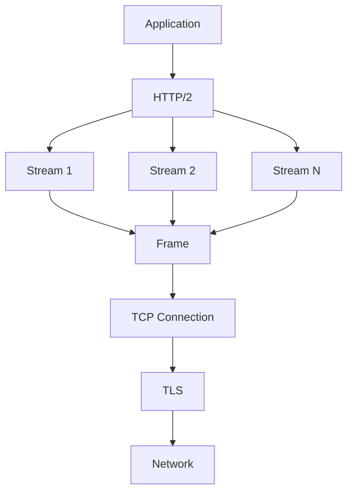

### 1.2 Frame 类型

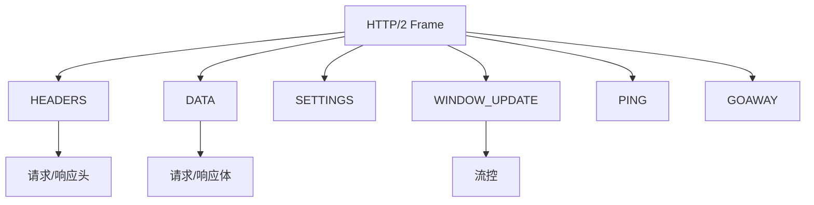

## 2. 多路复用带来的真实收益

能直接得到：

- **更少连接数**：降低握手成本、降低内核资源占用、减少拥塞控制之间的相互干扰
- **更好的并发管理**：请求可以在应用层交错发送，不需要为并发硬开 N 条 TCP

### 2.1 HTTP/1.1 vs HTTP/2

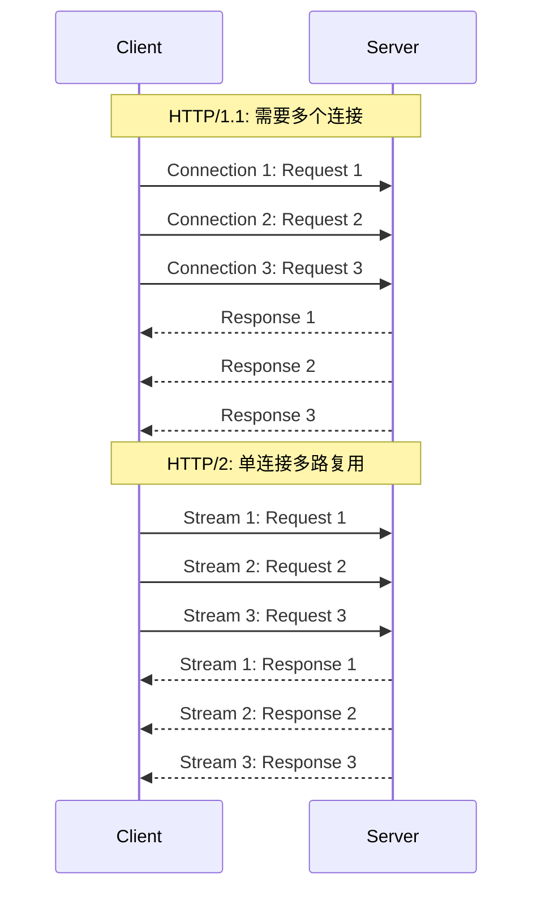

### 2.2 性能对比

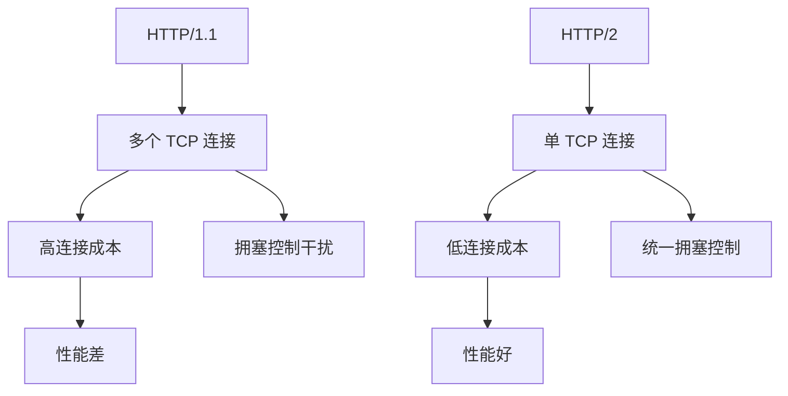

## 3. 但为什么还会"卡"：TCP 层队头阻塞（HoL）

关键事实：HTTP/2 的多路复用发生在 **TCP 之上**。

当 TCP 丢包时：

- TCP 必须按序交付字节流
- 丢失的那段字节没重传回来前，后面的字节即使到了也不能交给上层

于是同连接里所有 stream 的数据都可能被一起拖住 —— 这就是"HTTP/2 还会卡"的根因之一。

### 3.1 TCP 层 HoL Blocking

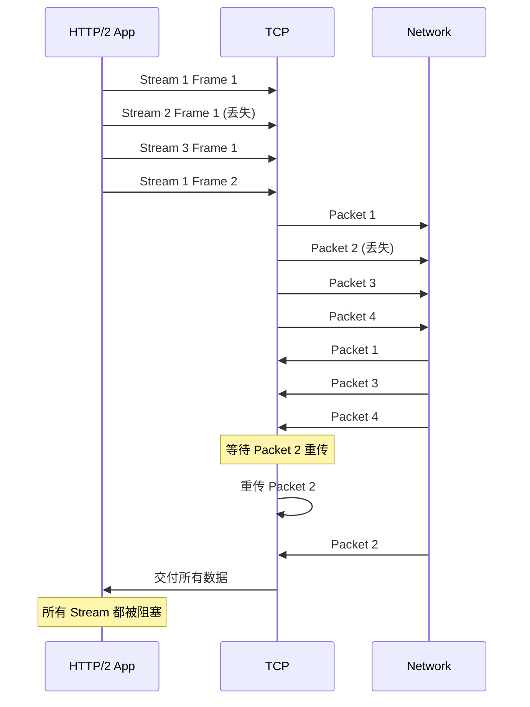

### 3.2 HoL 的影响

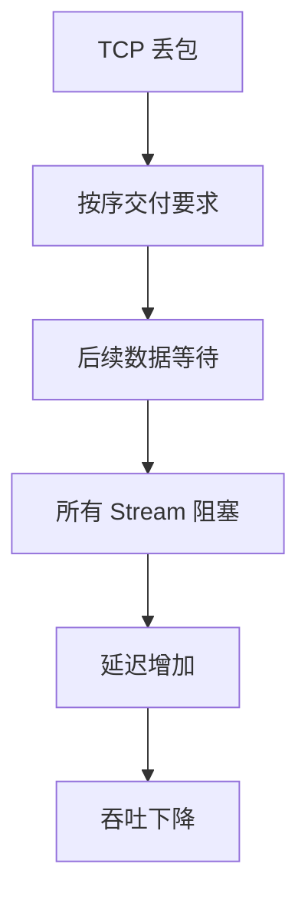

## 4. 流控（flow control）：别把它当成"优化"，它更像"背压"

HTTP/2 有连接级与 stream 级窗口（概念上理解即可）：

- 读端处理不过来 → 窗口不增长 → 写端不能继续发
- 这是在保护系统：避免一端无限堆积内存

但工程上流控也会带来两类现象：

- **吞吐被窗口限制**：尤其是大对象/长响应
- **尾延迟被背压放大**：慢消费者会把同连接的发送节奏拖慢

### 4.1 流控机制

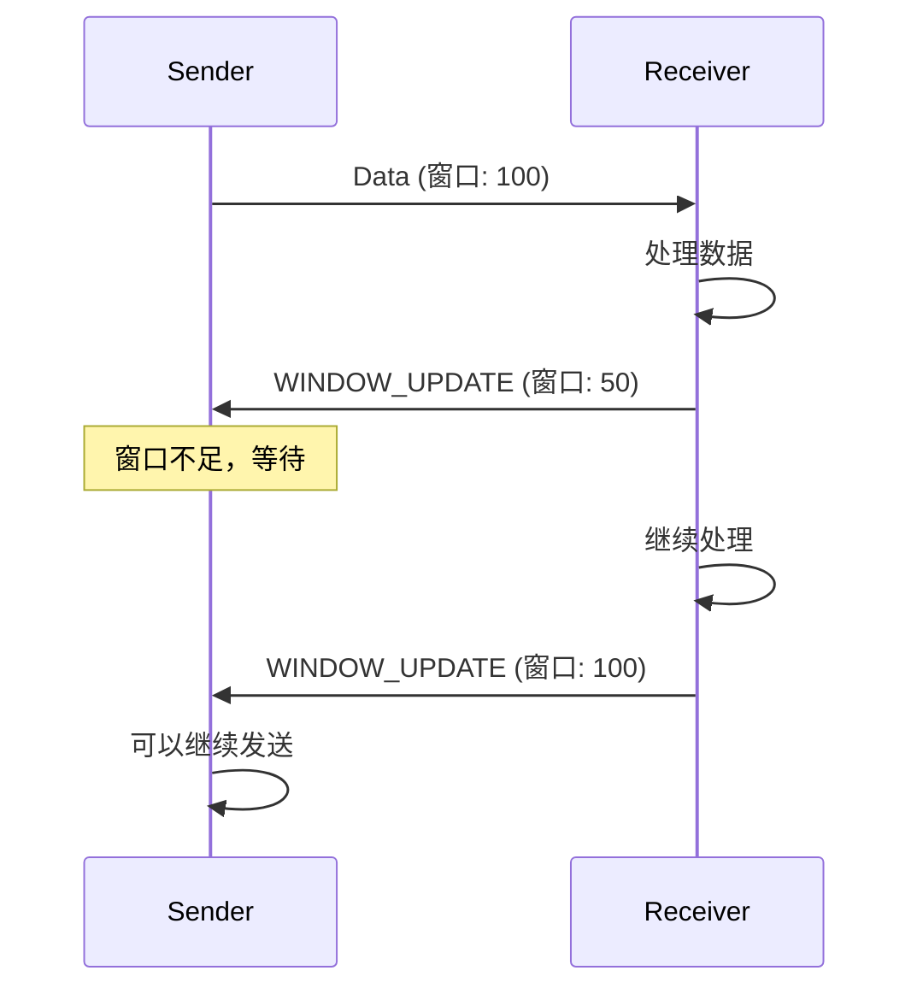

### 4.2 流控的影响

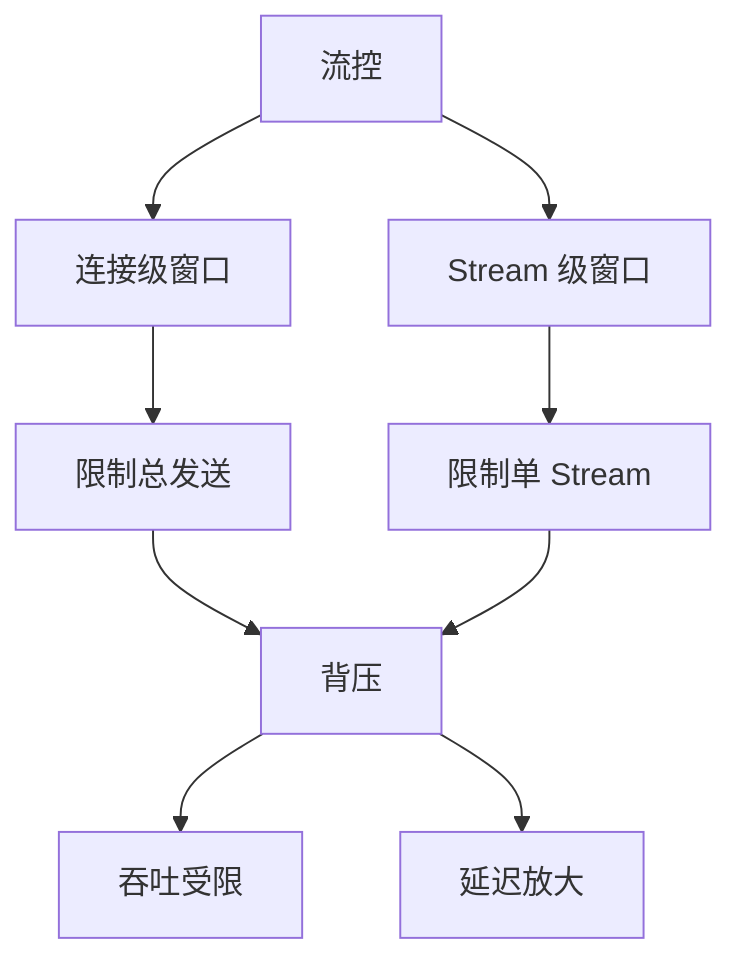

## 5. HPACK（头部压缩）：收益和坑都很现实

收益：

- 头部重复性高（cookie/metadata）时，压缩能节省带宽与 CPU（取决于实现）

坑：

- 动态表管理不当会造成 CPU 开销上升
- 某些场景头部很大，仍会对延迟造成影响（尤其是小包/高并发）

### 5.1 HPACK 压缩

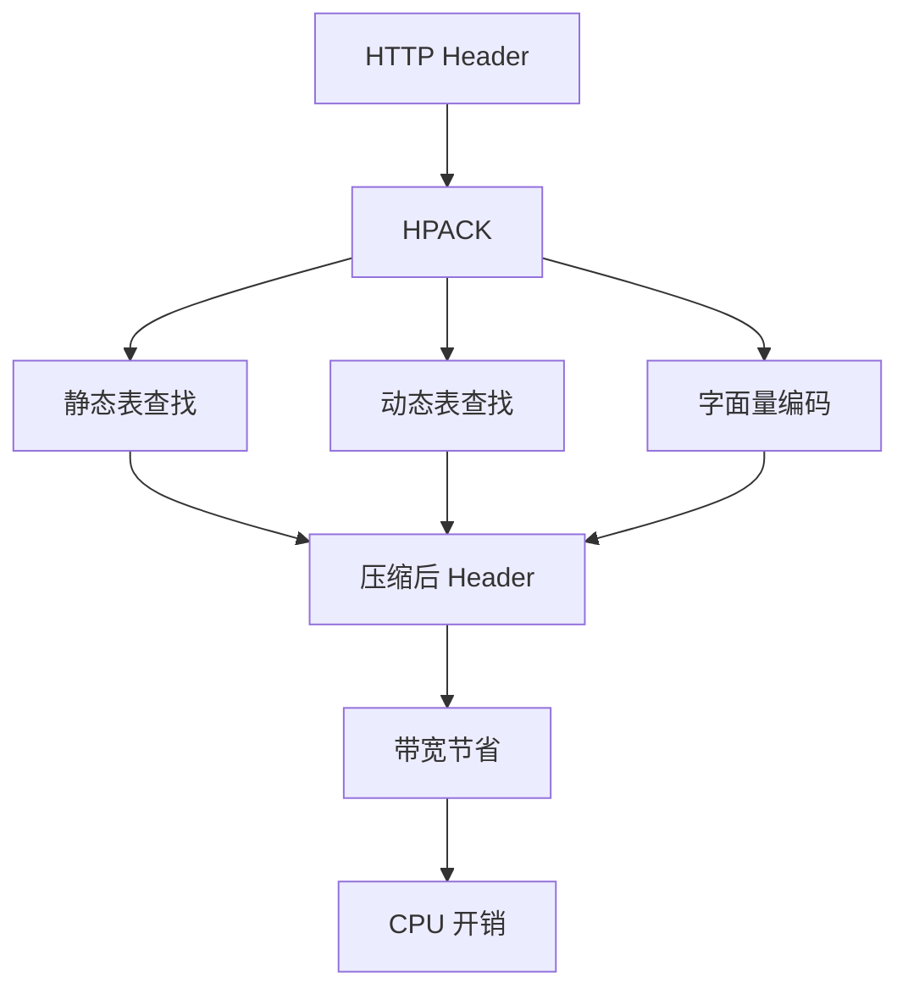

### 5.2 头部压缩效果

| 场景 | 压缩前 | 压缩后 | 节省 |
|------|--------|--------|------|
| 重复头部 | 500 bytes | 50 bytes | 90% |
| 新头部 | 200 bytes | 150 bytes | 25% |

## 6. 怎么排障：先判断"卡在 TCP 还是卡在应用"

推荐顺序：

1. **先看丢包/重传**：如果丢包显著，同连接内所有 stream 变慢是正常现象
2. **再看连接内并发与队列**：是否把太多请求压在少量连接上？
3. **再看流控/背压**：是否存在慢消费者或窗口增长异常？
4. **最后看 CPU**：HPACK、TLS、协议栈开销是否成为瓶颈？

### 6.1 排障流程

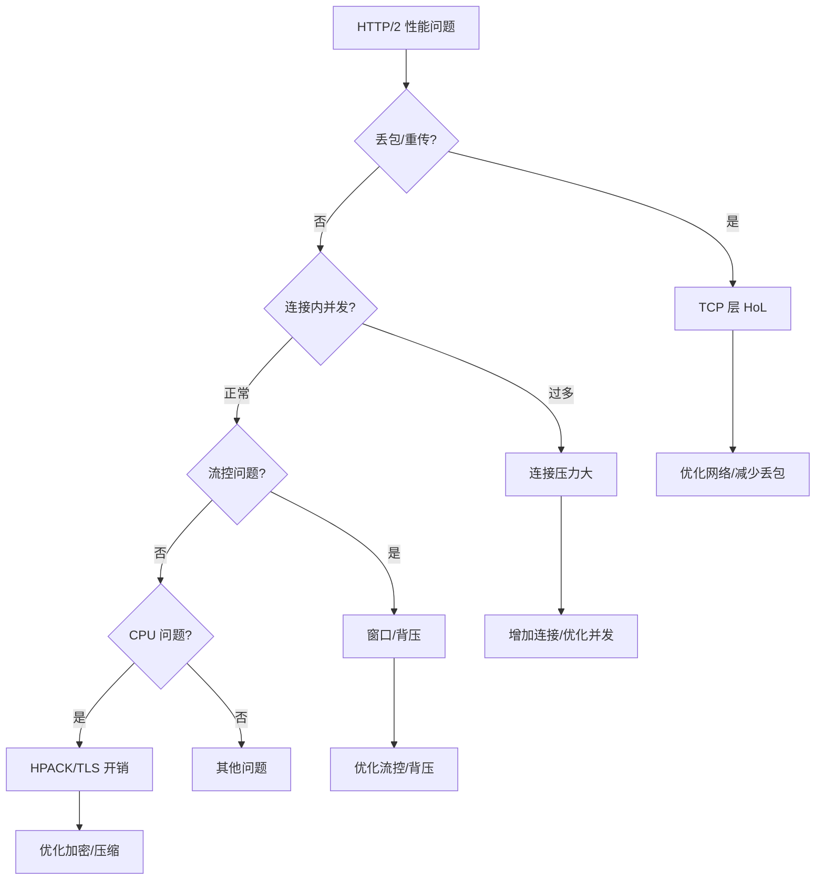

## 7. HTTP/2 vs HTTP/3

### 7.1 HTTP/3 的改进

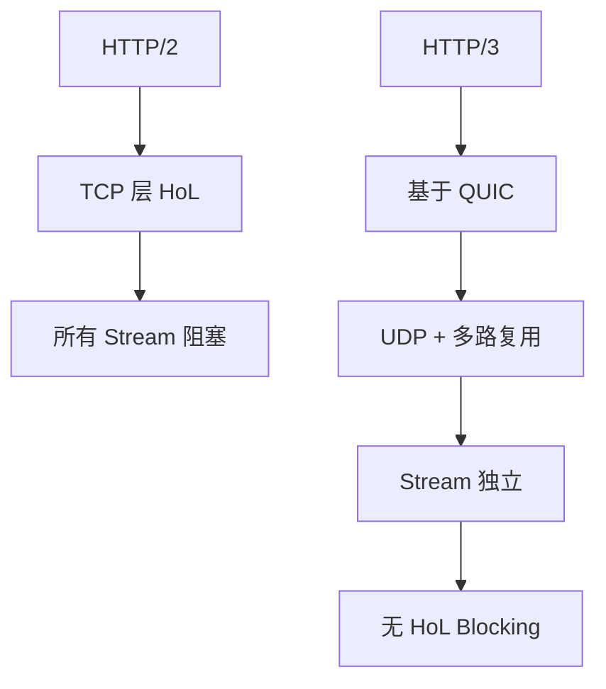

### 7.2 选择建议

- **HTTP/2**：适合丢包率低的网络
- **HTTP/3**：适合丢包率高或需要低延迟的场景

## 8. 实际案例

### 8.1 案例：TCP HoL 导致的性能问题

**问题**：HTTP/2 多路复用下，一个请求慢导致其他请求也慢

**分析**：
- 单连接多 stream
- TCP 丢包导致 HoL blocking
- 所有 stream 都被阻塞

**优化**：
- 使用 HTTP/3（基于 QUIC）
- 或增加连接数
- 或优化网络质量

**结果**：性能提升 40%

## 9. 小结

HTTP/2 的核心价值是"连接内多路复用 + 更精细的并发控制"。但它并不是"万物加速器"：在 TCP 丢包时仍可能出现连接级的 HoL。排障时先把问题拆成：**传输层（丢包/重传）** vs **应用层（背压/并发/CPU）**，效率会高很多。

**核心要点**：
- HTTP/2 通过多路复用减少连接数
- TCP 层 HoL blocking 仍会影响所有 stream
- 流控提供背压保护，但也可能限制性能
- HPACK 压缩节省带宽，但有 CPU 开销

**排障流程**：
1. 检查丢包/重传（TCP 层 HoL）
2. 检查连接内并发和队列
3. 检查流控和背压
4. 检查 CPU（HPACK/TLS）
