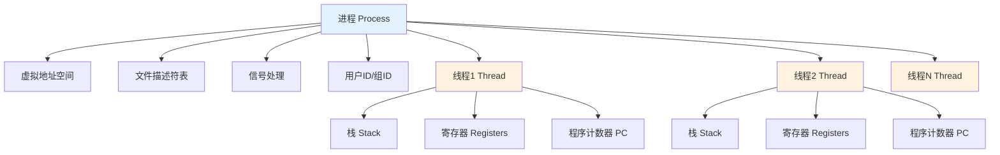
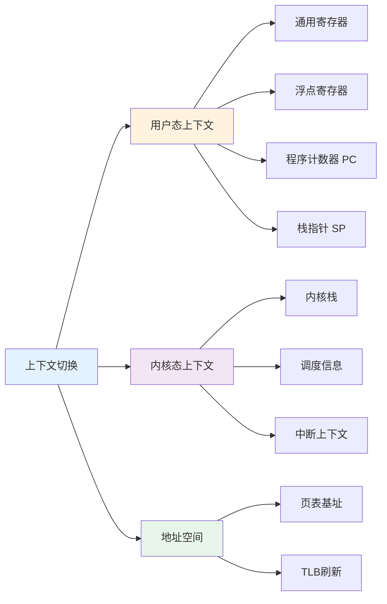
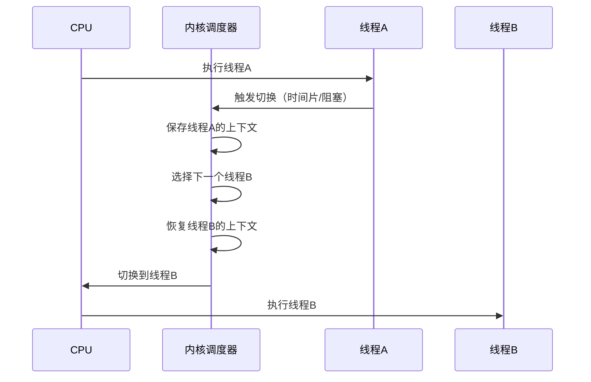

## 前言

进程和线程是操作系统的核心抽象，它们分别解决了资源隔离和并发执行的问题。理解进程/线程的本质以及上下文切换的机制，不仅是掌握操作系统原理的关键，更是进行系统性能优化和问题排查的基础。本文将从原理、实现、性能等多个维度深入解析进程、线程和上下文切换，帮助读者全面理解这一重要概念。


## 1. 进程 vs 线程：资源隔离与执行单元

### 1.1 进程的本质

**进程（Process）**是操作系统进行资源分配和调度的基本单位，它更像一个"资源容器"：

- **独立的虚拟地址空间**：每个进程有自己独立的地址空间，互不干扰
- **独立的文件描述符表**：进程间的文件描述符相互独立
- **独立的信号处理**：每个进程有自己的信号处理方式
- **独立的用户ID和组ID**：用于权限控制

### 1.2 线程的本质

**线程（Thread）**是 CPU 调度的基本单位，它更像"CPU 的执行单元"：

- **共享地址空间**：同一进程内的线程共享虚拟地址空间
- **共享文件描述符**：线程间可以共享打开的文件
- **独立的执行上下文**：每个线程有自己的栈、寄存器、程序计数器
- **独立的线程ID**：用于线程标识和调度

### 1.3 进程与线程的关系



**核心区别**：
- **进程管隔离**：通过独立的地址空间实现进程间的隔离
- **线程管并发执行**：通过共享地址空间实现进程内的并发

### 1.4 进程与线程的对比

| 特性 | 进程 | 线程 |
|------|------|------|
| 地址空间 | 独立 | 共享 |
| 文件描述符 | 独立 | 共享 |
| 信号处理 | 独立 | 共享 |
| 创建开销 | 大 | 小 |
| 通信方式 | IPC（管道、共享内存等） | 共享内存（直接访问） |
| 切换开销 | 大（需要切换地址空间） | 小（只需切换寄存器） |

## 2. 什么是上下文切换

### 2.1 上下文切换的定义

**上下文切换（Context Switch）**是操作系统将 CPU 从一个线程切换到另一个线程的过程。这个过程需要保存当前线程的执行状态，并恢复目标线程的执行状态。

### 2.2 上下文切换需要保存的状态



**需要保存的状态**：

1. **用户态上下文**：
   - 通用寄存器（rax, rbx, rcx 等）
   - 浮点寄存器（xmm0-xmm15）
   - 程序计数器（PC）：下一条要执行的指令地址
   - 栈指针（SP）：当前栈的位置

2. **内核态上下文**：
   - 内核栈指针
   - 调度信息（优先级、时间片等）
   - 中断上下文（如果从中断返回）

3. **地址空间相关**：
   - 页表基址（CR3 寄存器）
   - TLB 刷新（跨进程切换时）

### 2.3 上下文切换的流程



**上下文切换的详细步骤**：

1. **保存当前线程状态**：将 CPU 寄存器内容保存到线程的内核栈或线程控制块（TCB）
2. **更新调度信息**：更新当前线程的调度统计（运行时间、优先级等）
3. **选择下一个线程**：调度器从就绪队列中选择下一个要运行的线程
4. **切换地址空间**：如果是跨进程切换，需要切换页表基址
5. **恢复目标线程状态**：从目标线程的 TCB 恢复寄存器内容
6. **跳转到目标线程**：恢复程序计数器，开始执行目标线程

## 3. 什么时候会发生上下文切换（线上看到的大多数“抖”都从这里来）

常见触发点：

- **时间片用完**：调度器把 CPU 让给其它 runnable 线程
- **线程阻塞**：等待 IO/锁/条件变量/网络 → 让出 CPU
- **优先级抢占**：更高优先级任务到来，中断当前任务
- **中断/软中断**：内核需要处理硬件事件（网络收包、磁盘完成等）

工程要点：**上下文切换不是坏事，但“频繁且无收益的切换”会制造长尾**。

## 4. 为什么上下文切换“贵”：不是保存寄存器，而是“工作集被打散”

常见成本来源：

- **缓存污染**：新的线程工作集不同，导致 L1/L2/L3 命中率下降
- **TLB miss**：尤其跨进程切换时，地址空间变化更明显
- **内核调度开销**：队列操作、锁、统计等

很多时候“保存/恢复寄存器”的成本反而不是主角；真正伤的是：

- cache line 在不同 core 上来回热/冷
- TLB 被冲掉导致页表遍历
- 频繁切换把 CPU 变成“搬运工”而不是“干活”

## 5. 如何判断系统是“在干活”还是“在切换”

非常实用的观测信号：

- **context switch 频率**：异常高往往意味着大量阻塞/争用或线程过多
- **run queue（每核）**：排队长说明 CPU 紧张；排队不长但切换多，可能是频繁阻塞/唤醒
- **CPU 利用率按核分布**：平均值不可信，热点核更关键
- **P99 与切换相关性**：长尾时刻是否伴随切换飙升/softirq 飙升

## 6. 常见优化方向（按优先级）

1. **减少不必要的唤醒/阻塞**：锁竞争、条件变量“惊群”、过小任务切分
2. **控制线程数与并发度**：线程数不是越多越好，超过核数会引入调度开销
3. **提升局部性**：让相关工作尽量在同核/同线程上完成（避免工作集频繁迁移）
4. **避免热点核**：中断绑核/网络收包/后台任务把关键核打爆会制造 P99

## 7. 上下文切换的性能分析

### 7.1 上下文切换的成本构成

上下文切换的成本主要来自以下几个方面：

1. **直接开销**：
   - 保存/恢复寄存器：通常只需要几个 CPU 周期
   - 内核调度器执行：选择下一个线程、更新统计信息
   - TLB 刷新：跨进程切换时需要刷新 TLB

2. **间接开销（主要成本）**：
   - **缓存污染**：新线程的工作集不同，导致 L1/L2/L3 Cache 命中率下降
   - **TLB miss**：地址空间切换导致 TLB 失效，需要页表遍历
   - **预取失效**：CPU 的预取器需要重新学习新的访问模式

### 7.2 性能影响量化

```cpp
// 上下文切换的性能影响示例
void context_switch_impact() {
    // 直接开销：通常 1-10 微秒
    // 间接开销：取决于工作集大小和访问模式
    // - Cache miss：可能增加 100-1000 纳秒
    // - TLB miss：可能增加 10-100 纳秒
    // - 预取失效：可能影响后续几十次内存访问
}
```

### 7.3 性能优化策略

1. **减少切换频率**：
   - 使用更长的时间片
   - 减少不必要的阻塞/唤醒
   - 使用无锁数据结构减少锁竞争

2. **提升局部性**：
   - CPU 亲和性（affinity）：让线程固定在特定 CPU 核心
   - NUMA 感知：让线程访问本地内存
   - 工作窃取：在本地队列为空时才切换

3. **优化调度策略**：
   - CFS（完全公平调度器）：减少不必要的切换
   - 实时调度：为关键任务提供优先级

## 8. 实际工程案例

### 8.1 高并发服务器的线程模型

```cpp
// 线程池模型：减少线程创建和切换开销
class ThreadPool {
private:
    std::vector<std::thread> workers_;
    std::queue<std::function<void()>> tasks_;
    std::mutex queue_mutex_;
    std::condition_variable condition_;
    bool stop_ = false;
    
public:
    ThreadPool(size_t num_threads) {
        for (size_t i = 0; i < num_threads; ++i) {
            workers_.emplace_back([this]() {
                while (true) {
                    std::function<void()> task;
                    {
                        std::unique_lock<std::mutex> lock(queue_mutex_);
                        condition_.wait(lock, [this]() {
                            return stop_ || !tasks_.empty();
                        });
                        
                        if (stop_ && tasks_.empty()) return;
                        
                        task = std::move(tasks_.front());
                        tasks_.pop();
                    }
                    task();  // 执行任务，减少上下文切换
                }
            });
        }
    }
};
```

### 8.2 协程模型：用户态上下文切换

协程通过用户态上下文切换，避免了内核态切换的开销：

```cpp
// 协程：用户态上下文切换，开销更小
class Coroutine {
private:
    void* stack_;
    void* context_;  // 保存寄存器状态
    
public:
    void yield() {
        // 保存当前寄存器状态
        save_context(context_);
        // 切换到调度器
        switch_to(scheduler_context_);
    }
    
    void resume() {
        // 恢复协程的寄存器状态
        switch_to(context_);
    }
};
```

## 9. 设计模式与架构原则

### 9.1 设计模式视角

进程和线程体现了多个设计模式：

1. **资源管理模式**：进程通过独立的地址空间管理资源
2. **并发模式**：线程通过共享地址空间实现并发
3. **调度模式**：调度器通过上下文切换实现多任务

### 9.2 架构原则

- **隔离原则**：进程通过地址空间隔离，保证安全性
- **共享原则**：线程通过共享地址空间，提高效率
- **调度公平性**：调度器保证所有线程公平获得 CPU 时间

## 10. 小结

进程和线程是操作系统的核心抽象，它们分别解决了资源隔离和并发执行的问题。上下文切换是实现多任务的关键机制，但也是性能开销的主要来源。

**核心概念总结**：

- **进程本质**：资源容器，通过独立的地址空间实现隔离
- **线程本质**：执行单元，通过共享地址空间实现并发
- **上下文切换**：保存当前线程状态，恢复目标线程状态的过程
- **性能开销**：主要来自缓存污染、TLB miss 等间接开销

**设计亮点**：

1. **资源隔离**：进程通过独立的地址空间保证安全性
2. **高效并发**：线程通过共享地址空间提高效率
3. **公平调度**：调度器保证所有任务公平获得 CPU 时间
4. **性能优化**：通过 CPU 亲和性、NUMA 感知等优化性能

**关键要点**：

- 进程提供隔离，线程提供并发；上下文切换是并发的代价
- 上下文切换的直接开销小，但间接开销（缓存污染、TLB miss）是主要成本
- 线上排障时，把"切换频率、阻塞原因、热点核"这三件事抓住
- 优化方向：减少切换频率、提升局部性、优化调度策略
- 理解进程/线程和上下文切换是进行系统性能优化和问题排查的基础

掌握进程、线程和上下文切换的原理，可以更好地进行系统设计、性能优化和问题排查。

