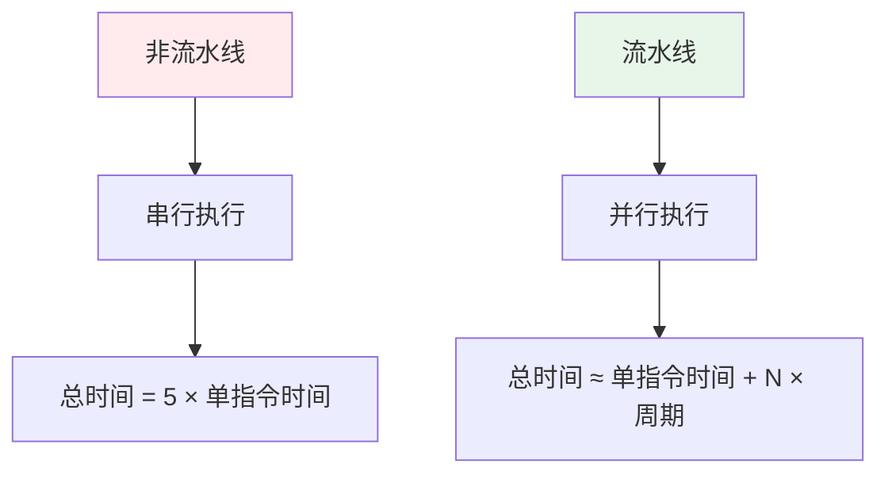
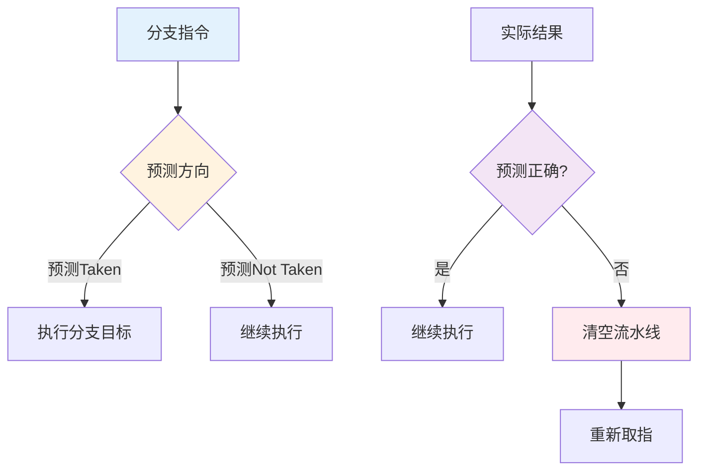
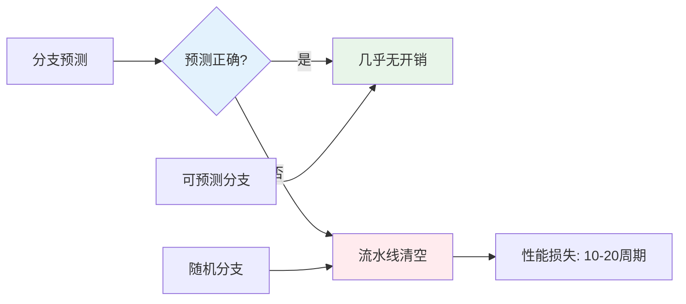

## 前言

流水线和分支预测是现代 CPU 性能优化的核心技术，它们通过指令级并行和预测执行，大幅提升了 CPU 的吞吐量。理解流水线和分支预测的工作原理，不仅是掌握计算机组成原理的关键，更是进行代码性能优化的基础。本文将从原理、实现、性能等多个维度深入解析流水线和分支预测，帮助读者全面理解这一重要机制。

## 1. 流水线为什么怕分支

当 CPU 还没确定分支方向时：

- 不能确定下一条指令地址
- 可能需要停下来等结果（stall）

停顿会让吞吐下降，尤其在深流水线里更明显。

## 2. 分支预测在做什么

分支预测的直觉是：

- “我猜这次会走 A 分支”
- 先按 A 分支继续取指/执行

如果猜对了：几乎白赚吞吐；如果猜错：需要清空流水线并回滚（penalty）。

## 3. 流水线的详细分析

### 3.1 流水线的阶段划分

典型的 5 级流水线：


**各阶段功能**：

1. **IF（Instruction Fetch）**：从指令 Cache 取指令
2. **ID（Instruction Decode）**：译码指令，读取寄存器
3. **EX（Execute）**：执行运算
4. **MEM（Memory Access）**：访问数据 Cache
5. **WB（Write Back）**：写回结果到寄存器

### 3.2 流水线的性能优势



**流水线的优势**：
- **吞吐量提升**：理想情况下，每个周期完成一条指令
- **资源利用率**：多个阶段可以并行工作
- **性能提升**：对于长指令序列，性能提升显著

### 3.3 流水线的冒险（Hazard）

流水线面临三种冒险：

1. **数据冒险**：后续指令依赖前面指令的结果
2. **控制冒险**：分支指令改变程序流程
3. **结构冒险**：多个指令竞争同一资源

## 4. 分支预测的深入分析

### 4.1 分支预测的必要性

分支指令会让流水线面临"走哪条路"的不确定性：



### 4.2 分支预测算法

1. **静态预测**：
   - 总是预测 Not Taken
   - 总是预测 Taken
   - 向后跳转预测 Taken，向前跳转预测 Not Taken

2. **动态预测**：
   - **1-bit 预测器**：记录上次分支结果
   - **2-bit 预测器**：需要两次错误才改变预测
   - **分支目标缓冲（BTB）**：缓存分支目标地址
   - **全局历史预测器**：考虑全局分支历史

### 4.3 分支预测的性能影响



## 5. 实际工程案例

### 5.1 分支预测友好的代码

```cpp
// 好的代码：分支可预测
int sum_even(int* arr, int n) {
    int sum = 0;
    for (int i = 0; i < n; ++i) {
        if (arr[i] % 2 == 0) {  // 如果数据分布有规律，分支可预测
            sum += arr[i];
        }
    }
    return sum;
}

// 更好的代码：减少分支
int sum_even_optimized(int* arr, int n) {
    int sum = 0;
    for (int i = 0; i < n; ++i) {
        // 使用位运算减少分支
        sum += (arr[i] & 1) ? 0 : arr[i];
    }
    return sum;
}
```

### 5.2 热路径优化

```cpp
// 优化：将热路径分离，提高分支预测准确性
void process_data(Data* data, bool is_hot_path) {
    if (is_hot_path) {
        // 热路径：分支预测准确率高
        fast_process(data);
    } else {
        // 冷路径：不常执行
        slow_process(data);
    }
}
```

## 6. 性能分析与优化

### 6.1 分支预测的性能指标

1. **预测准确率**：预测正确的比例，越高越好
2. **Misprediction Penalty**：预测错误的代价，通常 10-20 周期
3. **分支密度**：程序中分支指令的比例

### 6.2 性能优化策略

1. **减少分支**：
   - 使用位运算替代条件判断
   - 使用查表替代多个 if-else
   - 使用条件移动（CMOV）指令

2. **提高可预测性**：
   - 将热路径和冷路径分离
   - 使用 likely/unlikely 提示编译器
   - 数据预处理，让分支更可预测

3. **循环优化**：
   - 循环展开减少分支
   - 使用 SIMD 指令减少分支

## 7. 设计模式与架构原则

### 7.1 设计模式视角

流水线和分支预测体现了多个设计模式：

1. **流水线模式**：将复杂操作分解为多个阶段并行执行
2. **预测模式**：通过预测减少不确定性
3. **投机执行模式**：基于预测提前执行指令

### 7.2 架构原则

- **并行化原则**：通过流水线实现指令级并行
- **预测原则**：通过分支预测减少流水线停顿
- **性能优化**：通过多种机制优化性能

## 8. 小结

流水线和分支预测是现代 CPU 性能优化的核心技术，它们通过指令级并行和预测执行，大幅提升了 CPU 的吞吐量。

**核心概念总结**：

- **流水线原理**：将指令执行分解为多个阶段，实现指令级并行
- **分支预测原理**：通过预测分支方向减少流水线停顿
- **性能影响**：分支预测错误会导致流水线清空，性能损失大
- **优化策略**：通过减少分支、提高可预测性等优化性能

**设计亮点**：

1. **指令级并行**：通过流水线实现指令级并行，提高吞吐量
2. **预测执行**：通过分支预测减少流水线停顿
3. **智能预测**：通过动态预测算法提高预测准确率
4. **性能优化**：通过多种机制优化性能

**关键要点**：

- 流水线通过将指令分解为多个阶段实现指令级并行
- 分支预测通过预测分支方向减少流水线停顿
- 分支不可预测（随机）会更慢，需要优化代码提高可预测性
- 写代码时减少难以预测的分支，有时能显著提升性能
- 理解流水线和分支预测是进行代码性能优化的基础

掌握流水线和分支预测的原理，可以更好地进行代码优化和性能调优。

