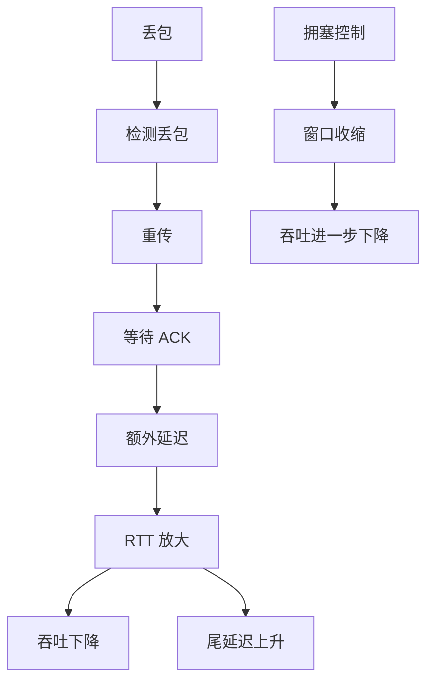
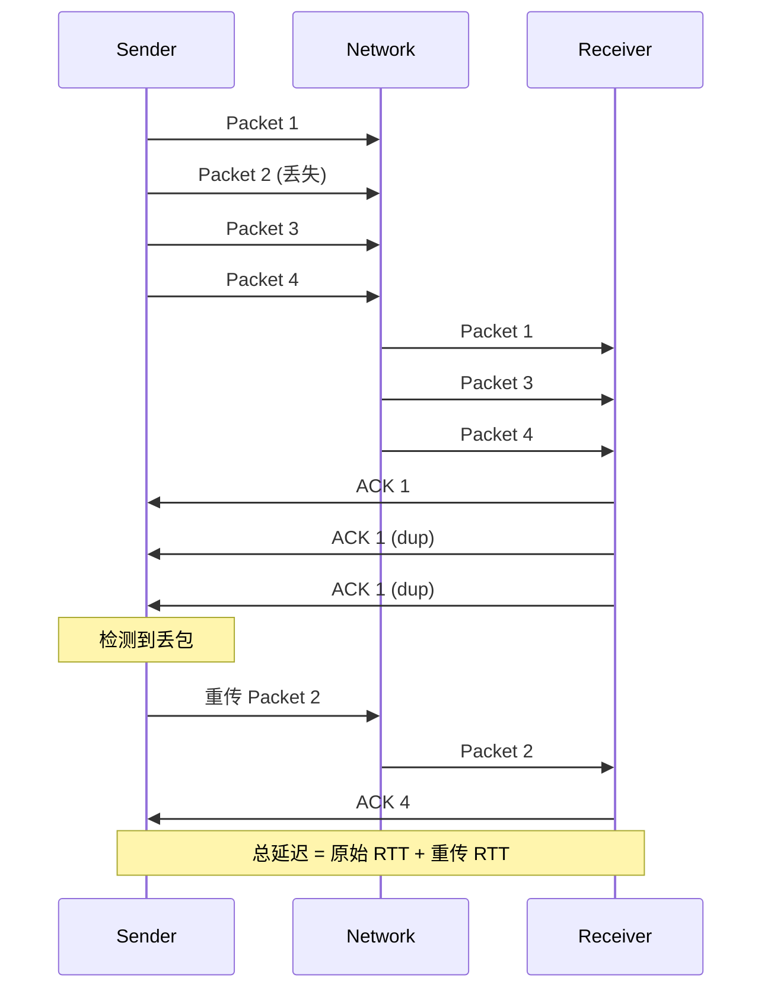
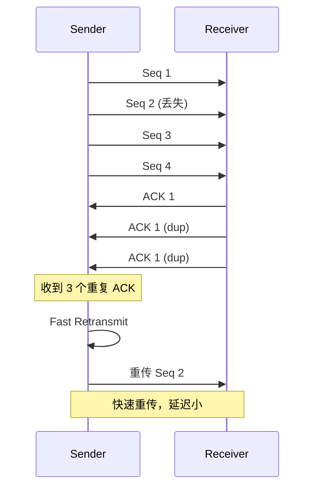
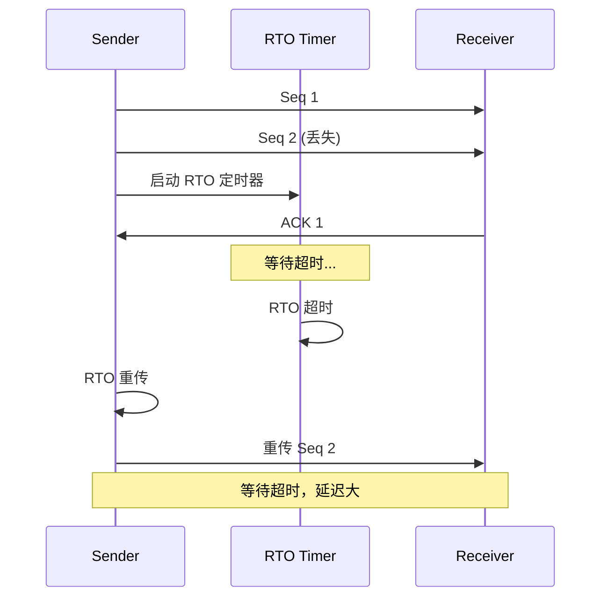
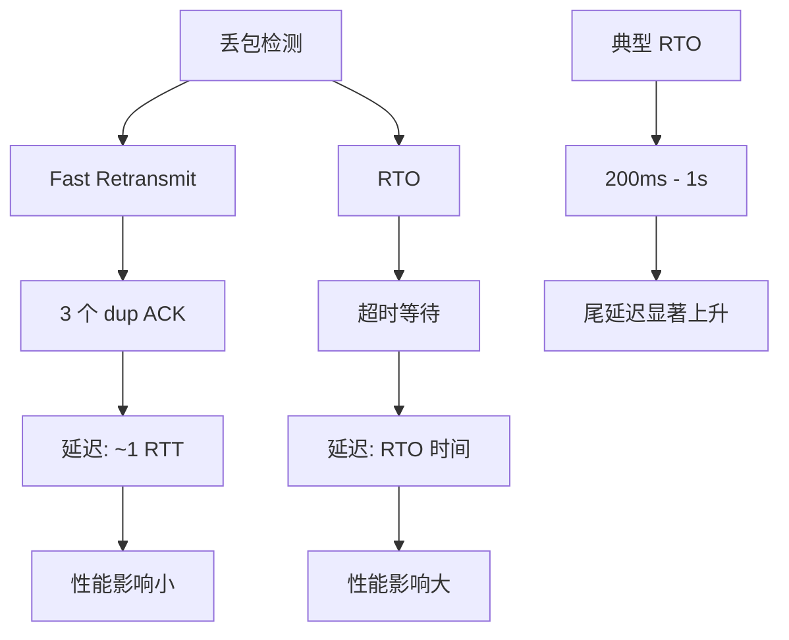
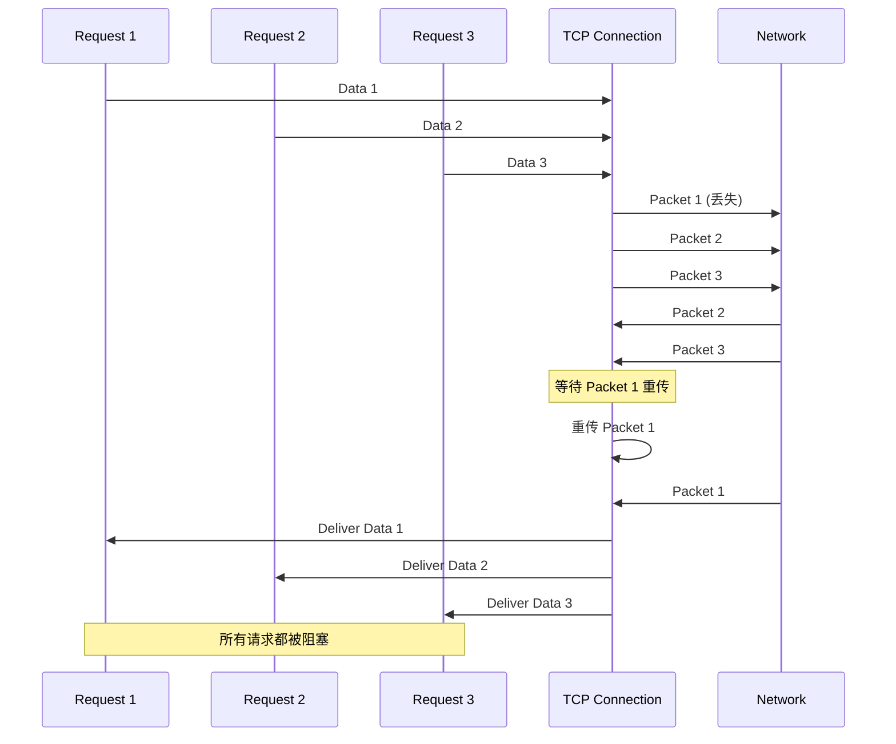
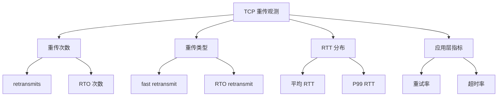
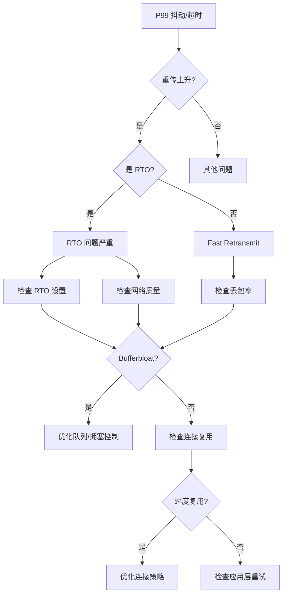
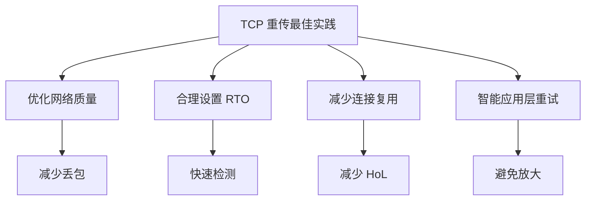

本文深入解析 TCP 重传机制：RTO（Retransmission Timeout）和 fast retransmit 的工作原理、性能影响和工程实践。


## 1. 先把"重传为什么会拖慢"说清楚：丢包 = RTT 被放大

TCP 的可靠性来自"丢了就重传"。问题在于：一旦发生丢包，看到的往往不是"少丢几个包"这么简单，而是：

- **吞吐下降**
- **RTT 抖动**
- **尾延迟（P99/P999）显著上升**

原因：重传会引入额外等待（检测丢包的时间 + 重传往返），并触发拥塞控制收缩窗口。

### 1.1 重传对性能的影响



### 1.2 延迟放大示例



## 2. fast retransmit vs RTO：哪个更"伤"

- **fast retransmit**：通过重复 ACK 快速判断丢包并重传，通常比等超时更快（代价更小）
- **RTO（Retransmission Timeout）**：等到超时才重传，意味着至少要等一个超时时间，**对尾延迟最致命**

核心要点：RTO 更像"被迫等了一次很长的红灯"，会直接把少量请求拉成巨大长尾。

### 2.1 Fast Retransmit 机制



### 2.2 RTO 机制



### 2.3 性能对比



## 3. 为什么 HTTP/2、RPC 等会被放大：传输层 HoL + 应用层重试

丢包造成的影响经常被两层放大：

1. **传输层 HoL（按序交付）**：丢了一段字节，后面的字节即使到了也不能交付（同连接内多请求一起受影响）
2. **应用层超时/重试**：请求慢 → 超时 → 重试 → 并发上升 → 队列更长 → 更慢（正反馈）

所以线上看到的常是：

> 丢包率看起来不高，但 P99 像坐过山车；随后重试把流量"自己打爆"。

### 3.1 Head-of-Line Blocking



### 3.2 应用层重试放大

```mermaid
flowchart TD
  A[丢包] --> B[请求延迟]
  B --> C[应用超时]
  C --> D[重试]
  D --> E[并发上升]
  E --> F[队列更长]
  F --> G[延迟更大]
  G --> C
  
  Note over A,G: 正反馈循环
```

## 4. 应当观测什么（按优先级）

- **重传相关**：retransmits、dupacks、RTO 次数、fast-retransmit 次数
- **丢包与队列**：loss、ECN（如果有）、队列时延/Bufferbloat 信号
- **RTT 分布**：不是平均 RTT，而是 P99 与抖动
- **应用层重试**：重试率、超时率、额外 QPS 放大倍数

### 4.1 观测指标



### 4.2 测量工具

```bash
# 查看重传统计
ss -i

# 使用 tcpdump 分析
tcpdump -i eth0 -w capture.pcap

# 使用 wireshark 分析重传

# 应用层指标
# 重试率、超时率等
```

## 5. 排障顺序（线上 P99 抖动/超时增多）

1. **先确认是否丢包/重传上升**：这是最常见根因（尤其是 RTO）
2. **再看是否 bufferbloat/拥塞**：队列时延上升会让 RTT 抖动，进而触发更多超时
3. **检查连接复用策略**：过度复用单连接会放大 HoL（尤其在丢包时）
4. **最后看应用层超时与重试**：
   - 超时是否过短（与真实 RTT 分布不匹配）？
   - 是否缺少退避/jitter 导致同步重试？
   - 是否缺少幂等/去重导致重试副作用？

### 5.1 排障流程



## 6. 实际案例

### 6.1 案例：RTO 导致的尾延迟问题

**问题**：P99 延迟突然从 50ms 跳到 500ms

**分析**：
- RTO 次数显著上升
- RTO 时间约 200ms
- 丢包率只有 0.1%，但影响很大

**优化**：
- 优化网络质量（减少丢包）
- 调整 RTO 参数（更激进的初始值）
- 使用更好的拥塞控制算法

**结果**：P99 延迟降低到 80ms

### 6.2 案例：HoL Blocking 导致的性能问题

**问题**：HTTP/2 多路复用下，一个请求慢导致其他请求也慢

**分析**：
- 单连接多请求
- 丢包导致 HoL blocking
- 所有请求都被阻塞

**优化**：
- 使用 HTTP/3（基于 QUIC，无 HoL blocking）
- 或增加连接数
- 或优化请求优先级

**结果**：性能提升 30%

## 7. 设计原则与最佳实践

### 7.1 设计原则

1. **快速检测**：优先使用 fast retransmit，避免 RTO
2. **合理超时**：RTO 设置要匹配真实 RTT 分布
3. **减少 HoL**：避免过度复用单连接
4. **智能重试**：应用层重试要有退避和去重

### 7.2 最佳实践



## 8. 小结

TCP 重传问题的工程化处理顺序很固定：先把"是不是丢包/重传"确认清楚，再判断"是不是队列/拥塞放大"，最后才去改应用层超时与重试策略。否则很容易在应用层"越救越糟"。

**核心要点**：
- 丢包会导致重传，重传会放大延迟
- Fast retransmit 比 RTO 更快，影响更小
- HoL blocking 会放大丢包影响
- 应用层重试可能形成正反馈循环

**排障流程**：
1. 确认是否重传上升（特别是 RTO）
2. 检查是否 bufferbloat/拥塞
3. 检查连接复用策略
4. 优化应用层超时与重试
