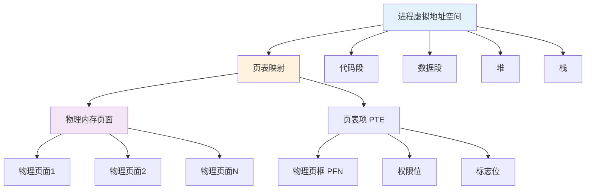
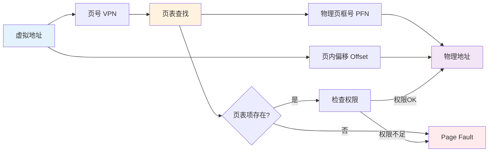
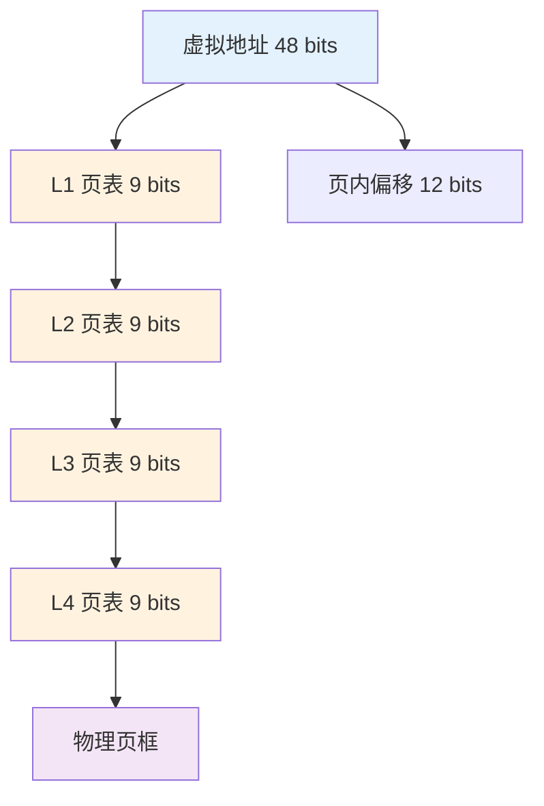
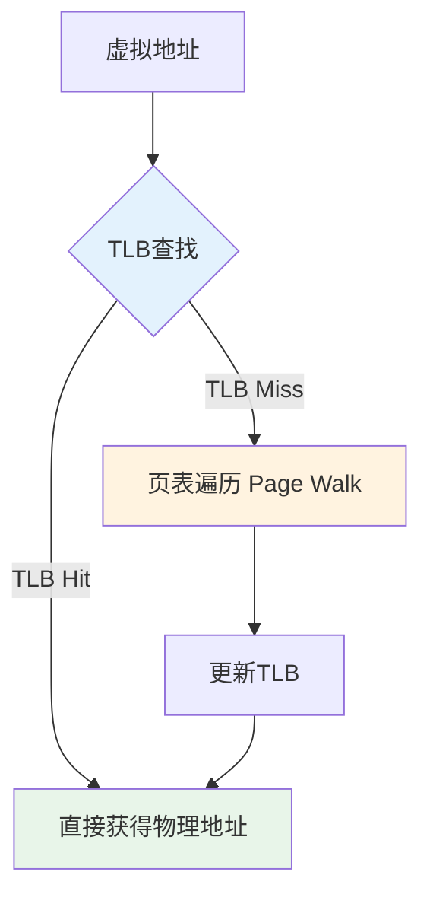
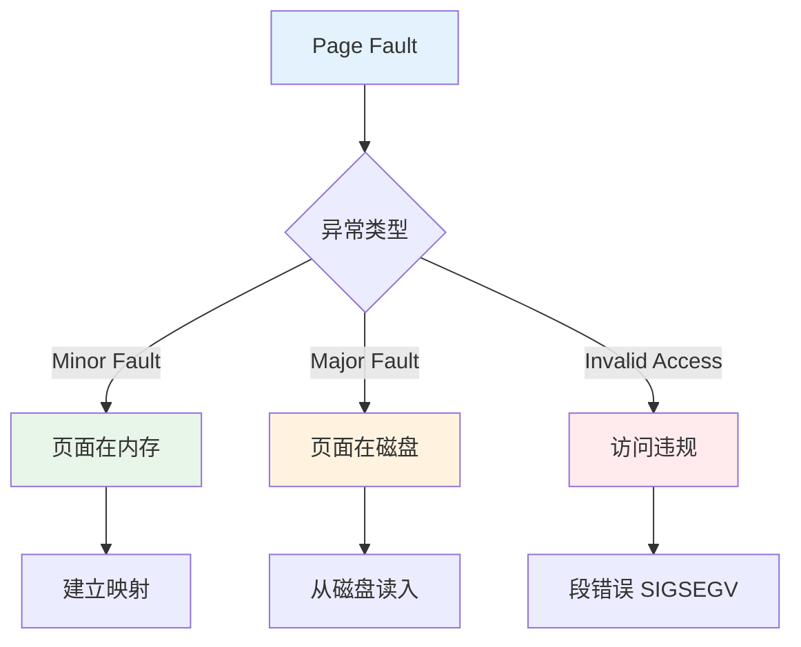
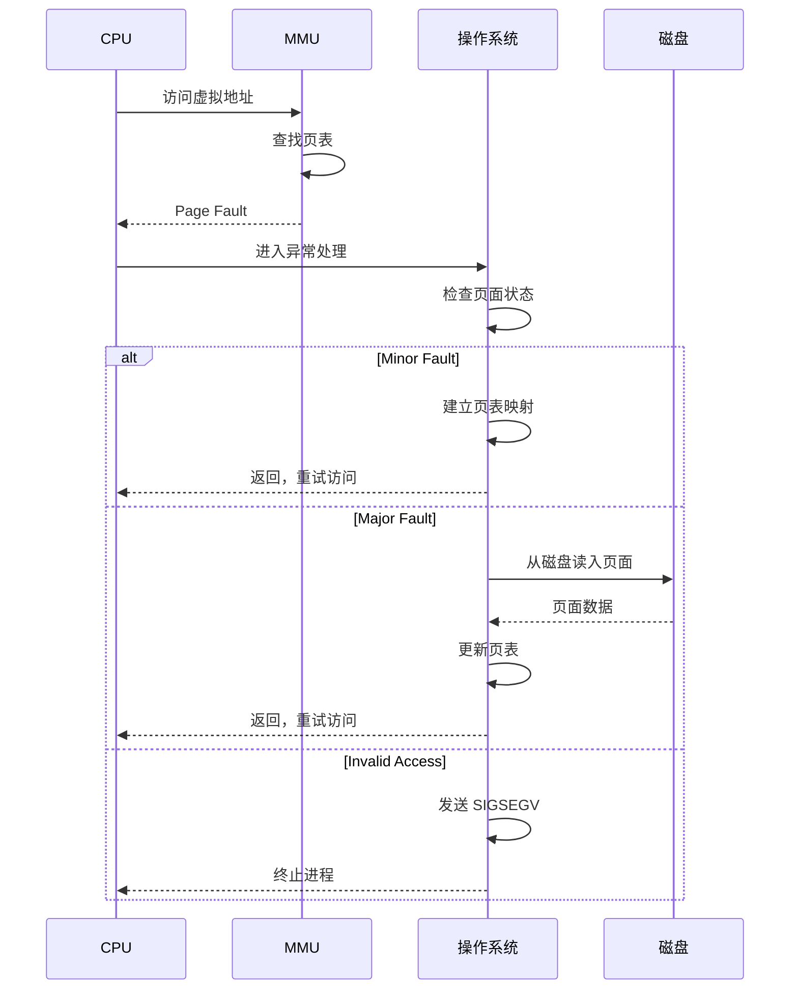

## 前言

虚拟内存是现代操作系统的"地基"，它通过地址空间隔离、按需加载等机制，为进程提供了安全、高效的内存管理。理解虚拟内存和页表的工作原理，不仅是掌握操作系统原理的关键，更是进行内存优化和问题排查的基础。本文将从原理、实现、性能等多个维度深入解析虚拟内存和页表，帮助读者全面理解这一重要机制。


## 1. 为什么需要虚拟内存

### 1.1 虚拟内存的核心收益

虚拟内存带来的核心收益：

- **隔离**：不同进程互不干扰（地址空间隔离）
- **抽象**：进程看到的是连续地址空间，物理内存可以是离散的
- **按需加载**：程序没用到的页面不必立刻加载（节省内存）
- **内存保护**：通过页表权限位实现读写保护
- **内存共享**：多个进程可以共享同一物理页面（如代码段、共享库）

### 1.2 虚拟内存的工程化理解

> 虚拟内存把"地址"从物理约束中解耦出来，让 OS 可以用页为单位做隔离、复用与迁移。

**虚拟内存的架构**：



### 1.3 虚拟地址 vs 物理地址

```cpp
// 虚拟地址空间示例
void* virtual_addr = malloc(1024);  // 虚拟地址，例如 0x7fff12340000

// 进程看到的虚拟地址空间是连续的
// 但实际物理内存可能是离散的：
// 虚拟页 0x1000 -> 物理页 0x5000
// 虚拟页 0x2000 -> 物理页 0x8000
// 虚拟页 0x3000 -> 物理页 0x2000（不连续）
```

## 2. 页表：虚拟地址到物理地址的映射

### 2.1 页表的基本原理

CPU 通过页表把虚拟页号（VPN）映射到物理页框号（PFN）：



**地址转换流程**：

1. **虚拟地址分解**：
   - 虚拟页号（VPN）：高位 bits，用于页表查找
   - 页内偏移（Offset）：低位 bits，直接作为物理地址的偏移

2. **页表查找**：
   - 使用 VPN 作为索引查找页表
   - 获取对应的物理页框号（PFN）

3. **物理地址计算**：
   - 物理地址 = PFN × 页大小 + Offset

### 2.2 多级页表

现代系统使用多级页表来降低页表占用：



**多级页表的优势**：

- **空间效率**：只为实际使用的地址空间分配页表项
- **灵活性**：不同进程可以有不同的页表结构
- **安全性**：通过页表权限位实现内存保护

**多级页表的代价**：

- **时间开销**：需要多次内存访问才能完成地址转换
- **TLB 重要性**：TLB 缓存可以大幅减少页表遍历次数

### 2.3 页表项（PTE）的结构

```cpp
// 页表项的结构（x86-64，简化）
struct PageTableEntry {
    uint64_t pfn : 40;        // 物理页框号
    uint64_t reserved : 3;   // 保留位
    uint64_t accessed : 1;   // 访问位（A bit）
    uint64_t dirty : 1;      // 脏位（D bit）
    uint64_t rw : 1;         // 读写位
    uint64_t user : 1;       // 用户位
    uint64_t present : 1;   // 存在位（P bit）
    uint64_t nx : 1;         // 不可执行位
    // ... 其他标志位
};
```

### 2.4 TLB：加速"查页表"的缓存

如果每次内存访问都要走多级页表，那性能会非常差。所以 CPU 有 TLB（Translation Lookaside Buffer）缓存常用的地址翻译结果：



**TLB 的工作机制**：

- **TLB hit**：直接得到物理地址，通常只需要 1-2 个 CPU 周期
- **TLB miss**：需要页表遍历（page walk），可能需要 10-100 个 CPU 周期

**TLB miss 的常见原因**：

- **随机访问**：访问模式不规律，TLB 缓存失效
- **大地址空间**：工作集超过 TLB 容量
- **频繁切换进程**：跨进程切换导致 TLB 刷新
- **大页使用**：使用大页可以减少 TLB miss

## 3. 缺页异常（page fault）意味着什么

缺页异常不一定是“错误”，更多是“需要 OS 介入”：

- 页面在磁盘上：把它读入物理内存，再更新页表
- 页面从未分配：可能需要分配新页（例如堆增长）
- 访问违规：例如越界或权限问题（这才是常见的 crash）

### 3.1 major vs minor page fault（性能视角很关键）

- **minor fault**：页面其实在内存里（例如共享页/已在 page cache），只是缺少映射或权限；代价相对小
- **major fault**：需要从磁盘读入页面；代价巨大，直接制造 P99/P999 长尾

## 4. 缺页异常（Page Fault）的详细分析

### 4.1 缺页异常的类型

缺页异常不一定是"错误"，更多是"需要 OS 介入"：



**缺页异常的类型**：

1. **Minor Fault（轻微缺页）**：
   - 页面其实在内存里（例如共享页/已在 page cache）
   - 只是缺少映射或权限需要更新
   - 代价相对小（通常 < 1 微秒）

2. **Major Fault（严重缺页）**：
   - 需要从磁盘读入页面
   - 代价巨大（通常 1-10 毫秒），直接制造 P99/P999 长尾

3. **Invalid Access（无效访问）**：
   - 访问违规：越界或权限问题
   - 触发段错误（SIGSEGV），程序崩溃

### 4.2 缺页异常的处理流程



## 5. 性能问题分析

### 5.1 缺页导致长尾：一次 major fault 就够你 P99 爆炸

当工作集超过内存、或发生抖动（容器内存限制/后台任务抢内存）时，major fault 会上升，用户会直接感受到"偶发很慢"。

**性能影响**：
- **Major fault**：一次磁盘 IO 可能需要 1-10 毫秒
- **Minor fault**：通常只需要微秒级
- **TLB miss**：页表遍历可能需要 10-100 个 CPU 周期

### 5.2 TLB miss：随机访问会把页表遍历成本放大

可以看到 IPC 下降、cycles 上升，程序像是在"等内存"。这和 cache miss 很像，但根因可能是 TLB。

**TLB miss 的优化**：
- **使用大页**：减少 TLB 项数量，提高命中率
- **提升局部性**：减少随机访问，提高 TLB 命中率
- **CPU 亲和性**：减少跨进程切换导致的 TLB 刷新

### 5.3 page cache 与匿名页：两类内存压力的表现不同

- **文件映射（page cache）压力大**：更像 IO/回写/缓存抖动问题
- **匿名页（heap）压力大**：更像 GC/分配抖动、swap（若开启）问题

## 6. 实际工程案例

### 6.1 内存映射文件（mmap）

```cpp
// 使用 mmap 进行文件映射
void* addr = mmap(nullptr, file_size, PROT_READ | PROT_WRITE,
                  MAP_PRIVATE, fd, 0);

// 优势：
// 1. 按需加载：只访问的部分才会读入内存
// 2. 零拷贝：直接映射到进程地址空间
// 3. 共享：多个进程可以共享同一文件映射
```

### 6.2 大页（Huge Page）优化

```cpp
// 使用大页减少 TLB miss
// 标准页：4KB，TLB 只能缓存 64-128 项
// 大页：2MB 或 1GB，TLB 可以覆盖更大的地址空间

// 配置大页
echo 1024 > /proc/sys/vm/nr_hugepages

// 程序中使用大页
void* addr = mmap(nullptr, size, PROT_READ | PROT_WRITE,
                  MAP_PRIVATE | MAP_HUGETLB, -1, 0);
```

## 7. 设计模式与架构原则

### 7.1 设计模式视角

虚拟内存体现了多个设计模式：

1. **抽象模式**：虚拟地址空间抽象了物理内存的复杂性
2. **代理模式**：页表作为虚拟地址到物理地址的代理
3. **缓存模式**：TLB 缓存常用的地址翻译结果

### 7.2 架构原则

- **隔离原则**：通过独立的地址空间实现进程隔离
- **按需加载**：只加载实际使用的页面，节省内存
- **性能优化**：通过 TLB、大页等机制优化性能

## 8. 排障顺序（线上出现"偶发很慢"）

1. **先看 page fault**：major/minor fault 是否上升？是否与 P99 同步？
2. **再看内存工作集**：是否超过物理内存或 cgroup 限制？
3. **看 TLB/cache**：是否出现明显的 TLB miss / cache miss 增长？
4. **最后看 swap/回写**：是否有 swap 或回写造成的队列化长尾？

## 9. 小结

虚拟内存是现代操作系统的"地基"，它通过地址空间隔离、按需加载等机制，为进程提供了安全、高效的内存管理。

**核心概念总结**：

- **虚拟内存原理**：通过页表将虚拟地址映射到物理地址，实现地址空间隔离
- **页表机制**：多级页表降低空间占用，TLB 缓存提高查找速度
- **缺页异常**：Minor fault 代价小，Major fault 代价大，需要从磁盘读入
- **性能优化**：通过大页、提升局部性等机制减少 TLB miss

**设计亮点**：

1. **地址空间隔离**：通过独立的虚拟地址空间保证进程安全
2. **按需加载**：只加载实际使用的页面，节省内存
3. **性能优化**：通过 TLB、大页等机制优化地址转换性能
4. **内存保护**：通过页表权限位实现读写保护
5. **内存共享**：多个进程可以共享同一物理页面

**关键要点**：

- 虚拟内存把"地址"从物理约束中解耦出来，让 OS 可以用页为单位做隔离、复用与迁移
- TLB 是地址转换的关键优化，TLB miss 会导致明显的性能下降
- Major fault 会带来巨大的性能开销，需要尽量避免
- 理解虚拟内存和页表是进行内存优化和问题排查的基础

掌握虚拟内存和页表的原理，可以更好地进行系统设计、内存优化和问题排查。

