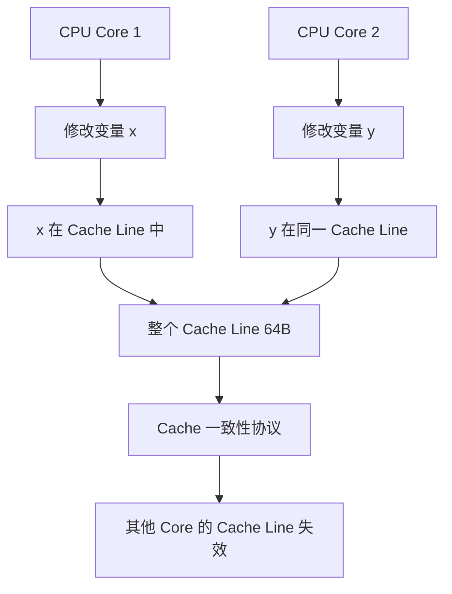
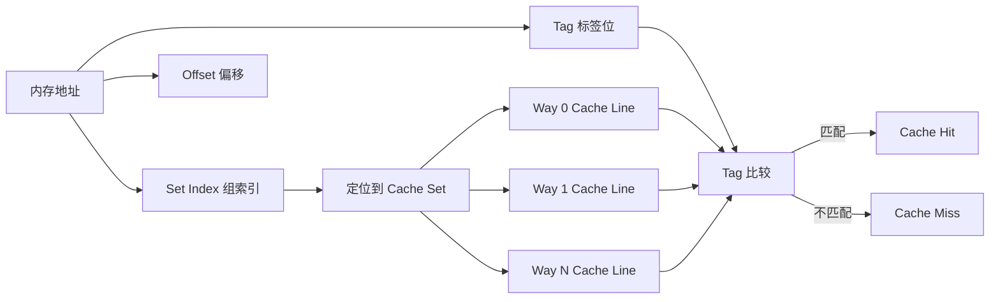
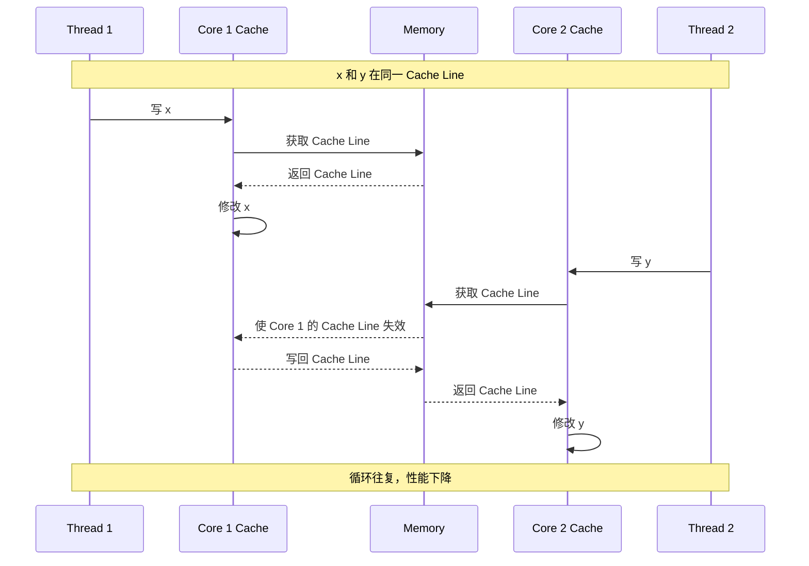
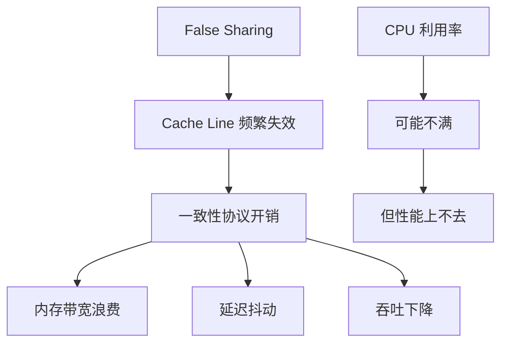
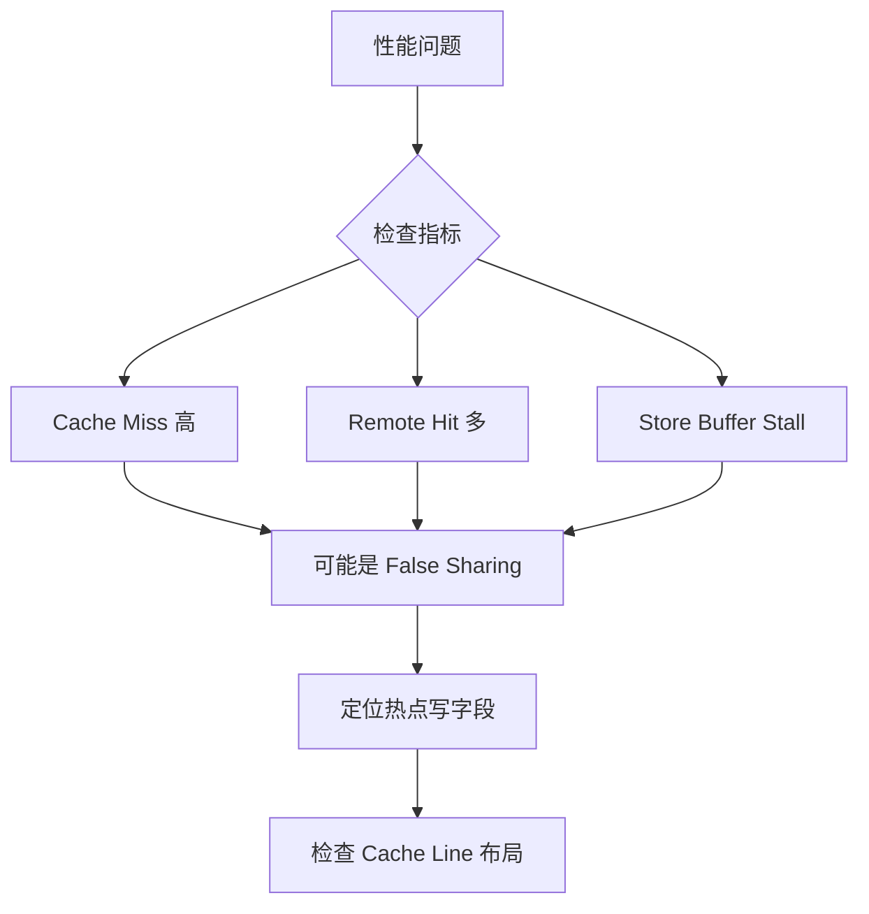
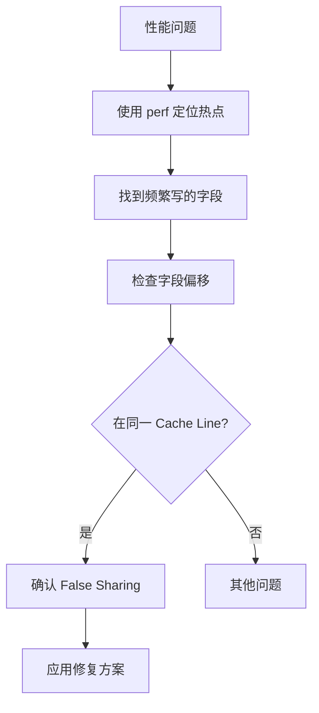
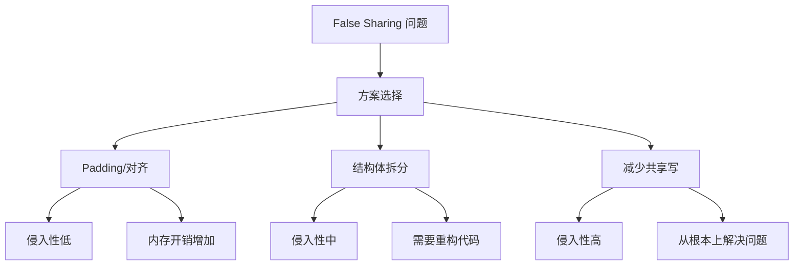

本文深入解析 Cache line 的工作原理、伪共享（false sharing）的机制与影响，以及工程实践中的定位与优化方法。


## 1. Cache line 的本质：CPU 不是按"变量"搬数据

CPU 的缓存一致性与搬运单位通常是 **cache line**（很多平台是 64B）。这意味着：

- 修改的是一个 8 字节变量
- 实际在核之间"来回抢"的，可能是包含它的整条 cache line



**关键理解**：
- Cache line 是缓存一致性的最小单位
- 即使只修改一个字节，整个 cache line 都会参与一致性协议
- 这导致了伪共享（false sharing）问题

## 2. Cache line 的组织与访问

### 2.1 Cache line 的结构



### 2.2 Cache line 的大小

常见平台的 cache line 大小：

| 平台 | Cache Line 大小 |
|------|----------------|
| x86-64 | 64 字节 |
| ARM | 64 字节（常见） |
| 某些嵌入式 | 32 字节 |

**为什么是 64B**：
- 平衡容量与延迟
- 匹配内存总线宽度
- 利用空间局部性

## 3. False sharing 的机制：写不同变量，却在抢同一条线

### 3.1 经典场景



### 3.2 False sharing 的性能影响

虽然逻辑上互不相关，但硬件层面会发生：

- cache line 在不同 core 之间反复失效/转移
- 写入需要一致性协议协调 → 延迟抖动、吞吐下降
- 内存带宽被浪费在无效的数据传输上



这类问题最"玄学"的地方是：**CPU 利用率可能不满，但性能就是上不去**。

## 4. 可以看到什么现象（线上信号）

### 4.1 典型症状

- 增加线程数，吞吐不升反降（扩展性变差）
- P99 抖动，且与写热点相关
- 同一段代码换个数据结构/换个字段顺序，性能突然变好

### 4.2 性能指标异常



## 5. 怎么定位：先找到"热点写"，再确认布局

最稳的定位顺序：

1. **先定位热点写变量/热点结构体**：哪个字段被频繁写？
2. **确认是否同一 cache line**：字段偏移是否落在同一 64B 范围
3. **看一致性相关指标**（能用就用）：比如 cache miss、remote hit、store buffer stall 等

### 5.1 定位工具

```cpp
// 示例：检查结构体布局
struct BadLayout {
    int counter1;  // offset: 0
    int counter2;  // offset: 4
    // ... 如果 counter1 和 counter2 在同一 cache line
    // 且被不同线程频繁写，就会 false sharing
};

// 使用 perf 工具定位
// perf c2c record -a ./program
// perf c2c report
```

### 5.2 定位流程



## 6. 怎么修：三种常见改法（按侵入性从低到高）

### 6.1 Padding/对齐（最常用）

```cpp
// 修复前：False Sharing
struct BadCounter {
    int counter1;  // 可能和 counter2 在同一 cache line
    int counter2;
};

// 修复后：Padding
struct GoodCounter {
    alignas(64) int counter1;  // 独占 cache line
    alignas(64) int counter2;  // 独占 cache line
};

// 或者使用 padding
struct GoodCounter2 {
    int counter1;
    char padding[64 - sizeof(int)];  // 填充到 cache line 边界
    int counter2;
};
```

### 6.2 结构体拆分（SoA/分离结构）

```cpp
// 修复前：AoS (Array of Structures)
struct Data {
    int hot_field1;  // 热点写
    int hot_field2;  // 热点写
    int cold_field1; // 只读
    int cold_field2; // 只读
};

// 修复后：SoA (Structure of Arrays)
struct DataSoA {
    int* hot_field1;  // 热点字段分离
    int* hot_field2;
    int* cold_field1; // 冷字段分离
    int* cold_field2;
};
```

### 6.3 减少共享写（从根上减少写争用）

```cpp
// 修复前：共享写
class Counter {
    std::atomic<int> count;  // 多线程写同一变量
public:
    void increment() { ++count; }
};

// 修复后：Thread-local 累积
class Counter {
    thread_local int local_count = 0;  // 每个线程独立累积
    std::atomic<int> global_count;
public:
    void increment() { ++local_count; }
    void flush() {
        global_count.fetch_add(local_count);
        local_count = 0;
    }
};
```

### 6.4 修复方案对比



## 7. 实际案例：性能优化前后对比

### 7.1 案例：多线程计数器

```cpp
// 问题代码
struct Counters {
    std::atomic<int> counter[8];  // 8 个计数器，可能在同一 cache line
};

// 优化后
struct Counters {
    struct alignas(64) Counter {
        std::atomic<int> value;
        char padding[64 - sizeof(std::atomic<int>)];
    };
    Counter counters[8];  // 每个独占 cache line
};
```

**性能提升**：
- 吞吐提升：2-4 倍（取决于线程数）
- 延迟降低：P99 延迟降低 50-70%

### 7.2 案例：生产者-消费者队列

```cpp
// 问题代码
struct Queue {
    std::atomic<int> head;  // 生产者写
    std::atomic<int> tail;  // 消费者写
    // head 和 tail 可能在同一 cache line
};

// 优化后
struct Queue {
    alignas(64) std::atomic<int> head;  // 独占 cache line
    alignas(64) std::atomic<int> tail;  // 独占 cache line
};
```

## 8. 最小排障清单

1. 线程数增加时吞吐是否变差？
2. 是否存在多个线程写同一对象内相邻字段？
3. padding/拆分后是否立刻改善（A/B 验证最有效）？

## 9. 设计原则与最佳实践

### 9.1 设计原则

- **热点字段隔离**：频繁写的字段应该独占 cache line
- **冷热分离**：热点字段和冷字段应该分开存储
- **对齐意识**：结构体设计时考虑 cache line 边界

### 9.2 最佳实践

1. **使用 alignas(64)**：确保关键字段对齐到 cache line 边界
2. **使用工具验证**：perf c2c、Intel VTune 等工具定位问题
3. **A/B 测试**：修改后验证性能是否真正提升

## 10. 小结

False sharing 的本质是"硬件层面的共享写"，它常常让并发优化从"多线程更快"变成"多线程更慢"。排障时抓住两件事：**热点写字段** 与 **cache line 布局**，基本就能把问题从玄学变成工程。

**核心要点**：
- Cache line 是缓存一致性的最小单位，不是单个变量
- False sharing 会导致 cache line 频繁失效，性能下降
- 通过 padding、对齐、结构体拆分等方法可以解决
- 使用工具定位问题，用 A/B 测试验证修复效果
