本文深入解析 TLS 握手的工作原理、延迟来源、会话复用机制和工程优化实践。


## 1. TLS 给你什么：不仅是"加密"，更是"身份 + 完整性"

工程语义上，TLS 主要提供三件事：

- **机密性**：第三方拿不到明文（对称加密）
- **完整性**：内容被篡改能被发现（MAC/AEAD）
- **身份认证**：你连到的是"对的服务器"（证书链验证）

### 1.1 TLS 的安全目标

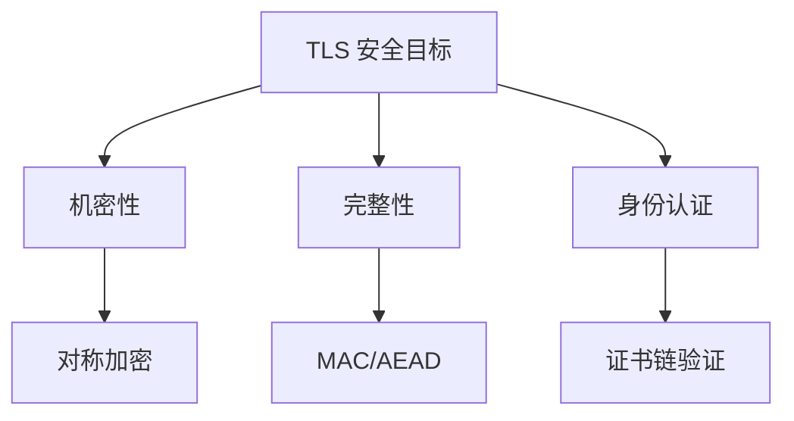

### 1.2 TLS 的层次结构

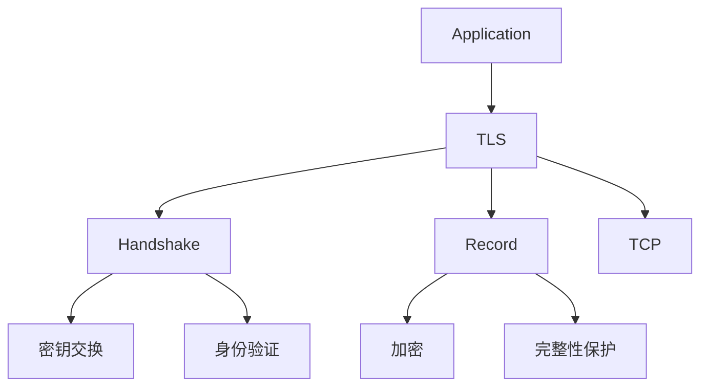

## 2. 握手为什么会慢：两个硬成本（RTT + CPU）

### 2.1 RTT 成本：跨地域一切都慢

握手需要若干次往返（取决于版本与是否恢复会话）。因此：

- **跨地域 RTT 高** → 握手延迟天然高
- 丢包/重传/队列化 → 会把握手的 P99 拉得更长

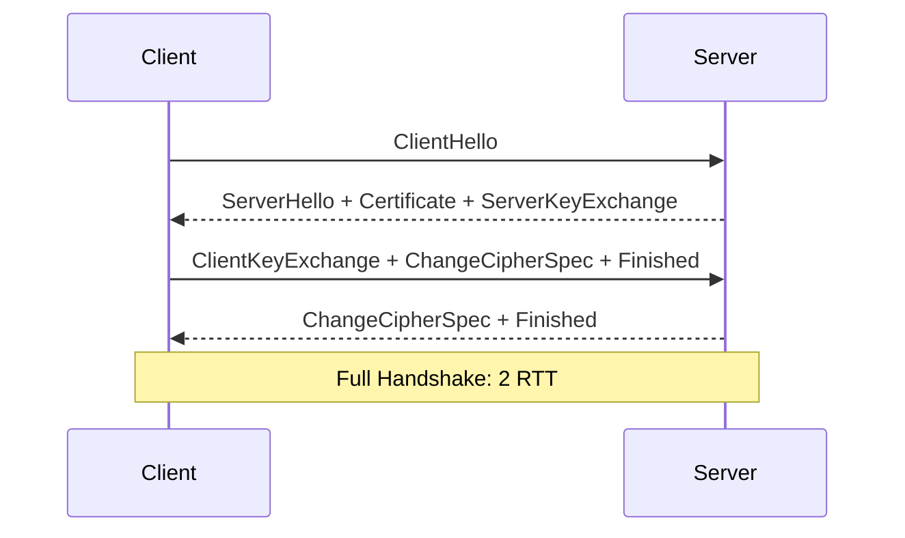

### 2.2 CPU 成本：密钥交换与证书链验证

握手阶段的 CPU 开销主要来自：

- 密钥交换（例如 ECDHE）
- 证书链验证（签名验证、证书链构建；OCSP/CRL 取决于实现）

如果在高 QPS 下频繁"新建连接"，CPU 会非常快地被握手打满。

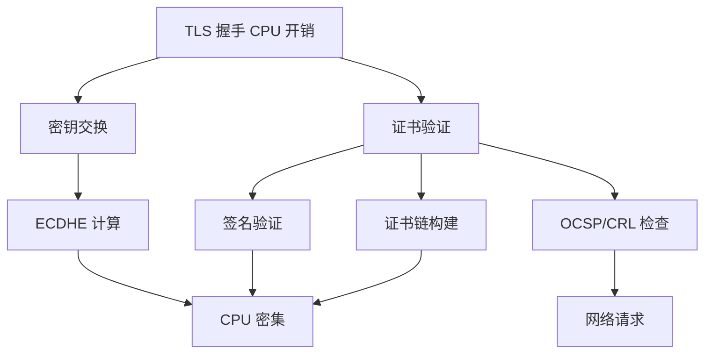

### 2.3 握手延迟分解

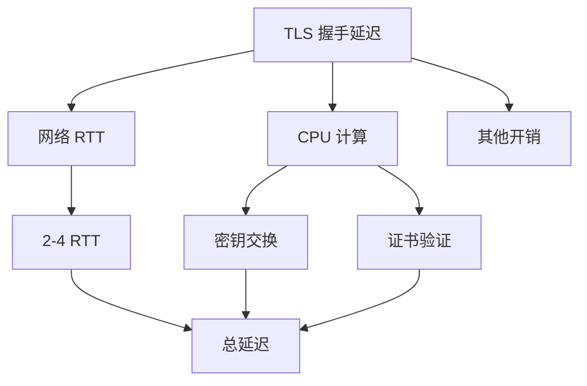

## 3. 会话复用/会话恢复：把"握手成本"从热路径搬走

工程上最关心的不是 TLS 理论，而是：**如何让业务请求尽量不在热路径上做完整握手**。

常见手段：

- **连接复用（keep-alive / 连接池）**：让多个请求共享同一条 TLS 连接
- **会话恢复（session resumption）**：新连接尽量走恢复路径（减少 RTT 与 CPU）

如果看到"握手占比很高"，大概率是连接复用没做好（或者被短连接/负载均衡策略破坏了）。

### 3.1 连接复用

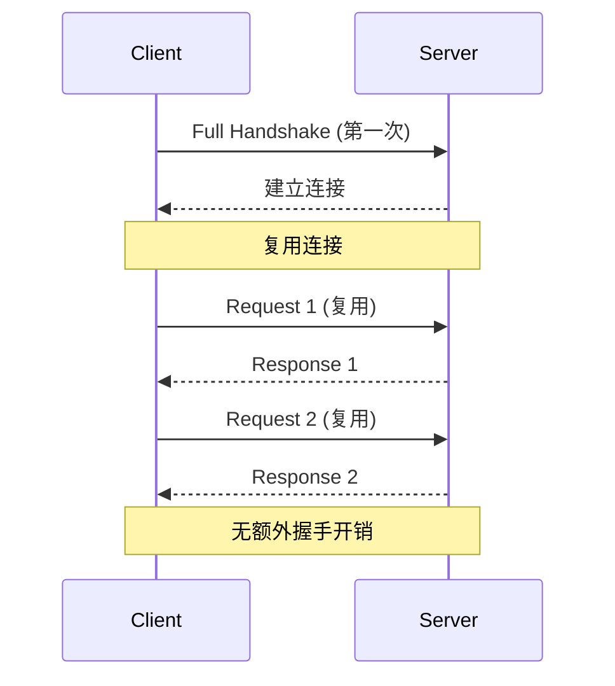

### 3.2 会话恢复

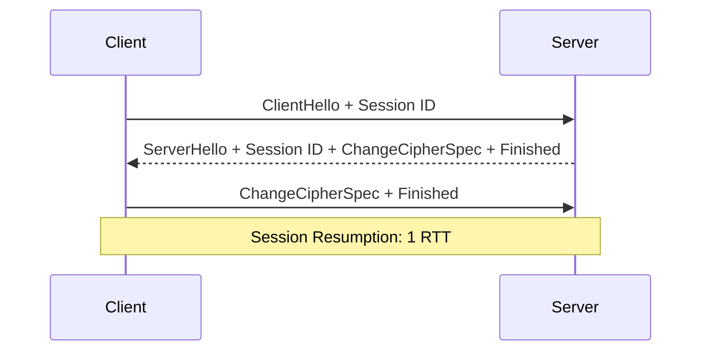

### 3.3 性能对比

| 方式 | RTT | CPU | 适用场景 |
|------|-----|-----|---------|
| Full Handshake | 2 RTT | 高 | 首次连接 |
| Session Resumption | 1 RTT | 低 | 会话恢复 |
| Connection Reuse | 0 RTT | 无 | 连接复用 |

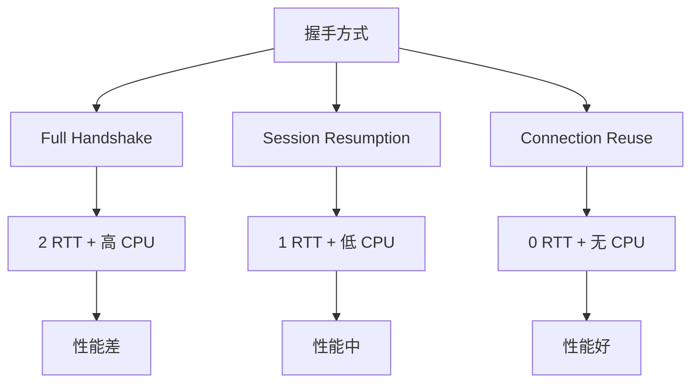

## 4. 应当观测什么（比"平均握手耗时"更有用）

- **握手延迟分位数**：P50/P95/P99，而不是平均值
- **握手失败率**：证书/协议/时间/中间盒子问题往往体现在失败率
- **新建连接比例**：是否异常偏高（连接复用是否有效）
- **CPU（尤其是单核热点）**：握手/加解密是否把某些核打爆

### 4.1 观测指标

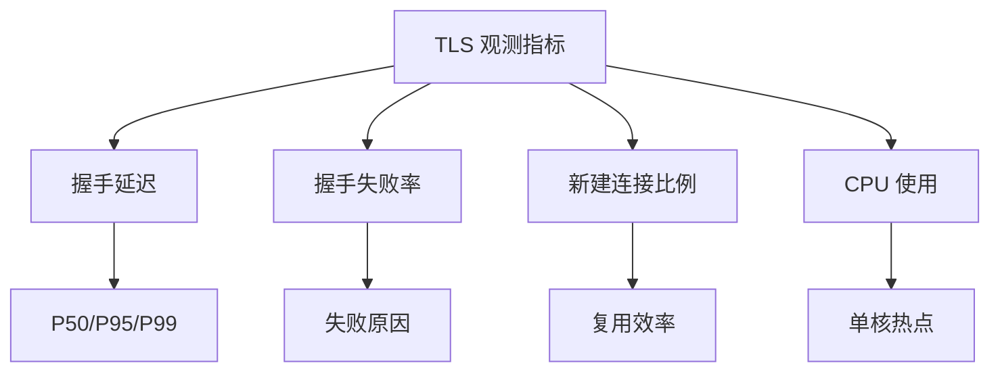

### 4.2 测量工具

```bash
# 查看 TLS 握手信息
openssl s_client -connect server:443 -showcerts

# 使用 tcpdump 分析
tcpdump -i eth0 -w tls.pcap 'tcp port 443'

# 应用层指标
# 握手延迟、失败率、连接复用率
```

## 5. 排障顺序（握手慢/失败/CPU 高）

1. **先看 RTT 与丢包/重传**：网络层面的长尾会直接放大握手 P99
2. **再看新建连接比例**：是否被短连接/错误的 LB 策略导致频繁 full handshake
3. **再看证书链与配置**：证书链过长、错误的中间证书、过期/时间偏差等
4. **最后看 CPU 与加密套件**：是否需要更合适的加密套件/硬件加速/线程模型调整

### 5.1 排障流程

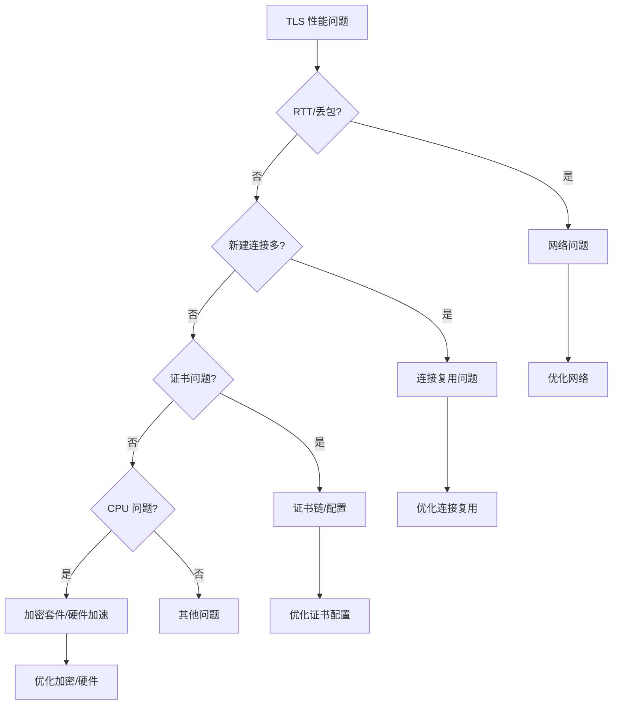

## 6. TLS 1.3 的改进

### 6.1 TLS 1.3 vs TLS 1.2

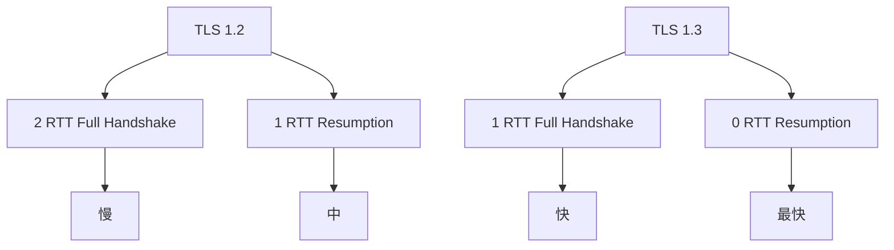

### 6.2 TLS 1.3 的优势

- **更快的握手**：1 RTT full handshake
- **0 RTT 恢复**：会话恢复无需 RTT
- **更强的安全性**：移除不安全的加密套件
- **更少的 CPU**：优化的密钥交换

## 7. 实际案例

### 7.1 案例：连接复用导致的性能问题

**问题**：TLS 握手 CPU 占用高

**分析**：
- 新建连接比例 > 80%
- 连接池配置不当
- 负载均衡策略导致连接频繁断开

**优化**：
- 优化连接池配置
- 调整负载均衡策略
- 启用会话恢复

**结果**：
- 新建连接比例降到 10%
- CPU 占用降低 70%

### 7.2 案例：证书链过长导致的延迟问题

**问题**：TLS 握手 P99 延迟高

**分析**：
- 证书链包含 4 个证书
- 证书链传输和验证耗时
- 网络 RTT 正常

**优化**：
- 优化证书链（移除不必要的中间证书）
- 使用 OCSP stapling
- 启用 TLS 1.3

**结果**：P99 延迟降低 40%

## 8. 设计原则与最佳实践

### 8.1 优化原则

1. **优先连接复用**：减少握手次数
2. **启用会话恢复**：减少握手 RTT 和 CPU
3. **优化证书配置**：缩短证书链
4. **使用 TLS 1.3**：更快的握手

### 8.2 最佳实践

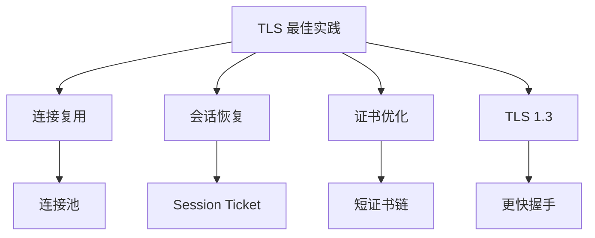

## 9. 小结

TLS 性能优化的主线很清晰：**优先把 full handshake 从热路径移走（复用/恢复）**，其次才是抠 CPU（套件/实现/硬件）。排障时抓住 RTT、连接新建比例、失败率这三个信号，基本就能把问题快速归因。

**核心要点**：
- TLS 提供机密性、完整性、身份认证
- 握手延迟来自 RTT 和 CPU 计算
- 连接复用和会话恢复是关键优化
- TLS 1.3 提供更快的握手

**优化策略**：
1. 优先连接复用（连接池）
2. 启用会话恢复（Session Ticket）
3. 优化证书配置（短证书链）
4. 使用 TLS 1.3
