本文深入解析 io_uring 的设计原理、工作机制、适用场景和工程实践。


## 1. io_uring 的核心：把"提交/完成"变成共享内存队列

传统异步 IO（以及很多同步 IO 的用法）最大的问题之一是：**每个 IO 都要付出系统调用与上下文切换成本**。在小 IO + 高并发场景下，这个成本会吞掉大量 CPU。

io_uring 的设计直觉是：

- 用户态与内核态共享两条 ring：
  - **SQ（Submission Queue）**：提交 IO 请求
  - **CQ（Completion Queue）**：回收 IO 完成事件
- 通过批量提交与批量回收，把 "N 次 syscall" 变成 "少量 syscall/甚至轮询"

因此它更像一个"高性能 IO 事件通道"，而不只是某个接口。

### 1.1 传统异步 IO 的问题

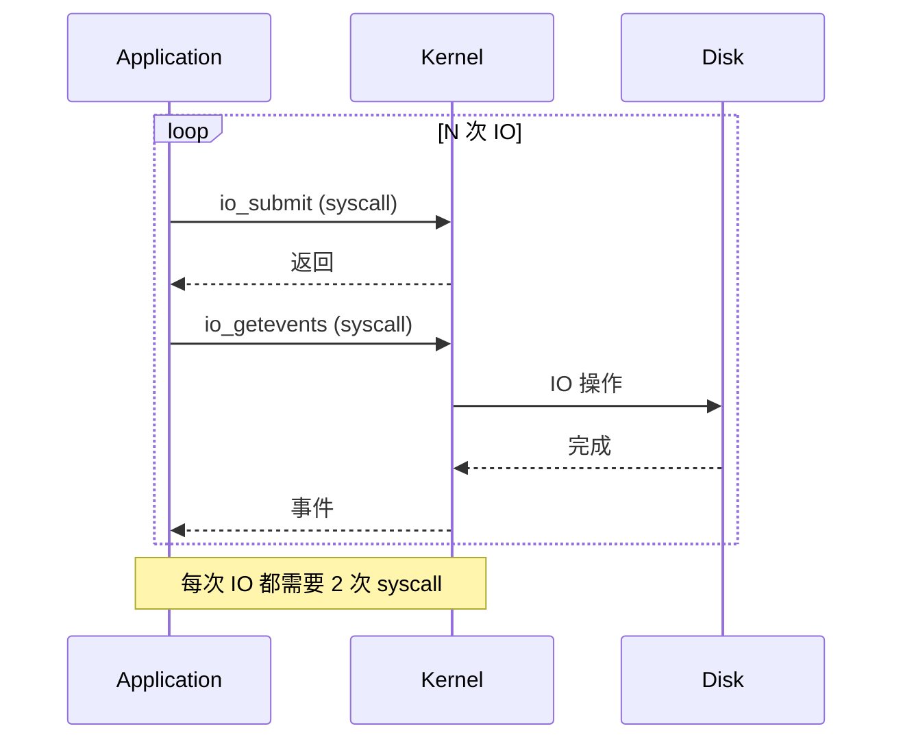

### 1.2 io_uring 的解决方案

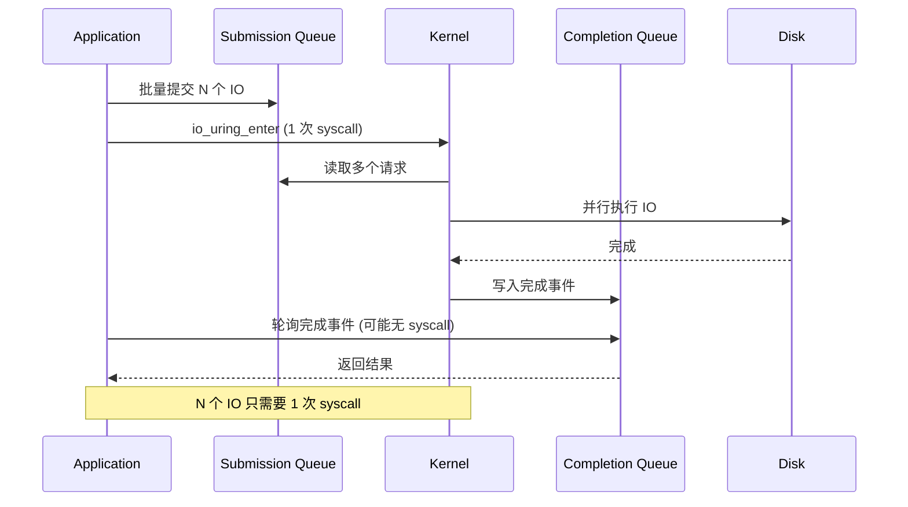

### 1.3 共享内存队列结构

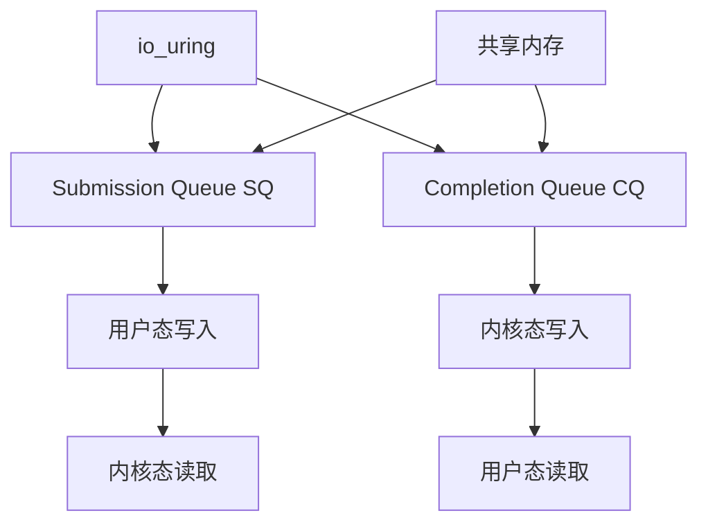

## 2. 什么情况下收益最大：需要先确认瓶颈在 syscall/切换

io_uring 更容易显著提升的场景：

- **小 IO、很多次**：例如 4KB~64KB 的随机读写
- **高并发**：大量 in-flight IO
- **IO 本身不慢**：NVMe/高速网盘，否则瓶颈仍在设备

而收益有限甚至更差的场景：

- **大 IO/顺序 IO**：系统调用占比本来就低
- **文件系统/设备已经是瓶颈**：再省 syscall 也救不了
- **错误的使用模式**：提交/回收处理不及时导致 CQ 堆积（把延迟变成队列化）

### 2.1 性能对比

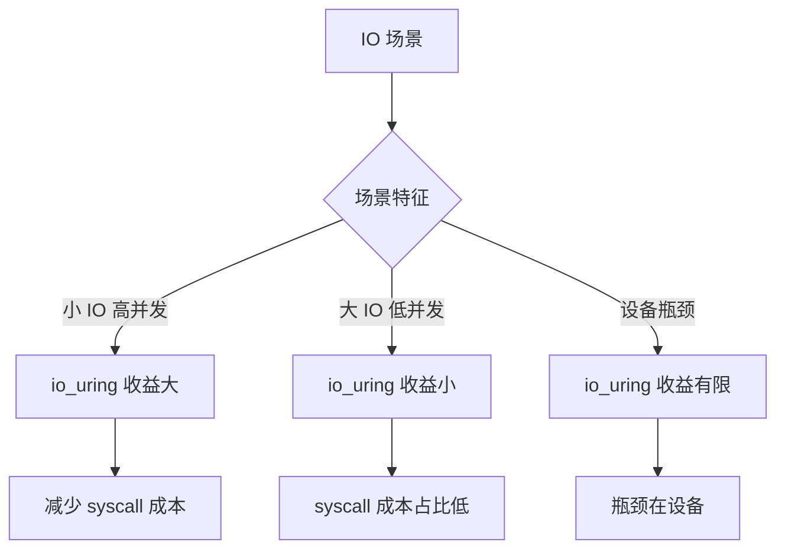

### 2.2 性能提升示例

| 场景 | 传统 AIO | io_uring | 提升 |
|------|---------|---------|------|
| 小 IO (4KB) 高并发 | 100K IOPS | 150K IOPS | 50% |
| 大 IO (1MB) 低并发 | 500 MB/s | 520 MB/s | 4% |
| 设备瓶颈 | 100 MB/s | 100 MB/s | 0% |

## 3. 两个最常见的误区

### 3.1 把 io_uring 当成"万能异步 IO"

它能减少 syscall 成本，但它不会改变：

- 文件系统语义
- 设备队列化与抖动
- page cache / flush / journal 带来的长尾

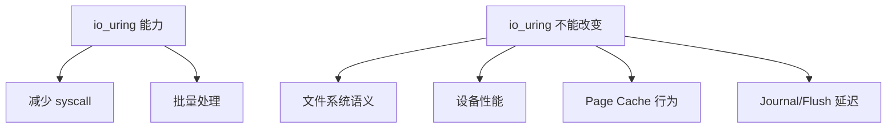

### 3.2 CQ 回收不及时：把系统从"快"用成"抖"

如果 completion 处理不及时：

- CQ 堆积 → 应用看到的完成延迟上升
- 进一步导致上层超时/重试放大

所以 io_uring 的"写法"比"开不开"更重要：提交、回收、以及背压要形成闭环。

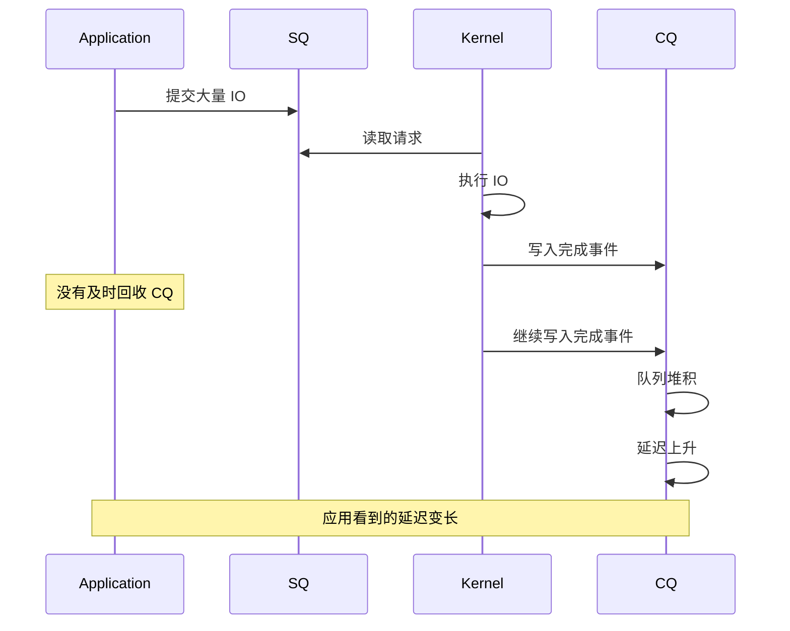

## 4. io_uring 的工作模式

### 4.1 中断模式（默认）

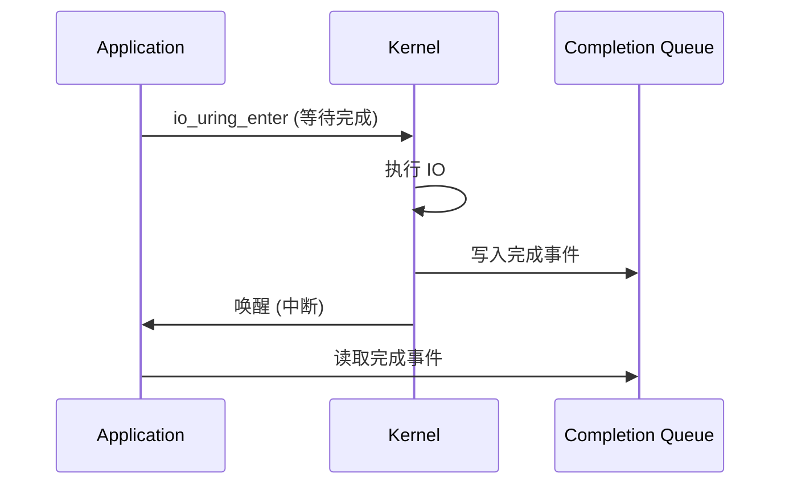

### 4.2 轮询模式（IORING_SETUP_IOPOLL）

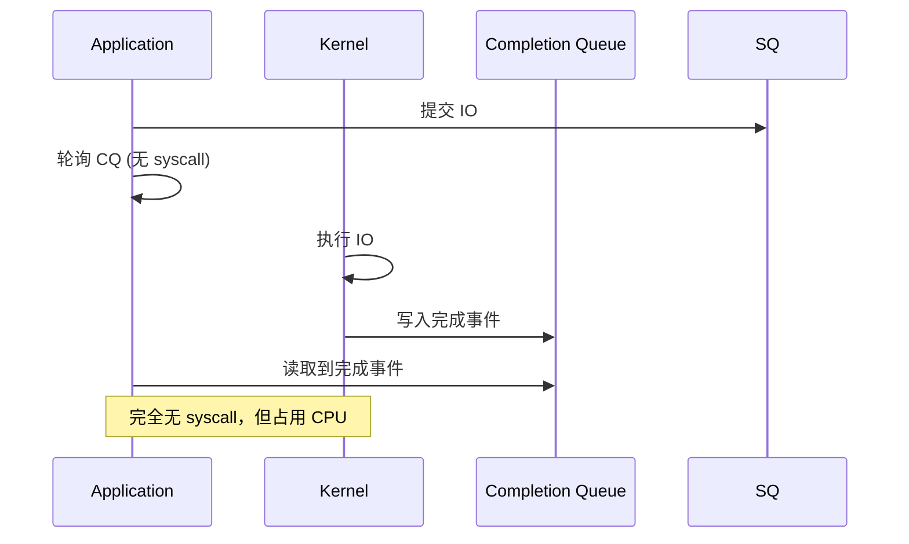

### 4.3 内核轮询模式（IORING_SETUP_SQPOLL）

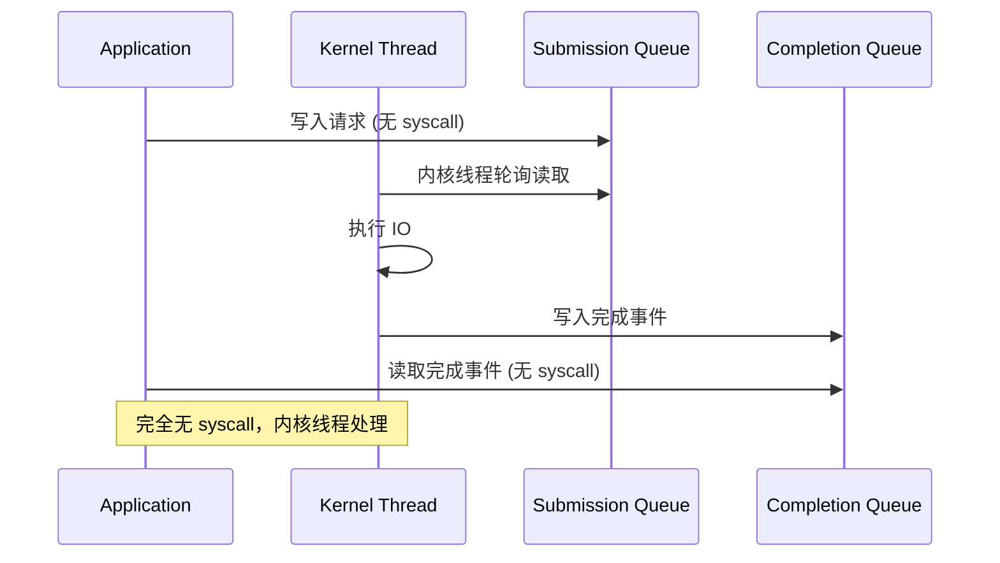

## 5. 怎么观测：判断到底省到了什么

建议先回答三个问题：

1. **CPU 花在哪**：syscall/上下文切换占比是否下降？
2. **IO 本身是否慢**：设备侧延迟分位数是否才是主导？
3. **是否出现队列化**：SQ/CQ 是否堆积？in-flight 是否长期高位？

如果平台允许，观察这些信号很有用：

- context switch 频率（切换是否下降）
- 系统调用占比（用户态/内核态时间）
- IO 延迟分位数（P99/P999）

### 5.1 观测指标

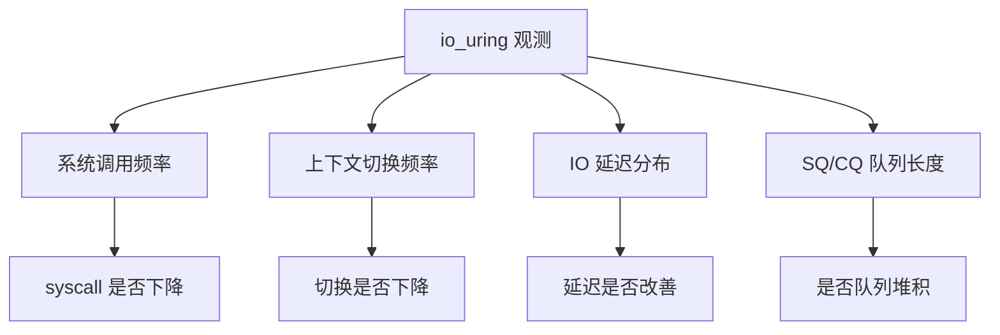

### 5.2 测量工具

```bash
# 查看系统调用
strace -c ./program

# 查看上下文切换
sar -w 1

# 查看 IO 延迟
iostat -x 1

# io_uring 特定指标
perf stat -e io_uring:io_uring_submit,io_uring:io_uring_complete ./program
```

## 6. 排障顺序（io_uring "上了但没变快/变抖"）

1. **先确认瓶颈是否在 syscall**：如果 IO 本身慢，收益有限
2. **看 CQ 是否堆积**：是否"回收不及时"导致排队？
3. **看文件系统/回写/journal**：是否长尾来自 flush/回写？
4. **最后再看参数与模式**：是否需要批量提交、是否需要轮询、是否需要更明确的背压策略

### 6.1 排障流程

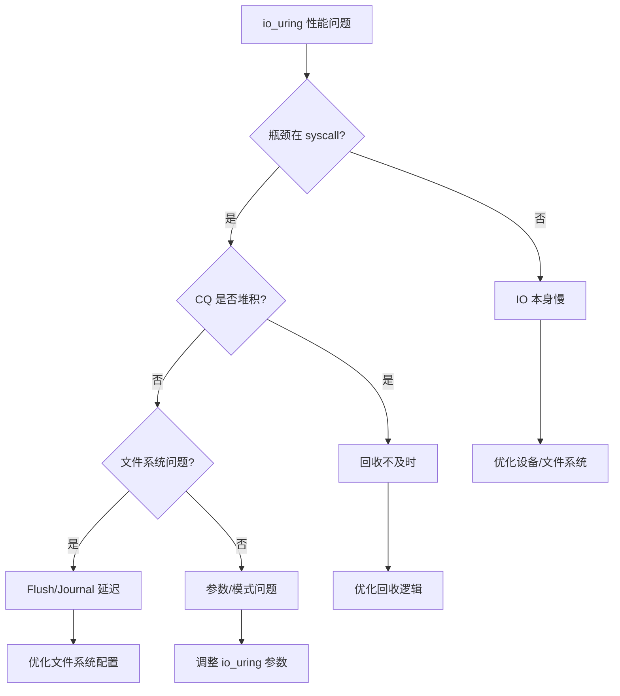

## 7. 实际案例

### 7.1 案例：数据库日志写入优化

**问题**：数据库 WAL 写入性能差，syscall 开销大

**分析**：
- 大量小 IO（4KB-16KB）
- 高并发写入
- syscall 占比 > 30%

**优化**：
- 使用 io_uring 批量提交
- 使用内核轮询模式
- 优化 CQ 回收逻辑

**结果**：
- syscall 占比降到 5%
- IOPS 提升 3 倍
- 延迟降低 50%

### 7.2 案例：CQ 堆积导致的延迟问题

**问题**：使用 io_uring 后延迟反而上升

**分析**：
- CQ 队列长度长期 > 1000
- 应用没有及时回收完成事件
- 导致延迟累积

**优化**：
- 增加 CQ 回收频率
- 使用事件驱动模式
- 添加背压机制

**结果**：延迟恢复正常

## 8. 设计原则与最佳实践

### 8.1 设计原则

1. **批量提交**：一次提交多个 IO，减少 syscall
2. **及时回收**：避免 CQ 堆积
3. **背压控制**：控制 in-flight IO 数量

### 8.2 最佳实践

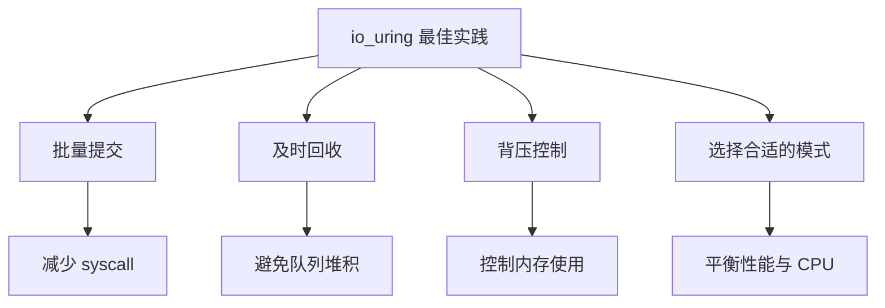

## 9. 小结

io_uring 的价值在于把 IO 的提交/完成做成"低开销通道"。它最适合的不是"IO 很慢"的场景，而是"IO 很多、系统调用很贵"的场景。要用好它，关键是让提交/回收形成闭环，避免把延迟变成队列化。

**核心要点**：
- io_uring 通过共享内存队列减少 syscall 成本
- 适合小 IO、高并发场景
- 需要及时回收 CQ，避免队列堆积
- 选择合适的模式（中断/轮询/内核轮询）

**使用建议**：
1. 确认瓶颈在 syscall，而不是设备
2. 批量提交，及时回收
3. 监控 SQ/CQ 队列长度
4. 根据场景选择合适的模式
