本文深入解析性能诊断的核心指标：IPC、cache miss 和 branch miss，以及它们之间的关系和诊断方法。


## 1. IPC 是什么，为什么它很有用

IPC（Instructions Per Cycle）≈ 每个周期退休多少条指令。它不是"越高越好"的 KPI，但它能快速告诉你：

- 程序是在 **算（compute-bound）**，还是在 **等（stall-bound）**

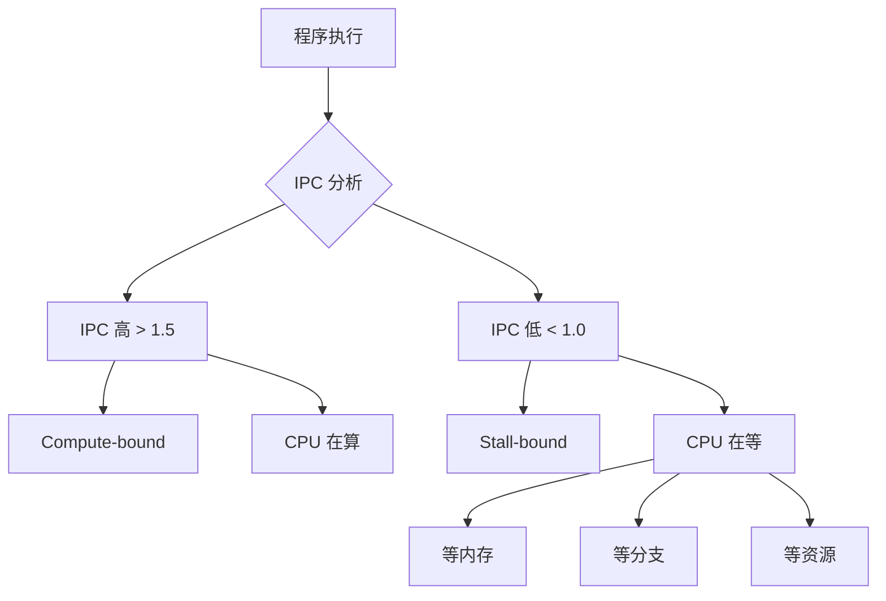

**IPC 的典型范围**：
- **IPC > 2.0**：通常表示计算密集型，流水线利用率高
- **IPC 1.0-2.0**：正常范围，有一定 stall
- **IPC < 1.0**：严重 stall，需要深入分析原因

### 1.1 IPC 的计算

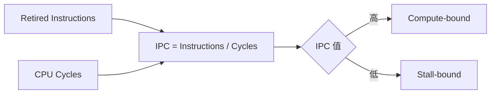

**测量方法**：
```bash
# 使用 perf 测量 IPC
perf stat -e instructions,cycles ./program

# 输出示例
# 1,000,000 instructions
# 800,000 cycles
# IPC = 1.25
```

## 2. Cache miss 与 IPC：最常见的"等"

当 L1/L2/LLC miss 上升时，CPU 需要去更慢的层级取数据：

- L1 miss → 可能去 L2
- L2 miss → 可能去 LLC
- LLC miss → 可能去 DRAM（最贵）

表现出来通常是：**stalled cycles 上升，IPC 下降**。

### 2.1 Cache 层次与延迟

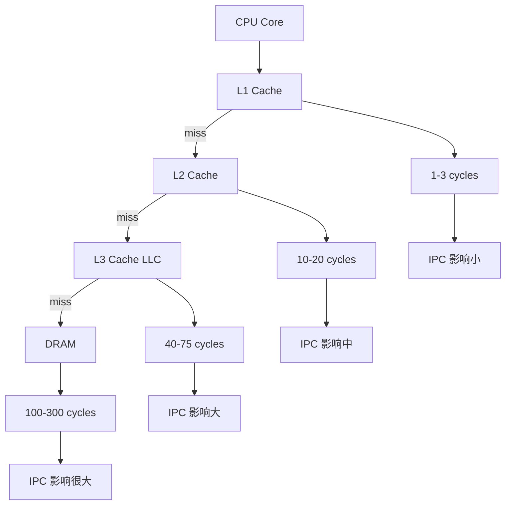

### 2.2 Cache miss 的类型

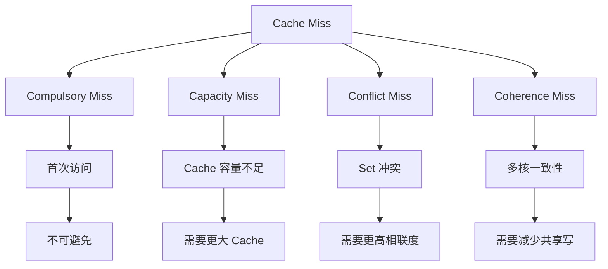

### 2.3 Cache miss 对 IPC 的影响

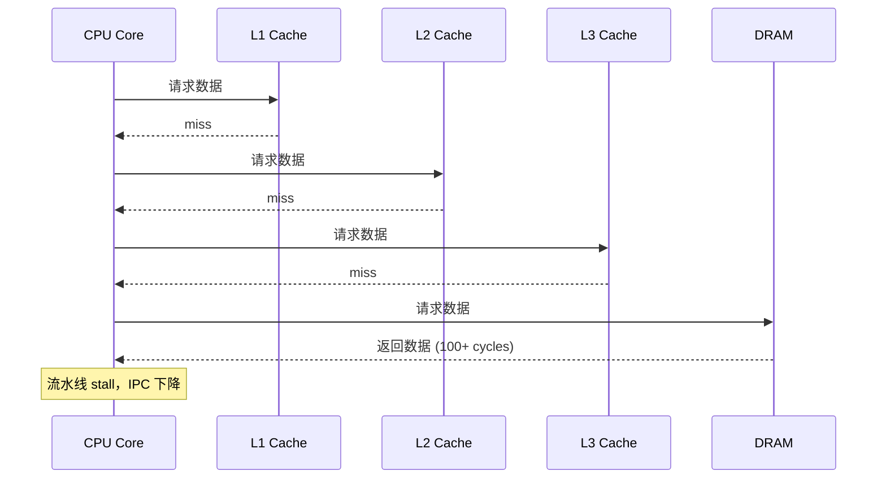

**典型症状**：
- L1 miss rate > 5%：需要关注数据局部性
- L2 miss rate > 10%：可能需要优化数据结构
- LLC miss rate > 5%：可能需要减少内存访问

## 3. Branch miss 与 IPC：另一种"等"

分支预测失败会导致流水线 flush：之前投机执行的工作作废。

表现通常是：

- branch-misses 上升
- IPC 下降（但不一定伴随大量 cache miss）

### 3.1 分支预测失败的代价

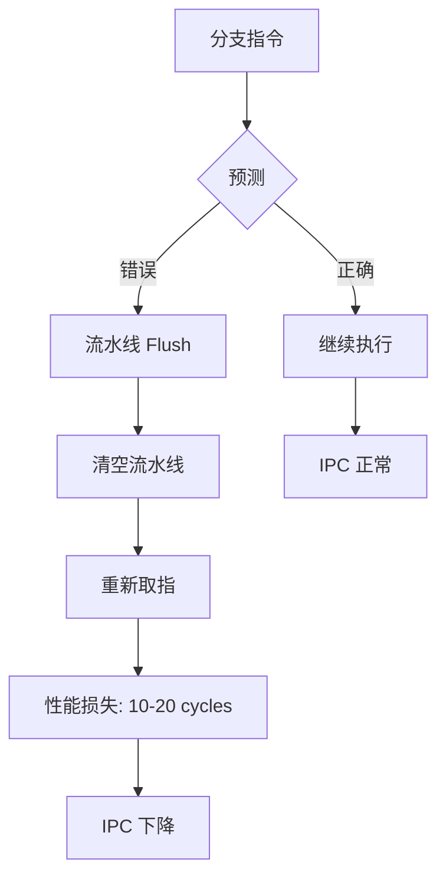

### 3.2 分支 miss 率的影响

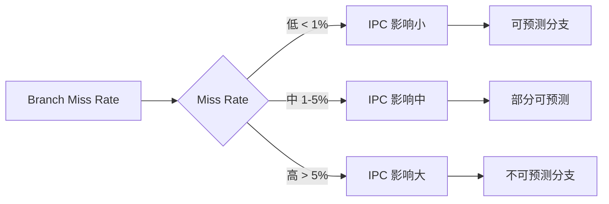

**典型场景**：
- Hash 表查找：分支走向依赖数据，难以预测
- 状态机：状态转换复杂，分支不可预测
- 随机数据：分支走向完全随机

## 4. 指标之间的关系

### 4.1 IPC 与 Cache Miss 的关系

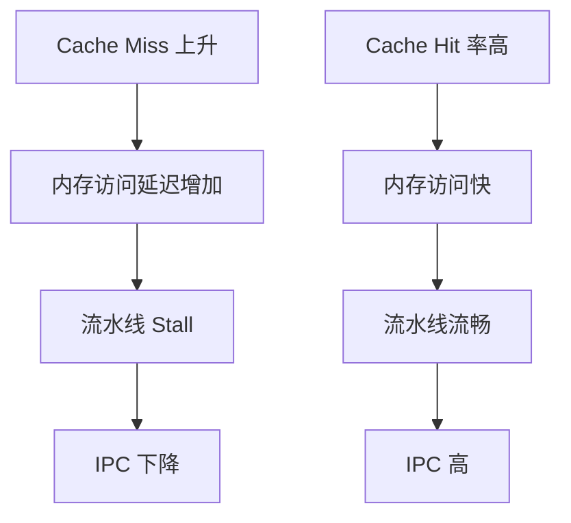

### 4.2 IPC 与 Branch Miss 的关系

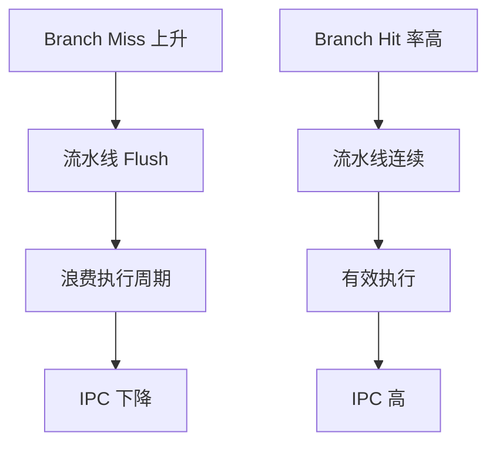

### 4.3 综合诊断模型

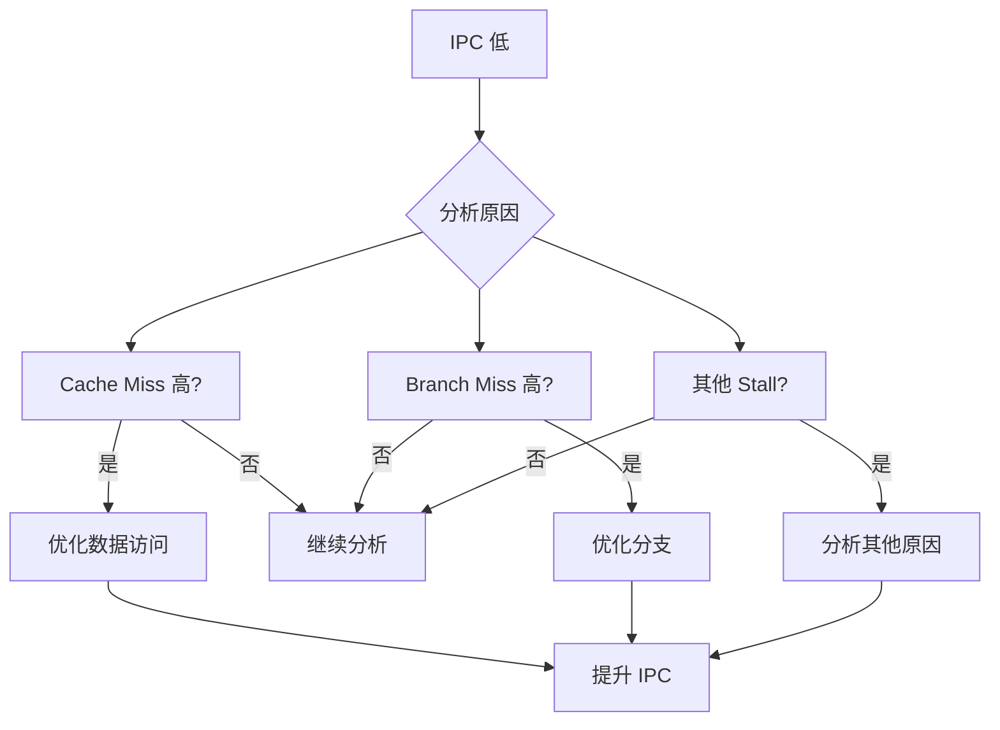

## 5. 排查清单（建议照顺序）

### 5.1 第一步：判定类型

先判定"等"为主还是"算"为主：

```bash
# 测量 stalled cycles
perf stat -e stalled-cycles-frontend,stalled-cycles-backend ./program

# 如果 stalled cycles 占比 > 50%，说明是 stall-bound
```

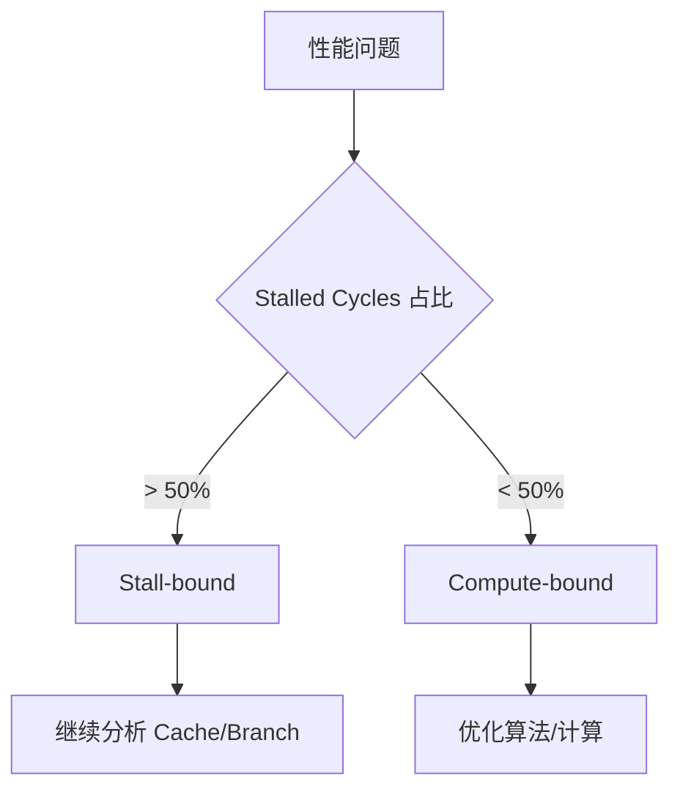

### 5.2 第二步：分析 Cache

```bash
# 测量各级 Cache Miss
perf stat -e L1-dcache-loads,L1-dcache-load-misses,LLC-loads,LLC-load-misses ./program

# 计算 Miss Rate
# L1 Miss Rate = L1-dcache-load-misses / L1-dcache-loads
# LLC Miss Rate = LLC-load-misses / LLC-loads
```

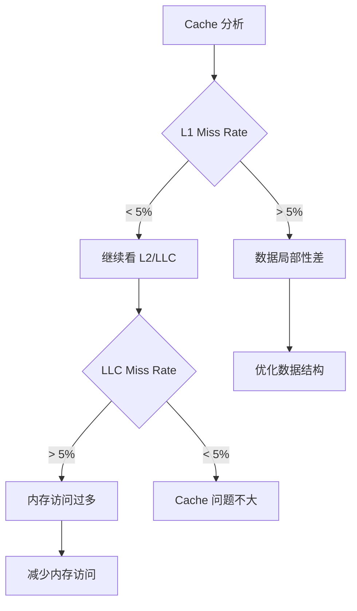

### 5.3 第三步：分析分支

```bash
# 测量分支预测
perf stat -e branches,branch-misses ./program

# 计算 Branch Miss Rate
# Branch Miss Rate = branch-misses / branches
```

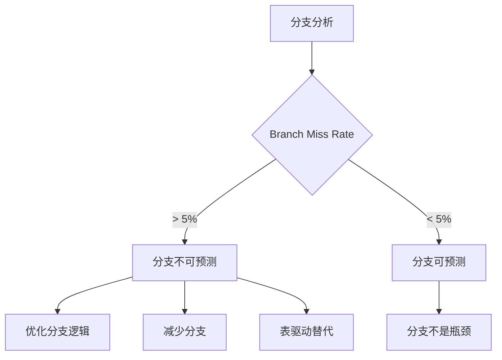

### 5.4 第四步：定位热点函数

```bash
# 使用 perf record 记录热点
perf record -g ./program
perf report

# 或生成火焰图
perf record -g ./program
perf script | stackcollapse-perf.pl | flamegraph.pl > flame.svg
```

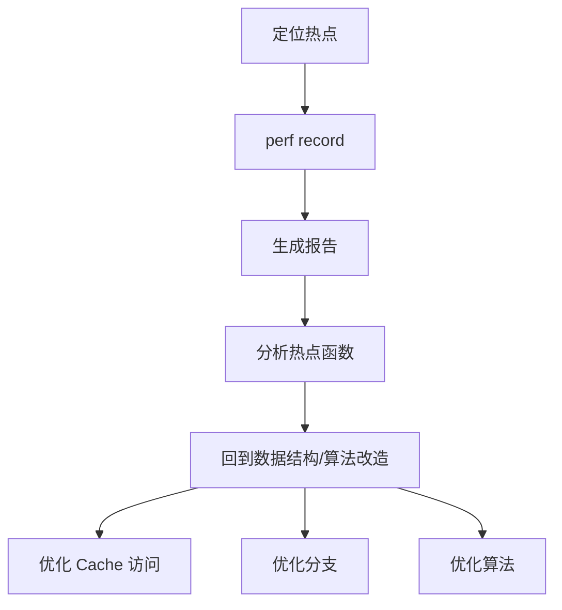

## 6. 实际案例

### 6.1 案例：Cache Miss 导致的 IPC 下降

**问题**：程序 IPC 只有 0.8，性能差

**诊断**：
```bash
perf stat -e instructions,cycles,L1-dcache-load-misses,LLC-load-misses ./program

# 结果：
# IPC = 0.8
# L1 Miss Rate = 15%
# LLC Miss Rate = 8%
```

**分析**：L1 miss rate 过高，说明数据局部性差

**优化**：
- 优化数据结构布局（AoS → SoA）
- 减少随机访问
- 使用 cache-friendly 算法

**结果**：IPC 提升到 1.5

### 6.2 案例：Branch Miss 导致的 IPC 下降

**问题**：Hash 表查找性能差，IPC 只有 0.9

**诊断**：
```bash
perf stat -e branches,branch-misses ./program

# 结果：
# Branch Miss Rate = 12%
```

**分析**：分支预测失败率高，导致流水线频繁 flush

**优化**：
- 使用更可预测的 Hash 函数
- 减少分支层级
- 使用位运算替代分支

**结果**：IPC 提升到 1.3

## 7. 工具与命令

### 7.1 perf 常用命令

```bash
# 基本统计
perf stat ./program

# 详细 Cache 统计
perf stat -e cache-references,cache-misses,L1-dcache-loads,L1-dcache-load-misses ./program

# 详细分支统计
perf stat -e branches,branch-misses ./program

# 综合统计
perf stat -e instructions,cycles,stalled-cycles-frontend,stalled-cycles-backend,cache-misses,branch-misses ./program
```

### 7.2 指标解读

| 指标 | 正常范围 | 异常信号 |
|------|---------|---------|
| IPC | 1.0-2.0 | < 1.0 需要关注 |
| L1 Miss Rate | < 5% | > 10% 需要优化 |
| LLC Miss Rate | < 5% | > 10% 需要优化 |
| Branch Miss Rate | < 2% | > 5% 需要优化 |
| Stalled Cycles | < 30% | > 50% 严重问题 |

## 8. 设计原则与最佳实践

### 8.1 性能诊断原则

1. **先看 IPC**：快速判断是 compute-bound 还是 stall-bound
2. **再看 Cache**：如果是 stall-bound，优先看 cache miss
3. **再看分支**：如果 cache 没问题，看 branch miss
4. **最后定位**：用 perf record 定位具体函数

### 8.2 优化策略

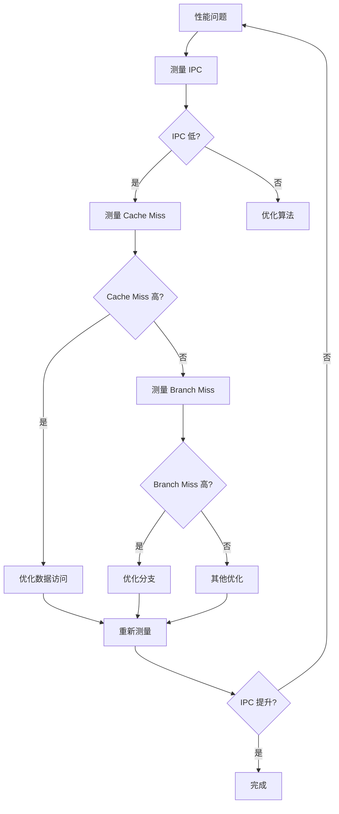

## 9. 小结

IPC 低通常不是结论，而是"提示需要关注 stall 的来源"。把 stalled cycles + cache miss + branch miss 结合起来，就能把性能问题从"感觉慢"变成"知道在等什么"。

**核心要点**：
- IPC 是性能诊断的入口指标，快速判断问题类型
- Cache miss 是最常见的 stall 原因，需要优化数据访问
- Branch miss 会导致流水线 flush，需要优化分支逻辑
- 使用 perf 工具系统性地诊断和优化性能问题

**诊断流程**：
1. 测量 IPC，判断是 compute-bound 还是 stall-bound
2. 如果是 stall-bound，测量 cache miss 和 branch miss
3. 定位热点函数，针对性优化
4. 重新测量，验证优化效果