本文深入解析拥塞控制的核心概念，以及 CUBIC 和 BBR 两种算法的设计差异、适用场景和工程实践。


## 1. 拥塞控制到底在控制什么：吞吐、延迟与"排队"

网络里"慢"通常有两种本质：

- **带宽不够**：链路本身吞吐上不去
- **排队太多（bufferbloat）**：带宽够，但队列把 RTT 拉长，P99 变差

拥塞控制做的事就是：在不把网络塞爆的前提下尽量吃到带宽，同时尽量避免形成巨大的排队。

### 1.1 拥塞控制的目标

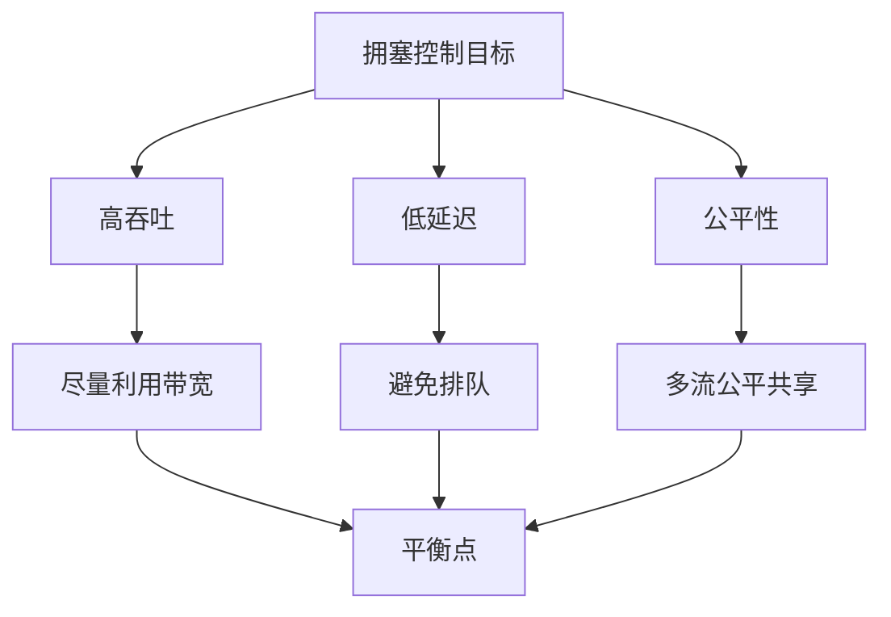

### 1.2 拥塞的两个维度

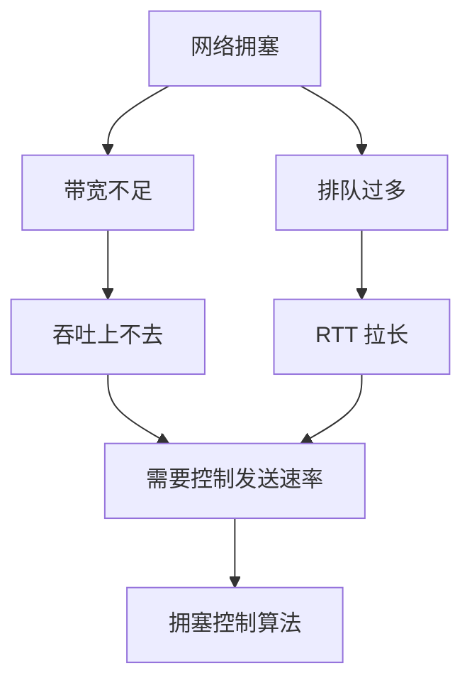

## 2. CUBIC 的要点：更像"以丢包为拥塞信号"

工程上可以将 CUBIC 理解为：

- 窗口会按某种增长曲线增加
- 一旦出现拥塞信号（经常表现为丢包/重传），窗口收缩

因此它的行为更容易受这些因素影响：

- 丢包率/重传
- 中间盒子/队列策略（是否容易触发丢包）

### 2.1 CUBIC 的窗口增长曲线

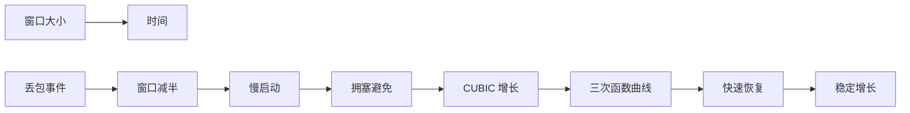

### 2.2 CUBIC 的工作机制

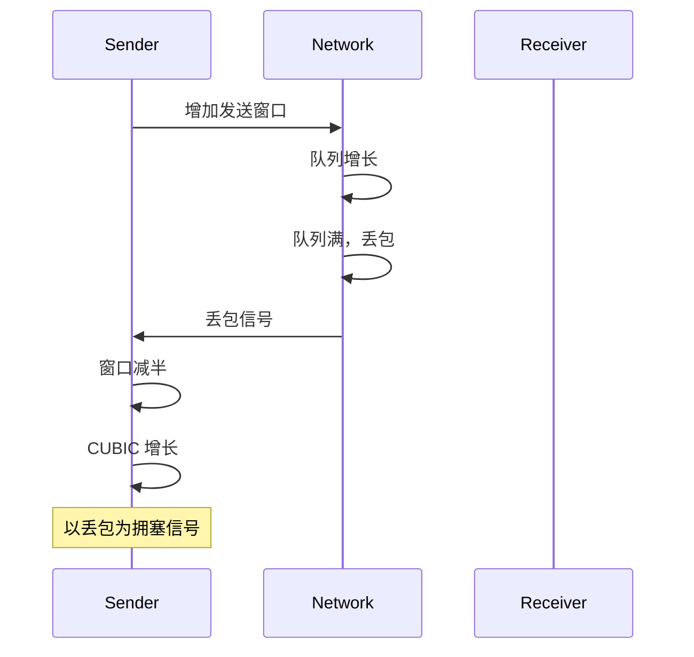

### 2.3 CUBIC 的特点

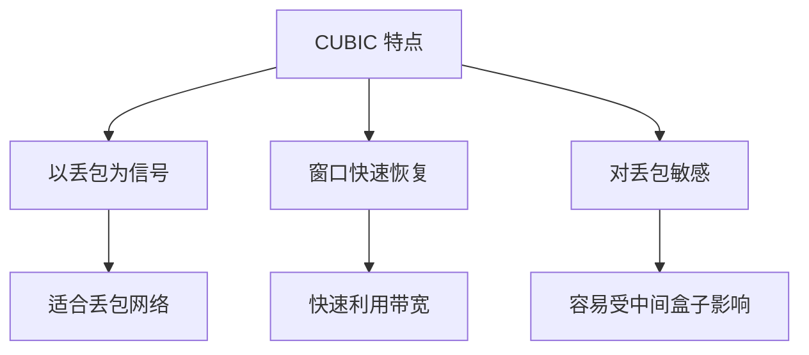

## 3. BBR 的要点：更像"测带宽与 RTT，用模型控制排队"

BBR 的工程直觉是：

- 试图测到"可用带宽（BtlBw）"和"最小 RTT（RTprop）"
- 用模型控制发送速率，让链路处于高利用率但不制造过多排队

因此它更敏感于：

- RTT 估计是否稳定（是否有长期排队把 min RTT 污染）
- 链路是否存在复杂的整形/队列策略（影响带宽估计）

### 3.1 BBR 的状态机

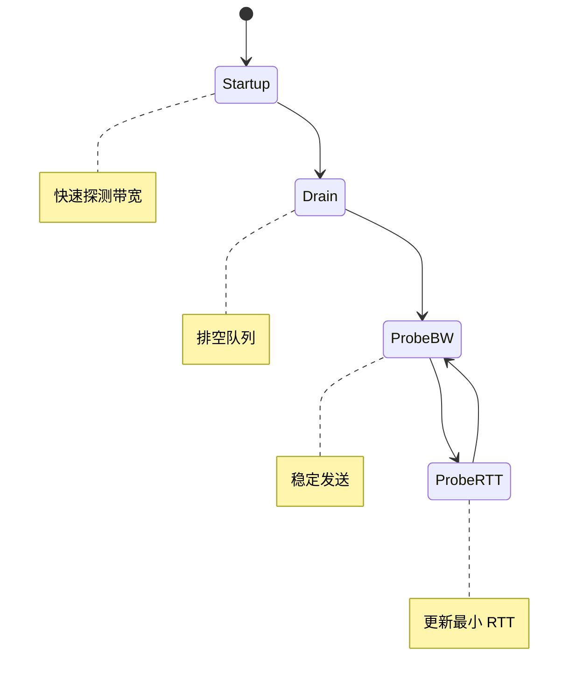

### 3.2 BBR 的带宽与 RTT 估计

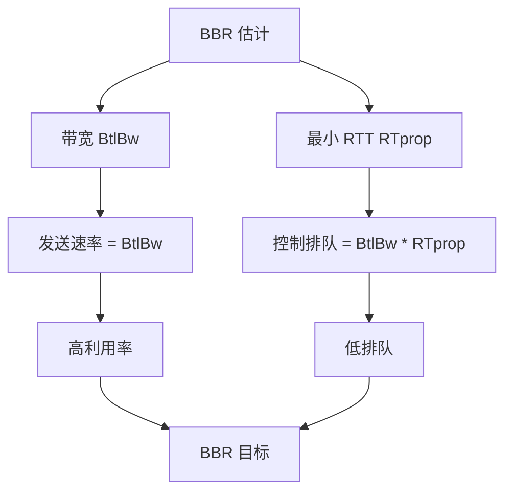

### 3.3 BBR 的特点

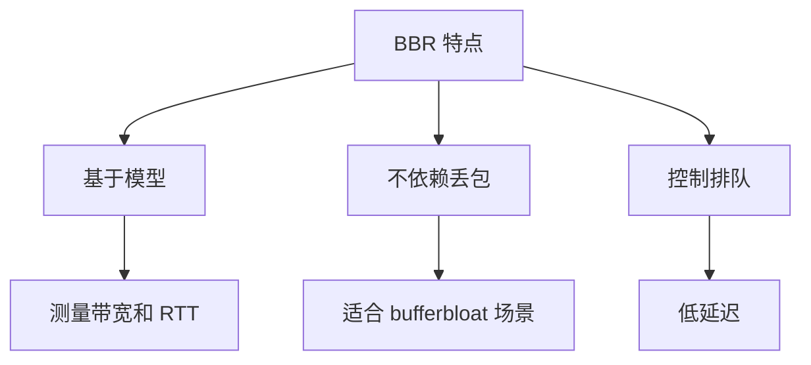

## 4. CUBIC vs BBR：核心差异

### 4.1 拥塞信号

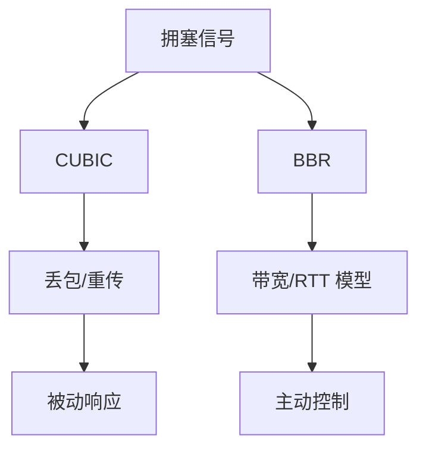

### 4.2 性能特征对比

| 特征 | CUBIC | BBR |
|------|-------|-----|
| 拥塞信号 | 丢包 | 带宽/RTT |
| 排队控制 | 被动 | 主动 |
| 延迟 | 可能高（bufferbloat） | 通常低 |
| 吞吐 | 高 | 高 |
| 公平性 | 好 | 可能有问题 |

### 4.3 适用场景

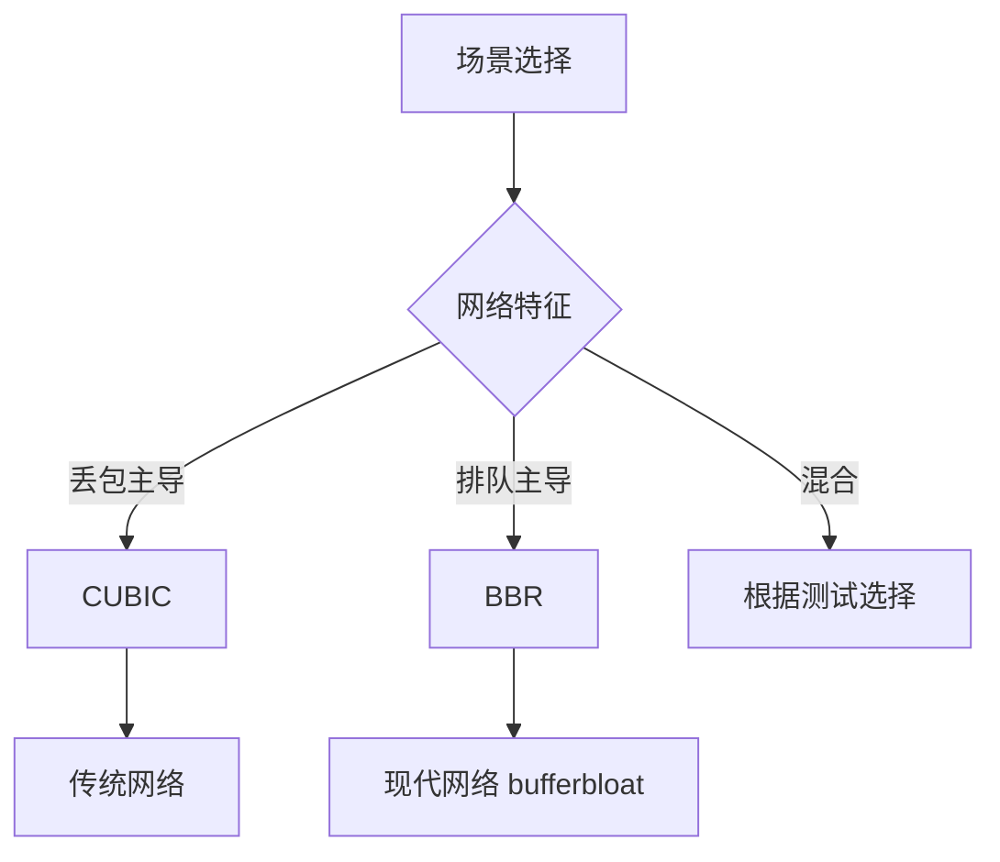

## 5. 线上可以看到什么：同样吞吐，不同延迟分布

常见体验差异：

- 有些场景下，BBR 更容易把排队压下来（P99 更稳）
- 有些场景下，BBR 的估计不稳定会导致吞吐抖动或与其它流量竞争行为不同

> 工程上不要"迷信算法名字"，先看链路是否是 bufferbloat 主导，还是丢包主导。

### 5.1 性能对比示例

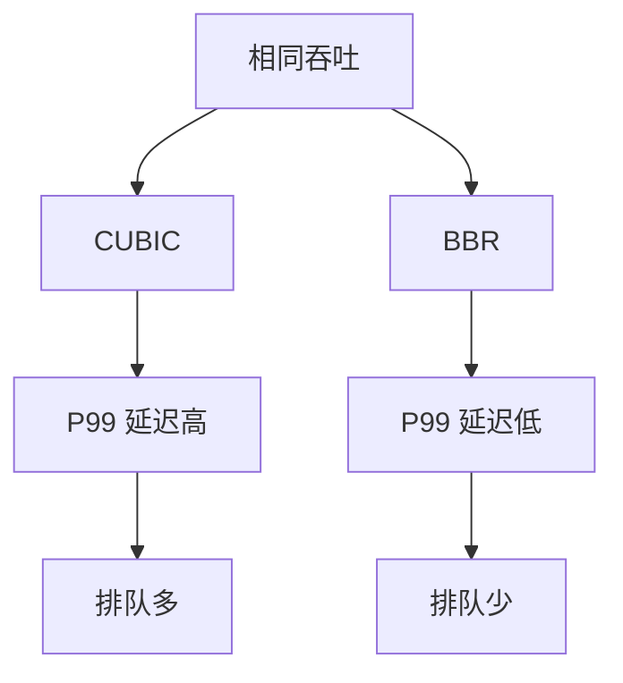

## 6. 应当观测什么（排障信号）

- **RTT 分布**：尤其是 P95/P99 与最小 RTT 是否被污染
- **丢包/重传**：retransmits、dupacks、RTO
- **队列时延/排队信号**：是否存在长期排队（bufferbloat）
- **吞吐稳定性**：是否存在明显的周期性抖动

### 6.1 观测指标

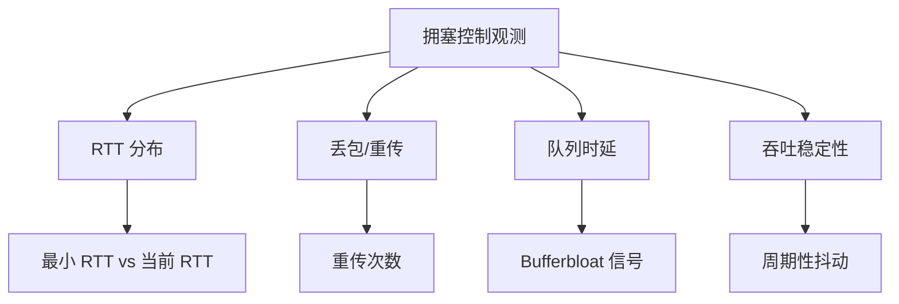

### 6.2 测量工具

```bash
# 查看 RTT
ss -i

# 查看重传
ss -i | grep retrans

# 使用 tc 模拟网络
tc qdisc add dev eth0 root netem delay 10ms

# 使用 iperf 测试
iperf3 -c server -t 60
```

## 7. 排障顺序（"吞吐不稳/延迟很差"）

1. **先判断是不是 bufferbloat**：RTT 是否被排队拉长（最小 RTT vs 当前 RTT）
2. **再看丢包与重传**：是否因丢包触发窗口收缩/恢复
3. **确认链路是否有整形/中间盒子**：会影响算法对信号的解释
4. **最后再比较 CUBIC vs BBR**：同一链路同一 workload 下对比（用数据说话）

### 7.1 排障流程

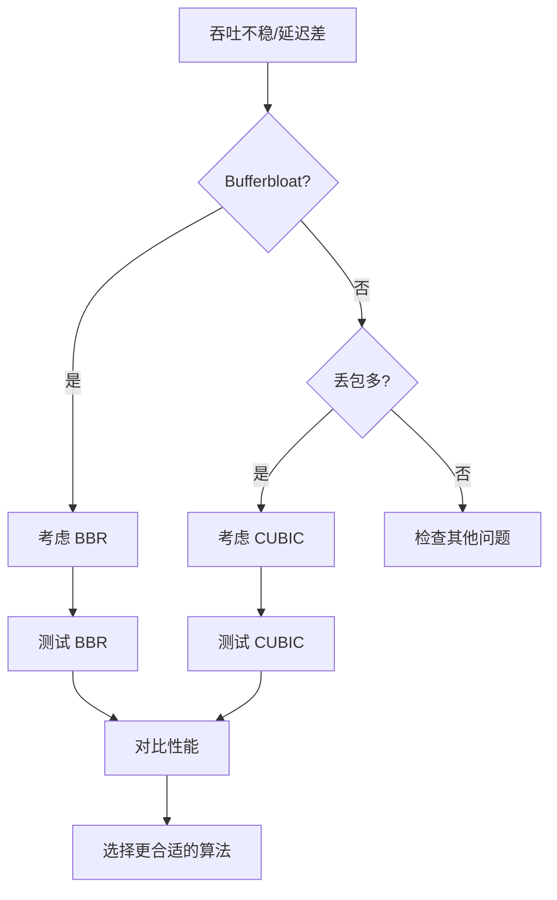

## 8. 实际案例

### 8.1 案例：Bufferbloat 场景下的优化

**问题**：P99 延迟高，但吞吐正常

**分析**：
- 最小 RTT = 10ms
- 当前 RTT = 100ms
- 说明有 90ms 的排队延迟

**优化**：
- 从 CUBIC 切换到 BBR
- BBR 主动控制排队

**结果**：
- P99 延迟从 100ms 降到 20ms
- 吞吐保持稳定

### 8.2 案例：丢包场景下的选择

**问题**：网络丢包率高，BBR 性能差

**分析**：
- 丢包率 = 2%
- BBR 对丢包不敏感，窗口不收缩
- 导致更多丢包

**优化**：
- 从 BBR 切换回 CUBIC
- CUBIC 以丢包为信号，更合适

**结果**：
- 吞吐提升
- 延迟稳定

## 9. 设计原则与最佳实践

### 9.1 选择原则

1. **Bufferbloat 主导**：选择 BBR
2. **丢包主导**：选择 CUBIC
3. **混合场景**：根据测试结果选择

### 9.2 最佳实践

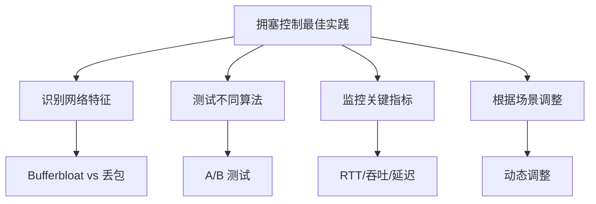

## 10. 小结

CUBIC 更像"以丢包为拥塞信号的窗口控制"，BBR 更像"用带宽/RTT 模型控制排队"。选型与排障的关键不是背原理，而是先识别链路是"丢包主导"还是"排队主导"，再决定用哪种控制策略更合适。

**核心要点**：
- CUBIC 以丢包为拥塞信号，适合丢包主导的网络
- BBR 基于带宽/RTT 模型，适合 bufferbloat 场景
- 选择算法要看网络特征，不是算法名字
- 通过测试和监控来选择最合适的算法

**选型流程**：
1. 识别网络特征（bufferbloat vs 丢包）
2. 测试不同算法
3. 监控关键指标
4. 选择最适合的算法
