本文深入解析 Linux CFS（Completely Fair Scheduler）的工作原理、vruntime 机制、调度策略和工程实践。

线上遇到的很多"抖动"，最后会落到核心要点：

> **线程明明不忙，但为什么请求还是卡？——因为它没拿到 CPU。**

Linux 的 CFS（Completely Fair Scheduler）给人的直觉是"公平"：谁欠 CPU 多，谁先跑。但它的公平不是"每人固定时间片"，而是围绕 **vruntime（虚拟运行时间）** 做的动态分配。


## 1. CFS 想解决什么：在公平与吞吐之间取平衡

调度器面对的最基本矛盾：

- **公平**：每个 runnable 任务都不该长期饿死
- **吞吐**：频繁切换会浪费 CPU（cache miss、pipeline flush、TLB miss）

CFS 的核心思路是：

- 把 runnable 任务放进一个"按 vruntime 排序"的结构
- 总是挑 **vruntime 最小** 的任务运行（理解为"最欠账的那个"）

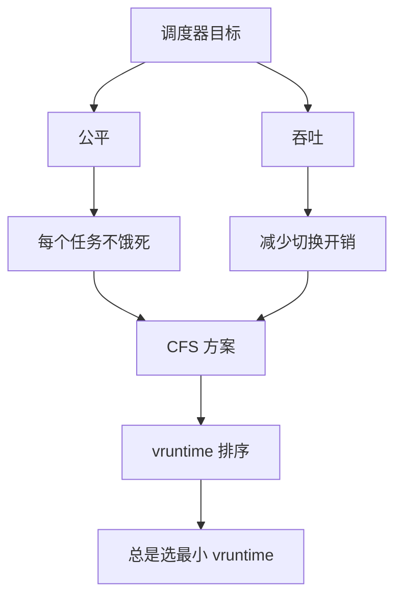

## 2. vruntime 是什么：不是"真实时间"，而是"按权重折算后的欠账"

直觉理解：

- 任务跑得越久，它的 vruntime 增长越多
- 但增长速度会被 **权重（nice）** 调整：
  - 权重高（更重要）→ vruntime 增长慢 → 更容易被再次选中
  - 权重低（不重要）→ vruntime 增长快 → 更容易让出 CPU

因此 "公平" 不是"每人一样"，而是"按权重比例分配"。

### 2.1 vruntime 的计算

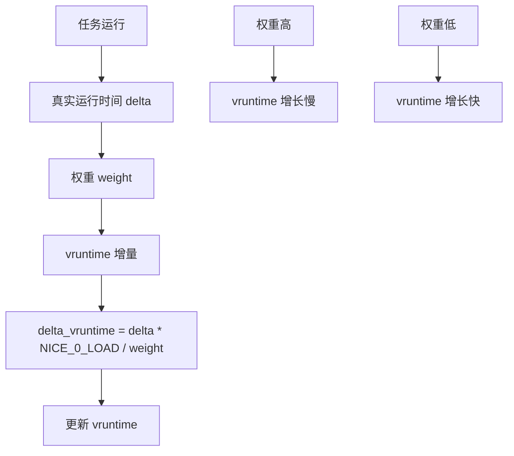

### 2.2 权重与优先级

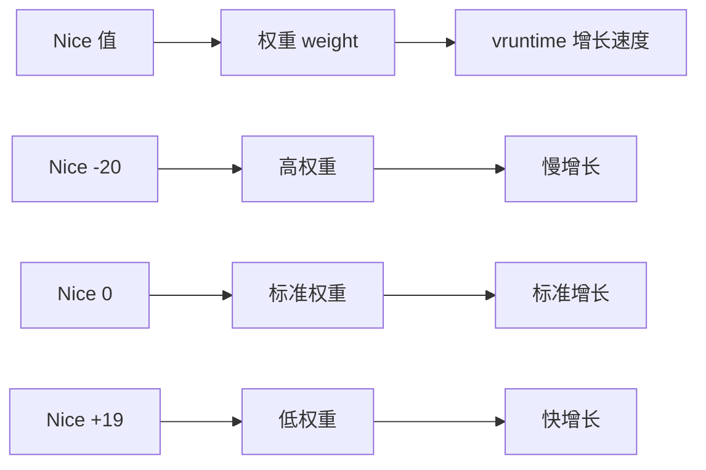

**权重计算**：
- Nice 值每增加 1，权重约减少 10%
- Nice -20 到 +19，权重范围约 88761 到 15

## 3. 时间片（slice）从哪里来：是动态算出来的

CFS 不强调固定时间片，而是用"调度周期"来分摊：

- runnable 任务越多，每个任务分到的 slice 越短
- slice 太短会导致切换开销变大，所以 CFS 会有最小粒度（避免过度切换）

### 3.1 调度周期与时间片

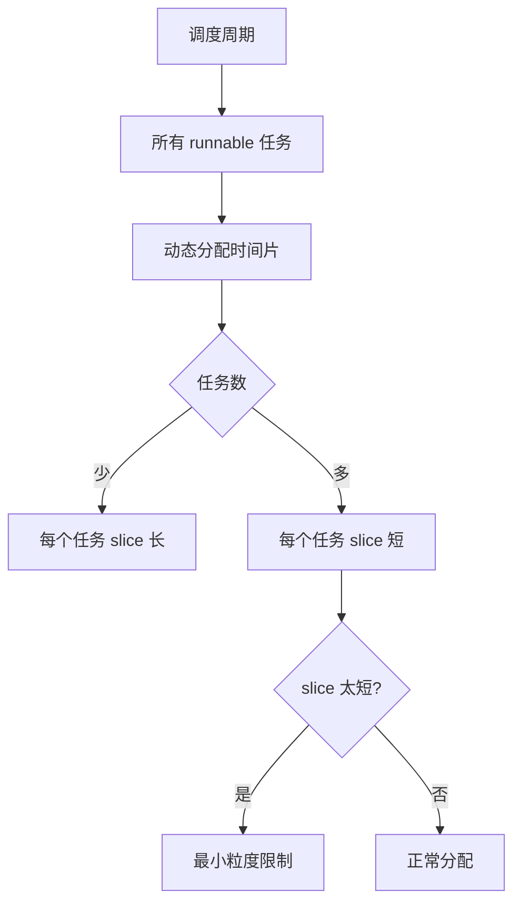

### 3.2 最小粒度（min_granularity）

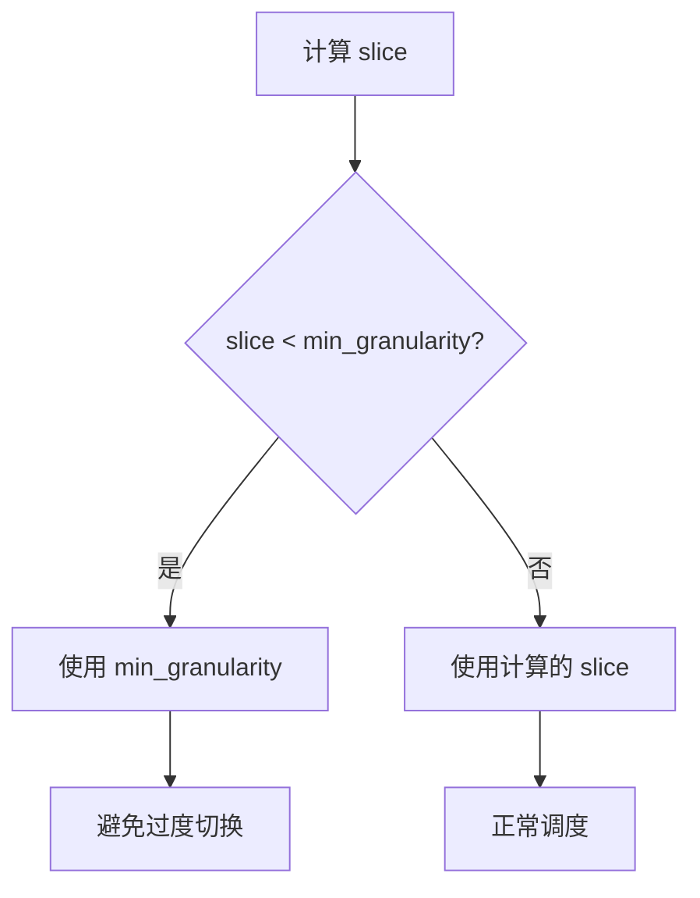

**典型值**：
- 调度周期：6ms（可配置）
- 最小粒度：0.75ms（可配置）

## 4. CFS 的数据结构：红黑树

CFS 使用红黑树来维护按 vruntime 排序的任务：

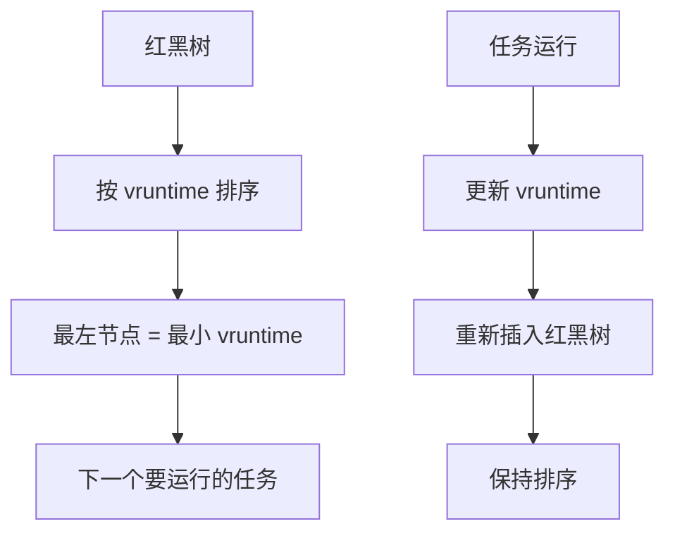

### 4.1 调度流程

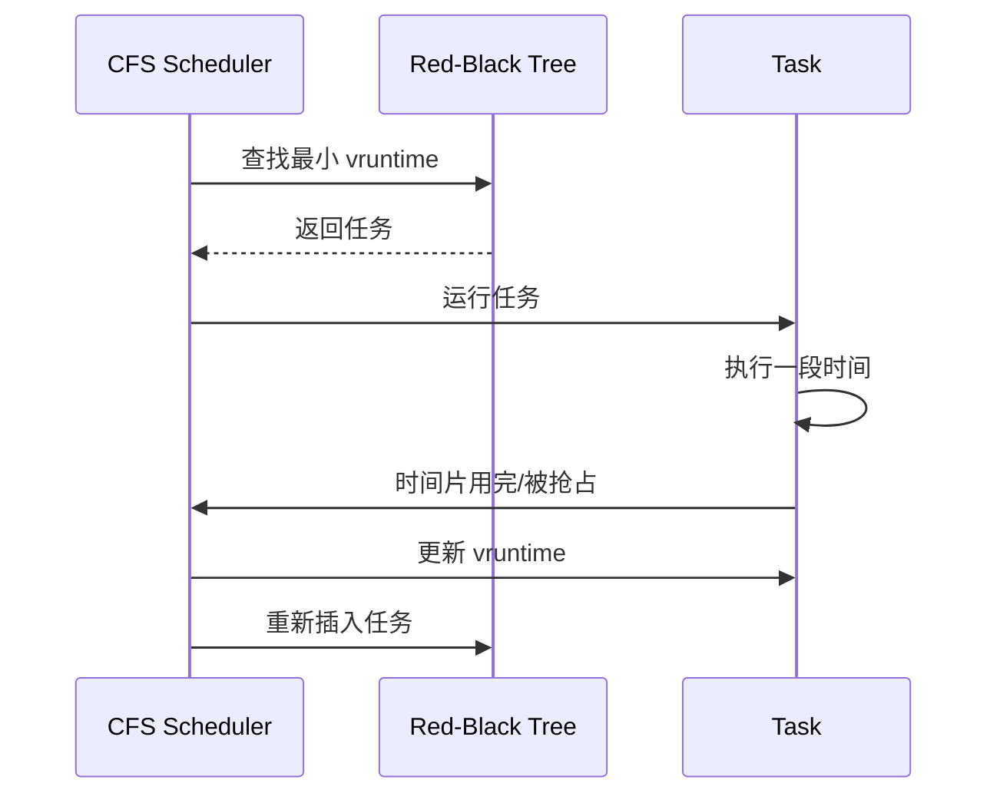

## 5. 线上最常见的两类"卡"：CPU 争用 vs 调度延迟

把现象分清楚，会比背参数更有用：

- **CPU 争用（run queue 长）**：核心忙，大家都在排队等 CPU
- **调度延迟（没跑起来）**：核心未必 100% busy，但关键线程没被及时调度（优先级/绑核/抢占/干扰）

可以看到的业务表象：

- 请求 **P99 抖动**：某些请求偶发被"晾在一边"
- 吞吐下降但系统看起来"没满"：CPU 平均不高，但关键核被打爆或被别的任务抢占

### 5.1 CPU 争用场景

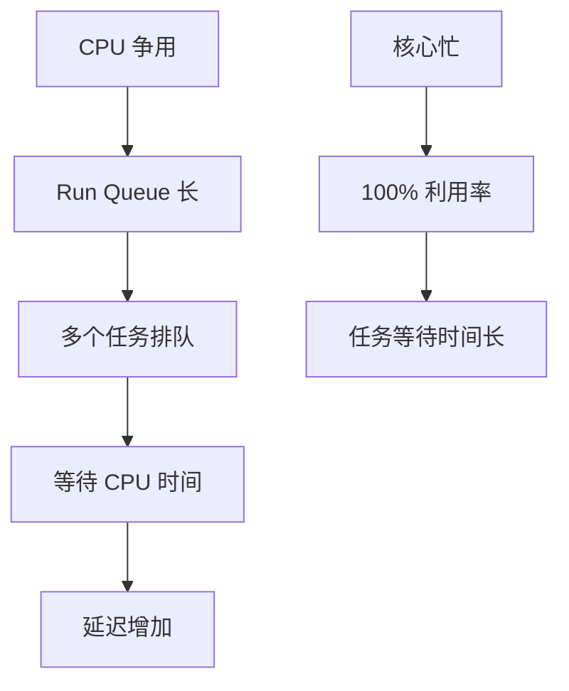

### 5.2 调度延迟场景

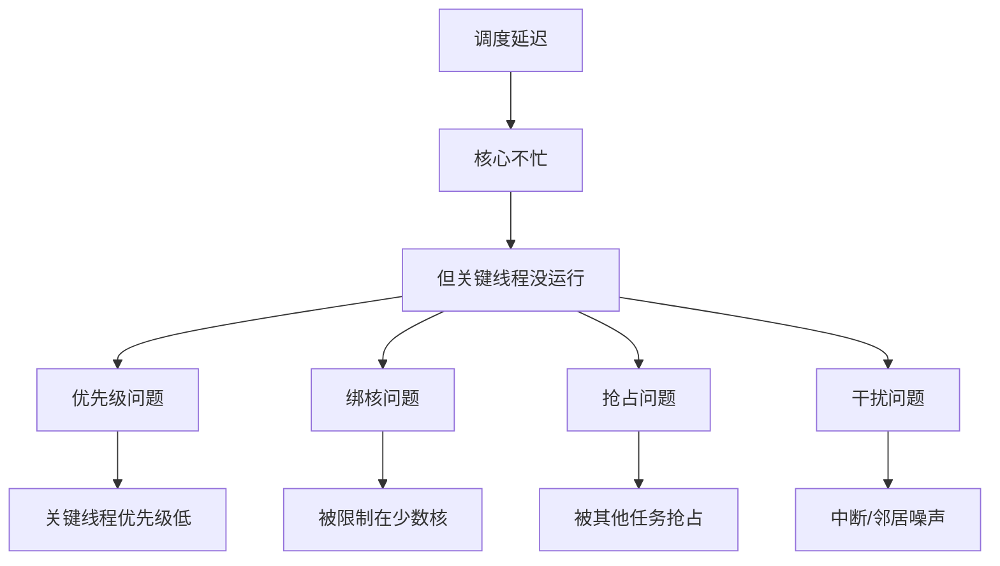

## 6. 如何观测 CFS 对你的影响（最实用）

建议先建立两条时间线：

- **runnable 时间线**：线程处于 runnable（想跑）但没跑起来的时间（调度延迟）
- **running 时间线**：线程真正拿到 CPU 的时间

如果平台/权限允许（容器/云上可能受限），这些观测非常有用：

- **run queue length（每核）**：是否有核长期排队？
- **context switch 频率**：是否过度切换（slice 太碎/线程太多）？
- **CPU 使用按核分布**：平均值不可信，关键看"最忙的核"和绑定情况
- **关键线程的 on-CPU/off-CPU**：请求慢时线程到底在跑还是在等？

> 核心要点：别盯总 CPU 利用率，先盯 **"谁在排队"**。

### 6.1 观测工具

```bash
# 查看 run queue 长度
sar -q 1

# 查看 context switch
sar -w 1

# 查看 per-core 利用率
mpstat -P ALL 1

# 使用 perf 查看调度延迟
perf sched record ./program
perf sched latency
```

### 6.2 关键指标

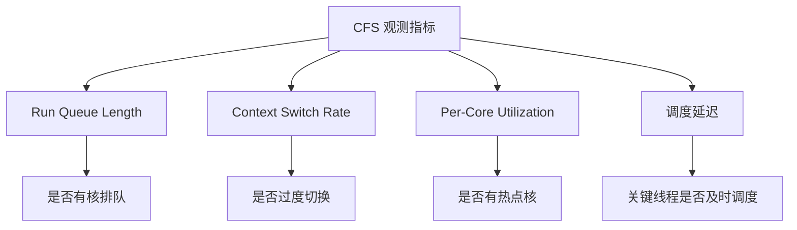

## 7. 常见误区（很多人会在这里掉坑）

### 7.1 误区 1：CPU 不高就不是 CPU 的问题

实际可能是：热点核被打爆、线程被绑核、NUMA/中断/邻居噪声导致关键线程拿不到 CPU。

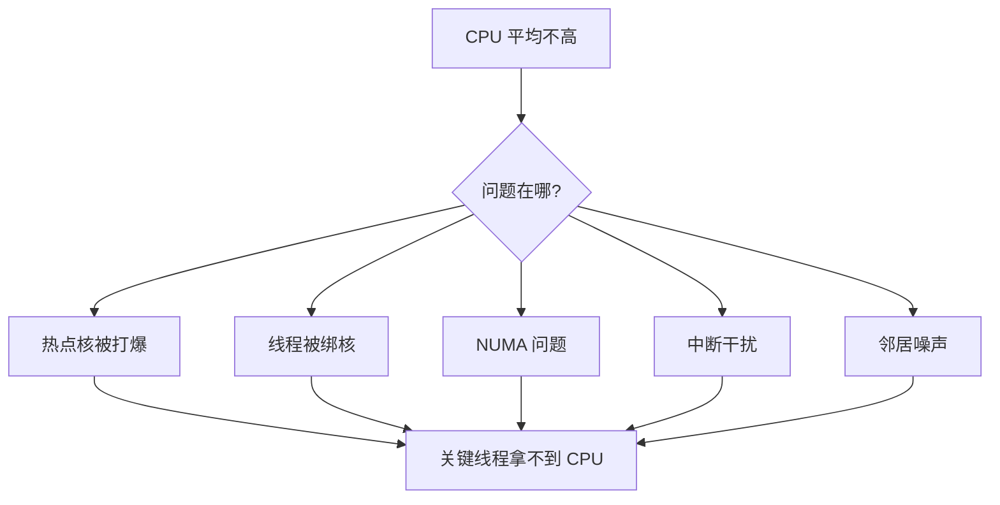

### 7.2 误区 2：把调度问题当锁/GC 问题

锁与 GC 当然会卡，但如果看到的是"偶发长尾"，先排除调度延迟更快。

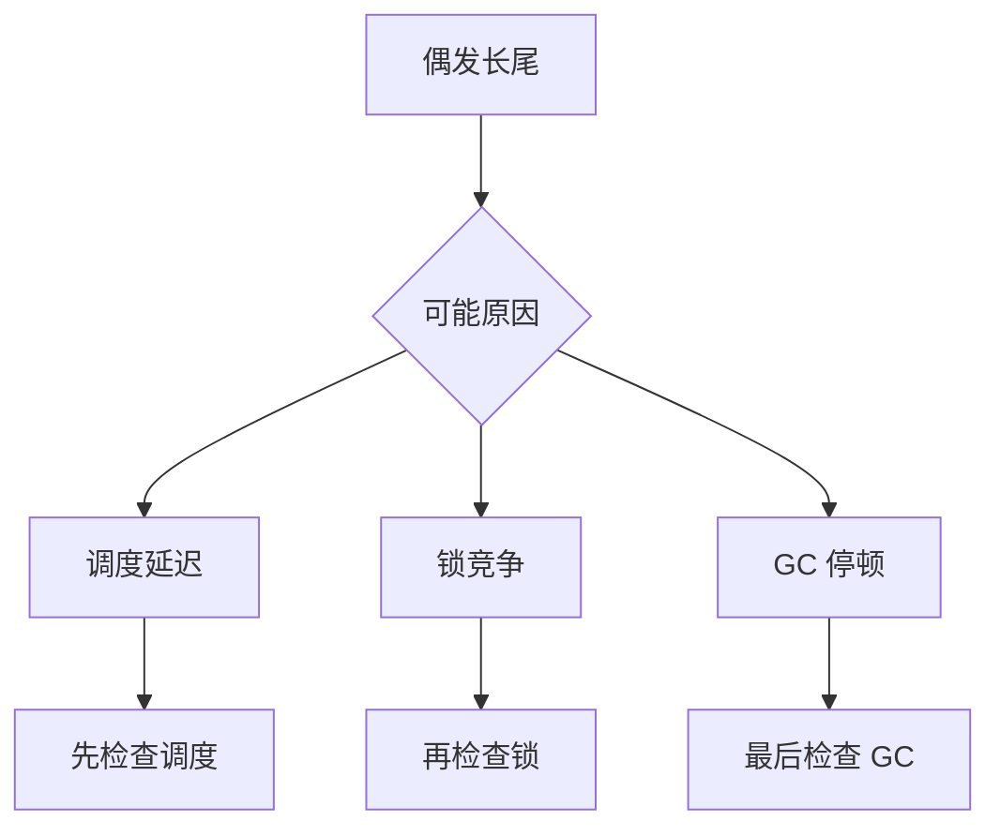

## 8. 最小排障清单（遇到 P99 抖动时）

1. **看 per-core 压力**：是否存在某些核 run queue 长、长期忙？
2. **确认是否绑核/亲和性**：关键线程是否被限制在少数核上？
3. **看切换是否过多**：线程数过大、slice 太短会带来切换开销
4. **确认是否有干扰任务**：同机 noisy neighbor、后台任务、ksoftirqd 抢占等

### 8.1 排障流程

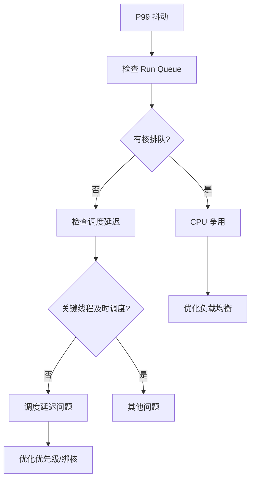

## 9. 实际案例

### 9.1 案例：热点核导致的性能问题

**问题**：请求 P99 抖动，但 CPU 平均利用率只有 60%

**分析**：
- 发现某些核 run queue 长度长期 > 10
- 关键线程被绑定到这些热点核
- 其他核利用率很低

**优化**：
- 解除线程绑核限制
- 优化负载均衡
- 调整线程优先级

**结果**：P99 延迟降低 40%

### 9.2 案例：过度切换导致的性能问题

**问题**：系统吞吐下降，context switch 频率很高

**分析**：
- Context switch 频率 > 100K/s
- 线程数过多，slice 太短
- 大量时间花在切换上

**优化**：
- 减少线程数
- 使用线程池
- 调整调度参数

**结果**：吞吐提升 30%

## 10. 设计原则与最佳实践

### 10.1 设计原则

1. **公平性**：通过 vruntime 保证每个任务都能获得 CPU 时间
2. **效率**：通过最小粒度避免过度切换
3. **灵活性**：通过权重支持不同优先级的任务

### 10.2 最佳实践

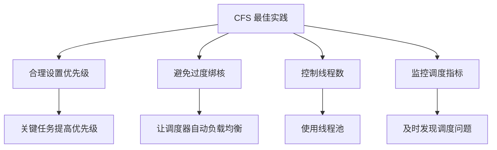

## 11. 小结

CFS 的"公平"是通过 vruntime 把 runnable 任务排成一条队：谁欠 CPU 多，谁先跑。线上排障的关键不是背参数，而是把问题拆成两类：**是否在排队等 CPU**、以及 **关键线程是否被及时调度**。

**核心要点**：
- CFS 使用 vruntime 实现公平调度，不是固定时间片
- 权重（nice）影响 vruntime 增长速度，实现优先级
- 调度周期和最小粒度平衡公平与效率
- 线上问题分为 CPU 争用和调度延迟两类

**排障流程**：
1. 检查 per-core run queue 长度
2. 确认线程绑核和亲和性设置
3. 检查 context switch 频率
4. 确认是否有干扰任务
