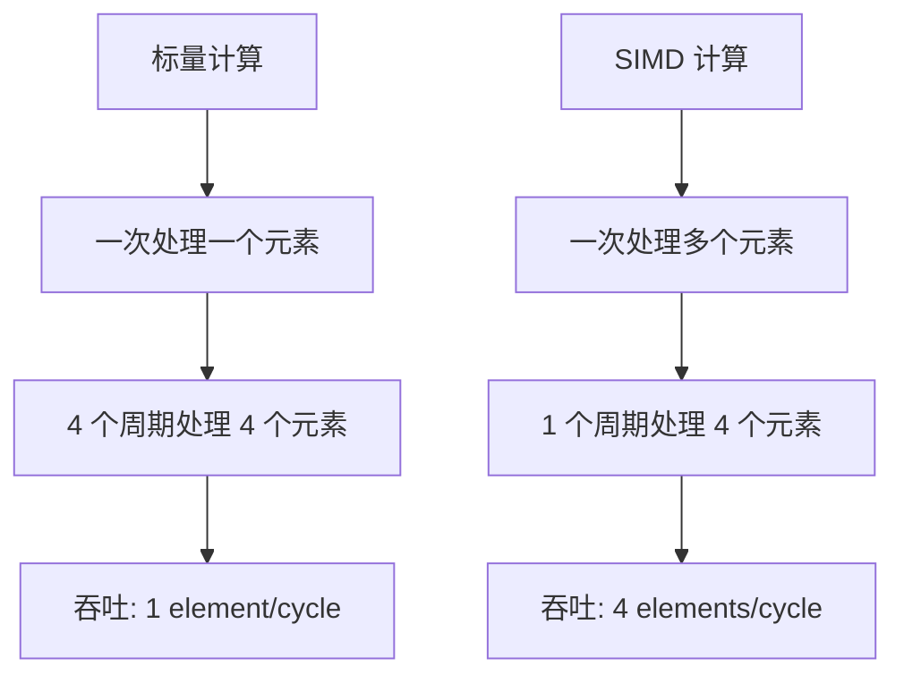
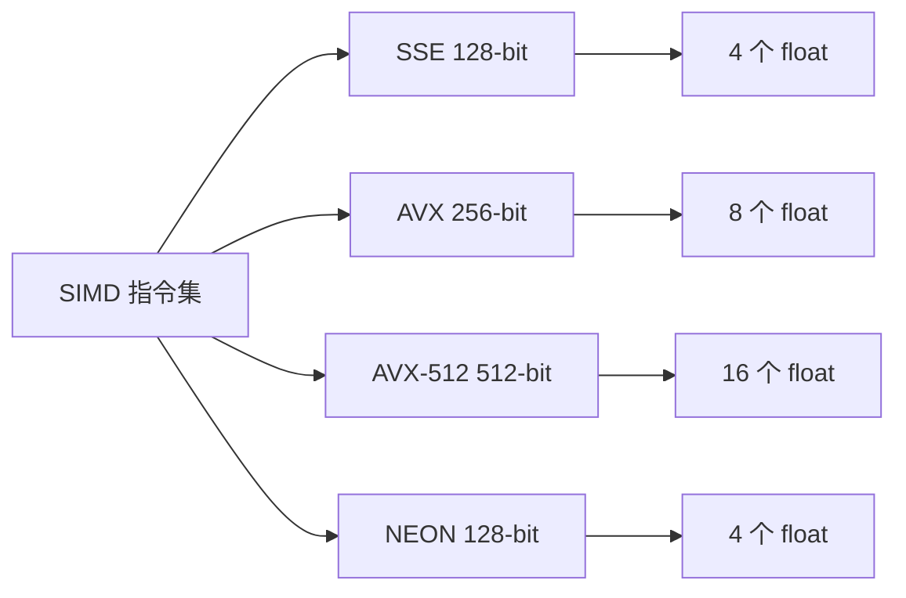
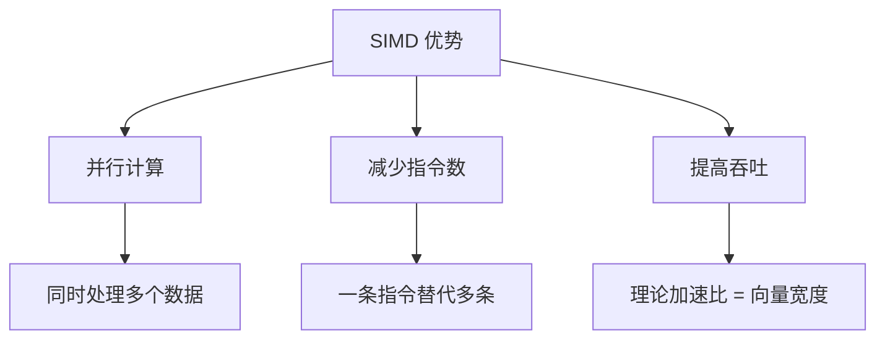
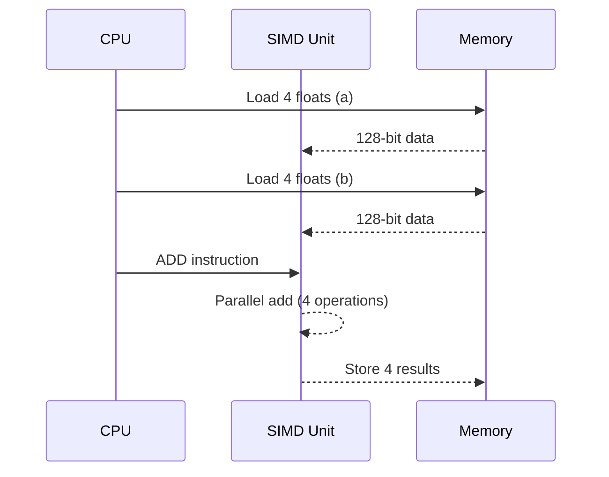
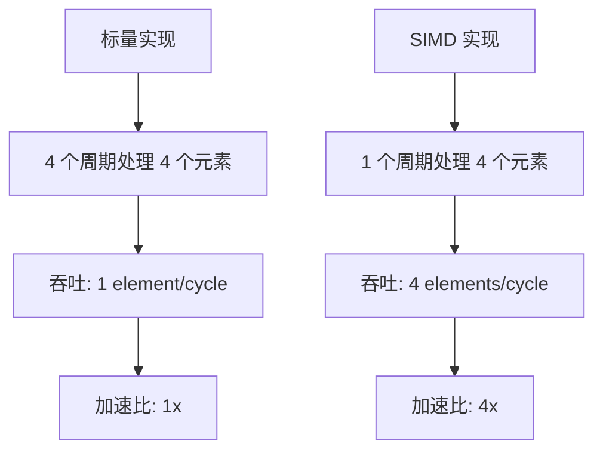
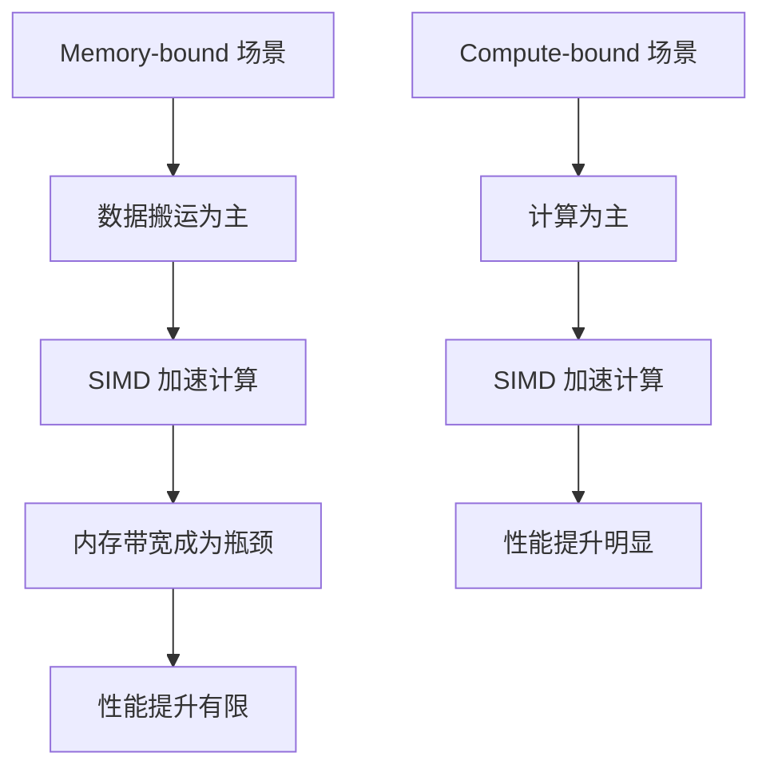
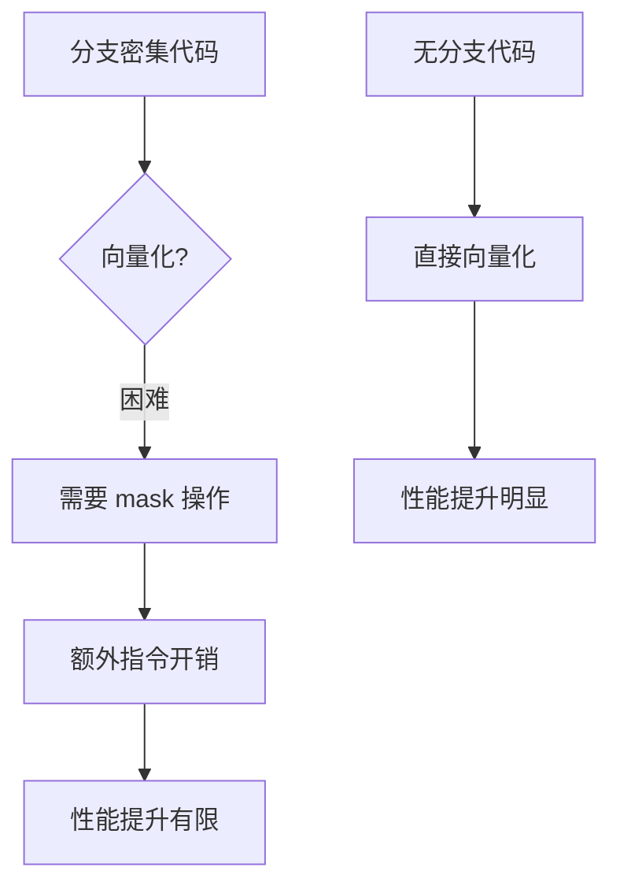
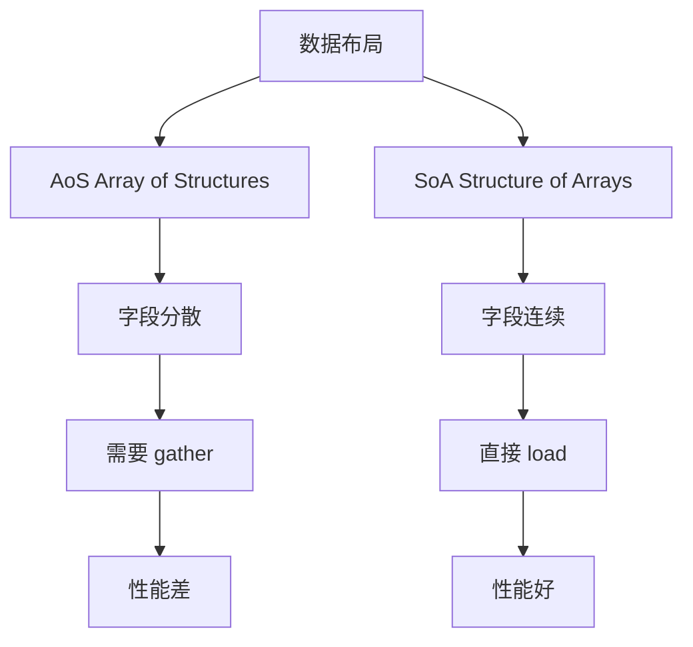
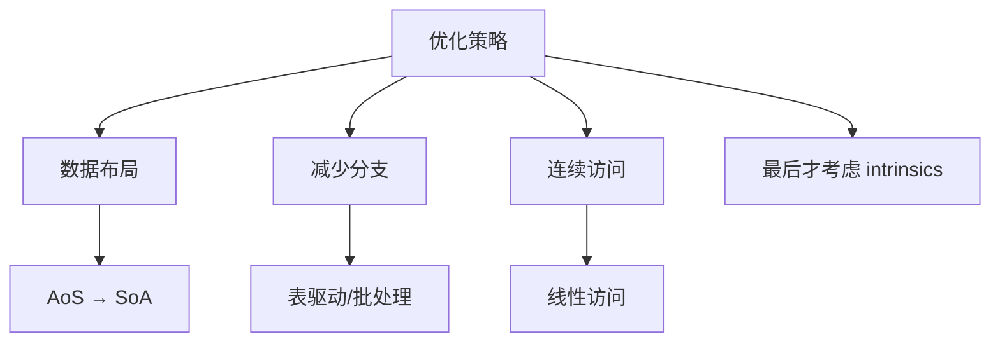
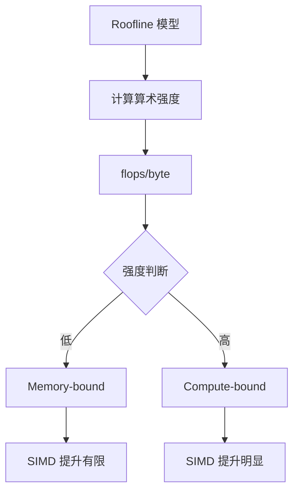

本文深入解析 SIMD（Single Instruction, Multiple Data）的工作原理、适用场景、性能边界和工程实践。

SIMD 的直觉很简单：**一次指令处理一组数据**，理论吞吐可能成倍提升。

但工程上经常会遇到：

> "我开了 SIMD / 编译器也向量化了，为什么没快多少，甚至更慢？"

原因通常不是 SIMD "没用"，而是：**瓶颈不在计算**，或者被内存/分支/对齐/数据布局吃掉了。


## 1. SIMD 的基本原理

### 1.1 什么是 SIMD

SIMD 允许一条指令同时处理多个数据元素：



### 1.2 SIMD 指令集

常见 SIMD 指令集：

| 指令集 | 位宽 | 平台 |
|--------|------|------|
| SSE | 128-bit | x86 |
| AVX | 256-bit | x86 |
| AVX-512 | 512-bit | x86 |
| NEON | 128-bit | ARM |



### 1.3 SIMD 的优势



## 2. 什么时候 SIMD 最容易带来肉眼可见的提升

典型特征：

- **数据可并行**：同一算子对大量元素做同一种操作（map/reduce、向量加减、归一化、dot product）
- **分支少**：分支多会让向量化困难（mask 也有成本）
- **数据连续/对齐好**：连续访问更容易利用 cache 与预取；不对齐/散乱 gather 会更贵

核心要点：**算得多、分支少、内存访问规整**。

### 2.1 理想场景示例

```cpp
// 理想场景：向量加法
void vector_add(float* a, float* b, float* c, int n) {
    for (int i = 0; i < n; i += 4) {
        // SIMD: 一次处理 4 个 float
        __m128 va = _mm_load_ps(&a[i]);
        __m128 vb = _mm_load_ps(&b[i]);
        __m128 vc = _mm_add_ps(va, vb);
        _mm_store_ps(&c[i], vc);
    }
}
```



### 2.2 性能提升示例



## 3. 什么时候 SIMD 看起来"没效果"：三类常见上限

### 3.1 内存带宽上限（实际上是 memory-bound）

如果循环主要在搬数据（load/store）：

- SIMD 只会更快把带宽打满
- 一旦带宽饱和，继续加宽向量不会让整体更快

典型信号：IPC 上不去、cache miss 高、load stall 多。



**示例**：
```cpp
// Memory-bound: 主要是数据拷贝
void copy_array(float* src, float* dst, int n) {
    for (int i = 0; i < n; i++) {
        dst[i] = src[i];  // 主要是 load/store
    }
}
// SIMD 可能只提升 1.5-2x，而不是 4x
```

### 3.2 分支与数据依赖（实际上是 control-bound）

- if/else 很多、数据相关分支 → 向量化困难
- 即使用 mask，也会引入额外指令与吞吐损失



**示例**：
```cpp
// 分支密集：难以向量化
void process_array(int* arr, int n) {
    for (int i = 0; i < n; i++) {
        if (arr[i] > 0) {  // 分支依赖数据
            arr[i] *= 2;
        } else {
            arr[i] = 0;
        }
    }
}
// 即使使用 SIMD mask，性能提升也有限
```

### 3.3 数据布局/对齐问题（在"取数"付出额外代价）

- AoS（结构体数组）在某些字段计算上不如 SoA（字段分离）
- 不对齐访问、跨 cache line、gather/scatter 都可能吞掉收益



**示例**：
```cpp
// AoS: 字段分散，需要 gather
struct Point {
    float x, y, z;
};
Point points[1000];
// 计算所有 x 坐标：需要 gather，性能差

// SoA: 字段连续，直接 load
struct Points {
    float x[1000];
    float y[1000];
    float z[1000];
};
// 计算所有 x 坐标：直接 load，性能好
```

## 4. 工程建议：怎么让 SIMD 更容易"跑满"

### 4.1 优先改数据布局

很多性能提升不是来自 intrinsics，而是把 AoS 改成 SoA。



### 4.2 减少分支

把条件变成表驱动/批处理；或让热路径分离。

### 4.3 让访问更连续

避免随机访问，尽量让内存访问线性可预取。

### 4.4 把"向量化"当成最后一步

先确认不是 memory-bound/lock-bound。

## 5. 怎么验证：别只看"跑得快不快"，要看"瓶颈变没变"

建议做 3 件事：

1. **确认编译器是否真的向量化**：看编译报告/汇编（至少确认循环是否变成向量指令）
2. **对比 IPC / cache miss / branch miss**：如果 SIMD 后 IPC 没提升，通常说明瓶颈不在算术吞吐
3. **做 roofline 思路的判断**：大致估算算术强度（flops/byte），看更像 compute-bound 还是 memory-bound

### 5.1 验证编译器向量化

```bash
# GCC
gcc -O3 -ftree-vectorize -ftree-vectorizer-verbose=2 program.c

# 查看汇编
objdump -d program | grep -A 10 "vectorized loop"
```

### 5.2 Roofline 模型



## 6. 最小排障清单（"向量化了但不快"）

1. **先判断是不是 memory-bound**：带宽是否已经打满？cache miss 是否主导？
2. **看分支/数据依赖**：branch miss、mask 开销是否显著？
3. **看数据布局**：AoS/SoA、对齐、跨 cache line、gather 是否在吞收益？
4. **再考虑 intrinsics**：手写 SIMD 往往是最后手段，且要注意可维护性

## 7. 实际案例

### 7.1 案例：向量归一化

**问题**：SIMD 优化后性能提升不明显

**分析**：
- 算术强度低（主要是 load/store）
- 内存带宽成为瓶颈

**优化**：
- 减少内存访问次数
- 使用 cache blocking

**结果**：性能提升从 1.2x 提升到 2.5x

### 7.2 案例：矩阵乘法

**问题**：SIMD 优化后性能提升明显

**分析**：
- 算术强度高（计算多，访问少）
- Compute-bound

**优化**：
- 使用 AVX-512
- 优化数据布局（SoA）

**结果**：性能提升 6-8x

## 8. 小结

SIMD 的收益取决于：代码能不能把"并行算力"真正用起来。大部分场景里，先把 **数据布局与访存形态** 调顺，比"直接写 intrinsics"更稳、更值。

**核心要点**：
- SIMD 适合计算密集型、无分支、数据连续的场景
- Memory-bound 场景下 SIMD 提升有限
- 数据布局（AoS vs SoA）对性能影响很大
- 先优化数据布局，再考虑手写 SIMD

**优化顺序**：
1. 优化数据布局（AoS → SoA）
2. 减少分支
3. 确保连续访问
4. 最后才考虑手写 SIMD intrinsics
