本文深入解析四层（L4）和七层（L7）负载均衡的工作原理、适用场景、性能特征和工程实践。

本文把"四层 vs 七层负载均衡"讲清楚一个核心差异：**看不看得懂请求**。L4 看连接/五元组；L7 看 HTTP/gRPC 等应用协议，因此能做更复杂的路由与治理，但也更贵、更复杂。

## 1. L4（传输层）负载均衡：以连接为单位

可以将它理解为"高性能转发器"：

- 主要依据：IP/Port/Protocol（五元组）、连接状态
- 常见能力：NAT、连接保持、健康检查、简单调度算法

优点：吞吐高、延迟低、实现相对简单；缺点：不理解请求内容，难以做细粒度治理。

### 1.1 L4 的工作原理

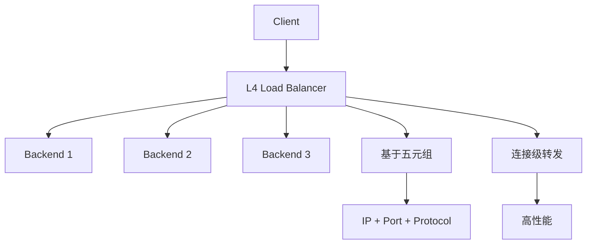

### 1.2 L4 的转发机制

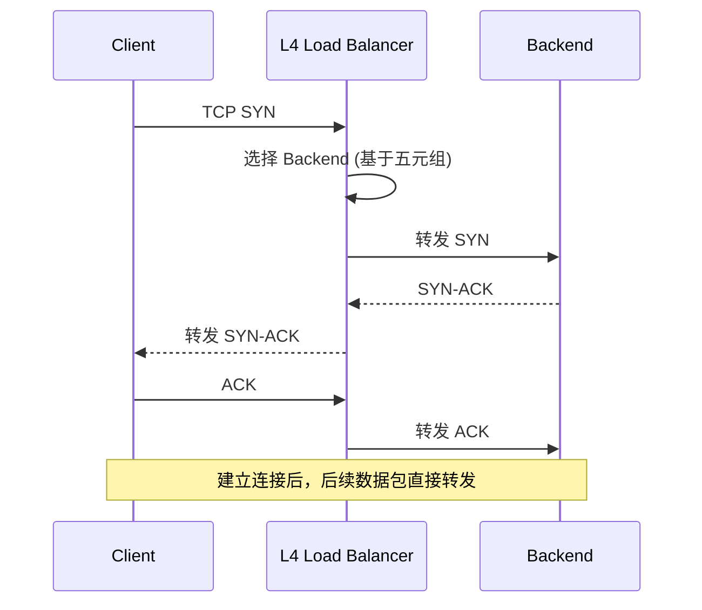

### 1.3 L4 的调度算法

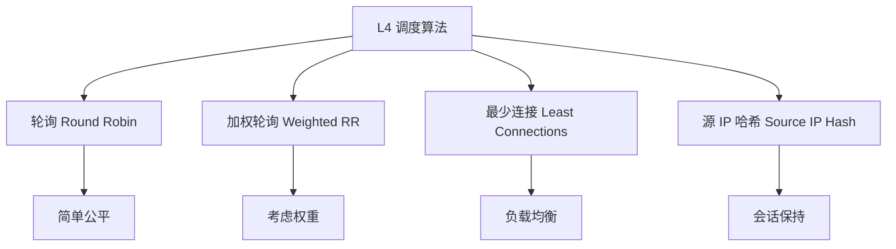

## 2. L7（应用层）负载均衡：以请求为单位

它能理解 HTTP/gRPC：

- 依据：Host/Path/Header/Cookie、method 等
- 常见能力：路由/灰度/鉴权/WAF/限流/观测（指标与日志更丰富）

代价：需要解析协议、通常还会承担 TLS 终止，CPU/内存开销更大，配置也更复杂。

### 2.1 L7 的工作原理

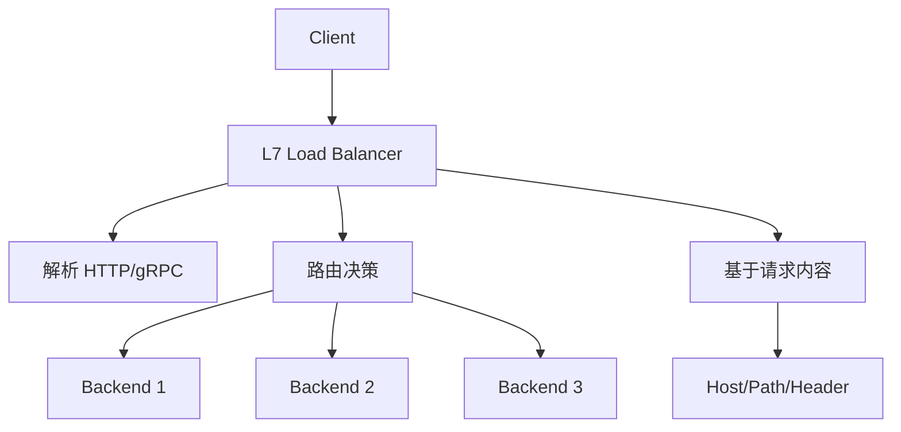

### 2.2 L7 的请求处理流程

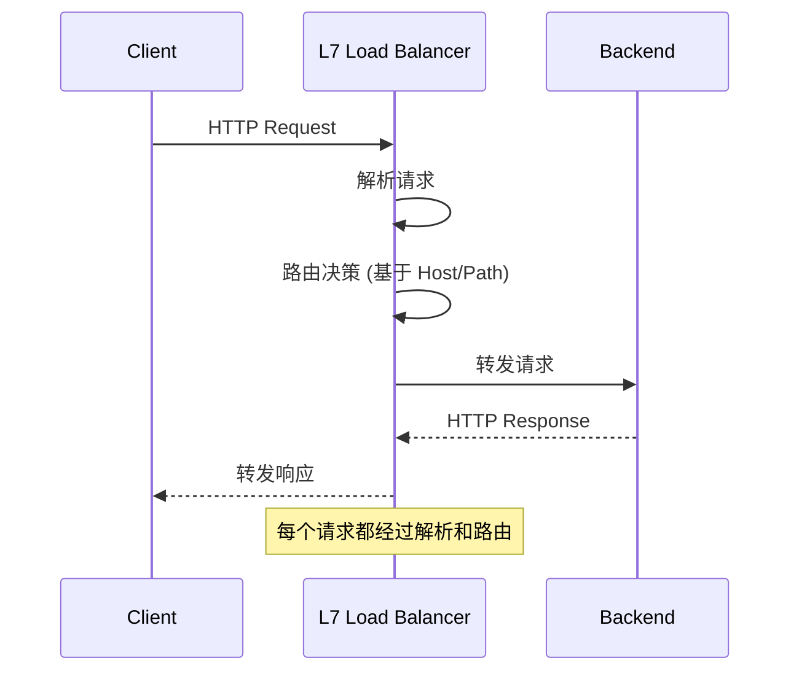

### 2.3 L7 的路由能力

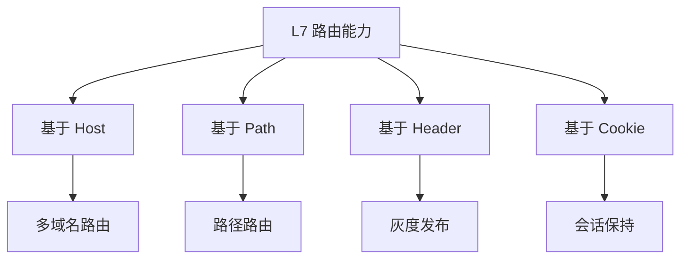

## 3. L4 vs L7：核心差异对比

### 3.1 功能对比

| 特性 | L4 | L7 |
|------|----|----|
| 转发粒度 | 连接级 | 请求级 |
| 协议理解 | 无 | HTTP/gRPC |
| 路由能力 | 简单（五元组） | 复杂（请求内容） |
| 性能 | 高吞吐、低延迟 | 相对较低 |
| CPU 开销 | 低 | 高（解析协议） |
| 配置复杂度 | 简单 | 复杂 |

### 3.2 性能对比

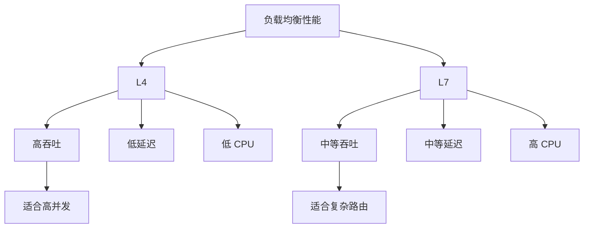

### 3.3 适用场景对比

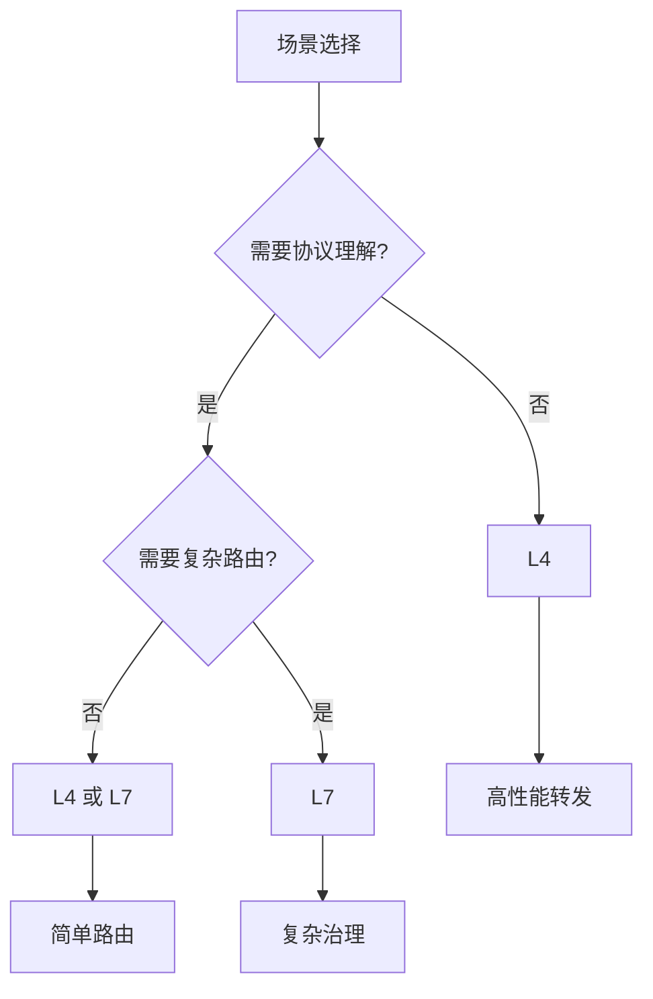

## 4. 选择建议（非常工程化）

- **追求极致转发性能、协议无关**：优先 L4
- **需要按路径/域名路由、灰度、鉴权、限流**：选择 L7
- **大型系统常见组合**：入口 L7（治理）+ 内部 L4（高性能转发/连接层面）

### 4.1 架构组合

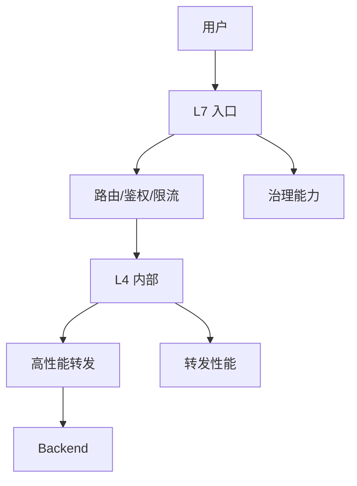

### 4.2 选型决策树

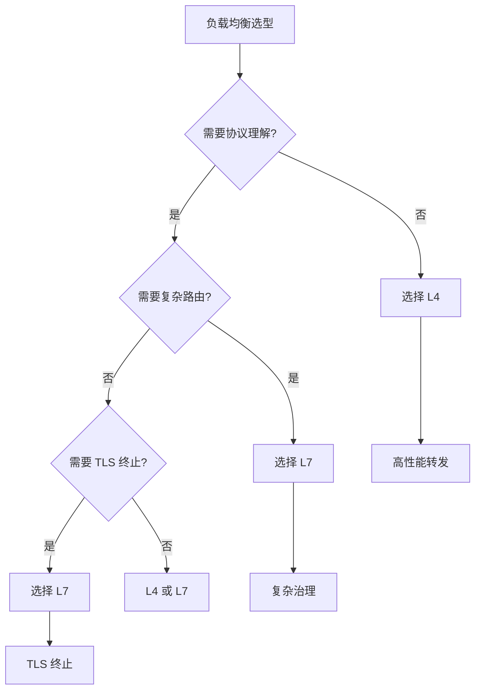

## 5. 排查清单（线上常用）

1. **瓶颈在哪**：L7 是否 CPU 打满（TLS/解析）？L4 是否在 conntrack/NAT 上吃资源？
2. **连接 vs 请求**：问题是连接堆积（L4）还是请求排队（L7）？
3. **健康检查/摘除**：是否健康检查不准确导致把流量打到坏实例？
4. **超时与重试**：是否因重试导致流量放大（尤其 L7 更常见）？

### 5.1 排障流程

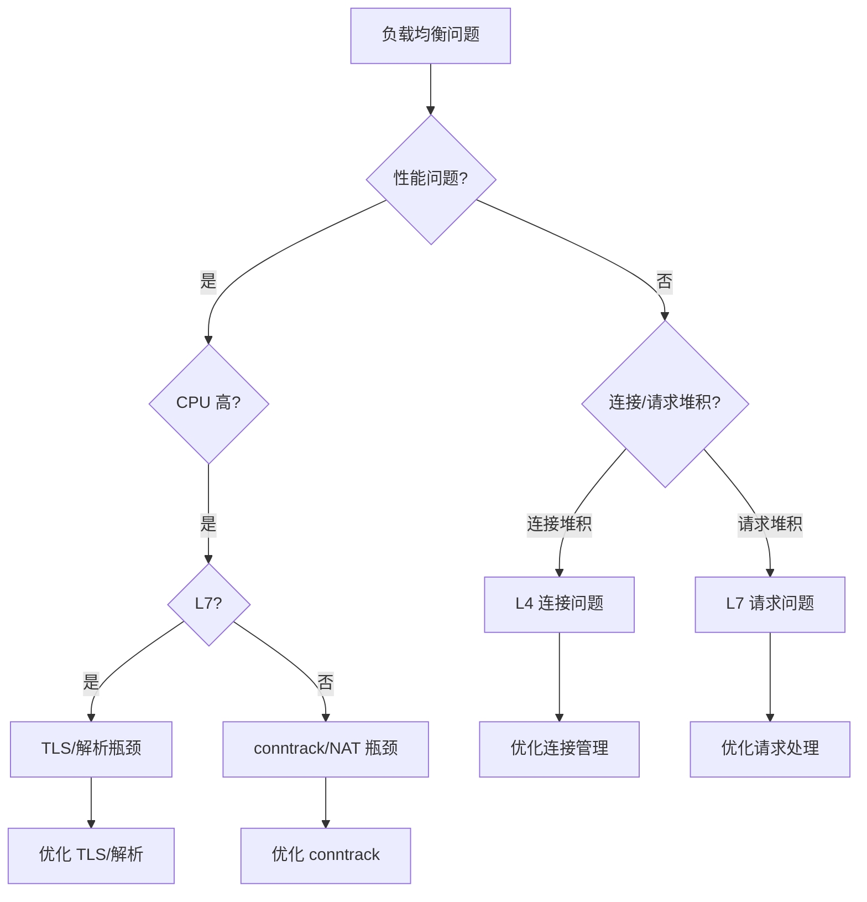

### 5.2 常见问题

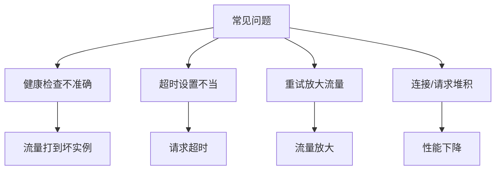

## 6. 实际案例

### 6.1 案例：L7 CPU 瓶颈

**问题**：L7 负载均衡器 CPU 占用高

**分析**：
- TLS 终止占用大量 CPU
- HTTP 解析开销大
- 单核热点

**优化**：
- 使用硬件加速（TLS offload）
- 优化 HTTP 解析
- 增加实例数

**结果**：CPU 占用降低 60%

### 6.2 案例：L4 连接数限制

**问题**：L4 负载均衡器连接数达到上限

**分析**：
- conntrack 表满
- 连接保持时间长
- 连接复用不足

**优化**：
- 增加 conntrack 表大小
- 优化连接保持时间
- 提高连接复用率

**结果**：连接数上限提升 3 倍

## 7. 设计原则与最佳实践

### 7.1 设计原则

1. **性能优先**：L4 用于高性能转发
2. **功能优先**：L7 用于复杂治理
3. **组合使用**：入口 L7 + 内部 L4

### 7.2 最佳实践

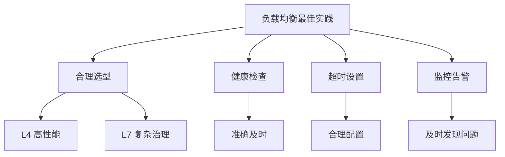

## 8. 小结

L4 强在"快"，L7 强在"懂"。选型时优先按业务需要的"治理能力"来定，再用架构组合把性能与能力同时拿到。

**核心要点**：
- L4 基于连接/五元组转发，性能高但功能简单
- L7 基于请求内容路由，功能强但性能相对较低
- 大型系统通常组合使用：入口 L7 + 内部 L4
- 排障时区分连接问题和请求问题

**选型建议**：
1. 追求极致性能 → L4
2. 需要复杂路由/治理 → L7
3. 大型系统 → L7 入口 + L4 内部
