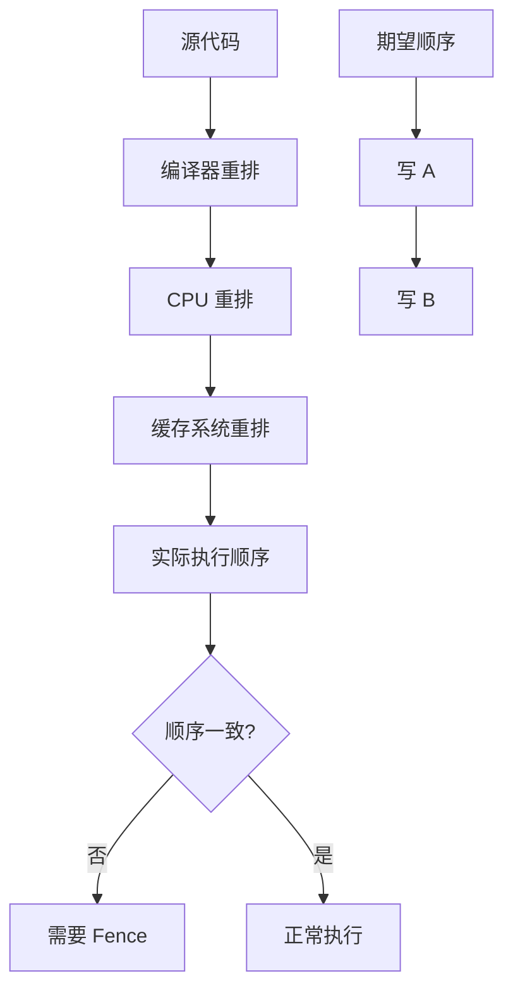
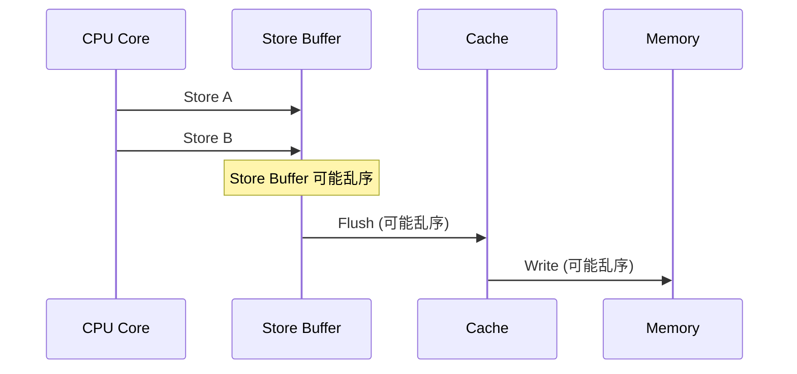
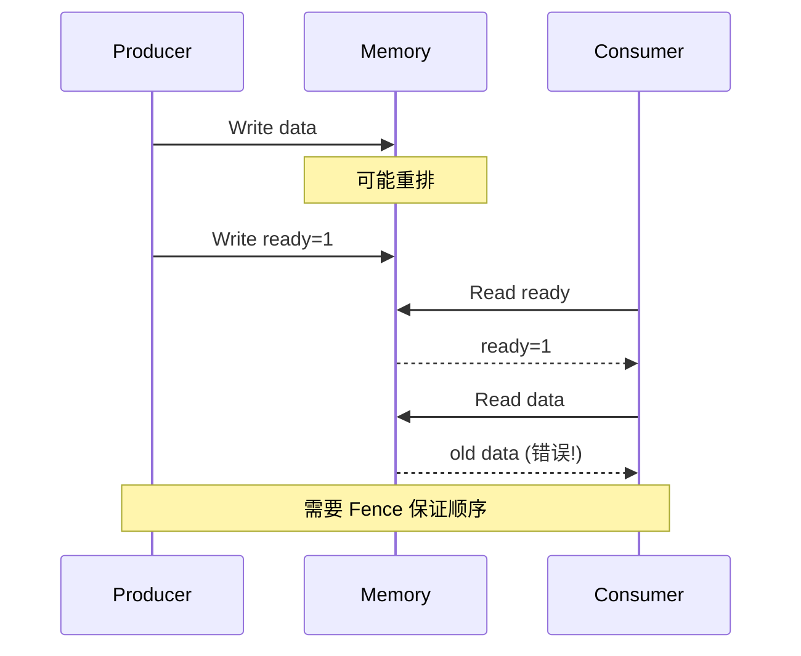
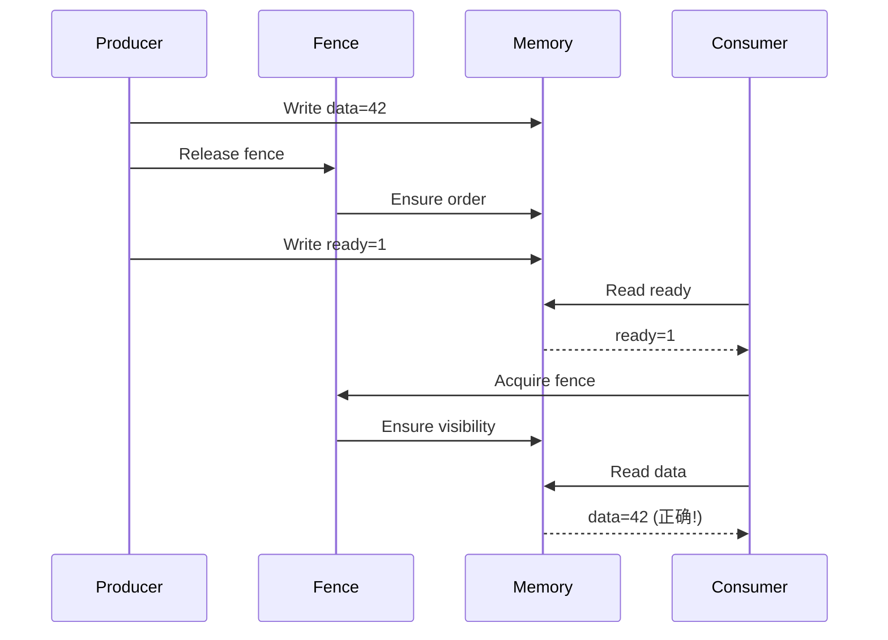
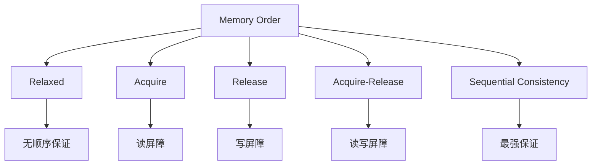
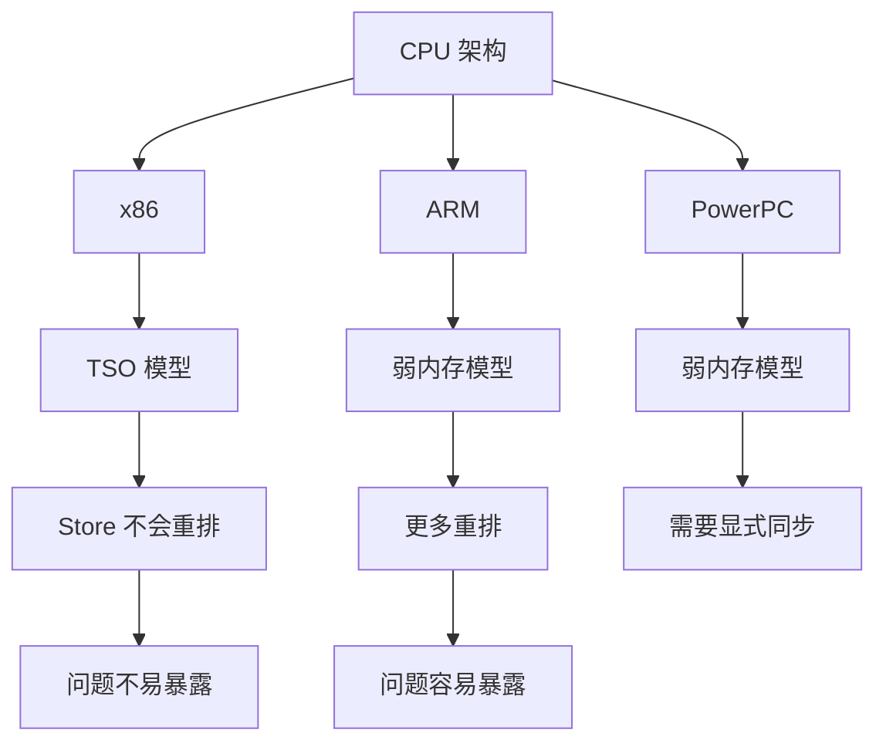
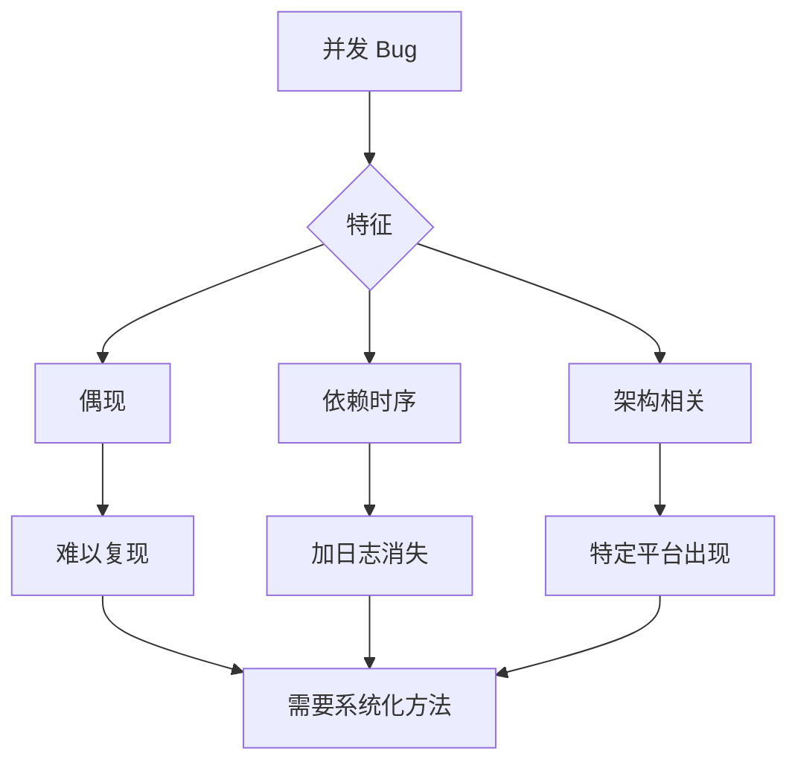
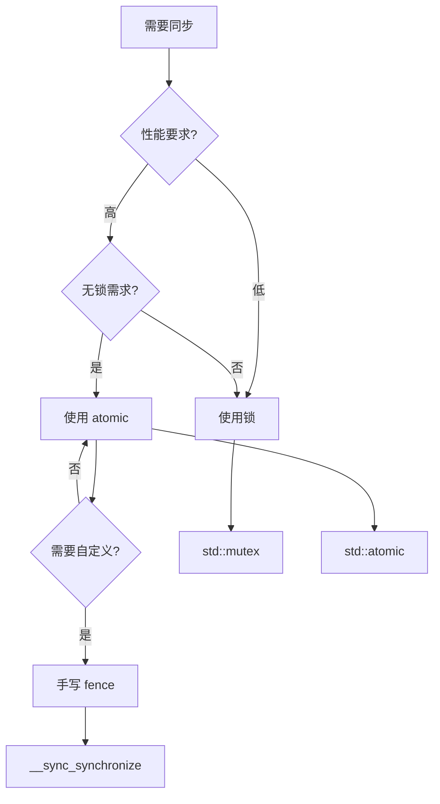
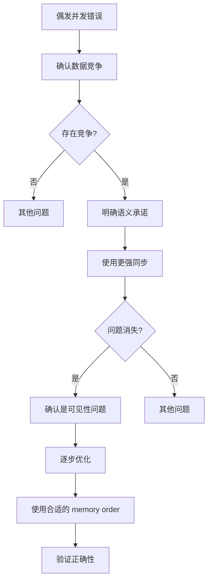
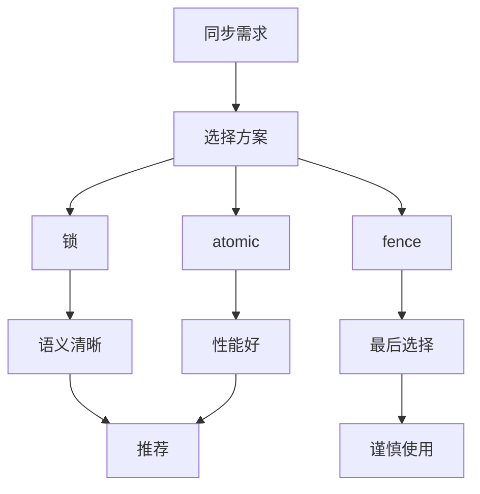

本文深入解析内存屏障（fence）的必要性、工作原理、常见场景和工程实践。


## 1. 为什么需要 fence：因为"顺序"不是你以为的顺序

并发 bug 最难的一类是：代码看起来没问题，但在某些机器/负载/优化级别下偶现。

根因通常来自三层重排：

- **编译器重排**：为了优化，会调整指令顺序（只要单线程语义不变）
- **CPU 重排**：乱序执行、store buffer、load speculation
- **缓存系统**：不同 core 的可见性与一致性传播存在延迟

因此，"我先写 A 再写 B" 并不保证另一个线程也按这个顺序观察到。

fence（内存屏障）提供的是：**跨线程可见性的顺序约束**。

### 1.1 三层重排机制



### 1.2 编译器重排示例

```cpp
// 源代码
int x = 1;
int y = 2;

// 编译器可能重排为
int y = 2;  // 先执行
int x = 1;  // 后执行
// 单线程语义不变，但多线程可能观察到不同顺序
```

### 1.3 CPU 重排示例



## 2. 最常见场景：发布-订阅（publish/consume）

经典模式：

### 2.1 发布端（producer）

1. 写数据 `data = ...`
2. 写标志 `ready = 1`

### 2.2 订阅端（consumer）

1. 读标志 `ready`
2. 如果为 1，再读数据 `data`

希望的承诺是：consumer 看到 `ready==1` 时，必然能看到 producer 写入的 `data`。

要达成这个承诺，需要正确的内存序（通常用语言层 atomic 的 release/acquire 语义，而不是手写 fence）。

### 2.3 问题场景



### 2.4 正确实现

```cpp
// 错误实现（无同步）
int data = 0;
int ready = 0;

// Producer
data = 42;
ready = 1;  // 可能重排到 data 之前

// Consumer
if (ready == 1) {
    int value = data;  // 可能读到旧值
}

// 正确实现（使用 atomic）
std::atomic<int> data{0};
std::atomic<int> ready{0};

// Producer
data.store(42, std::memory_order_relaxed);
ready.store(1, std::memory_order_release);  // release 保证之前的所有写可见

// Consumer
if (ready.load(std::memory_order_acquire) == 1) {  // acquire 保证之后的所有读看到 release 之前的写
    int value = data.load(std::memory_order_relaxed);  // 保证看到 42
}
```



## 3. 内存序（Memory Order）

### 3.1 内存序类型



### 3.2 内存序语义

| 内存序 | 语义 | 用途 |
|--------|------|------|
| relaxed | 无顺序保证 | 计数器等 |
| acquire | 读屏障 | Consumer 端 |
| release | 写屏障 | Producer 端 |
| acq_rel | 读写屏障 | 双向同步 |
| seq_cst | 顺序一致性 | 默认，最强保证 |

### 3.3 内存序示例

```cpp
// Release-Acquire 配对
std::atomic<int> data{0};
std::atomic<bool> ready{false};

// Thread 1 (Producer)
data.store(42, std::memory_order_relaxed);
ready.store(true, std::memory_order_release);  // release: 之前的所有写对 acquire 可见

// Thread 2 (Consumer)
if (ready.load(std::memory_order_acquire)) {  // acquire: 看到 release 之前的所有写
    assert(data.load(std::memory_order_relaxed) == 42);  // 保证看到 42
}
```

## 4. 为什么"偶现"：它依赖时序、缓存与编译优化

这类 bug 往往具有这些特征：

- debug 模式或加日志后消失（时序改变）
- 单核没问题，多核或高负载出现
- 只在某些架构出现（例如 x86 上不容易复现，ARM 更容易暴露）

### 4.1 架构差异



### 4.2 调试困难



## 5. 工程建议：优先用成熟原语，不要手写 fence

大原则：

- **能用锁就用锁**：语义最清晰
- **需要无锁时**：优先用语言/库提供的 atomic（明确 memory order）
- **最后才考虑手写 fence**：因为它很难保证跨平台正确性与可维护性

### 5.1 选择原则



### 5.2 代码示例

```cpp
// 推荐：使用 atomic
std::atomic<int> counter{0};
counter.fetch_add(1, std::memory_order_relaxed);

// 不推荐：手写 fence
int counter = 0;
__sync_synchronize();  // 全屏障，性能差
counter++;
__sync_synchronize();
```

## 6. 排障顺序（遇到"偶发并发错"）

1. **先确认是否数据竞争**：是否存在未同步的共享读写？
2. **把语义写成可验证的承诺**：例如"看到 ready==1 必须看到 data"
3. **用更强原语做 A/B**：用锁或更强 memory order 验证是否为可见性问题
4. **最后再优化回无锁**：先正确，再谈性能

### 6.1 排障流程



### 6.2 工具与方法

```bash
# 使用 ThreadSanitizer 检测数据竞争
gcc -fsanitize=thread program.c

# 使用内存模型检查工具
# C++ memory model checker
```

## 7. 实际案例

### 7.1 案例：无锁队列

**问题**：偶发读取到旧值

**分析**：
- Producer 和 Consumer 之间缺少同步
- Store 和 Load 可能重排

**修复**：
- 使用 release-acquire 语义
- Producer 使用 release，Consumer 使用 acquire

**结果**：问题消失

### 7.2 案例：双重检查锁定

**问题**：单例模式偶发创建多个实例

**分析**：
- 缺少内存屏障
- 编译器优化导致重排

**修复**：
- 使用 atomic 和 memory_order
- 或使用 std::call_once

**结果**：问题解决

## 8. 设计原则与最佳实践

### 8.1 设计原则

1. **优先使用高级抽象**：锁 > atomic > fence
2. **明确语义**：使用合适的 memory order
3. **跨平台考虑**：不要依赖特定架构的强内存模型

### 8.2 最佳实践



## 9. 小结

fence 的存在是因为现代系统会重排；需要的是"跨线程的可见性承诺"。工程实践里，把 fence 隐藏在原子操作/锁里通常是最稳的做法：语义清晰、跨平台一致、也更可维护。

**核心要点**：
- 现代系统有三层重排：编译器、CPU、缓存
- 需要 fence 保证跨线程可见性顺序
- 优先使用高级抽象（锁、atomic），最后才考虑手写 fence
- 使用合适的 memory order 平衡性能和正确性

**排障流程**：
1. 确认是否存在数据竞争
2. 明确语义承诺
3. 使用更强同步验证
4. 逐步优化到合适的 memory order
