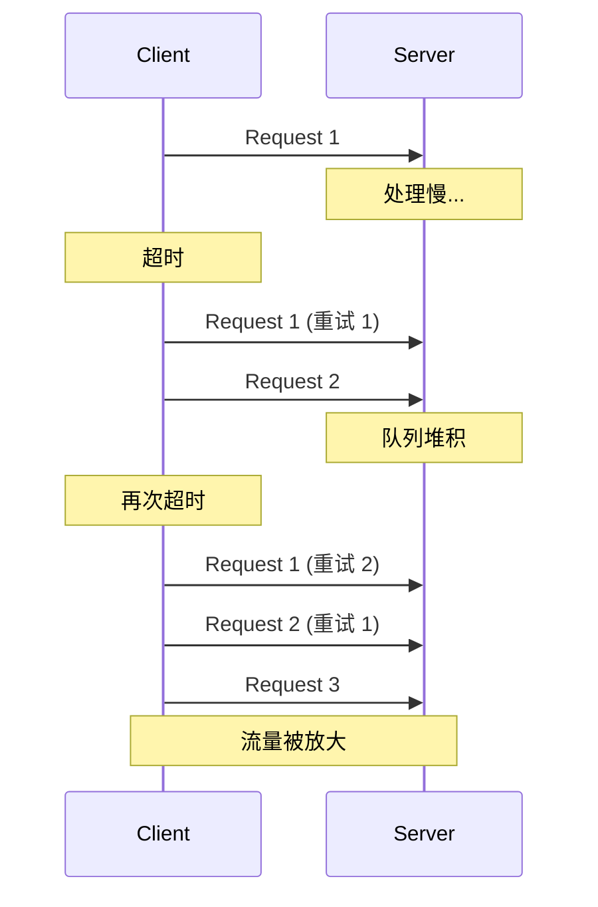
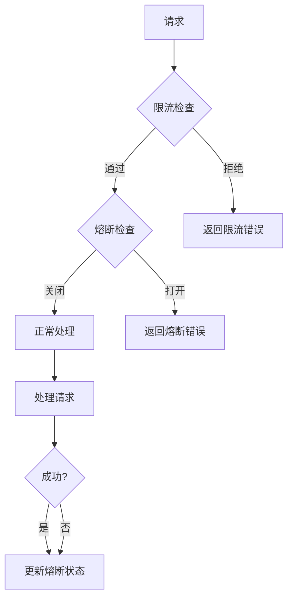
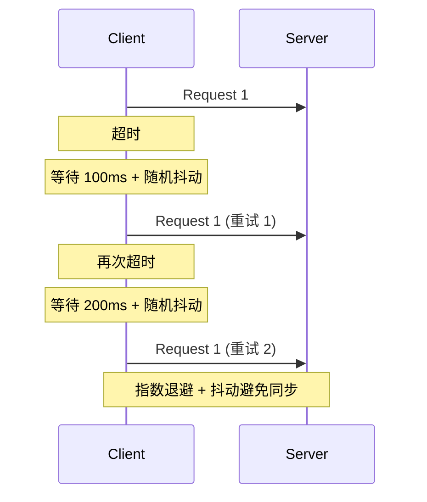
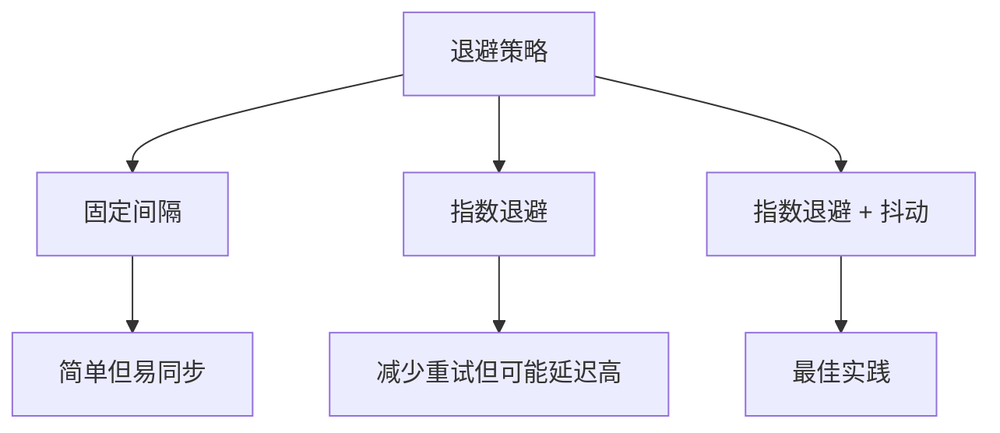
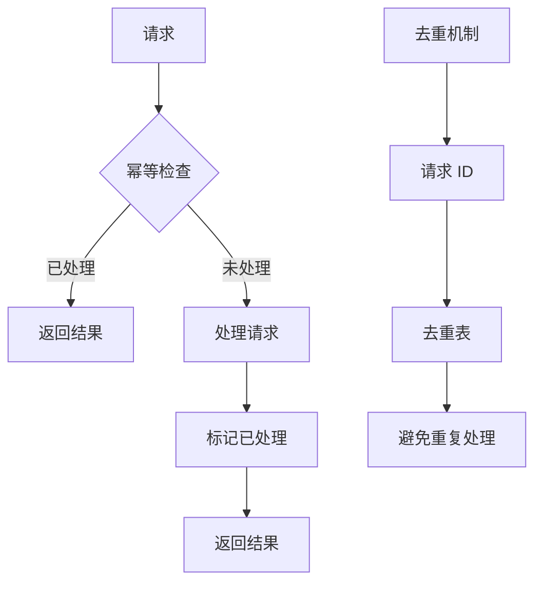
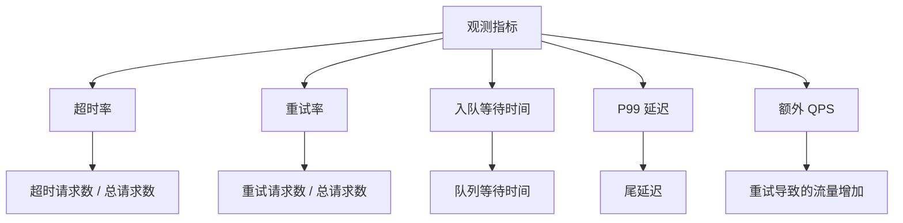
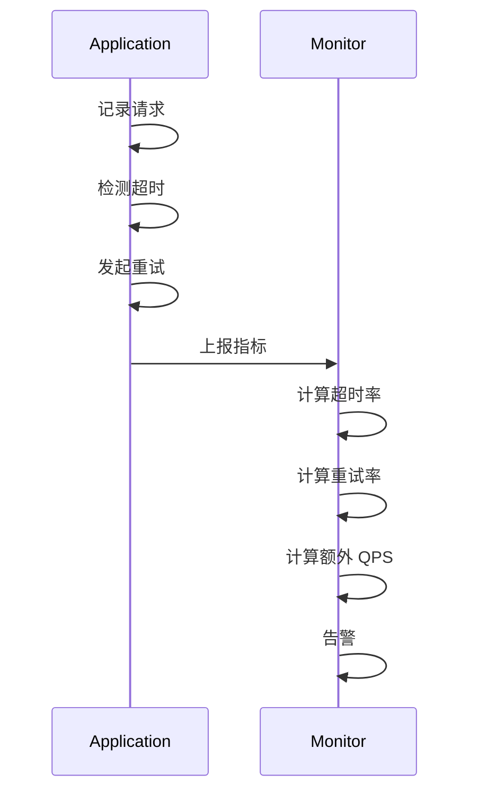
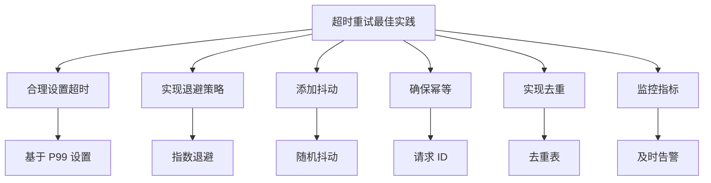

本文深入解析超时与重试机制如何导致流量放大，以及如何通过合理的策略避免这一问题。


## 1. 为什么超时 + 重试会放大流量

一次请求慢 → 触发重试 → 并发上升 → 队列更长 → 更慢 → 更多超时（正反馈）。

### 1.1 流量放大的正反馈循环

```mermaid
flowchart TD
  A[请求慢] --> B[触发超时]
  B --> C[发起重试]
  C --> D[并发上升]
  D --> E[队列更长]
  E --> F[响应更慢]
  F --> A
  
  Note over A,F: 正反馈循环
```

### 1.2 重试放大的示例



### 1.3 流量放大倍数

假设：
- 原始 QPS: 1000
- 超时率: 5%
- 重试次数: 3 次
- 重试成功率: 50%

流量放大 = 1000 + 1000 × 5% × 3 × 50% = 1075 QPS

如果重试没有退避，所有重试同时发生，可能导致流量瞬间放大数倍。

```mermaid
flowchart TD
  A[原始流量] --> B[超时请求]
  B --> C[重试流量]
  C --> D[总流量]
  
  E[1000 QPS] --> F[50 超时]
  F --> G[150 重试]
  G --> H[1150 总流量]
  
  Note over E,H: 流量放大 15%
```

## 2. 工程解法（优先级顺序）

1. **限流/熔断**：先阻止雪崩扩散
2. **退避 + 抖动**：避免同步重试
3. **幂等与去重**：避免重试产生副作用

### 2.1 限流/熔断



### 2.2 退避 + 抖动



### 2.3 退避策略对比

| 策略 | 优点 | 缺点 |
|------|------|------|
| 固定间隔 | 简单 | 容易同步 |
| 指数退避 | 减少重试 | 延迟可能高 |
| 指数退避 + 抖动 | 避免同步 | 实现稍复杂 |



### 2.4 幂等与去重



## 3. 观测指标

超时率、重试率、入队等待时间、P99、以及重试导致的额外 QPS。

### 3.1 关键指标



### 3.2 指标监控



## 4. 实际案例

### 4.1 案例：同步重试导致的流量放大

**问题**：系统在高峰期出现流量突然放大 3 倍

**分析**：
- 超时率 10%
- 所有重试同时发生（无退避）
- 导致流量瞬间放大

**优化**：
- 实现指数退避
- 添加随机抖动
- 添加限流

**结果**：
- 流量放大降到 15%
- 系统稳定性提升

### 4.2 案例：重试导致的数据重复

**问题**：重试导致数据重复写入

**分析**：
- 请求没有幂等性
- 重试时重复处理
- 导致数据重复

**优化**：
- 添加请求 ID
- 实现去重机制
- 确保幂等性

**结果**：数据重复问题解决

## 5. 设计原则与最佳实践

### 5.1 设计原则

1. **先限流后重试**：避免雪崩
2. **退避 + 抖动**：避免同步
3. **幂等 + 去重**：避免副作用

### 5.2 最佳实践



## 6. 小结

超时与重试是网络编程中的常见模式，但不合理的重试策略会导致流量放大，形成正反馈循环。通过限流/熔断、退避+抖动、幂等+去重等策略，可以有效避免这一问题。

**核心要点**：
- 超时 + 重试会形成正反馈循环，导致流量放大
- 限流/熔断是防止雪崩的第一道防线
- 退避 + 抖动可以避免同步重试
- 幂等 + 去重可以避免重试副作用

**优化策略**：
1. 先限流/熔断，再重试
2. 实现指数退避 + 随机抖动
3. 确保请求幂等性
4. 监控关键指标（超时率、重试率、额外 QPS）
