本文深入解析分支预测失败导致的流水线 flush 机制、性能影响和优化方法。


## 1. flush 的要点：猜错了就要"推倒重来"

现代 CPU 会预测分支走向，并提前把后续指令塞进流水线执行（投机执行）。

当预测失败时会发生：

- 已经进入流水线的指令结果作废
- 流水线被清空（flush）
- 从正确路径重新取指、解码、执行

因此 branch miss 的代价不是"多走一次 if"，而是浪费一段完整流水线深度的 cycles。

### 1.1 流水线执行流程

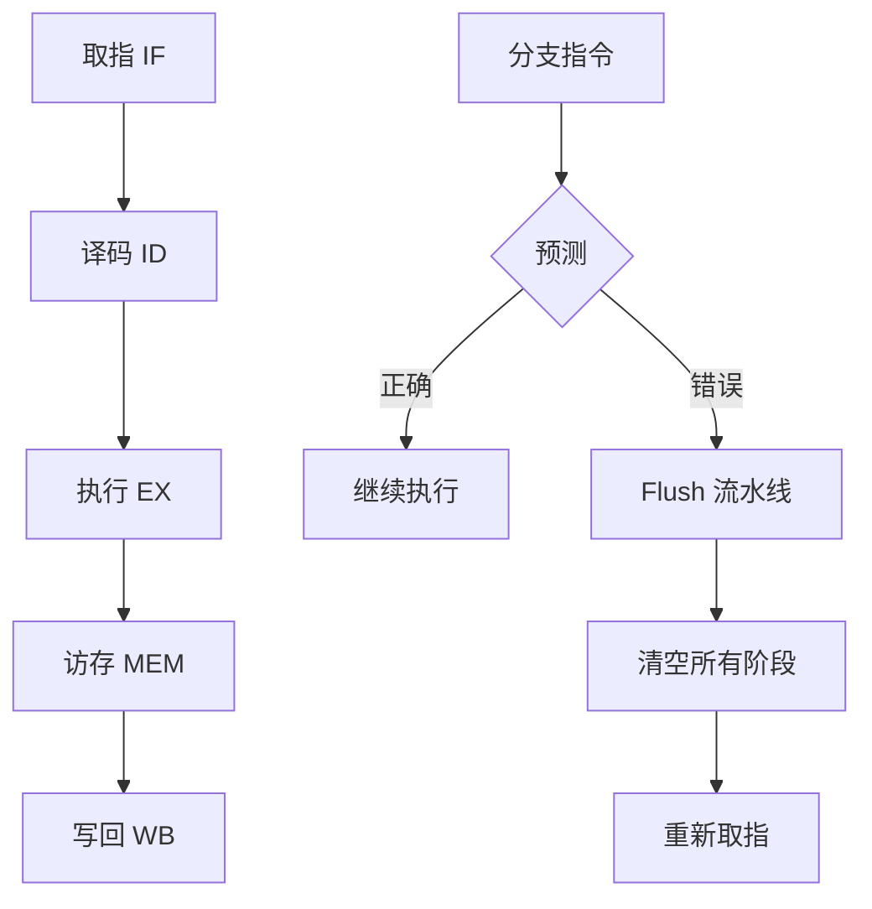

### 1.2 分支预测失败的影响

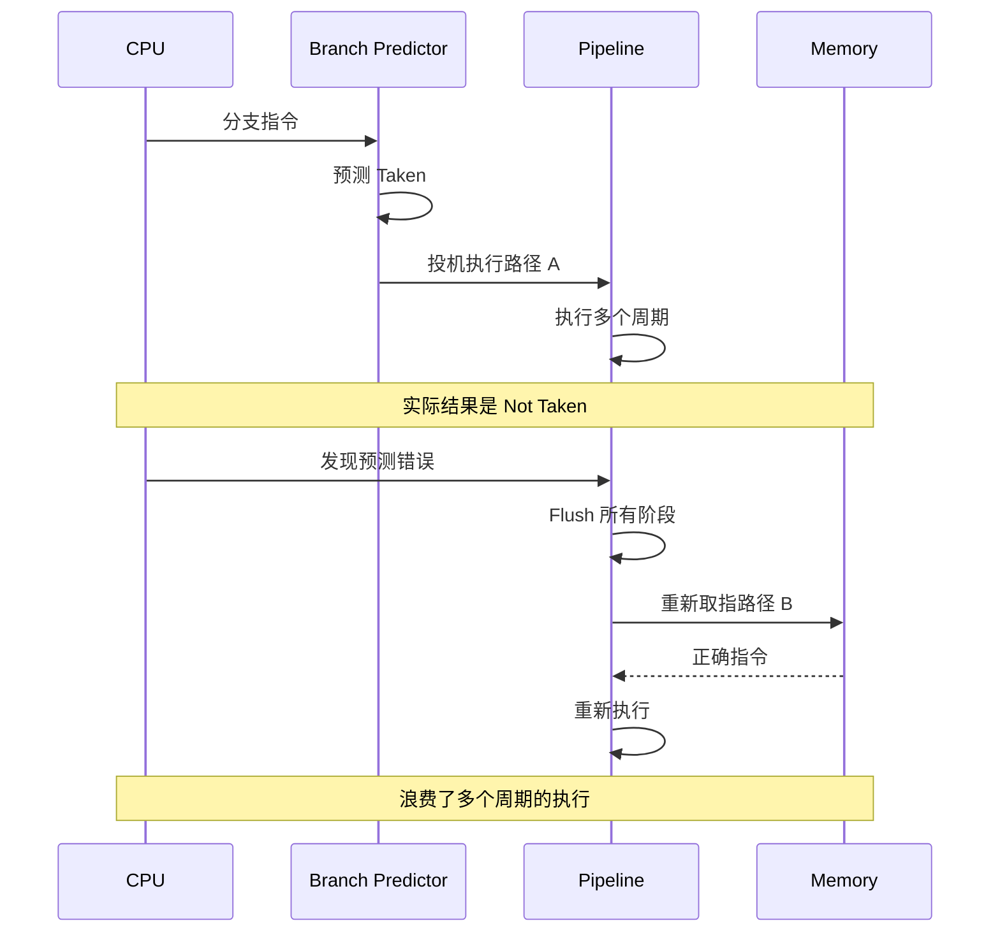

### 1.3 Flush 的代价

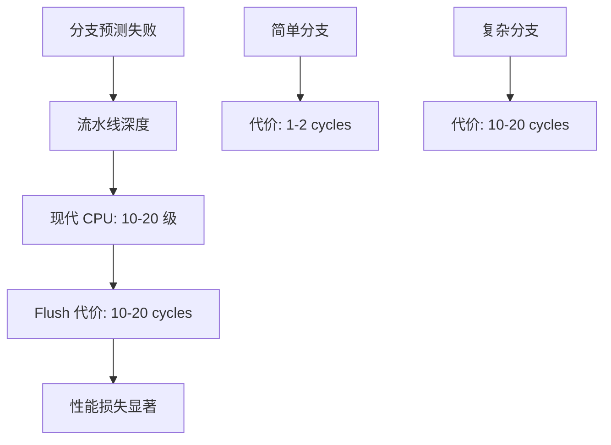

## 2. 为什么它会把吞吐打下去：IPC 下降是直接结果

线上通常观察到的是：

- **branch miss 高**
- **IPC 低**
- 在"CPU 利用率看起来差不多"的情况下，吞吐明显更差

原因：大量 cycles 花在"清空/重填流水线"，而不是做有效工作。

### 2.1 IPC 与 Branch Miss 的关系

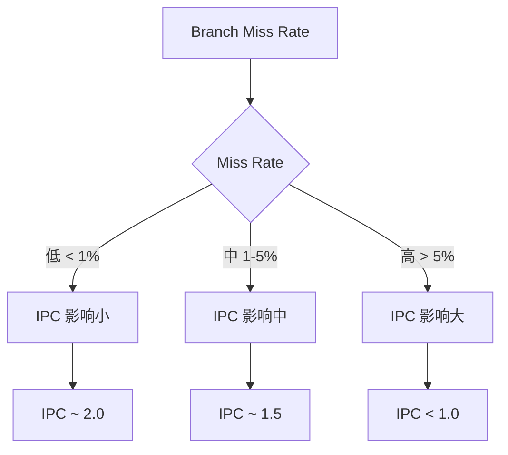

### 2.2 性能影响示例

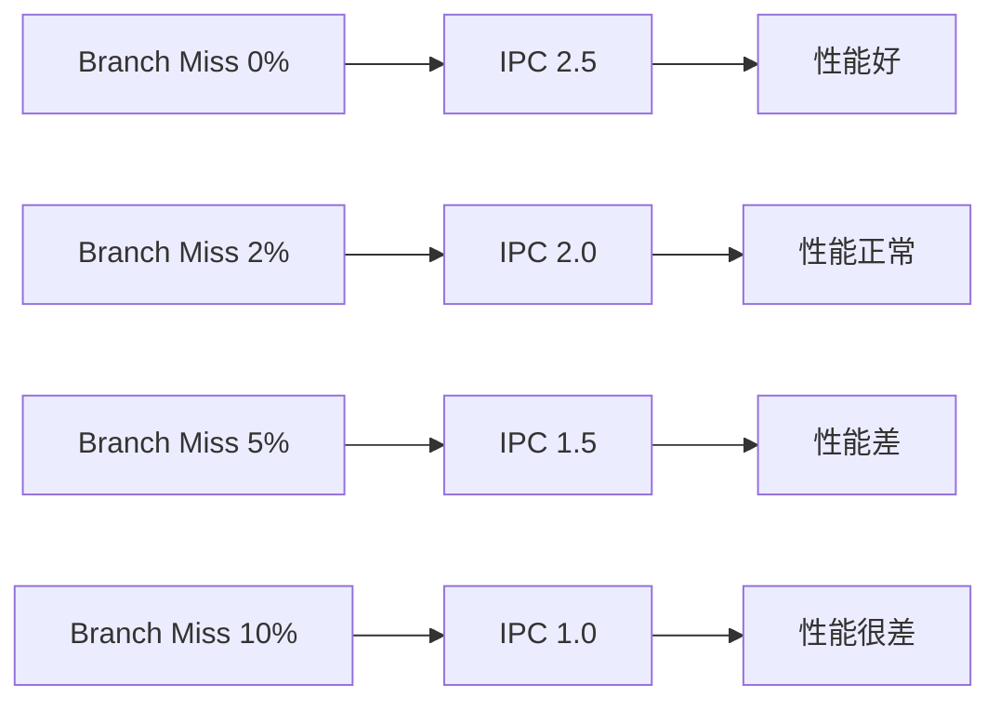

## 3. 典型触发点：不可预测分支 + 热路径上大量 if

最容易导致预测失败的分支形态：

- 分支走向高度依赖输入数据且随机（例如 hash 命中/不命中混杂、复杂状态机）
- 多层 if/else 且热路径不稳定
- switch-case 分支分布极不均匀且随时间变化

### 3.1 不可预测分支示例

```cpp
// 问题代码：分支不可预测
int hash_lookup(int key) {
    int index = hash(key) % table_size;
    if (table[index].key == key) {  // 分支走向依赖数据，难以预测
        return table[index].value;
    } else {
        return -1;
    }
}
```

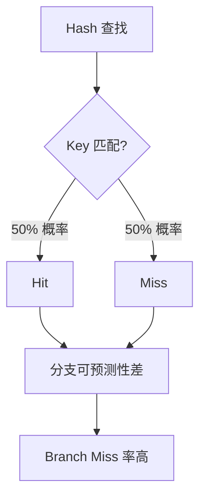

### 3.2 复杂状态机

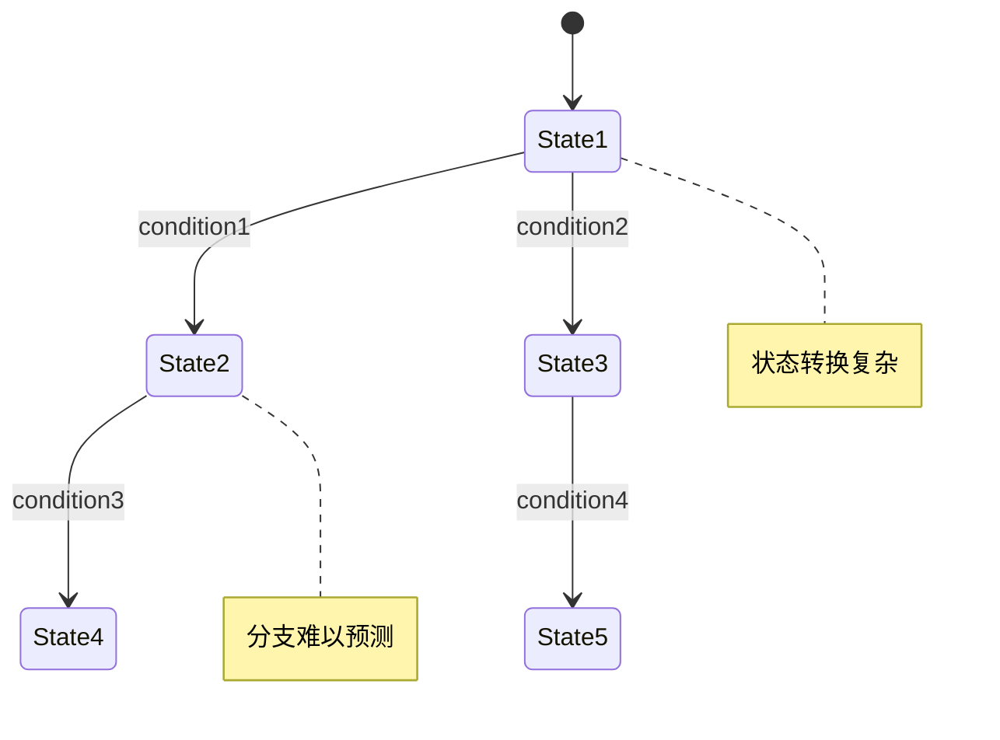

## 4. 怎么验证：不要猜，拿指标证明

建议最小闭环：

1. profile 找到热点函数/热点分支点
2. 看 branch miss 是否集中在这些热点上
3. 做 A/B：把逻辑改成"更可预测"的形态后，IPC/吞吐是否改善

### 4.1 测量方法

```bash
# 使用 perf 测量分支预测
perf stat -e branches,branch-misses ./program

# 输出示例
# 1,000,000 branches
# 50,000 branch-misses
# Branch Miss Rate = 5%
```

### 4.2 定位热点分支

```bash
# 使用 perf record 记录分支信息
perf record -e branch-misses ./program
perf report

# 或使用 annotate 查看具体分支
perf annotate function_name
```

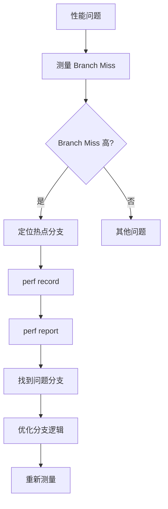

## 5. 工程优化思路（按常用程度排序）

### 5.1 分离热路径

把常见分支单独写直（early return），让 predictor 更容易学到规律。

```cpp
// 优化前：分支难以预测
int process(int value) {
    if (value < 0) {
        return error_handler(value);
    }
    if (value > 1000) {
        return error_handler(value);
    }
    return normal_process(value);  // 热路径
}

// 优化后：热路径分离
int process(int value) {
    if (value >= 0 && value <= 1000) {
        return normal_process(value);  // 热路径，分支可预测
    }
    return error_handler(value);  // 冷路径
}
```

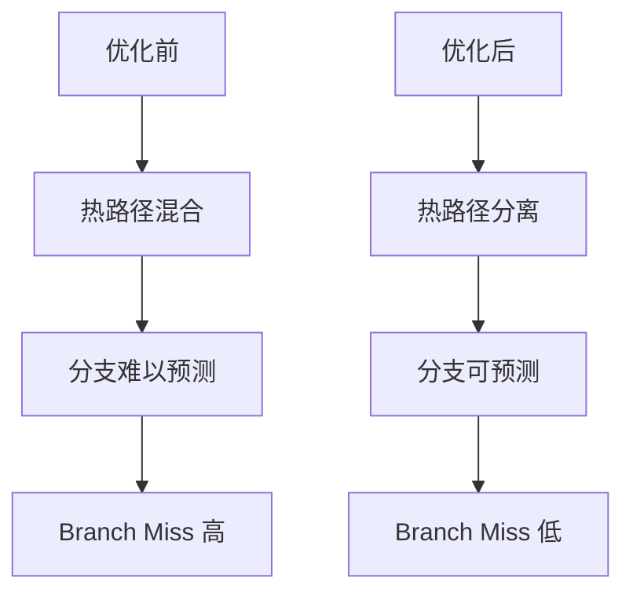

### 5.2 表驱动替代分支

把 if/else 变成查表（注意 cache 访问形态）。

```cpp
// 优化前：多个分支
int get_value(int type) {
    if (type == 0) return 10;
    if (type == 1) return 20;
    if (type == 2) return 30;
    return 0;
}

// 优化后：表驱动
int get_value(int type) {
    static const int table[] = {10, 20, 30};
    return (type >= 0 && type < 3) ? table[type] : 0;
}
```

### 5.3 减少分支层级

把多个条件组合成位运算/掩码（可读性与维护性要权衡）。

```cpp
// 优化前：多个分支
bool check(int flags) {
    if (flags & FLAG_A) {
        if (flags & FLAG_B) {
            return true;
        }
    }
    return false;
}

// 优化后：位运算
bool check(int flags) {
    return (flags & (FLAG_A | FLAG_B)) == (FLAG_A | FLAG_B);
}
```

### 5.4 让数据更"可预测"

例如把热点/常见 case 聚到一起，提高局部性。

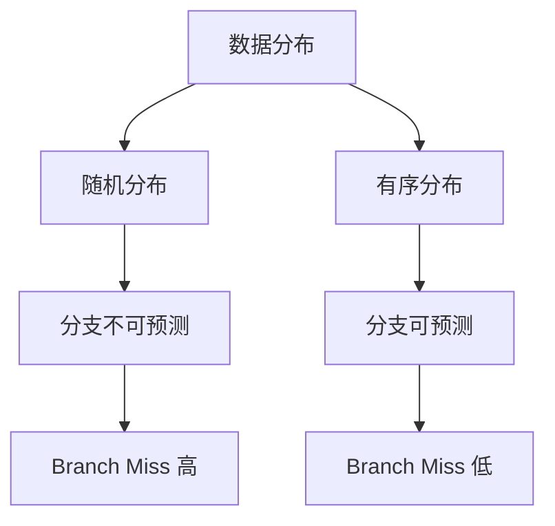

## 6. 排障清单（"CPU 没满但吞吐差"）

1. IPC 是否低？（先确认是否 stall-bound）
2. branch miss 是否高？是否集中在热点函数？
3. cache miss 是否也高？（如果同时高，可能是数据布局与分支共同导致）
4. 做最小 A/B 验证：热路径重构后吞吐是否提升？

### 6.1 排障流程

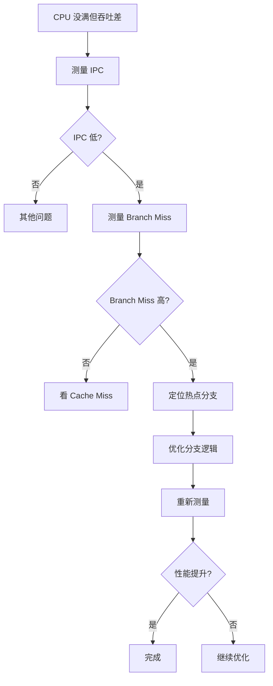

## 7. 实际案例

### 7.1 案例：Hash 表查找优化

**问题**：Hash 表查找性能差，IPC 只有 0.9

**分析**：
- Branch Miss Rate = 12%
- 分支走向依赖数据，难以预测

**优化**：
- 使用更可预测的 Hash 函数
- 减少分支层级
- 使用位运算替代部分分支

**结果**：
- Branch Miss Rate 降到 3%
- IPC 提升到 1.5
- 性能提升 60%

### 7.2 案例：状态机优化

**问题**：状态机处理性能差

**分析**：
- 状态转换复杂，分支不可预测
- Branch Miss Rate = 8%

**优化**：
- 使用表驱动状态机
- 分离热路径状态
- 优化状态编码

**结果**：
- Branch Miss Rate 降到 2%
- IPC 提升到 1.8
- 性能提升 80%

## 8. 设计原则与最佳实践

### 8.1 设计原则

1. **热路径分离**：把常见分支单独处理
2. **减少分支**：使用表驱动、位运算等
3. **提高可预测性**：让数据分布更有序

### 8.2 最佳实践

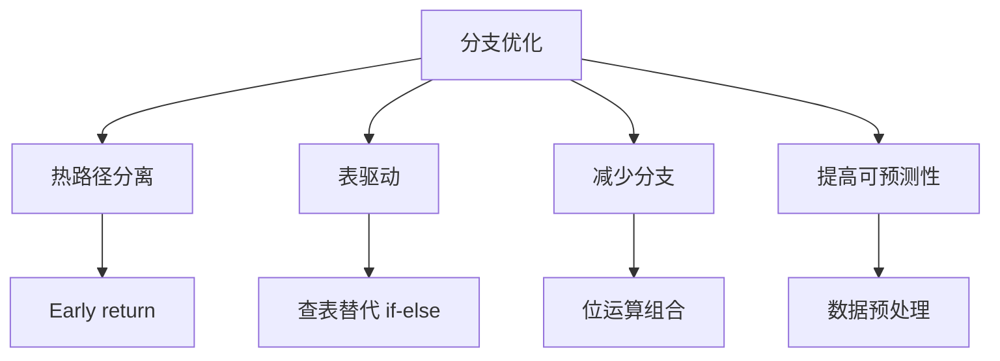

## 9. 小结

branch miss 的成本来自流水线 flush。工程上最有效的做法通常不是"神秘的编译器开关"，而是把热路径写得更直、更可预测，并用 IPC/branch miss 的指标闭环验证。

**核心要点**：
- 分支预测失败会导致流水线 flush，代价是 10-20 cycles
- Branch Miss Rate 直接影响 IPC
- 不可预测分支（hash、状态机）最容易导致问题
- 通过热路径分离、表驱动等方法可以优化

**优化策略**：
1. 分离热路径，让常见分支可预测
2. 使用表驱动替代多个 if-else
3. 减少分支层级，使用位运算
4. 让数据分布更有序，提高可预测性
