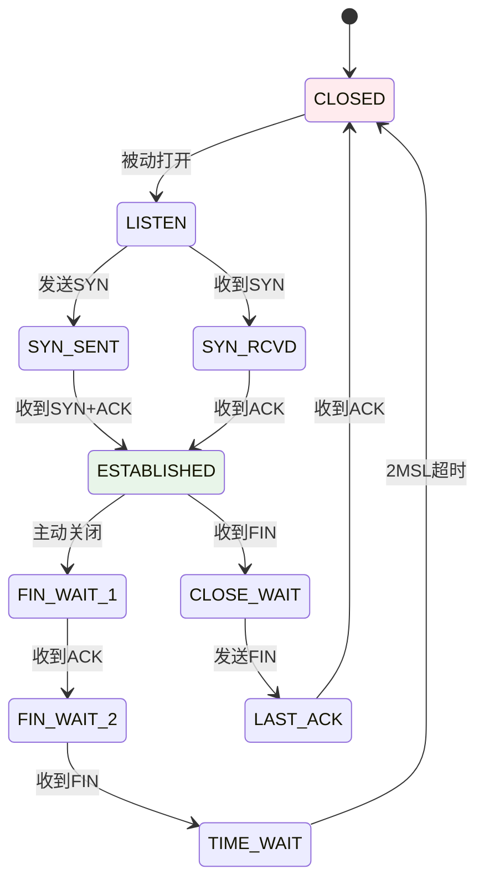
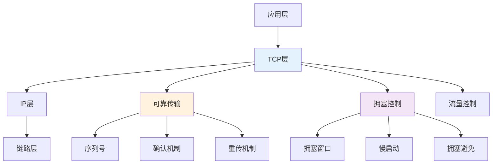

## 前言

TCP 是互联网最重要的传输协议，它通过可靠传输和拥塞控制两个核心机制，保证了数据在网络中的可靠、高效传输。理解 TCP 的工作原理不仅是掌握网络编程的关键，更是进行网络优化和问题排查的基础。本文将从原理、实现、性能等多个维度深入解析 TCP 的可靠传输和拥塞控制，帮助读者全面理解这一重要协议。


## 1. TCP 的可靠传输靠什么

核心机制：

- **序列号（seq）**：数据按序编号
- **确认（ACK）**：接收端告诉发送端“收到到哪里了”
- **重传**：丢包/超时就重发（也可以基于重复 ACK 快速重传）

所以“可靠”不是不丢包，而是：**丢了也能被发现并补回来**。

### 1.1 为什么“少量丢包”也会让 P99 很难看

因为 TCP 是按序交付字节流：丢了中间一段，后面的数据即使到了，也要等重传补齐才能交付给上层。于是你看到的是：

- 平均 OK
- 但少量请求被“按序交付”拖成长尾

这就是你在 HTTP/2、RPC 里经常看到的“同连接多路复用，丢包一起慢”的根因之一。

## 2. 为什么需要拥塞控制

如果发送端无限加速，会把网络里的队列塞满，导致：

- 排队延迟暴涨（bufferbloat）
- 丢包变多，重传变多
- 全链路吞吐反而下降

拥塞控制就是在“尽量快”和“别把网络打爆”之间做动态平衡。

## 3. 一个最有用的直觉：窗口（window）是节流阀

你可以把发送窗口理解成：

- **对端能力（rwnd）**：接收端来不来得及收
- **网络能力（cwnd）**：网络承不承受得住

最终发送速率受两者共同限制。

### 3.1 关键结论：吞吐由“在途数据量”决定

你可以用一句工程直觉理解吞吐上限：

> 吞吐 \(\approx\) 在途数据量 / RTT

而“在途数据量”受窗口（min(rwnd, cwnd)）限制。

## 4. 你在线上会遇到的 3 类问题（以及它们分别像什么）

### 4.1 丢包主导：重传多、RTO 多、P99 像过山车

- dup ack / fast retransmit 上升
- RTO 上升（最致命）
- 应用层超时/重试被触发，进一步放大流量

### 4.2 排队主导（bufferbloat）：不怎么丢包，但 RTT 被拉长

- RTT（尤其 P95/P99）显著高于最小 RTT
- 吞吐可能还行，但尾延迟很差

### 4.3 接收端主导：rwnd 小、应用读得慢

- receiver window 持续偏小
- 应用层处理不过来，反压到网络

## 5. 你应该观测什么（建议优先级）

1. **RTT 分布**：最小 RTT vs 当前 RTT（判断是否排队）
2. **丢包/重传**：retransmits、dupacks、RTO 次数
3. **吞吐与 in-flight**：是否被窗口限制？
4. **应用层超时/重试**：是否进入“正反馈放大”？

## 6. 最小排障顺序（TCP 变慢/抖动）

1. **先判定是丢包主导还是排队主导**：看重传与 RTT 分布
2. **再定位发生在哪一段**：客户端出口/中间链路/服务端入口？
3. **最后再动策略**：超时、重试、连接复用、拥塞控制算法等（先归因后调整）

## 7. TCP 的设计模式与架构

### 7.1 设计模式视角

TCP 体现了多个设计模式：

1. **状态机模式**：TCP 连接通过状态机管理连接生命周期
2. **滑动窗口模式**：通过滑动窗口实现流量控制
3. **重传模式**：通过超时和快速重传实现可靠传输

### 7.2 TCP 的状态机



### 7.3 TCP 的架构层次



## 8. 实际工程案例

### 8.1 TCP 连接优化

```cpp
// TCP 连接优化配置
int set_tcp_options(int sockfd) {
    // 开启 TCP_NODELAY：禁用 Nagle 算法，减少延迟
    int flag = 1;
    setsockopt(sockfd, IPPROTO_TCP, TCP_NODELAY, &flag, sizeof(flag));
    
    // 设置接收缓冲区大小
    int recv_buf = 1024 * 1024;  // 1MB
    setsockopt(sockfd, SOL_SOCKET, SO_RCVBUF, &recv_buf, sizeof(recv_buf));
    
    // 设置发送缓冲区大小
    int send_buf = 1024 * 1024;  // 1MB
    setsockopt(sockfd, SOL_SOCKET, SO_SNDBUF, &send_buf, sizeof(send_buf));
    
    // 开启 TCP_QUICKACK：快速确认
    flag = 1;
    setsockopt(sockfd, IPPROTO_TCP, TCP_QUICKACK, &flag, sizeof(flag));
    
    return 0;
}
```

### 8.2 拥塞控制算法选择

不同的拥塞控制算法适用于不同场景：

- **CUBIC**：默认算法，适合长距离、高带宽网络
- **BBR**：Google 开发，适合高带宽、低延迟网络
- **Reno**：经典算法，适合大多数场景

## 9. 性能分析与优化

### 9.1 TCP 性能的关键指标

1. **吞吐量**：受窗口大小和 RTT 限制
   - 吞吐量 ≈ 窗口大小 / RTT
2. **延迟**：受 RTT、排队延迟、重传延迟影响
3. **重传率**：反映网络质量，重传率高说明网络不稳定

### 9.2 性能优化策略

1. **增大窗口大小**：提高吞吐量上限
2. **减少 RTT**：使用 CDN、优化路由
3. **减少重传**：优化网络质量、调整超时参数
4. **选择合适的拥塞控制算法**：根据网络特征选择

## 10. 小结

TCP 可靠传输解决"丢了怎么办"，拥塞控制解决"别把网络打爆"。线上体验往往由"重传（丢包）+ 排队（bufferbloat）"共同决定：先把这两类问题分开，排障速度会快很多。

**核心概念总结**：

- **可靠传输原理**：通过序列号、确认、重传机制保证数据可靠传输
- **拥塞控制原理**：通过动态调整发送窗口避免网络拥塞
- **窗口机制**：发送窗口受接收窗口和拥塞窗口共同限制
- **性能优化**：通过增大窗口、减少 RTT、优化算法等提升性能

**设计亮点**：

1. **可靠传输**：通过序列号、确认、重传机制保证数据不丢失、不重复、有序
2. **拥塞控制**：通过动态调整发送速率避免网络拥塞
3. **流量控制**：通过接收窗口防止接收端缓冲区溢出
4. **状态管理**：通过状态机管理连接生命周期
5. **性能优化**：通过多种机制优化传输性能

**关键要点**：

- TCP 可靠传输解决"丢了怎么办"，拥塞控制解决"别把网络打爆"
- 吞吐量受窗口大小和 RTT 限制：吞吐量 ≈ 窗口大小 / RTT
- 线上体验往往由"重传（丢包）+ 排队（bufferbloat）"共同决定
- 先把丢包和排队两类问题分开，排障速度会快很多
- 理解 TCP 的工作原理是进行网络优化和问题排查的基础

掌握 TCP 的可靠传输和拥塞控制原理，可以更好地进行网络设计、性能优化和问题排查。