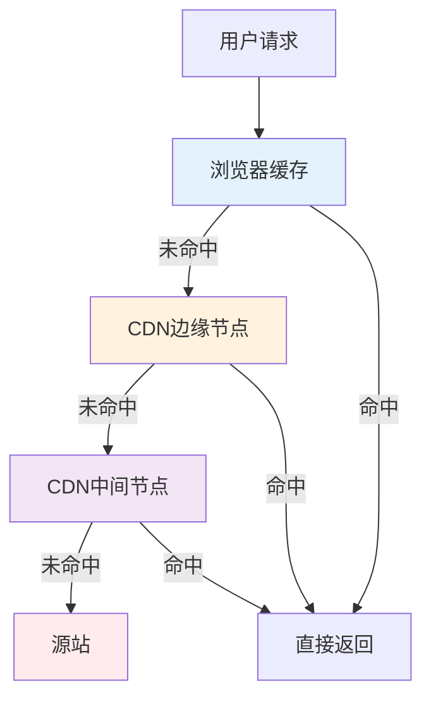
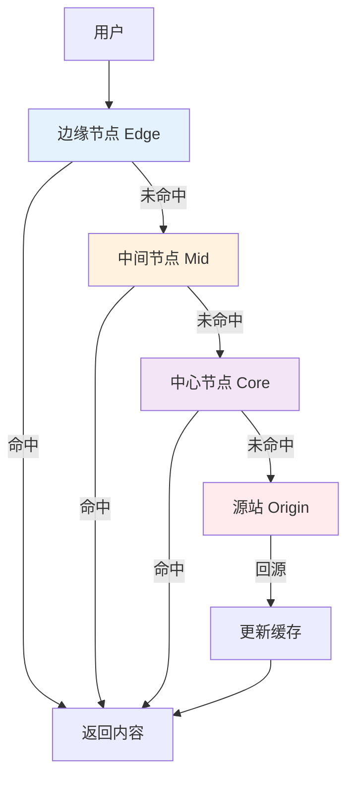

## 前言

HTTP 缓存和 CDN 是现代 Web 性能优化的核心技术，它们通过减少网络传输和降低延迟，显著提升了用户体验。理解 HTTP 缓存的工作原理和 CDN 的架构设计，不仅是掌握 Web 性能优化的关键，更是进行系统架构设计的基础。本文将从原理、实现、性能等多个维度深入解析 HTTP 缓存和 CDN，帮助读者全面理解这一重要技术。

## 1. HTTP 缓存的目标

让相同资源的重复请求尽量不回源：

- **减少 RTT**：就近命中更快
- **减少带宽**：节省回源流量
- **减轻源站压力**：提升稳定性

## 2. 两类缓存：强缓存 vs 协商缓存

- **强缓存**：在有效期内，客户端/中间缓存直接用本地副本
  - 典型：`Cache-Control: max-age=...`
- **协商缓存**：过期后向服务器确认“资源有没有变”
  - 典型：`ETag` / `If-None-Match`，或 `Last-Modified` / `If-Modified-Since`

没变就返回 304（不带 body），省流量也省时间。

## 3. CDN 的核心：就近分发 + 多级缓存

CDN 通过边缘节点把内容缓存到离用户近的地方：

- 静态资源（图片/JS/CSS）收益最稳定
- 动态内容也能通过边缘计算/缓存策略部分加速

## 4. HTTP 缓存的架构设计

### 4.1 缓存层次结构



### 4.2 缓存键的设计

缓存键的设计直接影响缓存命中率：

```cpp
// 缓存键的组成
struct CacheKey {
    std::string url;           // URL 路径
    std::string query_string;  // 查询参数
    std::string host;          // 主机名
    std::string vary_header;   // Vary 头指定的头部
};

// 缓存键生成
std::string generate_cache_key(const HttpRequest& req) {
    std::string key = req.host + req.path;
    if (!req.query_string.empty()) {
        key += "?" + req.query_string;
    }
    // 根据 Vary 头添加相关头部
    if (req.vary_header == "Accept-Language") {
        key += "|" + req.headers["Accept-Language"];
    }
    return hash(key);
}
```

## 5. CDN 的架构设计

### 5.1 CDN 的分层架构



### 5.2 CDN 的路由机制

CDN 通过 DNS 和 Anycast 实现就近路由：

1. **DNS 解析**：根据用户地理位置返回最近的边缘节点 IP
2. **Anycast**：多个节点共享同一 IP，路由到最近的节点
3. **健康检查**：定期检查节点健康状态，故障时切换

## 6. 实际工程案例

### 6.1 缓存策略配置

```cpp
// HTTP 缓存头设置
void set_cache_headers(HttpResponse& resp, int max_age) {
    // 强缓存
    resp.headers["Cache-Control"] = "public, max-age=" + std::to_string(max_age);
    
    // 协商缓存
    resp.headers["ETag"] = generate_etag(resp.body);
    resp.headers["Last-Modified"] = get_last_modified();
    
    // 禁止缓存
    // resp.headers["Cache-Control"] = "no-cache, no-store, must-revalidate";
}
```

### 6.2 CDN 缓存预热

```cpp
// CDN 缓存预热：提前将热点内容推送到边缘节点
void warmup_cdn_cache(const std::vector<std::string>& urls) {
    for (const auto& url : urls) {
        // 向 CDN 发送预热请求
        http_get(cdn_endpoint + url);
    }
}
```

## 7. 性能分析与优化

### 7.1 缓存命中率的影响因素

1. **TTL 设置**：TTL 越长，命中率越高，但更新延迟越大
2. **缓存键设计**：合理的缓存键设计可以提高命中率
3. **内容更新频率**：更新频率高的内容命中率低
4. **用户访问模式**：热点内容命中率高

### 7.2 CDN 性能优化

1. **边缘节点分布**：节点越靠近用户，延迟越低
2. **缓存策略**：合理的缓存策略可以提高命中率
3. **回源优化**：优化回源路径，减少回源延迟
4. **压缩传输**：使用 Gzip/Brotli 压缩减少传输量

## 8. 设计模式与架构原则

### 8.1 设计模式视角

HTTP 缓存和 CDN 体现了多个设计模式：

1. **缓存模式**：通过多级缓存提高性能
2. **代理模式**：CDN 节点作为源站的代理
3. **策略模式**：不同的缓存策略适用于不同场景

### 8.2 架构原则

- **就近原则**：内容越靠近用户，延迟越低
- **分层缓存**：通过多级缓存提高命中率
- **失效策略**：合理的失效策略保证内容新鲜度

## 9. 小结

HTTP 缓存和 CDN 是现代 Web 性能优化的核心技术，它们通过减少网络传输和降低延迟，显著提升了用户体验。

**核心概念总结**：

- **HTTP 缓存原理**：通过强缓存和协商缓存减少重复请求
- **CDN 架构**：通过边缘节点就近分发内容，降低延迟
- **缓存策略**：合理的缓存策略可以提高命中率和用户体验
- **性能优化**：通过多级缓存、压缩传输等机制优化性能

**设计亮点**：

1. **多级缓存**：浏览器、CDN、源站多级缓存提高命中率
2. **就近分发**：通过边缘节点降低延迟
3. **智能路由**：通过 DNS 和 Anycast 实现智能路由
4. **缓存策略**：通过强缓存和协商缓存平衡性能和新鲜度
5. **性能优化**：通过多种机制优化传输性能

**关键要点**：

- HTTP 缓存通过强缓存和协商缓存减少重复请求，降低延迟和带宽成本
- CDN 通过边缘节点就近分发内容，把"离用户更近"变成确定收益
- 缓存键设计不当会导致命中率差，需要合理设计
- 过长 TTL 会带来更新不及时，需要配合 purge/版本号（hash）策略
- 理解 HTTP 缓存和 CDN 是进行 Web 性能优化的基础

掌握 HTTP 缓存和 CDN 的原理，可以更好地进行系统架构设计和性能优化。

