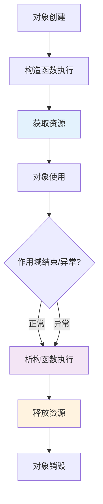
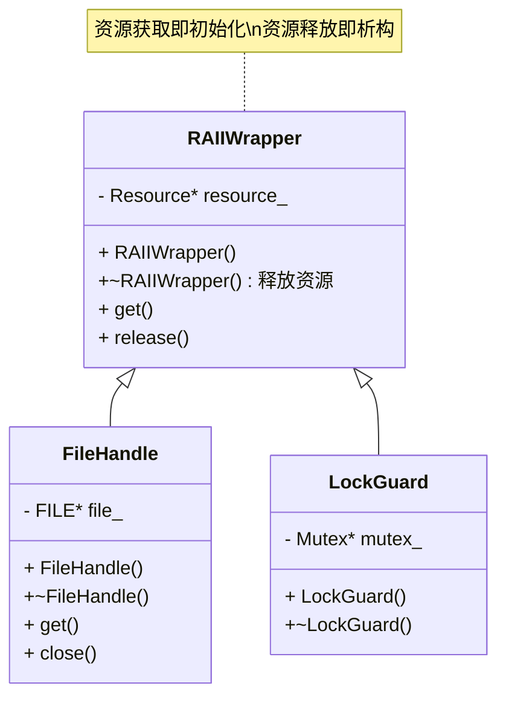
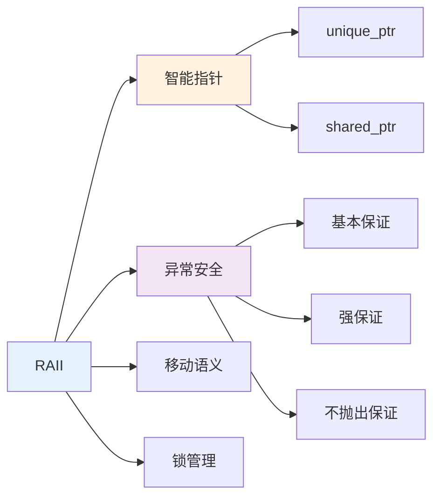

## 前言

RAII（Resource Acquisition Is Initialization）是 C++ 最核心的设计理念之一，也是现代 C++ 编程的基础。理解 RAII 不仅有助于写出更安全的代码，更是掌握 C++ 资源管理、异常安全、智能指针等高级特性的前提。本文将从原理、实现、应用等多个维度深入解析 RAII，帮助读者全面理解这一重要概念。


## 1. RAII 的核心思想与历史背景

RAII 由 Bjarne Stroustrup 在 1980 年代提出，是 C++ 异常安全机制的基础。其核心思想是：

- **资源获取即初始化**：在构造函数中获取资源
- **资源释放即析构**：在析构函数中释放资源
- **异常安全**：即使发生异常，析构函数也会被调用，确保资源释放

**RAII 的生命周期模型**：



### 1.1 为什么叫 RAII

"Resource Acquisition Is Initialization" 这个名字容易引起误解。实际上，RAII 强调的是**资源的所有权与对象的生命周期绑定**。当对象被构造时获取资源，当对象被销毁时释放资源。

### 1.2 RAII 的哲学

RAII 体现了 C++ 的设计哲学：**零开销抽象**。资源管理的逻辑被封装在类中，使用时的开销几乎为零，但安全性大幅提升。

## 2. 为什么需要 RAII：传统资源管理的问题

### 2.1 C 风格资源管理的陷阱

传统 C 风格的资源管理存在多个问题：

```cpp
void bad_example() {
    FILE* f = fopen("file.txt", "r");
    if (!f) return;  // 早期返回，文件未关闭
    
    char* buffer = malloc(1024);
    if (!buffer) {
        fclose(f);  // 需要手动释放
        return;
    }
    
    process_file(f, buffer);  // 如果这里抛出异常，两个资源都泄漏
    
    free(buffer);
    fclose(f);
}
```

**问题总结**：
1. **多个返回点**：每个返回点都需要手动释放资源
2. **异常不安全**：异常发生时资源无法释放
3. **容易遗漏**：复杂的控制流中容易忘记释放
4. **维护困难**：添加新资源需要修改所有返回点

### 2.2 异常安全的三级保证

C++ 异常安全有三个级别：

- **基本保证（Basic Guarantee）**：异常发生后，程序处于有效但不确定的状态
- **强保证（Strong Guarantee）**：操作要么完全成功，要么完全失败（事务语义）
- **不抛出保证（No-throw Guarantee）**：操作保证不会抛出异常

RAII 是实现这些保证的关键机制。

## 3. RAII 的实现模式

### 3.1 RAII 类的设计模式

RAII 类的设计遵循特定的模式，让我们通过类图来理解：



### 3.2 基本 RAII 类实现

一个典型的 RAII 类实现：

```cpp
class FileHandle {
private:
    FILE* file_;
    
public:
    // 资源获取即初始化
    explicit FileHandle(const char* filename, const char* mode) 
        : file_(fopen(filename, mode)) {
        if (!file_) {
            throw std::runtime_error("Failed to open file");
        }
    }
    
    // 禁止拷贝（Rule of Three/Five）
    FileHandle(const FileHandle&) = delete;
    FileHandle& operator=(const FileHandle&) = delete;
    
    // 允许移动
    FileHandle(FileHandle&& other) noexcept 
        : file_(other.file_) {
        other.file_ = nullptr;
    }
    
    FileHandle& operator=(FileHandle&& other) noexcept {
        if (this != &other) {
            close();
            file_ = other.file_;
            other.file_ = nullptr;
        }
        return *this;
    }
    
    // 资源释放即析构
    ~FileHandle() {
        close();
    }
    
    // 资源访问接口
    FILE* get() const { return file_; }
    
    void close() {
        if (file_) {
            fclose(file_);
            file_ = nullptr;
        }
    }
};
```

**关键点**：
- 构造函数获取资源，失败时抛出异常
- 析构函数释放资源，确保总是被调用
- 禁止拷贝，避免重复释放
- 允许移动，支持高效转移所有权

### 3.2 使用示例

```cpp
void safe_example() {
    FileHandle f("file.txt", "r");
    // 即使这里抛出异常，f 的析构函数也会自动关闭文件
    process_file(f.get());
    // 函数返回时，f 自动析构，文件自动关闭
}
```

## 4. RAII 的常见应用场景

### 4.1 内存管理

标准库提供了智能指针：

```cpp
// unique_ptr：独占所有权
std::unique_ptr<int> p1 = std::make_unique<int>(42);
std::unique_ptr<int> p2 = std::move(p1);  // 移动，不拷贝

// shared_ptr：共享所有权
std::shared_ptr<int> p3 = std::make_shared<int>(42);
std::shared_ptr<int> p4 = p3;  // 引用计数增加
```

### 4.2 文件操作

标准库的流类都是 RAII：

```cpp
{
    std::ifstream file("data.txt");
    std::string line;
    while (std::getline(file, line)) {
        process(line);
    }
    // file 自动关闭
}
```

### 4.3 锁管理

```cpp
{
    std::lock_guard<std::mutex> lock(mutex_);
    // 临界区代码
    // lock 析构时自动解锁
}
```

### 4.4 自定义资源

数据库连接、网络套接字、GPU 资源等都可以用 RAII 管理：

```cpp
class DatabaseConnection {
private:
    sqlite3* db_;
    
public:
    DatabaseConnection(const char* db_path) {
        if (sqlite3_open(db_path, &db_) != SQLITE_OK) {
            throw std::runtime_error("Failed to open database");
        }
    }
    
    ~DatabaseConnection() {
        if (db_) {
            sqlite3_close(db_);
        }
    }
    
    // 禁止拷贝，允许移动
    DatabaseConnection(const DatabaseConnection&) = delete;
    DatabaseConnection& operator=(const DatabaseConnection&) = delete;
    DatabaseConnection(DatabaseConnection&&) = default;
    DatabaseConnection& operator=(DatabaseConnection&&) = default;
    
    sqlite3* get() const { return db_; }
};
```

## 5. RAII 与异常安全

### 5.1 异常安全的实现

RAII 是实现异常安全的关键：

```cpp
class Transaction {
private:
    std::vector<Operation> operations_;
    
public:
    void add_operation(const Operation& op) {
        operations_.push_back(op);
    }
    
    void commit() {
        // 强保证：要么全部成功，要么全部失败
        auto backup = state_;  // 先备份
        
        try {
            for (auto& op : operations_) {
                op.execute();  // 可能抛出异常
            }
            state_ = backup;  // 成功则更新
        } catch (...) {
            // 失败则回滚（backup 已自动保持原状）
            rollback();
            throw;
        }
    }
};
```

### 5.2 异常安全与性能

RAII 的零开销特性：

- **无运行时开销**：资源管理逻辑在编译期确定
- **内联优化**：简单的 RAII 类可以被完全内联
- **异常路径优化**：现代编译器对异常路径有专门优化

## 6. RAII 的最佳实践

### 6.1 Rule of Three/Five

如果一个类需要自定义析构函数，通常也需要自定义拷贝/移动语义：

```cpp
class Resource {
public:
    Resource() { acquire(); }
    
    // 需要自定义析构函数
    ~Resource() { release(); }
    
    // 因此需要禁止或自定义拷贝
    Resource(const Resource&) = delete;  // 或实现深拷贝
    Resource& operator=(const Resource&) = delete;
    
    // 通常允许移动
    Resource(Resource&&) = default;
    Resource& operator=(Resource&&) = default;
};
```

### 6.2 析构函数不抛出异常

析构函数应该标记为 `noexcept`，避免在异常处理过程中抛出新异常：

```cpp
~Resource() noexcept {
    try {
        release();
    } catch (...) {
        // 记录日志，但不抛出
        std::cerr << "Error releasing resource\n";
    }
}
```

### 6.3 使用智能指针

优先使用标准库的智能指针，而非手动实现：

```cpp
// 推荐
auto ptr = std::make_unique<MyClass>();

// 不推荐
MyClass* ptr = new MyClass();
// 需要手动 delete
```

### 6.4 移动语义优化

对于昂贵的资源，使用移动语义避免拷贝：

```cpp
class LargeBuffer {
private:
    std::unique_ptr<char[]> data_;
    size_t size_;
    
public:
    // 移动构造：转移所有权，不拷贝数据
    LargeBuffer(LargeBuffer&& other) noexcept
        : data_(std::move(other.data_))
        , size_(other.size_) {
        other.size_ = 0;
    }
};
```

## 7. RAII 的常见陷阱

### 7.1 循环依赖

```cpp
struct Node {
    std::shared_ptr<Node> next;
    std::shared_ptr<Node> prev;  // 循环引用，内存泄漏
};

// 解决方案：使用 weak_ptr
struct Node {
    std::shared_ptr<Node> next;
    std::weak_ptr<Node> prev;  // 打破循环
};
```

### 7.2 过早释放

```cpp
void bad_example() {
    std::unique_ptr<Resource> r = acquire();
    Resource* raw = r.get();
    r.reset();  // 过早释放
    raw->use();  // 使用已释放的资源，未定义行为
}
```

### 7.3 所有权混淆

```cpp
void transfer_ownership(std::unique_ptr<int> p) {
    // p 拥有资源
}

void bad_call() {
    auto p = std::make_unique<int>(42);
    transfer_ownership(p.get());  // 错误：传递原始指针，所有权未转移
    // p 仍然拥有资源，但 transfer_ownership 可能尝试释放
}
```

## 8. RAII 与现代 C++

### 8.1 C++11/14/17 的改进

- **智能指针**：`std::unique_ptr`、`std::shared_ptr`、`std::weak_ptr`
- **移动语义**：高效转移资源所有权
- **`= default` 和 `= delete`**：明确表达意图

### 8.2 与其他语言的对比

- **Java/C#**：使用垃圾回收，但无法控制释放时机
- **Rust**：所有权系统在编译期检查，更安全但更严格
- **Python**：使用引用计数和垃圾回收，但性能开销较大

C++ 的 RAII 在安全性和性能之间取得了最佳平衡。

## 9. 工程实践建议

### 9.1 资源管理检查清单

1. **所有资源都有 RAII 包装**：文件、内存、锁、网络连接等
2. **禁止原始指针拥有资源**：使用智能指针
3. **析构函数标记 `noexcept`**：避免异常传播
4. **移动操作标记 `noexcept`**：优化标准库容器性能
5. **避免循环引用**：使用 `weak_ptr` 打破循环

### 9.2 性能优化

- **零开销抽象**：RAII 类应该尽可能简单，便于编译器优化
- **移动而非拷贝**：对于昂贵资源，优先使用移动语义
- **避免不必要的引用计数**：能用 `unique_ptr` 就不用 `shared_ptr`

### 9.3 调试技巧

- **使用自定义删除器**：在调试版本中添加日志
- **检查资源泄漏**：使用工具如 Valgrind、AddressSanitizer
- **监控资源使用**：在 RAII 类中添加统计信息

## 10. RAII 的设计模式与架构原则

### 10.1 设计模式视角

RAII 体现了多个设计模式：

1. **包装器模式（Wrapper Pattern）**：将资源包装在对象中
2. **单例模式变体**：某些 RAII 类确保资源唯一性
3. **策略模式**：通过模板参数选择不同的资源管理策略

### 10.2 架构原则

RAII 遵循的架构原则：

- **单一职责原则**：RAII 类只负责资源管理
- **开闭原则**：通过模板和继承扩展资源类型
- **依赖倒置原则**：依赖抽象的资源接口

### 10.3 与其他机制的协同



## 11. 实际工程案例

### 11.1 标准库中的 RAII

标准库大量使用 RAII：

- **容器**：`std::vector`、`std::string` 等自动管理内存
- **智能指针**：`std::unique_ptr`、`std::shared_ptr` 管理动态内存
- **锁**：`std::lock_guard`、`std::unique_lock` 管理互斥锁
- **文件流**：`std::ifstream`、`std::ofstream` 管理文件句柄

### 11.2 自定义 RAII 类的完整示例

```cpp
// 线程池资源的 RAII 管理
class ThreadPool {
private:
    std::vector<std::thread> threads_;
    std::atomic<bool> stop_{false};
    
public:
    ThreadPool(size_t num_threads) {
        for (size_t i = 0; i < num_threads; ++i) {
            threads_.emplace_back([this]() {
                while (!stop_) {
                    // 工作逻辑
                }
            });
        }
    }
    
    ~ThreadPool() noexcept {
        stop_ = true;
        for (auto& t : threads_) {
            if (t.joinable()) {
                t.join();  // 等待线程结束
            }
        }
    }
    
    // 禁止拷贝，允许移动
    ThreadPool(const ThreadPool&) = delete;
    ThreadPool& operator=(const ThreadPool&) = delete;
    ThreadPool(ThreadPool&&) = default;
    ThreadPool& operator=(ThreadPool&&) = default;
};
```

## 12. 性能分析与优化

### 12.1 RAII 的性能特征

RAII 的性能优势：

- **零运行时开销**：资源管理逻辑在编译期确定
- **内联优化**：简单的 RAII 类可以被完全内联
- **异常路径优化**：编译器对异常路径有专门优化

### 12.2 性能测试示例

```cpp
// 测试 RAII vs 手动管理的性能
void benchmark_raii() {
    const int iterations = 1000000;
    
    // RAII 方式
    auto start = std::chrono::high_resolution_clock::now();
    for (int i = 0; i < iterations; ++i) {
        std::lock_guard<std::mutex> lock(mutex_);
        // 临界区代码
    }
    auto end = std::chrono::high_resolution_clock::now();
    // RAII 通常与手动管理性能相同，但更安全
}
```

## 13. 小结

RAII 是 C++ 资源管理的核心机制，它通过对象的生命周期自动管理资源，实现了异常安全和零开销抽象。理解 RAII 的原理和实践，是写出安全、高效、易维护的 C++ 代码的基础。

**核心概念总结**：

- **RAII 原理**：资源的所有权与对象的生命周期绑定，构造时获取，析构时释放
- **异常安全**：RAII 是实现异常安全的基础，确保异常时资源也能正确释放
- **设计模式**：RAII 体现了包装器模式、策略模式等设计思想
- **性能优化**：RAII 是零开销抽象，编译期确定，运行时无额外开销

**设计亮点**：

1. **自动化资源管理**：无需手动释放，减少错误
2. **异常安全保证**：异常发生时资源也能正确释放
3. **零开销抽象**：编译期优化，运行时无额外开销
4. **类型安全**：通过类型系统保证资源正确使用
5. **可扩展性**：通过模板和继承支持各种资源类型

**关键要点**：

- RAII 将资源的所有权与对象的生命周期绑定
- 使用智能指针而非原始指针管理内存
- 析构函数和移动操作应该标记 `noexcept`
- 避免循环引用和所有权混淆
- RAII 是现代 C++ 编程的基础，所有资源都应该用 RAII 管理
- 理解 RAII 是掌握 C++ 资源管理、异常安全、智能指针等高级特性的前提

掌握 RAII 的原理和实践，可以写出更安全、更高效、更易维护的 C++ 代码。