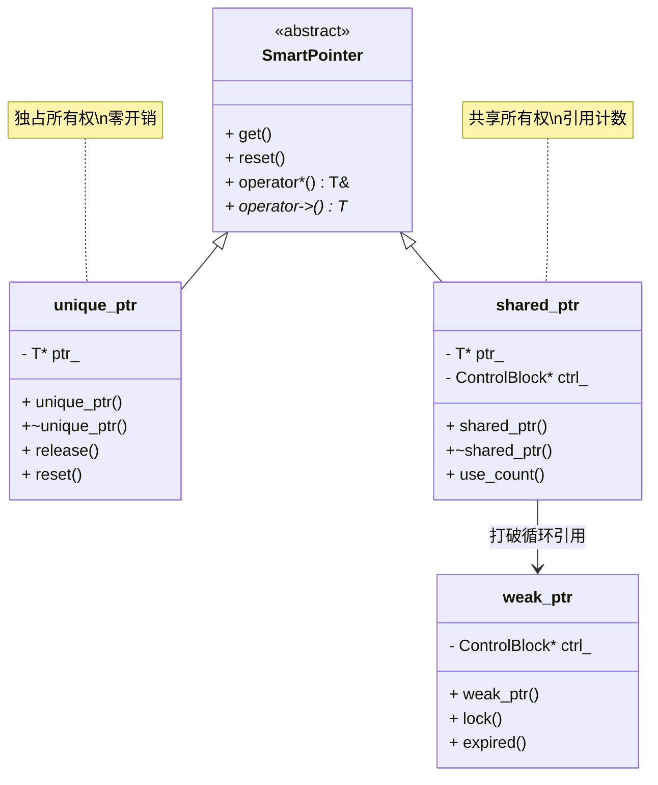

## 前言

智能指针是现代 C++ 内存管理的核心工具，它们通过 RAII 机制自动管理动态分配的内存，解决了原始指针的诸多问题。理解智能指针不仅是掌握现代 C++ 的关键，更是写出安全、高效代码的基础。本文将从原理、实现、应用等多个维度深入解析智能指针，帮助读者全面理解这一重要特性。


## 1. 为什么需要智能指针

### 1.1 原始指针的问题

原始指针管理内存存在多个问题：

```cpp
void bad_example() {
    int* p = new int(42);
    
    // 问题 1：可能忘记 delete
    if (some_condition()) {
        return;  // 内存泄漏
    }
    
    // 问题 2：可能 delete 多次
    process(p);
    delete p;
    // ... 其他地方也 delete p，导致未定义行为
    
    // 问题 3：异常不安全
    risky_operation();  // 如果抛出异常，p 永远不会被删除
    delete p;
}
```

**问题总结**：
1. **内存泄漏**：忘记 `delete` 或提前返回
2. **重复释放**：`delete` 多次导致未定义行为
3. **异常不安全**：异常发生时资源无法释放
4. **所有权不明确**：不知道谁负责释放内存

### 1.2 智能指针的解决方案

智能指针通过 RAII 自动管理内存：

```cpp
void good_example() {
    std::unique_ptr<int> p = std::make_unique<int>(42);
    
    // 即使抛出异常或提前返回，p 的析构函数也会自动删除内存
    process(p.get());
    risky_operation();
    // p 自动析构，内存自动释放
}
```

## 2. unique_ptr：独占所有权

### 2.1 unique_ptr 的特性

`unique_ptr` 是独占所有权的智能指针：

- **独占所有权**：同一时间只有一个 `unique_ptr` 拥有对象
- **不能拷贝**：禁止拷贝构造和拷贝赋值
- **可以移动**：支持移动构造和移动赋值
- **零开销**：与原始指针的性能开销相同

```cpp
std::unique_ptr<int> p1 = std::make_unique<int>(42);
// std::unique_ptr<int> p2 = p1;  // 错误：不能拷贝
std::unique_ptr<int> p2 = std::move(p1);  // OK：移动
// p1 现在是 nullptr
```

### 2.2 unique_ptr 的实现原理

```cpp
template<typename T>
class unique_ptr {
private:
    T* ptr_;
    
public:
    explicit unique_ptr(T* p = nullptr) : ptr_(p) {}
    
    ~unique_ptr() {
        delete ptr_;
    }
    
    // 禁止拷贝
    unique_ptr(const unique_ptr&) = delete;
    unique_ptr& operator=(const unique_ptr&) = delete;
    
    // 允许移动
    unique_ptr(unique_ptr&& other) noexcept 
        : ptr_(other.ptr_) {
        other.ptr_ = nullptr;
    }
    
    unique_ptr& operator=(unique_ptr&& other) noexcept {
        if (this != &other) {
            delete ptr_;
            ptr_ = other.ptr_;
            other.ptr_ = nullptr;
        }
        return *this;
    }
    
    T& operator*() const { return *ptr_; }
    T* operator->() const { return ptr_; }
    T* get() const { return ptr_; }
    explicit operator bool() const { return ptr_ != nullptr; }
};
```

### 2.3 make_unique 的优势

```cpp
// 推荐：使用 make_unique
auto p1 = std::make_unique<int>(42);

// 不推荐：直接构造
std::unique_ptr<int> p2(new int(42));
```

**`make_unique` 的优势**：
1. **异常安全**：如果 `make_unique` 和后续操作之间抛出异常，不会有内存泄漏
2. **代码简洁**：不需要写 `new`
3. **性能优化**：编译器可以优化 `make_unique` 的实现

### 2.4 unique_ptr 与数组

```cpp
// 管理单个对象
std::unique_ptr<int> p1 = std::make_unique<int>(42);

// 管理数组（C++11）
std::unique_ptr<int[]> p2(new int[10]);

// 管理数组（C++14，推荐）
auto p3 = std::make_unique<int[]>(10);
```

### 2.5 自定义删除器

```cpp
// 使用自定义删除器
auto file_deleter = [](FILE* f) { fclose(f); };
std::unique_ptr<FILE, decltype(file_deleter)> 
    file(fopen("data.txt", "r"), file_deleter);

// 或使用函数对象
struct FileDeleter {
    void operator()(FILE* f) const {
        fclose(f);
    }
};
std::unique_ptr<FILE, FileDeleter> file(fopen("data.txt", "r"));
```

## 3. shared_ptr：共享所有权

### 3.1 shared_ptr 的特性

`shared_ptr` 使用引用计数实现共享所有权：

- **共享所有权**：多个 `shared_ptr` 可以共享同一对象
- **引用计数**：自动跟踪有多少个 `shared_ptr` 指向对象
- **自动释放**：当最后一个 `shared_ptr` 销毁时，对象被释放
- **线程安全**：引用计数的增减是原子操作（C++11）

```cpp
std::shared_ptr<int> p1 = std::make_shared<int>(42);
std::shared_ptr<int> p2 = p1;  // 引用计数变为 2
std::shared_ptr<int> p3 = p1;  // 引用计数变为 3

p1.reset();  // 引用计数变为 2
p2.reset();  // 引用计数变为 1
// p3 析构时，引用计数变为 0，对象被释放
```

### 3.2 shared_ptr 的实现原理

```cpp
template<typename T>
class shared_ptr {
private:
    T* ptr_;
    std::atomic<int>* ref_count_;
    
public:
    shared_ptr(T* p = nullptr) 
        : ptr_(p)
        , ref_count_(p ? new std::atomic<int>(1) : nullptr) {}
    
    shared_ptr(const shared_ptr& other)
        : ptr_(other.ptr_)
        , ref_count_(other.ref_count_) {
        if (ref_count_) {
            ++(*ref_count_);
        }
    }
    
    ~shared_ptr() {
        if (ref_count_ && --(*ref_count_) == 0) {
            delete ptr_;
            delete ref_count_;
        }
    }
    
    // ... 其他成员函数
};
```

### 3.3 make_shared 的优势

```cpp
// 推荐：使用 make_shared
auto p1 = std::make_shared<int>(42);

// 不推荐：直接构造
std::shared_ptr<int> p2(new int(42));
```

**`make_shared` 的优势**：
1. **性能优化**：`make_shared` 可以一次性分配对象和控制块的内存
2. **异常安全**：与 `make_unique` 相同
3. **代码简洁**：不需要写 `new`

### 3.4 shared_ptr 的性能开销

`shared_ptr` 的开销：

- **内存开销**：需要额外的控制块存储引用计数
- **时间开销**：引用计数的增减是原子操作，有性能开销
- **线程安全**：引用计数操作是线程安全的，但对象访问不是

```cpp
// 性能对比
std::unique_ptr<int> p1;  // 开销：一个指针（8 字节）
std::shared_ptr<int> p2;  // 开销：两个指针 + 控制块（约 32 字节）
```

## 4. weak_ptr：打破循环引用

### 4.1 循环引用问题

```cpp
struct Node {
    std::shared_ptr<Node> next;
    std::shared_ptr<Node> prev;  // 循环引用！
};

auto n1 = std::make_shared<Node>();
auto n2 = std::make_shared<Node>();
n1->next = n2;
n2->prev = n1;  // 循环引用，内存泄漏
// n1 和 n2 的引用计数都是 2，永远不会变为 0
```

### 4.2 weak_ptr 的解决方案

`weak_ptr` 不增加引用计数，用于打破循环引用：

```cpp
struct Node {
    std::shared_ptr<Node> next;
    std::weak_ptr<Node> prev;  // 使用 weak_ptr
};

auto n1 = std::make_shared<Node>();
auto n2 = std::make_shared<Node>();
n1->next = n2;
n2->prev = n1;  // weak_ptr 不增加引用计数
// n1 和 n2 的引用计数都是 1，可以正常释放
```

### 4.3 weak_ptr 的使用

```cpp
std::shared_ptr<int> sp = std::make_shared<int>(42);
std::weak_ptr<int> wp = sp;  // 不增加引用计数

// 检查对象是否还存在
if (auto locked = wp.lock()) {
    // 对象还存在，使用 locked（shared_ptr）
    std::cout << *locked << "\n";
} else {
    // 对象已被释放
    std::cout << "Object expired\n";
}

// 或使用 expired()
if (!wp.expired()) {
    auto locked = wp.lock();
    // 使用 locked
}
```

### 4.4 weak_ptr 的应用场景

1. **打破循环引用**：如双向链表、观察者模式
2. **缓存系统**：缓存可能被释放的对象
3. **观察者模式**：观察者不拥有被观察对象的所有权

## 5. 智能指针的选择指南

### 5.1 选择 unique_ptr 的场景

- **单一所有权**：只有一个所有者
- **性能关键**：需要零开销
- **移动语义**：可以移动所有权
- **默认选择**：优先使用 `unique_ptr`

```cpp
// 示例：工厂函数返回
std::unique_ptr<Resource> create_resource() {
    return std::make_unique<Resource>();
}
```

### 5.2 选择 shared_ptr 的场景

- **共享所有权**：多个对象需要共享同一资源
- **生命周期不确定**：不知道谁最后使用资源
- **可以接受性能开销**：引用计数有开销

```cpp
// 示例：多个对象共享配置
class Config {
    std::shared_ptr<Settings> settings_;
public:
    Config(std::shared_ptr<Settings> s) : settings_(s) {}
};
```

### 5.3 选择 weak_ptr 的场景

- **打破循环引用**：与 `shared_ptr` 配合使用
- **观察者模式**：不拥有被观察对象的所有权
- **缓存系统**：缓存可能被释放的对象

### 5.4 避免使用原始指针

原始指针应该**仅用于**：
- **不拥有所有权**：只是观察或访问对象
- **与 C 接口交互**：需要传递原始指针
- **性能极端关键**：经过 profiling 确认需要原始指针

```cpp
// 可以：原始指针不拥有所有权
void process(const MyClass* obj) {
    if (obj) {
        obj->do_something();
    }
}

// 不推荐：原始指针拥有所有权
MyClass* create() {
    return new MyClass();  // 应该返回 unique_ptr
}
```

## 6. 智能指针的性能考虑

### 6.1 性能对比

| 特性 | unique_ptr | shared_ptr | 原始指针 |
|------|-----------|-----------|---------|
| 内存开销 | 1 个指针 | 2 个指针 + 控制块 | 1 个指针 |
| 时间开销 | 零开销 | 原子操作开销 | 零开销 |
| 线程安全 | 对象访问不安全 | 引用计数安全 | 不安全 |
| 异常安全 | 是 | 是 | 否 |

### 6.2 性能优化建议

1. **优先使用 unique_ptr**：零开销，性能最优
2. **避免不必要的 shared_ptr 拷贝**：减少原子操作
3. **使用 make_shared**：减少内存分配次数
4. **避免循环引用**：使用 `weak_ptr` 打破循环

### 6.3 性能测试示例

```cpp
// 测试 unique_ptr vs shared_ptr 的性能
void benchmark() {
    const int iterations = 1000000;
    
    // unique_ptr
    auto start = std::chrono::high_resolution_clock::now();
    for (int i = 0; i < iterations; ++i) {
        auto p = std::make_unique<int>(42);
    }
    auto end = std::chrono::high_resolution_clock::now();
    // unique_ptr 通常更快
    
    // shared_ptr
    start = std::chrono::high_resolution_clock::now();
    for (int i = 0; i < iterations; ++i) {
        auto p = std::make_shared<int>(42);
    }
    end = std::chrono::high_resolution_clock::now();
    // shared_ptr 有引用计数开销
}
```

## 7. 智能指针的常见陷阱

### 7.1 循环引用

```cpp
// 错误：循环引用
struct Parent {
    std::shared_ptr<Child> child;
};

struct Child {
    std::shared_ptr<Parent> parent;  // 循环引用
};

// 解决：使用 weak_ptr
struct Child {
    std::weak_ptr<Parent> parent;  // 打破循环
};
```

### 7.2 从原始指针创建多个 shared_ptr

```cpp
// 错误：从原始指针创建多个 shared_ptr
int* raw = new int(42);
std::shared_ptr<int> p1(raw);
std::shared_ptr<int> p2(raw);  // 错误：两个 shared_ptr 独立管理，会 double delete

// 正确：使用 make_shared 或从已有 shared_ptr 拷贝
auto p1 = std::make_shared<int>(42);
auto p2 = p1;  // OK
```

### 7.3 返回局部对象的原始指针

```cpp
// 错误：返回局部对象的原始指针
int* bad_function() {
    int x = 42;
    return &x;  // 返回悬空指针
}

// 正确：返回智能指针
std::unique_ptr<int> good_function() {
    return std::make_unique<int>(42);
}
```

### 7.4 在容器中使用智能指针

```cpp
// 正确：容器中使用智能指针
std::vector<std::unique_ptr<MyClass>> vec;
vec.push_back(std::make_unique<MyClass>());

// 注意：unique_ptr 不能直接拷贝到容器
std::vector<std::unique_ptr<MyClass>> vec2;
auto p = std::make_unique<MyClass>();
// vec2.push_back(p);  // 错误：不能拷贝
vec2.push_back(std::move(p));  // 正确：移动
```

## 8. 智能指针与多线程

### 8.1 线程安全性

- **引用计数**：`shared_ptr` 的引用计数操作是线程安全的
- **对象访问**：智能指针本身不是线程安全的，需要额外同步

```cpp
// 错误：多线程访问 shared_ptr 管理的对象
std::shared_ptr<int> p = std::make_shared<int>(42);

std::thread t1([&p]() {
    *p += 1;  // 数据竞争
});

std::thread t2([&p]() {
    *p += 1;  // 数据竞争
});

// 正确：使用互斥锁保护
std::mutex mtx;
std::thread t1([&p, &mtx]() {
    std::lock_guard<std::mutex> lock(mtx);
    *p += 1;
});
```

### 8.2 智能指针的线程安全操作

```cpp
// shared_ptr 的引用计数操作是线程安全的
std::shared_ptr<int> p = std::make_shared<int>(42);

std::thread t1([p]() {  // 拷贝 shared_ptr，引用计数原子增加
    // 使用 p
});

std::thread t2([p]() {  // 拷贝 shared_ptr，引用计数原子增加
    // 使用 p
});

// t1 和 t2 结束时，引用计数原子减少
```

## 9. 工程实践建议

### 9.1 智能指针使用检查清单

1. **默认使用 unique_ptr**：除非需要共享所有权
2. **使用 make_unique/make_shared**：异常安全和性能优化
3. **避免原始指针拥有资源**：使用智能指针管理
4. **避免循环引用**：使用 `weak_ptr` 打破循环
5. **明确所有权**：清楚谁拥有资源，谁只是观察

### 9.2 代码审查要点

- **检查是否有原始指针的 new/delete**：应该使用智能指针
- **检查是否有循环引用**：使用 `weak_ptr` 解决
- **检查是否有不必要的 shared_ptr 拷贝**：优化性能
- **检查异常安全**：确保资源总是被释放

### 9.3 性能优化建议

- **优先使用 unique_ptr**：零开销，性能最优
- **避免不必要的 shared_ptr**：引用计数有开销
- **使用 make_shared**：减少内存分配
- **避免在热路径上频繁创建智能指针**：考虑对象池

## 10. 智能指针的设计模式与架构

### 10.1 设计模式视角

智能指针体现了多个设计模式：

1. **RAII 模式**：通过对象生命周期管理资源
2. **所有权模式**：明确资源的所有权关系
3. **引用计数模式**：`shared_ptr` 使用引用计数实现共享所有权

### 10.2 架构原则

- **单一职责**：智能指针只负责内存管理
- **所有权明确**：通过类型系统明确所有权关系
- **异常安全**：智能指针保证异常时资源也能释放

### 10.3 智能指针的类图



## 11. 实际工程案例

### 11.1 标准库中的智能指针

标准库提供了三种智能指针：

- **`std::unique_ptr`**：独占所有权，零开销
- **`std::shared_ptr`**：共享所有权，引用计数
- **`std::weak_ptr`**：不拥有所有权，打破循环引用

### 11.2 自定义资源管理

```cpp
// 使用智能指针管理自定义资源
class CustomDeleter {
public:
    void operator()(CustomResource* ptr) const {
        // 自定义删除逻辑
        custom_cleanup(ptr);
        delete ptr;
    }
};

std::unique_ptr<CustomResource, CustomDeleter> 
    resource(acquire_resource(), CustomDeleter{});
```

## 12. 性能分析与优化

### 12.1 性能对比

智能指针的性能特征：

- **`unique_ptr`**：与原始指针性能相同，零开销
- **`shared_ptr`**：有引用计数开销，但提供共享所有权
- **`weak_ptr`**：开销很小，主要用于打破循环引用

### 12.2 性能优化建议

1. **优先使用 `unique_ptr`**：零开销，性能最优
2. **避免不必要的 `shared_ptr` 拷贝**：减少原子操作
3. **使用 `make_shared`**：减少内存分配次数
4. **避免循环引用**：使用 `weak_ptr` 打破循环

## 13. 小结

智能指针是现代 C++ 内存管理的标准方式，通过 RAII 自动管理动态分配的内存，实现了异常安全和自动化资源管理。

**核心概念总结**：

- **智能指针原理**：通过 RAII 机制自动管理内存，构造时获取，析构时释放
- **所有权模型**：`unique_ptr` 独占所有权，`shared_ptr` 共享所有权
- **引用计数**：`shared_ptr` 使用原子引用计数实现线程安全的共享所有权
- **设计模式**：体现了 RAII、所有权、引用计数等设计思想

**设计亮点**：

1. **自动化内存管理**：无需手动 `delete`，减少内存泄漏
2. **异常安全**：异常发生时内存也能正确释放
3. **零开销抽象**：`unique_ptr` 与原始指针性能相同
4. **类型安全**：通过类型系统保证内存正确使用
5. **所有权明确**：通过类型系统明确所有权关系

**关键要点**：
- `unique_ptr`：独占所有权，零开销，优先使用
- `shared_ptr`：共享所有权，引用计数，有性能开销
- `weak_ptr`：不拥有所有权，用于打破循环引用
- 使用 `make_unique` 和 `make_shared`：异常安全和性能优化
- 避免循环引用：使用 `weak_ptr` 解决
- 智能指针是现代 C++ 编程的基础，应该优先使用智能指针而非原始指针

理解和正确使用智能指针，是写出安全、高效、易维护的 C++ 代码的关键。
