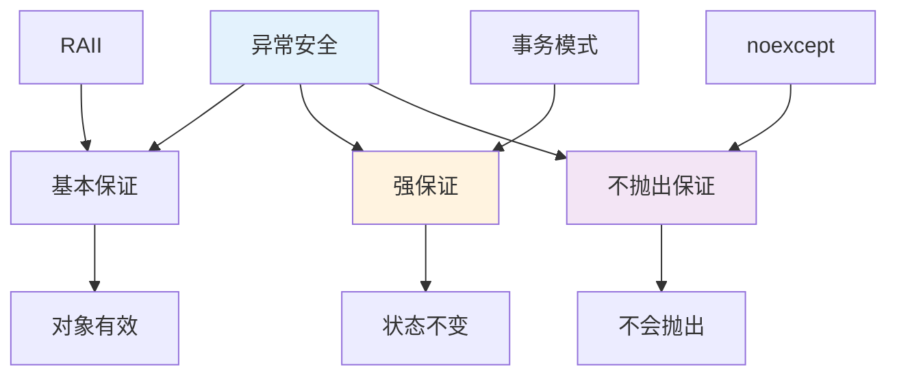

## 前言

异常安全是现代 C++ 编程的重要原则，它确保程序在异常发生时仍能保持一致性。理解异常安全不仅是写出健壮代码的关键，更是掌握 RAII、智能指针、移动语义等高级特性的基础。本文将从原理、实现、应用等多个维度深入解析异常安全，帮助读者全面理解这一重要概念。


## 1. 异常安全保证的三个级别

### 1.1 基本保证（Basic Guarantee）

**定义**：操作失败后，对象处于有效但不确定的状态。

```cpp
class Vector {
private:
    int* data_;
    size_t size_;
    size_t capacity_;
    
public:
    void push_back(const int& value) {
        if (size_ >= capacity_) {
            resize();  // 可能抛出异常
        }
        data_[size_++] = value;  // 如果这里抛出异常，对象可能处于不一致状态
    }
};
```

**特点**：
- 对象仍然有效，可以安全析构
- 对象的状态不确定，可能部分修改
- 程序可以继续运行，但需要恢复状态

### 1.2 强保证（Strong Guarantee）

**定义**：操作要么完全成功，要么完全失败（事务语义）。

```cpp
class Vector {
public:
    void push_back(const int& value) {
        // 强保证实现：先准备，再提交
        auto new_data = new int[capacity_ * 2];
        std::copy(data_, data_ + size_, new_data);
        new_data[size_] = value;  // 如果这里抛出异常，原对象不变
        
        // 提交：原子性操作
        delete[] data_;
        data_ = new_data;
        size_++;
        capacity_ *= 2;
    }
};
```

**特点**：
- 操作具有原子性：要么全部成功，要么全部失败
- 失败时对象状态完全不变
- 实现成本较高，需要额外的资源或备份

### 1.3 不抛出保证（No-throw Guarantee）

**定义**：操作保证不会抛出异常。

```cpp
class Vector {
public:
    // 不抛出保证
    ~Vector() noexcept {
        delete[] data_;  // delete 不会抛出异常
    }
    
    // 移动操作应该不抛出
    Vector(Vector&& other) noexcept
        : data_(other.data_)
        , size_(other.size_)
        , capacity_(other.capacity_) {
        other.data_ = nullptr;
        other.size_ = 0;
        other.capacity_ = 0;
    }
};
```

**特点**：
- 操作保证不会抛出异常
- 适用于析构函数、移动操作、swap 等
- 标记为 `noexcept` 让编译器优化

## 2. RAII 与异常安全

### 2.1 RAII 是实现异常安全的基础

RAII 通过对象的生命周期自动管理资源，是实现异常安全的关键：

```cpp
// 不安全：手动管理资源
void unsafe_function() {
    Resource* r = acquire_resource();
    process(r);  // 如果这里抛出异常，资源泄漏
    release_resource(r);
}

// 安全：RAII 自动管理
void safe_function() {
    std::unique_ptr<Resource> r = acquire_resource();
    process(r.get());  // 即使抛出异常，r 的析构函数也会释放资源
}
```

### 2.2 异常安全的资源管理

```cpp
class DatabaseTransaction {
private:
    DatabaseConnection& db_;
    bool committed_ = false;
    
public:
    DatabaseTransaction(DatabaseConnection& db) : db_(db) {
        db_.begin_transaction();
    }
    
    void commit() {
        db_.commit();
        committed_ = true;
    }
    
    ~DatabaseTransaction() {
        if (!committed_) {
            db_.rollback();  // 异常时自动回滚
        }
    }
};

// 使用
void process_transaction() {
    DatabaseTransaction txn(db);
    // 操作数据库
    txn.commit();  // 如果这里抛出异常，自动回滚
}
```

## 3. 异常规范（Exception Specification）

### 3.1 C++98 风格的异常规范（已废弃）

```cpp
// C++98 风格（已废弃）
void func() throw(int);      // 只能抛出 int
void func() throw();         // 不抛出异常
void func() throw(...);      // 可以抛出任何异常

// 问题：运行时检查，性能开销大，容易出错
```

**问题**：
- 运行时检查，性能开销大
- 容易出错，违反规范时调用 `std::unexpected()`
- C++11 已废弃，C++17 完全移除

### 3.2 C++11 noexcept

```cpp
// C++11 noexcept
void func() noexcept;           // 不抛出异常
void func() noexcept(true);     // 等价于 noexcept
void func() noexcept(false);    // 可能抛出异常

// 条件 noexcept
void func() noexcept(noexcept(other_func()));  // 根据 other_func 决定
```

**特点**：
- 编译期检查，无运行时开销
- 违反时调用 `std::terminate()`（程序终止）
- 让编译器优化：noexcept 函数可以更激进地优化

### 3.3 noexcept 的优化效果

```cpp
// 标准库容器的优化
template<typename T>
void vector_reallocate() {
    if (std::is_nothrow_move_constructible_v<T>) {
        // 使用移动构造（更快）
        new_storage[i] = std::move(old_storage[i]);
    } else {
        // 回退到拷贝构造（保证强异常安全）
        new_storage[i] = old_storage[i];
    }
}
```

**关键点**：如果移动操作可能抛出异常，标准库会回退到拷贝操作，保证强异常安全。

## 4. 移动操作与 noexcept

### 4.1 为什么移动操作需要 noexcept

标准库容器在重新分配内存时，如果移动操作可能抛出异常，会回退到拷贝操作：

```cpp
// 移动操作不标记 noexcept
class MyClass {
public:
    MyClass(MyClass&& other) {  // 没有 noexcept
        // 移动实现
    }
};

std::vector<MyClass> vec;
// 重新分配时，使用拷贝构造而非移动构造（性能损失）
```

**解决方案**：移动操作标记 `noexcept`：

```cpp
class MyClass {
public:
    MyClass(MyClass&& other) noexcept {  // 标记 noexcept
        // 移动实现
    }
    
    MyClass& operator=(MyClass&& other) noexcept {
        // 移动赋值实现
        return *this;
    }
};

std::vector<MyClass> vec;
// 重新分配时，使用移动构造（性能最优）
```

### 4.2 移动操作的异常安全

移动操作应该实现基本异常安全：

```cpp
class MyString {
private:
    char* data_;
    size_t size_;
    
public:
    MyString(MyString&& other) noexcept
        : data_(other.data_)
        , size_(other.size_) {
        // 移动操作不应该失败（基本操作）
        other.data_ = nullptr;
        other.size_ = 0;
    }
    
    MyString& operator=(MyString&& other) noexcept {
        if (this != &other) {
            delete[] data_;  // 不会抛出异常
            data_ = other.data_;
            size_ = other.size_;
            other.data_ = nullptr;
            other.size_ = 0;
        }
        return *this;
    }
};
```

## 5. 异常安全的实现技巧

### 5.1 先修改副本，再交换（Copy-and-Swap）

```cpp
class MyClass {
private:
    std::vector<int> data_;
    
public:
    void modify(const std::vector<int>& new_data) {
        // 强保证：先修改副本，再交换
        auto backup = data_;  // 备份
        try {
            data_ = new_data;  // 可能抛出异常
            // 成功：data_ 已更新
        } catch (...) {
            // 失败：data_ 保持原状（已自动保持）
            throw;
        }
    }
    
    // 或使用 swap（更高效）
    void modify_optimized(const std::vector<int>& new_data) {
        std::vector<int> temp = new_data;  // 可能抛出异常
        data_.swap(temp);  // swap 不会抛出异常
    }
};
```

### 5.2 使用智能指针

```cpp
class ResourceManager {
private:
    std::unique_ptr<Resource> resource_;
    
public:
    void replace_resource(std::unique_ptr<Resource> new_resource) {
        // 强保证：先准备新资源，再替换
        auto old_resource = std::move(resource_);
        resource_ = std::move(new_resource);  // 如果这里抛出异常，old_resource 仍然有效
        // 成功：old_resource 自动析构
    }
};
```

### 5.3 事务性操作

```cpp
class BankAccount {
private:
    int balance_ = 1000;
    
public:
    void transfer(BankAccount& to, int amount) {
        // 强保证：要么全部成功，要么全部失败
        if (balance_ < amount) {
            throw std::runtime_error("Insufficient funds");
        }
        
        balance_ -= amount;  // 如果这里抛出异常，状态不一致
        try {
            to.balance_ += amount;  // 如果这里抛出异常，需要回滚
        } catch (...) {
            balance_ += amount;  // 回滚
            throw;
        }
    }
};
```

## 6. 析构函数与异常

### 6.1 析构函数不应该抛出异常

析构函数应该标记 `noexcept`，避免在异常处理过程中抛出新异常：

```cpp
class Resource {
public:
    ~Resource() noexcept {
        try {
            cleanup();  // 可能抛出异常
        } catch (...) {
            // 记录日志，但不抛出
            std::cerr << "Error cleaning up resource\n";
            // 如果这里抛出异常，程序可能终止
        }
    }
};
```

**原因**：
- 如果析构函数在异常处理过程中抛出异常，程序会调用 `std::terminate()`
- 析构函数应该总是成功完成清理

### 6.2 异常处理中的析构

```cpp
void function() {
    Resource r;
    try {
        risky_operation();  // 可能抛出异常
    } catch (...) {
        // r 的析构函数会被调用
        // 如果析构函数抛出异常，程序终止
        throw;
    }
    // r 正常析构
}
```

## 7. 异常安全与性能

### 7.1 异常安全的性能成本

实现异常安全可能需要额外的资源：

```cpp
// 强保证：需要备份
void strong_guarantee() {
    auto backup = data_;  // 额外的内存和时间
    try {
        modify();
    } catch (...) {
        // 回滚
    }
}

// 基本保证：不需要备份
void basic_guarantee() {
    modify();  // 可能部分修改
}
```

### 7.2 性能优化建议

1. **优先使用移动语义**：移动操作通常比拷贝快
2. **使用 swap**：swap 操作通常不抛出异常，且高效
3. **避免不必要的备份**：只在需要强保证时备份
4. **标记 noexcept**：让编译器优化

## 8. 异常安全的实际应用

### 8.1 标准库的异常安全

标准库容器提供不同级别的异常安全：

```cpp
std::vector<int> v = {1, 2, 3};

// push_back：强保证（如果元素拷贝不抛出异常）
v.push_back(4);  // 要么成功添加，要么 v 不变

// insert：基本保证
v.insert(v.begin(), 0);  // 可能部分插入

// clear：不抛出保证
v.clear();  // 不会抛出异常
```

### 8.2 自定义类的异常安全

```cpp
class SafeVector {
private:
    std::unique_ptr<int[]> data_;
    size_t size_;
    size_t capacity_;
    
public:
    // push_back：强保证
    void push_back(const int& value) {
        if (size_ >= capacity_) {
            // 先分配新内存
            auto new_data = std::make_unique<int[]>(capacity_ * 2);
            std::copy(data_.get(), data_.get() + size_, new_data.get());
            
            // 再更新（原子性操作）
            data_ = std::move(new_data);
            capacity_ *= 2;
        }
        data_[size_++] = value;
    }
};
```

## 9. 异常安全的测试

### 9.1 测试异常安全

```cpp
// 测试强保证
void test_strong_guarantee() {
    MyClass obj(initial_state);
    auto backup = obj.get_state();
    
    try {
        obj.risky_operation();
    } catch (...) {
        assert(obj.get_state() == backup);  // 状态应该不变
    }
}

// 测试基本保证
void test_basic_guarantee() {
    MyClass obj(initial_state);
    
    try {
        obj.risky_operation();
    } catch (...) {
        assert(obj.is_valid());  // 对象应该仍然有效
    }
}
```

### 9.2 异常注入测试

```cpp
// 使用异常注入测试异常安全
class TestException {};

void test_with_exception_injection() {
    int throw_count = 0;
    
    auto risky_op = [&]() {
        if (++throw_count == 3) {
            throw TestException();
        }
    };
    
    try {
        operation_with_exceptions(risky_op);
    } catch (TestException&) {
        // 验证异常安全
    }
}
```

## 10. 工程实践建议

### 10.1 异常安全检查清单

1. **所有资源都用 RAII 管理**：确保异常时资源释放
2. **析构函数标记 `noexcept`**：避免异常传播
3. **移动操作标记 `noexcept`**：优化标准库容器性能
4. **明确异常安全级别**：文档说明每个操作的异常安全保证
5. **测试异常安全**：编写异常注入测试

### 10.2 性能优化建议

- **优先使用移动语义**：移动通常比拷贝快
- **使用 swap 实现强保证**：swap 通常不抛出且高效
- **避免不必要的备份**：只在需要强保证时备份
- **标记 noexcept**：让编译器优化

### 10.3 代码审查要点

- **检查资源管理**：所有资源都用 RAII 管理
- **检查 noexcept**：析构函数和移动操作应该标记 `noexcept`
- **检查异常安全级别**：文档说明每个操作的保证级别
- **检查异常处理**：确保异常被正确处理

## 11. 异常安全的设计模式与架构

### 11.1 设计模式视角

异常安全体现了多个设计模式：

1. **RAII 模式**：通过对象生命周期保证资源释放
2. **事务模式**：强保证实现了事务语义
3. **回滚模式**：失败时回滚到之前的状态

### 11.2 架构原则

- **异常安全保证**：每个操作都应该有明确的异常安全级别
- **资源管理**：所有资源都用 RAII 管理
- **异常规范**：使用 `noexcept` 明确异常规范

### 11.3 异常安全的层次结构



## 12. 实际工程案例

### 12.1 标准库的异常安全

标准库容器提供不同级别的异常安全：

- **`push_back`**：强保证（如果元素拷贝不抛出异常）
- **`insert`**：基本保证
- **`clear`**：不抛出保证

### 12.2 自定义类的异常安全实现

```cpp
// 强保证的容器操作
template<typename T>
class SafeVector {
private:
    std::unique_ptr<T[]> data_;
    size_t size_;
    size_t capacity_;
    
public:
    // push_back：强保证
    void push_back(const T& value) {
        if (size_ >= capacity_) {
            // 先分配新内存（可能抛出异常）
            auto new_data = std::make_unique<T[]>(capacity_ * 2);
            std::copy(data_.get(), data_.get() + size_, new_data.get());
            
            // 再更新（原子性操作）
            data_ = std::move(new_data);
            capacity_ *= 2;
        }
        data_[size_++] = value;  // 如果这里抛出异常，对象状态不变
    }
};
```

## 13. 性能分析与优化

### 13.1 异常安全的性能成本

实现异常安全可能需要额外的资源：

- **强保证**：需要备份或额外资源
- **基本保证**：通常不需要额外资源
- **不抛出保证**：可能限制实现方式

### 13.2 性能优化建议

1. **优先使用移动语义**：移动操作通常比拷贝快
2. **使用 swap**：swap 操作通常不抛出异常，且高效
3. **避免不必要的备份**：只在需要强保证时备份
4. **标记 `noexcept`**：让编译器优化

## 14. 小结

异常安全是现代 C++ 编程的重要原则，它确保程序在异常发生时仍能保持一致性。通过 RAII 和智能指针，可以自然地实现异常安全的代码。

**核心概念总结**：

- **异常安全级别**：基本保证、强保证、不抛出保证三个级别
- **RAII 机制**：通过对象生命周期保证资源释放，是实现异常安全的基础
- **异常规范**：使用 `noexcept` 明确异常规范，优化编译器性能
- **设计模式**：体现了 RAII、事务、回滚等设计思想

**设计亮点**：

1. **自动化资源管理**：RAII 确保异常时资源也能释放
2. **状态一致性**：强保证确保操作要么完全成功，要么完全失败
3. **性能优化**：`noexcept` 让编译器进行更激进的优化
4. **类型安全**：通过类型系统保证异常安全的实现
5. **可维护性**：异常安全让代码更健壮、更易维护

**关键要点**：
- 异常安全有三个级别：基本保证、强保证、不抛出保证
- RAII 是实现异常安全的基础机制
- 析构函数应该标记 `noexcept`，避免异常传播
- 移动操作应该标记 `noexcept`，优化标准库容器性能
- 使用智能指针和 RAII 类自动管理资源
- 先修改副本再交换，实现强保证
- 理解异常安全是写出健壮 C++ 代码的关键

掌握异常安全的原则和实践，可以写出更安全、更健壮的 C++ 代码。
