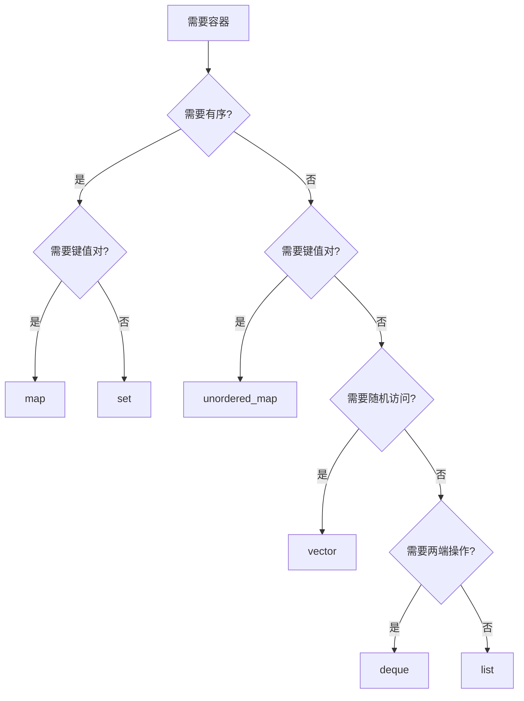

## 前言

STL 容器是 C++ 标准库的核心，提供了丰富的数据结构实现。理解不同容器的特性、性能特征和适用场景，是写出高效 C++ 代码的基础。本文将从容器分类、性能分析、使用场景等多个维度深入解析 STL 容器，帮助读者全面理解这一重要组件。

## 1. STL 容器概览

### 1.1 容器分类

STL 容器分为三大类：

- **序列容器**：`vector`、`deque`、`list`、`forward_list`、`array`
- **关联容器**：`set`、`map`、`multiset`、`multimap`
- **无序容器**：`unordered_set`、`unordered_map`、`unordered_multiset`、`unordered_multimap`

### 1.2 容器选择决策树



## 2. 序列容器

### 2.1 vector：动态数组

```cpp
std::vector<int> vec;
vec.push_back(1);
vec.push_back(2);
vec.push_back(3);

// 随机访问：O(1)
int value = vec[0];

// 插入/删除：O(n)
vec.insert(vec.begin() + 1, 42);
vec.erase(vec.begin() + 1);
```

**特性**：
- 连续内存，缓存友好
- 随机访问 O(1)
- 尾部插入/删除 O(1) 摊销
- 中间插入/删除 O(n)

### 2.2 deque：双端队列

```cpp
std::deque<int> dq;
dq.push_front(1);
dq.push_back(2);

// 两端操作都是 O(1)
int front = dq.front();
int back = dq.back();
```

**特性**：
- 两端插入/删除 O(1)
- 随机访问 O(1)
- 内存不连续，但分段连续

### 2.3 list：双向链表

```cpp
std::list<int> lst;
lst.push_back(1);
lst.push_front(2);

// 插入/删除：O(1)（已知迭代器位置）
auto it = lst.begin();
lst.insert(it, 42);
lst.erase(it);
```

**特性**：
- 任意位置插入/删除 O(1)
- 不支持随机访问
- 内存开销较大（每个节点需要指针）

## 3. 关联容器

### 3.1 map：有序键值对

```cpp
std::map<std::string, int> m;
m["apple"] = 5;
m["banana"] = 3;

// 查找：O(log n)
auto it = m.find("apple");
if (it != m.end()) {
    int count = it->second;
}
```

**特性**：
- 基于红黑树实现
- 键有序
- 查找/插入/删除 O(log n)

### 3.2 set：有序集合

```cpp
std::set<int> s;
s.insert(1);
s.insert(2);
s.insert(3);

// 查找：O(log n)
if (s.find(2) != s.end()) {
    // 存在
}
```

**特性**：
- 基于红黑树实现
- 元素有序
- 查找/插入/删除 O(log n)

## 4. 无序容器

### 4.1 unordered_map：哈希表

```cpp
std::unordered_map<std::string, int> um;
um["apple"] = 5;
um["banana"] = 3;

// 查找：O(1) 平均，O(n) 最坏
auto it = um.find("apple");
```

**特性**：
- 基于哈希表实现
- 键无序
- 查找/插入/删除 O(1) 平均

### 4.2 自定义哈希函数

```cpp
struct MyHash {
    std::size_t operator()(const MyType& key) const {
        return std::hash<int>()(key.value);
    }
};

std::unordered_map<MyType, int, MyHash> um;
```

## 5. 性能对比

### 5.1 时间复杂度

| 操作 | vector | deque | list | map | unordered_map |
|------|--------|-------|------|-----|---------------|
| 随机访问 | O(1) | O(1) | O(n) | O(log n) | O(1) |
| 插入（任意位置） | O(n) | O(n) | O(1) | O(log n) | O(1) |
| 删除（任意位置） | O(n) | O(n) | O(1) | O(log n) | O(1) |
| 查找 | O(n) | O(n) | O(n) | O(log n) | O(1) |

### 5.2 空间复杂度

- **vector**：连续内存，空间利用率高
- **deque**：分段连续，有少量额外开销
- **list**：每个节点需要两个指针，开销大
- **map/set**：每个节点需要颜色标记和指针
- **unordered_map**：需要哈希表数组和链表

## 6. 容器选择指南

### 6.1 需要随机访问

```cpp
// 选择 vector 或 deque
std::vector<int> vec;  // 如果只需要尾部操作
std::deque<int> dq;    // 如果需要两端操作
```

### 6.2 需要频繁插入/删除

```cpp
// 选择 list（如果不需要随机访问）
std::list<int> lst;

// 或使用 unordered_map（如果是键值对）
std::unordered_map<int, Value> um;
```

### 6.3 需要有序查找

```cpp
// 选择 map 或 set
std::map<int, Value> m;
std::set<int> s;
```

### 6.4 需要快速查找

```cpp
// 选择 unordered_map 或 unordered_set
std::unordered_map<int, Value> um;
std::unordered_set<int> us;
```

## 7. 容器使用最佳实践

### 7.1 预分配空间

```cpp
// vector 预分配，避免多次重新分配
std::vector<int> vec;
vec.reserve(1000);  // 预分配空间

for (int i = 0; i < 1000; ++i) {
    vec.push_back(i);  // 不会重新分配
}
```

### 7.2 使用 emplace

```cpp
// 使用 emplace 避免临时对象
std::vector<std::pair<int, std::string>> vec;
vec.emplace_back(1, "hello");  // 直接构造

// vs push_back 需要临时对象
vec.push_back(std::make_pair(1, "hello"));
```

### 7.3 迭代器失效

```cpp
std::vector<int> vec = {1, 2, 3, 4, 5};
auto it = vec.begin() + 2;

vec.push_back(6);  // 可能导致迭代器失效

// 正确：重新获取迭代器
it = vec.begin() + 2;
```

## 8. 小结

STL 容器提供了丰富的数据结构选择，理解它们的特性和性能特征，是写出高效代码的关键。

**核心要点**：
- 根据需求选择合适的容器
- 理解不同操作的复杂度
- 注意迭代器失效问题
- 使用预分配和 emplace 优化性能

掌握 STL 容器，可以写出高效、易维护的 C++ 代码。
