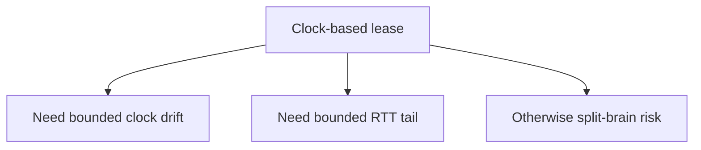
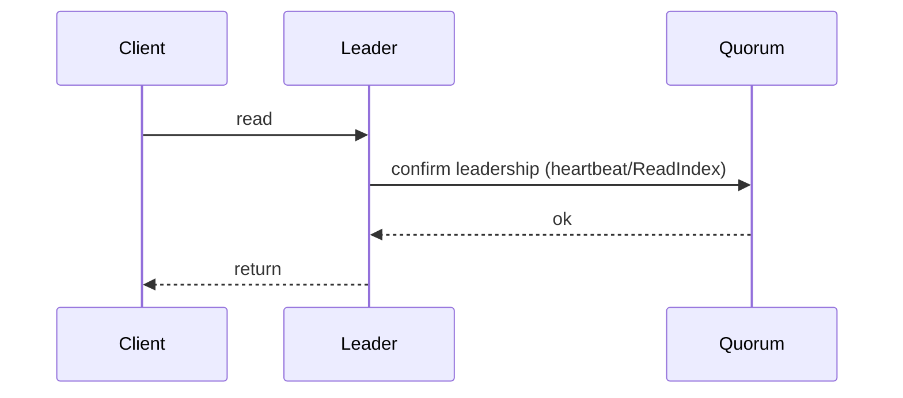

本文是「一致性笔记：Leader 选举：租约（lease）与心跳」的工程化笔记，记录语义/模型定义、可观测信号与排障要点。

## 1. lease 的直觉

用时间窗口减少读路径的共识成本：在 lease 有效期内，leader 可以更快回答读（取决于系统语义）。

## 2. 风险

时钟与网络抖动会影响 lease 的正确性边界；要谨慎定义“读的承诺”。

## 3. 排障顺序

先确认需要的读语义（线性/顺序/最终），再看时钟漂移与 RTT 分布，最后决定是否使用 lease。

## 4. 先把语义讲清楚：lease 到底在“承诺”什么

lease 常被当作“优化”，但它本质上是一个**安全边界**：你必须先说清楚在 lease 有效期内，leader 对外承诺的是什么。

常见三种读语义（从弱到强）：

- **stale read**：允许读旧（只要最终收敛）
- **sequential read**：单客户端看起来有序
- **linearizable read**：像单机一样，符合真实时间先后

lease 最常见用途是：

- 在一段时间内，leader 能在不与多数派交互的情况下回答读（降低读延迟）

但要达到 linearizable read，lease 需要更严格条件。

## 5. lease 的两类实现：基于时钟 vs 基于消息确认

### 5.1 基于时钟的 lease（clock-based）

leader 在拿到多数派确认后，认为自己在未来 `T` 时间内仍然是 leader。

风险来自：

- **时钟漂移**：不同节点的物理时间不一致
- **网络延迟尾部**：多数派确认的 RTT 分布有长尾

### 5.2 基于消息确认的 lease（quorum-confirmed / ReadIndex）

更稳的方式是：

- 每次线性一致读前，让 leader 与多数派确认“我仍是 leader”（例如 ReadIndex/心跳确认）

这会增加一次 RTT，但避免把安全性押在时钟上。

## 6. lease 的工程误区：最容易踩的 3 个坑

1. **把 lease 当成强一致的万能加速器**：实际上你必须明确读语义，不然会“读到旧但你以为是新的”。
2. **忽略时钟漂移监控**：clock-based lease 没有 drift 指标基本等于盲飞。
3. **忽略网络尾延迟**：P99/P999 的 RTT 会直接侵蚀 lease 的安全边界。

## 7. 可观测信号：需要监控什么

- **clock drift**：NTP/PTP 偏差、最大偏差上界
- **RTT 分布**：leader ↔ followers 的 P50/P95/P99
- **leader 变更频率**：频繁选主会让 lease 失去意义
- **读路径模式**：leader read / follower read / ReadIndex 的占比

## 8. 总结

lease 不是“省一次共识”的小技巧，而是“把安全边界建立在时钟与网络可控性之上”的系统设计。先定义语义，再决定是否用它。
