> 论文：ARIES: A Transaction Recovery Method Supporting Fine-Granularity Locking and Partial Rollbacks（Mohan et al., ACM TODS 1992）

ARIES 是 IBM 开发的数据库崩溃恢复算法，是现代数据库恢复机制的基础。本文深入解析 ARIES 的核心思想、三阶段恢复流程和工程实践。

## 1. 崩溃恢复的挑战

### 1.1 恢复需要满足的 ACID 属性

数据库崩溃恢复必须同时满足 ACID 属性的要求：

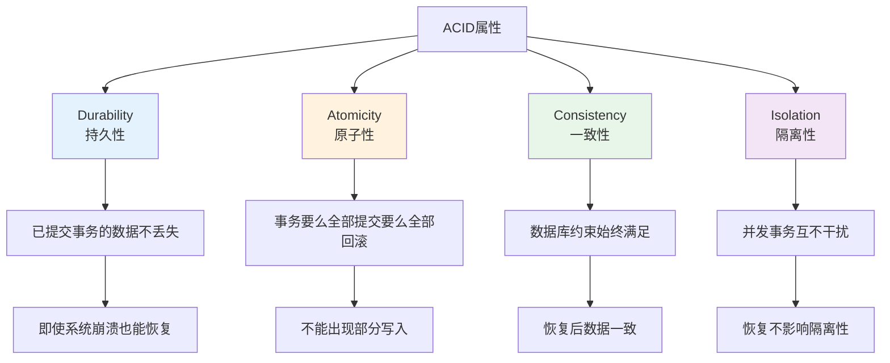

**恢复的核心挑战**：

1. **持久性（Durability）**
   - 已提交事务的数据必须持久化
   - 即使系统崩溃，已提交的数据也不能丢失
   - 需要将数据写入非易失性存储（磁盘）

2. **原子性（Atomicity）**
   - 事务要么全部提交，要么全部回滚
   - 不能出现部分写入的情况
   - 崩溃时未提交的事务必须回滚

3. **性能要求**
   - 恢复时间要尽可能短
   - 日志量要尽可能少
   - 实现复杂度要可控

### 1.2 传统恢复方法的问题

在 ARIES 之前，数据库恢复方法存在以下问题：

**Steal/No-Force 策略的挑战**：

- **Steal**：允许将未提交事务的脏页写回磁盘（提高性能）
- **No-Force**：提交时不必强制写回所有脏页（提高性能）
- **问题**：崩溃后需要区分哪些是已提交的，哪些是未提交的

**传统方法的局限性**：

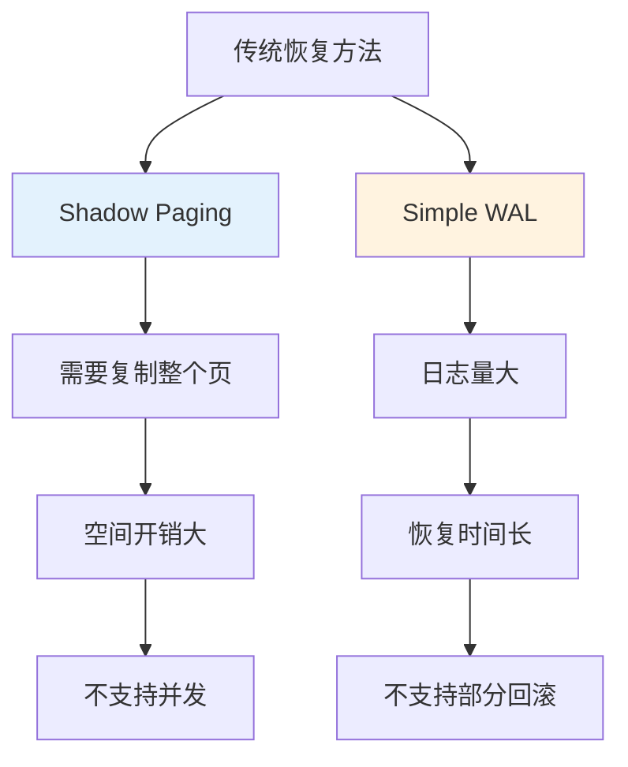

**ARIES 的创新**：

- **页级 LSN**：每个页记录最后应用的日志序号
- **Redo/Undo 分离**：精确控制重做和撤销的范围
- **Fuzzy Checkpoint**：支持增量检查点，减少恢复时间
- **部分回滚**：支持事务的部分回滚，提高灵活性

## 2. ARIES 的核心机制

### 2.1 WAL：Write-Ahead Logging

WAL 是 ARIES 的基础，所有修改必须先写日志再写数据页：

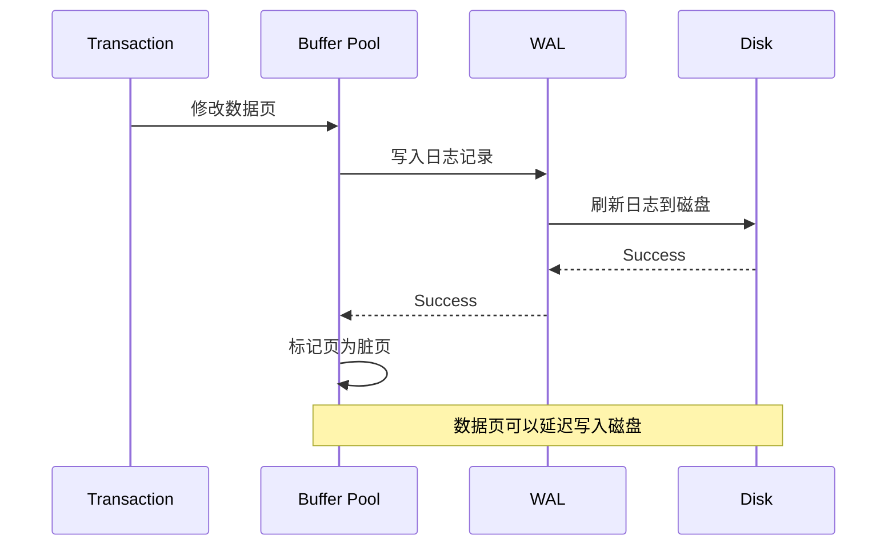

**WAL 的优势**：

- **持久性保证**：日志先写磁盘，即使数据页丢失也能恢复
- **顺序写入**：日志是顺序写入，性能高
- **原子性保证**：通过日志可以精确恢复或回滚

**WAL 的写入规则**：

1. **日志先行**：修改数据页前必须先写日志
2. **强制刷新**：提交事务前必须将日志刷新到磁盘
3. **顺序写入**：日志必须按顺序写入，不能跳跃

### 2.2 LSN：Log Sequence Number

LSN 是日志序号，贯穿页与日志记录的关联：

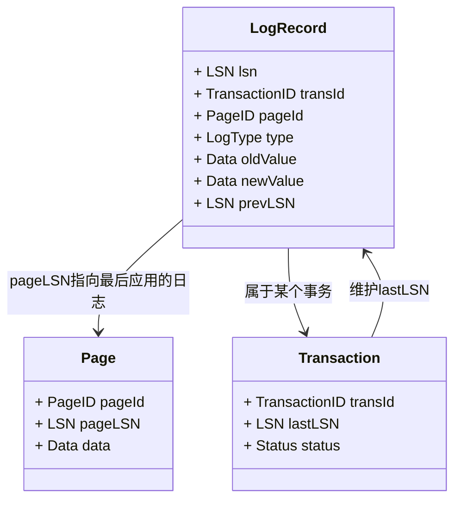

**LSN 的作用**：

1. **页级 LSN（PageLSN）**
   - 每个数据页记录最后应用的日志序号
   - 用于判断页是否需要 Redo
   - 如果 `PageLSN < LogLSN`，说明页需要 Redo

2. **事务级 LSN（LastLSN）**
   - 每个事务记录最后写入的日志序号
   - 用于构建事务的日志链
   - 支持部分回滚和完整回滚

3. **日志链**
   - 通过 `prevLSN` 字段构建事务的日志链
   - 支持从最新日志回溯到事务开始
   - 用于 Undo 操作

**LSN 的分配规则**：

- **单调递增**：LSN 全局单调递增，保证顺序
- **唯一性**：每个日志记录有唯一的 LSN
- **持久化**：LSN 写入日志和页，保证可恢复

### 2.3 Redo/Undo 分离

ARIES 的核心创新是 Redo 和 Undo 的分离：

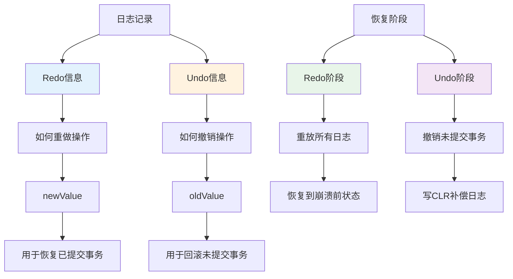

**Redo 的特点**：

- **幂等性**：Redo 操作是幂等的，可以重复执行
- **条件执行**：只有当 `PageLSN < LogLSN` 时才执行 Redo
- **恢复已提交**：用于恢复已提交但未刷盘的修改

**Undo 的特点**：

- **补偿日志（CLR）**：Undo 时写入补偿日志，记录撤销操作
- **可重复撤销**：如果 Undo 过程中再次崩溃，可以继续 Undo
- **撤销未提交**：用于撤销未提交事务的修改

## 3. ARIES 三阶段恢复

### 3.1 Analysis 阶段：重建状态

Analysis 阶段的目标是重建崩溃时的系统状态：

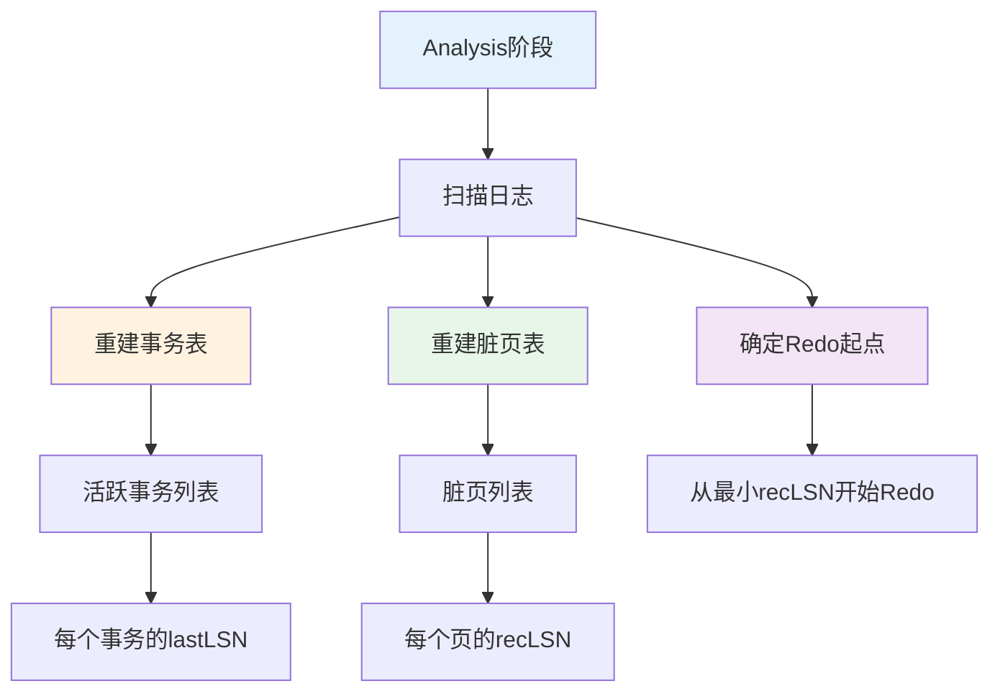

**Analysis 阶段的流程**：

1. **从 Checkpoint 开始扫描**
   - 从最近的 Checkpoint 开始扫描日志
   - Checkpoint 记录了事务表和脏页表的快照

2. **重建事务表（Transaction Table）**
   - 遇到 `BEGIN` 日志：添加事务到事务表
   - 遇到 `COMMIT` 日志：标记事务为已提交
   - 遇到 `ABORT` 日志：标记事务为回滚中
   - 更新每个事务的 `lastLSN`

3. **重建脏页表（Dirty Page Table）**
   - 遇到 `UPDATE` 日志：如果页不在脏页表中，添加并记录 `recLSN`
   - `recLSN`：页第一次变脏时的 LSN
   - 用于确定 Redo 的起点

4. **确定 Redo 起点**
   - Redo 起点 = min(所有脏页的 recLSN, Checkpoint 的 LSN)
   - 从这个点开始 Redo，保证所有脏页都能恢复

**事务表和脏页表的结构**：

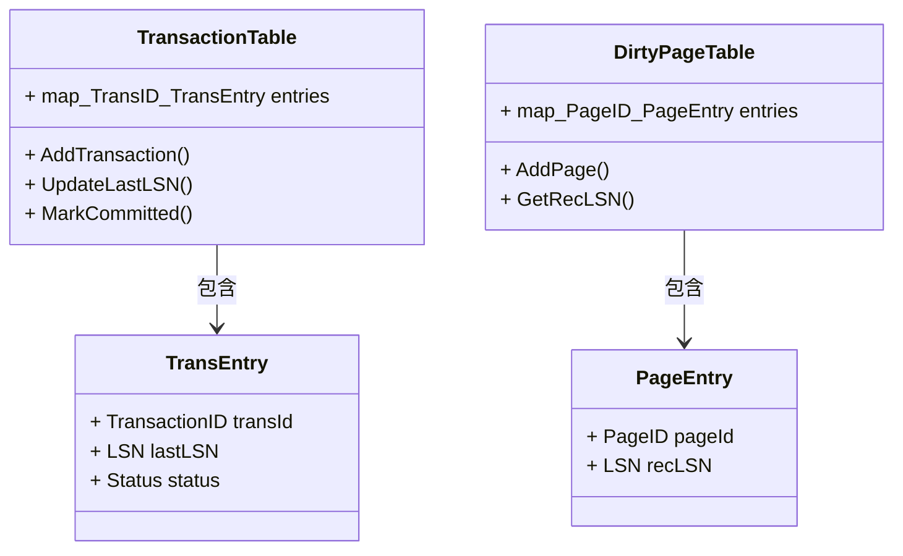

### 3.2 Redo 阶段：恢复到崩溃前状态

Redo 阶段的目标是将系统恢复到崩溃前的状态：

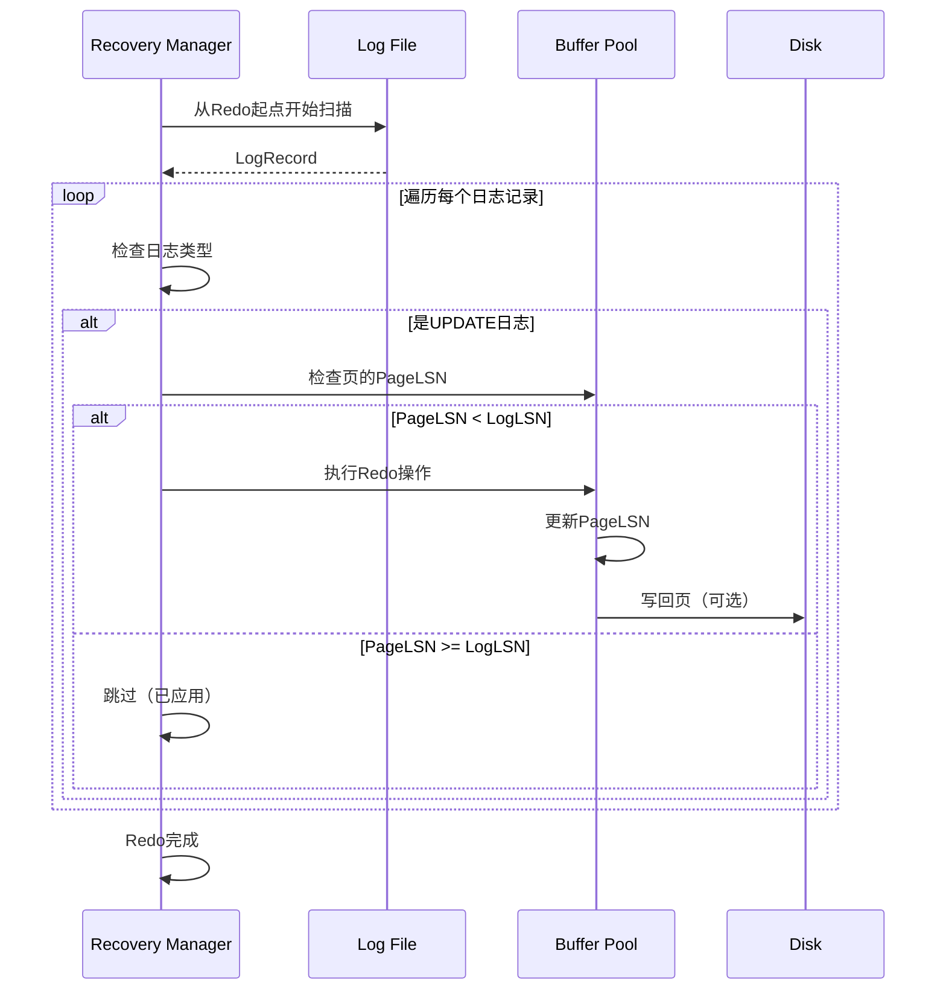

**Redo 阶段的规则**：

1. **条件 Redo**
   - 只有当 `PageLSN < LogLSN` 时才执行 Redo
   - 如果 `PageLSN >= LogLSN`，说明页已经应用了该日志，跳过

2. **幂等性**
   - Redo 操作是幂等的，可以重复执行
   - 即使重复 Redo 也不会出错

3. **不区分事务状态**
   - Redo 阶段不区分事务是否已提交
   - 所有日志都重放，恢复到崩溃前的物理状态

**Redo 的优化**：

- **批量 Redo**：可以批量读取日志，提高效率
- **并行 Redo**：不同页的 Redo 可以并行执行
- **延迟写回**：Redo 后的页可以延迟写回磁盘

### 3.3 Undo 阶段：撤销未提交事务

Undo 阶段的目标是撤销所有未提交事务的修改：

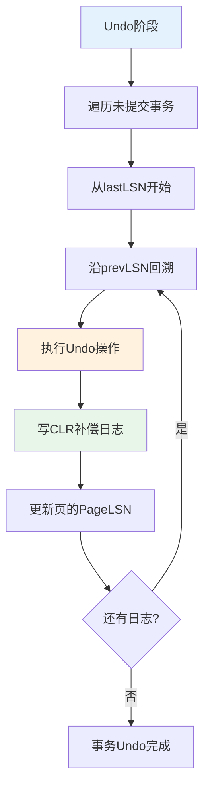

**Undo 阶段的流程**：

1. **遍历未提交事务**
   - 从 Analysis 阶段构建的事务表中获取未提交事务
   - 按 `lastLSN` 从大到小排序（最新的先撤销）

2. **沿日志链回溯**
   - 从事务的 `lastLSN` 开始
   - 通过 `prevLSN` 字段回溯到事务开始
   - 对每个日志记录执行 Undo

3. **执行 Undo 操作**
   - 读取日志记录的 `oldValue`
   - 将页恢复到修改前的状态
   - 更新页的 `PageLSN`

4. **写 CLR（Compensation Log Record）**
   - 记录撤销操作，写入补偿日志
   - CLR 包含 `undoNextLSN`，指向下一个要撤销的日志
   - 如果 Undo 过程中再次崩溃，可以从 CLR 继续

**CLR 的作用**：

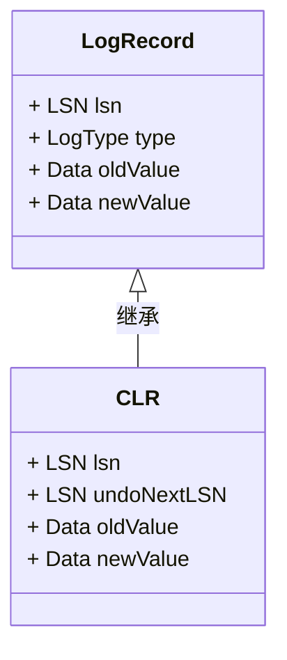

**CLR 的优势**：

- **可重复撤销**：如果 Undo 过程中崩溃，可以从 CLR 继续
- **避免重复撤销**：CLR 标记已经撤销的操作
- **支持部分回滚**：可以只撤销事务的一部分

## 4. Fuzzy Checkpoint

### 4.1 Checkpoint 的作用

Checkpoint 是系统状态的快照，用于减少恢复时间：

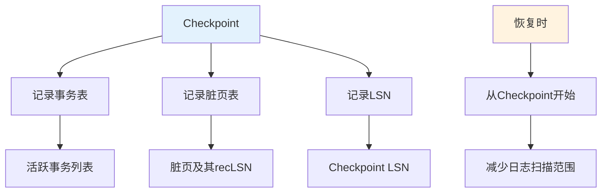

**Checkpoint 的类型**：

1. **Fuzzy Checkpoint（模糊检查点）**
   - 不停止系统运行
   - 记录当前状态，允许继续写入
   - ARIES 采用的方式

2. **Sharp Checkpoint（清晰检查点）**
   - 停止所有写入
   - 等待所有脏页刷盘
   - 恢复简单但影响性能

### 4.2 Fuzzy Checkpoint 的实现

Fuzzy Checkpoint 允许在系统运行时进行：

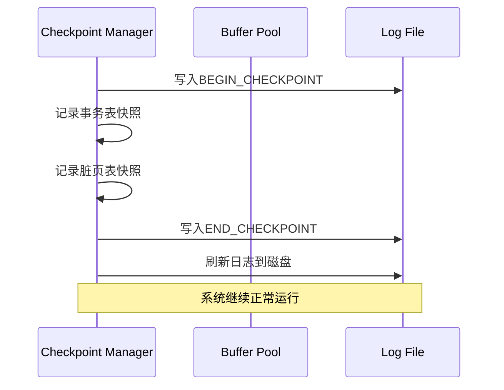

**Fuzzy Checkpoint 的流程**：

1. **写入 BEGIN_CHECKPOINT**
   - 标记 Checkpoint 开始
   - 记录当前 LSN

2. **记录状态快照**
   - 记录事务表（活跃事务及其 lastLSN）
   - 记录脏页表（脏页及其 recLSN）
   - 不要求脏页刷盘

3. **写入 END_CHECKPOINT**
   - 标记 Checkpoint 结束
   - 将状态信息写入日志

4. **刷新日志**
   - 确保 Checkpoint 信息持久化
   - 系统继续正常运行

**Fuzzy Checkpoint 的优势**：

- **不阻塞写入**：Checkpoint 过程中系统继续服务
- **减少恢复时间**：只需从 Checkpoint 开始扫描日志
- **提高可用性**：不影响系统性能

## 5. 部分回滚（Partial Rollback）

### 5.1 部分回滚的需求

部分回滚允许事务回滚到某个保存点（Savepoint）：

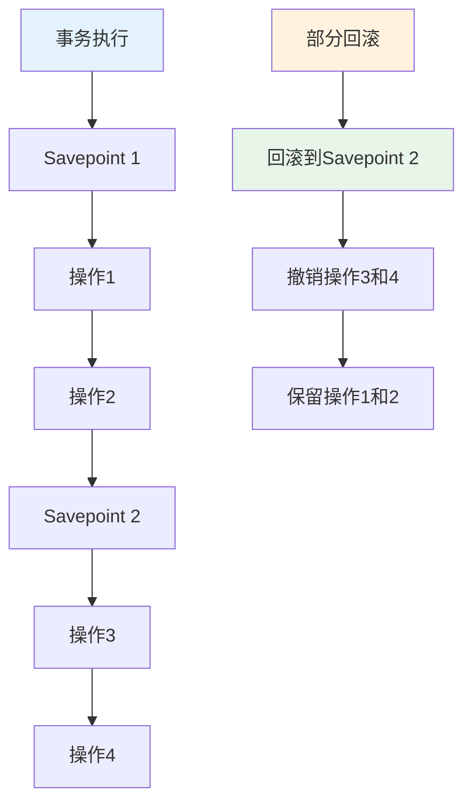

**部分回滚的应用场景**：

- **错误处理**：遇到错误时回滚到保存点，继续执行
- **嵌套事务**：支持子事务的回滚
- **灵活控制**：提供更细粒度的事务控制

### 5.2 部分回滚的实现

部分回滚通过保存点和日志链实现：

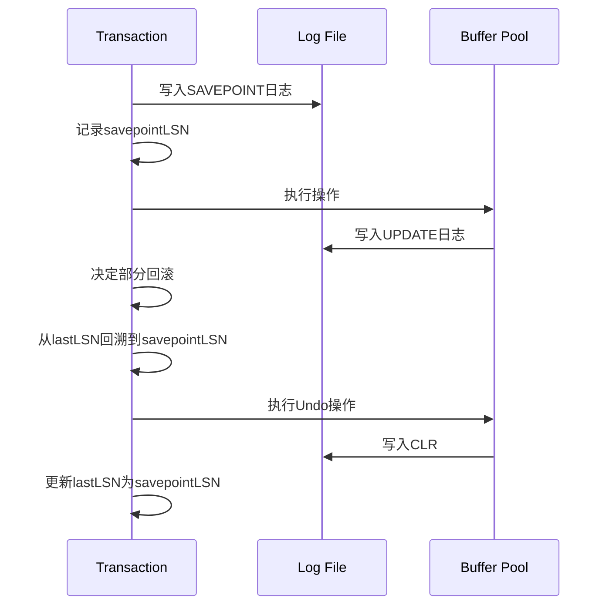

**部分回滚的步骤**：

1. **创建保存点**
   - 写入 `SAVEPOINT` 日志记录
   - 记录保存点的 LSN

2. **执行操作**
   - 继续执行事务操作
   - 所有操作都记录在日志中

3. **部分回滚**
   - 从当前 `lastLSN` 回溯到保存点的 LSN
   - 对每个日志记录执行 Undo
   - 写入 CLR 记录撤销操作
   - 更新事务的 `lastLSN` 为保存点的 LSN

## 6. ARIES 的工程实践

### 6.1 日志格式设计

ARIES 的日志记录包含以下信息：

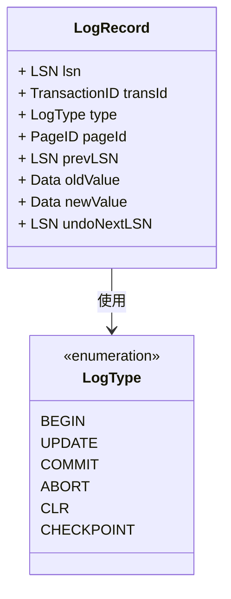

**日志记录的关键字段**：

- **lsn**：日志序号，全局唯一
- **transId**：事务 ID，标识所属事务
- **type**：日志类型（BEGIN、UPDATE、COMMIT 等）
- **pageId**：修改的页 ID
- **prevLSN**：事务前一个日志的 LSN，构建日志链
- **oldValue/newValue**：修改前后的值，用于 Redo/Undo
- **undoNextLSN**：CLR 中指向下一个要撤销的日志

### 6.2 性能优化

ARIES 的优化策略：

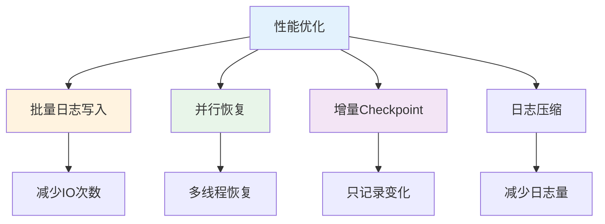

**关键优化技术**：

1. **批量日志写入**
   - 将多个日志记录批量写入
   - 减少磁盘 IO 次数
   - 提高写入吞吐量

2. **并行恢复**
   - Redo 阶段可以并行处理不同页
   - Undo 阶段可以并行处理不同事务
   - 提高恢复速度

3. **增量 Checkpoint**
   - 只记录自上次 Checkpoint 以来的变化
   - 减少 Checkpoint 的开销
   - 提高系统可用性

4. **日志压缩**
   - 合并多个小日志记录
   - 减少日志量
   - 降低存储成本

## 7. ARIES 的影响

### 7.1 对现代数据库的影响

ARIES 的设计思想被广泛采用：

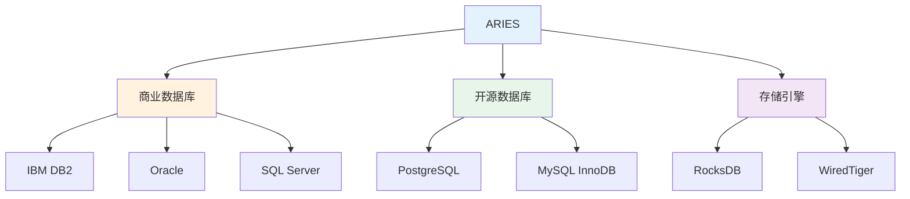

**ARIES 的核心贡献**：

- **页级 LSN**：成为现代数据库的标准设计
- **Redo/Undo 分离**：提供了灵活的恢复机制
- **Fuzzy Checkpoint**：平衡了性能和恢复时间
- **部分回滚**：提供了更细粒度的事务控制

### 7.2 设计原则总结

ARIES 的成功体现了几个重要的设计原则：

1. **幂等性设计**
   - Redo 操作是幂等的，可以安全重复执行
   - 简化了恢复逻辑，提高了可靠性

2. **状态可重建**
   - 通过日志可以完全重建系统状态
   - 不依赖内存状态，支持完全恢复

3. **性能与可靠性平衡**
   - Fuzzy Checkpoint 减少恢复时间
   - 条件 Redo 避免不必要的操作
   - 在性能和可靠性之间找到平衡

4. **工程化实现**
   - 考虑了实际系统的复杂性
   - 支持并发、细粒度锁等高级特性
   - 提供了完整的恢复方案

## 8. 总结

ARIES 是数据库恢复算法的经典设计，其核心思想包括：

- **WAL 机制**：先写日志再写数据，保证持久性
- **LSN 关联**：通过 LSN 关联页和日志，支持精确恢复
- **Redo/Undo 分离**：分别处理已提交和未提交事务
- **三阶段恢复**：Analysis、Redo、Undo 三个阶段各司其职
- **Fuzzy Checkpoint**：支持增量检查点，减少恢复时间
- **部分回滚**：支持保存点和部分回滚，提供灵活控制

ARIES 的设计思想影响了大量现代数据库系统，成为数据库恢复机制的标准参考。理解 ARIES 的设计原理，有助于理解现代数据库系统的恢复机制和工程实践。

