> 论文：Bigtable: A Distributed Storage System for Structured Data（Chang et al., OSDI 2006）

Bigtable 是 Google 开发的一个分布式结构化数据存储系统，为 Google 的多个产品（如 Google Earth、Google Analytics、Gmail 等）提供存储服务。本文深入解析 Bigtable 的架构设计、核心机制和工程实践。

## 1. Bigtable 的数据模型与抽象

### 1.1 数据模型：稀疏多维表

Bigtable 对外提供的是一个巨大的稀疏多维表，数据模型包含三个维度：

- **Row Key（行键）**：任意字符串，最大 64KB，按字典序排序
- **Column Family:Qualifier（列族:列限定符）**：列族是访问控制的基本单位，列限定符在列族内任意命名
- **Timestamp（时间戳）**：64 位整数，支持多版本数据

**数据模型示例**：

```
Row Key: "com.cnn.www"
├── Column Family: "contents"
│   ├── Qualifier: "" (空字符串)
│   │   ├── Timestamp: t3 → "&lt;html&gt;..."
│   │   ├── Timestamp: t2 → "&lt;html&gt;..."
│   │   └── Timestamp: t1 → "&lt;html&gt;..."
│   └── Qualifier: "anchor:cnnsi.com"
│       └── Timestamp: t5 → "CNN"
└── Column Family: "language"
    └── Qualifier: ""
        └── Timestamp: t4 → "en"
```

**设计特点**：

- **稀疏性**：不同行的列可以完全不同，不需要预定义 Schema
- **多版本**：同一单元格可以存储多个时间戳版本，自动按时间戳排序
- **按行键排序**：所有数据按 Row Key 字典序排列，便于范围查询

### 1.2 数据模型的设计权衡

Bigtable 的数据模型设计体现了几个重要的工程权衡：

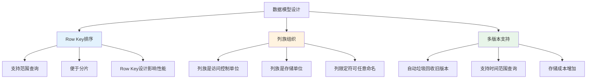

**设计权衡分析**：

1. **Row Key 排序 vs 随机访问**
   - **优势**：支持高效的范围查询，便于 Tablet 分片
   - **代价**：Row Key 设计不当会导致热点，影响负载均衡
   - **实践**：需要根据访问模式设计 Row Key（如反转域名、添加哈希前缀等）

2. **列族 vs 扁平列**
   - **优势**：列族是访问控制和存储的基本单位，便于权限管理和数据局部性
   - **代价**：列族数量有限（建议不超过数百个），列限定符数量可以很大
   - **实践**：将相关列组织在同一列族，提高数据局部性

3. **多版本 vs 单版本**
   - **优势**：支持时间旅行查询，自动保留历史版本
   - **代价**：存储成本增加，需要垃圾回收机制
   - **实践**：通过 TTL 和版本数限制控制存储成本

## 2. Bigtable 的架构设计

### 2.1 三层架构：Client、Master、TabletServer

Bigtable 采用经典的三层架构，清晰地分离了元数据管理和数据存储：

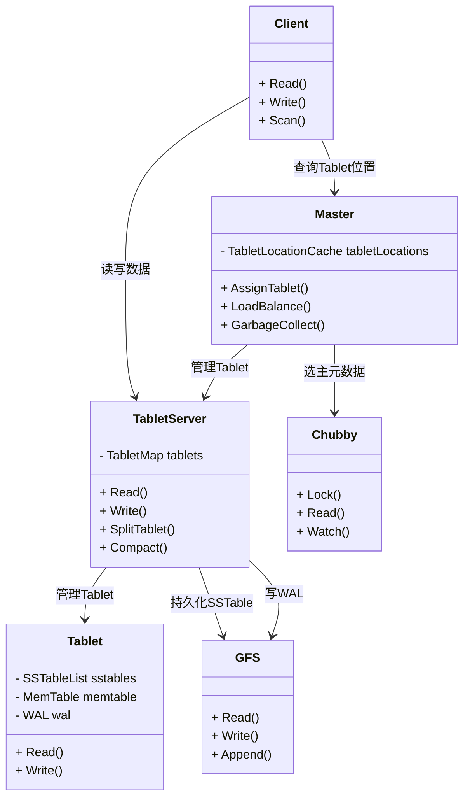

**架构组件职责**：

1. **Client（客户端）**
   - 缓存 Tablet 位置信息，减少与 Master 的交互
   - 直接与 TabletServer 通信进行读写操作
   - 处理 Tablet 迁移和分裂时的重试逻辑

2. **Master（主控节点）**
   - 管理 Tablet 的分配和负载均衡
   - 监控 TabletServer 的健康状态
   - 执行 Tablet 分裂和合并操作
   - 管理 Schema 变更（如列族的创建和删除）
   - 执行垃圾回收（删除的 Tablet、SSTable 等）

3. **TabletServer（Tablet 服务器）**
   - 管理多个 Tablet（通常每个服务器管理 10-1000 个 Tablet）
   - 处理 Tablet 的读写请求
   - 执行 Tablet 分裂（当 Tablet 过大时）
   - 执行 Minor Compaction 和 Major Compaction

### 2.2 Tablet：按 Row Key 范围分片

Tablet 是 Bigtable 的基本分片单位，每个 Tablet 负责一个 Row Key 范围：

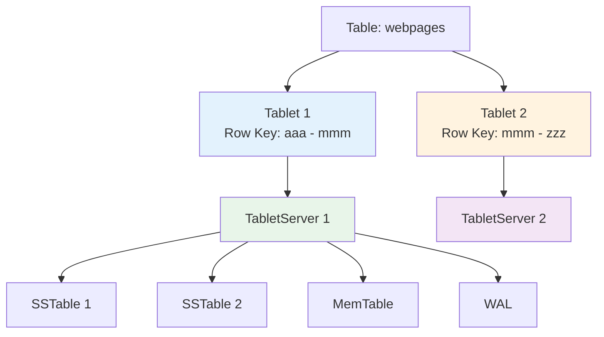

**Tablet 分片的优势**：

- **水平扩展**：通过增加 TabletServer 和迁移 Tablet 实现扩展
- **负载均衡**：Master 可以将 Tablet 在不同 TabletServer 间迁移
- **故障隔离**：单个 Tablet 的故障不影响其他 Tablet
- **并行处理**：不同 Tablet 可以并行处理请求

**Tablet 分裂机制**：

当 Tablet 增长到一定大小（默认 200MB）时，TabletServer 会触发分裂：

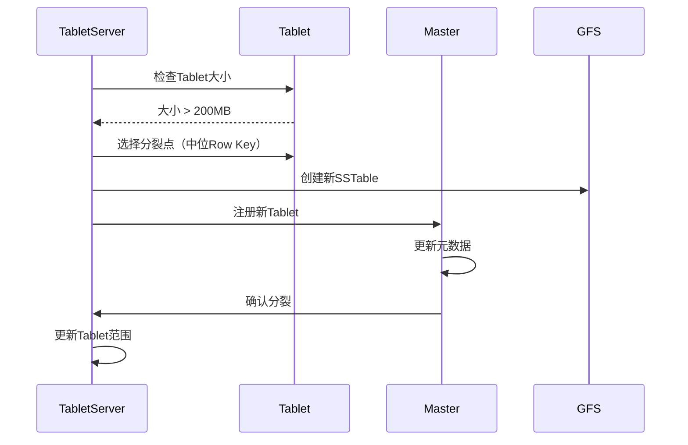

**分裂策略**：

- **分裂点选择**：选择中位 Row Key 作为分裂点，保证两个子 Tablet 大小相近
- **分裂时机**：在 Major Compaction 后执行，此时数据已排序，分裂更高效
- **原子性**：分裂是原子操作，客户端在分裂期间可能收到短暂错误，需要重试

### 2.3 Bigtable 的“灵魂”：元数据三层定位（ROOT / METADATA / User Tablet）

如果只看 “Master + TabletServer + Tablet”，会把 Bigtable 误解成“普通的分片 KV”。Bigtable 论文里非常关键的一点是：**如何让客户端快速定位某个 row key 属于哪个 TabletServer，同时把 Master 从数据路径里尽量摘出去**。

Bigtable 用了一个典型的“三层结构”：

- **ROOT tablet**：记录 METADATA table 的 tablet 位置信息
- **METADATA table**：记录所有用户表 tablet 的位置信息（以及一些辅助元数据）
- **Chubby**：只存 ROOT tablet 的位置（少量强一致协调状态）

这三个层级加上客户端缓存，使得 **绝大多数读写不需要每次访问 Master**。

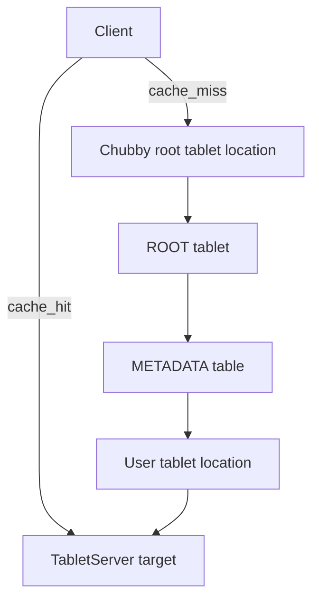

**定位流程（工程直觉版）**：

1. **Client 先查本地 tablet location cache**（通常命中）
2. 未命中时：
   - 从 **Chubby** 获取 ROOT tablet 的位置（很少变）
   - 读 **ROOT tablet** 得到 METADATA 的位置
   - 读 **METADATA** 找到目标 user tablet 的 TabletServer
3. **缓存定位结果**，后续读写直连目标 TabletServer

> 这其实是一种“把强一致状态缩到最小（Chubby）+ 把其余定位信息做成可缓存的表”的经典套路：协调小状态 / 数据大状态。

### 2.4 Tablet 分配/迁移：Master 的职责是控制面，不是数据面

Master 负责的不是“每次请求怎么读写”，而是 **长期性的控制面工作**：

- tablet 分配给哪个 TabletServer
- 负载均衡（迁移 tablet）
- tablet 分裂（触发/协调）
- schema 管理（列族创建/删除）
- GC（无用 SSTable、删除的 tablet 等）

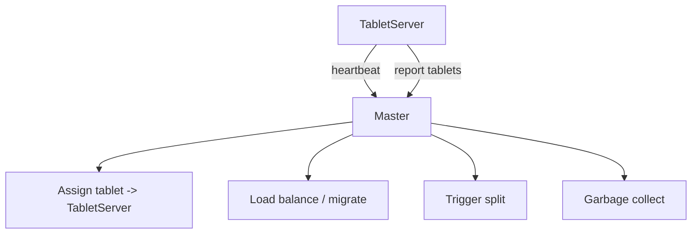

**为什么 Master 不容易成为瓶颈**：

- tablet 定位信息可缓存，并通过 ROOT/METADATA 自描述
- 真正高频的数据读写走 Client ↔ TabletServer 的数据路径

### 2.5 Locality groups：把“列族”真正变成 IO 局部性

Bigtable 的列族不仅是“权限/组织单位”，还会影响 **物理布局**：列族可以被组织成 **locality group**，把“经常一起读”的列放在一起，减少 IO。

工程要点：

- 读一行的某些列族时，只需要触碰对应 locality group 的 SSTable block
- 避免“为了读一个小列把整行的所有大列都 IO 出来”

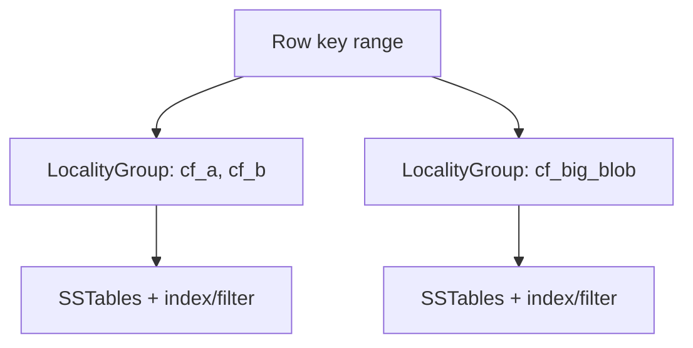

## 3. 依赖系统：GFS 与 Chubby

### 3.1 GFS：底层持久化存储

Bigtable 使用 GFS 作为底层存储，所有持久化数据都存储在 GFS 上：

**存储在 GFS 上的数据**：

- **SSTable 文件**：Tablet 的持久化数据文件
- **WAL 文件**：Write-Ahead Log，用于崩溃恢复
- **元数据文件**：Tablet 的元数据信息

**GFS 的使用模式**：

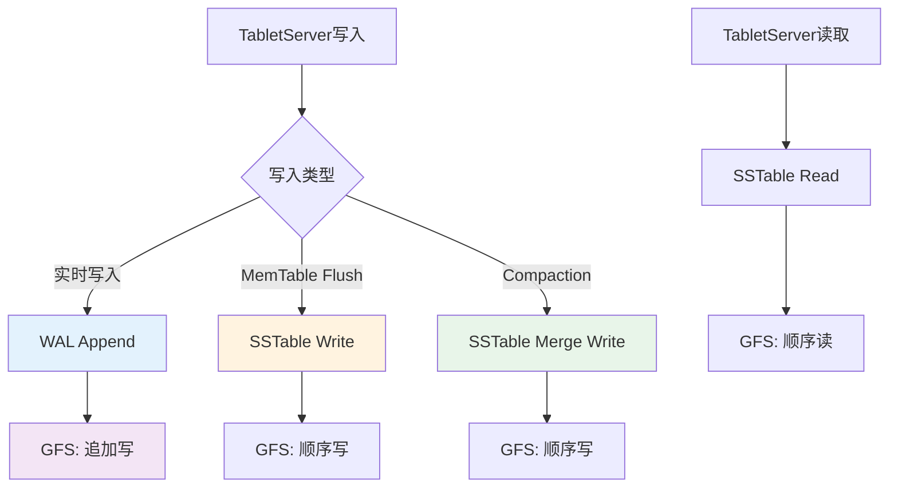

**GFS 的优势**：

- **高吞吐**：GFS 针对大文件顺序读写优化，适合 Bigtable 的访问模式
- **容错性**：GFS 的副本机制保证数据可靠性
- **可扩展**：GFS 可以扩展到数千台机器

**GFS 的局限性**：

- **延迟较高**：不适合低延迟的随机读写
- **一致性较弱**：GFS 提供的是最终一致性，Bigtable 需要在应用层处理

### 3.2 Chubby：分布式锁与元数据

Chubby 是 Bigtable 的协调服务，提供分布式锁和少量元数据存储：

**Chubby 在 Bigtable 中的作用**：

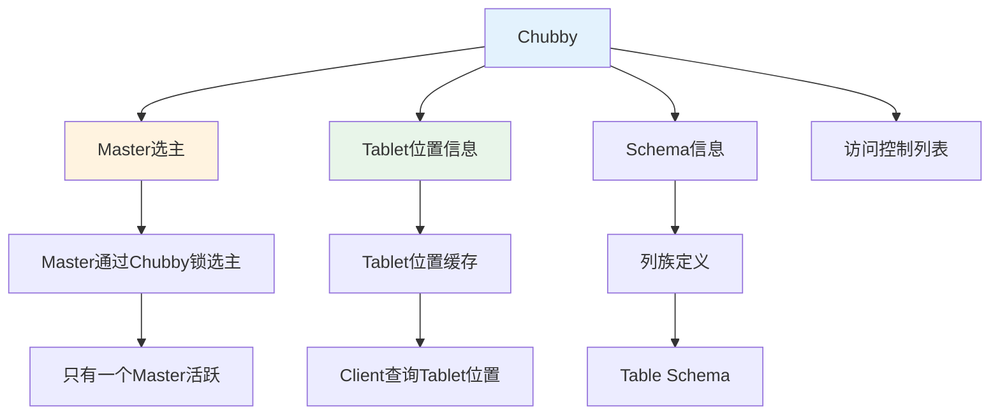

**Chubby 的使用场景**：

1. **Master 选主**
   - Master 通过获取 Chubby 锁来成为活跃 Master
   - 如果 Master 崩溃，Chubby 锁释放，其他 Master 可以接管
   - 保证同一时刻只有一个活跃 Master

2. **Tablet 位置信息**
   - Master 在 Chubby 中存储 Tablet 的位置信息
   - Client 可以查询 Chubby 获取 Tablet 位置
   - Client 缓存位置信息，减少对 Chubby 的访问

3. **Schema 信息**
   - 表的 Schema（列族定义）存储在 Chubby 中
   - Master 读取 Schema 信息进行表管理
   - Schema 变更通过 Chubby 的原子操作保证一致性

**设计原则**：

> 把"强一致的小状态"交给专门的协调服务（Chubby），把"大数据"交给吞吐型存储（GFS）。

这种分层设计是构建大规模分布式系统的经典模式：

- **Chubby**：处理小数据、强一致性、低延迟的协调需求
- **GFS**：处理大数据、高吞吐、最终一致性的存储需求
- **Bigtable**：在两者之上构建结构化数据存储抽象

## 4. 存储层：SSTable 与 MemTable

### 4.1 SSTable：持久化存储格式

SSTable（Sorted String Table）是 Bigtable 的持久化存储格式，类似于 LSM-Tree 中的磁盘组件：

**SSTable 的结构**：

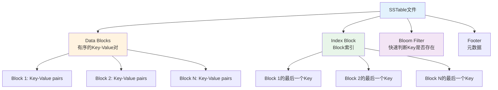

**SSTable 的设计特点**：

- **不可变**：SSTable 一旦写入就不可修改，只能通过 Compaction 合并
- **有序性**：每个 SSTable 内的数据按 Row Key 排序，支持二分查找
- **块结构**：数据组织成固定大小的块（通常 64KB），便于压缩和缓存
- **索引结构**：每个 SSTable 包含索引块，记录每个数据块的最后一个 Key

**SSTable 的读取流程**：

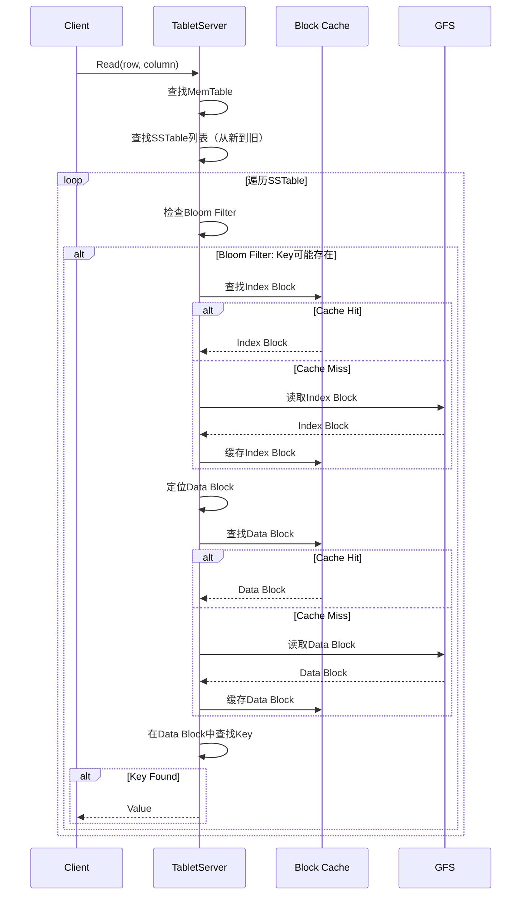

**读取优化**：

- **Bloom Filter**：快速判断 Key 是否不存在于 SSTable，避免不必要的磁盘读取
- **Block Cache**：缓存最近访问的数据块和索引块，提高读取性能
- **顺序扫描**：从最新的 SSTable 开始扫描，找到 Key 后立即返回

### 4.2 MemTable：内存中的写缓冲区

MemTable 是 Tablet 的内存组件，用于缓存最近的写入：

**MemTable 的结构**：

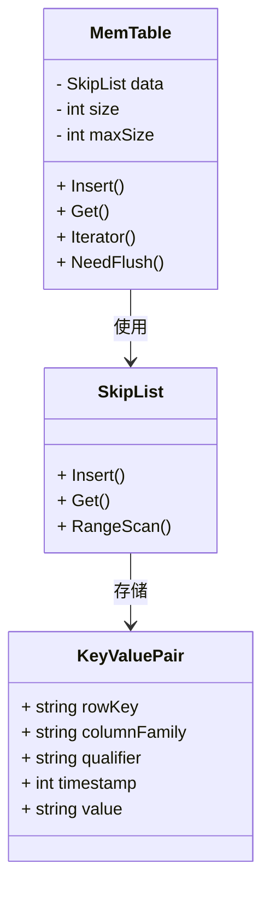

**MemTable 的实现**：

- **数据结构**：使用跳表（Skip List）实现，支持 O(log n) 的插入和查找
- **有序性**：MemTable 中的数据按 Row Key 排序，与 SSTable 格式一致
- **大小限制**：当 MemTable 达到阈值（默认 2MB）时，触发 Flush 操作

**MemTable 的写入流程**：

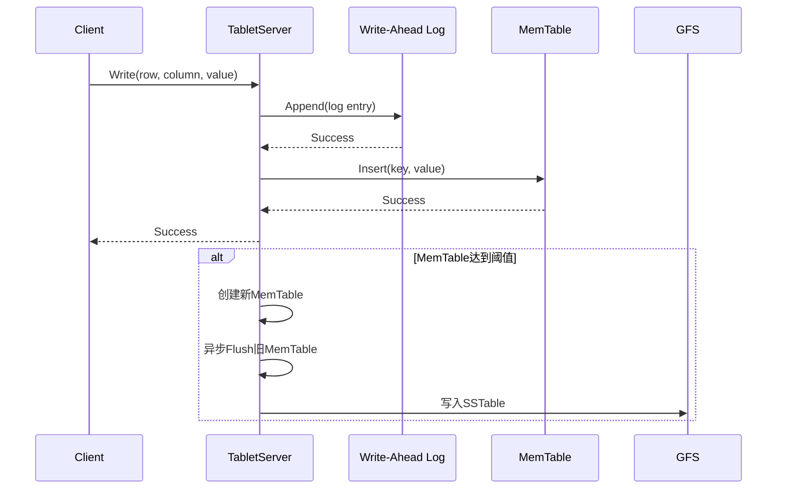

**写入优化**：

- **批量写入**：将多个写入操作批量提交到 WAL，减少 IO 次数
- **异步 Flush**：MemTable 的 Flush 是异步的，不阻塞新的写入
- **双 MemTable**：使用两个 MemTable，一个用于写入，一个用于 Flush

## 5. 写入与读取路径

### 5.1 写入路径：WAL + MemTable

Bigtable 的写入路径采用经典的 LSM-Tree 模式：

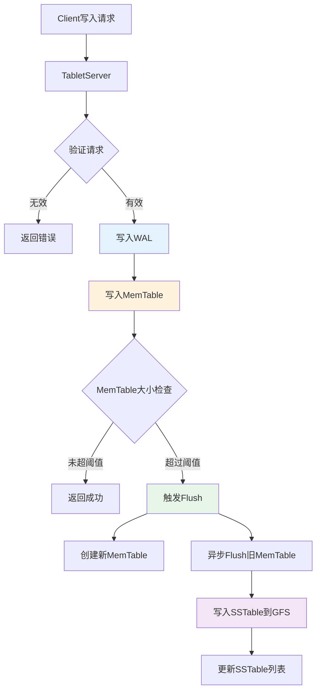

**写入路径的关键步骤**：

1. **请求验证**
   - 验证 Row Key、列族、权限等
   - 检查 Tablet 是否可写（未分裂、未迁移）

2. **写入 WAL（Write-Ahead Log）**
   - 先写 WAL，保证持久性
   - WAL 采用追加写，性能高
   - WAL 文件达到一定大小后滚动

3. **写入 MemTable**
   - 写入内存中的 MemTable
   - MemTable 使用跳表，支持高效插入和查找

4. **MemTable Flush**
   - 当 MemTable 达到阈值时，触发 Flush
   - Flush 是异步的，不阻塞写入
   - Flush 后创建新的 MemTable 继续服务写入

**写入一致性保证**：

- **持久性**：通过 WAL 保证，即使 TabletServer 崩溃，数据也不会丢失
- **原子性**：单个写入操作是原子的，要么全部成功，要么全部失败
- **顺序性**：同一 Row Key 的写入按时间戳顺序排列

### 5.2 读取路径：MemTable + SSTable

Bigtable 的读取路径需要合并 MemTable 和多个 SSTable 的数据：

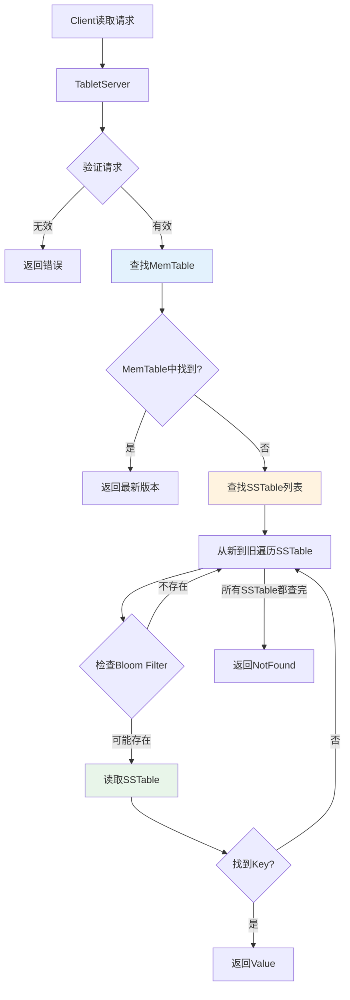

**读取路径的优化**：

1. **MemTable 优先**
   - 先查找 MemTable，因为 MemTable 包含最新的数据
   - MemTable 在内存中，查找速度快

2. **SSTable 顺序扫描**
   - 从最新的 SSTable 开始扫描
   - 使用 Bloom Filter 快速判断 Key 是否不存在
   - 找到 Key 后立即返回，不需要继续扫描

3. **多版本合并**
   - 如果查询指定了时间范围，需要合并多个版本
   - 返回时间范围内最新的版本

**读取性能优化**：

- **Block Cache**：缓存最近访问的数据块，减少磁盘读取
- **预取**：顺序扫描时预取下一个数据块
- **并行读取**：对于范围查询，可以并行读取多个 SSTable

### 5.3 Scan（范围查询）：为什么“按行键排序”是 Bigtable 的第一性设计

Bigtable 的很多典型 workload 是按 row key 做范围扫描（scan）：比如某个前缀、某段时间范围（通过 row key 设计实现）。

scan 的系统关键点在于：

- tablet 本身就是一个 row key range
- 只要按 range 逐个 tablet 扫描，就能把 IO 模式做得很顺序、很可控

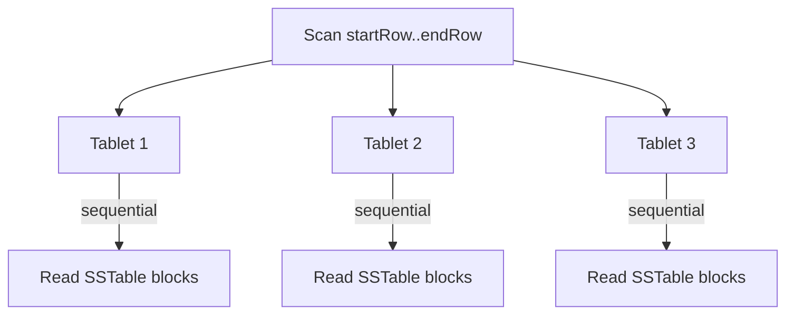

工程经验：scan 性能很大程度上取决于 **row key 设计**（是否能把相关数据聚簇在一起，以及是否避免热点前缀）。

### 5.4 单行原子性（single-row atomicity）：Bigtable 的一致性边界

Bigtable 论文里强调一个非常实用的语义边界：**同一行（同一 row key）的读写可以做到原子/一致**，跨行则不提供事务语义。

这是一种典型工程取舍：

- 单行原子：足以覆盖大量业务（配置、计数、用户状态等）
- 跨行事务：成本高、复杂度高，不在 Bigtable 的目标内

可以将它理解成：Bigtable 把“强语义”严格限制在 **row 这个天然的 partition key** 上。

## 6. Compaction：合并与压缩

### 6.1 Minor Compaction：MemTable Flush

Minor Compaction 是将 MemTable 刷新为 SSTable 的过程：

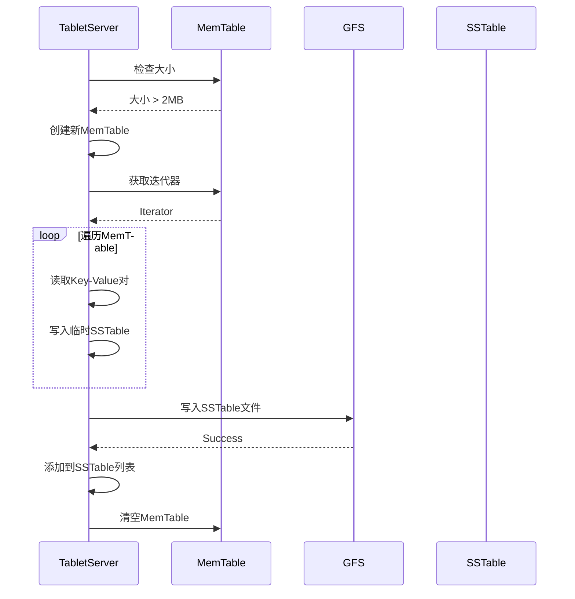

**Minor Compaction 的特点**：

- **异步执行**：不阻塞写入操作
- **生成新 SSTable**：每次 Flush 生成一个新的 SSTable
- **SSTable 数量增长**：随着时间推移，SSTable 数量会不断增加

### 6.2 Major Compaction：SSTable 合并

Major Compaction 是将多个 SSTable 合并为一个 SSTable 的过程：

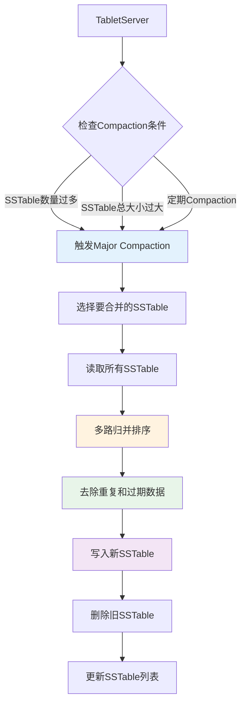

**Major Compaction 的流程**：

1. **选择 SSTable**
   - 选择多个较小的 SSTable 进行合并
   - 或者选择所有 SSTable 进行全量合并

2. **多路归并**
   - 读取所有选中的 SSTable
   - 使用多路归并算法合并数据
   - 保持 Row Key 的有序性

3. **数据清理**
   - 去除重复的 Key（保留最新的版本）
   - 删除过期的数据（超过 TTL 或版本数限制）
   - 删除标记为删除的数据（Tombstone）

4. **写入新 SSTable**
   - 将合并后的数据写入新的 SSTable
   - 新 SSTable 替换旧的多个 SSTable

**Major Compaction 的优势**：

- **减少 SSTable 数量**：提高读取性能，减少需要扫描的 SSTable
- **清理过期数据**：释放存储空间
- **优化数据布局**：提高数据局部性，减少随机读取

**Major Compaction 的代价**：

- **IO 开销**：需要读取和写入大量数据
- **CPU 开销**：归并排序需要 CPU 计算
- **临时空间**：需要额外的存储空间存放新 SSTable

### 6.3 Compaction 策略

Bigtable 支持两种 Compaction 策略：

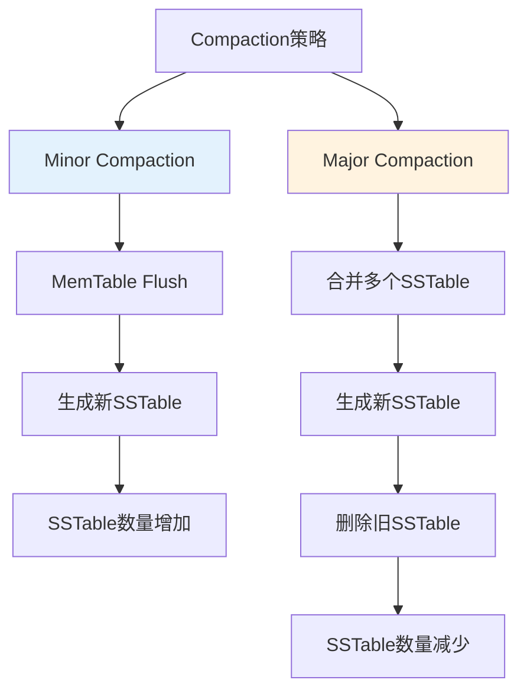

**Compaction 触发条件**：

- **Minor Compaction**：MemTable 大小超过阈值（默认 2MB）
- **Major Compaction**：
  - SSTable 数量超过阈值（默认 10 个）
  - SSTable 总大小超过阈值
  - 定期执行（如每天一次）

**Compaction 的权衡**：

- **频率 vs 性能**：频繁 Compaction 可以减少 SSTable 数量，但增加 IO 开销
- **空间 vs 时间**：Major Compaction 需要临时空间，但可以长期优化性能
- **延迟 vs 吞吐**：Compaction 可能影响写入延迟，但可以提高读取性能

### 6.4 为什么 Bigtable 的 split 往往绑定 Major Compaction

在 "Major Compaction" 段落中，确实容易觉得"这是 LSM 的通用描述"。但 Bigtable 的一个论文级工程点是：

- **split 通常在 Major Compaction 之后做**（或者说，系统倾向在数据更“干净、已排序、已去重”后做 split）

原因很实际：

- split 需要一个合适的分裂点（中位 row key），更希望基于“完整、有序”的数据视图
- Major Compaction 后 SSTable 更少、重叠更少，split 后的子 tablet 更容易被快速加载与迁移

这体现了 Bigtable 的总体策略：**把昂贵操作集中在后台批处理（compaction/split/migrate），保持前台读写路径尽量简单稳定**。

## 7. 故障恢复与一致性

### 7.1 TabletServer 故障恢复

当 TabletServer 崩溃时，Bigtable 需要恢复该服务器上的所有 Tablet：

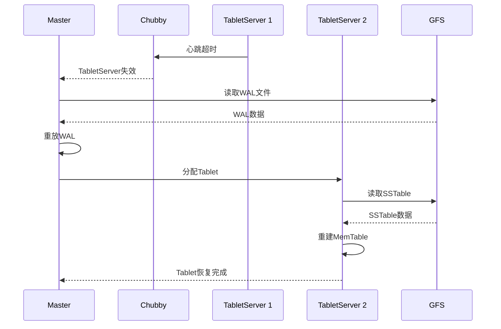

**恢复流程**：

1. **检测故障**
   - Master 通过 Chubby 检测 TabletServer 的心跳
   - 如果心跳超时，认为 TabletServer 失效

2. **读取 WAL**
   - Master 从 GFS 读取失效 TabletServer 的 WAL 文件
   - WAL 文件包含所有未 Flush 的写入

3. **重放 WAL**
   - 将 WAL 中的写入操作重放到新的 TabletServer
   - 重建 MemTable

4. **加载 SSTable**
   - 从 GFS 加载 Tablet 的 SSTable 文件
   - 重建 Tablet 的元数据

**恢复时间优化**：

- **WAL 分段**：将 WAL 分成多个段，可以并行恢复
- **增量恢复**：只恢复未提交的写入，已 Flush 的数据从 SSTable 加载
- **预分配资源**：提前分配 TabletServer 资源，减少恢复时间

### 7.2 一致性保证

Bigtable 提供的一致性保证：

```mermaid
graph TD
    A[一致性保证] --> B[单行事务]
    A --> C[最终一致性]
    A --> D[读一致性]
    
    B --> B1[同一Row Key的写入是原子的]
    B1 --> B2[支持单行多列写入]
    
    C --> C1[不同Tablet之间最终一致]
    C1 --> C2[通过Compaction收敛]
    
    D --> D1[读取看到已提交的写入]
    D1 --> D2[可能看到部分写入]
    
    style B fill:#e3f2fd
    style C fill:#fff3e0
    style D fill:#e8f5e9
```

**一致性级别**：

- **单行一致性**：同一 Row Key 的写入是原子的，读取总是看到一致的快照
- **跨行一致性**：不同 Row Key 之间不保证强一致性，只保证最终一致性
- **读一致性**：读取可能看到部分写入，但不会看到未提交的写入

**一致性实现**：

- **WAL**：保证写入的持久性，崩溃后可以恢复
- **MemTable + SSTable**：通过合并机制保证数据的一致性
- **版本控制**：通过时间戳实现多版本，支持时间旅行查询

## 8. 性能优化与工程实践

### 8.1 性能优化技术

Bigtable 采用了多种性能优化技术：

```mermaid
graph TD
    A[性能优化] --> B[缓存优化]
    A --> C[压缩优化]
    A --> D[局部性优化]
    A --> E[批量操作]
    
    B --> B1[Block Cache]
    B1 --> B2[缓存热点数据]
    B --> B3[Tablet位置缓存]
    B3 --> B4[减少Master查询]
    
    C --> C1[SSTable压缩]
    C1 --> C2[减少存储空间]
    C --> C3[减少IO开销]
    
    D --> D1[列族局部性]
    D1 --> D2[相关数据放在一起]
    D --> D3[Row Key设计]
    D3 --> D4[避免热点]
    
    E --> E1[批量写入]
    E1 --> E2[减少网络往返]
    E --> E3[批量读取]
    E3 --> E4[预取数据]
    
    style B fill:#e3f2fd
    style C fill:#fff3e0
    style D fill:#e8f5e9
    style E fill:#f3e5f5
```

**关键优化技术**：

1. **Block Cache**
   - 缓存最近访问的数据块和索引块
   - 使用 LRU 策略淘汰冷数据
   - 显著提高读取性能

2. **压缩**
   - SSTable 支持多种压缩算法（Snappy、Gzip 等）
   - 减少存储空间和 IO 开销
   - 权衡压缩率和压缩速度

3. **局部性优化**
   - 将相关数据组织在同一列族
   - 设计 Row Key 避免热点
   - 利用数据局部性提高缓存命中率

4. **批量操作**
   - 支持批量写入和批量读取
   - 减少网络往返次数
   - 提高吞吐量

### 8.2 工程实践与经验

**Row Key 设计原则**：

- **避免热点**：不要使用单调递增的 Row Key（如时间戳、自增 ID）
- **利用局部性**：将经常一起访问的数据放在相近的 Row Key
- **支持范围查询**：设计 Row Key 支持常见的范围查询模式

**列族设计原则**：

- **数量限制**：列族数量不要太多（建议 < 100）
- **访问模式**：将访问模式相似的列放在同一列族
- **数据大小**：避免单个列族过大，影响负载均衡

**性能调优**：

- **MemTable 大小**：根据写入负载调整 MemTable 大小
- **Compaction 策略**：根据读写比例调整 Compaction 频率
- **缓存大小**：根据内存容量调整 Block Cache 大小

## 9. Bigtable 的影响与后续发展

### 9.1 对后续系统的影响

Bigtable 的设计思想影响了大量后续系统：

```mermaid
graph TD
    A[Bigtable] --> B[HBase]
    A --> C[Cassandra]
    A --> D[Hypertable]
    A --> E[其他LSM系统]
    
    B --> B1[开源实现]
    B1 --> B2[Apache生态]
    
    C --> C1[去中心化设计]
    C1 --> C2[最终一致性]
    
    D --> D1[高性能实现]
    
    E --> E1[LevelDB]
    E1 --> E2[RocksDB]
    E2 --> E3[其他存储引擎]
    
    style A fill:#e3f2fd
    style B fill:#fff3e0
    style C fill:#e8f5e9
    style E fill:#f3e5f5
```

**影响范围**：

- **开源实现**：HBase 是 Bigtable 的开源实现，广泛应用于大数据生态
- **设计模式**：LSM-Tree + Tablet 分片成为分布式存储的标准模式
- **工程实践**：WAL + MemTable + SSTable 的组合被广泛采用

### 9.2 设计原则总结

Bigtable 的成功体现了几个重要的设计原则：

1. **面向工作负载设计**
   - 针对 Google 的典型工作负载（大文件、追加写、顺序读）优化
   - 不追求通用的 POSIX 语义，而是提供适合特定场景的抽象

2. **分层架构**
   - 将"强一致的小状态"交给 Chubby
   - 将"大数据"交给 GFS
   - 在两者之上构建 Bigtable

3. **可扩展性优先**
   - Tablet 分片支持水平扩展
   - 无单点瓶颈（Master 只管理元数据，不参与数据路径）

4. **工程化权衡**
   - 在一致性、可用性、性能之间做出合理权衡
   - 通过 Compaction、缓存等技术优化性能

## 10. 总结

Bigtable 是分布式存储系统的经典设计，其核心思想包括：

- **数据模型**：稀疏多维表，支持 Row Key 排序和多版本
- **架构设计**：三层架构（Client、Master、TabletServer），清晰分离职责
- **存储机制**：LSM-Tree 模式（MemTable + SSTable），支持高吞吐写入
- **依赖系统**：GFS 提供持久化存储，Chubby 提供协调服务
- **一致性保证**：单行强一致，跨行最终一致
- **性能优化**：Block Cache、压缩、局部性优化等

Bigtable 的设计思想影响了大量后续系统，成为分布式存储系统的经典参考。理解 Bigtable 的设计原理，有助于理解现代分布式存储系统的设计思路和工程实践。