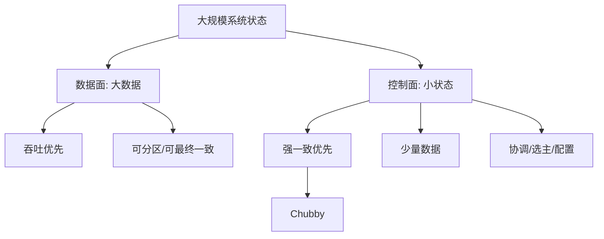
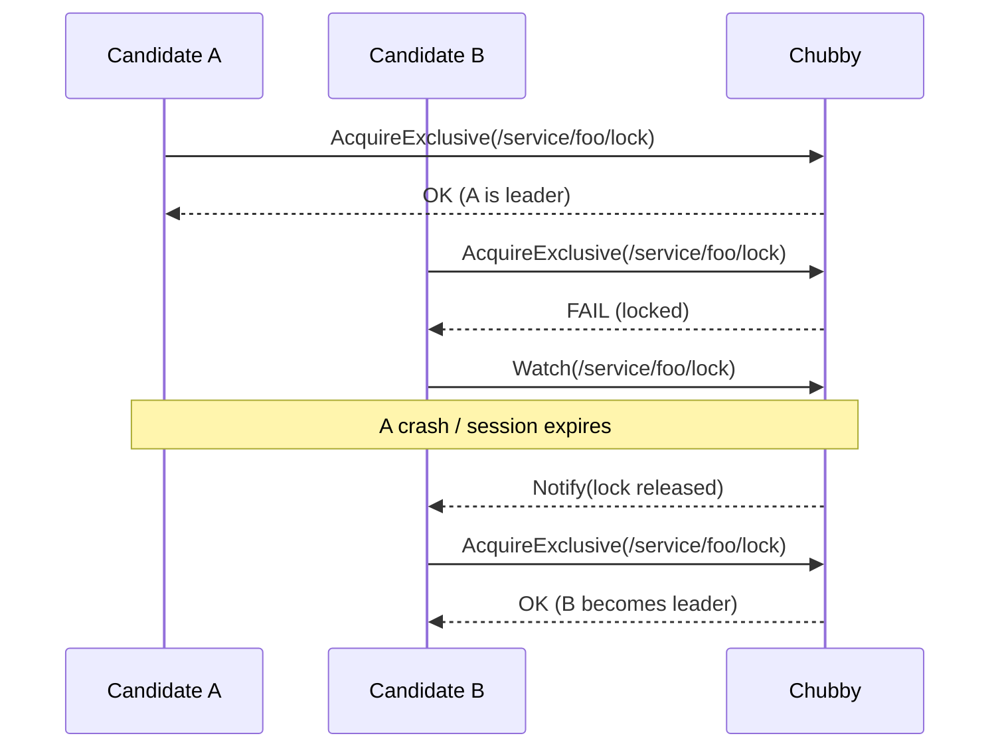
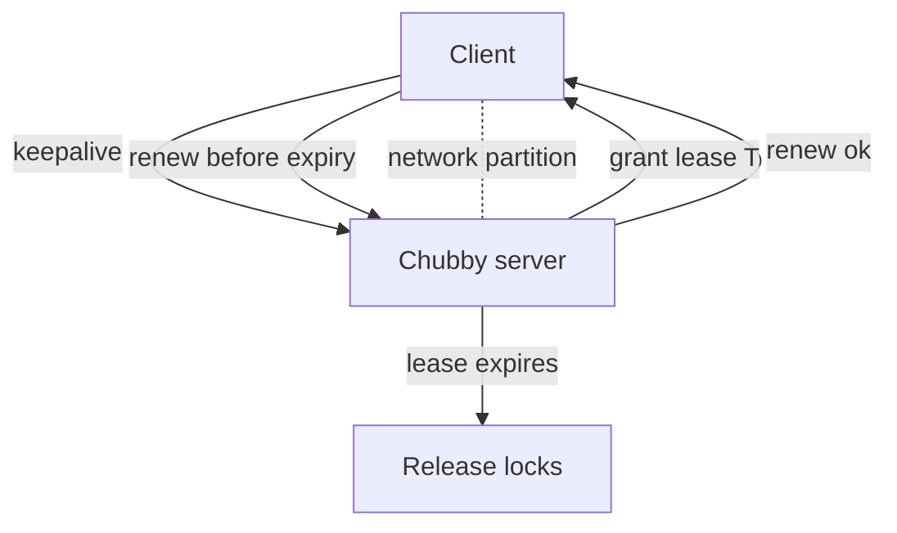
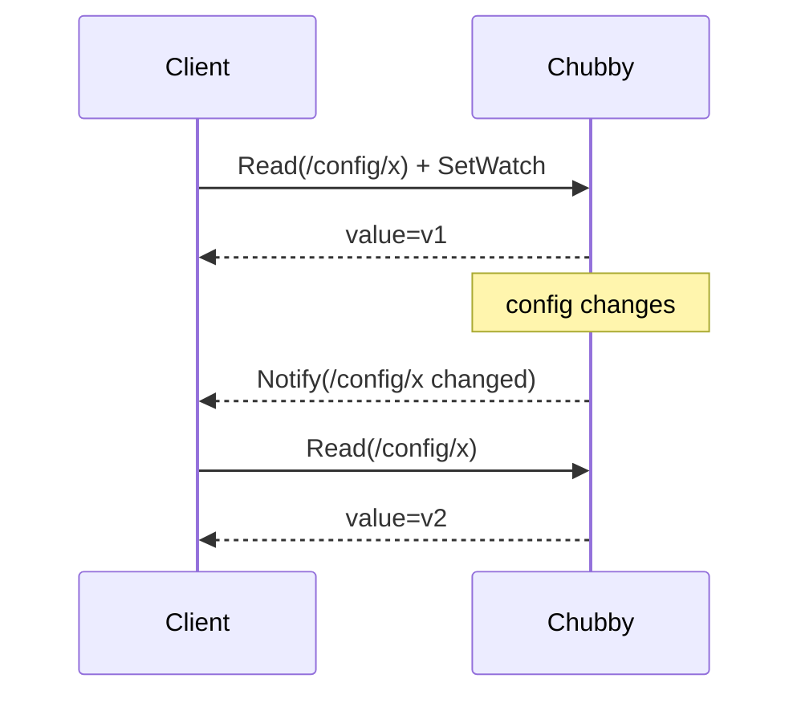
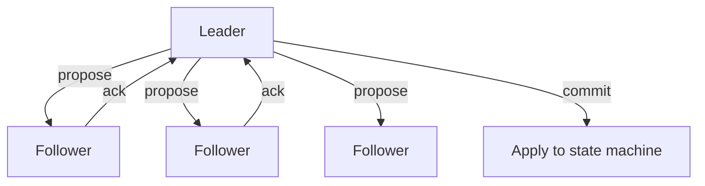

> 论文：The Chubby Lock Service for Loosely-Coupled Distributed Systems（Burrows, OSDI 2006）

Chubby 是 Google 内部的 **强一致协调服务**：提供分布式锁（lock）与小规模元数据存储（类似一个小型、强一致的文件系统 + watch）。它的定位非常明确：

- 承载 **少量、强一致** 的协调状态（选主、配置、服务发现、分布式互斥等）
- 不承担大规模 KV / 元数据的全部（避免把大数据一致性化）

这篇论文最值钱的不是“它用 Paxos”，而是把一个协调服务必须回答的工程问题讲清楚：

- session/lease 的语义与失效边界
- client cache 与一致性（watch）怎么做
- 失败检测与误判怎么处理

## 1. Chubby 解决什么：把“强一致的小状态”抽出来

在大规模系统里，大多数数据不需要强一致，但**协调状态**往往需要：

- 主从选主（谁是 leader）
- 配置发布（谁拿到最新配置）
- 成员管理（当前集群成员是谁）
- 分布式互斥（避免两个 writer 同时干活）



**设计原则**：把强一致的范围控制在“小状态”上，让系统整体可扩展。

## 2. 对外抽象：锁 + 小型文件系统 + watch

Chubby 暴露给客户端的是一个类似文件系统的命名空间（directories/files），以及对这些 node 的：

- **锁**（shared/exclusive）
- **读写小文件**（几 KB 量级）
- **watch/notification**（变化通知）

### 2.1 为什么用“文件系统抽象”

工程动机：

- 很多协调状态天然是“命名的”：`/service/foo/leader`、`/config/bar`
- 文件/目录层级让权限管理与组织更自然
- “读写小文件 + watch”可以覆盖大量场景（比仅锁更通用）

```mermaid
flowchart TD
  FS[namespace] --> D1[/]
  D1 --> D2[/ls]
  D1 --> D3[/config]
  D1 --> D4[/service]

  D4 --> S1[/service/foo]
  S1 --> L[/service/foo/leader]
  S1 --> M[/service/foo/members]
```

### 2.2 常见用法：选主（leader election）

典型模式：

- 所有候选者尝试获取同一把 **exclusive lock**
- 获取成功者成为 leader
- 其他候选者 watch 锁或 leader 文件，等待变化



## 3. 最核心的语义：session + lease

### 3.1 session 是什么

Chubby client 与 service 建立一个 **session**，session 是 Chubby 语义边界的关键：

- 锁的持有与文件句柄有效性绑定到 session
- 当 session 失效，系统会释放该 session 持有的锁

### 3.2 lease 是什么

Chubby 的 session 使用 **lease** 机制：

- server 给 client 一个有效期 `T` 的 lease
- client 需要在 lease 到期前续约
- 如果续约失败并超时，server 认为 client 已失效，释放其锁



### 3.3 误判（false positive）与安全边界

工程现实：网络抖动会导致 client 短暂无法续约。

Chubby 的策略是：

- 在 lease 失效后，server 才释放锁 → **安全性优先**
- client 一旦发现 lease 续约失败/不确定，必须进入 **panic / stop serving** 状态，避免“以为自己还是 leader”

这就是协调服务最重要的一条：

> 不能让应用在“不确定是否还持锁”的情况下继续执行。

## 4. 一致性：cache + watch 怎么做到“好用”

Chubby 为了性能允许 client 缓存：

- 文件内容（小文件）
- 目录列表
- lock 状态

为了让缓存仍然“看起来一致”，Chubby 提供 **watch/notification**：

- client 可以对某个 node 设置 watch
- server 在状态变化时通知 client
- client 收到通知后刷新缓存

### 4.1 watch 的工程语义

关键点：watch 通知不是“可靠消息队列”，而是**提示（hint）**：

- 通知可能合并、丢失、重复
- client 收到通知后必须 **重新读** 以获得真实状态



### 4.2 为什么这是正确取舍

- 把“强一致”留给 **读操作本身**
- 把“通知”做成轻量提示，提高可用性与性能
- 避免把 watch 变成复杂的可靠投递系统

## 5. 内部实现：复制与选主（Paxos）

Chubby 的 server 侧通常是一个小集群（例如 5 个节点），对外表现为一个强一致服务。

论文里 Chubby 使用 **Paxos**（或其工程变体）来实现复制一致性：

- 每次状态变更写入 replicated log
- 多数派提交后生效
- 读可以在 leader 上进行，保证线性一致（取决于读路径策略）



Chubby 把自己实现成一个“复制状态机”：

- 日志是唯一真相（durable + replicated）
- 状态机是日志回放的结果

## 6. 故障模型与恢复

### 6.1 server 故障

- 少数副本故障：多数派仍可服务
- leader 故障：触发新 leader 选举（Paxos 内部完成）

### 6.2 client 故障

- client crash：session lease 续约停止 → server 释放锁
- client 网络隔离：同样通过 lease 过期回收锁

### 6.3 典型坑：GC/权限/命名

Chubby 的 namespace 需要：

- ACL（访问控制）
- 资源清理（不再使用的 lock/file）

工程上最好为每个服务规划好路径，并建立自动化清理策略。

## 7. Chubby vs ZooKeeper/etcd：应当怎么对标

- **语义相近**：都是“强一致小状态 + watch”
- **核心难点相同**：session/lease、watch 语义、误判处理

区别更多来自 API 抽象与工程实现细节（例如 ZK 的 znode + ephemeral、etcd 的 lease + revision）。

## 8. 读完后的 takeaways

- Chubby 最关键的贡献是把“协调服务必须解决的工程语义”讲清楚：**session/lease + cache/watch + failure handling**。
- watch 是 hint：通知不可靠，但读是强一致的；这让系统能“快且稳”。
- 协调服务不是数据面存储；把强一致范围控制在小状态，是可扩展系统的关键分层。

## 9. 更细的 session/lease 行为：需要“应用自我约束”

Chubby 的安全性有一半来自协议，另一半来自**应用在不确定时必须停下来**。

### 9.1 lease 丢失时应用必须做什么

当 client 发现：

- 续约失败
- 或者自己无法确认 lease 是否仍有效

正确行为不是“继续工作”，而是：

- 进入 fail-stop（停止对外提供 leader 行为）
- 重新建立 session
- 重新竞争锁

这就是避免“脑裂写”的关键。

### 9.2 典型反例：把 lease 当成心跳

很多系统会把 lease 续约当作心跳。但 lease 语义比心跳更强：

- 失去 lease，意味着失去对某些资源的“排他权”

所以一旦 lease 不确定，就必须停止对外宣称“我还是 leader”。

## 10. watch 的语义边界：notification 不是事实

### 10.1 为什么 watch 必须是 hint

如果 watch 要做到“可靠投递 + 不丢不重”，系统会复杂很多：

- 需要 per-client 的可靠队列
- 需要持久化与重放
- 需要复杂的 backpressure

Chubby 的选择是：

- 通知可能丢/合并/重复
- 但读取是强一致的

因此 watch 的正确用法是：

- **收到通知 → 重新读**

### 10.2 典型陷阱：只靠通知更新本地状态

如果把通知当成事实，而不 re-read：

- 可能错过一次更新
- 可能处理重复通知
- 可能产生错误的缓存状态

## 11. 真实工程模式：如何用 Chubby 做选主

这里给一个更工程化的 checklist：

- **锁路径**：`/service/foo/lock`
- **leader 信息路径**：`/service/foo/leader`（写入 leader 的 address/epoch）
- **成员信息路径**：`/service/foo/members`（可选）

leader 的职责：

- 持有 exclusive lock
- 定期写入 leader 文件（含 epoch/版本，便于其他组件判断“是不是新 leader”）

follower 的职责：

- watch lock 或 leader 文件
- 收到通知后 re-read 并尝试竞选

## 12. 与 ZooKeeper/etcd 的对照（用来校准直觉）

- **ephemeral node / lease**：都是把“生存期”绑定到 session
- **watch**：都是 hint + 重新读取
- **一致性协议**：底层都是多数派复制（Paxos/Raft 等）

差别更多是：

- API 抽象
- 性能工程细节
- 对边界条件的处理方式

## 13. 读完后的补充 takeaways

- Chubby 的工程教训是：协调服务的 API 不难，难在语义边界（lease、watch、误判）。
- 任何依赖 Chubby 做选主的系统，都必须实现“失去 lease 立刻自我隔离”的逻辑。
- watch = hint：永远用强一致读来校准本地状态。
