> 论文：Dynamo: Amazon's Highly Available Key-value Store（DeCandia et al., SOSP 2007）

Dynamo 是 Amazon 开发的高可用键值存储系统，为 Amazon 的电商平台提供存储服务。Dynamo 的设计哲学是优先保证可用性，在 CAP 定理中明确选择可用性（A）和分区容忍性（P），而牺牲强一致性（C）。本文深入解析 Dynamo 的架构设计、核心机制和工程实践。

## 1. Dynamo 的设计目标与挑战

### 1.1 业务需求：高可用优先

Dynamo 面向 Amazon 的电商业务场景，核心需求是：

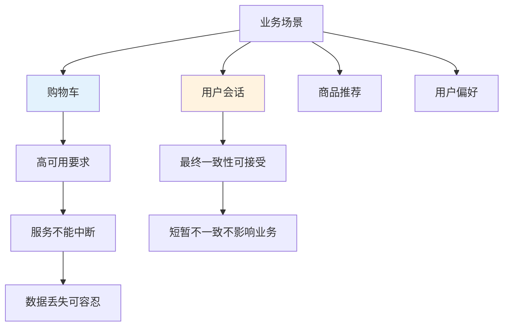

**业务特点**：

- **高可用要求**：电商平台需要 7x24 小时服务，任何中断都会造成巨大损失
- **数据丢失可容忍**：购物车数据丢失可以重建，用户会话可以重新登录
- **最终一致性可接受**：短暂的数据不一致不会影响用户体验
- **读多写少**：大部分操作是读取，写入相对较少

### 1.2 CAP 定理的选择

Dynamo 在 CAP 定理中明确选择了可用性（A）和分区容忍性（P）：

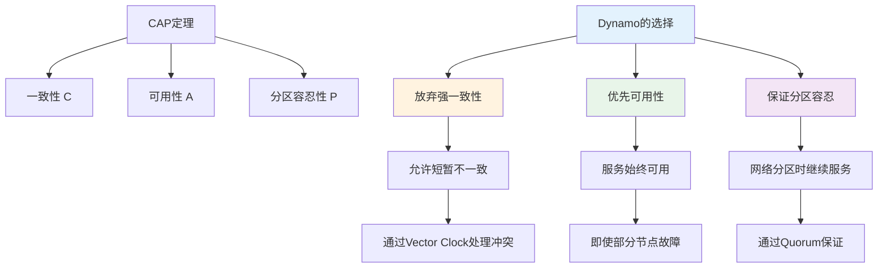

**设计权衡**：

- **放弃强一致性**：不保证所有副本立即一致，允许短暂的不一致
- **优先可用性**：即使部分节点故障，系统仍然可以提供服务
- **保证分区容忍**：网络分区时，系统可以继续服务，不阻塞

### 1.3 系统设计目标

Dynamo 的设计目标包括：

1. **高可用性**：系统必须始终可用，即使部分节点故障
2. **可扩展性**：支持水平扩展，可以动态添加或删除节点
3. **最终一致性**：不保证强一致性，但保证最终一致性
4. **简单性**：系统设计简单，易于理解和维护

## 2. 核心机制：一致性哈希

### 2.1 一致性哈希的原理

一致性哈希是 Dynamo 实现分片和负载均衡的核心机制：

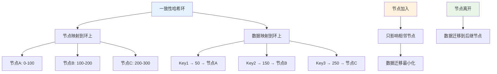

**一致性哈希的优势**：

- **负载均衡**：数据均匀分布在环上，负载相对均衡
- **扩展性**：节点加入或离开时，只影响相邻节点，数据迁移量小
- **容错性**：节点故障时，数据自动迁移到后继节点

### 2.2 虚拟节点（Virtual Nodes）

为了进一步提高负载均衡，Dynamo 使用虚拟节点：

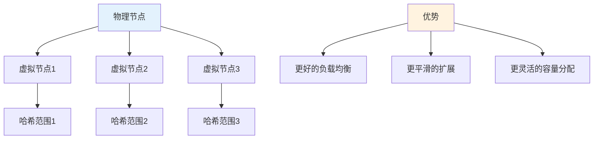

**虚拟节点的作用**：

- **提高负载均衡**：一个物理节点对应多个虚拟节点，数据分布更均匀
- **平滑扩展**：节点加入或离开时，影响更分散，迁移更平滑
- **灵活容量分配**：可以根据节点容量分配不同数量的虚拟节点

### 2.3 数据定位流程

Dynamo 的数据定位流程：

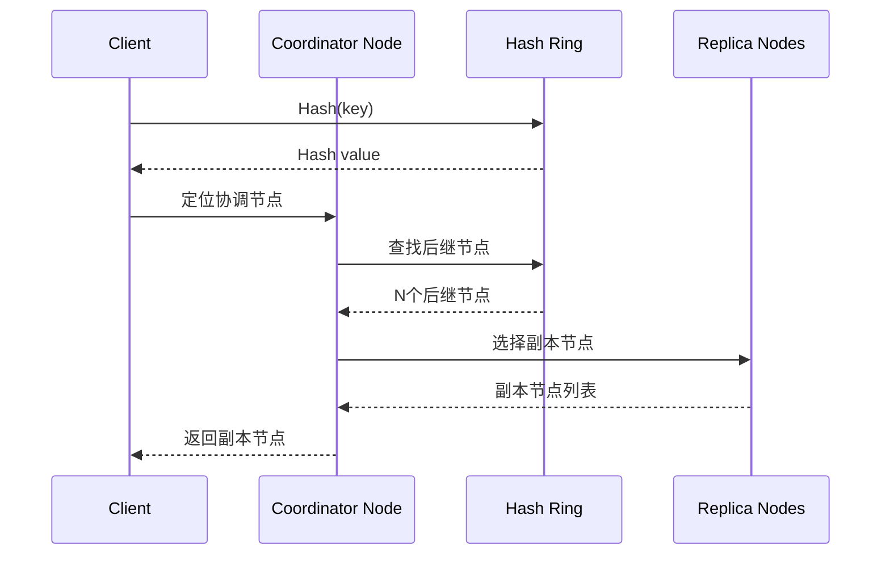

**定位步骤**：

1. **计算哈希值**：对 Key 进行哈希，得到哈希值
2. **定位协调节点**：在哈希环上找到第一个大于等于哈希值的节点
3. **选择副本节点**：从协调节点开始，选择 N 个后继节点作为副本
4. **返回节点列表**：返回协调节点和副本节点列表

## 3. 副本策略与 Quorum 机制

### 3.1 多副本策略

Dynamo 使用多副本策略提高容错性：

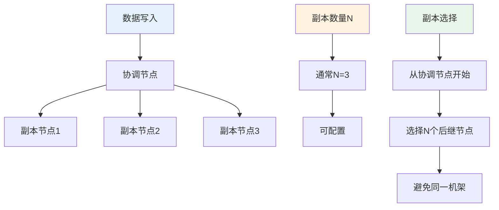

**副本策略**：

- **副本数量**：通常 N=3，可以配置
- **副本选择**：从协调节点开始，选择 N 个后继节点
- **机架感知**：尽量将副本分布在不同机架，提高容错性

### 3.2 Quorum 读写机制

Dynamo 使用 Quorum 机制平衡一致性和可用性：

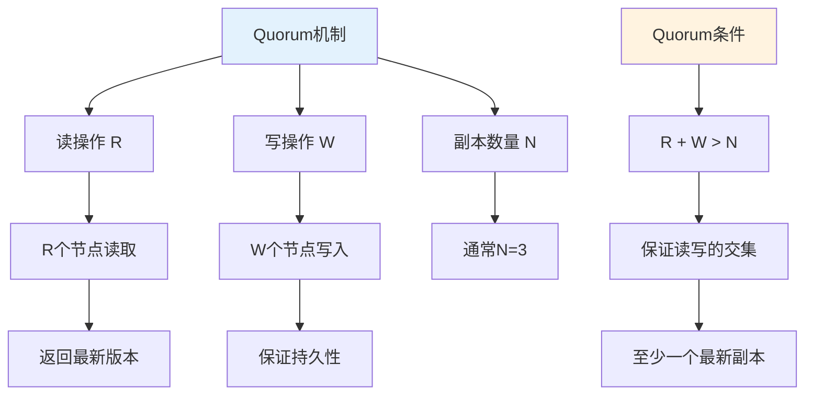

**Quorum 规则**：

- **R + W > N**：保证读写操作的节点有交集，至少有一个节点同时参与读写
- **R = W = (N+1)/2**：典型的配置，平衡读写性能
- **R = 1, W = N**：写强一致，读弱一致（快速读取）
- **R = N, W = 1**：读强一致，写弱一致（快速写入）

**Quorum 的优势**：

- **保证一致性**：读写节点有交集，保证能读到最新写入
- **提高可用性**：不需要所有节点都可用，只要满足 Quorum 即可
- **灵活配置**：可以根据业务需求调整 R 和 W

### 3.3 读写流程

Dynamo 的读写流程：

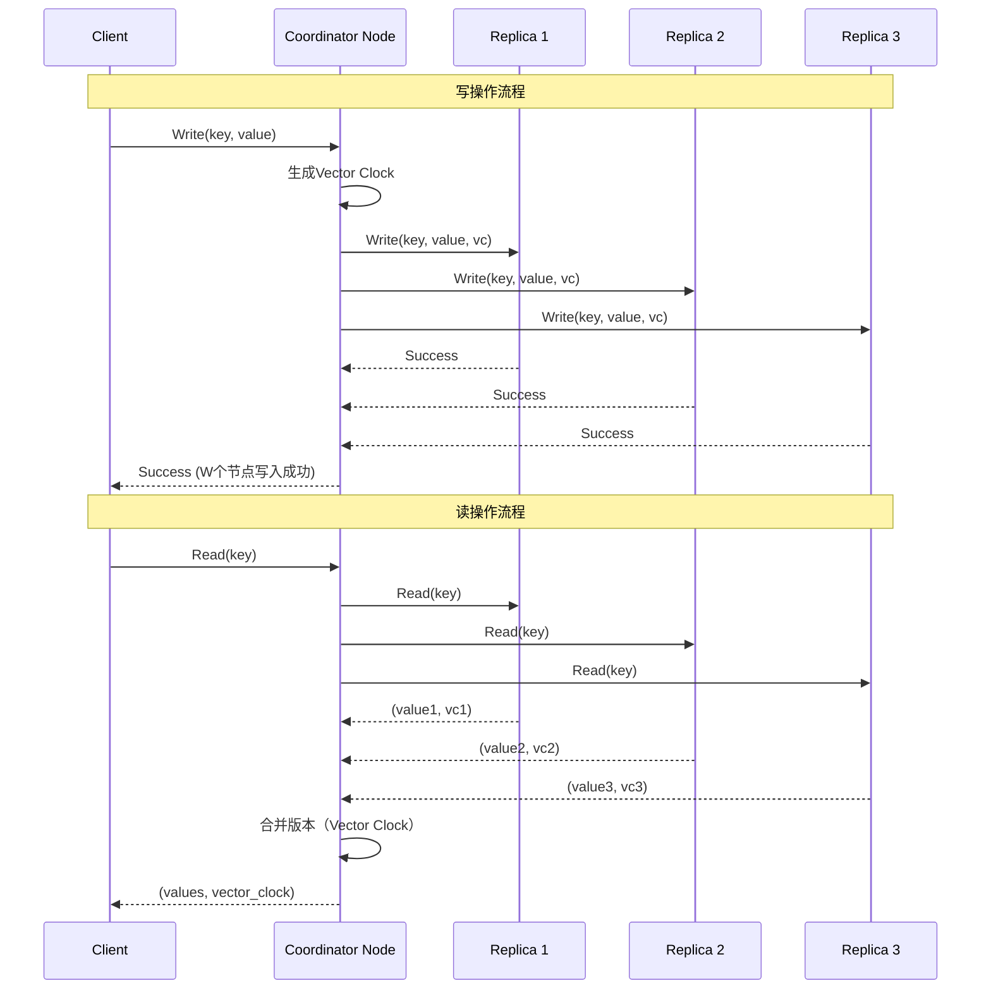

**写操作流程**：

1. **客户端请求**：客户端向协调节点发送写请求
2. **生成版本**：协调节点生成新的 Vector Clock
3. **并行写入**：协调节点并行写入 W 个副本节点
4. **等待确认**：等待 W 个节点写入成功
5. **返回成功**：向客户端返回成功

**读操作流程**：

1. **客户端请求**：客户端向协调节点发送读请求
2. **并行读取**：协调节点并行从 R 个副本节点读取
3. **收集版本**：收集所有返回的值和 Vector Clock
4. **合并版本**：使用 Vector Clock 合并版本，处理冲突
5. **返回结果**：返回合并后的值（可能包含多个版本）

## 4. Vector Clock：版本冲突处理

### 4.1 Vector Clock 的原理

Vector Clock 是 Dynamo 处理并发写入冲突的核心机制：

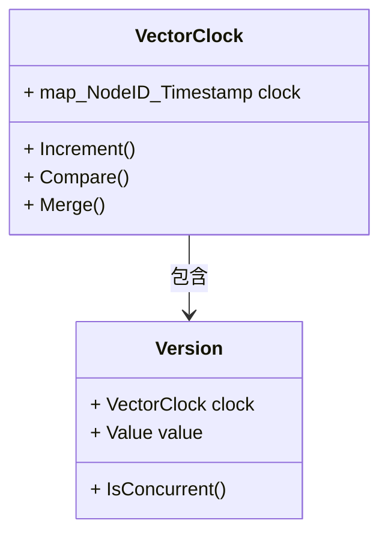

**Vector Clock 的结构**：

- **节点ID → 时间戳**：每个节点维护一个时间戳，记录该节点最后更新的时间
- **版本比较**：通过比较 Vector Clock 判断版本的先后关系
- **冲突检测**：如果两个版本的 Vector Clock 无法比较，说明存在并发冲突

### 4.2 Vector Clock 的比较规则

Vector Clock 的比较规则：

```mermaid
graph TD
    A[Vector Clock比较] --> B[VC1 < VC2]
    A --> C[VC1 > VC2]
    A --> D[VC1 || VC2 并发]
    
    B --> B1[VC1的所有时间戳 <= VC2]
    B1 --> B2[且至少一个 <]
    B2 --> B3[VC2是VC1的后继]
    
    C --> C1[VC1的所有时间戳 >= VC2]
    C1 --> C2[且至少一个 >]
    C2 --> C3[VC1是VC2的后继]
    
    D --> D1[既不是 < 也不是 >]
    D1 --> D2[存在并发写入]
    D2 --> D3[需要应用层合并]
    
    style A fill:#e3f2fd
    style D fill:#fff3e0
```

**比较示例**：

- **VC1 = {A:1, B:2}，VC2 = {A:1, B:3}**：VC1 < VC2（B 的时间戳更大）
- **VC1 = {A:2, B:1}，VC2 = {A:1, B:2}**：VC1 || VC2（并发，无法比较）
- **VC1 = {A:1, B:1}，VC2 = {A:1, B:1, C:1}**：VC1 < VC2（VC2 包含更多节点）

### 4.3 版本合并与冲突解决

Dynamo 使用 Vector Clock 进行版本合并：

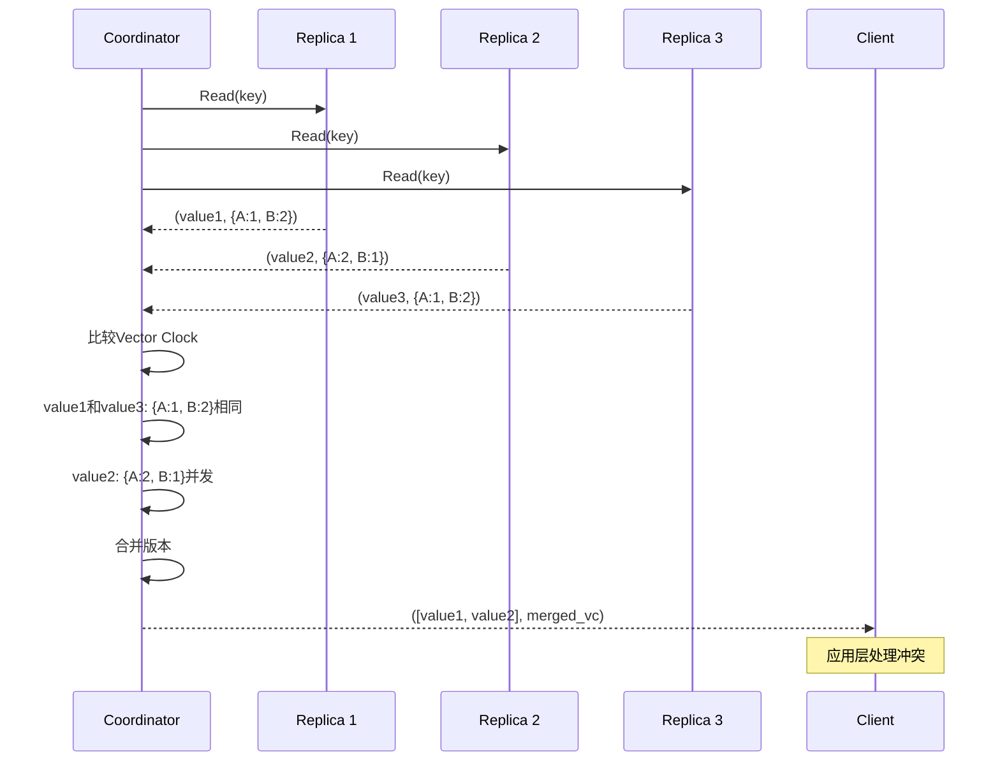

**版本合并策略**：

1. **确定最新版本**：比较所有 Vector Clock，找出最新的版本
2. **检测并发冲突**：如果存在无法比较的版本，说明存在并发冲突
3. **保留所有版本**：保留所有并发版本，返回给客户端
4. **应用层合并**：由应用层根据业务逻辑合并冲突版本

**冲突解决**：

- **系统层**：Dynamo 只负责检测和保留冲突版本，不自动解决冲突
- **应用层**：应用层根据业务逻辑决定如何合并冲突（如购物车合并、最后写入获胜等）

## 5. 故障处理机制

### 5.1 Hinted Handoff

Hinted Handoff 是 Dynamo 处理临时故障的机制：

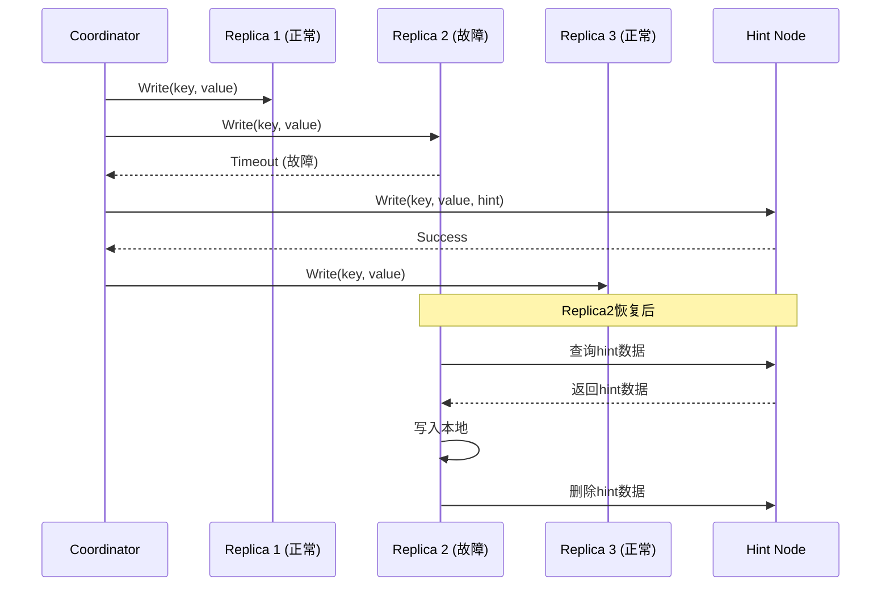

**Hinted Handoff 的流程**：

1. **检测故障**：协调节点检测到某个副本节点故障
2. **选择 Hint 节点**：选择另一个节点作为 Hint 节点，临时存储数据
3. **写入 Hint**：将数据写入 Hint 节点，标记为 Hint 数据
4. **节点恢复**：故障节点恢复后，从 Hint 节点获取数据
5. **数据同步**：将 Hint 数据写入本地，删除 Hint 节点上的数据

**Hinted Handoff 的优势**：

- **提高可用性**：即使部分节点故障，写入仍然可以成功
- **自动恢复**：节点恢复后自动同步数据，无需人工干预
- **保证持久性**：数据不会因为节点故障而丢失

### 5.2 Read Repair

Read Repair 是 Dynamo 在读取时修复副本不一致的机制：

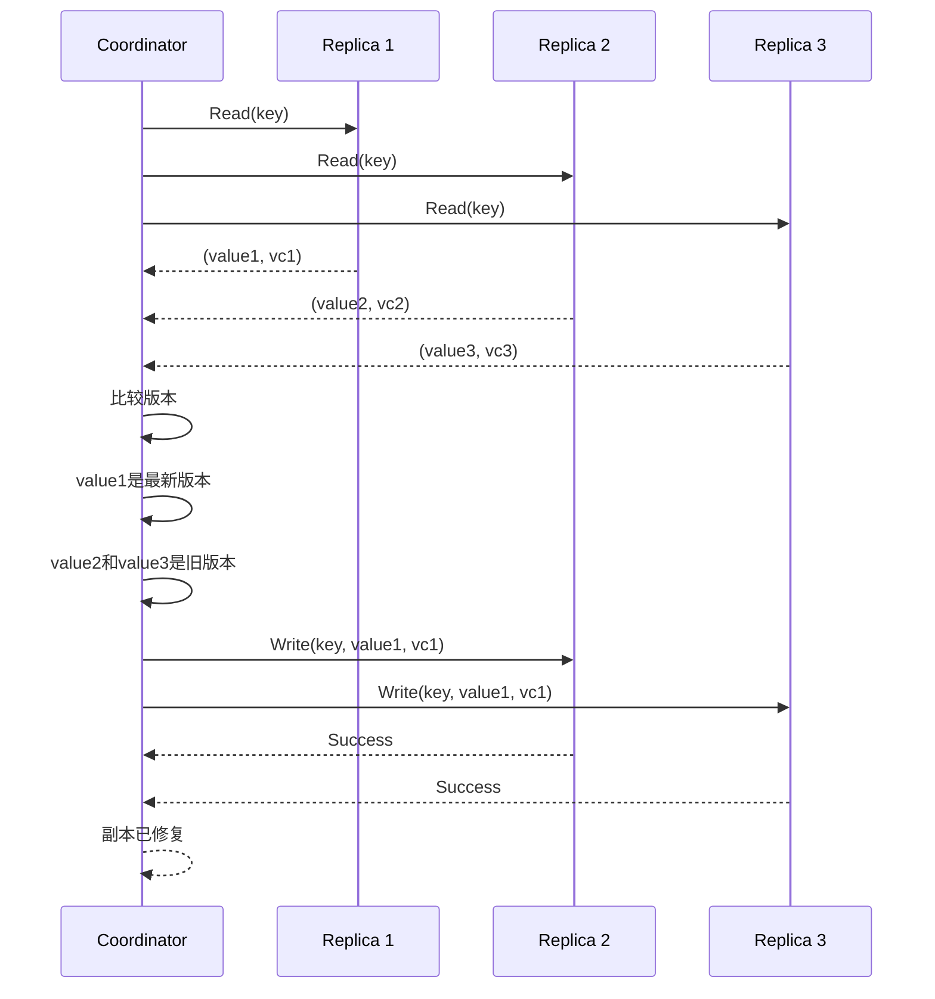

**Read Repair 的流程**：

1. **并行读取**：从多个副本节点并行读取
2. **比较版本**：比较所有返回的版本，找出最新版本
3. **检测不一致**：如果发现某些副本的版本较旧，触发修复
4. **异步修复**：异步将最新版本写入旧版本副本
5. **保证一致性**：通过 Read Repair 逐步修复副本不一致

**Read Repair 的优势**：

- **自动修复**：在读取时自动检测和修复不一致
- **无需额外开销**：利用正常的读取操作进行修复
- **逐步收敛**：通过多次读取逐步修复所有副本

### 5.3 故障检测与恢复

Dynamo 的故障检测机制：

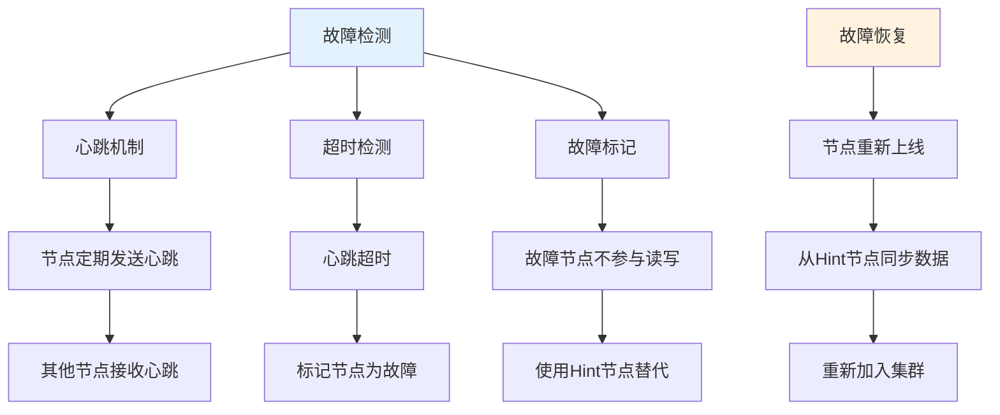

**故障检测**：

- **心跳机制**：节点定期发送心跳，其他节点接收心跳
- **超时检测**：如果心跳超时，标记节点为故障
- **故障标记**：故障节点不参与读写操作

**故障恢复**：

- **节点上线**：故障节点重新上线
- **数据同步**：从 Hint 节点同步数据
- **重新加入**：节点重新加入集群，恢复正常服务

## 6. 成员管理与 Gossip 协议

### 6.1 成员管理

Dynamo 使用去中心化的成员管理：

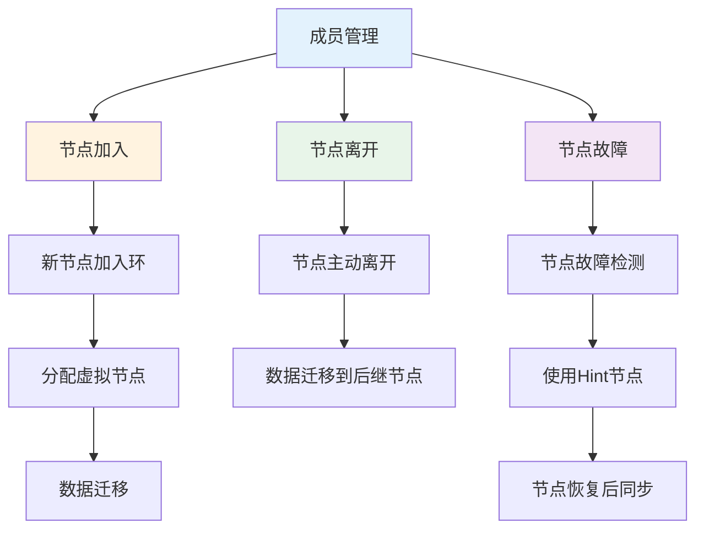

**成员管理的特点**：

- **去中心化**：没有中心化的成员管理服务
- **Gossip 协议**：使用 Gossip 协议传播成员信息
- **最终一致性**：成员信息最终一致，但可能短暂不一致

### 6.2 Gossip 协议

Gossip 协议用于传播成员信息和故障检测：

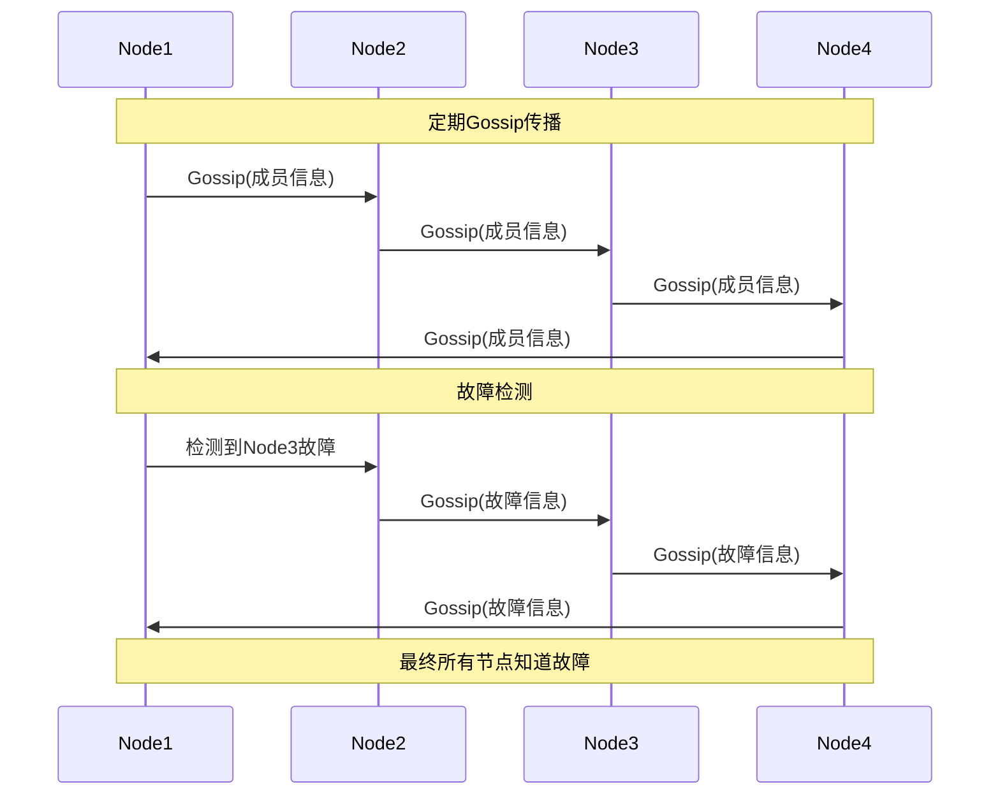

**Gossip 协议的特点**：

- **随机传播**：节点随机选择其他节点传播信息
- **指数传播**：信息以指数速度传播到所有节点
- **容错性**：即使部分节点故障，信息仍能传播
- **最终一致性**：所有节点最终会收到相同的信息

## 7. 性能优化

### 7.1 负载均衡

Dynamo 的负载均衡策略：

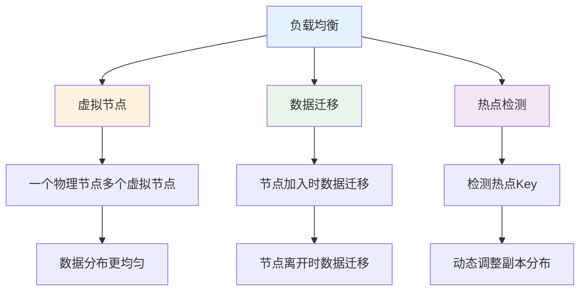

**负载均衡技术**：

- **虚拟节点**：使用虚拟节点提高负载均衡
- **数据迁移**：节点加入或离开时平滑迁移数据
- **热点检测**：检测热点 Key，动态调整副本分布

### 7.2 缓存策略

Dynamo 使用多级缓存提高性能：

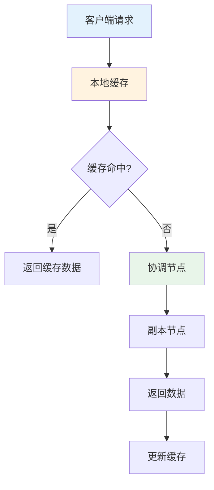

**缓存策略**：

- **客户端缓存**：客户端缓存热点数据，减少网络请求
- **协调节点缓存**：协调节点缓存元数据，减少查找开销
- **缓存失效**：使用 TTL 或版本号控制缓存失效

## 8. Dynamo 的影响与后续发展

### 8.1 对后续系统的影响

Dynamo 的设计思想影响了大量后续系统：

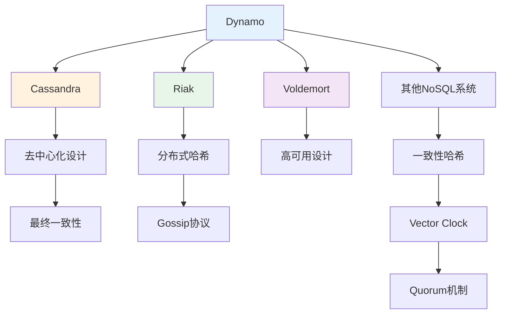

**影响范围**：

- **NoSQL 数据库**：Cassandra、Riak 等系统都受到 Dynamo 的影响
- **设计模式**：一致性哈希、Vector Clock、Quorum 等成为分布式系统的标准模式
- **工程实践**：高可用、最终一致性等设计思想被广泛采用

### 8.2 设计原则总结

Dynamo 的成功体现了几个重要的设计原则：

1. **业务驱动设计**
   - 根据业务需求选择 CAP 权衡
   - 电商业务优先可用性，牺牲强一致性

2. **去中心化架构**
   - 没有单点故障
   - 使用 Gossip 协议实现去中心化

3. **最终一致性**
   - 不追求强一致性，保证最终一致性
   - 通过 Vector Clock 处理冲突

4. **工程化实现**
   - 使用成熟的技术（一致性哈希、Quorum 等）
   - 简单可靠，易于理解和维护

## 9. 总结

Dynamo 是分布式存储系统的经典设计，其核心思想包括：

- **高可用优先**：在 CAP 定理中明确选择可用性和分区容忍性
- **一致性哈希**：实现分片和负载均衡，支持平滑扩展
- **Quorum 机制**：平衡一致性和可用性，灵活配置读写策略
- **Vector Clock**：处理并发写入冲突，保留多个版本由应用层合并
- **故障处理**：Hinted Handoff 和 Read Repair 保证高可用和最终一致性
- **去中心化**：使用 Gossip 协议实现去中心化的成员管理

Dynamo 的设计思想影响了大量后续系统，成为分布式存储系统的经典参考。理解 Dynamo 的设计原理，有助于理解现代分布式存储系统的设计思路和工程实践。