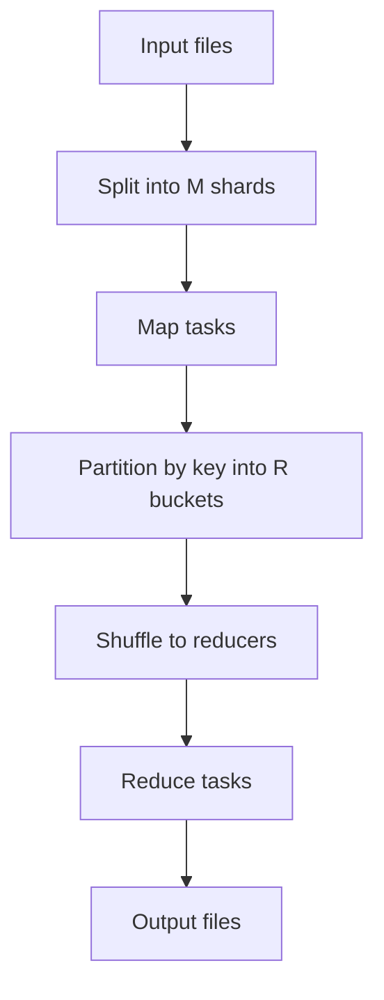
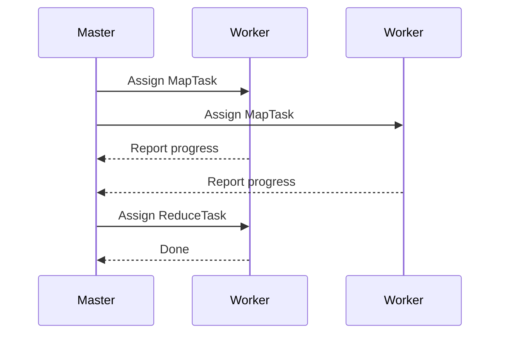
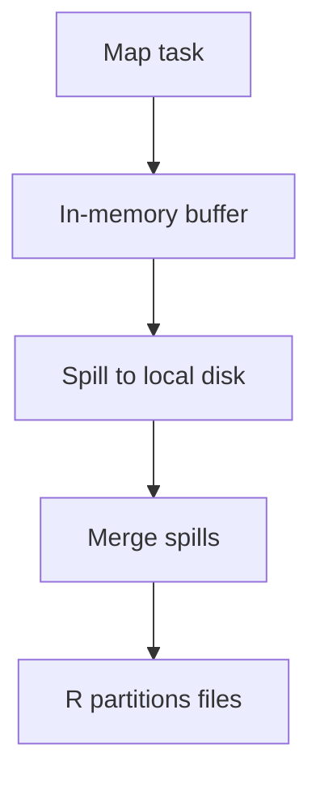
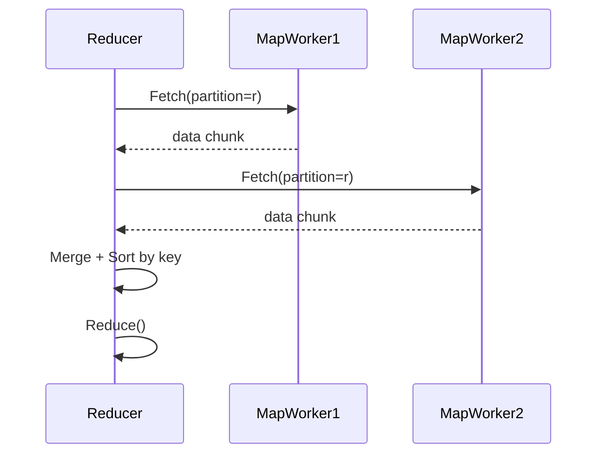
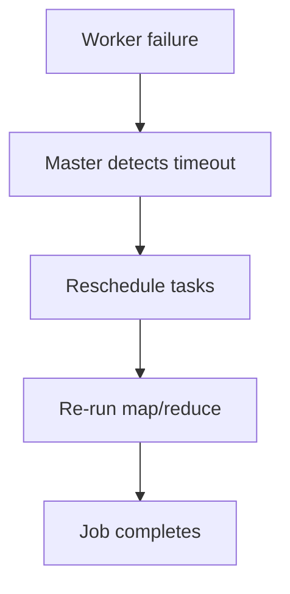
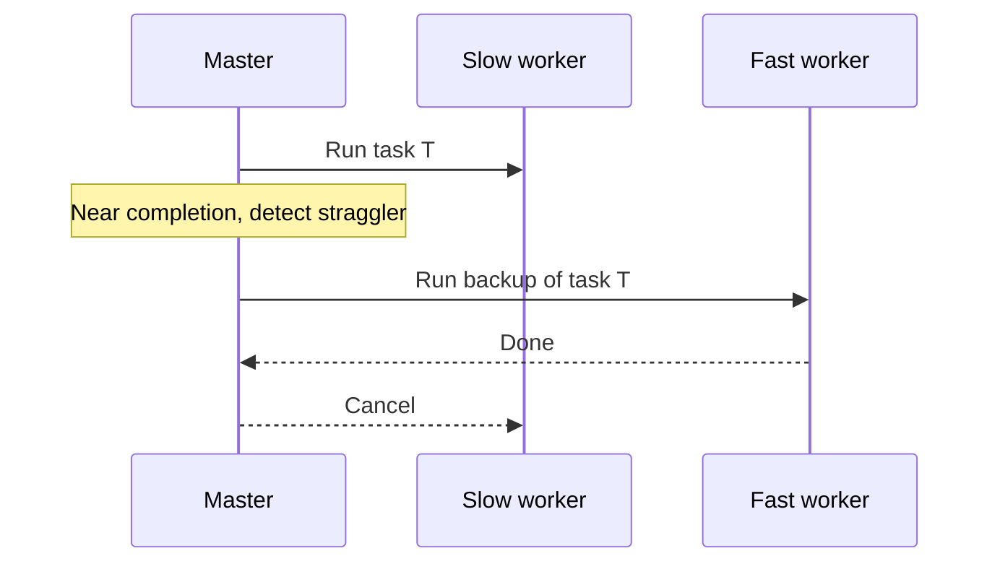
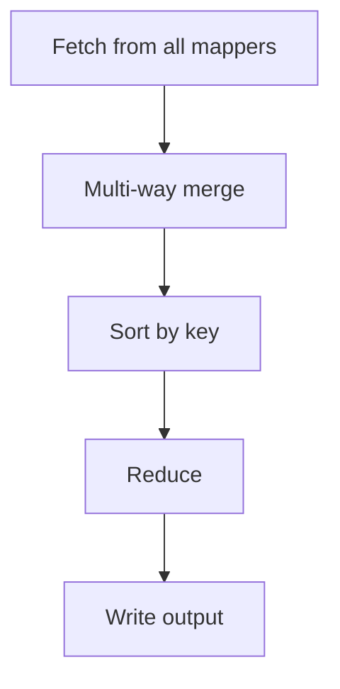
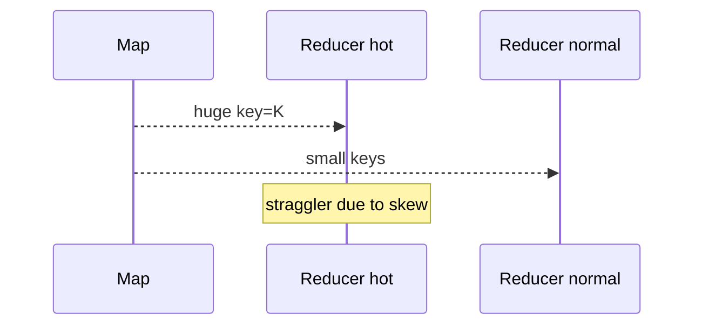

> 论文：MapReduce: Simplified Data Processing on Large Clusters（Dean & Ghemawat, OSDI 2004）

MapReduce 把“在大集群上做大规模数据处理”的复杂度分离成两部分：

- 业务只写两个函数：`map` 与 `reduce`
- 系统负责：分片、调度、shuffle、排序、容错、重试、数据本地性

这篇论文经典的原因不是 API，而是它给了一整套**工程闭环**：

- 如何把 job 拆成 task
- 如何把中间结果从 map 侧高效送到 reduce 侧
- 如何在“机器会挂”的前提下继续跑完

## 1. 模型：Map / Reduce

### 1.1 计算抽象

- `map(k1, v1) -> list(k2, v2)`
- `reduce(k2, list(v2)) -> list(v3)`



### 1.2 为什么这个抽象足够强

很多离线计算可以重写为：

- 先做局部映射（map）
- 再按 key 聚合（reduce）

例如：倒排索引、日志统计、WordCount、Join 的某些变体。

## 2. 系统架构：Master / Worker

MapReduce 系统一般是一个 master + 大量 worker：

- **master**：负责调度、任务状态、容错决策
- **worker**：执行 map/reduce task



## 3. 数据路径的关键：Shuffle

Shuffle 是 MapReduce 的核心代价：网络 + 排序 + 磁盘 IO。

### 3.1 Map 端产生中间结果

map task 会把输出按 `partition(key) -> [0..R-1]` 分桶，并写到本地磁盘。



### 3.2 Reduce 端拉取中间结果

reduce task 会从所有 map worker 拉取属于自己 partition 的数据。



### 3.3 为什么要在 reduce 端排序

排序让 reduce 端能：

- 一次扫描处理同一个 key 的所有 value
- 降低内存压力（流式聚合）

## 4. 容错：失败是常态，重试是策略

### 4.1 task 级重试

MapReduce 的容错依赖一个关键假设：task 是**确定性的/可重算的**（或至少可接受重复）。

- worker crash → master 把该 worker 上的未完成 task 重新调度
- map 输出在 worker 本地盘上 → worker 挂了输出就丢了，需要重跑 map



### 4.2 reduce 的重试与输出一致性

reduce 输出写到 GFS（或类似分布式文件系统），通常是：

- 写到临时文件
- 完成后原子 rename 到最终名字

这样 reduce task 重试不会产生“半写”文件污染。

## 5. 性能关键：数据本地性与 straggler

### 5.1 数据本地性（locality）

如果输入数据在 GFS 上，master 倾向把 map task 调度到：

- 有该 chunk 副本的 worker（node-local / rack-local）

这样把网络流量降到最低。

### 5.2 straggler（拖尾任务）

集群里常见现象：

- 少数 task 比其他 task 慢很多（机器慢、磁盘抖、网络差）
- 最后几个 task 决定 job 完成时间

MapReduce 用 **backup tasks** 缓解：

- 当 job 接近尾声，对剩余慢 task 启动备份副本
- 谁先完成就用谁，另一个取消



## 6. 工程可调点：partitioner / combiner

### 6.1 partitioner

- `partition(key) -> reduce_id`
- 影响：负载均衡（避免某个 reduce 变热点）

### 6.2 combiner

combiner 在 map 端先做一次局部聚合，减少 shuffle 流量。

例如 WordCount：

- map 输出 (word, 1)
- combiner 在本地先合并成 (word, count)

## 7. MapReduce 的局限与演进

### 7.1 局限

- 只适合批处理
- 每个 stage 之间落盘成本高
- 迭代计算效率低

### 7.2 演进方向

- Spark：以内存为中心，减少落盘
- Flink：更流式、更低延迟

但 MapReduce 的调度、shuffle、容错思想仍然是基础。

## 8. 读完后的 takeaways

- MapReduce 的价值是“**工程闭环**”：调度 + shuffle + 容错 + 本地性。
- 抽象简单，但系统把复杂度吃掉了；这也是它能规模化推广的原因。
- 真正决定性能的往往是：shuffle、straggler、数据倾斜。

## 9. 更细的 Shuffle：为什么它决定了 MapReduce 的上限

很多 job 的瓶颈不是 map 或 reduce 逻辑本身，而是 shuffle：

- 网络（跨机器传输）
- 排序/归并（CPU）
- 落盘与读取（磁盘 IO）

### 9.1 Map 端：buffer → spill → merge

一个更贴近实现的管线：

```mermaid
flowchart TD
  M[Map output] --> B[In-mem buffer]
  B -->|threshold| S1[Spill #1]
  B -->|threshold| S2[Spill #2]
  S1 --> MG[Merge spills]
  S2 --> MG
  MG --> P[Partition files (R buckets)]
```

- buffer 满了就 spill 成有序段
- 多次 spill 需要 merge，减少文件数
- 最终按 partition 生成 reducer 可拉取的文件

### 9.2 Reduce 端：fetch → merge → sort → reduce



实际系统通常会：

- 边拉取边 merge（pipeline）
- 采用外部排序（外排）处理大于内存的数据

## 10. 数据倾斜（skew）：MapReduce 的常见“灾难源”

### 10.1 skew 的表现

- 某个 key 占据了大量数据
- 某个 reduce partition 变成热点
- job 尾部被一个 reducer 拖死

### 10.2 常见缓解方法

- **更好的 partitioner**：避免简单 hash 导致极端热点落到同一 reducer
- **salting / key splitting**：把热 key 拆成多份（例如 `key#i`），reduce 端再合并
- **两阶段聚合**：先局部聚合再全局聚合



## 11. 容错边界：exactly-once 不是系统默认提供的

MapReduce 的容错核心是假设：

- task 可以重跑
- 输出写到临时文件并原子 rename

这通常保证：

- **文件级别**不会出现“半写污染”

但对业务逻辑来说，是否 exactly-once 取决于：

- map/reduce 是否幂等
- 下游消费是否能去重

**工程经验**：在 MapReduce 生态里，幂等/去重往往是应用必须承担的一部分。

## 12. 实战 checklist：如何判断 MapReduce job 慢在哪里

1. **map 慢**：输入读取/解析成本高？数据本地性差？
2. **shuffle 慢**：网络带宽不足？spill 太多？排序太重？
3. **reduce 慢**：数据倾斜？单 key 过大？
4. **尾部慢**：straggler？backup tasks 配置？

每项都能对应到具体优化：

- 提高 combiner 的有效性
- 调 partitioner
- 控 spill/merge 参数
- 解决 skew

## 13. 读完后的补充 takeaways

- MapReduce 的“工程价值”集中体现在 shuffle 与容错设计。
- 数据倾斜是最常见的性能杀手，必须通过 partition/两阶段聚合等手段主动处理。
- exactly-once 往往需要应用配合（幂等/去重），系统只保证“可重试且输出不污染”。
