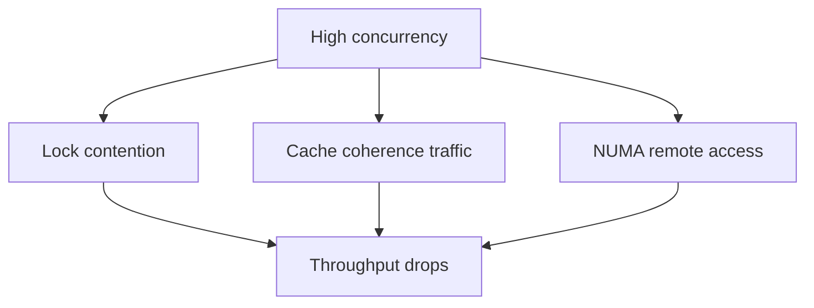
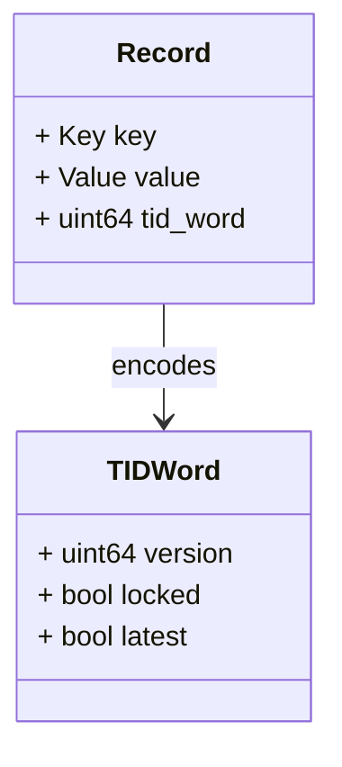
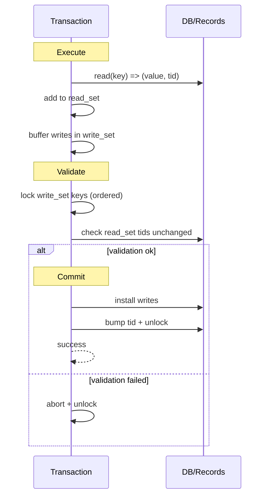
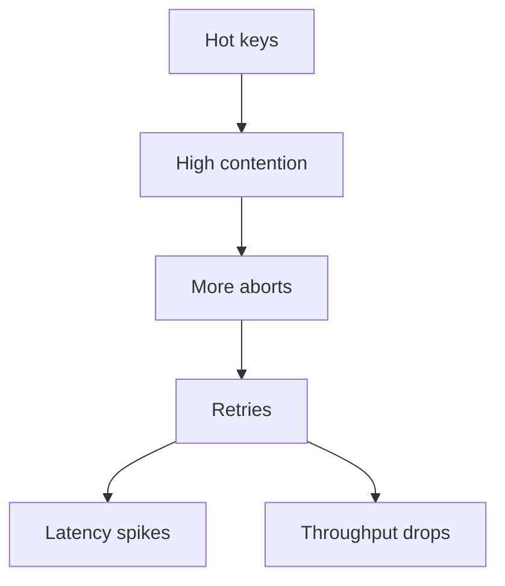

> 论文：Silo: Exploiting Message Passing and Shared Memory for OLTP（Tu et al., SOSP 2013）

Silo 常被用来理解“现代高性能 OLTP 引擎”的关键路径：在多核/NUMA 时代，真正的瓶颈往往不是算法，而是**争用（contention）**与**缓存一致性开销（cache coherence）**。

Silo 的主线是：

- 用 **OCC（Optimistic Concurrency Control）** 把冲突处理集中在提交阶段
- 让读路径无锁/低开销
- 提交阶段用版本号/锁位进行验证与安装（install）

本文重点讲：Silo 的提交路径、版本/锁的组织、epoch 的作用、以及为什么它能跑得快。

## 1. 问题背景：多核时代的 OLTP 痛点

### 1.1 传统锁（2PL）在高并发下的成本

- 锁表/锁队列本身会成为热点
- 临界区扩大导致并发度下降
- cache line ping-pong（锁变量在不同核间来回）



### 1.2 Silo 的策略

- **读路径尽量不加锁**
- **提交时再验证**：如果冲突就 abort 重试

这就是 OCC 的典型思路：把大多数“不会冲突”的事务跑快。

## 2. Silo 的数据组织：record + version/lock

Silo 的每条记录通常包含：

- value
- 一个 `TID`（transaction id / version word），同时编码：
  - 版本号
  - lock bit（写锁）



## 3. OCC 三阶段：execute / validate / commit

### 3.1 Execute（执行阶段）

- 读：直接读记录，拿到 value + tid
- 写：不直接写共享数据，先写到 **write set**（私有缓冲）

### 3.2 Validate（验证阶段）

验证要保证：事务读到的版本在提交时仍然有效。

典型做法：

- 对 write set 的 key 按顺序加锁（避免死锁）
- 对 read set 检查版本是否变化（tid 是否仍匹配，且没有被锁）

### 3.3 Commit（提交阶段）

- 安装 write set：写入新 value
- 更新 tid（版本号递增，清掉 lock bit）



## 4. Epoch：让 GC/可见性更容易

Silo 引入 **epoch**（粗粒度时间片）来做一些“全局推进”的事情，典型用途：

- 安全回收旧版本（如果有多版本/日志）
- 做 group commit / 日志刷盘节奏控制

可以将 epoch 当成一个全局“阶段号”：

- 事务开始时读取当前 epoch
- 提交时把自己归属到某个 epoch
- 系统在 epoch 推进后做清理/刷盘

（不同实现细节会有所差异，但 epoch 的价值是：减少细粒度同步）

## 5. 为什么 Silo 快：热点与 cache line

### 5.1 读路径无锁

读路径不走锁表、不改共享状态，缓存友好。

### 5.2 写冲突集中在提交阶段

- 大多数事务只读或冲突概率低 → 走快路径
- 冲突事务 abort 重试，把复杂性交给概率

### 5.3 ordered locking 降低死锁与抖动

对 write set 排序再加锁：

- 避免死锁
- 降低锁竞争的随机性

## 6. 需要如何用 Silo 的视角看 OLTP

- OLTP 的性能瓶颈很常见来自“共享元数据”（锁、队列、计数器），而不是表本身。
- OCC 是一种“把一致性成本后置”的策略：吞吐很好，但在高冲突场景 abort 会变多。
- NUMA/缓存一致性是现代 OLTP 的一等公民：数据结构布局与访问模式决定上限。

## 7. 读完后的 takeaways

- Silo 的主线是：**读无锁 + 提交验证**。
- 真正的关键路径在 validate/commit：锁 write set + 校验 read set + 安装写入。
- 想把 OLTP 做快，必须把“争用”当第一问题来设计。

## 8. 冲突与 abort：OCC 的代价是“冲突时重来”

OCC 的快路径很快，但当热点很强时，abort 会成为主要开销。

### 8.1 热点下会发生什么

- 多个事务读写同一批 key
- 提交阶段争抢 write-set 锁
- read-set 验证失败 → abort 重试



### 8.2 两个实用结论

- OCC 更适合“冲突不高”的 OLTP 工作负载
- 如果业务天然热点（比如全局计数器），需要在应用/数据模型上拆热点，否则任何并发控制都难救

## 9. validate/commit 的更细要点：为什么要 ordered locking

Silo 通常对 write-set 按 key 排序后加锁：

- 避免死锁
- 减少随机抖动

同时验证 read-set：

- 版本号（tid）是否仍一致
- 期间是否被写锁锁住

### 9.1 一个更工程化的伪代码

```text
execute:
  read_set += (key, tid_seen)
  write_set += (key, new_value)

validate:
  lock write_set keys in key order
  for (key, tid_seen) in read_set:
    if current_tid(key) != tid_seen or locked(current_tid(key)):
      abort

commit:
  for (key, new_value) in write_set:
    write value
    bump tid + unlock
```

## 10. 与 2PL / MVCC 的对比（用于校准取舍）

### 10.1 2PL（两阶段锁）

- 冲突时：等待（blocking）
- 优点：abort 少
- 缺点：锁争用、调度开销、cache line 抖动

### 10.2 MVCC

- 读通常无锁（读旧版本）
- 写需要维护版本链与回收（GC）
- 优点：读写并发更好
- 缺点：实现复杂、GC/版本管理成本

### 10.3 OCC（Silo）

- 读快
- 冲突在提交阶段爆发，abort 重试

**工程选择**：取决于 workload 的冲突特征与 SLA。

## 11. 读完后的补充 takeaways

- Silo 的核心不是“OCC 这个概念”，而是把关键路径做成对 cache/NUMA 更友好的实现。
- 想用好 OCC，必须关注热点与 abort 行为：冲突会把所有好处吃掉。
- 与 2PL/MVCC 的对比能帮助你判断：你的业务到底更适合等待、版本、还是重试。
