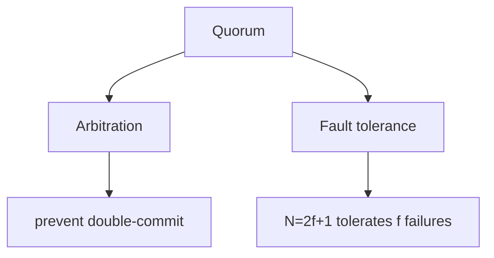
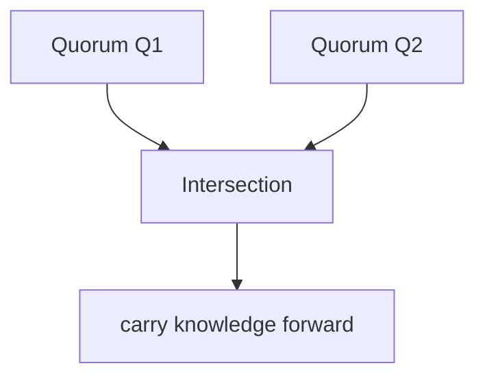
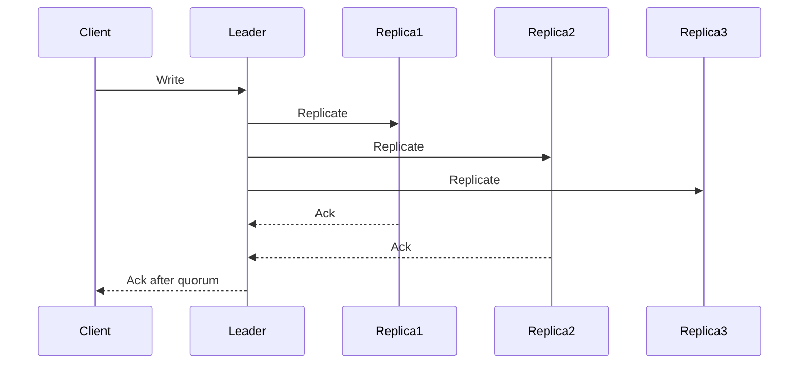
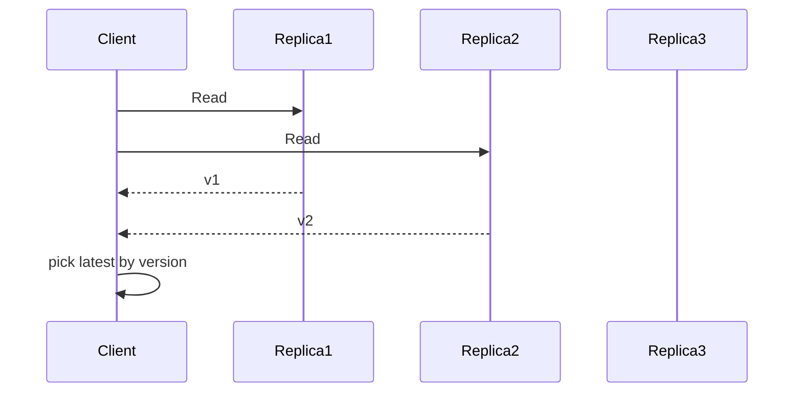
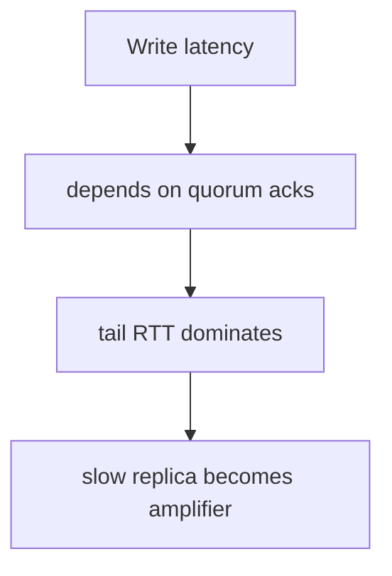

本文围绕“读写多数派（quorum）为什么能工作”做一次工程化梳理：不背公式也能理解它的安全性来源，能把它落到系统实现与排障上。

## 1. quorum 在解决什么：故障与不确定性里做出唯一决定

分布式系统最难的不是平时跑得快，而是故障时不要做错决定。

quorum（多数派）的核心价值：

- **仲裁**：同一时刻不会出现两个互不相交的“多数派”同时宣称成功
- **容错**：N=2f+1 时，允许 f 个故障仍然能形成多数派

## 2. 为什么多数派能工作：交集（intersection）是第一性原理

多数派有一个关键性质：

- 任意两个多数派集合一定有交集

这句话背后是 quorum 能提供安全性的根：

- 如果一个写已经被某个多数派“确认”，那么任何后续想做出“新的决定”（新的 leader、新的提交）的人，只要也需要多数派，就**一定会碰到**至少一个知道旧决定的成员。

可以将交集理解为：系统在不可靠网络里传递“已发生事实”的最小通道。

## 3. 从复制到一致性：多数派不是语义自动升级器

很多人听到 `R + W > N` 就以为“这就强一致了”。需要更谨慎：

- `R+W>N` 只是保证读集合与写集合有交集（在特定假设下更容易读到新值）
- 真正要达到**线性一致**，通常还需要更强约束：
  - 单写者/leader 排序
  - 明确的提交点（commit point）
  - 版本比较与冲突处理（尤其是允许多写者或读任意副本时）

换句话说：quorum 给你的是“工具”，不是“语义保证书”。

## 4. 两种常见使用方式（直觉版）

### 4.1 写多数派：把提交点绑定到多数派确认

要点：只要“对外 ack”之前要求多数派确认，就把已确认写的回滚概率压到很低（仍要配合选主/日志规则）。

### 4.2 读多数派：用多数派读来避免读到明显旧值

注意：读多数派本身并不等于线性一致读，仍然需要定义“版本比较”与“并发写冲突”的处理规则。

## 5. 常见配置：N=3 时 W/R 怎么选

- **W=2, R=2**：读写都多数派
  - 优点：语义更强（更接近强一致实现）
  - 代价：读写延迟都更受尾延迟影响

- **W=2, R=1**：写偏强、读偏快
  - 优点：读便宜
  - 代价：读可能旧（要靠 read repair/lease/read-index 等机制补语义）

- **W=1, R=2**：读偏强、写偏快
  - 常见于写可丢/可重算的场景，否则风险很高

## 6. 多数派的工程代价：尾延迟与可用性门槛

### 6.1 尾延迟：最慢那段路径决定提交点

多数派写的延迟近似由“第 W 快的副本 ack”决定。在 N=3,W=2 时：

- 不是平均 RTT 决定你有多快
- 是“第二快”的 ack 决定你能不能 ack

### 6.2 可用性门槛：多数派不可达时怎么办

失去多数派：

- 强语义写通常必须停
- 只能在“停写/降级语义/只读”里选一个

这不是实现问题，是 CAP 与故障模型决定的约束。

## 7. 常见问题：把 quorum 的问题当成别的锅

- 平均 RTT 还行但 P99 很差：慢副本拖住确认点
- 机器不满但写变慢：跨 AZ/跨 Region 的尾 RTT 抬高
- 频繁选主：心跳/超时没有匹配真实 RTT 分布（误判）

## 8. 应当观测什么（从最有用的开始）

- **quorum 路径的延迟分布**：本次写等了哪些副本的 ack
- **慢副本比例与持续时间**：慢是偶发还是长期
- **选主频率与原因**：是网络抖动、GC、IO 抢占还是参数问题
- **跨 AZ/跨 Region 的 RTT 分布**：重点看尾部

## 9. 排障顺序

1. 定位慢副本：网络 RTT、磁盘抖动、CPU/GC 抢占
2. 检查副本拓扑：是否把多数派路径拉长了
3. 检查选主与超时参数：是否匹配真实 RTT
4. 明确降级策略：失去多数派时需要的到底是什么

## 10. 小结

quorum 的本质是用“多数派交集”换安全性；代价是把提交点绑定到多数派路径的尾延迟上。工程上最有效的优化与排障，通常都围绕“让多数派路径更短、更稳定、慢副本更少”。
