> 论文：The Google File System（Ghemawat, Gobioff, Leung, SOSP 2003）

GFS 是 Google 为大规模离线/在线数据处理构建的分布式文件系统。它不是 POSIX 的“通用文件系统”，而是**明确围绕工作负载做取舍**：

- **超大文件**（GB 级）为主
- **追加写、顺序读**为主（Log / Crawl / Index / MapReduce pipeline）
- **机器故障是常态**（mean-time-to-failure 低）

理解 GFS 的关键，不是记住“Master + ChunkServer”，而是看清它用哪些机制把**吞吐、扩展性、容错性**做到可工程化。

## 1. 设计目标与工作负载假设

### 1.1 为什么不做 POSIX

GFS 放弃/弱化了一些 POSIX 语义（比如强一致的细粒度写）来换取系统整体的可扩展性与吞吐。

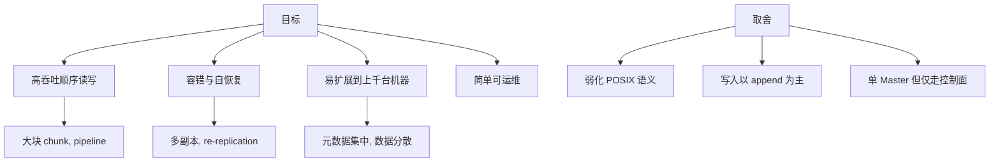

### 1.2 工作负载对设计的直接影响

- **大 chunk**（典型 64MB）：降低元数据量，提升顺序 IO 效率。
- **追加写（record append）**：把 offset 分配放到系统端，允许并发追加。
- **批处理场景多**：更关注吞吐而不是尾延迟。

## 2. 核心抽象：File → Chunk → Replica

GFS 把文件切分成固定大小的 chunk；每个 chunk 以 chunk handle 标识，并在多个 ChunkServer 上保存副本。

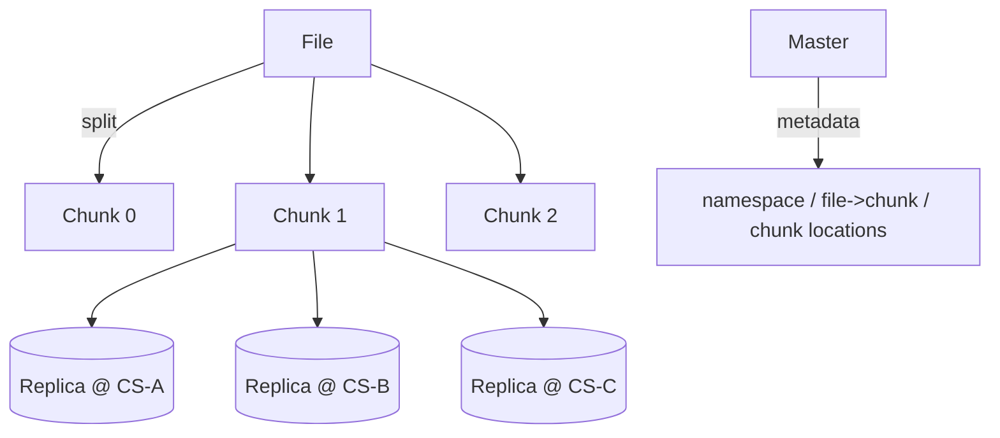

**关键点**：Master 维护的是“**映射关系**”与“**位置索引**”，但**数据面**（chunk data）直接由客户端与 ChunkServer 交互。

## 3. 系统架构：Master / ChunkServer / Client

### 3.1 三方职责

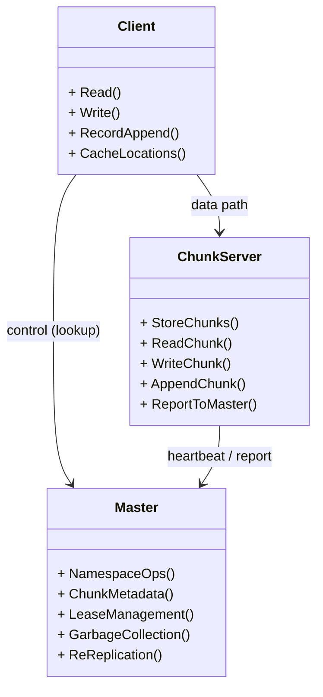

### 3.2 关键原则：控制面集中、数据面分散

- **元数据**集中在 Master：简化一致性与管理。
- **数据**分散在 ChunkServer：吞吐可扩展。
- **Client cache**：减少频繁查 Master。

## 4. 元数据与一致性：Master 如何“靠谱”

### 4.1 Master 的元数据结构

Master 维护三类信息：

- **namespace**：目录树、文件名到文件的映射
- **file → chunk handles**：文件由哪些 chunk 构成
- **chunk → replica locations + version**：每个 chunk 的副本在哪些 ChunkServer

这些信息大多在内存中，以提升性能；持久化通过 operation log / checkpoint。

### 4.2 为什么单 Master 不成为瓶颈

论文的核心论据：**数据面不经过 Master**，而且 client 有缓存，Master 主要处理：

- 文件/目录操作（频率低）
- chunk 位置查询（可缓存）
- lease 管理（每个 chunk 的 lease 有时效）

瓶颈主要来自“元数据热点”，而不是 chunk 读写吞吐。

## 5. 读路径：Client 直连 ChunkServer

### 5.1 读流程

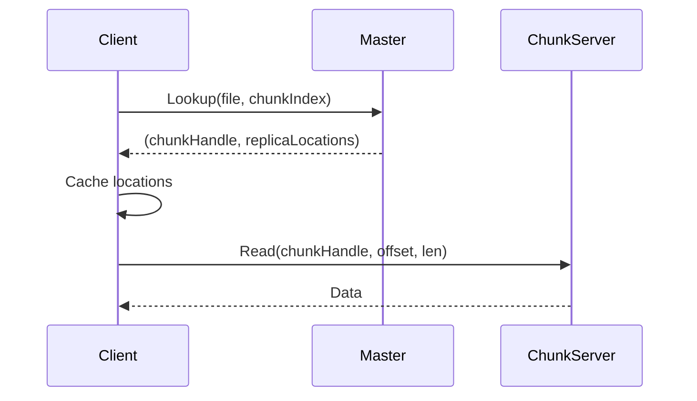

### 5.2 读路径关键优化点

- **位置缓存**：同一个 chunk 的多次读不用每次问 Master。
- **就近副本**：client 选择网络拓扑上更近的副本。
- **大 chunk + 顺序读**：极大减少 random seek。

## 6. 写路径：Lease + Primary 串行化 mutation

GFS 写的难点是：同一个 chunk 有多个副本，如何保证副本间的 mutation 顺序一致。

### 6.1 Lease/Primary 的核心直觉

- 对每个 chunk，Master 在一段时间内把某个副本指定为 **primary**。
- primary 决定 mutation order（对该 chunk 的写/append/修改顺序）。

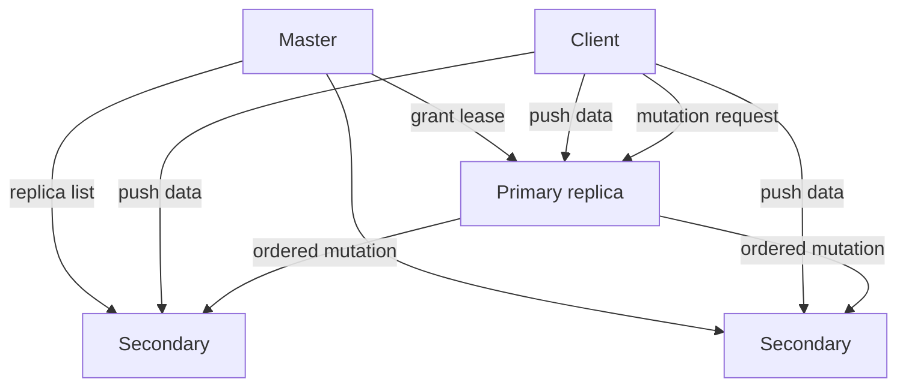

### 6.2 写流程（data flow vs control flow 分离）

GFS 把写分成两段：

1. **数据推送**：Client 把 data pipeline 推到所有副本（primary + secondaries）。
2. **控制命令**：Client 向 primary 发 mutation；primary 排序后下发给 secondaries。

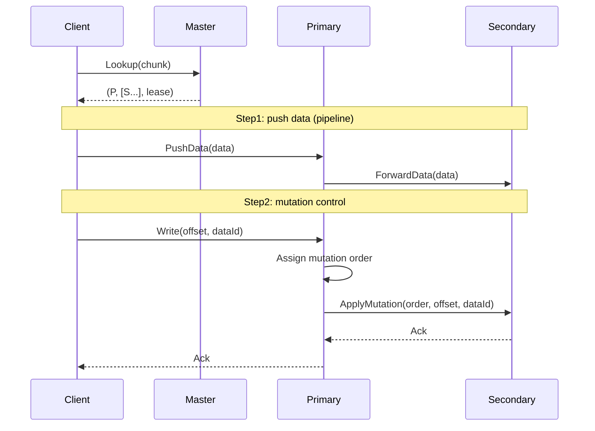

### 6.3 写的一致性语义（论文里最容易被忽略的点）

GFS 提供的不是“像数据库一样的强一致事务语义”，它提供的是：

- **chunk 内 mutation 顺序一致**（由 primary 串行化）
- 但在并发写/失败情况下，会出现 **inconsistent / undefined regions**（尤其 record append）

对于 Google 的应用（MapReduce、日志等）是可接受的，因为应用可以容忍重复记录、用校验/去重处理。

## 7. Record Append：为并发追加而生

### 7.1 record append 的接口语义

传统 write 需要 client 指定 offset；record append 让系统决定落点：

- client 发起 append(data)
- primary 选择一个 offset 写入
- 返回 offset 给 client

### 7.2 为什么它是“系统级优化”

核心动机：多个 client 并发往同一文件尾部追加，client 自己分配 offset 会有复杂的竞争与重试。

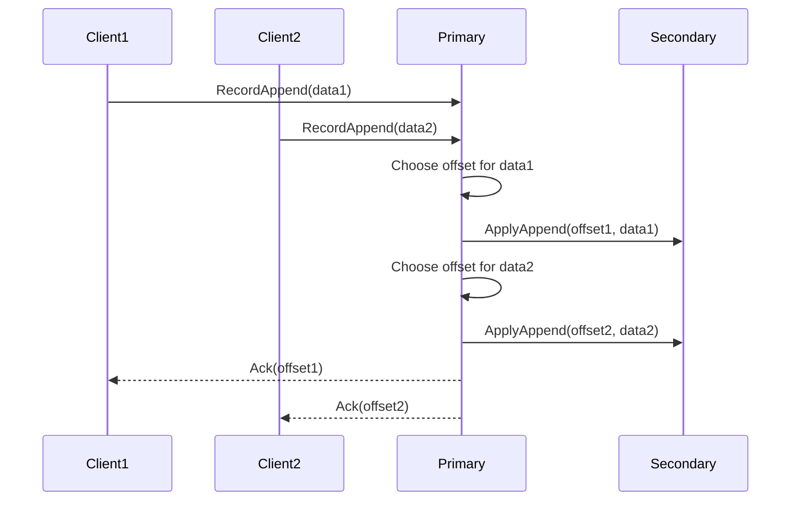

### 7.3 代价：重复与空洞

在失败重试、主备切换等情况下：

- 可能出现 **重复记录**（at-least-once append）
- 可能出现 **空洞/填充**（padding）

应用需要用 record 自身的校验和/唯一 id 去重。

## 8. 容错：故障检测、重复制、校验

### 8.1 ChunkServer 故障是常态

GFS 假设：

- 节点会挂
- 磁盘会坏
- 网络会抖

因此系统必须“**自动发现并自愈**”。

### 8.2 心跳与状态汇报

ChunkServer 周期性向 Master 心跳，汇报：

- 自己持有哪些 chunk（以及版本）
- 剩余磁盘、负载信息

Master 借此做：

- re-replication
- rebalancing
- garbage collection

### 8.3 Chunk 校验

GFS 对 chunk 进行校验（checksum）来发现 silent corruption。

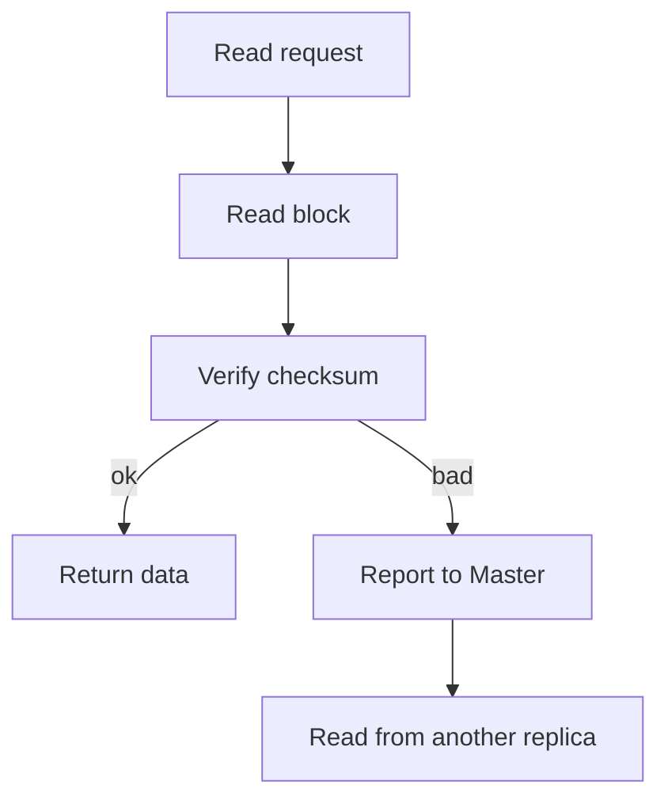

### 8.4 Re-replication（重复制）

当 Master 发现某个 chunk 副本数不足时，会选择新的 ChunkServer，安排从现有健康副本复制过去。

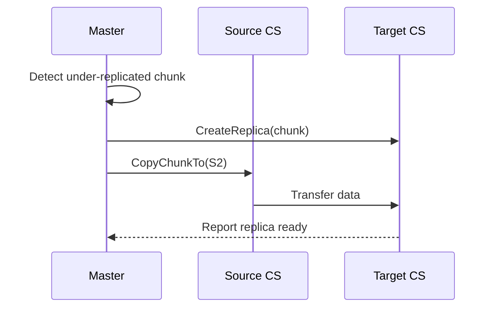

## 9. Master 的持久化与恢复

### 9.1 Operation Log + Checkpoint

Master 的元数据主要在内存中；持久化依赖：

- **operation log**：记录所有元数据变更（append-only）
- **checkpoint**：周期性把内存状态快照化，缩短恢复时 log replay 时间

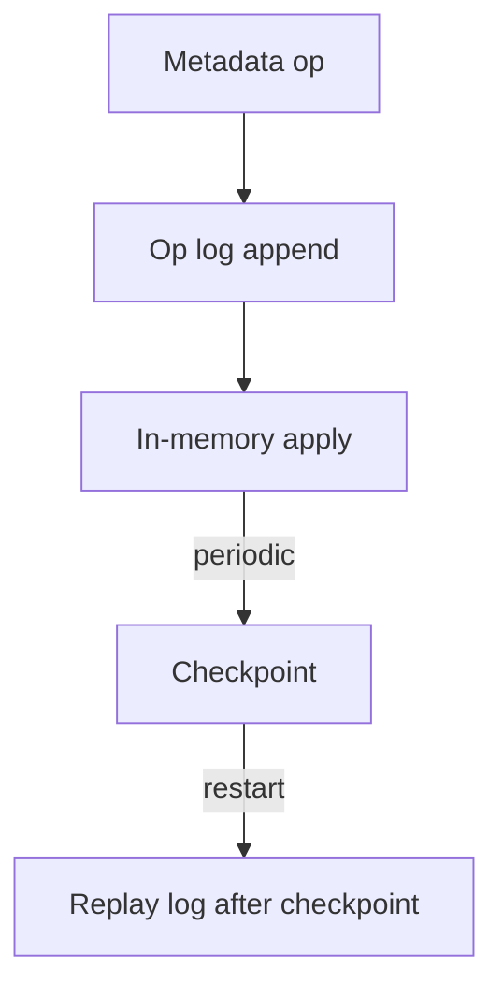

### 9.2 为什么这样足够

- Master 的操作频率相对低（相比数据面）
- log 是顺序写，开销可控
- 重启时 replay + checkpoint 可以恢复一致状态

## 10. 版本号与 stale replica

当 primary 崩溃/lease 过期后，可能出现“旧副本”（stale replica）。

GFS 通过 **chunk version number** 来识别与回收 stale replica：

- Master 在 lease 变更等时机提升 version
- 不匹配 version 的副本被认为是 stale，后续会被 GC

## 11. 性能与热点：GFS 的工程细节

### 11.1 大 chunk 的好处与坏处

- 好处：元数据更少、顺序 IO 更好、client cache 命中更高
- 坏处：小文件浪费、单 chunk 热点更明显

### 11.2 典型热点：单文件尾部 append

record append 会把写集中到某个 chunk 的 primary。

GFS 的策略是：

- 让应用接受“追加不强一致”
- 通过分片/多个文件/多路 pipeline 缓解热点

## 12. 读完后的 takeaways（更工程化的总结）

- **控制面/数据面分离**是 GFS 最核心的扩展性来源。
- **lease + primary** 把一致性问题收敛到 chunk 粒度，并且只在写路径上付出代价。
- **record append** 是一个典型“为吞吐牺牲语义”的系统设计：把复杂性转移给应用，用幂等/去重闭环。
- **自动化运维能力**（checksum、re-replication、GC）是把系统做大的关键，而不是 API。

---

如果愿意，我会在下一步把 `LSM-Tree` 也按同样标准扩展：给出更系统的放大分析（RA/WA/SA）、compaction 两大流派（leveling vs tiering）、以及现代系统如何围绕这些点做工程优化。

## 13. GFS 一致性语义：把“弱语义”说清楚

GFS 经常被误解成“强一致文件系统”。实际上论文花了不少篇幅解释它的**一致性语义**，尤其是在并发写与故障场景下。

### 13.1 mutation、region 与文件一致性

对于某个文件的某个 region（范围），在不同情况下可分为：

- **consistent**：所有客户端看到相同数据
- **defined**：不仅一致，而且数据来自某次成功的 mutation
- **inconsistent**：不同客户端可能看到不同数据
- **undefined**：数据内容不确定（可能混杂多次 mutation、padding）

要点：

- 普通 write（client 指定 offset）如果成功，通常能得到更“defined”的语义
- record append 在并发/失败下更容易出现重复与 padding，从而更容易让应用需要“去重/校验”闭环

### 13.2 为什么 Google 能接受

GFS 服务的主要应用（MapReduce pipeline、日志）通常具备：

- 幂等处理、可重算
- record 自带 checksum/unique id
- 允许 at-least-once 的追加语义

因此“系统语义弱一些”换“吞吐、可扩展、容错更简单”是划算的工程选择。

## 14. 写入细节：为什么要把 data flow 与 control flow 分开

前面我们给了两阶段写入流程，这里强调它的工程目的：

- **data flow**：把大块数据尽量用 pipeline 送到所有副本，避免多次从 client 重发
- **control flow**：把 mutation 顺序与一致性只交给 primary 处理

### 14.1 pipeline 的直觉

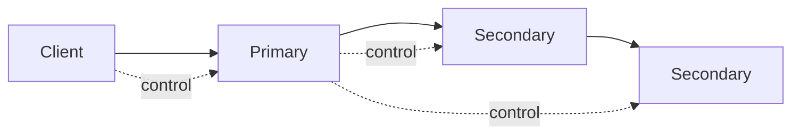

- 数据顺着链路流动，带宽利用更好
- 控制消息可以并行或更小，减少 client 端复杂度

## 15. Chunk version：如何识别并清理 stale replica

stale replica 的根源：

- primary crash / lease 过期
- 某些副本没跟上最新 mutation

GFS 用 **chunk version number** 解决：

- Master 维护每个 chunk 的 version
- 在关键时刻（例如 lease 变更）提升 version
- 版本落后的 replica 被标记为 stale，后续被回收（GC）

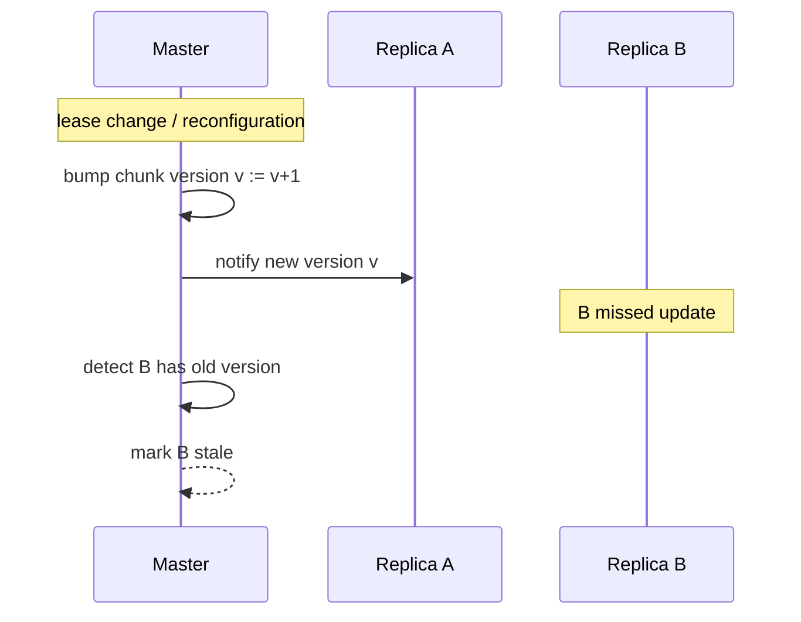

## 16. 元数据操作：namespace、快照、删除与垃圾回收

### 16.1 namespace 操作为什么必须强一致

- create/delete/rename 等会影响“文件名到 chunk 集”的映射
- 如果不强一致，会导致严重的数据不可达或重复

因此这些操作通常由 Master 串行处理，并写入 operation log。

### 16.2 删除为什么不是立即删除

大规模系统里，立即删除会带来：

- 并发读写的复杂性
- 元数据与 chunk 实体的一致性处理成本

GFS 采用“标记删除 + 延迟 GC”：

- 先从 namespace 移除
- chunk 实体留一段时间
- 后台回收无引用 chunk

## 17. 负载均衡与 rebalancing：系统长期稳定的关键

### 17.1 为什么需要 rebalancing

随着时间推移：

- 新文件写入可能集中到某些 ChunkServer
- 某些机器加入/退出
- 某些 rack 热点

Master 需要根据：

- 磁盘占用
- 负载
- 网络拓扑

把 chunk 在集群内迁移，保持整体均衡。

### 17.2 re-replication vs rebalancing

- **re-replication**：副本数不足 → 补副本（容错优先）
- **rebalancing**：副本数够但分布不佳 → 迁移（性能/均衡优先）

## 18. Master 的可用性：这篇论文“时代背景”的取舍

SOSP 2003 的 GFS 论文里，Master 仍是单点，但：

- Master crash 影响的是“控制面”
- 数据面 chunk 仍在
- Master 通过 checkpoint + log replay 可以恢复

后续 GFS 的演进与后继者（Colossus 等）在 Master HA 上做了更多工程增强。

## 19. 这篇论文对你今天的启发

- **分离控制面与数据面**是大规模存储/计算系统的核心套路。
- 当你看到“语义弱化”的设计（record append），要问：应用能否提供幂等/校验闭环。
- “可运维能力”往往比 API 更决定系统能不能做大：checksum、re-replication、GC、rebalancing。

## 20. 更细的写失败场景：GFS 如何收敛到可解释语义

GFS 写路径里最容易“讲不清楚”的部分，是失败与重试如何影响文件 region 的语义。这里补一份更工程化的视角。

### 20.1 失败发生在哪一步

以两阶段写为例：

1) push data：数据沿 pipeline 到达所有副本
2) mutation：primary 排序并让 secondaries apply

失败可能发生在：

- push data 过程中某个副本不可达
- mutation apply 过程中某个副本 apply 失败
- primary 自身崩溃（lease 过期/切主）

### 20.2 为什么 record append 更容易出现重复

record append 的设计目标是“并发追加仍可用”，因此它倾向于提供 at-least-once 的语义：

- client 可能重试
- primary 可能为同一条记录选择新的 offset

最终结果：

- 记录可能重复（应用用 id 去重）
- chunk 尾部可能有 padding（应用扫描时跳过）

## 21. Snapshot：复制写时（copy-on-write）的工程动机

论文里提到快照（snapshot）对某些场景很有用：

- 快速复制大型文件/目录树
- 作为 pipeline 的输入版本

常见实现要点：

- snapshot 不立即复制 chunk 数据
- 只复制元数据指针
- 后续写入触发 copy-on-write

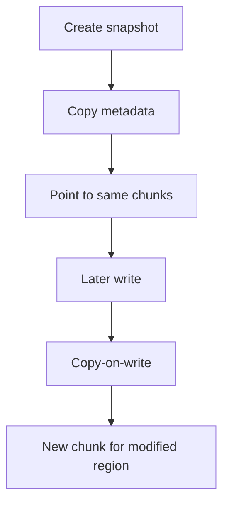

## 22. 读校验与损坏修复：checksum 的闭环

checksum 的价值是把“silent corruption”变成可检测事件：

- 读时验证 checksum
- 发现损坏立刻从其他 replica 读
- 上报 Master
- Master 触发 re-replication 替换坏副本

这套闭环非常关键：否则大规模系统里“静默位翻转”会长期污染数据。

## 23. 为什么大 chunk（64MB）能显著降低 Master 压力

粗略估算：

- chunk 越大，文件被切成的 chunk 数越少
- file→chunk 的映射条目越少
- chunk location 元数据更少

代价也很明显：

- 小文件浪费
- 热点更集中

但 GFS 的 workload 假设让这个 trade-off 成立（大文件为主）。

## 24. 小结：把“弱语义 + 强运维”组合成可用系统

把 GFS 的设计压缩成核心要点：

- **语义上允许某些不完美（尤其 append）**
- **运维上必须做到强自愈（checksum、re-replication、GC、rebalancing）**

这也是很多大规模系统（存储/计算）的通用工程模式。
