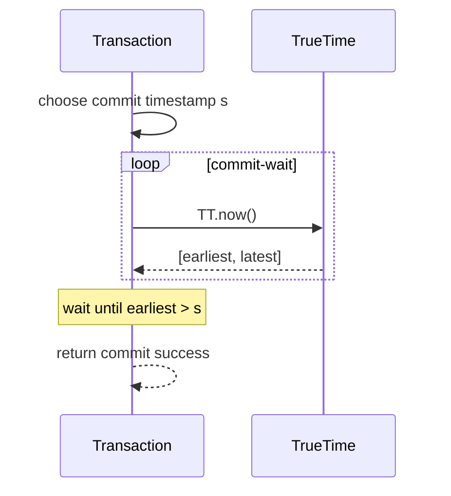
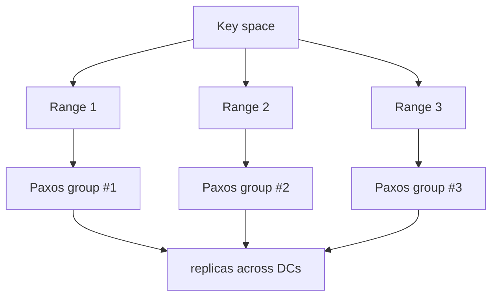
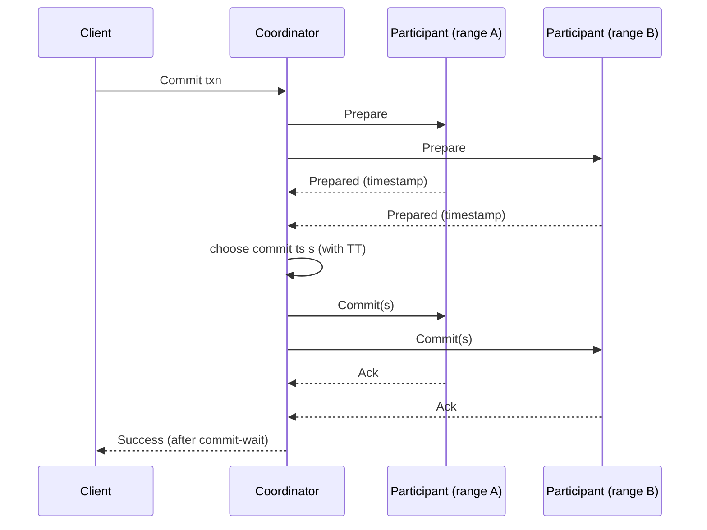
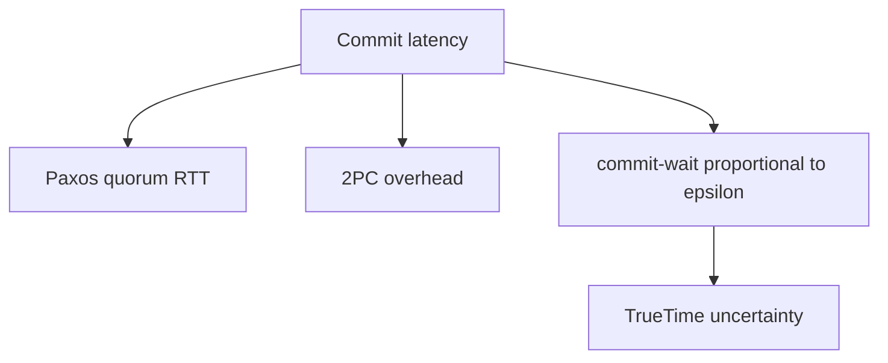
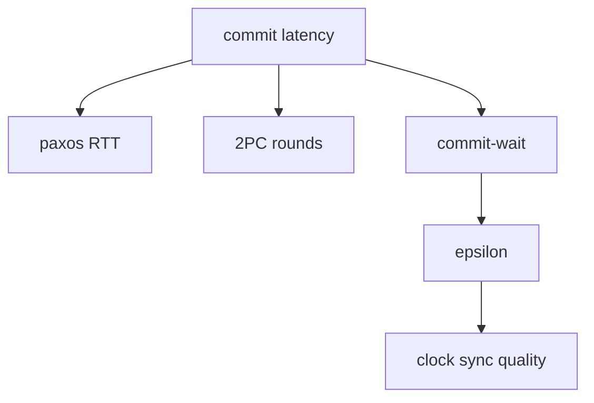
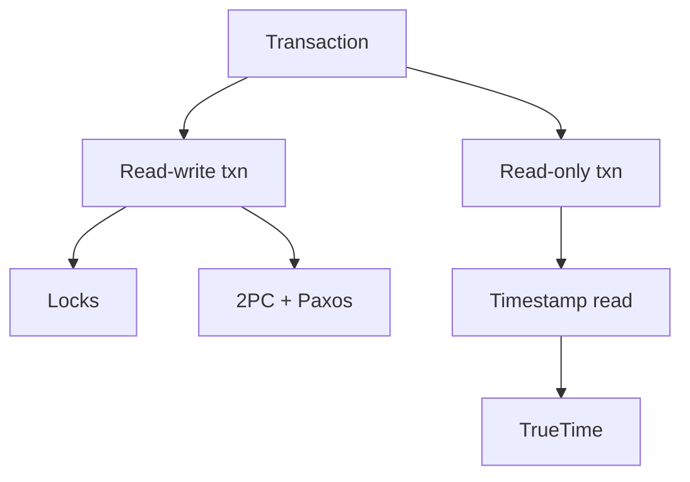
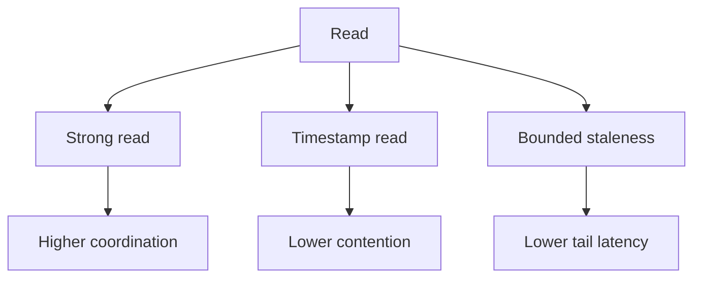
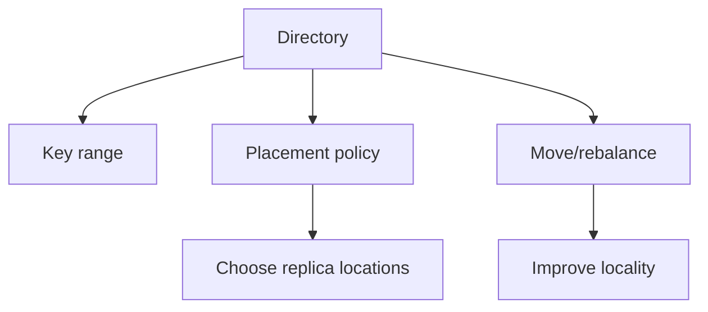
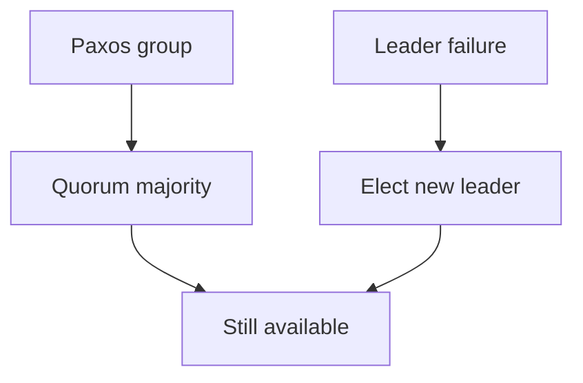
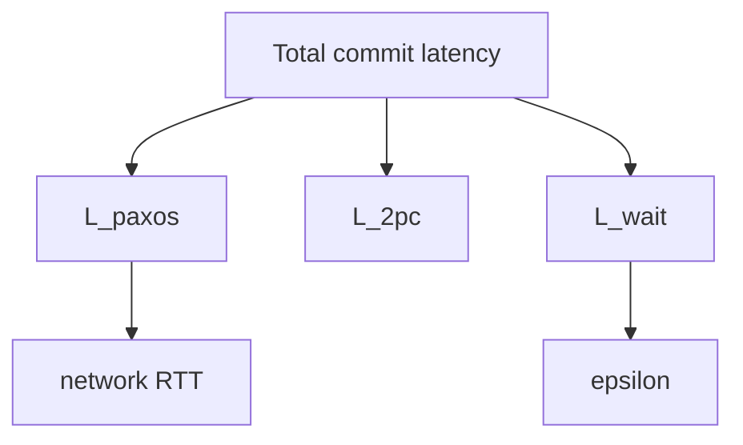

> 论文：Spanner: Google's Globally-Distributed Database（Corbett et al., OSDI 2012）

Spanner 想解决一个“看起来不可能”的组合：

- 跨地域（全球）部署
- 可扩展（按 key-range 分片）
- 高可用（复制）
- **强一致语义**（论文强调 external consistency，接近线性一致的事务提交顺序）

本文论文的最大价值是把“时间、不确定性、一致性、延迟”之间的关系讲清楚：Spanner 用 TrueTime 把物理时钟的不确定性显式化，配合 commit-wait 把全局提交顺序工程化落地。

## 1. Spanner 要的语义：External Consistency

### 1.1 什么是 external consistency

简化理解：

- 如果事务 T1 在真实世界里“先提交完成”，那么任何客户端都不应该看到 T2 的效果早于 T1。

这比单纯的 serializability 更“贴近真实时间”——对跨地域业务很重要（比如金融、跨区配置变更等）。

### 1.2 为什么这很难

跨地域意味着：

- 网络 RTT 大
- 复制协议本身要多数派
- 时钟无法完美同步

如果没有“全球可比较的时间基准”，事务提交顺序就只能依赖消息顺序与协议状态，语义会变弱或成本更高。

## 2. 核心武器：TrueTime

### 2.1 TT.now() 返回的是区间

TrueTime 把时间建模成区间而不是点：

- `TT.now() -> [earliest, latest]`

不确定性 `ε = latest - earliest` 由时钟同步体系（GPS + 原子钟 + 软件校准）控制。

```mermaid
flowchart TD
  TT[TrueTime] --> N[TT.now()]
  N --> E[earliest]
  N --> L[latest]
  E --> EPS["epsilon equals latest minus earliest"]

  EPS --> C1[clock sync quality]
  EPS --> C2[hardware + software]
  EPS --> C3[datacenter topology]
```

### 2.2 commit-wait：把不确定性“等过去”

外部一致性需要：提交时间戳 `s` 必须在真实时间上“站得住”。Spanner 的关键动作是 commit-wait：

- 事务决定提交时间戳 `s`
- **等待直到 `TT.after(s)` 为真**（也就是 `TT.now().earliest > s`）

这样可以保证：当事务返回“提交成功”时，真实时间已经超过 `s`，从而建立全局可比较的顺序。



## 3. 数据组织：key-range 分片 + 复制组

Spanner 的数据单位通常可理解为：

- **directory / key-range**（按 key 前缀/区间组织）
- 每个 range 由一个复制组（Paxos group）管理



## 4. 事务：跨 range 的 2PC + 每个 range 内 Paxos

### 4.1 两层协议的组合

- **range 内**：用 Paxos（或等价多数派复制）决定写入顺序与 durability
- **跨 range**：用 2PC 协调多个参与者（participant）



### 4.2 TrueTime 在事务里扮演什么角色

它让系统能给事务一个“全球可比较”的提交时间戳，从而：

- 提供 external consistency
- 让只读事务在某些模式下可以“按时间戳读”而避免锁冲突（论文里描述了多种读模式）

## 5. 读：强一致读 vs 时间戳读

Spanner 支持按不同一致性需求选择读策略：

- **强一致读**：读最新 committed（成本更高）
- **时间戳读**：读某个时间戳 `t` 的快照（可用来降低锁竞争/提高可用性）

工程要点：

- 越接近“读最新”，越需要更强的同步/等待
- 越愿意读“稍旧的快照”，就越能换到更低延迟、更高吞吐

## 6. 延迟成本：外部一致性不是免费的

### 6.1 成本来源

- 多地域复制：Paxos 多数派 RTT
- 跨 range：2PC 两轮
- TrueTime：commit-wait 引入额外等待（与 ε 相关）



### 6.2 什么时候值得

- 对“全球顺序”和“业务可解释性”有硬需求
- 对跨地域一致的配置/元数据/金融类业务

如果业务可以接受最终一致或弱一些的读写语义，可能更适合 Dynamo-style 或多主异步复制。

## 7. 读完后的 takeaways

- Spanner 的关键不是“它有分布式事务”，而是 **TrueTime + commit-wait** 把外部一致性工程化。
- 强一致的成本主要体现在：多地域复制 + 2PC + 时间不确定性等待。
- 本文论文最值得学的是：如何把“理论语义”转成“可运维的系统机制”（显式建模不确定性）。

## 8. 更细看 TrueTime：epsilon 从哪来，怎么影响延迟

### 8.1 epsilon 的来源

`ε` 不是一个“理论常数”，它来自一整套工程体系：

- 时钟源（GPS/原子钟）
- 机房内分发与校准
- 软件层的误差估计与上报

Spanner 不要求“时钟完美同步”，但要求系统能**给出一个可信的误差上界**。这就是 TrueTime 的关键：

- 不知道现在是几点（精确点）
- 但你知道“现在一定在这个区间里”

### 8.2 commit-wait 的延迟上界

commit-wait 至少要等待到 `TT.now().earliest > s`。

要点：

- `ε` 越大，commit-wait 的额外等待越大
- 在跨地域写入本就很慢的情况下，commit-wait 可能不是主导项；但在同城/低 RTT 环境下，它可能更显著



## 9. Paxos group（复制组）在系统里的位置

Spanner 的复制通常可以理解为：每个 range 是一个 Paxos group。

- group leader 负责排序与提交
- 多数派 ack 后写入生效

因此即便不考虑事务，单 range 的写入也至少需要“多数派 RTT”。

## 10. 事务提交：2PC + Paxos 的组合成本

### 10.1 为什么需要 2PC

跨 range 的事务需要协调多个 participant，否则会出现：

- A range 写成功、B range 写失败
- 系统进入不一致状态

2PC 用 coordinator 做全局决策：

- prepare 阶段让所有 participant 进入可提交状态
- commit/abort 阶段统一做决定

### 10.2 与复制组的叠加

每个 participant 的 prepare/commit 本身又要在其 Paxos group 内达成一致。

所以“一个跨 range 写事务”的关键路径通常是：

- 多个 group 的 prepare（多数派）
- coordinator 选择时间戳 + commit-wait
- 多个 group 的 commit（多数派）

## 11. 只读事务：为什么时间戳读很强大

只读事务如果能在一个时间戳 `t` 上读取一致快照，就可以：

- 避免加锁干扰写事务
- 获得更稳定的读延迟

TrueTime 帮你把“时间戳 t”变成跨地域可比较的概念，从而让快照读语义更自然。

## 12. 目录（directory）与数据放置：让 locality 可控

论文里强调了 directory 的概念（可理解为 key-space 的层级组织），目的是：

- 把“经常一起访问的数据”放到更近的位置
- 让数据放置策略（placement）可表达

这是一种工程现实：强一致全局数据库不只是协议，还要面对 locality 与成本。

## 13. 外部一致性：再用一个“因果视角”总结

commit-wait 的本质是：

- 当系统告诉你“事务提交成功”时，它确保真实时间已经跨过该事务的提交时间戳

这样用户观察到的提交顺序就能和真实世界的时间顺序一致（在误差上界 ε 的定义下）。

## 14. 读完后的补充 takeaways

- Spanner 的工程核心是：显式建模时间不确定性，并把它纳入协议（commit-wait）。
- 真正的成本来自：复制 + 2PC + commit-wait 的叠加；理解延迟拆分有助于判断是否值得。
- directory/placement 体现了“全球数据库最终还是要服从 locality”：系统不可能违背物理。

## 15. 并发控制：锁、两阶段锁与时间戳的关系

Spanner 论文的主角是 TrueTime，但“事务能跑起来”还需要并发控制。

一个工程要点：

- **写事务**通常需要锁（至少是对写集合的保护）
- **只读事务**可以在某些模式下用“时间戳快照读”减少锁冲突



### 15.1 为什么只靠时间戳不够

如果没有锁，两个写事务可能并发写同一 key-range：

- 即使你能分配时间戳，也需要在冲突时决定谁赢谁输

因此写事务仍需要某种互斥/验证机制（锁或等价的 OCC/验证）。

### 15.2 两阶段锁（2PL）的直觉位置

2PL 常见要点：

- 阶段 1：获取锁
- 阶段 2：释放锁（提交/回滚时释放）

在分布式环境里，锁本身也是协调开销，所以 Spanner 更希望让只读事务减少锁参与。

## 16. 读模式：强一致读 vs stale read vs bounded staleness

Spanner 提供多种读模式，本质是在做“语义 vs 延迟/吞吐”的交换：

- **强一致读**：读最新 committed（成本更高）
- **时间戳读**：读某个 `t` 的快照（可以更快、更可并行）
- **bounded staleness**：允许读稍旧的数据，换低延迟



### 16.1 为什么 bounded staleness 重要

在全球部署下，很多读并不需要“最新”，而需要：

- 延迟稳定
- 语义可解释（最多旧 N 秒或 N 个版本）

这种模式能显著降低跨地域的同步等待。

## 17. directory/placement：全球系统最终还是要服从 locality

### 17.1 directory 的工程意义

Spanner 的 directory 可以理解为：

- key-space 的一个“可移动单元”（通常是一段范围或前缀）
- 系统可以把 directory 作为放置与迁移的对象

动机：

- 把经常一起访问的数据放近（减少跨地域事务）
- 把热数据拆分/迁移（负载均衡）



### 17.2 为什么“全球一致”仍需要 placement

协议解决的是“如何一致”，placement 决定的是“付出多少延迟”。

- 如果跨洲事务很多，2PC + Paxos RTT 会直接把延迟拉爆
- 把相关数据 co-locate 是降低成本的第一手段

## 18. 故障与恢复：复制组层面的可用性

### 18.1 Paxos group 的故障边界

对于单个 range（一个复制组）：

- 少数副本故障：多数派仍可写
- leader 故障：选举新 leader，继续服务



### 18.2 跨 group 事务的恢复更复杂

跨 group 的事务还牵涉 2PC：

- coordinator 失败怎么办
- participant prepared 但没收到 commit 怎么办

2PC 的经典问题是：coordinator 失败可能导致阻塞，需要额外机制（日志、超时、恢复协议）把状态推进。

## 19. 端到端延迟拆分：一个工程视角的“可解释模型”

把一次跨地域写事务的延迟粗分为：

- `L_paxos`: 每个 participant 在其 Paxos group 内达成多数派的 RTT
- `L_2pc`: 2PC 的往返次数（prepare/commit）
- `L_wait`: commit-wait（与 ε 相关）



### 19.1 怎么用这个模型判断“值不值得”

- 如果你的业务对 external consistency 没硬需求，`L_wait` 与跨地域 `L_paxos/L_2pc` 的成本可能不划算
- 如果你的业务需要“全球顺序可解释”，Spanner 的这套机制能显著降低应用层复杂度

## 20. 读完后的最终 takeaways（加深版）

- Spanner 的核心贡献是：把“时间不确定性”显式建模，并将其纳入一致性协议（commit-wait）。
- 强一致的实际成本来自复制与 2PC，placement/locality 决定了你付出的 RTT。
- 读模式（timestamp / bounded staleness）是工程落地的关键：它让系统在语义与性能之间有可控的旋钮。
