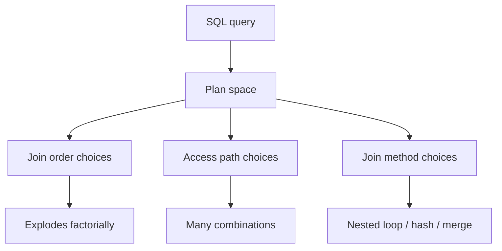
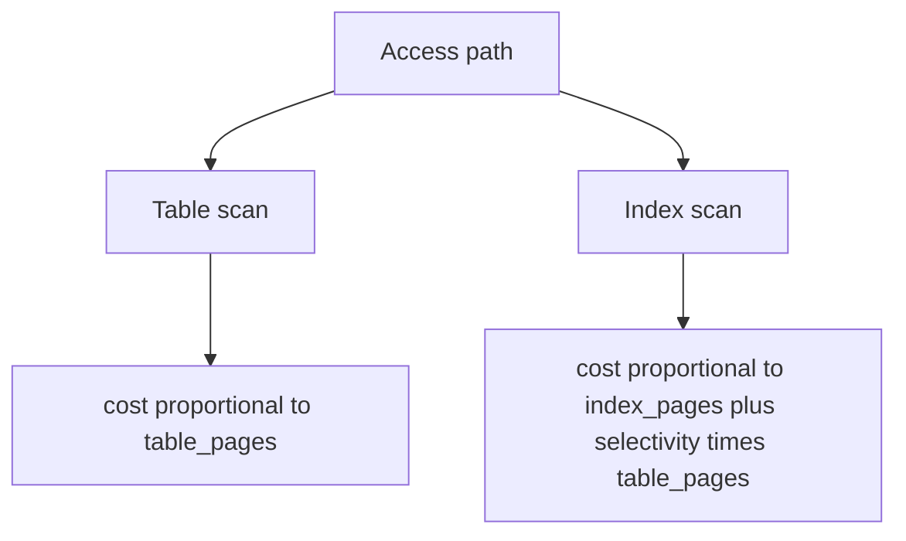
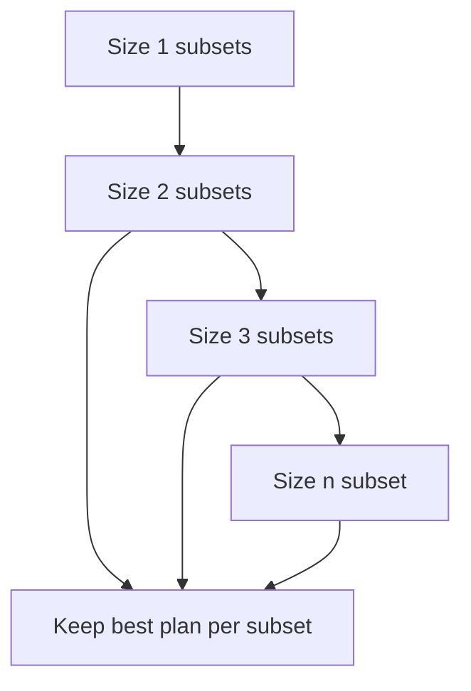

> 论文：Access Path Selection in a Relational Database Management System（Selinger et al., SIGMOD 1979）

System R 这篇论文几乎奠定了现代关系型数据库优化器（CBO, cost-based optimizer）的基本范式：

- 用统计信息估计基数与代价
- 用动态规划枚举 join 顺序
- 在可控的搜索空间里选“足够好”的计划

今天你在 Postgres/MySQL/Oracle/SQL Server 里看到的大量优化器概念，都能追溯到它。

## 1. 问题：SQL 的执行计划空间爆炸

给定一个多表 join：

- join 顺序有阶乘级组合
- 每一步 join 的 access path（index scan / table scan）也有多种



优化器的核心任务：在有限时间内，从巨大的计划空间中选出成本最低（或接近最低）的计划。

## 2. 核心思想 1：统计信息 → 基数估计

### 2.1 基数（cardinality）为什么是关键

代价模型的输入几乎都依赖基数：

- 一个谓词过滤后剩多少行
- join 后输出多少行

如果基数估计错一个数量级，计划就可能完全选错。

### 2.2 System R 的统计信息直觉

典型统计信息：

- 表行数
- 索引/列的不同值数（NDV）
- 选择率（selectivity）
- （现代系统会用 histogram、更复杂的相关性建模）

在 System R 的时代，它给出了一个可工程化的起点：用简单统计去估计 selectivity。

## 3. 核心思想 2：代价模型（cost model）

System R 的成本主要考虑：

- IO（磁盘页访问）
- CPU（当时不是主要瓶颈，但也考虑）

### 3.1 access path 的代价

- table scan：读全表页
- index scan：读索引页 + 回表页（受选择率影响）



现代 DB 会更复杂（cache、prefetch、CPU vectorization 等），但思路不变：**建立可维护的成本模型**。

## 4. 核心思想 3：Selinger DP 枚举 join 顺序

### 4.1 动态规划的基本套路

对 `n` 个表：

- 先求所有 1 表子集的最优计划
- 再求所有 2 表子集的最优计划
- …直到 n 表

关键点：对每个子集 S，只保留“最优计划”（或少量候选），避免指数爆炸。



### 4.2 DP 为什么能 work

因为 join 的最优子结构：

- 如果 `Plan(S)` 是子集 S 的最优计划
- 那么构造更大集合 `S ∪ {t}` 时，考虑 `Plan(S) join t` 的候选即可

虽然现实中有复杂算子（谓词下推、物化、并行等）会破坏部分假设，但 DP 仍是 CBO 的骨架。

## 5. 搜索空间控制：工程上比“最优”更重要

System R 就非常强调：

- 不能无限制枚举
- 必须剪枝

### 5.1 常见剪枝思路

- 只保留每个子集的一小部分候选（top-k）
- 限制 join method
- 限制 bushy tree（是否允许非左深树）

### 5.2 现代优化器的现实问题

- 统计信息过期/不准
- 列相关性强，独立性假设失败
- 参数化查询导致 selectivity 难估

因此今天很多 DB 引入：

- 自适应执行（adaptive）
- runtime re-optimization
- feedback-based stats

但基础框架仍然是 System R。

## 6. 读完后的 takeaways

- CBO 的上限由统计信息决定：基数估计错了，代价模型再好也救不了。
- Selinger DP 给了一个可工程化的 join order 搜索框架：**子集最优 + 剪枝**。
- “最优”不是目标，“可维护 + 可控 + 足够好”才是优化器的工程目标。

## 7. DP 的状态到底是什么：优化器在“记忆”什么

System R 的 DP 思路可以用“子集最优”概括，但工程上最重要的是：

- 对每个 join 子集 S，优化器保存什么信息，才能继续扩展到更大子集。

常见最小状态包括：

- 输出基数估计（rows）
- 输出有序性/物化特性（是否按某个 key 排序）
- 成本（累计 IO/CPU）
- 计划树本身（或可重建的描述）

```mermaid
flowchart TD
  S[Subset S] --> C[cost(S)]
  S --> R[rows(S)]
  S --> O[ordering(S)]
  S --> P[best plan(S)]

  S --> E[Extend with table t]
  E --> S2[Subset S ∪ {t}]
```

## 8. 左深树（left-deep）限制：为什么现实里常这么做

System R 在工程上常限制搜索到左深树（left-deep trees），原因：

- 大幅减少搜索空间
- 更容易生成可执行的流水线（pipeline）
- 与 nested-loop join 的实现更契合

代价：

- 可能错过某些 bushy tree 更优计划

在真实系统里，这是典型的“可控性优先”的剪枝。

## 9. 基数估计误差：优化器翻车的根源

### 9.1 独立性假设经常失败

很多估计会假设：

- 谓词之间独立
- 列之间独立

但现实中列相关性强（比如 `city` 与 `zip`）。

结果：

- 估计输出基数差一个数量级
- 计划选择完全跑偏（比如选错 join 顺序或 join 方法）

### 9.2 现代系统的补救方向（直觉）

- 更丰富统计：histogram、multi-column stats
- 反馈环：运行时收集 cardinality feedback
- 自适应执行：根据中间结果动态调整

System R 给了框架，但“统计质量”决定上限。

## 10. join graph：不仅是顺序，还要看连接结构

当 join 不是链式而是图结构时：

- 某些 join 顺序更自然（先把选择性高的边收缩）
- 某些顺序会产生巨大中间结果

优化器常会利用 join graph 做更有效的剪枝与启发式。

## 11. 读完后的补充 takeaways

- DP 的关键是“每个子集保存哪些属性”，这决定了搜索能不能正确扩展。
- left-deep 是典型工程剪枝：牺牲最优性，换可控性与可实现性。
- 优化器的上限仍然由统计信息决定：统计不准，再漂亮的 DP 也会翻车。

## 12. 一个更“可操作”的例子：为什么 join 顺序会改变数量级

假设：

- `A` 与 `B` join 很选择性（输出很小）
- `B` 与 `C` join 很不选择性（输出很大）

那么：

- 先做 `(A ⋈ B)` 再 join `C` 通常更好
- 先做 `(B ⋈ C)` 会产生巨大中间结果，后续成本暴涨

优化器的 DP/代价模型就是在系统化地做这类判断。

## 13. 最后总结：System R 给的是“优化器的骨架”

- 统计信息：决定基数估计上限
- 代价模型：把估计转成可比较的“成本”
- DP 搜索：在可控空间里选最优/近似最优

现代数据库在此之上叠加了更多复杂度（并行、缓存、向量化、分布式），但骨架仍是本文论文。
