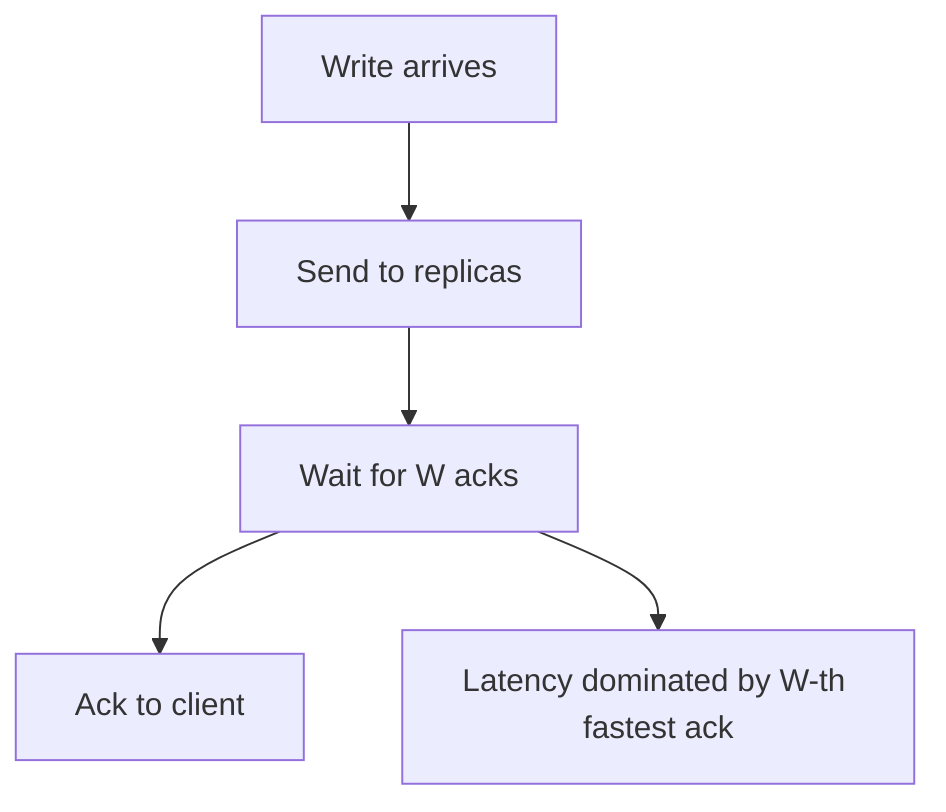
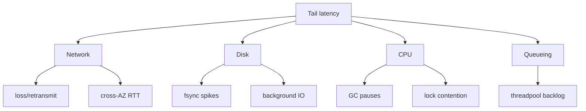
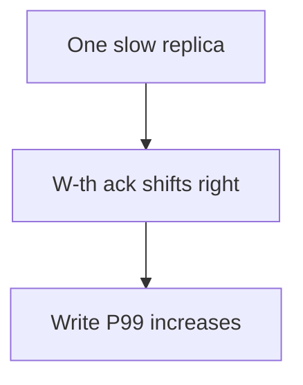
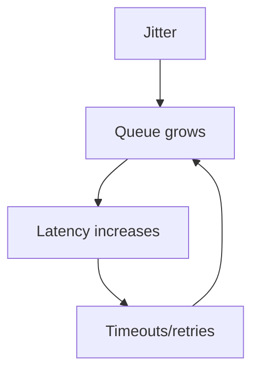

这篇解决一个工程上最常见的困惑：

- “平均 RTT 还行，为什么写入延迟突然很高？”
- “机器不满、CPU 不高，为什么系统还是慢？”

很多时候，答案是：**复制提交点被尾延迟（tail latency）支配**。

只要做了多数派/同步副本确认，就等于把“写成功”的定义绑定在“第 W 个 ack”的那条路径上。平均值会骗你，尾部才是事实。

## 1. 先把提交点模型说清楚：写到底在等谁

用一个抽象模型表示一次写：

- N 个副本
- 写需要 W 个副本确认才能 ack

那么写延迟可以粗略理解为：

- **第 W 快**的副本 ack 时间

### 1.1 N=3 的要点：W=2 为什么经常被“第二快”拖住

当 N=3,W=2：

- 不是在等平均
- 在等“第二快”

如果一个副本经常慢一点点，会看到 P99 延迟明显上升。

## 2. 尾延迟从哪来：网络/磁盘/CPU/队列

尾延迟不是一个原因，是一组原因叠加的结果。常见来源：

- **网络**：跨 AZ/跨 Region RTT 抖动、丢包、重传、队列拥塞
- **磁盘**：fsync 抖动、写放大、后台 compaction/GC 争用 IO
- **CPU**：GC stop-the-world、抢占、热点锁
- **队列**：线程池排队、RPC 队列堆积、backpressure

## 3. “看起来没满但很慢”：尾延迟的典型症状

### 3.1 平均值正常，P99/P999 爆炸

- 平均 RTT 10ms
- P99 RTT 200ms

如果写提交依赖多数派，会频繁落到这些尾部。

### 3.2 单个慢副本 = 放大器

在多数派提交下，一个“偶发慢”的副本会把整体写 P99 放大。

### 3.3 排队导致尾延迟雪崩

当系统接近饱和时，小幅抖动会引发排队，排队会进一步拉长延迟，形成正反馈。

## 4. 多数派写 vs 同步主备：尾延迟形态不同但规律一致

- 主备同步：写延迟常由“最慢的同步备”决定
- 多数派写：写延迟由“第 W 个 ack”决定

共同点：只要你把提交点绑到多个节点，就必须接受尾延迟在延迟分布里占主导。

## 5. 指标怎么打：别只看平均

建议直接对准“提交点”观测：

- **每次写等了哪几个副本的 ack**（写路径 trace）
- **W-th ack 的延迟分布**（而不是单个 RTT 平均）
- **慢副本出现频率**（按副本维度统计）
- **队列长度/排队时间**（线程池、RPC 队列）
- **重传率/丢包率**（网络侧）

## 6. 排障顺序

1. **先确认提交点**：在等谁（W=2？同步备？）
2. **把延迟拆成组件**：网络/磁盘/CPU/队列 哪个在拉长尾部
3. **定位慢副本**：是固定某几台，还是随机抖动
4. **再谈参数**：超时、批量、并发、线程池
5. **最后谈架构**：跨 AZ 策略、降级读写语义、异步化

## 7. 小结

复制系统的延迟不是由平均值决定的，而是由“提交点所需的最后一个 ack”决定的。理解这一点，很多“看起来反直觉的慢”都会变得可解释、可定位。
