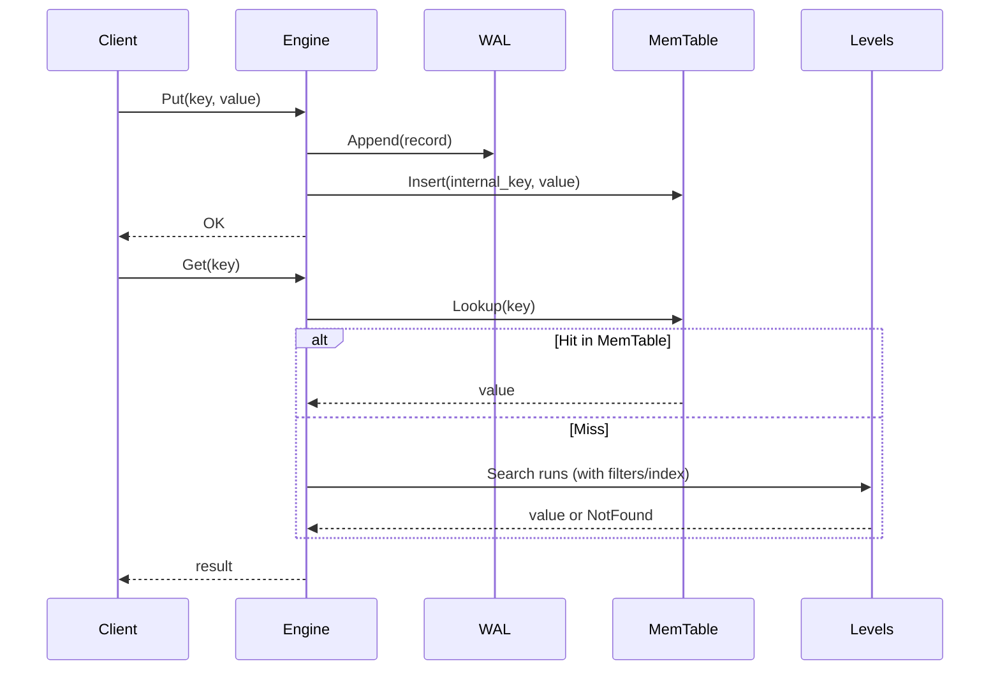
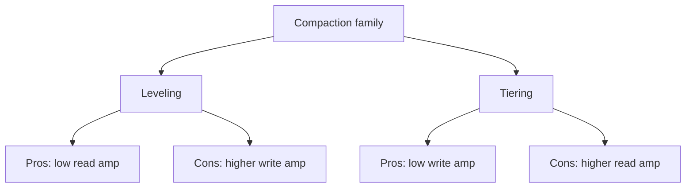
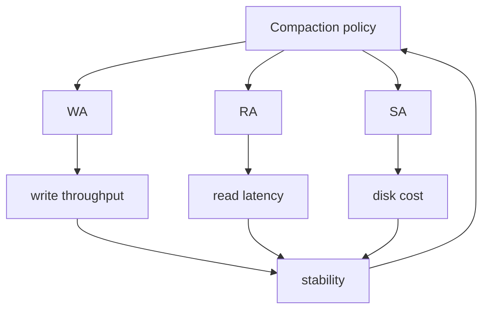

> 论文：The Log-Structured Merge-Tree（O'Neil et al., Acta Informatica 1996；在工程界常被视为 LSM 系统的源头之一）

LSM-Tree 的核心思想很简单：**把随机写变成顺序写**，把“必须排序/合并”的成本推到后台 compaction。真正难的是工程化：如何在吞吐、尾延迟、放大（读/写/空间）之间找到一个稳定点。

本文按“系统工程视角”梳理 LSM：组件如何协作、放大怎么来的、compaction 为什么是难点、以及现代系统（LevelDB/RocksDB/Bigtable family）围绕 LSM 做了哪些关键优化。

## 1. LSM 为什么会出现：随机写是系统性瓶颈

### 1.1 B+Tree 的随机写成本

在传统 B+Tree 上，小范围随机更新往往意味着：

- 需要定位到叶子页（随机读）
- 修改后可能触发页分裂/写放大
- 脏页刷盘会产生更多随机写

如果存储介质是 HDD 或者写放大敏感的 SSD，随机写会被放大成系统性瓶颈。

### 1.2 LSM 的一句话答案

**前台只做顺序追加（log + memory），后台做归并排序（merge/compaction）。**

```mermaid
flowchart TD
  W[Write] --> WAL[WAL append]
  WAL --> MEM[MemTable (sorted)]
  MEM -->|flush| L0[L0 files (sorted runs)]
  L0 -->|compaction| L1[L1]
  L1 -->|compaction| L2[L2]
  L2 -->|...| Ln[Ln]

  R[Read] --> MEM
  R --> L0
  R --> L1
  R --> Ln
```

## 2. 基本结构：内存组件 + 多层有序 run

把 LSM 拆成三个最关键的“前台/后台分工”：

- **WAL**：保证持久性（崩溃恢复）
- **MemTable**：内存里的有序结构（跳表/红黑树等），承接写入并加速读
- **SSTable / Sorted Run**：磁盘上的不可变有序文件，按层组织

### 2.1 Key 在 LSM 里的排序键是什么

工程里常见的排序键不是纯 `user_key`，而是：

- `internal_key = (user_key, seq, type)`

其中 `seq` 单调递增，保证“同一个 user_key 的新版本排在旧版本前/后（取决于实现）”。

这会直接决定：

- 点查如何找到“最新版本”
- tombstone（删除标记）如何覆盖旧值
- compaction 如何清理历史版本

### 2.2 典型读写路径（直觉版）



## 3. 三种放大：RA / WA / SA

LSM 的工程讨论最终都会落到三种放大：

- **读放大（Read Amplification, RA）**：一次读要碰多少层/多少文件/多少 block
- **写放大（Write Amplification, WA）**：写入 1B 用户数据，系统最终写了多少 B
- **空间放大（Space Amplification, SA）**：存 1B 有效数据需要占多少磁盘（多版本、tombstone、重复 run）

### 3.1 读放大（RA）来自哪里

- 多层文件：一个 key 可能出现在多个 level（旧版本尚未被 compaction 清掉）
- 多文件：每层多个 SSTable，需要定位候选文件
- 多 block：每个 SSTable 内部是 block 结构（index/filter/data），命中才读 data block

现代系统用 **Bloom / Ribbon filter + block cache + level metadata** 把 RA 压下来。

### 3.2 写放大（WA）的本质

写放大主要来自 compaction：数据被不断“搬家”合并。

直觉上：

- **tiering（按层堆叠）**：写放大低，但读放大高
- **leveling（层内不重叠）**：读放大低，但写放大高

### 3.3 空间放大（SA）的本质

- 多版本：旧版本在 compaction 前无法回收
- tombstone：删除标记需要传播到足够低的层才能真正删除旧值
- tiering 重叠：同层多个 run 重叠会带来更多冗余

## 4. Compaction：LSM 的心脏也是痛点

### 4.1 两个流派：Leveling vs Tiering

#### Leveling（分层且层内不重叠）

- 每层的 SSTable key range 互不重叠（或尽量不重叠）
- 点查：每层最多查 1 个文件 → **RA 低**
- Compaction：需要把上层数据 merge 进下层，并重写大量数据 → **WA 高**

#### Tiering（层内多个 run 重叠）

- 每层是多个不可变 run（堆叠）
- 写入更像“落盘就行” → **WA 低**
- 点查：同层可能要查多个 run → **RA 高**



### 4.2 典型分层参数：大小倍数 T

常见做法：每一层的容量按倍数增长：

- `size(Lk) ≈ T * size(Lk-1)`

`T`（比如 10）会影响：

- compaction 频率
- WA（数据搬家次数）
- 空间利用率
- 读路径（层数）

### 4.3 L0 的特殊性：最容易引发抖动

很多实现把 flush 生成的 run 放到 L0。L0 的特点：

- 文件之间 **可能重叠**（range overlap）
- 点查可能要查多个 L0 文件
- 如果 L0 文件数量上升，会导致读放大显著上升、甚至触发 write stall

典型策略：

- 控制 L0 文件数阈值
- 触发 L0→L1 compaction（把重叠变成更“规整”的结构）

### 4.4 Compaction 的两个指标：输入重叠与输出重写

Compaction 本质是多路 merge：

- 选输入：上层一个/多个文件 + 下层与其 key range 重叠的一组文件
- 归并输出：产生若干新文件，覆盖同一 key range

代价主要来自：

- 读输入文件
- 写输出文件
- 额外的 CPU（比较/解码/校验/压缩）

### 4.5 tombstone 与 TTL：删除为什么这么难

删除通常不是“立刻把磁盘数据删掉”，而是写入 tombstone：

- tombstone 必须下沉到足够低的层，才能覆盖/清理所有旧版本
- 在此之前，读路径仍需要处理 tombstone 逻辑

因此：

- delete-heavy 工作负载会增加 compaction 压力
- tombstone 的生命周期与 compaction 速度强相关

## 5. 读路径工程化：Bloom / Index / Cache

### 5.1 Bloom Filter：把“负查”变便宜

很多系统的读压力来自负查（key 不存在）。Bloom filter 让系统在读 data block 前快速判断：

- 如果 filter 说“不可能存在”，可以直接跳过该文件

这对 LSM 很关键，因为同一个 key 可能要探测多个 run。

### 5.2 Block Cache：缓存的不是“key-value”而是“block”

SSTable 内部是 block 结构：

- data blocks（真正数据）
- index blocks（定位 data block）
- filter blocks（Bloom）

缓存策略一般是：

- cache data/index/filter blocks
- 热点 key 会被映射成热点 block

### 5.3 Range query 的难点

范围查询需要 merge 多个有序源：

- MemTable iterator
- L0 多个 run iterator
- L1..Ln 每层最多一个（leveling）或多个（tiering）

如果层间重叠多，range scan 的 CPU merge 成本会显著上升。

## 6. 写路径工程化：Flush、WAL、Write Stall

### 6.1 Flush：什么时候把 MemTable 落盘

常见触发条件：

- MemTable 大小阈值
- 写入速率过高导致内存压力
- 手动/定时 flush

Flush 产生新的 SSTable（通常到 L0）。

### 6.2 Write Stall：为什么“后台”会反过来卡“前台”

当 compaction 跑不过写入时，会出现：

- L0 文件数增长
- L0 读放大变大
- compaction backlog 继续增长

最终系统可能为了保护读延迟/磁盘空间，主动 **stall writes**。

工程上经常需要：

- 增加 compaction 并发
- 调整 level size / T
- 调整 flush 速度与写入节流

## 7. 一个可操作的“LSM 直觉模型”

如果你只记一个模型，我建议记这个：

- LSM 的前台写很快（顺序写 + 内存排序）
- 后台 compaction 决定系统的稳定性
- 三种放大互相牵制：压一个，往往会抬高另一个



## 8. 读完后的 takeaways

- LSM 的“论文部分”很好理解，难点在 compaction 的工程实现与参数稳定性。
- `leveling` vs `tiering` 是最核心的设计分歧：读更稳还是写更省。
- 真实系统的性能拐点通常出现在：**L0、compaction backlog、tombstone**。
- 要把 LSM 写好，必须把：filter/cache、compaction、write stall 这三者闭环。

---

下一步我会继续把“论文阅读 tab”剩下的短文补齐：

- 分布式系统：Chubby / MapReduce / Spanner
- 数据库：Silo / System R

并保证 Mermaid 图都能稳定渲染（我们有 `npm run mermaid:audit` 做兜底）。

## 9. 更定量的放大直觉（工程可用版）

这一节我们不追求严格推导（不同实现细节差异很大），但给出足够“能算、能比较、能解释”的近似。

### 9.1 层数与大小倍数 T

如果最底层容量约为 `S_max`，MemTable+L0 规模约为 `S0`，并且每层按 `T` 倍增长，那么层数大致：

- `L ≈ log_T(S_max / S0)`

层数越多：

- metadata 管理复杂度更高
- 读路径要触碰更多层（但 leveling 下每层最多一个文件）

### 9.2 Leveling 的 WA 直觉

在 leveling 中，一条数据会不断被“下推”到更低层。直觉上：

- 每进入下一层就会被重写一次
- WA 与层数正相关

因此 T 变大（层数变少）通常能降低“被反复搬家次数”，但会让单次 compaction 的重写范围变大、写抖动更明显。

### 9.3 Tiering 的 RA 直觉

在 tiering 中，同层多个 run 重叠：

- 点查需要在同层探测多个 run（Bloom/filter 能帮你跳过部分）
- 最坏情况下，需要检查 `O(number_of_runs)`

因此 tiering 更依赖：

- filter 的效果（负查性能）
- 合理控制 run 数（否则读退化）

## 10. Compaction 选择（picker）：真正决定“系统稳不稳”

在工程实现里，compaction 不只是“后台线程一直 merge”，而是：

- 什么时候 compaction
- 选哪一层
- 选哪些文件
- 输出切分成多大

这些策略决定了：

- backlog 是否能收敛
- 写放大/读放大的长期稳定点
- 是否出现周期性的 write stall（抖动）

### 10.1 常见触发信号

- L0 文件数/总大小超过阈值
- 某层 size 超过目标 size
- tombstone 比例过高（需要清理）
- 手动触发（运维/compact range）

### 10.2 “优先压 L0”几乎是共识

原因很直接：

- L0 重叠导致读放大增长最快
- L0 backlog 会直接把写入推向 stall

所以很多系统的 compaction 优先级类似：

- 先保证 L0 不爆
- 再按层级超标程度做平衡

## 11. 输出文件大小：吞吐 vs tail latency 的权衡

输出文件越大：

- compaction 更“批处理”，吞吐更好
- 但单次 compaction 的 IO 峰值更大，容易造成尾延迟抖动

输出文件越小：

- compaction 更平滑
- 但元数据变多、打开文件变多、读路径成本上升

工程上通常需要结合：

- 磁盘带宽
- CPU（压缩/校验）
- workload 的 SLA

## 12. tombstone/TTL 的工程细节：为什么会“删不动”

删除在 LSM 里是“写一个 tombstone”。要真正删除旧值，需要 tombstone 覆盖到所有可能存在旧版本的层。

### 12.1 典型现象

- delete-heavy 负载下，tombstone 积压
- compaction backlog 变大
- 空间放大变高（旧版本迟迟不回收）

### 12.2 常见工程补救

- 更激进的 compaction（提高后台资源）
- 定期 compact range（但要注意抖动）
- 业务侧减少短周期 delete（尽量 TTL 到期合并回收）

## 13. Range scan：什么时候会很贵

range scan 在 LSM 里本质是多路 merge iterator。

### 13.1 影响因素

- L0 重叠越多 → merge 源越多
- tiering 层 run 越多 → merge 源越多
- key 分布越散 → cache 命中率越差

### 13.2 工程优化

- 尽量减少重叠（leveling / 控制 L0）
- 为 scan 优化 block cache 策略（scan-resistant cache）
- 数据局部性（prefix / clustering）

## 14. 稳定性视角：写放大不是最怕，最怕“抖动”

很多系统实际的问题不是平均 WA，而是：

- compaction 波峰波谷
- write stall 周期性出现
- tail latency 尖刺

### 14.1 一个朴素但好用的判断标准

- 如果后台 compaction 平均速度长期 < 前台写入速度，系统必然进入不可持续状态
- 所以调参的第一目标是让 compaction 有“余量”

## 15. 读完后的补充 takeaways

- LSM 的“最难点”是 compaction picker：它决定系统在长期运行下是否稳定。
- 想让系统稳，优先看：L0、backlog、tombstone、stall。
- RA/WA/SA 是互相牵制的三角：做任何优化都要说清楚代价转移到了哪里。

## 16. 现代 LSM 的几个“硬工程点”（从论文到现实系统）

这部分不是论文原文，但能帮助你把 LSM 和 RocksDB/LevelDB/Bigtable family 对上号。

### 16.1 Compaction 的资源隔离：别让后台打爆前台

Compaction 会同时消耗：

- 磁盘带宽（读旧文件 + 写新文件）
- CPU（压缩/校验/解码）
- 内存（iterator/merge buffer）

工程上需要限制与隔离：

- compaction 并发数
- compaction IO rate limit
- 高优先级（flush/L0） vs 低优先级（deep compaction）

否则会出现：

- read tail latency 抖动
- 业务线程被 IO/CPU 抢占

### 16.2 “写很快”的错觉：WAL + memtable 只是前半程

很多人第一次 benchmark 会觉得 LSM 写入很快，但长期运行后会遇到：

- compaction backlog 累积
- L0 爆掉
- stall

所以写性能要看“稳态”而不是“冷启动”。

### 16.3 负载倾斜：热点 key 会改变一切

如果某个 key 范围特别热：

- 对应的 SSTable block 更热
- compaction 可能频繁触碰同一范围

在分布式场景，还会引发：

- range 热点导致某个 shard/region 过载

### 16.4 Key-value 分离（value log）是一种典型演进

当 value 很大且更新频繁时：

- compaction 反复搬大 value 会让 WA 极高

一种演进是 key-value separation：

- LSM 里只存 key + value pointer
- value 存在 append-only value log

代价是：

- GC 复杂
- 读路径多一次跳转

这也是“写放大”在工程上反向推动架构演进的例子。

### 16.5 压缩与校验：CPU/IO 权衡点

- 强压缩：省 IO 但耗 CPU
- 弱压缩：耗 IO 但省 CPU

真实系统需要根据：

- CPU 余量
- IO 带宽
- 读写比例

动态选择压缩策略。

## 17. 一个可复用的调参 checklist（面向稳定性）

如果你在真实系统里遇到 LSM 抖动，可以按这个顺序排查：

1. **L0 是否爆**：L0 文件数/大小是否持续上升
2. **compaction backlog**：后台是否长期追不上前台写入
3. **stall**：是否发生写入被节流/暂停
4. **tombstone**：是否 delete-heavy 导致清理压力过大
5. **cache 命中**：负查是否被 filter 减少，热点 block 是否命中 cache

每一步都对应明确的工程动作（提高 compaction 资源、调阈值、改 workload、加 cache/filter）。

## 18. 再补一组“常见问答”，把直觉讲透

### 18.1 为什么 L0 经常是整个系统的开关

因为 L0 的重叠导致：

- 点查可能要碰多个文件
- range scan merge 源数激增
- filter/cache 的收益下降（需要探测更多候选）

一旦 L0 积压，系统会进入“读慢 → compaction 更难推进 → 更积压 → stall”的恶性循环。

### 18.2 为什么 leveling 更适合读多写少

- leveling 让每层 key-range 尽量不重叠
- 点查时每层最多一个候选文件

因此读放大更低、读延迟更稳。

代价是写放大更高：数据会被反复下推重写。

### 18.3 为什么 tiering 更适合写多读少

- tiering 让写入更像“批量落盘”
- 低 WA、高写吞吐

代价是读放大更高：需要在同层多个 run 中探测。

### 18.4 为什么 tombstone 会拖慢系统

tombstone 本质上也是数据：

- 它会参与 compaction merge
- 它会影响读路径（需要判断 key 是否被删除）

如果 delete-heavy：

- tombstone 比例高
- compaction 成本上升
- 空间回收变慢

### 18.5 为什么“提高 compaction 并发”不一定解决问题

因为瓶颈可能不在并发，而在：

- 磁盘带宽已经饱和
- CPU（压缩/解码）已经成为瓶颈
- 写入速率本身超过系统可持续上限

正确的目标是：让后台可持续吞吐 > 前台写入吞吐，并且隔离对读延迟的影响。

## 19. 小结：把 LSM 当作“后台持续归并”的流水线

如果把 LSM 看成一个流水线：

- 前台：顺序追加 + 内存有序
- 后台：持续归并（compaction）

那系统调优的关键就是：

- 让归并流水线持续跑得动
- 且不影响前台 SLA

这也是为什么 LSM 的工程实现比论文描述复杂得多。
