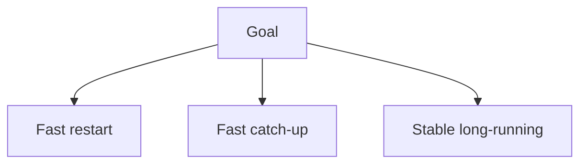
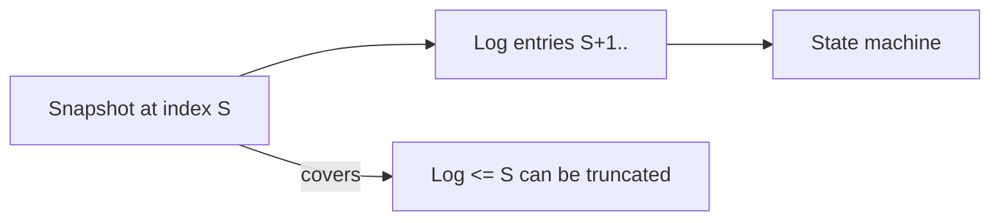
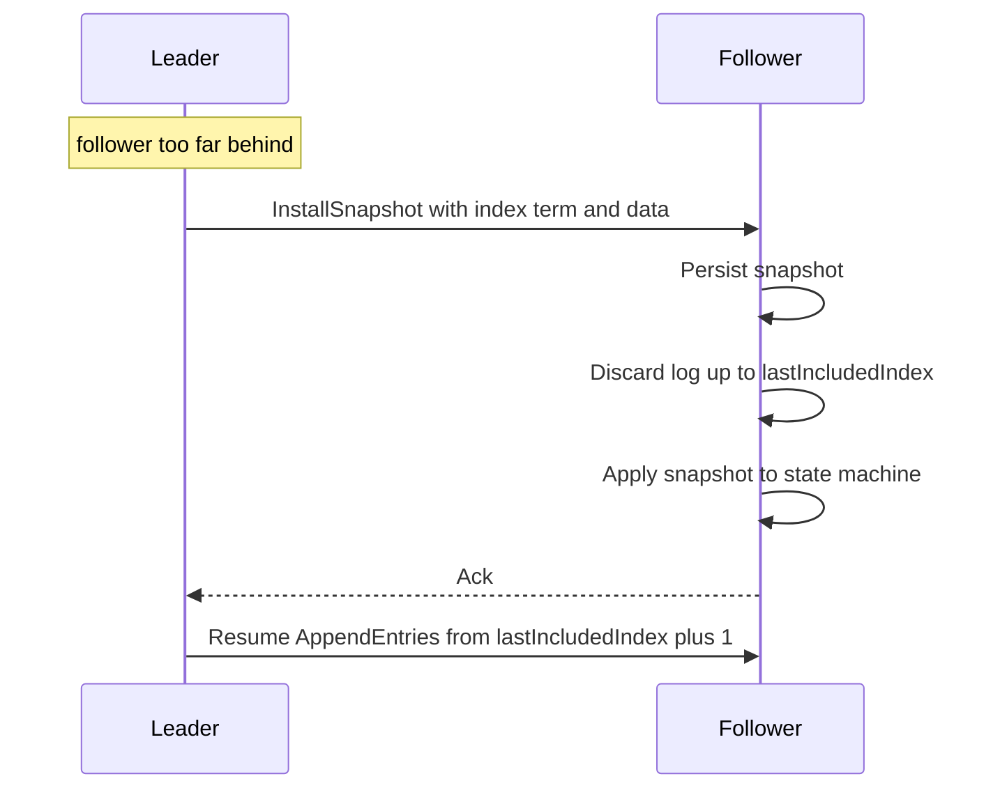
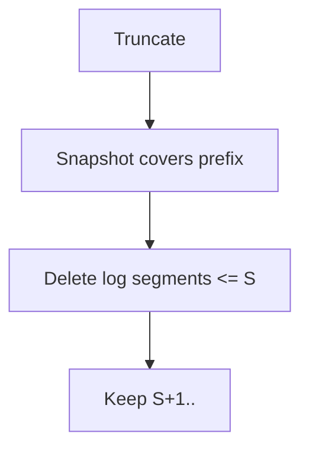
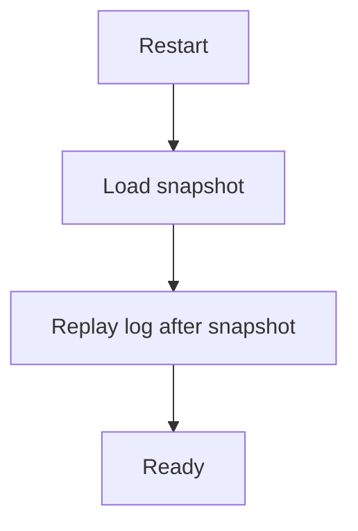

这篇讲清楚一个“基于日志复制的一致性系统”迟早要面对的现实：

- 日志会无限增长
- 新节点追赶会越来越慢
- 重启恢复会越来越慢

**快照（snapshot）+ 日志截断（log truncation）**就是用来把“恢复成本”从“与历史长度相关”变成“与快照大小相关”。

可以将它理解成：

- 日志负责增量复制
- 快照负责把增量压缩成一个可快速安装的检查点

## 1. 先定义目标：成功意味着什么

做快照/截断不是为了“省磁盘”，而是为了：

- **恢复时间可控**：重启不需要重放超长日志
- **追赶时间可控**：新 follower 不需要从远古 entry 一条条补
- **运行稳定**：避免日志元数据/存储膨胀导致性能退化

## 2. 直觉模型：日志是增量，快照是压缩后的基线

把状态机状态表示为：

- `state = apply(snapshot) + apply(log entries after snapshot)`

因此截断的前提是：

- 被截断掉的日志内容已经被快照“覆盖”（已包含其效果）

## 3. 快照生命周期：生成、持久化、传播、安装

### 3.1 什么时候生成快照（触发条件）

常见触发：

- **日志长度/大小超过阈值**（最常见）
- **磁盘空间压力**（不得不做）
- **运行时间周期性**（保守策略）

建议：以“**截断带来的收益**”来选阈值：

- 快照太频繁：CPU/IO 开销高
- 快照太稀疏：恢复/追赶慢

### 3.2 快照包含什么

典型快照内容：

- 状态机数据（可能是 KV、元数据、索引等）
- `lastIncludedIndex` / `lastIncludedTerm`
- （可选）配置/成员信息、校验和

## 4. InstallSnapshot：leader 如何把快照发给落后的 follower

当 follower 落后太多，leader 发现：

- `nextIndex` 已经落到 leader 的截断点之前

此时继续发 AppendEntries 已经没意义，必须改发快照。

### 4.1 关键安全点：先落盘，再 apply

快照安装的顺序很关键：

- 先把 snapshot 持久化
- 再更新本地元数据（lastIncludedIndex/Term）
- 再 apply 到状态机

否则 crash 会把节点留在“半安装”的危险状态。

## 5. 日志截断：能删什么

截断（truncation）的安全条件可以压成核心要点：

- 只截断**已经被快照覆盖**的前缀日志

典型动作：

- 保留：`lastIncludedIndex` 之后的日志
- 删除：`<= lastIncludedIndex` 的日志段

## 6. 恢复路径：重启时怎么恢复得快

重启恢复通常变成：

1. 读取 snapshot（得到一个基线）
2. 重放 snapshot 之后的日志增量

## 7. 常见问题：为什么快照做不好会“更慢更不稳”

### 7.1 快照太大

- 生成快照耗时长
- 传输耗时长
- install 期间 follower 落后更严重

对策：

- 分片/增量快照
- 压缩（但注意 CPU）
- 传输分块 + 断点续传（实现复杂度更高）

### 7.2 快照与业务 IO 争用

快照本质是大 IO：

- 与前台读写抢磁盘带宽
- 导致尾延迟抖动

对策：

- 限速（rate limit）
- 后台优先级
- 资源隔离（独立盘/独立线程池）

### 7.3 快照与成员变更/配置的边界

如果系统支持成员变更：

- 快照里是否包含配置？
- install 后如何保证配置一致？

需要保证：配置变更与快照的元数据能一起被安全恢复。

## 8. 需要监控什么（可观测信号）

建议直接围绕“恢复成本与落后程度”监控：

- **log size / log segment count**
- **snapshot size / generation time**
- **install snapshot count / duration**
- **replication lag（follower 落后 index）**
- **catch-up time（新节点追赶耗时）**

## 9. 排障顺序

1. 先确认瓶颈：追赶慢还是重启慢
2. 看 lag：是不是某些 follower 长期落后
3. 看 snapshot：是不是太大/太慢/太频繁
4. 看 IO：是不是快照把磁盘打爆导致尾延迟
5. 最后改阈值/架构：分片/限速/隔离

## 10. 小结

快照与日志截断的本质是：用一个可安装的“基线”替代无限增长的历史，让恢复与追赶成本可控。做不好会引入巨大的 IO 抖动与恢复风险；做得好则是强一致系统长期稳定运行的关键。
