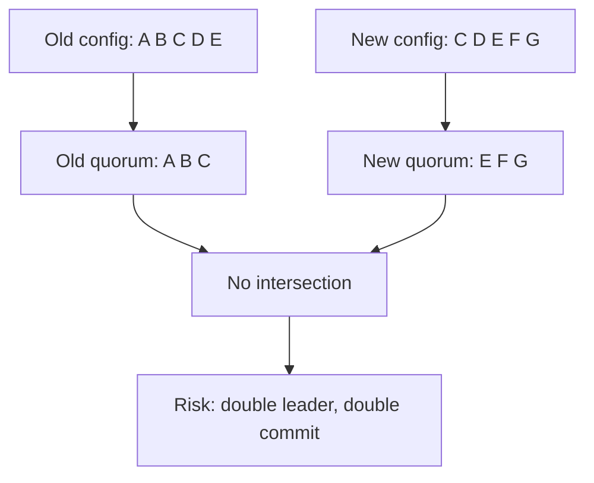
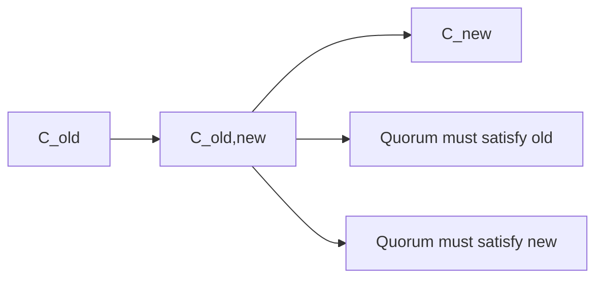
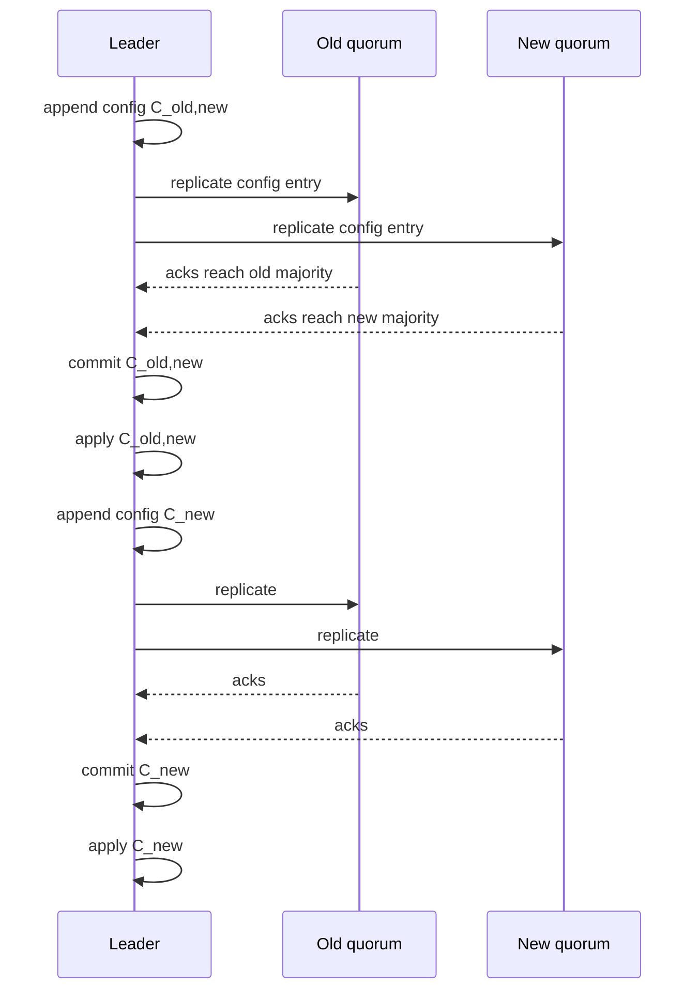
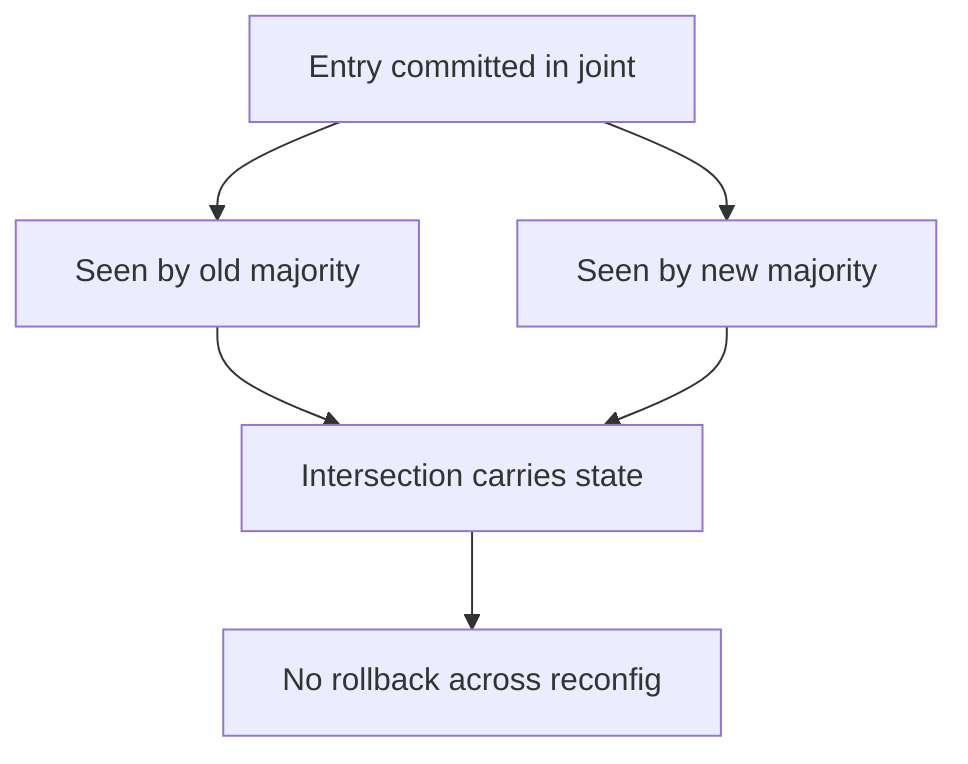

成员变更（reconfiguration）是强一致系统里最容易“看起来只是改个列表”，但实际上非常危险的操作。

危险点在于：当你从旧配置切到新配置时，**多数派集合本身在变化**。如果切换方式不对，会出现“旧配置能形成多数派，新配置也能形成多数派，而且两个多数派没有交集”，从而导致两个 leader 同时提交（双写/脑裂）。

joint consensus 的目的就是：在配置过渡期，强制让决定需要同时满足旧配置与新配置的多数派，从而保持多数派交集。

## 1. 先把问题说清楚：一步切换为什么会翻车

假设旧配置是 5 节点：`{A,B,C,D,E}`，新配置是 5 节点：`{C,D,E,F,G}`。

如果“瞬间切换”，会发生什么？

- 旧配置的多数派可以是 `{A,B,C}`
- 新配置的多数派可以是 `{E,F,G}`

这两个多数派没有交集。网络分区或选主误判时，可能各自选出 leader 并提交不同日志。

## 2. joint consensus 的核心：过渡期必须满足“双多数派”

Raft 的 joint consensus 通常是两阶段：

- `C_old` → `C_old,new` → `C_new`

在 `C_old,new` 阶段，任何“需要多数派”的决定都必须同时满足：

- 在 `C_old` 上的多数派
- 在 `C_new` 上的多数派

这保证了：过渡期的任何提交，都不会在后续配置里“被遗忘”。

## 3. 过渡的状态机：把配置变更当作日志条目

工程实现里，配置不是一个“外部开关”，而是被写入复制日志（log）并被提交、应用到状态机。

典型流程（直觉版）：

1. leader 追加 `C_old,new` 配置条目
2. 该条目在 joint 规则下提交
3. 应用 `C_old,new`
4. leader 追加 `C_new` 配置条目
5. 该条目提交
6. 应用 `C_new`

## 4. 安全不变量：需要守住的不是“流程”，是“交集”

joint consensus 的安全性来自不变量：

- 在 joint 阶段，任何能提交的条目都被旧多数派与新多数派共同见证

因此：

- 不会出现“旧配置提交的东西，新配置多数派完全看不见”的情况

## 5. 工程里的难点：新节点追赶（catch-up）与节奏控制

成员变更常见目标是“加节点/换节点/扩容”。但新节点一开始通常是落后的：

- 日志缺口很大
- 可能需要安装快照

工程上一般会把“引入新节点”拆成两步：

1. **先让新节点追到足够新**（成为可用的投票/复制目标）
2. 再进入 joint consensus（把它纳入多数派规则）

否则会把提交点绑到“必然慢”的新节点上，甚至导致无法形成新多数派。

## 6. 常见坑（线上会遇到）

- **把配置当成外部配置**：没有进入复制日志，就无法保证所有副本一致切换。
- **只改投票集合，不改复制集合**：会出现“能投票但没数据”或“有数据但不参与仲裁”。
- **没有幂等与重试设计**：成员变更中途失败，重试会让状态机进入未知状态。
- **没有演练**：成员变更是高风险操作，必须有回滚与观测预案。

## 7. 可观测指标：需要盯的不是 CPU，而是“推进是否卡住”

- 配置条目从 append 到 commit 的耗时
- joint 阶段持续时间（是否卡在 `C_old,new`）
- 新节点追赶进度（index lag、InstallSnapshot 次数/耗时）
- leader 变更频率（成员变更期间更容易抖动）

## 8. 排障顺序

1. 看配置条目是否真的进入日志并提交
2. 看卡在哪个阶段：追赶？joint？切到新配置？
3. 定位慢节点/慢链路：网络/磁盘/快照安装
4. 必要时回滚：撤销 reconfig 或暂停推进

## 9. 小结

joint consensus 的本质是：在配置过渡期用“双多数派”保证交集，从而保证提交不回滚。工程实现的核心是把配置变更当作日志条目提交，并控制新节点追赶节奏。
