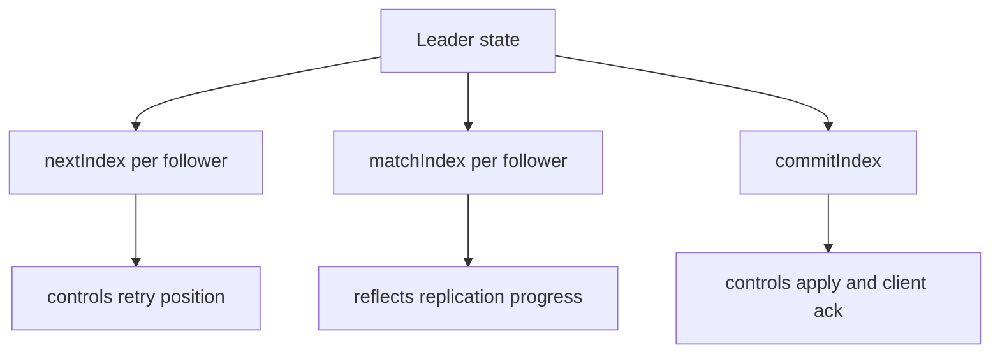
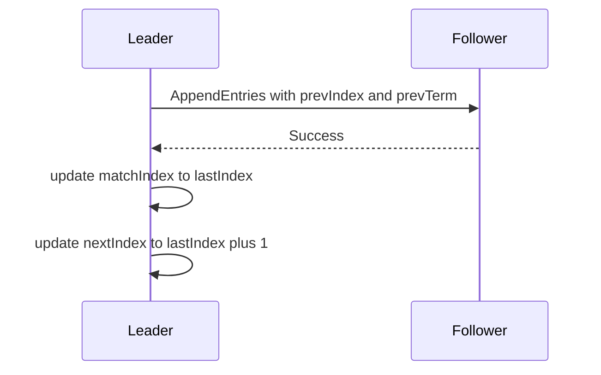
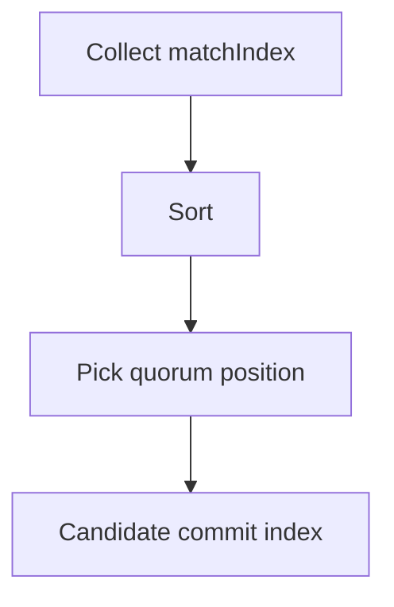
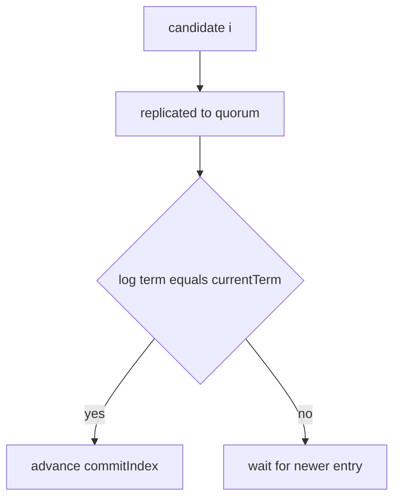

这篇把 Raft 实现里两个最常见、也最容易误用的 index 讲清楚：

- `matchIndex`（每个 follower 一份）：leader 认为该 follower 已经复制到的最高日志 index
- `commitIndex`（leader 一份）：系统已经可以对外承诺、并可应用到状态机的最高日志 index

核心结论：

- `matchIndex` 反映复制进度
- `commitIndex` 反映提交承诺
- **从 matchIndex 推 commitIndex 的规则，决定了“不会回滚已确认写”**

## 1. 三个 index 的最小模型：nextIndex / matchIndex / commitIndex

leader 通常会为每个 follower 维护：

- `nextIndex[f]`：下一次给 follower 发送的起始 index
- `matchIndex[f]`：已知 follower 已经匹配到的最高 index

leader 自己还有：

- `commitIndex`：已提交的最高 index

## 2. matchIndex 是怎么来的：AppendEntries 成功后推进

当 leader 给 follower 发 AppendEntries：

- follower 接受并写入日志
- 返回成功

leader 就可以更新：

- `matchIndex[f] = lastReplicatedIndex`
- `nextIndex[f] = matchIndex[f] + 1`

失败时（prevIndex/prevTerm 不匹配），leader 通常会回退 `nextIndex` 并重试，直到对齐日志前缀。

## 3. commitIndex 怎么算：多数派的“共同进度”

在多数派提交下，leader 想找到一个 index `i`，满足：

- 至少有多数派副本的 `matchIndex >= i`

最直觉的计算方法：

- 把所有副本（含 leader 自己）的 matchIndex 收集起来
- 排序
- 取多数派位置的那个值

然后 leader 会尝试把 `commitIndex` 推到这个候选值，但还需要一个非常关键的安全约束（下一节）。

## 4. 关键提交规则：不要“凭多数派”提交旧 term 的日志

这是 Raft 实现里非常关键、也经常被忽略的一点：

- leader 推进 commitIndex 时，通常只使用“当前 term 的 entry”作为锚点

原因：

- 旧 term 的 entry 可能在一些 failover 组合下出现“多数派复制看似满足，但并不能保证 leader completeness”
- 用当前 term entry 作为锚点，能保证一旦它被多数派复制，leader 的日志前缀具备更强的安全性质

工程上可以看到类似逻辑：

- 找到某个 `i`，它满足多数派 matchIndex
- 但只有当 `log[i].term == currentTerm` 时，才推进 commitIndex 到 i

## 5. 线上现象：为什么“慢副本”会把提交点拖死

可以看到两类典型指标：

- `matchIndex` 分布拉开：某些 follower 长期落后
- `commitIndex` 推进变慢：写延迟变长

原因很直接：

- 多数派提交把提交点绑定在“第 W 个 ack”的路径上
- 如果慢副本经常落入多数派集合，就会放大尾延迟

## 6. 应当观测什么（从最有用的开始）

- per-follower `matchIndex` 与 `nextIndex`（谁在落后）
- follower backlog（欠账多少 entry / bytes）
- AppendEntries 的 RTT 分布（P95/P99）
- leader commit latency（从 append 到 apply 的端到端延迟，如果可打点）
- leader 变更频率（频繁选主会进一步拖慢复制）

## 7. 排障顺序

1. 找出落后 follower（matchIndex 最低且持续）
2. 看落后原因：网络/磁盘/CPU/快照安装
3. 看拓扑：是否跨域导致 RTT 尾部过大
4. 再调整参数：超时、批量、窗口、限速

## 8. 小结

- matchIndex 是“每个副本跟到哪”
- commitIndex 是“系统能承诺到哪”
- 从 matchIndex 推 commitIndex 的规则（尤其“当前 term 锚点”）是安全性的关键
