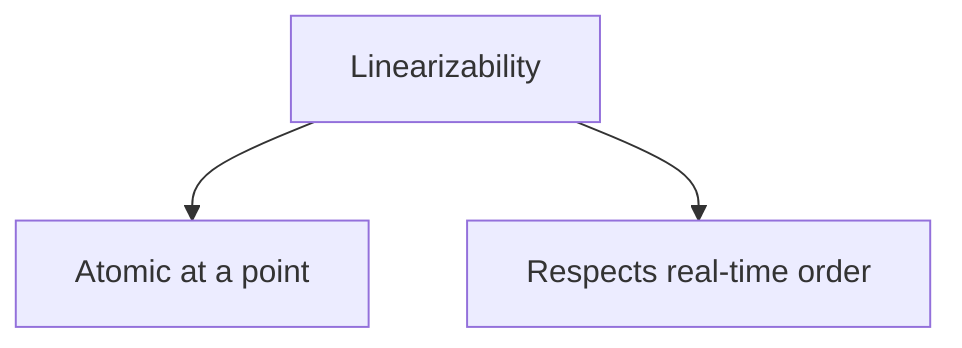
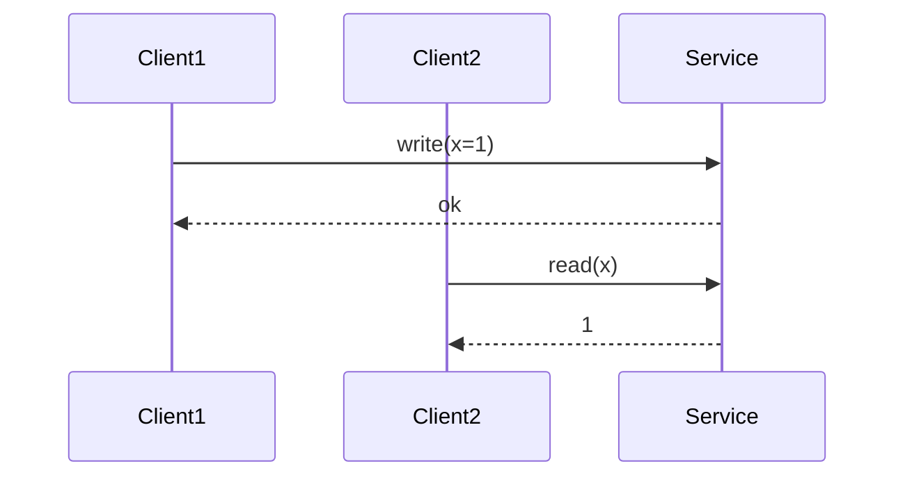
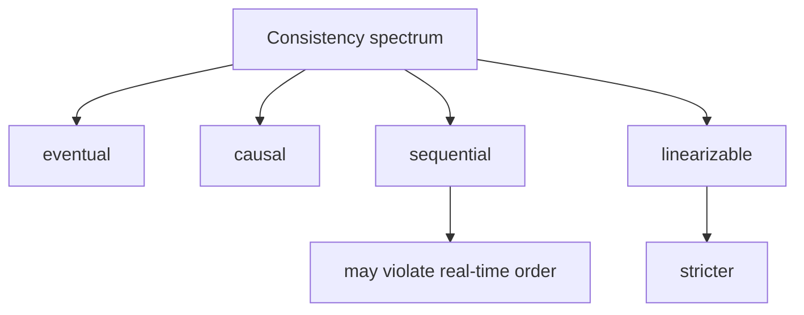
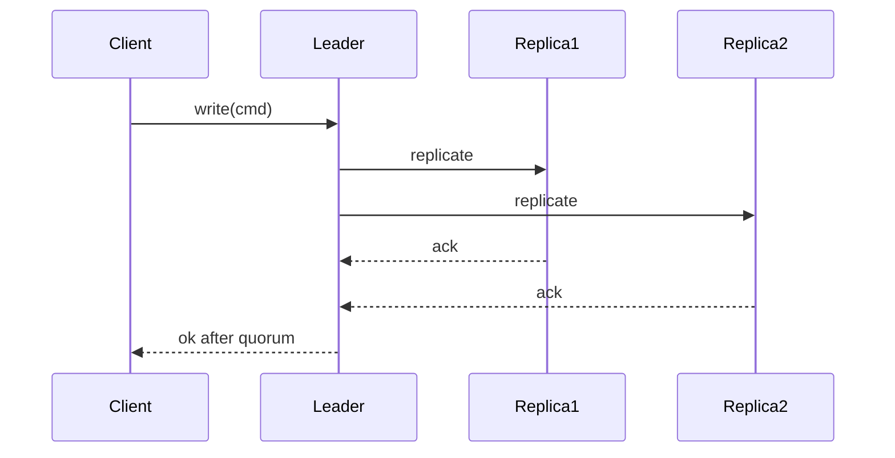
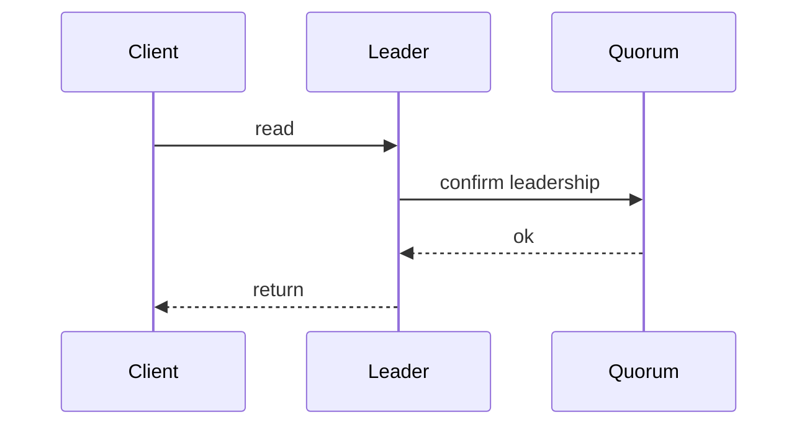

线性一致性（linearizability）这四个字经常被当成“强一致”的代名词，但工程里最重要的是：**它是一个可以用客户端观察来定义、也可以被测试与反证的语义**。

这篇从客户端视角讲清楚三件事：

- 线性一致性到底承诺什么
- 它和“顺序一致/最终一致”有什么不同
- 系统实现里哪些机制是在为线性一致服务

## 1. 线性一致性承诺什么：像单机一样，并且尊重真实时间

核心要点：

- 每个操作看起来都在某个时间点原子发生
- 且如果 A 在真实时间上先完成，再发生 B，那么全局顺序里 A 必须排在 B 前

## 2. 用一个客户端历史来理解：读必须看到“已完成的写”

考虑一个寄存器 `x` 初始为 0：

- 客户端1：写 x=1，并且收到了成功返回
- 客户端2：随后读 x

在线性一致系统里：

- 读必须返回 1（不能返回 0）

如果看到 `C2` 读到了 0，那么语义就不是线性一致（除非你能证明读发生在写完成之前）。

## 3. 线性一致 vs 顺序一致：差别在“真实时间”

顺序一致（sequential consistency）只要求：

- 存在某个全局顺序，让每个客户端自己的操作顺序保持不变

但它不要求尊重真实时间的先后。

工程要点：

- 线性一致更强、更直观
- 顺序一致更弱，但有时能换性能

## 4. 系统怎么实现线性一致：提交点 + 读屏障

线性一致通常离不开两个东西：

- **明确的提交点**：写成功返回之前，必须满足不会回滚（常见是多数派提交）
- **读屏障**：读必须确保自己不落后于已提交写（常见是 leader read + ReadIndex/lease）

### 4.1 写：多数派提交是常见实现路径

### 4.2 读：ReadIndex（或等价机制）

一种常见线性一致读路径：

- leader 先确认自己仍是 leader（与多数派交互一次）
- 得到一个安全的 read index
- 再返回状态机在该 index 的状态

不同系统会用不同名字实现同一件事：把读放到一个不会落后的“屏障”之后。

## 5. 工程上最常见的误区

- **“quorum 读写就线性一致”**：不一定，缺少 leader 排序/提交规则/读屏障时仍会破。
- **“只要读 leader 就线性一致”**：不一定，如果 leader 可能是旧 leader（租约/选主边界不清）就会破。
- **“线性一致读一定慢”**：通常需要一次多数派确认，但可以用批量/流水线/lease 在一定假设下优化。

## 6. 怎么验证：不要靠感觉

线性一致是可被反证的：只要你构造出一个违背真实时间顺序的历史，就能证明系统不满足。

工程里常见方法：

- 对关键路径打点（写完成时间、读开始时间、读返回值）
- 采样生成 history
- 用线性一致检查器验证（Jepsen 类思路）

## 7. 小结

线性一致不是“强一致”这个模糊词，而是一条明确承诺：尊重真实时间顺序的单机直觉。它在实现上通常对应“写有明确提交点、读有屏障”，在工程上对应“可测、可反证”。
