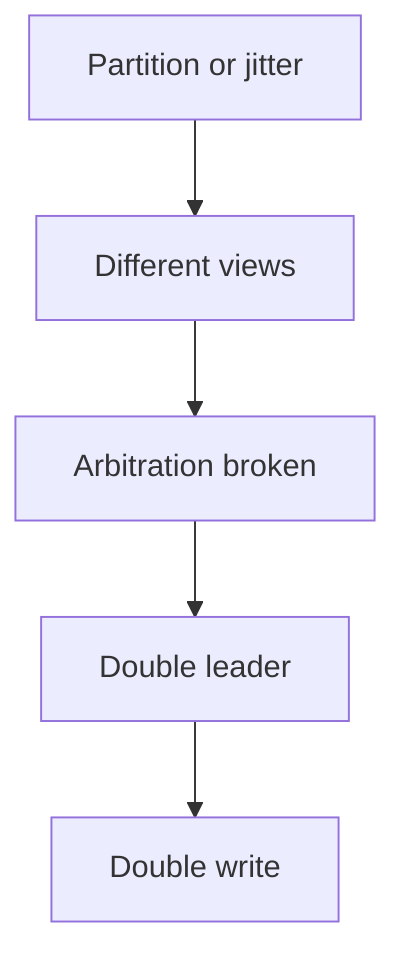
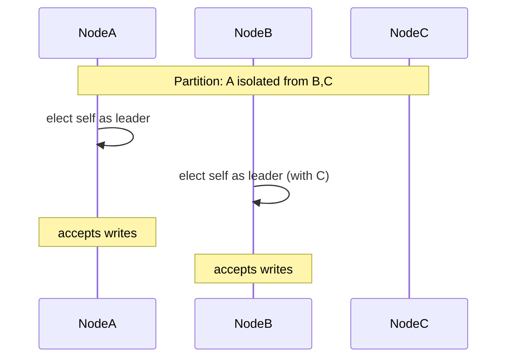
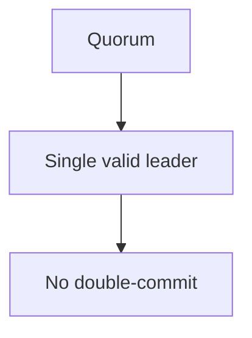
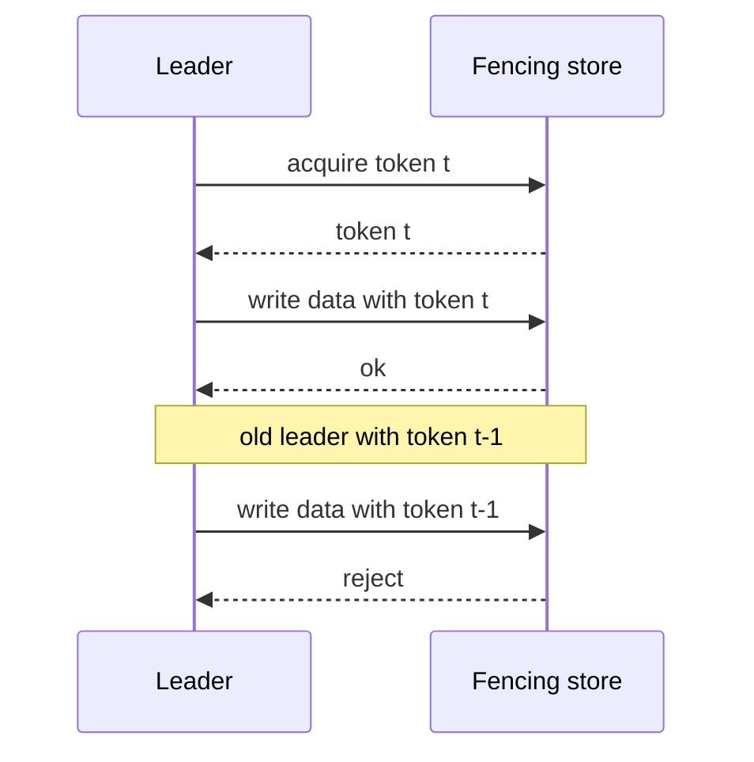

脑裂（split brain）的本质不是“网络断了”，而是：

- 同一时刻出现两个都认为自己有写权限的主（leader/primary）
- 并且两边都对外承诺成功

只要发生这件事，会遇到最难处理的后果：双写、数据分叉、回滚与人工对账。

## 1. 脑裂的必要条件：双主 + 双写

通常需要同时满足：

- 网络分区或强抖动（让集群对“谁活着”产生不同判断）
- 仲裁机制缺失或边界不严（两边都能形成“有效主”）
- 写路径允许对外 ack

## 2. 最常见的成因

### 2.1 网络分区 + 超时误判

- 心跳超时参数小于网络尾延迟
- follower 误判 leader 不可达
- 触发选主抖动，甚至双主

### 2.2 时钟与租约边界不清

如果使用 lease 来优化读写：

- 时钟漂移、GC pause、网络抖动会侵蚀 lease 边界
- 旧 leader 可能在 lease 不确定时仍继续对外写

### 2.3 异步复制主备（尤其是没有 fencing）

主备切换时如果没有明确的 fencing token：

- 旧 primary 可能“复活”继续写
- 新 primary 也在写

## 3. 一张图看清楚：没有仲裁的双主怎么出现

只要两边都能对外 ack，脑裂就不再是“可能”，而是“迟早”。

## 4. 怎么避免：仲裁（quorum）+ fencing（隔离）

### 4.1 用多数派仲裁：让双主不可能同时合法

- N=2f+1
- leader 必须拿到多数派
- 写必须多数派提交

这样网络分区时，只有一边能拿到多数派，另一边必须停写。

### 4.2 用 fencing token：让旧主即使“还活着”也写不进去

fencing token（也叫 epoch/term/generation）要点：

- 每次选主产生一个单调递增 token
- 任何写都必须带 token
- 资源侧（存储/执行器）拒绝旧 token 的写

在 Raft 里，term 就天然是 fencing token；在主备系统里，通常需要额外实现。

## 5. 工程上怎么降低误判

- 选主超时要贴合真实 RTT 分布（看 P99/P999）
- 把 GC/IO 抢占当成网络一样的“不可用来源”
- 对 leader 变更做降噪（避免频繁抖动）

## 6. 观测与排障：先找“是否存在双写迹象”

优先观测：

- leader 变更频率（是否抖动）
- quorum 确认路径的尾延迟
- 关键资源的 token/term 单调性（是否出现倒退写）
- 下游是否检测到重复写/冲突写（幂等键、版本冲突）

排障顺序：

1. 确认是否真的双主双写（日志/term/token）
2. 定位触发源：网络分区、长 GC、磁盘抖动、超时误判
3. 修仲裁边界：多数派/选主规则/提交点
4. 补 fencing：让旧主写不进去

## 7. 小结

脑裂不是“网络不可靠”的锅，而是“仲裁与隔离边界不严”的必然结果。用多数派保证唯一合法主，用 fencing token 保证旧主写不进去，才能把脑裂从系统里移除。
