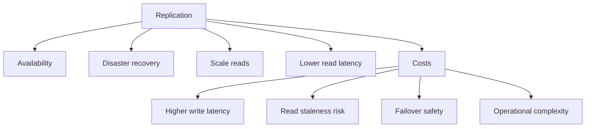
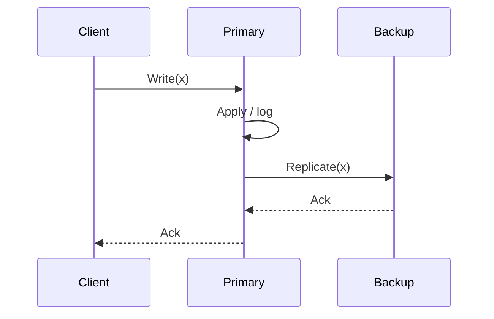
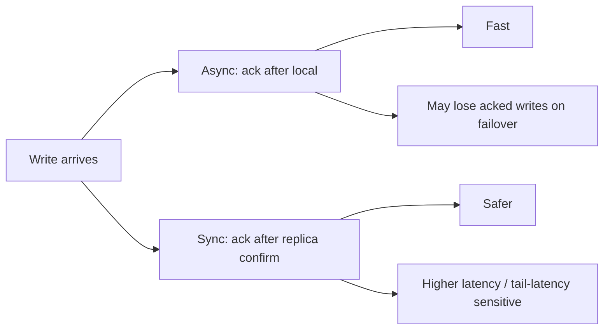
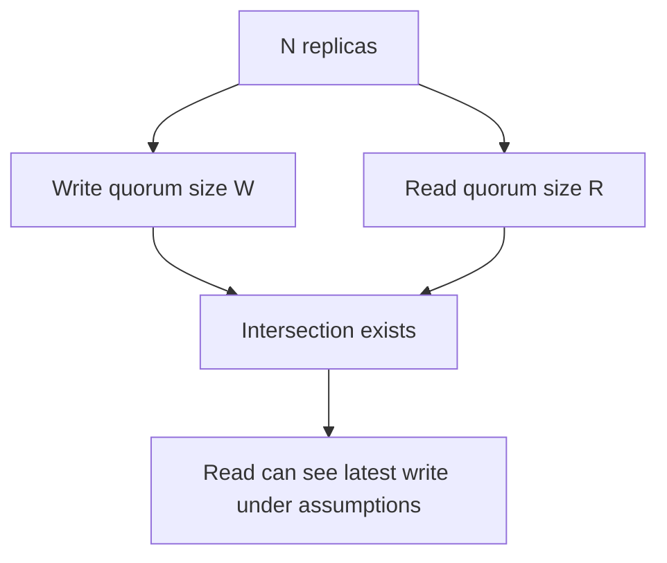
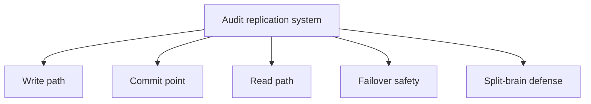

这篇作为“分布式一致性系列”第 1 篇，不从 Raft/Paxos 的细节开始，而是先把**复制（replication）到底在保证什么**讲清楚：

- 复制能换来什么（可用性/容灾/读扩展）
- 复制会引入什么（并发冲突/不一致窗口/脑裂）
- 不同复制策略对应的**一致性语义边界**是什么

读完本文，应当能用一组问题去审计任何“有副本的系统”：它的写入提交点在哪里、failover 会不会回滚已确认写、读是不是可能读到旧数据。

## 1. 为什么要复制：目标决定协议形态

复制最常见的目标：

- **高可用（Availability）**：单机/单盘/单进程挂了仍能服务
- **容灾（DR）**：跨机架/机房/可用区/地域
- **读扩展（Scale reads）**：多个副本分担读流量
- **延迟优化（Latency）**：就近读（但要面对一致性）

但注意：复制不是“免费午餐”。它会引入：

- 写路径变慢（网络 RTT + 多副本落盘/确认）
- 读路径变复杂（读哪个副本、读到旧怎么办）
- 故障切换的安全性问题（脑裂、回滚）

## 2. 复制最核心的问题：提交点（commit point）

可以将一个写入拆成三步：

1. primary 收到写请求
2. primary 在本地持久化（或者写入内存/日志）
3. 写被复制到其他副本，并达到某个“安全条件”

**提交点**就是：系统对外宣称“写成功”的那一刻。

- 提交点越靠前：写越快，但崩溃/切主越可能丢已确认写
- 提交点越靠后：写越慢，但安全性更强

接下来所有复制协议的差异，本质都在回答：

- “对外 ack 之前，到底需要哪些副本达成什么状态？”

## 3. Primary-Backup（主备）：最直觉的复制模型

### 3.1 基本写路径

### 3.2 同步备 vs 异步备

两种典型提交点：

- **异步复制（async）**：primary 本地写完就对外 ack，随后复制到 backup
  - 优点：低延迟
  - 缺点：primary 崩溃后可能丢已 ack 的写（RPO > 0）

- **同步复制（sync）**：必须等 backup（或多个 backup）确认后才 ack
  - 优点：不轻易丢已 ack 的写
  - 缺点：延迟受最慢副本影响（尾延迟）

### 3.3 failover 的关键：如何避免回滚已确认写

最危险的场景：

- primary 发生故障
- backup 被提升为新 primary
- 但 backup 没有旧 primary 上最后几笔已确认写

如果系统之前已经对外 ack，那这些写就会“被回滚”，这会破坏客户端对一致性的基本期待。

因此主备模型要想安全，必须解决：

- **选主（只有一个 primary）**
- **新 primary 的日志必须包含所有已提交写**

这会把你自然引向“多数派/日志”这类更强的复制条件。

## 4. Quorum（多数派）：用交集提供安全性直觉

Quorum 模型把复制抽象成 N 副本上的读写：

- 写入成功需要写到 **W 个副本**
- 读取需要读 **R 个副本**

如果副本数为 N，并且满足：

\[
R + W > N
\]

那么读集合与写集合一定有交集——**至少有一个副本同时见过最近一次写**，从而读更容易看到新值。

### 4.1 直觉图：为什么交集重要

### 4.2 常见配置与语义

- N=3：
  - W=2, R=2：偏强一致（读写都多数派），写慢、读也慢
  - W=2, R=1：写较强、读可能旧（单副本读）
  - W=1, R=2：读较强、写可能丢（单副本写）

可以发现：

- **想要更强语义**，必须让读或写触碰更多副本
- 这会把延迟推向尾延迟（最慢副本）

### 4.3 “R+W>N 就线性一致吗？”——不一定

这是常见误区。

`R+W>N` 在很多论文/系统里提供的是“读能看到最新写”的一个直觉条件，但要达到**线性一致（linearizability）**通常还需要：

- 写的顺序性（单写者/leader 排序）
- 副本的版本比较与冲突处理（比如读修复、版本向量）
- 更强的约束（例如 leader lease、严格的提交规则）

也就是说：quorum 是基础工具，但不是“语义自动升级器”。

## 5. 一致性语义：最终目标是什么

从弱到强常见有：

- **最终一致性（eventual）**：只保证最终收敛
- **因果一致性（causal）**：保持因果顺序
- **顺序一致性（sequential）**：全局某种顺序，但不一定符合真实时间
- **线性一致性（linearizability）**：像单机一样，且符合真实时间先后

建议用两个问题把语义说清楚：

- **读是否允许旧？允许旧多久/多少版本？**
- **写 ack 后是否可能回滚？**

## 6. 工程实践：一份审计 checklist

在阅读一个系统的复制实现时，优先问这几条（比背概念更有用）：

1. **写入路径**：写是不是先落日志？落在哪里（内存/本地盘/远端）？
2. **提交点**：对外 ack 需要满足什么条件（本地？同步备？多数派？）
3. **读路径**：读从哪读（leader/任意副本/quorum）？读到旧怎么办（read repair）？
4. **故障切换**：新 leader 如何保证不回滚已提交写？
5. **脑裂防护**：是否有 lease/fencing token/epoch 来阻止旧 leader 继续写？

## 7. 小结：下一篇为什么要看 Raft

本文我们把“复制的目标与代价、提交点、主备与多数派直觉”讲清楚了。

下一篇进入 Raft：可以看到它如何用 **leader + 日志复制 + 多数派提交** 把“提交点与 failover 安全性”做成可实现的协议。
