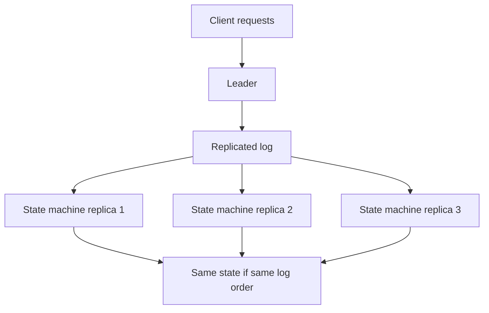
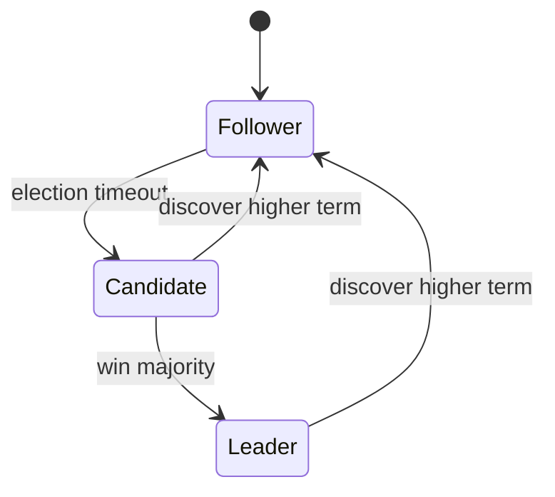
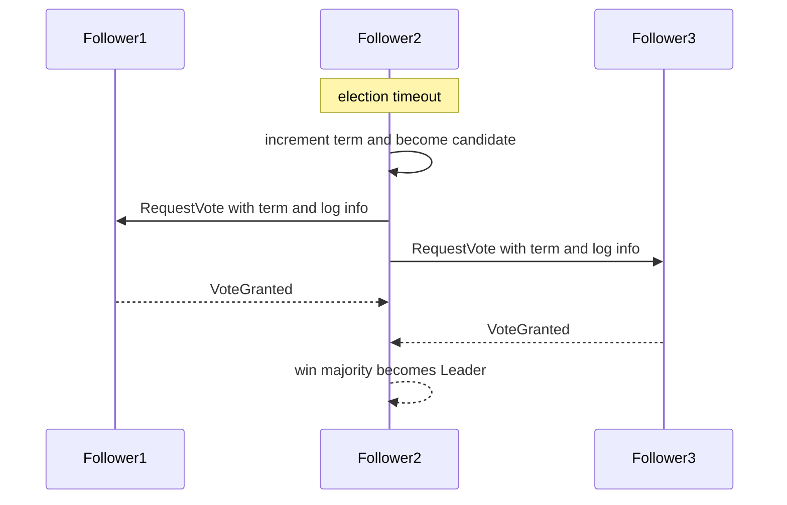
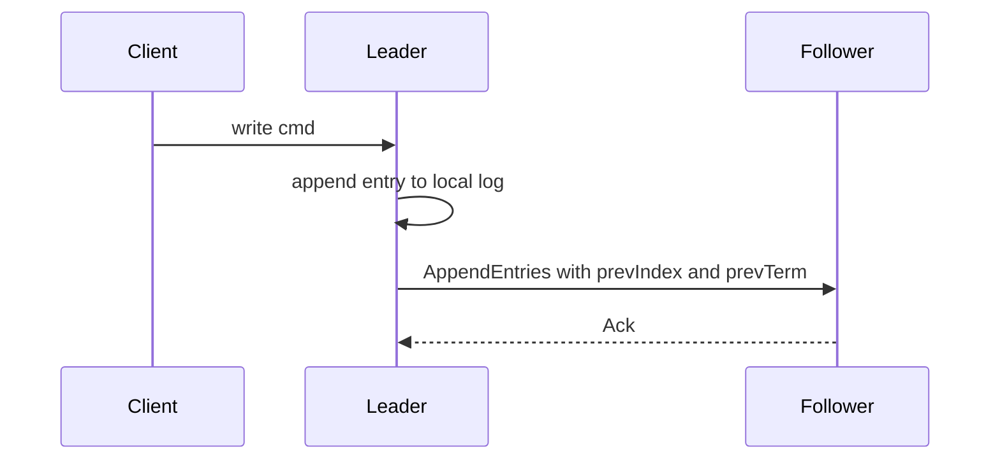
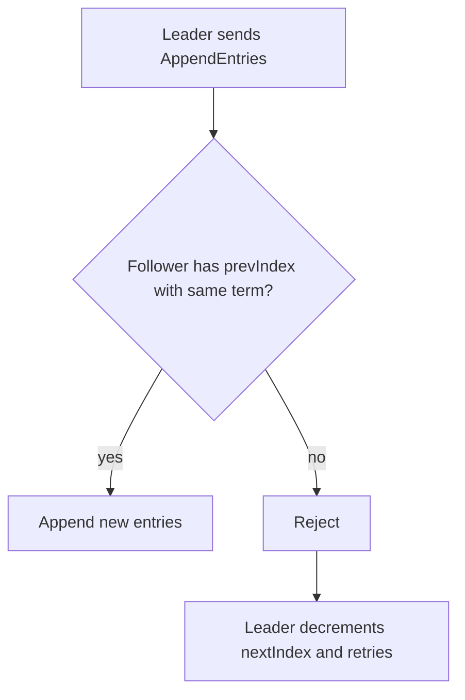
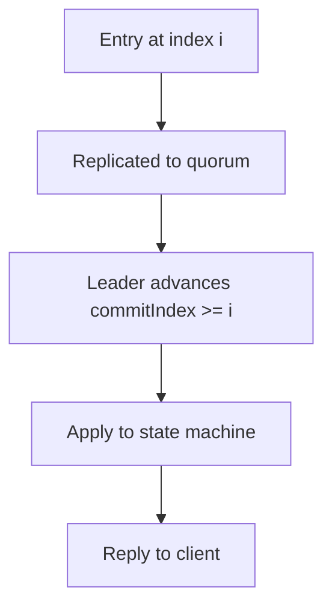
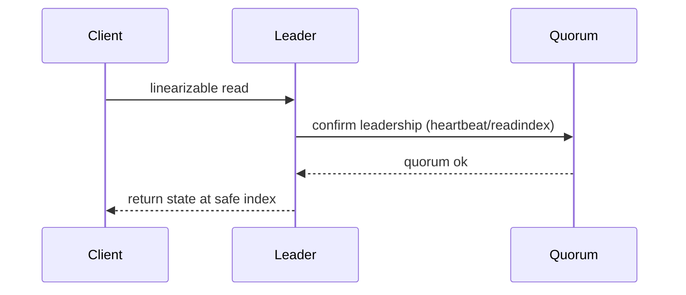
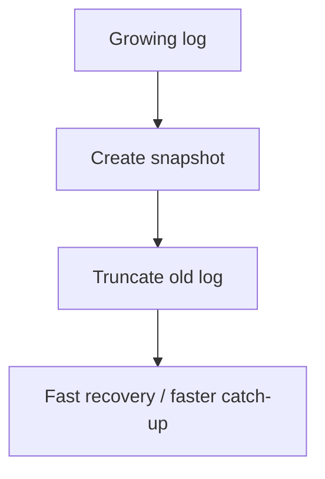
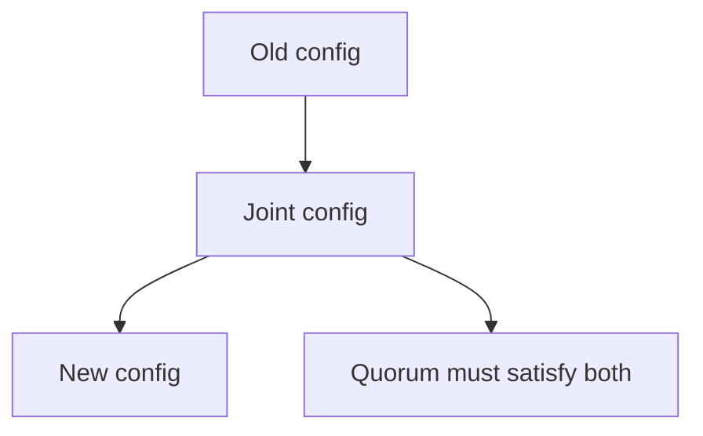

本文梳理 Raft 的核心机制“讲透但不啰嗦”：无需背完所有 RPC 字段，也能理解它为什么安全、为什么能工作、工程里该关注哪些边界条件。

Raft 的核心要点：**用 leader 把写入序列化成日志（log），用多数派复制把日志变成已提交（committed），然后把已提交日志应用到状态机（state machine）**。

## 1. Raft 在解决什么问题：复制状态机（RSM）

可以将一个强一致系统抽象为“复制状态机”：

- 所有副本按同样顺序执行同样的命令（log entries）
- 只要顺序一致，状态就一致

Raft 的难点不在“追加日志”，而在：

- leader 会挂
- 网络会分区
- 消息会丢/延迟/乱序

仍需保证：**不会回滚已提交写**。

## 2. 角色与任期：Leader/Follower/Candidate + Term

Raft 的第一层安全机制：**任期 term**。

- term 单调递增
- 每个 term 最多一个 leader

> 要点：term 是“纪元号”。任何旧 leader 的消息，只要 term 落后，就会被拒绝。

## 3. 选举：怎么选出唯一 leader（避免脑裂）

### 3.1 选举触发：election timeout

- follower 在一段时间没收到 leader 心跳，就认为 leader 可能挂了
- 发起选举，进入 candidate

### 3.2 选举过程：RequestVote + 多数派

### 3.3 选举安全关键：谁更“新”

投票不是“谁先来就投谁”，而是要保证新 leader 不会丢已提交日志。

Raft 用一个简单规则：

- candidate 必须“至少和我一样新”（lastLogTerm 更大，或 term 相同且 lastLogIndex 更大）

这让“日志更落后的人”拿不到多数派投票。

## 4. 日志复制：AppendEntries 的直觉

### 4.1 写入变成 log entry

客户端写入被 leader 转成一条 log entry（包含 command）。

- leader 先追加到本地 log
- 再复制给 followers

### 4.2 日志匹配（log matching）：冲突怎么处理

AppendEntries 里最关键的字段不是 entries，而是：

- `prevLogIndex` / `prevLogTerm`

含义：

- follower 只有在自己的 `prevLogIndex` 位置的 term 与 leader 相同，才接受后续 entries
- 否则拒绝，让 leader 回退并重试

这会强制所有副本在同一 index 上拥有同一 term（匹配性质），从而保证日志前缀一致。

## 5. 提交（commit）：什么时候可以对外 ack

最常见误区：

- “只要 leader 写到自己就算提交” —— 错

Raft 的 commit 要点：

- 一条日志 entry 必须复制到多数派，leader 才能推进 `commitIndex`
- 只有 `index <= commitIndex` 的 entry 才允许应用到状态机，并对外“算数”

### 5.1 关键安全规则：只提交当前 term 的日志（直觉版）

Raft 有一个非常关键但经常被忽略的规则：

- leader 只能用“多数派复制”来推进当前 term 的 entry 为已提交

这样可以避免在某些复杂 failover 场景下“旧 term 的 entry 被误提交”。

（你在工程里读代码时，通常会看到类似 `if entry.term == currentTerm` 才用 matchIndex 推进 commit 的逻辑。）

## 6. 读：强一致读到底怎么做（工程关注点）

Raft 本身是写一致协议，但系统最终需要回答：

- 读是不是一定读 leader？
- follower 能不能读？读到旧怎么办？

常见工程选择：

- **leader read**：所有读都走 leader（简单但可能成为热点）
- **lease read**：leader 通过 lease 认为自己仍是 leader，允许本地读
- **ReadIndex**：通过与多数派确认“我仍是 leader”，拿到一个安全 read index 再读

## 7. 快照与日志截断：为什么必须做

日志无限增长会导致：

- 启动恢复慢
- 新节点追赶慢

Raft 的工程解法：

- 定期生成 snapshot（状态机快照）
- 截断已包含在快照里的旧日志

## 8. 成员变更：joint consensus 的必要性（先建立直觉）

成员变更难点：

- 不能在一次切换里“突然换掉多数派集合”，否则可能出现两个不同多数派同时提交

经典做法是 joint consensus：

- 在过渡阶段同时满足旧配置与新配置的多数派

（这部分我们会在后续“成员变更”笔记里深入。）

## 9. 工程 checklist：读 Raft 实现时优先看哪里

1. **选举**：term 递增、投票规则、lastLogTerm/lastLogIndex 比较
2. **复制**：prevIndex/prevTerm 检查、冲突回退 nextIndex 的策略
3. **提交**：commitIndex 推进条件、只提交当前 term 规则
4. **读语义**：ReadIndex/lease 的实现与边界
5. **恢复**：snapshot + log replay 的路径
6. **成员变更**：joint consensus 是否完整实现

## 10. 小结

Raft 之所以“直觉”，是因为它把一致性拆成几个可理解的机制：

- term 解决“谁是 leader”
- log matching 解决“日志前缀一致”
- quorum commit 解决“提交不回滚”

只要把这三件事抓牢，就能读懂绝大多数基于 Raft 的系统。
