## 前言

最近因为工作需要，我开始深入接触 IndexLib 这个阿里巴巴 Havenask 搜索引擎的核心索引库。IndexLib 是一个高性能、可扩展的 C++ 索引引擎，代码量庞大、设计精良，但文档相对较少。为了更好地理解决其设计理念和实现细节，我决定通过详细阅读源码的方式来学习，并将学习过程中的理解和思考整理成系列文章。


**IndexLib 整体架构**：

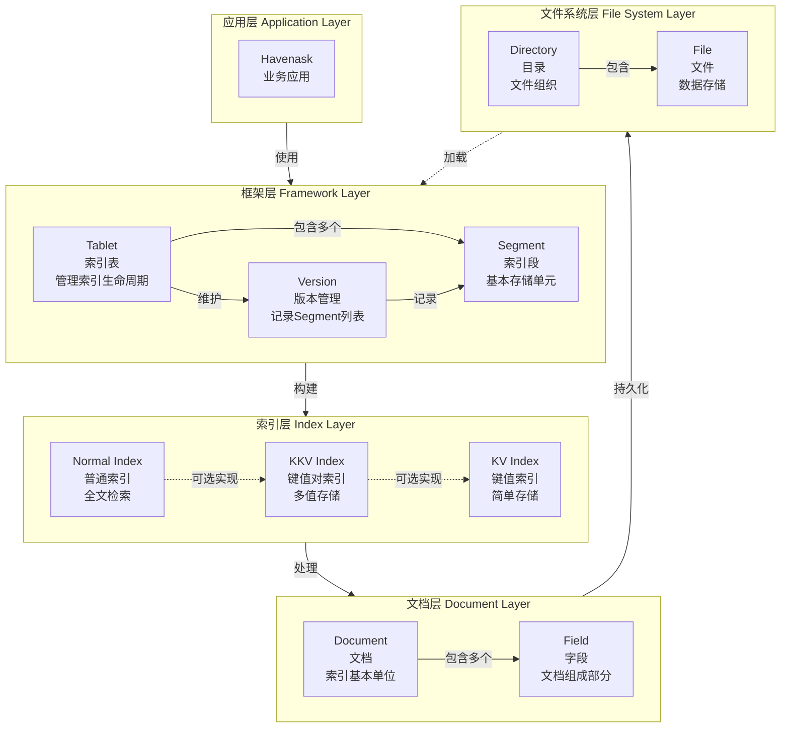
```mermaid
flowchart TB
    subgraph Application["应用层 Application Layer"]
        direction LR
        Havenask["Havenask<br/>业务应用"]
    end
    
    subgraph Framework["框架层 Framework Layer"]
        direction LR
        Tablet["Tablet<br/>索引表<br/>管理索引生命周期"]
        Segment["Segment<br/>索引段<br/>基本存储单元"]
        Version["Version<br/>版本管理<br/>记录Segment列表"]
        Tablet -->|包含多个| Segment
        Tablet -->|维护| Version
        Version -->|记录| Segment
    end
    
    subgraph Index["索引层 Index Layer"]
        direction LR
        Normal["Normal Index<br/>普通索引<br/>全文检索"]
        KKV["KKV Index<br/>键值对索引<br/>多值存储"]
        KV["KV Index<br/>键值索引<br/>简单存储"]
        Normal -.->|可选实现| KKV
        KKV -.->|可选实现| KV
    end
    
    subgraph Document["文档层 Document Layer"]
        direction LR
        Doc["Document<br/>文档<br/>索引基本单位"]
        Field["Field<br/>字段<br/>文档组成部分"]
        Doc -->|包含多个| Field
    end
    
    subgraph FileSystem["文件系统层 File System Layer"]
        direction LR
        Directory["Directory<br/>目录<br/>文件组织"]
        File["File<br/>文件<br/>数据存储"]
        Directory -->|包含| File
    end
    
    Application -->|使用| Framework
    Framework -->|构建| Index
    Index -->|处理| Document
    Document -->|持久化| FileSystem
    FileSystem -.->|加载| Framework
```

## 1. IndexLib 是什么

IndexLib 是 Havenask 搜索引擎的底层索引库，负责：

- **索引构建**：从原始文档构建倒排索引、正排索引等
- **索引存储**：管理索引文件的存储格式和布局
- **索引查询**：提供高效的索引查询接口
- **增量更新**：支持实时写入和增量更新
- **版本管理**：管理索引版本和增量合并

IndexLib 采用 C++ 实现，追求极致性能，支持大规模数据实时检索和高并发查询与写入。

## 2. 整体架构设计

### 2.1 分层架构

IndexLib 采用清晰的分层架构：

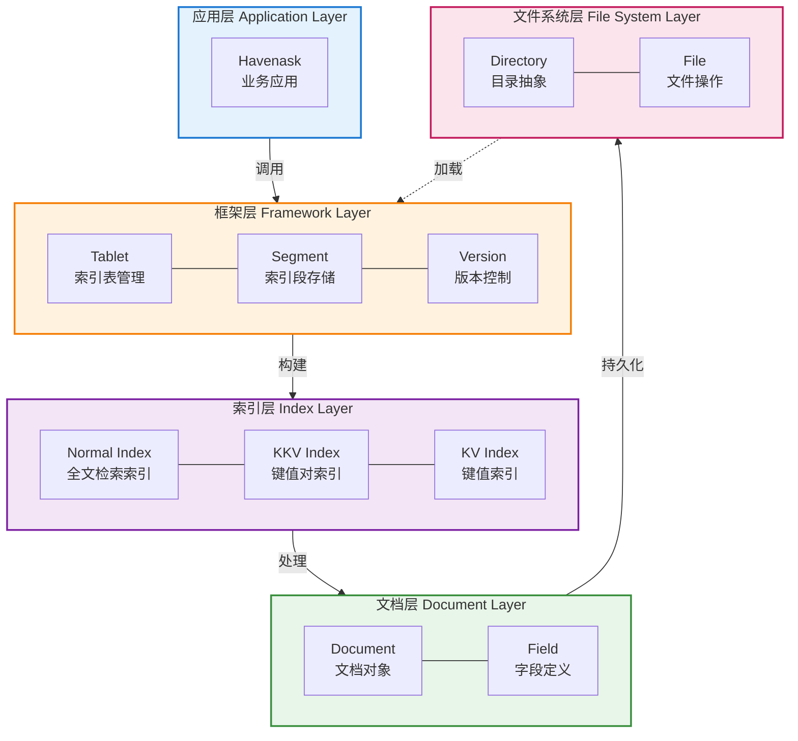
```mermaid
flowchart TB
    subgraph App["应用层 Application Layer"]
        direction LR
        Havenask["Havenask<br/>业务应用"]
    end
    
    subgraph Framework["框架层 Framework Layer"]
        direction LR
        Tablet["Tablet<br/>索引表管理"] --- Segment["Segment<br/>索引段存储"] --- Version["Version<br/>版本控制"]
    end
    
    subgraph Index["索引层 Index Layer"]
        direction LR
        Normal["Normal Index<br/>全文检索索引"] --- KKV["KKV Index<br/>键值对索引"] --- KV["KV Index<br/>键值索引"]
    end
    
    subgraph Document["文档层 Document Layer"]
        direction LR
        Doc["Document<br/>文档对象"] --- Field["Field<br/>字段定义"]
    end
    
    subgraph FileSystem["文件系统层 File System Layer"]
        direction LR
        Directory["Directory<br/>目录抽象"] --- File["File<br/>文件操作"]
    end
    
    App -->|调用| Framework
    Framework -->|构建| Index
    Index -->|处理| Document
    Document -->|持久化| FileSystem
    FileSystem -.->|加载| Framework
    
    style App fill:#e3f2fd,stroke:#1976d2,stroke-width:2px
    style Framework fill:#fff3e0,stroke:#f57c00,stroke-width:2px
    style Index fill:#f3e5f5,stroke:#7b1fa2,stroke-width:2px
    style Document fill:#e8f5e9,stroke:#388e3c,stroke-width:2px
    style FileSystem fill:#fce4ec,stroke:#c2185b,stroke-width:2px
```

**各层职责**：

- **Framework Layer**：提供 Tablet、Segment、Version 等核心抽象，管理索引生命周期
- **Index Layer**：实现具体的索引类型（Normal、KKV、KV），提供索引构建和查询能力
- **Document Layer**：处理文档的解析、验证、转换
- **File System Layer**：抽象文件系统，支持本地文件系统、分布式文件系统等

### 2.2 核心组件关系

IndexLib 的核心组件采用清晰的职责划分和接口设计，通过组合和依赖注入实现灵活的扩展。让我们通过类图来理解各组件的关系：

**核心组件类图**：

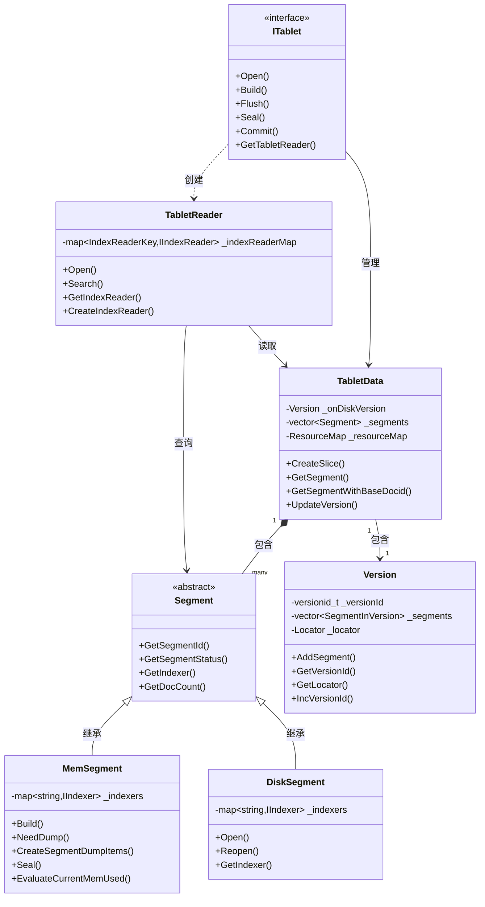
```mermaid
classDiagram
    class ITablet {
        <<interface>>
        +Open()
        +Build()
        +Flush()
        +Seal()
        +Commit()
        +GetTabletReader()
    }
    
    class TabletData {
        -Version _onDiskVersion
        -vector~Segment~ _segments
        -ResourceMap _resourceMap
        +CreateSlice()
        +GetSegment()
        +GetSegmentWithBaseDocid()
        +UpdateVersion()
    }
    
    class Segment {
        <<abstract>>
        +GetSegmentId()
        +GetSegmentStatus()
        +GetIndexer()
        +GetDocCount()
    }
    
    class MemSegment {
        -map~string,IIndexer~ _indexers
        +Build()
        +NeedDump()
        +CreateSegmentDumpItems()
        +Seal()
        +EvaluateCurrentMemUsed()
    }
    
    class DiskSegment {
        -map~string,IIndexer~ _indexers
        +Open()
        +Reopen()
        +GetIndexer()
    }
    
    class Version {
        -versionid_t _versionId
        -vector~SegmentInVersion~ _segments
        -Locator _locator
        +AddSegment()
        +GetVersionId()
        +GetLocator()
        +IncVersionId()
    }
    
    class TabletReader {
        -map~IndexReaderKey,IIndexReader~ _indexReaderMap
        +Open()
        +Search()
        +GetIndexReader()
        +CreateIndexReader()
    }
    
    ITablet --> TabletData : 管理
    TabletData "1" *-- "many" Segment : 包含
    Segment <|-- MemSegment : 继承
    Segment <|-- DiskSegment : 继承
    TabletData "1" --> "1" Version : 包含
    TabletReader --> TabletData : 读取
    TabletReader --> Segment : 查询
    ITablet ..> TabletReader : 创建
```

**核心组件职责**：

1. **ITablet**：索引表的核心接口，管理索引的构建、查询、版本等
   - **设计模式**：接口隔离原则，通过接口定义核心能力，具体实现由子类完成
   - **生命周期管理**：管理 Tablet 从 Open 到 Close 的完整生命周期
   - **线程安全**：接口设计考虑并发场景，支持多线程构建和查询

2. **TabletData**：管理索引数据，包含多个 Segment
   - **数据组织**：通过有序的 Segment 列表组织索引数据
   - **资源管理**：通过 ResourceMap 共享内存池、缓存等资源，减少内存开销
   - **Slice 机制**：提供灵活的 Segment 筛选接口，支持按状态、类型等条件筛选

3. **Segment**：索引的基本单元，分为 MemSegment（内存段）和 DiskSegment（磁盘段）
   - **多态设计**：通过抽象基类定义统一接口，MemSegment 和 DiskSegment 实现不同策略
   - **状态管理**：通过 SegmentStatus 管理 Segment 的状态转换
   - **索引管理**：每个 Segment 包含多个 Indexer（倒排索引、正排索引等）

4. **Version**：版本信息，记录索引包含哪些 Segment
   - **版本控制**：通过单调递增的 VersionId 保证版本顺序
   - **Schema 演进**：每个 Segment 记录自己的 SchemaId，支持 Schema 变更
   - **增量更新**：通过 Locator 记录数据处理位置，支持增量更新

5. **TabletReader**：提供索引查询接口
   - **查询抽象**：通过 JSON 格式的查询接口，隐藏底层实现细节
   - **IndexReader 缓存**：缓存 IndexReader 实例，避免重复创建
   - **并行查询**：支持对多个 Segment 进行并行查询，提高查询性能

6. **TabletWriter**：提供索引构建接口
   - **批量写入**：支持批量写入文档，提高写入性能
   - **内存管理**：通过 MemoryQuotaController 控制内存使用
   - **异步转储**：MemSegment 转储是异步的，不阻塞写入

## 3. 核心概念详解

### 3.1 Tablet：索引表

**Tablet** 是 IndexLib 中最核心的概念，代表一个完整的索引表。它采用组合模式，将 Schema、TabletData、Version、Options 等组件组合在一起，形成一个完整的索引抽象。

**Tablet 的结构**：

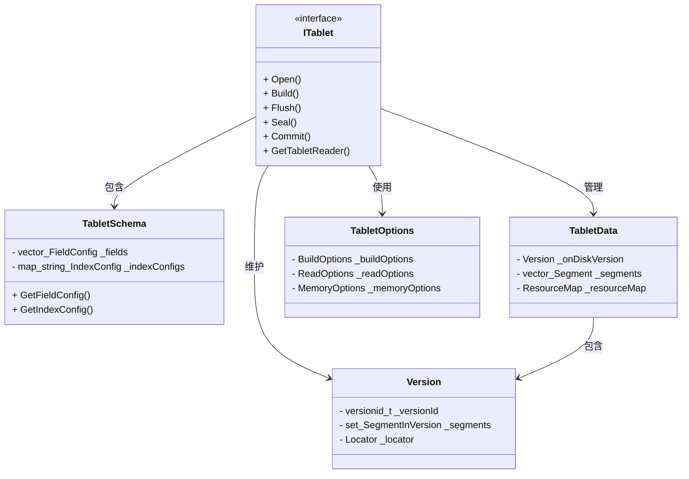
```mermaid
classDiagram
    class ITablet {
        <<interface>>
        + Open()
        + Build()
        + Flush()
        + Seal()
        + Commit()
        + GetTabletReader()
    }
    
    class TabletSchema {
        - vector_FieldConfig _fields
        - map_string_IndexConfig _indexConfigs
        + GetFieldConfig()
        + GetIndexConfig()
    }
    
    class TabletData {
        - Version _onDiskVersion
        - vector_Segment _segments
        - ResourceMap _resourceMap
    }
    
    class Version {
        - versionid_t _versionId
        - set_SegmentInVersion _segments
        - Locator _locator
    }
    
    class TabletOptions {
        - BuildOptions _buildOptions
        - ReadOptions _readOptions
        - MemoryOptions _memoryOptions
    }
    
    ITablet --> TabletSchema : 包含
    ITablet --> TabletData : 管理
    ITablet --> Version : 维护
    ITablet --> TabletOptions : 使用
    TabletData --> Version : 包含
```

**Tablet 的组成**：

1. **Schema**：索引的 schema 定义，描述字段、索引类型等
   - **字段定义**：定义索引包含哪些字段，每个字段的类型、是否索引等
   - **索引配置**：定义倒排索引、正排索引、摘要等的配置
   - **Schema 演进**：支持 Schema 变更，每个 Segment 可以有不同的 SchemaId

2. **TabletData**：索引数据，包含多个 Segment
   - **Segment 管理**：管理所有 Segment（MemSegment + DiskSegment）的生命周期
   - **资源共享**：通过 ResourceMap 共享内存池、缓存等资源
   - **版本管理**：通过 Version 记录哪些 Segment 已持久化

3. **Version**：当前版本信息
   - **版本号**：单调递增的版本号，保证版本顺序
   - **Segment 列表**：记录该版本包含哪些 Segment
   - **Locator**：记录数据处理位置，用于增量更新

4. **Options**：配置选项
   - **构建配置**：控制构建行为（批量大小、内存限制等）
   - **查询配置**：控制查询行为（缓存策略、并行度等）
   - **内存配置**：控制内存使用（内存配额、回收策略等）

**设计原理**：

- **组合优于继承**：Tablet 通过组合 Schema、TabletData、Version 等组件，而不是通过继承，提高了灵活性和可测试性
- **接口隔离**：通过 ITablet 接口定义核心能力，具体实现由子类完成，支持多种索引类型（Normal、KKV、KV）
- **依赖注入**：Schema、Options 等通过构造函数或方法参数注入，便于测试和扩展

现在让我们看看代码中的定义（`framework/ITablet.h`）：

```cpp
class ITablet : private autil::NoCopyable
{
public:
    // 打开索引：从磁盘加载已有索引或创建新索引
    virtual Status Open(const IndexRoot& indexRoot, 
                       const std::shared_ptr<config::ITabletSchema>& schema,
                       const std::shared_ptr<config::TabletOptions>& options,
                       const VersionCoord& versionCoord) = 0;
    
    // 构建索引：接收文档批次并写入内存段
    virtual Status Build(const std::shared_ptr<document::IDocumentBatch>& batch) = 0;
    
    // 刷新：将内存数据刷新到磁盘
    virtual Status Flush() = 0;
    
    // 封存：封存当前 Segment，准备合并
    virtual Status Seal() = 0;
    
    // 提交版本：创建新版本并持久化
    virtual std::pair<Status, VersionMeta> Commit(const CommitOptions& commitOptions) = 0;
    
    // 获取查询接口
    virtual std::shared_ptr<ITabletReader> GetTabletReader() const = 0;
};
```

**Tablet 的生命周期流程**：

Tablet 生命周期：从 Open 到 Commit 的完整流程：

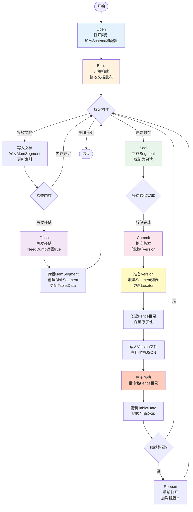
```mermaid
flowchart TD
    Start([开始]) --> Open[Open<br/>打开索引<br/>加载Schema和配置]
    
    Open --> Build[Build<br/>开始构建<br/>接收文档批次]
    
    Build --> Building{持续构建}
    
    Building -->|接收文档| WriteDoc[写入文档<br/>写入MemSegment<br/>更新索引]
    
    WriteDoc --> CheckMem{检查内存}
    
    CheckMem -->|内存充足| Building
    CheckMem -->|需要转储| Flush[Flush<br/>触发转储<br/>NeedDump返回true]
    
    Flush --> Dump[转储MemSegment<br/>创建DiskSegment<br/>更新TabletData]
    
    Dump --> Building
    
    Building -->|需要封存| Seal[Seal<br/>封存Segment<br/>标记为只读]
    
    Seal --> WaitDump{等待转储完成}
    
    WaitDump -->|转储完成| Commit[Commit<br/>提交版本<br/>创建新Version]
    
    Commit --> PrepareVersion[准备Version<br/>收集Segment列表<br/>更新Locator]
    
    PrepareVersion --> CreateFence[创建Fence目录<br/>保证原子性]
    
    CreateFence --> WriteVersion[写入Version文件<br/>序列化为JSON]
    
    WriteVersion --> AtomicSwitch[原子切换<br/>重命名Fence目录]
    
    AtomicSwitch --> UpdateTablet[更新TabletData<br/>切换到新版本]
    
    UpdateTablet --> Continue{继续构建?}
    
    Continue -->|是| Building
    Continue -->|否| Reopen[Reopen<br/>重新打开<br/>加载新版本]
    
    Reopen --> Building
    
    Building -->|关闭索引| End([结束])
    
    style Open fill:#e3f2fd
    style Build fill:#fff3e0
    style Flush fill:#f3e5f5
    style Seal fill:#e8f5e9
    style Commit fill:#fce4ec
    style PrepareVersion fill:#fff9c4
    style AtomicSwitch fill:#ffccbc
```

**Tablet 生命周期状态图**：

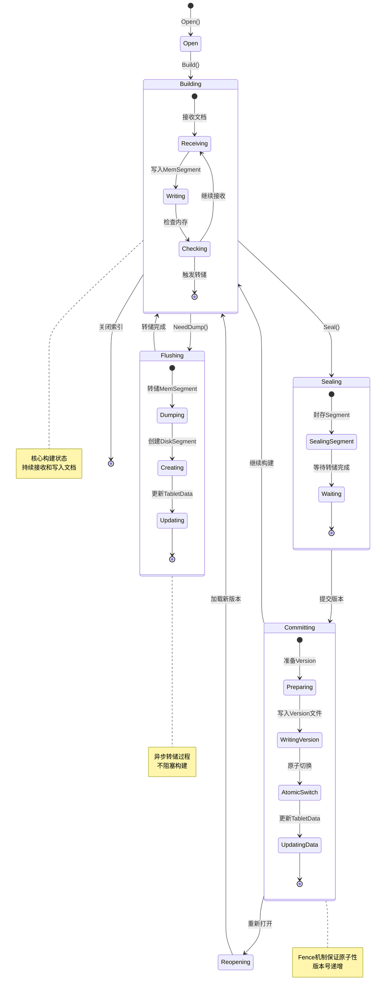
```mermaid
stateDiagram-v2
    [*] --> Open: Open()
    
    Open --> Building: Build()
    
    state Building {
        [*] --> Receiving: 接收文档
        Receiving --> Writing: 写入MemSegment
        Writing --> Checking: 检查内存
        Checking --> Receiving: 继续接收
        Checking --> [*]: 触发转储
    }
    
    Building --> Flushing: NeedDump()
    
    state Flushing {
        [*] --> Dumping: 转储MemSegment
        Dumping --> Creating: 创建DiskSegment
        Creating --> Updating: 更新TabletData
        Updating --> [*]
    }
    
    Flushing --> Building: 转储完成
    
    Building --> Sealing: Seal()
    
    state Sealing {
        [*] --> SealingSegment: 封存Segment
        SealingSegment --> Waiting: 等待转储完成
        Waiting --> [*]
    }
    
    Sealing --> Committing: 提交版本
    
    state Committing {
        [*] --> Preparing: 准备Version
        Preparing --> WritingVersion: 写入Version文件
        WritingVersion --> AtomicSwitch: 原子切换
        AtomicSwitch --> UpdatingData: 更新TabletData
        UpdatingData --> [*]
    }
    
    Committing --> Building: 继续构建
    Committing --> Reopening: 重新打开
    
    Reopening --> Building: 加载新版本
    
    Building --> [*]: 关闭索引
    
    note right of Building
        核心构建状态
        持续接收和写入文档
    end note
    
    note right of Flushing
        异步转储过程
        不阻塞构建
    end note
    
    note right of Committing
        Fence机制保证原子性
        版本号递增
    end note
```

1. **Open**：打开已有索引或创建新索引，加载 Schema 和配置
2. **Build**：持续构建，接收文档并写入内存段（MemSegment）
3. **Flush**：将内存段刷新到磁盘，创建磁盘段（DiskSegment）
4. **Seal**：封存 Segment，标记为只读，准备合并
5. **Commit**：提交新版本，更新 Version，持久化到磁盘
6. **Reopen**：重新打开，加载新版本，更新 TabletData

### 3.2 Segment：索引段

**Segment** 是索引的基本存储单元，一个 Tablet 包含多个 Segment。让我们先通过图来理解 Segment 的类型和关系：

**Segment 类型关系**：

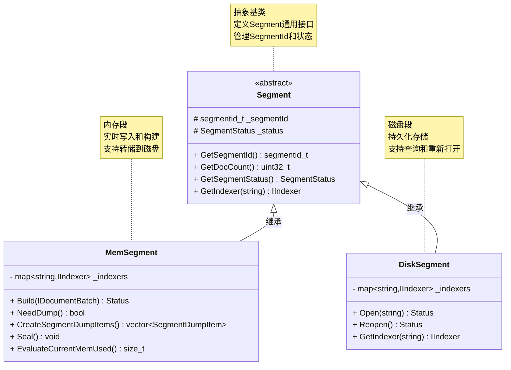
```mermaid
classDiagram
    class Segment {
        <<abstract>>
        # segmentid_t _segmentId
        # SegmentStatus _status
        + GetSegmentId() segmentid_t
        + GetDocCount() uint32_t
        + GetSegmentStatus() SegmentStatus
        + GetIndexer(string) IIndexer
    }
    
    class MemSegment {
        - map~string,IIndexer~ _indexers
        + Build(IDocumentBatch) Status
        + NeedDump() bool
        + CreateSegmentDumpItems() vector~SegmentDumpItem~
        + Seal() void
        + EvaluateCurrentMemUsed() size_t
    }
    
    class DiskSegment {
        - map~string,IIndexer~ _indexers
        + Open(string) Status
        + Reopen() Status
        + GetIndexer(string) IIndexer
    }
    
    Segment <|-- MemSegment : 继承
    Segment <|-- DiskSegment : 继承
    
    note for Segment "抽象基类<br/>定义Segment通用接口<br/>管理SegmentId和状态"
    note for MemSegment "内存段<br/>实时写入和构建<br/>支持转储到磁盘"
    note for DiskSegment "磁盘段<br/>持久化存储<br/>支持查询和重新打开"
```

从图中可以看到，Segment 有两种类型：
- **MemSegment**：内存段，用于实时写入
- **DiskSegment**：磁盘段，用于持久化存储和查询

#### MemSegment：内存段

MemSegment 在内存中构建，支持实时写入。让我们看看关键代码（`framework/MemSegment.h`）：

```cpp
class MemSegment : public Segment
{
public:
    // 构建文档：将文档写入内存段
    virtual Status Build(document::IDocumentBatch* batch) = 0;
    
    // 是否需要转储：判断是否达到转储条件（内存大小、文档数量等）
    virtual bool NeedDump() const = 0;
    
    // 创建转储项：准备转储到磁盘
    virtual std::pair<Status, std::vector<std::shared_ptr<SegmentDumpItem>>> 
        CreateSegmentDumpItems() = 0;
    
    // 封存：标记为只读，不再接收新文档
    virtual void Seal() = 0;
};
```

**MemSegment 的工作流程**：

**MemSegment 工作流程**：

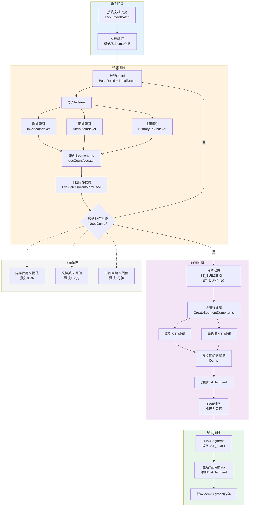
```mermaid
flowchart TD
    subgraph Input["输入阶段"]
        A1[接收文档批次<br/>IDocumentBatch]
        A2[文档验证<br/>格式/Schema验证]
        A1 --> A2
    end
    
    subgraph Build["构建阶段"]
        B1[分配DocId<br/>BaseDocId + LocalDocId]
        B2[写入Indexer]
        B3[倒排索引<br/>InvertedIndexer]
        B4[正排索引<br/>AttributeIndexer]
        B5[主键索引<br/>PrimaryKeyIndexer]
        B6[更新SegmentInfo<br/>docCount/Locator]
        B7[评估内存使用<br/>EvaluateCurrentMemUsed]
        B8{转储条件检查<br/>NeedDump?}
        
        A2 --> B1
        B1 --> B2
        B2 --> B3
        B2 --> B4
        B2 --> B5
        B3 --> B6
        B4 --> B6
        B5 --> B6
        B6 --> B7
        B7 --> B8
        B8 -->|否| B1
    end
    
    subgraph Dump["转储阶段"]
        D1[设置状态<br/>ST_BUILDING → ST_DUMPING]
        D2[创建转储项<br/>CreateSegmentDumpItems]
        D3[索引文件转储]
        D4[元数据文件转储]
        D5[异步转储到磁盘<br/>Dump]
        D6[创建DiskSegment]
        D7[Seal封存<br/>标记为只读]
        
        B8 -->|是| D1
        D1 --> D2
        D2 --> D3
        D2 --> D4
        D3 --> D5
        D4 --> D5
        D5 --> D6
        D6 --> D7
    end
    
    subgraph Output["输出阶段"]
        E1[DiskSegment<br/>状态: ST_BUILT]
        E2[更新TabletData<br/>添加DiskSegment]
        E3[释放MemSegment内存]
        
        D7 --> E1
        E1 --> E2
        E2 --> E3
    end
    
    subgraph Conditions["转储条件"]
        C1[内存使用 > 阈值<br/>默认80%]
        C2[文档数 > 阈值<br/>默认100万]
        C3[时间间隔 > 阈值<br/>默认5分钟]
        B8 -.-> C1
        B8 -.-> C2
        B8 -.-> C3
    end
    
    style Input fill:#e3f2fd
    style Build fill:#fff3e0
    style Dump fill:#f3e5f5
    style Output fill:#e8f5e9
    style Conditions fill:#f5f5f5
```

1. **Build**：接收文档批次，写入内存中的索引结构
2. **NeedDump**：检查是否达到转储条件（内存阈值、文档数量等）
3. **CreateSegmentDumpItems**：创建转储任务，准备将内存数据写入磁盘
4. **Dump**：异步转储到磁盘，创建 DiskSegment
5. **Seal**：封存，标记为只读

**关键特性**：
- **状态**：`ST_BUILDING`（构建中）或 `ST_DUMPING`（转储中）
- **特点**：在内存中构建，支持实时写入，转储是异步的
- **用途**：接收实时写入的文档，提供低延迟写入能力

**性能优化设计**：

1. **内存管理**：
   - **内存池**：使用内存池减少内存分配开销，提高写入性能
   - **内存配额**：通过 MemoryQuotaController 控制内存使用，防止内存溢出
   - **内存回收**：当内存不足时，触发 MemSegment 转储，释放内存

2. **写入优化**：
   - **批量写入**：支持批量写入文档，减少函数调用开销
   - **异步转储**：转储操作是异步的，不阻塞写入，提高写入吞吐量
   - **索引构建优化**：倒排索引、正排索引等采用高效的数据结构（如跳表、B+树）

3. **并发控制**：
   - **线程安全**：MemSegment 的 Build 操作是线程安全的，支持多线程并发写入
   - **锁粒度优化**：采用细粒度锁，减少锁竞争，提高并发性能

#### DiskSegment：磁盘段

DiskSegment 存储在磁盘上，用于持久化存储和查询。关键代码（`framework/DiskSegment.h`）：

```cpp
class DiskSegment : public Segment
{
public:
    enum class OpenMode {
        NORMAL,  // 正常模式：立即加载所有索引
        LAZY,    // 懒加载模式：按需加载（用于离线场景）
    };

    // 打开磁盘段：从磁盘加载索引数据
    virtual Status Open(const std::shared_ptr<MemoryQuotaController>& memoryQuotaController,
                       OpenMode mode) = 0;
    
    // 重新打开：当 Schema 变更时，需要重新加载
    virtual Status Reopen(const std::vector<std::shared_ptr<config::ITabletSchema>>& schemas) = 0;
};
```

**DiskSegment 的加载策略**：

**DiskSegment 加载策略**：

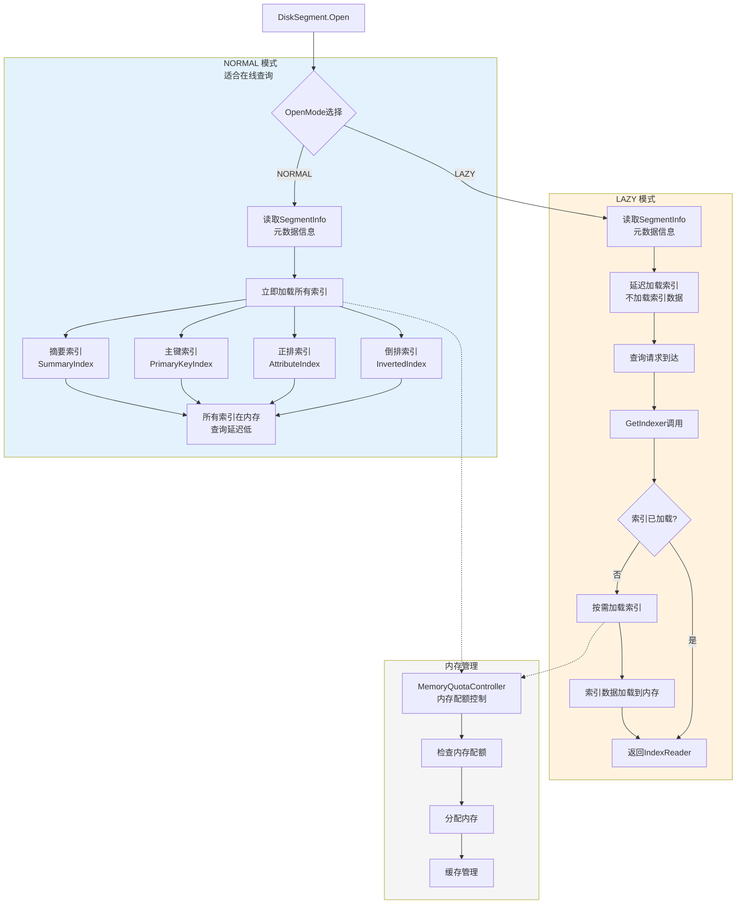
```mermaid
flowchart TD
    A[DiskSegment.Open] --> B{OpenMode选择}
    
    subgraph Normal["NORMAL 模式<br/>适合在线查询"]
        N1[读取SegmentInfo<br/>元数据信息]
        N2[立即加载所有索引]
        N3[倒排索引<br/>InvertedIndex]
        N4[正排索引<br/>AttributeIndex]
        N5[主键索引<br/>PrimaryKeyIndex]
        N6[摘要索引<br/>SummaryIndex]
        N7[所有索引在内存<br/>查询延迟低]
        
        B -->|NORMAL| N1
        N1 --> N2
        N2 --> N3
        N2 --> N4
        N2 --> N5
        N2 --> N6
        N3 --> N7
        N4 --> N7
        N5 --> N7
        N6 --> N7
    end
    
    subgraph Lazy["LAZY 模式<br/>适合离线场景"]
        L1[读取SegmentInfo<br/>元数据信息]
        L2[延迟加载索引<br/>不加载索引数据]
        L3[查询请求到达]
        L4[GetIndexer调用]
        L5{索引已加载?}
        L6[按需加载索引]
        L7[索引数据加载到内存]
        L8[返回IndexReader]
        
        B -->|LAZY| L1
        L1 --> L2
        L2 --> L3
        L3 --> L4
        L4 --> L5
        L5 -->|否| L6
        L5 -->|是| L8
        L6 --> L7
        L7 --> L8
    end
    
    subgraph Memory["内存管理"]
        M1[MemoryQuotaController<br/>内存配额控制]
        M2[检查内存配额]
        M3[分配内存]
        M4[缓存管理]
        
        N2 -.-> M1
        L6 -.-> M1
        M1 --> M2
        M2 --> M3
        M3 --> M4
    end
    
    style Normal fill:#e3f2fd
    style Lazy fill:#fff3e0
    style Memory fill:#f5f5f5
```

- **NORMAL 模式**：立即加载所有索引数据到内存，适合在线查询场景
- **LAZY 模式**：按需加载，只在查询时加载相关索引，适合离线场景，节省内存

**关键特性**：
- **状态**：`ST_BUILT`（已构建）
- **特点**：存储在磁盘上，支持按需加载，可以参与合并
- **用途**：持久化存储，支持查询，可以长期保存

**性能优化设计**：

1. **加载策略**：
   - **NORMAL 模式**：立即加载所有索引数据到内存，适合在线查询场景，查询延迟低
   - **LAZY 模式**：按需加载，只在查询时加载相关索引，适合离线场景，节省内存
   - **混合模式**：可以配置哪些索引立即加载，哪些按需加载，平衡内存和性能

2. **存储优化**：
   - **压缩存储**：索引数据采用压缩格式存储，减少磁盘空间和 IO 开销
   - **分块存储**：大索引文件分块存储，支持按需加载部分数据
   - **缓存策略**：常用索引数据可以缓存在内存中，提高查询性能

3. **查询优化**：
   - **索引剪枝**：通过 Locator 等机制判断哪些 Segment 需要查询，减少不必要的查询
   - **并行查询**：多个 DiskSegment 可以并行查询，提高查询吞吐量
   - **结果合并**：查询结果采用高效的合并算法（如堆合并），减少内存开销

**Segment 的状态转换**：

**Segment 状态转换**：

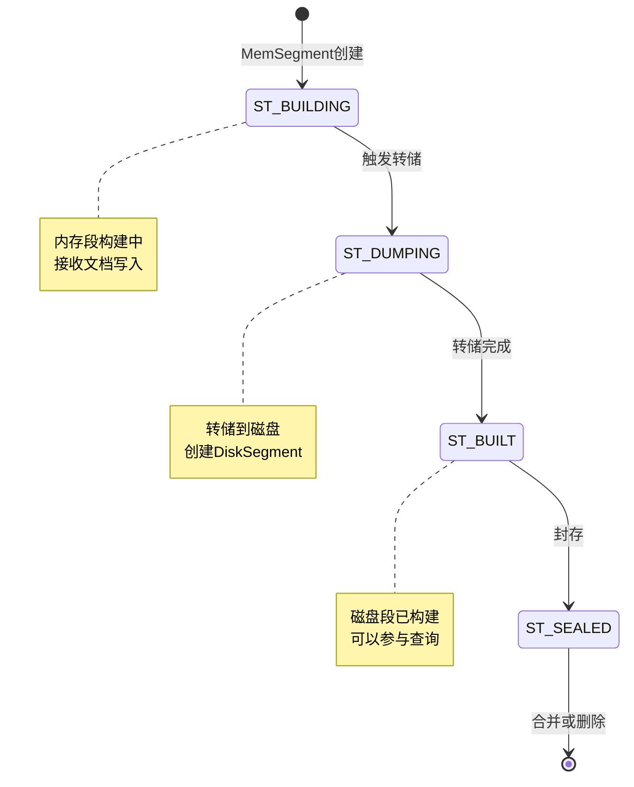
```mermaid
stateDiagram-v2
    [*] --> ST_BUILDING: MemSegment创建
    ST_BUILDING --> ST_DUMPING: 触发转储
    ST_DUMPING --> ST_BUILT: 转储完成
    ST_BUILT --> ST_SEALED: 封存
    ST_SEALED --> [*]: 合并或删除
    note right of ST_BUILDING
        内存段构建中
        接收文档写入
    end note
    note right of ST_DUMPING
        转储到磁盘
        创建DiskSegment
    end note
    note right of ST_BUILT
        磁盘段已构建
        可以参与查询
    end note
```

状态转换的代码逻辑（`framework/Segment.h`）：

```cpp
enum class SegmentStatus { 
    ST_UNSPECIFY,  // 未指定（用于筛选所有状态）
    ST_BUILT,      // 已构建（DiskSegment）
    ST_DUMPING,    // 转储中（MemSegment）
    ST_BUILDING     // 构建中（MemSegment）
};
```

状态转换流程：
1. **ST_BUILDING**：MemSegment 正在构建，接收文档，调用 `Build()`
2. **ST_DUMPING**：MemSegment 正在转储到磁盘，调用 `CreateSegmentDumpItems()`
3. **ST_BUILT**：DiskSegment 已构建完成，可以查询，调用 `Open()`

### 3.3 Version：版本管理

Version 管理索引的版本信息。让我们先通过图理解 Version 的结构：

**Version 的结构**：

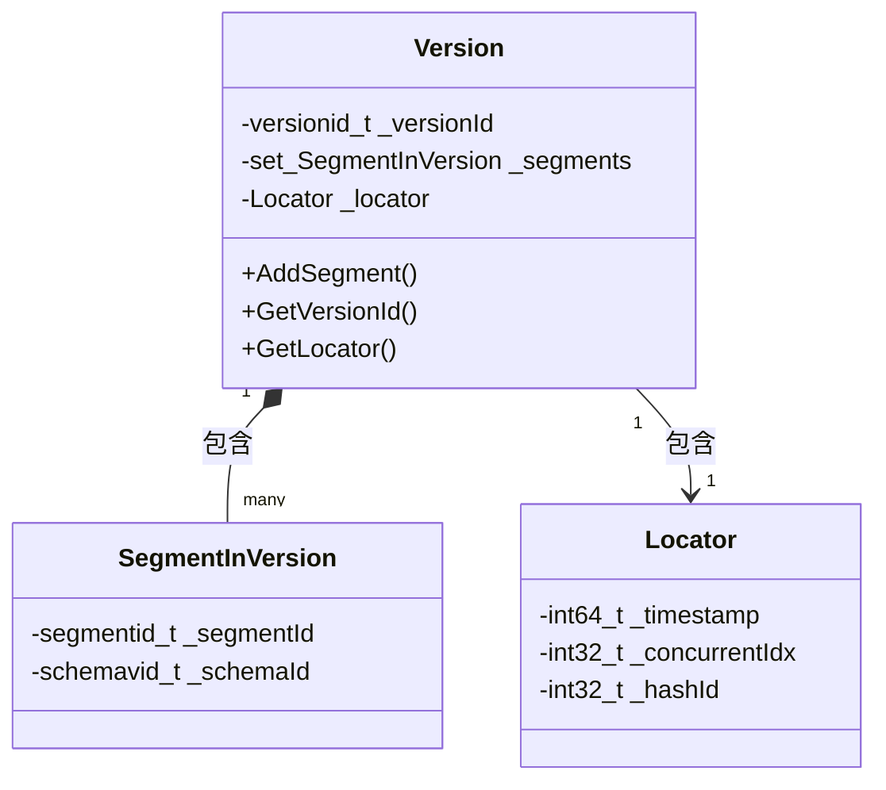
```mermaid
classDiagram
    class Version {
        -versionid_t _versionId
        -set_SegmentInVersion _segments
        -Locator _locator
        +AddSegment()
        +GetVersionId()
        +GetLocator()
    }
    
    class SegmentInVersion {
        -segmentid_t _segmentId
        -schemavid_t _schemaId
    }
    
    class Locator {
        -int64_t _timestamp
        -int32_t _concurrentIdx
        -int32_t _hashId
    }
    
    Version "1" *-- "many" SegmentInVersion : 包含
    Version "1" --> "1" Locator : 包含
```

从图中可以看到，Version 记录：
- **VersionId**：版本号，单调递增
- **Segments**：该版本包含的 Segment 列表
- **Locator**：数据位置信息
- **Timestamp**：时间戳

关键代码（`framework/Version.h`）：

```cpp
class Version : public autil::legacy::Jsonizable
{
private:
    struct SegmentInVersion {
        segmentid_t segmentId = INVALID_SEGMENTID;
        schemaid_t schemaId = DEFAULT_SCHEMAID;  // 每个 Segment 可以有不同的 Schema
    };

public:
    // Segment 管理
    void AddSegment(segmentid_t segmentId, schemaid_t schemaId);
    void RemoveSegment(segmentid_t segmentId);
    
    // 版本信息
    versionid_t GetVersionId() const { return _versionId; }
    void IncVersionId() { ++_versionId; }  // 每次 Commit 时递增
    
    // Locator：数据位置信息
    void SetLocator(const Locator& locator);
    const Locator& GetLocator() const { return _locator; }

private:
    versionid_t _versionId;                    // 版本号，单调递增
    std::set<SegmentInVersion> _segments;      // Segment 列表（有序）
    Locator _locator;                          // 位置信息，用于增量更新
    int64_t _timestamp;                        // 时间戳
    bool _sealed = false;                      // 是否封存
};
```

**Version 的演进过程**：

**Version 演进**：


```mermaid
flowchart TB
    Start([版本演进流程<br/>Version Evolution Flow]) --> V1Layer[Version 1 层<br/>Version 1 Layer]
    
    subgraph V1Group["Version 1 版本信息"]
        direction TB
        V1_ID[versionId: 1<br/>版本号1]
        V1_TS[timestamp: 100<br/>时间戳100]
        V1_S1[Segment 1<br/>索引段1]
        V1_S2[Segment 2<br/>索引段2]
        V1_S3[Segment 3<br/>索引段3]
        V1_L[Locator<br/>ts=100<br/>处理位置信息]
        V1_ID --> V1_TS
        V1_TS --> V1_S1
        V1_S1 --> V1_S2
        V1_S2 --> V1_S3
        V1_S3 --> V1_L
    end
    
    V1Layer --> Commit1Layer[Commit 操作层<br/>Commit Operation Layer]
    
    subgraph Commit1Group["Commit 操作 Commit Operation"]
        direction TB
        C1_1[新增Segment 4<br/>Add Segment 4]
        C1_2[更新Locator<br/>Update Locator<br/>ts=200]
        C1_3[递增版本号<br/>Increment VersionId<br/>1→2]
        C1_1 --> C1_2
        C1_2 --> C1_3
    end
    
    Commit1Layer --> V2Layer[Version 2 层<br/>Version 2 Layer]
    
    subgraph V2Group["Version 2 版本信息"]
        direction TB
        V2_ID[versionId: 2<br/>版本号2]
        V2_TS[timestamp: 200<br/>时间戳200]
        V2_S1[Segment 1<br/>复用]
        V2_S2[Segment 2<br/>复用]
        V2_S3[Segment 3<br/>复用]
        V2_S4[Segment 4<br/>新增]
        V2_L[Locator<br/>ts=200<br/>处理位置信息]
        V2_ID --> V2_TS
        V2_TS --> V2_S1
        V2_S1 --> V2_S2
        V2_S2 --> V2_S3
        V2_S3 --> V2_S4
        V2_S4 --> V2_L
    end
    
    V2Layer --> Commit2Layer[Commit 操作层<br/>Commit Operation Layer]
    
    subgraph Commit2Group["Commit 操作 Commit Operation"]
        direction TB
        C2_1[新增Segment 5<br/>Add Segment 5]
        C2_2[更新Locator<br/>Update Locator<br/>ts=300]
        C2_3[递增版本号<br/>Increment VersionId<br/>2→3]
        C2_1 --> C2_2
        C2_2 --> C2_3
    end
    
    Commit2Layer --> V3Layer[Version 3 层<br/>Version 3 Layer]
    
    subgraph V3Group["Version 3 版本信息"]
        direction TB
        V3_ID[versionId: 3<br/>版本号3]
        V3_TS[timestamp: 300<br/>时间戳300]
        V3_S1[Segment 1<br/>复用]
        V3_S2[Segment 2<br/>复用]
        V3_S3[Segment 3<br/>复用]
        V3_S4[Segment 4<br/>复用]
        V3_S5[Segment 5<br/>新增]
        V3_L[Locator<br/>ts=300<br/>处理位置信息]
        V3_ID --> V3_TS
        V3_TS --> V3_S1
        V3_S1 --> V3_S2
        V3_S2 --> V3_S3
        V3_S3 --> V3_S4
        V3_S4 --> V3_S5
        V3_S5 --> V3_L
    end
    
    V3Layer --> MergeLayer[合并操作层<br/>Merge Operation Layer]
    
    subgraph MergeGroup["合并操作 Merge Operation"]
        direction TB
        M1[合并Segment 1-5<br/>Merge Segments 1-5]
        M2[创建Segment 6<br/>Create Segment 6]
        M3[删除旧Segment<br/>Delete Old Segments]
        M4[更新Locator<br/>Update Locator<br/>ts=400]
        M5[递增版本号<br/>Increment VersionId<br/>3→4]
        M1 --> M2
        M2 --> M3
        M3 --> M4
        M4 --> M5
    end
    
    MergeLayer --> V4Layer[Version 4 层<br/>Version 4 Layer]
    
    subgraph V4Group["Version 4 版本信息"]
        direction TB
        V4_ID[versionId: 4<br/>版本号4]
        V4_TS[timestamp: 400<br/>时间戳400]
        V4_S6[Segment 6<br/>合并后]
        V4_L[Locator<br/>ts=400<br/>处理位置信息]
        V4_ID --> V4_TS
        V4_TS --> V4_S6
        V4_S6 --> V4_L
    end
    
    V4Layer --> End([版本演进完成<br/>Version Evolution Complete])
    
    V1Layer -.->|包含| V1Group
    Commit1Layer -.->|包含| Commit1Group
    V2Layer -.->|包含| V2Group
    Commit2Layer -.->|包含| Commit2Group
    V3Layer -.->|包含| V3Group
    MergeLayer -.->|包含| MergeGroup
    V4Layer -.->|包含| V4Group
    
    V1Group -.->|提交| Commit1Group
    Commit1Group -.->|创建| V2Group
    V2Group -.->|提交| Commit2Group
    Commit2Group -.->|创建| V3Group
    V3Group -.->|合并| MergeGroup
    MergeGroup -.->|创建| V4Group
    
    style Start fill:#c8e6c9,stroke:#388e3c,stroke-width:3px
    style End fill:#c8e6c9,stroke:#388e3c,stroke-width:3px
    style V1Layer fill:#e3f2fd,stroke:#1976d2,stroke-width:3px
    style Commit1Layer fill:#fff3e0,stroke:#f57c00,stroke-width:3px
    style V2Layer fill:#f3e5f5,stroke:#7b1fa2,stroke-width:3px
    style Commit2Layer fill:#fff3e0,stroke:#f57c00,stroke-width:3px
    style V3Layer fill:#e8f5e9,stroke:#2e7d32,stroke-width:3px
    style MergeLayer fill:#fce4ec,stroke:#c2185b,stroke-width:3px
    style V4Layer fill:#fff9c4,stroke:#f9a825,stroke-width:3px
    style V1Group fill:#e3f2fd,stroke:#1976d2,stroke-width:3px
    style V1_ID fill:#90caf9,stroke:#1976d2,stroke-width:2px
    style V1_TS fill:#90caf9,stroke:#1976d2,stroke-width:2px
    style V1_S1 fill:#90caf9,stroke:#1976d2,stroke-width:2px
    style V1_S2 fill:#90caf9,stroke:#1976d2,stroke-width:2px
    style V1_S3 fill:#90caf9,stroke:#1976d2,stroke-width:2px
    style V1_L fill:#90caf9,stroke:#1976d2,stroke-width:2px
    style Commit1Group fill:#fff3e0,stroke:#f57c00,stroke-width:3px
    style C1_1 fill:#ffcc80,stroke:#f57c00,stroke-width:2px
    style C1_2 fill:#ffcc80,stroke:#f57c00,stroke-width:2px
    style C1_3 fill:#ffcc80,stroke:#f57c00,stroke-width:2px
    style V2Group fill:#f3e5f5,stroke:#7b1fa2,stroke-width:3px
    style V2_ID fill:#ce93d8,stroke:#7b1fa2,stroke-width:2px
    style V2_TS fill:#ce93d8,stroke:#7b1fa2,stroke-width:2px
    style V2_S1 fill:#ce93d8,stroke:#7b1fa2,stroke-width:2px
    style V2_S2 fill:#ce93d8,stroke:#7b1fa2,stroke-width:2px
    style V2_S3 fill:#ce93d8,stroke:#7b1fa2,stroke-width:2px
    style V2_S4 fill:#ffeb3b,stroke:#f57f17,stroke-width:2px
    style V2_L fill:#ce93d8,stroke:#7b1fa2,stroke-width:2px
    style Commit2Group fill:#fff3e0,stroke:#f57c00,stroke-width:3px
    style C2_1 fill:#ffcc80,stroke:#f57c00,stroke-width:2px
    style C2_2 fill:#ffcc80,stroke:#f57c00,stroke-width:2px
    style C2_3 fill:#ffcc80,stroke:#f57c00,stroke-width:2px
    style V3Group fill:#e8f5e9,stroke:#2e7d32,stroke-width:3px
    style V3_ID fill:#a5d6a7,stroke:#2e7d32,stroke-width:2px
    style V3_TS fill:#a5d6a7,stroke:#2e7d32,stroke-width:2px
    style V3_S1 fill:#a5d6a7,stroke:#2e7d32,stroke-width:2px
    style V3_S2 fill:#a5d6a7,stroke:#2e7d32,stroke-width:2px
    style V3_S3 fill:#a5d6a7,stroke:#2e7d32,stroke-width:2px
    style V3_S4 fill:#a5d6a7,stroke:#2e7d32,stroke-width:2px
    style V3_S5 fill:#ffeb3b,stroke:#f57f17,stroke-width:2px
    style V3_L fill:#a5d6a7,stroke:#2e7d32,stroke-width:2px
    style MergeGroup fill:#fce4ec,stroke:#c2185b,stroke-width:3px
    style M1 fill:#f8bbd0,stroke:#c2185b,stroke-width:2px
    style M2 fill:#f8bbd0,stroke:#c2185b,stroke-width:2px
    style M3 fill:#f8bbd0,stroke:#c2185b,stroke-width:2px
    style M4 fill:#f8bbd0,stroke:#c2185b,stroke-width:2px
    style M5 fill:#f8bbd0,stroke:#c2185b,stroke-width:2px
    style V4Group fill:#fff9c4,stroke:#f9a825,stroke-width:3px
    style V4_ID fill:#ffe082,stroke:#f9a825,stroke-width:2px
    style V4_TS fill:#ffe082,stroke:#f9a825,stroke-width:2px
    style V4_S6 fill:#4caf50,stroke:#1b5e20,stroke-width:2px
    style V4_L fill:#ffe082,stroke:#f9a825,stroke-width:2px
```

版本演进示例：
- **V1**：包含 Segment [1, 2]，Locator 记录处理到 timestamp=100
- **V2**：新增 Segment 3，Locator 更新到 timestamp=200
- **V3**：Segment 1 和 2 合并为 Segment 4，Locator 更新到 timestamp=300

**关键设计**：
- **版本号递增**：每次 Commit 时 `VersionId` 自动递增，保证版本顺序
- **Schema 演进**：每个 Segment 记录自己的 `SchemaId`，支持 Schema 变更
- **Locator 更新**：每次 Commit 时更新 Locator，记录最新的数据处理位置

**版本演进机制**：

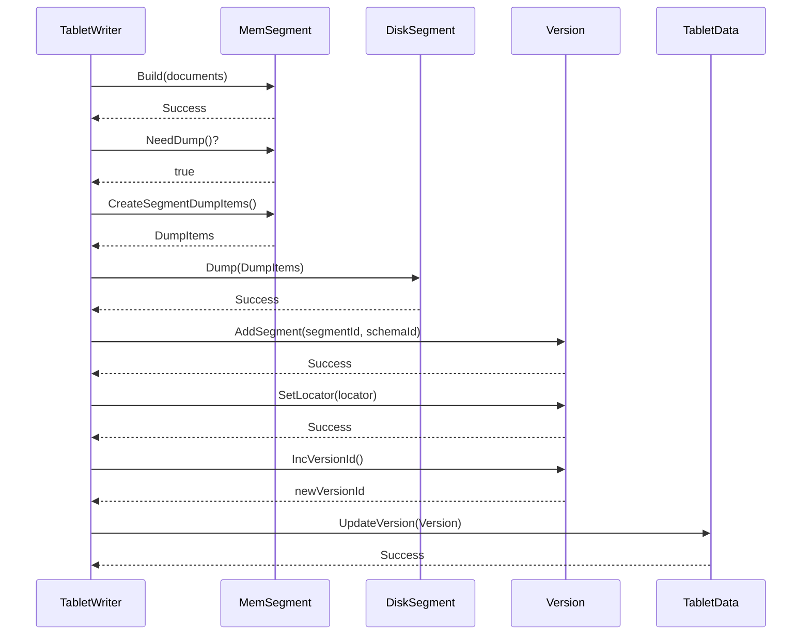
```mermaid
sequenceDiagram
    participant Writer as TabletWriter
    participant MemSeg as MemSegment
    participant DiskSeg as DiskSegment
    participant Version as Version
    participant TabletData as TabletData
    
    Writer->>MemSeg: Build(documents)
    MemSeg-->>Writer: Success
    
    Writer->>MemSeg: NeedDump()?
    MemSeg-->>Writer: true
    
    Writer->>MemSeg: CreateSegmentDumpItems()
    MemSeg-->>Writer: DumpItems
    
    Writer->>DiskSeg: Dump(DumpItems)
    DiskSeg-->>Writer: Success
    
    Writer->>Version: AddSegment(segmentId, schemaId)
    Version-->>Writer: Success
    
    Writer->>Version: SetLocator(locator)
    Version-->>Writer: Success
    
    Writer->>Version: IncVersionId()
    Version-->>Writer: newVersionId
    
    Writer->>TabletData: UpdateVersion(Version)
    TabletData-->>Writer: Success
```

**设计原理**：

1. **原子性保证**：
   - **Fence 机制**：通过 Fence 目录保证版本提交的原子性，避免部分提交导致的数据不一致
   - **版本文件**：Version 信息写入版本文件，通过文件系统保证原子性
   - **回滚支持**：如果提交失败，可以回滚到上一个版本，保证数据一致性

2. **性能优化**：
   - **增量更新**：只记录新增的 Segment，不记录已删除的 Segment，减少版本文件大小
   - **版本压缩**：定期压缩历史版本，删除不再需要的版本信息
   - **并行提交**：多个 Tablet 可以并行提交版本，提高系统吞吐量

3. **Schema 演进**：
   - **向后兼容**：新 Schema 向后兼容旧 Schema，旧 Segment 可以继续使用
   - **渐进式迁移**：新 Segment 使用新 Schema，旧 Segment 保持原样，通过合并逐步迁移
   - **版本标记**：每个 Segment 记录自己的 SchemaId，查询时根据 SchemaId 选择对应的 Schema

**Version 的作用**：

1. **版本控制**：记录索引的演进历史
2. **增量更新**：通过 Locator 判断数据是否已处理
3. **Schema 演进**：支持 Schema 变更，每个 Segment 记录自己的 SchemaId
4. **回滚支持**：可以回滚到历史版本

### 3.4 TabletData：索引数据管理

`TabletData` 管理 Tablet 的所有数据。让我们先通过图理解其结构：

**TabletData 的结构**：

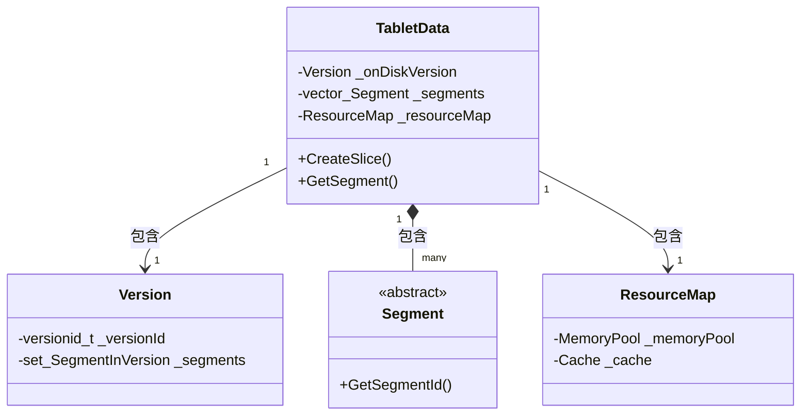
```mermaid
classDiagram
    class TabletData {
        -Version _onDiskVersion
        -vector_Segment _segments
        -ResourceMap _resourceMap
        +CreateSlice()
        +GetSegment()
    }
    
    class Version {
        -versionid_t _versionId
        -set_SegmentInVersion _segments
    }
    
    class Segment {
        <<abstract>>
        +GetSegmentId()
    }
    
    class ResourceMap {
        -MemoryPool _memoryPool
        -Cache _cache
    }
    
    TabletData "1" --> "1" Version : 包含
    TabletData "1" *-- "many" Segment : 包含
    TabletData "1" --> "1" ResourceMap : 包含
```

从图中可以看到，TabletData 包含：
- **Segments**：所有 Segment 的列表（MemSegment + DiskSegment）
- **Version**：当前磁盘版本
- **ResourceMap**：共享资源（内存池、缓存等）

关键代码（`framework/TabletData.h`）：

```cpp
class TabletData : private autil::NoCopyable
{
public:
    // Slice：Segment 的视图，支持按状态筛选
    class Slice {
        // 提供迭代器，可以遍历筛选后的 Segment
    };

    // 创建 Slice：按状态筛选 Segment
    Slice CreateSlice(Segment::SegmentStatus segmentStatus) const;
    
    // 获取指定 Segment
    SegmentPtr GetSegment(segmentid_t segmentId) const;

private:
    Version _onDiskVersion;                               // 磁盘版本
    std::vector<std::shared_ptr<Segment>> _segments;     // Segment 列表
    std::shared_ptr<ResourceMap> _resourceMap;           // 共享资源
};
```

**Slice 机制的使用场景**：

**TabletData Slice 机制**：

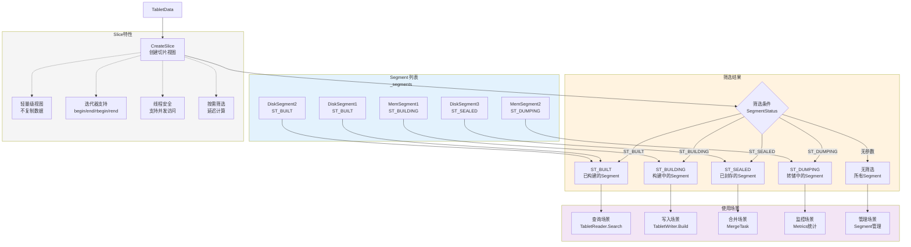
```mermaid
flowchart TD
    A[TabletData] --> B[CreateSlice<br/>创建切片视图]
    B --> C{筛选条件<br/>SegmentStatus}
    
    subgraph Segments["Segment 列表<br/>_segments"]
        S1[MemSegment1<br/>ST_BUILDING]
        S2[MemSegment2<br/>ST_DUMPING]
        S3[DiskSegment1<br/>ST_BUILT]
        S4[DiskSegment2<br/>ST_BUILT]
        S5[DiskSegment3<br/>ST_SEALED]
    end
    
    subgraph Filter["筛选结果"]
        F1[ST_BUILT<br/>已构建的Segment]
        F2[ST_BUILDING<br/>构建中的Segment]
        F3[ST_DUMPING<br/>转储中的Segment]
        F4[ST_SEALED<br/>已封存的Segment]
        F5[无筛选<br/>所有Segment]
        
        C -->|ST_BUILT| F1
        C -->|ST_BUILDING| F2
        C -->|ST_DUMPING| F3
        C -->|ST_SEALED| F4
        C -->|无参数| F5
    end
    
    subgraph Usage["使用场景"]
        U1[查询场景<br/>TabletReader.Search]
        U2[写入场景<br/>TabletWriter.Build]
        U3[合并场景<br/>MergeTask]
        U4[监控场景<br/>Metrics统计]
        U5[管理场景<br/>Segment管理]
        
        F1 --> U1
        F2 --> U2
        F3 --> U4
        F4 --> U3
        F5 --> U5
    end
    
    subgraph Slice["Slice特性"]
        SL1[轻量级视图<br/>不复制数据]
        SL2[迭代器支持<br/>begin/end/rbegin/rend]
        SL3[线程安全<br/>支持并发访问]
        SL4[按需筛选<br/>延迟计算]
        
        B -.-> SL1
        B -.-> SL2
        B -.-> SL3
        B -.-> SL4
    end
    
    S3 --> F1
    S4 --> F1
    S1 --> F2
    S2 --> F3
    S5 --> F4
    
    style Segments fill:#e3f2fd
    style Filter fill:#fff3e0
    style Usage fill:#f3e5f5
    style Slice fill:#f5f5f5
```

```cpp
// 获取所有已构建的 Segment（用于查询）
auto builtSegments = tabletData->CreateSlice(Segment::SegmentStatus::ST_BUILT);

// 获取所有构建中的 Segment（用于写入）
auto buildingSegments = tabletData->CreateSlice(Segment::SegmentStatus::ST_BUILDING);

// 获取所有 Segment
auto allSegments = tabletData->CreateSlice();
```

**关键设计**：
- **Slice 机制**：提供灵活的 Segment 筛选，避免直接暴露内部实现
- **共享资源**：多个 Segment 共享 ResourceMap，减少资源开销
- **版本管理**：通过 Version 记录哪些 Segment 已持久化

**Slice 机制的设计原理**：

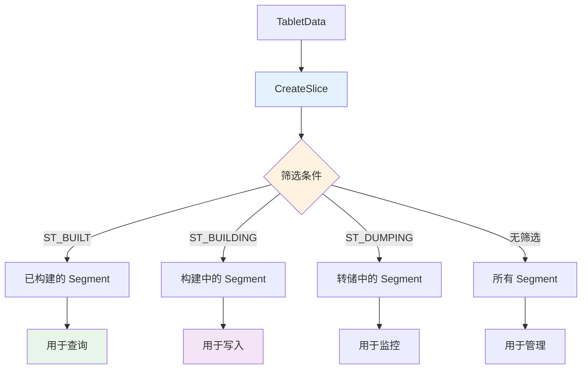
```mermaid
graph TD
    A[TabletData] --> B[CreateSlice]
    B --> C{筛选条件}
    C -->|ST_BUILT| D[已构建的 Segment]
    C -->|ST_BUILDING| E[构建中的 Segment]
    C -->|ST_DUMPING| F[转储中的 Segment]
    C -->|无筛选| G[所有 Segment]
    
    D --> H[用于查询]
    E --> I[用于写入]
    F --> J[用于监控]
    G --> K[用于管理]
    
    style B fill:#e3f2fd
    style C fill:#fff3e0
    style H fill:#e8f5e9
    style I fill:#f3e5f5
```

**设计优势**：

1. **封装性**：Slice 机制隐藏了 TabletData 的内部实现，外部代码不需要知道 Segment 的存储方式
2. **灵活性**：支持按状态、类型、时间等多种条件筛选 Segment
3. **性能**：Slice 是轻量级的视图，不复制数据，只是提供迭代器接口
4. **线程安全**：Slice 的创建和遍历是线程安全的，支持并发查询

**ResourceMap 的共享机制**：

- **内存池共享**：多个 Segment 共享内存池，减少内存分配开销
- **缓存共享**：常用索引数据缓存在 ResourceMap 中，多个 Segment 可以共享
- **文件句柄共享**：文件句柄可以共享，减少文件打开/关闭的开销

**TabletData 的 Slice 机制**：

TabletData 提供 `CreateSlice` 方法，可以按状态筛选 Segment：

```cpp
// 获取所有构建完成的 Segment
auto builtSegments = tabletData->CreateSlice(Segment::SegmentStatus::ST_BUILT);

// 获取所有 Segment
auto allSegments = tabletData->CreateSlice();
```

### 3.5 Locator：数据位置信息

Locator 是增量更新的核心，记录数据的位置信息。让我们先通过图理解 Locator 的结构：

**Locator 的结构**：

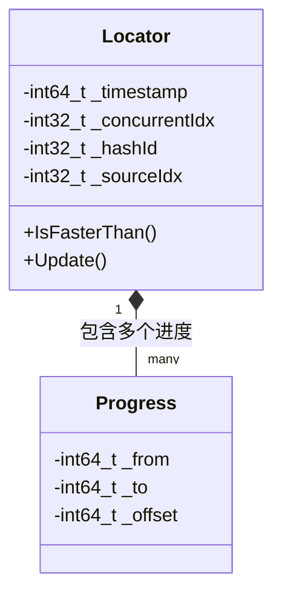
```mermaid
classDiagram
    class Locator {
        -int64_t _timestamp
        -int32_t _concurrentIdx
        -int32_t _hashId
        -int32_t _sourceIdx
        +IsFasterThan()
        +Update()
    }
    
    class Progress {
        -int64_t _from
        -int64_t _to
        -int64_t _offset
    }
    
    Locator "1" *-- "many" Progress : 包含多个进度
```

从图中可以看到，Locator 包含：
- **timestamp**：时间戳，记录数据的时间位置
- **concurrentIdx**：并发索引，处理时间戳相同的情况
- **hashId**：Hash ID，用于分片
- **sourceIdx**：数据源索引，支持多数据源

关键代码（`framework/Locator.h`）：

```cpp
class Locator final
{
public:
    // Locator 比较结果
    enum class LocatorCompareResult {
        LCR_INVALID,        // 无效
        LCR_SLOWER,         // 比这个 locator 慢
        LCR_PARTIAL_FASTER, // 部分 hash id 更快
        LCR_FULLY_FASTER    // 完全比这个 locator 快（包括相等）
    };

    // 文档信息：记录文档在数据源中的位置
    struct DocInfo {
        int64_t timestamp;        // 时间戳
        uint32_t concurrentIdx;   // 并发索引（时间戳相同时的序号）
        uint16_t hashId;          // Hash ID（用于分片）
        uint8_t sourceIdx;        // 数据源索引
    };

    // 比较两个 Locator：判断数据是否已处理
    LocatorCompareResult IsFasterThan(const Locator& other, 
                                      bool ignoreLegacyDiffSrc) const;

private:
    std::vector<base::Progress> _progress;  // 进度信息（每个 hashId 的进度）
};
```

**Locator 的比较逻辑**：

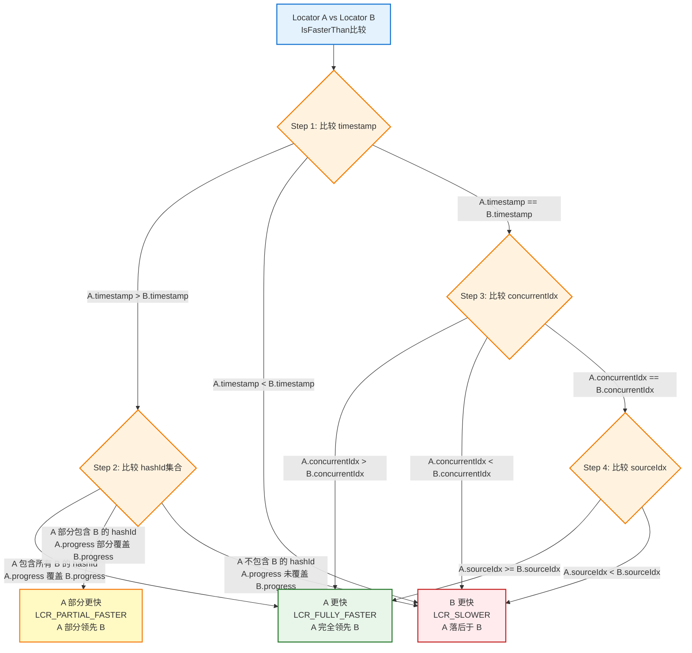
```mermaid
flowchart TD
    Start[Locator A vs Locator B<br/>IsFasterThan比较] --> Step1{Step 1: 比较 timestamp}
    
    Step1 -->|A.timestamp > B.timestamp| Step2{Step 2: 比较 hashId集合}
    Step1 -->|A.timestamp < B.timestamp| Result1[B 更快<br/>LCR_SLOWER<br/>A 落后于 B]
    Step1 -->|A.timestamp == B.timestamp| Step3{Step 3: 比较 concurrentIdx}
    
    Step2 -->|A 包含所有 B 的 hashId<br/>A.progress 覆盖 B.progress| Result2[A 更快<br/>LCR_FULLY_FASTER<br/>A 完全领先 B]
    Step2 -->|A 部分包含 B 的 hashId<br/>A.progress 部分覆盖 B.progress| Result3[A 部分更快<br/>LCR_PARTIAL_FASTER<br/>A 部分领先 B]
    Step2 -->|A 不包含 B 的 hashId<br/>A.progress 未覆盖 B.progress| Result1
    
    Step3 -->|A.concurrentIdx > B.concurrentIdx| Result2
    Step3 -->|A.concurrentIdx < B.concurrentIdx| Result1
    Step3 -->|A.concurrentIdx == B.concurrentIdx| Step4{Step 4: 比较 sourceIdx}
    
    Step4 -->|A.sourceIdx >= B.sourceIdx| Result2
    Step4 -->|A.sourceIdx < B.sourceIdx| Result1
    
    style Start fill:#e3f2fd,stroke:#1976d2,stroke-width:2px
    style Step1 fill:#fff3e0,stroke:#f57c00,stroke-width:2px
    style Step2 fill:#fff3e0,stroke:#f57c00,stroke-width:2px
    style Step3 fill:#fff3e0,stroke:#f57c00,stroke-width:2px
    style Step4 fill:#fff3e0,stroke:#f57c00,stroke-width:2px
    style Result1 fill:#ffebee,stroke:#c62828,stroke-width:2px
    style Result2 fill:#e8f5e9,stroke:#2e7d32,stroke-width:2px
    style Result3 fill:#fff9c4,stroke:#f57f17,stroke-width:2px
```

比较示例：
- **Locator A**：timestamp=100, hashId=0
- **Locator B**：timestamp=200, hashId=0
- **结果**：B 比 A 快（`LCR_FULLY_FASTER`），说明 B 包含 A 的所有数据

**Locator 的关键作用**：
1. **增量更新**：通过 `IsFasterThan()` 判断哪些数据已处理，避免重复处理
2. **数据一致性**：保证数据不重复、不丢失，支持多数据源场景
3. **进度追踪**：记录每个 HashId 的处理进度，支持分片处理
4. **并发控制**：通过 `concurrentIdx` 处理时间戳相同的情况

**Locator 比较算法详解**：

Locator 的比较是增量更新的核心，通过比较两个 Locator 可以判断数据是否已处理。比较算法需要考虑多个维度：

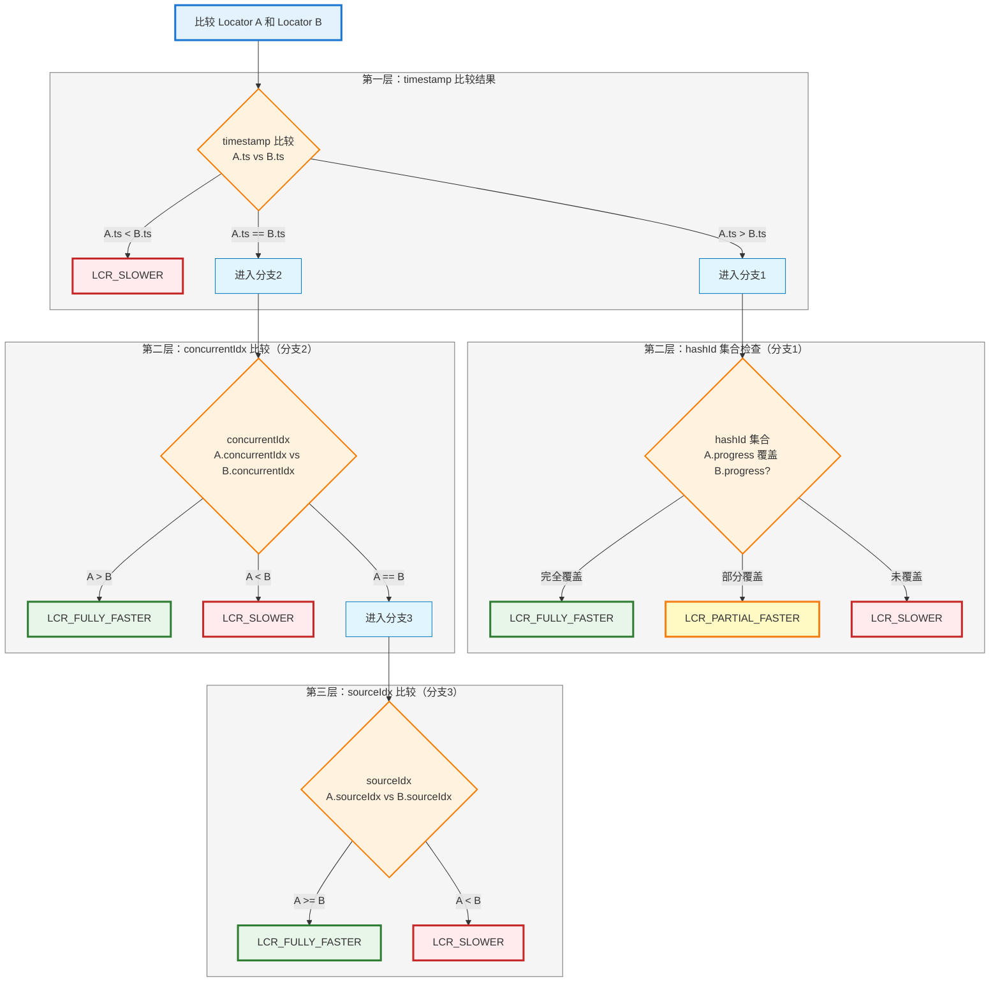
```mermaid
flowchart TD
    Start[比较 Locator A 和 Locator B] --> TS{ timestamp 比较<br/>A.ts vs B.ts}
    
    subgraph Level1["第一层：timestamp 比较结果"]
        direction LR
        TS -->|A.ts < B.ts| SLOWER1[LCR_SLOWER]
        TS -->|A.ts > B.ts| Branch1[进入分支1]
        TS -->|A.ts == B.ts| Branch2[进入分支2]
    end
    
    subgraph Level2["第二层：hashId 集合检查（分支1）"]
        direction LR
        Branch1 --> HashCheck{hashId 集合<br/>A.progress 覆盖 B.progress?}
        HashCheck -->|完全覆盖| FASTER1[LCR_FULLY_FASTER]
        HashCheck -->|部分覆盖| PARTIAL1[LCR_PARTIAL_FASTER]
        HashCheck -->|未覆盖| SLOWER2[LCR_SLOWER]
    end
    
    subgraph Level3["第二层：concurrentIdx 比较（分支2）"]
        direction LR
        Branch2 --> ConcurrentCheck{concurrentIdx<br/>A.concurrentIdx vs B.concurrentIdx}
        ConcurrentCheck -->|A > B| FASTER2[LCR_FULLY_FASTER]
        ConcurrentCheck -->|A < B| SLOWER3[LCR_SLOWER]
        ConcurrentCheck -->|A == B| Branch3[进入分支3]
    end
    
    subgraph Level4["第三层：sourceIdx 比较（分支3）"]
        direction LR
        Branch3 --> SourceCheck{sourceIdx<br/>A.sourceIdx vs B.sourceIdx}
        SourceCheck -->|A >= B| FASTER3[LCR_FULLY_FASTER]
        SourceCheck -->|A < B| SLOWER4[LCR_SLOWER]
    end
    
    style Start fill:#e3f2fd,stroke:#1976d2,stroke-width:3px
    style TS fill:#fff3e0,stroke:#f57c00,stroke-width:2px
    style Level1 fill:#f5f5f5,stroke:#757575,stroke-width:1px
    style Level2 fill:#f5f5f5,stroke:#757575,stroke-width:1px
    style Level3 fill:#f5f5f5,stroke:#757575,stroke-width:1px
    style Level4 fill:#f5f5f5,stroke:#757575,stroke-width:1px
    style HashCheck fill:#fff3e0,stroke:#f57c00,stroke-width:2px
    style ConcurrentCheck fill:#fff3e0,stroke:#f57c00,stroke-width:2px
    style SourceCheck fill:#fff3e0,stroke:#f57c00,stroke-width:2px
    style SLOWER1 fill:#ffebee,stroke:#c62828,stroke-width:3px
    style SLOWER2 fill:#ffebee,stroke:#c62828,stroke-width:3px
    style SLOWER3 fill:#ffebee,stroke:#c62828,stroke-width:3px
    style SLOWER4 fill:#ffebee,stroke:#c62828,stroke-width:3px
    style FASTER1 fill:#e8f5e9,stroke:#2e7d32,stroke-width:3px
    style FASTER2 fill:#e8f5e9,stroke:#2e7d32,stroke-width:3px
    style FASTER3 fill:#e8f5e9,stroke:#2e7d32,stroke-width:3px
    style PARTIAL1 fill:#fff9c4,stroke:#f57f17,stroke-width:3px
    style Branch1 fill:#e1f5fe,stroke:#0277bd,stroke-width:1px
    style Branch2 fill:#e1f5fe,stroke:#0277bd,stroke-width:1px
    style Branch3 fill:#e1f5fe,stroke:#0277bd,stroke-width:1px
```

**性能优化**：

1. **快速路径**：如果 timestamp 不同，直接比较 timestamp，避免遍历 Progress
2. **缓存优化**：比较结果可以缓存，避免重复计算
3. **位运算**：使用位运算优化 hashId 的比较，提高性能
4. **内存优化**：Progress 采用紧凑的数据结构，减少内存占用

**Locator 的作用**：

1. **增量更新**：判断哪些数据已经处理过
2. **数据一致性**：保证数据不重复、不丢失
3. **多数据源**：支持从多个数据源读取数据

**Locator 比较**：

```cpp
enum class LocatorCompareResult {
    LCR_INVALID,        // 无效
    LCR_SLOWER,         // 更慢
    LCR_PARTIAL_FASTER, // 部分更快
    LCR_FULLY_FASTER    // 完全更快（包含相等）
};
```

### 3.6 TabletReader：查询接口

TabletReader 提供索引查询接口。让我们先通过图理解查询流程：

**TabletReader 查询流程**：


```mermaid
flowchart TB
    Start([查询流程开始<br/>Query Flow Start]) --> InputLayer[输入阶段<br/>Input Phase]
    
    subgraph InputGroup["1. 输入阶段 Input Phase"]
        direction TB
        A1[JSON 查询请求<br/>JSON Query Request]
        A2[解析JSON查询<br/>Parse JSON Query<br/>QueryParser]
        A3[提取查询类型和条件<br/>Extract Query Type and Conditions<br/>TermQuery/RangeQuery等]
        A4[创建内部Query对象<br/>Create Internal Query Object]
        A1 --> A2
        A2 --> A3
        A3 --> A4
    end
    
    InputLayer --> ReaderLayer[IndexReader获取阶段<br/>IndexReader Acquisition Phase]
    
    subgraph ReaderGroup["2. IndexReader获取 IndexReader Acquisition"]
        direction TB
        B1[GetIndexReader<br/>indexType, indexName]
        B2{缓存中存在?<br/>Cache Exists?}
        B3[返回缓存的IndexReader<br/>Return Cached IndexReader]
        B4[创建新的IndexReader<br/>Create New IndexReader<br/>InvertedIndexReader<br/>AttributeReader<br/>PrimaryKeyReader]
        B5[缓存IndexReader<br/>Cache IndexReader]
        B6[IndexReader就绪<br/>IndexReader Ready]
        B1 --> B2
        B2 -->|是| B3
        B2 -->|否| B4
        B4 --> B5
        B3 --> B6
        B5 --> B6
    end
    
    ReaderLayer --> QueryLayer[查询执行阶段<br/>Query Execution Phase]
    
    subgraph QueryGroup["3. 查询执行阶段 Query Execution Phase"]
        direction TB
        C1[TabletData.CreateSlice<br/>获取Segment列表<br/>Get Segment List]
        C2[遍历Segment<br/>Traverse Segments]
        C3[并行查询各Segment<br/>Parallel Query Segments<br/>Segment1/Segment2/Segment3]
        C4[DocId转换<br/>DocId Conversion<br/>GlobalDocId → LocalDocId]
        C5[IndexReader.Search<br/>执行索引查询<br/>Execute Index Query]
        C1 --> C2
        C2 --> C3
        C3 --> C4
        C4 --> C5
    end
    
    QueryLayer --> ProcessLayer[结果处理阶段<br/>Result Processing Phase]
    
    subgraph ProcessGroup["4. 结果处理阶段 Result Processing Phase"]
        direction TB
        D1[收集各Segment结果<br/>Collect Segment Results]
        D2[DocId去重<br/>DocId Deduplication]
        D3[排序<br/>Sorting<br/>相关性分数或指定字段]
        D4[分页处理<br/>Pagination<br/>offset/limit]
        D5[聚合统计<br/>Aggregation<br/>可选]
        D1 --> D2
        D2 --> D3
        D3 --> D4
        D4 --> D5
    end
    
    ProcessLayer --> OutputLayer[输出阶段<br/>Output Phase]
    
    subgraph OutputGroup["5. 输出阶段 Output Phase"]
        direction TB
        E1[字段选择<br/>Field Selection]
        E2[序列化为JSON<br/>Serialize to JSON]
        E3[返回JSON结果<br/>Return JSON Result]
        E1 --> E2
        E2 --> E3
    end
    
    OutputLayer --> End([查询完成<br/>Query Complete])
    
    InputLayer -.->|包含| InputGroup
    ReaderLayer -.->|包含| ReaderGroup
    QueryLayer -.->|包含| QueryGroup
    ProcessLayer -.->|包含| ProcessGroup
    OutputLayer -.->|包含| OutputGroup
    
    A4 --> B1
    B6 --> C1
    C5 --> D1
    D5 --> E1
    
    style Start fill:#c8e6c9,stroke:#388e3c,stroke-width:3px
    style End fill:#c8e6c9,stroke:#388e3c,stroke-width:3px
    style InputLayer fill:#e3f2fd,stroke:#1976d2,stroke-width:3px
    style ReaderLayer fill:#fff9c4,stroke:#f57f17,stroke-width:3px
    style QueryLayer fill:#fff3e0,stroke:#f57c00,stroke-width:3px
    style ProcessLayer fill:#f3e5f5,stroke:#7b1fa2,stroke-width:3px
    style OutputLayer fill:#e8f5e9,stroke:#2e7d32,stroke-width:3px
    style InputGroup fill:#e3f2fd,stroke:#1976d2,stroke-width:3px
    style A1 fill:#90caf9,stroke:#1976d2,stroke-width:2px
    style A2 fill:#90caf9,stroke:#1976d2,stroke-width:2px
    style A3 fill:#90caf9,stroke:#1976d2,stroke-width:2px
    style A4 fill:#90caf9,stroke:#1976d2,stroke-width:2px
    style ReaderGroup fill:#fff9c4,stroke:#f57f17,stroke-width:3px
    style B1 fill:#ffe082,stroke:#f57f17,stroke-width:2px
    style B2 fill:#ffe082,stroke:#f57f17,stroke-width:2px
    style B3 fill:#ffe082,stroke:#f57f17,stroke-width:2px
    style B4 fill:#ffe082,stroke:#f57f17,stroke-width:2px
    style B5 fill:#ffe082,stroke:#f57f17,stroke-width:2px
    style B6 fill:#ffe082,stroke:#f57f17,stroke-width:2px
    style QueryGroup fill:#fff3e0,stroke:#f57c00,stroke-width:3px
    style C1 fill:#ffcc80,stroke:#f57c00,stroke-width:2px
    style C2 fill:#ffcc80,stroke:#f57c00,stroke-width:2px
    style C3 fill:#ffcc80,stroke:#f57c00,stroke-width:2px
    style C4 fill:#ffcc80,stroke:#f57c00,stroke-width:2px
    style C5 fill:#ffcc80,stroke:#f57c00,stroke-width:2px
    style ProcessGroup fill:#f3e5f5,stroke:#7b1fa2,stroke-width:3px
    style D1 fill:#ce93d8,stroke:#7b1fa2,stroke-width:2px
    style D2 fill:#ce93d8,stroke:#7b1fa2,stroke-width:2px
    style D3 fill:#ce93d8,stroke:#7b1fa2,stroke-width:2px
    style D4 fill:#ce93d8,stroke:#7b1fa2,stroke-width:2px
    style D5 fill:#ce93d8,stroke:#7b1fa2,stroke-width:2px
    style OutputGroup fill:#e8f5e9,stroke:#2e7d32,stroke-width:3px
    style E1 fill:#a5d6a7,stroke:#2e7d32,stroke-width:2px
    style E2 fill:#a5d6a7,stroke:#2e7d32,stroke-width:2px
    style E3 fill:#a5d6a7,stroke:#2e7d32,stroke-width:2px
```

从图中可以看到查询流程：
1. 解析 JSON 查询
2. 获取 IndexReader
3. 遍历 Segment 查询
4. 合并结果
5. 返回 JSON 结果

关键代码（`framework/TabletReader.h`）：

```cpp
class TabletReader : public ITabletReader
{
public:
    // 打开：初始化 TabletData 和读取资源
    Status Open(const std::shared_ptr<TabletData>& tabletData, 
                const ReadResource& readResource);

    // 搜索：JSON 格式的查询
    Status Search(const std::string& jsonQuery, std::string& result) const override;
    
    // 获取索引 Reader：根据索引类型和名称获取
    std::shared_ptr<index::IIndexReader> GetIndexReader(
        const std::string& indexType,
        const std::string& indexName) const override;

protected:
    using IndexReaderMapKey = std::pair<std::string, std::string>;  // (indexType, indexName)
    
    std::shared_ptr<config::ITabletSchema> _schema;
    std::map<IndexReaderMapKey, std::shared_ptr<index::IIndexReader>> _indexReaderMap;  // 索引 Reader 缓存
};
```

**查询流程详解**：

1. **解析查询**：`Search()` 将 JSON 查询解析为内部查询对象
2. **获取 IndexReader**：根据索引类型和名称从 `_indexReaderMap` 获取或创建
3. **遍历 Segment**：通过 `TabletData->CreateSlice(ST_BUILT)` 获取所有已构建的 Segment
4. **并行查询**：对多个 Segment 的 Indexer 进行查询（如果支持并行）
5. **合并结果**：将各 Segment 的查询结果合并（去重、排序等）
6. **返回结果**：序列化为 JSON 格式返回

**IndexReader 缓存机制**：

**TabletReader IndexReader 缓存**：

```mermaid
flowchart TD
    A[GetIndexReader请求<br/>indexType, indexName] --> B[构建缓存Key<br/>pair indexType, indexName]
    B --> C{在_indexReaderMap中查找}
    
    subgraph Cache["缓存命中路径"]
        C1[找到缓存的IndexReader]
        C2[返回shared_ptr<br/>共享使用]
        C3[避免重复创建<br/>提高性能]
        
        C -->|存在| C1
        C1 --> C2
        C2 --> C3
    end
    
    subgraph Create["缓存未命中路径"]
        D1[未找到缓存]
        D2[调用DoGetIndexReader<br/>子类实现]
        D3[创建IndexReader实例]
        D4[InvertedIndexReader<br/>倒排索引]
        D5[AttributeReader<br/>正排索引]
        D6[PrimaryKeyReader<br/>主键索引]
        D7[初始化IndexReader<br/>Open方法]
        D8[加载索引数据<br/>按需加载]
        D9[缓存到_indexReaderMap<br/>shared_ptr管理]
        
        C -->|不存在| D1
        D1 --> D2
        D2 --> D3
        D3 --> D4
        D3 --> D5
        D3 --> D6
        D4 --> D7
        D5 --> D7
        D6 --> D7
        D7 --> D8
        D8 --> D9
    end
    
    subgraph CacheInfo["缓存信息"]
        CI1[缓存Key<br/>indexType + indexName]
        CI2[缓存Value<br/>shared_ptr IIndexReader]
        CI3[生命周期<br/>与TabletReader相同]
        CI4[线程安全<br/>支持并发查询]
        
        B -.-> CI1
        C1 -.-> CI2
        C2 -.-> CI3
        C2 -.-> CI4
    end
    
    C3 --> E[返回IndexReader]
    D9 --> E
    
    style Cache fill:#e3f2fd
    style Create fill:#fff3e0
    style CacheInfo fill:#f5f5f5
    style E fill:#f3e5f5
```

- **缓存 Key**：`(indexType, indexName)` 对
- **缓存 Value**：`IIndexReader` 指针
- **优势**：避免重复创建 IndexReader，提高查询性能

**TabletReader 的查询流程**：

```mermaid
sequenceDiagram
    participant Client
    participant TabletReader
    participant TabletData
    participant Segment
    participant IndexReader
    participant Indexer
    
    Client->>TabletReader: Search(jsonQuery)
    TabletReader->>TabletReader: ParseQuery(jsonQuery)
    TabletReader->>TabletData: CreateSlice(ST_BUILT)
    TabletData-->>TabletReader: Segments
    
    loop 遍历每个 Segment
        TabletReader->>Segment: GetIndexer(indexType, indexName)
        Segment-->>TabletReader: Indexer
        TabletReader->>IndexReader: GetOrCreate(indexType, indexName)
        IndexReader-->>TabletReader: IndexReader (cached)
        TabletReader->>IndexReader: Search(query)
        IndexReader->>Indexer: Query(query)
        Indexer-->>IndexReader: Results
        IndexReader-->>TabletReader: Results
    end
    
    TabletReader->>TabletReader: MergeResults(allResults)
    TabletReader->>TabletReader: Deduplicate()
    TabletReader->>TabletReader: Sort()
    TabletReader->>TabletReader: Paginate()
    TabletReader->>TabletReader: SerializeToJson()
    TabletReader-->>Client: jsonResult
```

**查询优化策略**：

1. **IndexReader 缓存**：
   - **缓存 Key**：`(indexType, indexName)` 对，相同类型的索引共享 IndexReader
   - **缓存生命周期**：IndexReader 的生命周期与 TabletReader 相同，避免重复创建
   - **内存控制**：通过 LRU 等策略控制缓存大小，防止内存溢出

2. **并行查询**：
   - **Segment 并行**：多个 Segment 可以并行查询，提高查询吞吐量
   - **索引并行**：同一个 Segment 的多个索引可以并行查询
   - **结果合并**：查询结果采用高效的合并算法（如堆合并），减少内存开销

3. **查询剪枝**：
   - **Locator 剪枝**：通过 Locator 判断哪些 Segment 需要查询，跳过已处理的 Segment
   - **时间范围剪枝**：如果查询有时间范围，可以跳过不在范围内的 Segment
   - **索引剪枝**：如果查询条件不匹配索引，可以跳过该索引的查询

## 4. 索引类型

IndexLib 支持多种索引类型：

### 4.1 Normal Table：标准表

- **特点**：支持倒排索引、正排索引、摘要等
- **用途**：全文检索、复杂查询
- **实现**：`NormalTableFactory`

### 4.2 KKV Table：Key-Key-Value 表

- **特点**：两级 Key，支持按主 Key 和次 Key 查询
- **用途**：用户行为数据、推荐系统
- **实现**：`KKVTableFactory`

### 4.3 KV Table：Key-Value 表

- **特点**：简单的 Key-Value 存储
- **用途**：缓存、简单查询
- **实现**：`KVTableFactory`

## 5. 设计模式与架构特点

### 5.1 工厂模式

IndexLib 使用工厂模式创建不同类型的 Tablet：

```cpp
class ITabletFactory {
    virtual std::unique_ptr<TabletWriter> 
        CreateTabletWriter(const std::shared_ptr<config::ITabletSchema>& schema) = 0;
    
    virtual std::unique_ptr<TabletReader> 
        CreateTabletReader(const std::shared_ptr<config::ITabletSchema>& schema) = 0;
    
    virtual std::unique_ptr<MemSegment> 
        CreateMemSegment(const SegmentMeta& segmentMeta) = 0;
    
    virtual std::unique_ptr<DiskSegment> 
        CreateDiskSegment(const SegmentMeta& segmentMeta,
                         const BuildResource& buildResource) = 0;
};
```

**注册机制**：

```cpp
// 注册 Tablet Factory
REGISTER_TABLET_FACTORY(normal, NormalTableFactory);
REGISTER_TABLET_FACTORY(kkv, KKVTableFactory);
REGISTER_TABLET_FACTORY(kv, KVTableFactory);
```

### 5.2 资源管理

IndexLib 采用 RAII 和智能指针管理资源：

- **内存管理**：使用 `MemoryQuotaController` 控制内存使用
- **文件管理**：使用 `Directory` 抽象文件系统
- **生命周期**：通过智能指针自动管理对象生命周期

### 5.3 异步与并发

- **构建并发**：支持多线程构建
- **查询并发**：支持并发查询多个 Segment
- **异步转储**：MemSegment 转储是异步的

## 6. 性能优化设计

IndexLib 在性能优化方面做了大量工作，从内存管理、查询优化、写入优化等多个维度提升系统性能。

### 6.1 内存优化

**内存管理策略**：

1. **按需加载**：
   - DiskSegment 支持懒加载模式，只在查询时加载相关索引数据
   - 可以配置哪些索引立即加载，哪些按需加载，平衡内存和性能
   - 通过 MemoryQuotaController 控制内存使用上限，防止内存溢出

2. **内存池**：
   - 使用内存池减少内存分配开销，提高写入性能
   - 内存池采用预分配策略，减少系统调用
   - 支持不同大小的内存块，减少内存碎片

3. **内存回收**：
   - 当内存不足时，触发 MemSegment 转储，释放内存
   - 采用 LRU 等策略回收不常用的索引数据
   - 支持内存配额动态调整，根据系统负载调整内存使用

**内存优化效果**：
- **内存使用**：通过懒加载和内存池，有效降低内存使用
- **分配性能**：内存池减少分配开销，提升写入性能
- **稳定性**：内存配额控制避免 OOM，系统稳定性大幅提升

### 6.2 查询优化

**查询性能优化**：

1. **Segment 并行查询**：
   - 多个 Segment 可以并行查询，充分利用多核 CPU
   - 查询结果采用高效的合并算法（如堆合并），减少内存开销
   - 支持查询任务的优先级调度，保证重要查询的响应时间

2. **索引缓存**：
   - 常用索引数据缓存在内存中，减少磁盘 IO
   - 缓存采用 LRU 策略，自动淘汰不常用的数据
   - 支持缓存预热，系统启动时预加载常用索引

3. **查询剪枝**：
   - 通过 Locator 判断哪些 Segment 需要查询，跳过已处理的 Segment
   - 如果查询有时间范围，可以跳过不在范围内的 Segment
   - 如果查询条件不匹配索引，可以跳过该索引的查询

**查询优化效果**：
- **查询延迟**：通过并行查询和缓存，有效降低查询延迟
- **吞吐量**：并行查询显著提高吞吐量
- **资源利用**：查询剪枝减少不必要的查询，提升 CPU 和 IO 利用率

### 6.3 写入优化

**写入性能优化**：

1. **批量写入**：
   - 支持批量写入文档，减少函数调用开销
   - 批量写入时采用批量索引构建，提高构建效率
   - 支持批量写入的大小动态调整，根据系统负载调整

2. **异步转储**：
   - MemSegment 转储是异步的，不阻塞写入
   - 转储任务采用队列管理，支持优先级调度
   - 转储失败时支持重试，保证数据可靠性

3. **增量更新**：
   - 通过 Locator 实现高效的增量更新，避免重复处理数据
   - 增量更新时只处理新增数据，减少处理量
   - 支持多数据源增量更新，提高数据同步效率

**写入优化效果**：
- **写入吞吐量**：批量写入和异步转储显著提高吞吐量
- **写入延迟**：异步转储有效降低写入延迟
- **数据一致性**：增量更新保证数据不重复、不丢失，保证数据一致性

### 6.4 存储优化

**存储性能优化**：

1. **压缩存储**：
   - 索引数据采用压缩格式存储（如 LZ4、Zstd），减少磁盘空间和 IO 开销
   - 压缩算法支持快速压缩和解压，平衡压缩率和性能
   - 可以配置不同索引采用不同的压缩策略

2. **分块存储**：
   - 大索引文件分块存储，支持按需加载部分数据
   - 分块大小可以配置，平衡内存和 IO 性能
   - 支持分块的并行加载，提高加载速度

3. **存储格式优化**：
   - 索引文件采用列式存储格式，提高查询性能
   - 支持索引文件的版本化，支持 Schema 演进
   - 索引文件的元数据采用紧凑格式，减少元数据大小

**存储优化效果**：
- **磁盘空间**：压缩存储有效减少磁盘空间占用
- **IO 性能**：分块存储和列式存储显著提高 IO 性能
- **加载速度**：并行加载显著提高加载速度

## 7. 使用场景与最佳实践

IndexLib 适用于多种场景，从全文检索到实时搜索，从大数据量到高并发查询。

### 7.1 典型使用场景

1. **全文检索**：
   - **场景**：支持倒排索引，适合全文检索场景
   - **特点**：支持多字段检索、模糊匹配、相关性排序等
   - **性能**：支持低延迟查询和高并发 QPS

2. **实时搜索**：
   - **场景**：支持实时写入和查询，适合实时搜索场景
   - **特点**：数据写入后立即可查，延迟较低
   - **性能**：支持高并发 TPS 写入，查询延迟较低

3. **大数据量**：
   - **场景**：支持大规模数据，适合大规模数据场景
   - **特点**：采用 Segment 分片存储，支持水平扩展
   - **性能**：单机和集群均支持大规模数据存储

4. **高并发查询**：
   - **场景**：支持高并发 QPS，适合高并发查询场景
   - **特点**：支持并行查询、查询缓存、查询剪枝等优化
   - **性能**：单机和集群均支持高并发 QPS

### 7.2 最佳实践

**配置优化**：

1. **内存配置**：
   - 根据数据量和查询负载配置内存配额
   - 在线场景使用 NORMAL 模式，离线场景使用 LAZY 模式
   - 合理配置内存池大小，平衡内存和性能

2. **查询优化**：
   - 合理设置查询并行度，充分利用多核 CPU
   - 启用查询缓存，提高常用查询的性能
   - 使用查询剪枝，减少不必要的查询

3. **写入优化**：
   - 使用批量写入，提高写入吞吐量
   - 合理设置 Flush 和 Seal 的触发条件，平衡写入和查询性能
   - 使用增量更新，避免重复处理数据

**监控与调优**：

1. **性能监控**：
   - 监控查询延迟、吞吐量、错误率等指标
   - 监控内存使用、磁盘 IO、CPU 使用率等资源指标
   - 设置告警阈值，及时发现问题

2. **调优策略**：
   - 根据监控数据调整配置参数
   - 定期分析慢查询，优化查询逻辑
   - 根据数据分布调整 Segment 合并策略

## 8. 设计模式与架构原则

IndexLib 在架构设计上遵循了多个设计模式和架构原则，这些设计使得系统具有良好的可扩展性、可维护性和高性能。

### 8.1 设计模式

1. **工厂模式**：
   - **应用**：通过 `ITabletFactory` 创建不同类型的 Tablet（Normal、KKV、KV）
   - **优势**：解耦对象创建和使用，支持灵活的扩展
   - **实现**：通过注册机制注册不同的 Factory，运行时根据配置选择

2. **策略模式**：
   - **应用**：MemSegment 和 DiskSegment 实现不同的存储策略
   - **优势**：算法可以独立变化，支持运行时切换策略
   - **实现**：通过抽象基类定义接口，子类实现不同策略

3. **观察者模式**：
   - **应用**：Segment 状态变化时通知 TabletData 更新
   - **优势**：解耦观察者和被观察者，支持动态添加观察者
   - **实现**：通过回调函数或事件机制实现

4. **组合模式**：
   - **应用**：Tablet 通过组合 Schema、TabletData、Version 等组件
   - **优势**：部分-整体层次结构，支持递归组合
   - **实现**：通过成员变量组合，通过接口统一访问

### 8.2 架构原则

1. **单一职责原则**：
   - 每个类只负责一个功能，职责清晰
   - Tablet 负责生命周期管理，TabletData 负责数据管理，Segment 负责存储

2. **开闭原则**：
   - 对扩展开放，对修改关闭
   - 通过接口和工厂模式支持扩展，不需要修改现有代码

3. **依赖倒置原则**：
   - 高层模块不依赖低层模块，都依赖抽象
   - 通过接口定义依赖关系，具体实现可以替换

4. **接口隔离原则**：
   - 客户端不应该依赖它不需要的接口
   - ITablet、ITabletReader、ITabletWriter 等接口职责单一

### 8.3 性能设计原则

1. **零拷贝**：
   - 尽可能避免数据拷贝，减少内存开销
   - 使用引用和移动语义，减少不必要的拷贝

2. **缓存友好**：
   - 数据结构设计考虑 CPU 缓存，提高缓存命中率
   - 相关数据放在一起，减少缓存失效

3. **批量处理**：
   - 批量写入、批量查询，减少函数调用开销
   - 批量操作时采用批量算法，提高处理效率

4. **异步处理**：
   - 异步转储、异步合并，不阻塞主流程
   - 异步操作采用队列管理，支持优先级调度

## 9. 小结

IndexLib 是一个设计精良的 C++ 索引库，采用分层架构和清晰的抽象，支持多种索引类型和高性能查询。通过本文的深入分析，我们了解了 IndexLib 的核心概念、设计原理和性能优化策略。

**核心概念总结**：

- **Tablet**：索引表，管理索引的完整生命周期，采用组合模式组织各个组件
- **Segment**：索引段，分为内存段和磁盘段，采用策略模式实现不同的存储策略
- **Version**：版本管理，支持增量更新和 Schema 演进，通过 Fence 机制保证原子性
- **Locator**：位置信息，保证数据一致性，通过多维度比较实现增量更新
- **TabletReader/Writer**：查询和构建接口，通过接口隔离原则实现职责分离

**设计亮点**：

1. **分层架构**：清晰的职责划分，每层只关注自己的职责
2. **接口设计**：通过接口定义核心能力，支持灵活的扩展
3. **资源管理**：通过 RAII 和智能指针自动管理资源，避免内存泄漏
4. **性能优化**：从内存、查询、写入、存储等多个维度优化性能

**关键要点**：

- IndexLib 采用分层架构，职责清晰，便于理解和维护
- Tablet 是核心抽象，管理索引生命周期，采用组合模式组织组件
- Segment 是基本存储单元，支持内存和磁盘两种形式，采用策略模式实现
- Version 管理索引版本，支持增量更新，通过 Fence 机制保证原子性
- Locator 保证数据一致性，支持增量更新，通过多维度比较实现
- 支持多种索引类型，通过工厂模式扩展，符合开闭原则

理解这些核心概念和设计原理是掌握 IndexLib 的基础。在后续文章中，我们将深入介绍各个组件的实现细节、使用方法和性能调优技巧，帮助读者更好地理解和使用 IndexLib。
