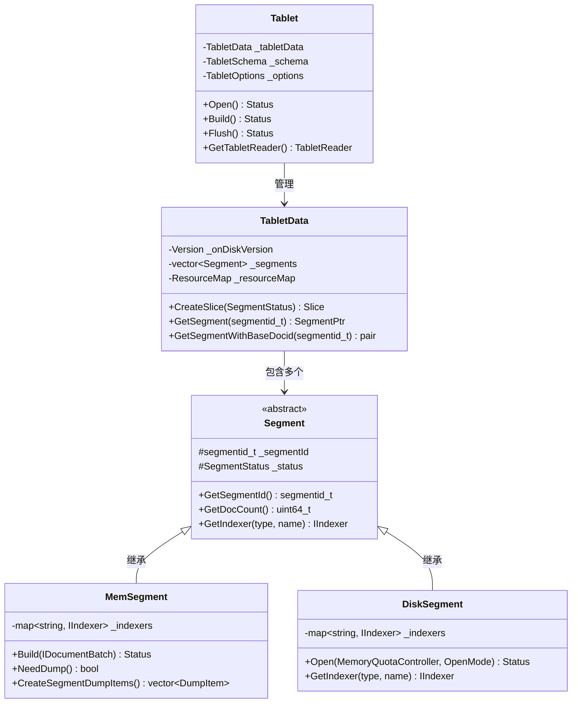
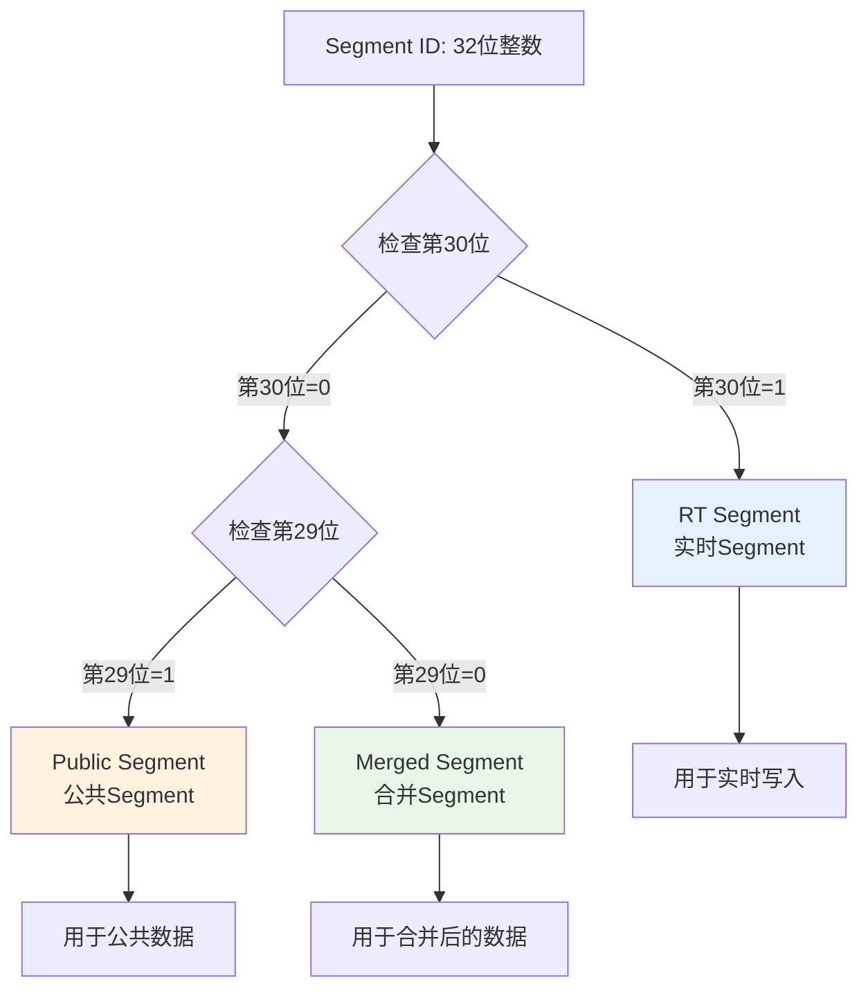
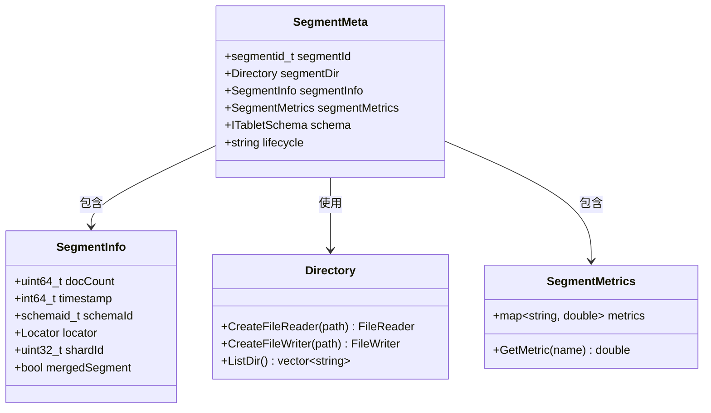
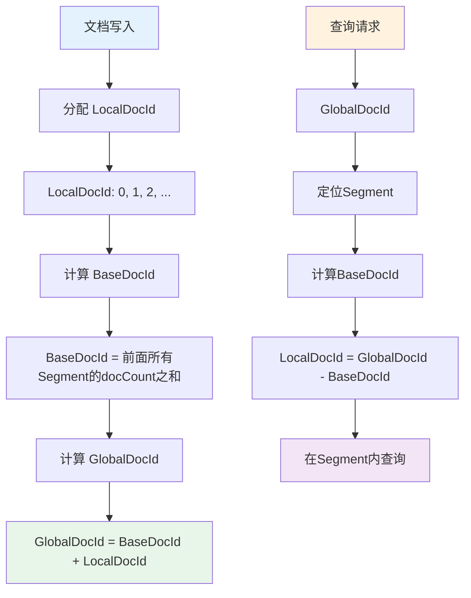
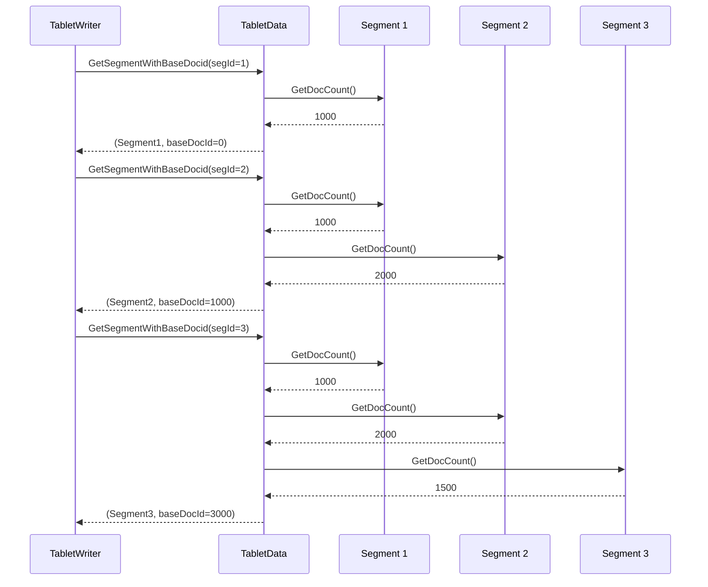
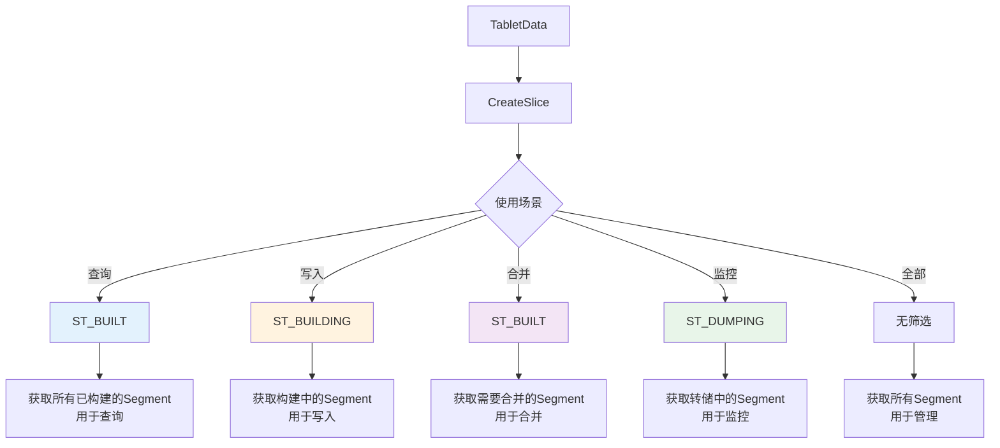
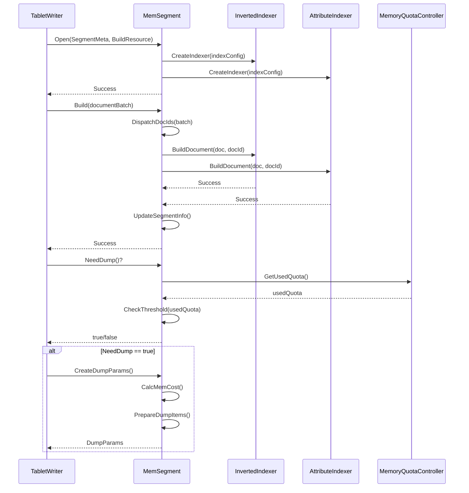
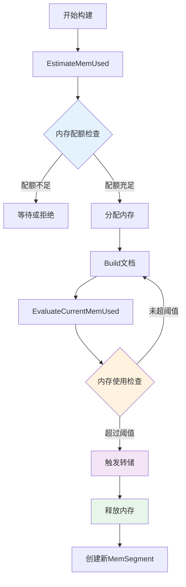
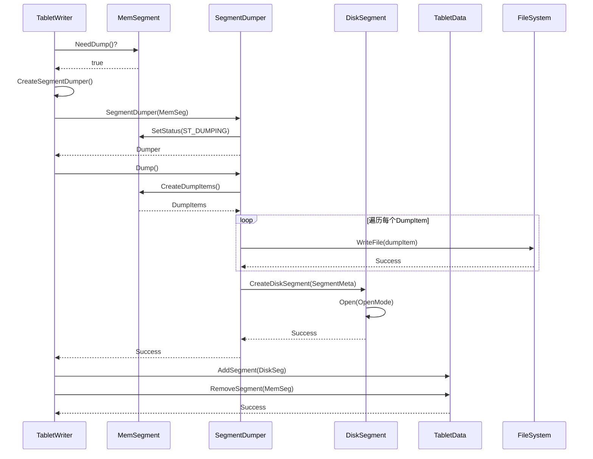
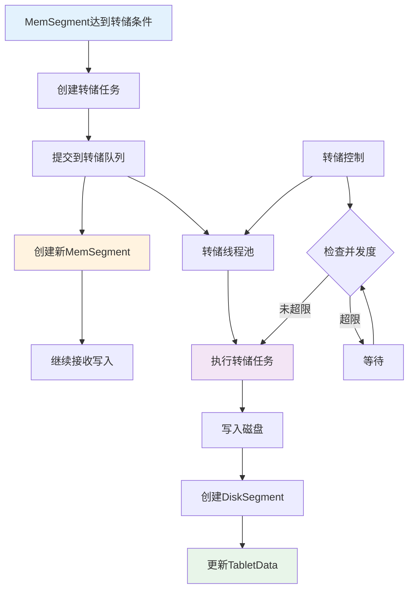

在上一篇文章中，我们介绍了 IndexLib 的整体架构和核心概念。本文将继续深入，详细解析 Tablet 和 Segment 的组织方式，这是理解 IndexLib 索引机制的关键。

## 1. Tablet 与 Segment 的关系

Tablet 和 Segment 的组织关系是 IndexLib 索引机制的核心。让我们通过类图来理解它们的关系：



**组织关系**：
- **一个 Tablet 包含多个 Segment**：通过 TabletData 管理有序的 Segment 列表
- **Segment 有序排列**：按照 SegmentId 排序，保证 DocId 映射的正确性
- **Segment 类型**：分为 MemSegment（内存段）和 DiskSegment（磁盘段）

### 1.1 整体组织架构

Tablet 是索引表的完整抽象，而 Segment 是索引的基本存储单元。一个 Tablet 包含多个 Segment，这些 Segment 按照时间顺序组织，共同构成完整的索引。

通过阅读源码，我们可以看到 Tablet 和 Segment 的关系定义在 `framework/TabletData.h` 中：

```cpp
// framework/TabletData.h
class TabletData : private autil::NoCopyable
{
private:
    Version _onDiskVersion;                               // 磁盘版本
    std::vector<std::shared_ptr<Segment>> _segments;     // Segment 列表（有序）
    std::shared_ptr<ResourceMap> _resourceMap;           // 共享资源
};
```

**关键设计**：
- **有序列表**：`_segments` 是一个有序的 Segment 列表，按照 SegmentId 排序
- **版本管理**：`_onDiskVersion` 记录哪些 Segment 已持久化
- **共享资源**：多个 Segment 共享 `ResourceMap`（内存池、缓存等）

### 1.2 Segment 的 ID 分配机制

Segment 的 ID 分配有特殊的规则，定义在 `framework/Segment.h` 中：

```cpp
// framework/Segment.h
class Segment {
public:
    // Segment ID 的掩码定义
    static constexpr segmentid_t RT_SEGMENT_ID_MASK = (segmentid_t)0x1 << 30;      // 实时 Segment
    static constexpr segmentid_t MERGED_SEGMENT_ID_MASK = (segmentid_t)0x0;         // 合并 Segment
    static constexpr segmentid_t PUBLIC_SEGMENT_ID_MASK = (segmentid_t)0x1 << 29;   // 公共 Segment
    static constexpr segmentid_t PRIVATE_SEGMENT_ID_MASK = (segmentid_t)0x1 << 30; // 私有 Segment

    // 判断 Segment 类型
    static bool IsRtSegmentId(segmentid_t segId) { 
        return (segId & RT_SEGMENT_ID_MASK) > 0; 
    }
    
    static bool IsMergedSegmentId(segmentid_t segId) {
        return segId != INVALID_SEGMENTID && 
               (segId & (PUBLIC_SEGMENT_ID_MASK | PRIVATE_SEGMENT_ID_MASK)) == 0;
    }
};
```

**Segment ID 的分类**：

Segment ID 采用位掩码机制，通过不同的位来区分 Segment 的类型和属性。这种设计使得 ID 分配和类型判断都非常高效：



**Segment ID 分配规则**：

- **实时 Segment（RT Segment）**：ID 的第 30 位为 1（`0x40000000`），用于实时写入
  - **特点**：支持实时写入，转储后变为 DiskSegment
  - **用途**：接收实时数据，提供低延迟写入能力
  
- **合并 Segment（Merged Segment）**：ID 的第 29、30 位都为 0，用于合并后的 Segment
  - **特点**：由多个 Segment 合并而成，只读
  - **用途**：优化索引结构，减少 Segment 数量，提高查询性能
  
- **公共/私有 Segment**：通过第 29 位区分
  - **Public Segment**：第 29 位为 1（`0x20000000`），用于公共数据
  - **Private Segment**：第 29 位为 0，用于私有数据

**设计优势**：
- **快速判断**：通过位运算快速判断 Segment 类型，时间复杂度 O(1)
- **ID 空间利用**：32 位 ID 可以支持 40 亿个 Segment，足够使用
- **类型安全**：通过类型判断避免误操作（如对 Merged Segment 进行写入）

## 2. Segment 的元数据：SegmentMeta 与 SegmentInfo

### 2.1 SegmentMeta：Segment 的元数据

`SegmentMeta` 记录 Segment 的元数据信息，定义在 `framework/SegmentMeta.h` 中：

```cpp
// framework/SegmentMeta.h
struct SegmentMeta {
    segmentid_t segmentId;                                    // Segment ID
    std::shared_ptr<indexlib::file_system::Directory> segmentDir;  // Segment 目录
    std::shared_ptr<SegmentInfo> segmentInfo;                  // Segment 信息
    std::shared_ptr<indexlib::framework::SegmentMetrics> segmentMetrics;  // Segment 指标
    std::shared_ptr<config::ITabletSchema> schema;            // Schema
    std::string lifecycle;                                     // 生命周期标签
};
```

**SegmentMeta 的组成**：

SegmentMeta 是 Segment 的元数据容器，包含了 Segment 的所有元信息。让我们通过类图来理解其结构：



**字段详解**：

- **segmentId**：Segment 的唯一标识，用于区分不同的 Segment
- **segmentDir**：Segment 的目录，用于文件操作（读取索引文件、写入转储文件等）
- **segmentInfo**：Segment 的详细信息（文档数、Locator、分片信息等）
- **segmentMetrics**：Segment 的指标信息（内存使用、IO 统计等），用于监控和调优
- **schema**：Segment 使用的 Schema（支持 Schema 演进，每个 Segment 可以有不同的 SchemaId）
- **lifecycle**：生命周期标签，用于数据管理（如冷热数据分离、数据归档等）

**设计原理**：
- **元数据分离**：将元数据与数据分离，便于管理和查询
- **Schema 演进**：每个 Segment 记录自己的 SchemaId，支持 Schema 变更
- **生命周期管理**：通过 lifecycle 标签实现数据的分层存储和管理

### 2.2 SegmentInfo：Segment 的详细信息

`SegmentInfo` 记录 Segment 的详细信息，定义在 `framework/SegmentInfo.h` 中：

```cpp
// framework/SegmentInfo.h
class SegmentInfo : public autil::legacy::Jsonizable
{
public:
    // 基本信息
    volatile uint64_t docCount = 0;              // 文档数量
    int64_t timestamp = INVALID_TIMESTAMP;      // 时间戳
    schemaid_t schemaId = DEFAULT_SCHEMAID;     // Schema ID
    
    // Locator 信息
    Locator GetLocator() const;
    void SetLocator(const Locator& locator);
    
    // 分片信息
    uint32_t shardId = INVALID_SHARDING_ID;      // 分片 ID
    uint32_t shardCount = 1;                    // 分片数量
    
    // 其他信息
    bool mergedSegment = false;                 // 是否合并 Segment
    uint32_t maxTTL = 0;                        // 最大 TTL
    std::map<std::string, std::string> descriptions;  // 描述信息
};
```

**SegmentInfo 的关键字段**：


- **docCount**：Segment 中的文档数量，用于 DocId 映射
- **Locator**：数据位置信息，用于增量更新
- **shardId/shardCount**：分片信息，支持分片存储
- **mergedSegment**：标识是否为合并 Segment

## 3. DocId 映射机制

### 3.1 全局 DocId 与局部 DocId

IndexLib 使用两级 DocId 机制：
- **全局 DocId**：在整个 Tablet 范围内唯一的文档 ID
- **局部 DocId**：在单个 Segment 内的文档 ID（从 0 开始）

**DocId 映射关系**：

IndexLib 使用两级 DocId 机制，这是理解索引查询和构建的关键。让我们通过流程图来理解 DocId 的映射关系：



**DocId 映射示例**：

假设有 3 个 Segment：
- Segment 1：docCount=1000，baseDocId=0，LocalDocId 范围 [0, 999]
- Segment 2：docCount=2000，baseDocId=1000，LocalDocId 范围 [0, 1999]
- Segment 3：docCount=1500，baseDocId=3000，LocalDocId 范围 [0, 1499]

那么：
- Segment 1 的 GlobalDocId 范围：[0, 999]
- Segment 2 的 GlobalDocId 范围：[1000, 2999]
- Segment 3 的 GlobalDocId 范围：[3000, 4499]

从代码中可以看到，`TabletData` 提供了获取 Segment 及其基础 DocId 的方法：

```cpp
// framework/TabletData.h
class TabletData {
public:
    // 获取 Segment 及其基础 DocId
    // 返回：(Segment 指针, 基础 DocId)
    std::pair<SegmentPtr, docid64_t> GetSegmentWithBaseDocid(segmentid_t segmentId);
};
```

**DocId 计算逻辑**（通过代码分析）：

```cpp
// 伪代码：计算全局 DocId
docid64_t globalDocId = baseDocId + localDocId;

// 其中：
// - baseDocId：前面所有 Segment 的文档数之和
// - localDocId：当前 Segment 内的局部 DocId
```

### 3.2 BaseDocId 的计算

BaseDocId 是 Segment 的全局 DocId 起始值，等于前面所有 Segment 的文档数之和：


**BaseDocId 计算流程**：



**计算示例**：
- Segment 1：docCount=1000，baseDocId=0（前面没有 Segment）
- Segment 2：docCount=2000，baseDocId=1000（Segment 1 的 docCount）
- Segment 3：docCount=1500，baseDocId=3000（Segment 1 + Segment 2 的 docCount）

**代码实现逻辑**（通过阅读源码理解）：

```cpp
// TabletData 内部维护 Segment 列表
// 计算 baseDocId 时，遍历前面的 Segment，累加 docCount
docid64_t baseDocId = 0;
for (auto& seg : _segments) {
    if (seg->GetSegmentId() == segmentId) {
        break;
    }
    baseDocId += seg->GetDocCount();
}
```

## 4. TabletData 的 Segment 管理

### 4.1 Segment 的添加与移除

TabletData 通过 `Init()` 方法初始化 Segment 列表：

```cpp
// framework/TabletData.h
class TabletData {
public:
    // 初始化：设置版本和 Segment 列表
    Status Init(Version onDiskVersion, 
                std::vector<SegmentPtr> segments,
                const std::shared_ptr<ResourceMap>& resourceMap);
};
```

**Segment 列表的维护**：


- **初始化**：通过 `Init()` 设置初始 Segment 列表
- **添加**：新 Segment 通过 `TabletWriter` 创建后添加到列表
- **移除**：合并后，旧 Segment 从列表中移除
- **更新**：`Reopen()` 时更新 Segment 列表

### 4.2 Slice 机制：按状态筛选 Segment

`Slice` 是 TabletData 提供的 Segment 视图机制，可以按状态筛选 Segment：

```cpp
// framework/TabletData.h
class TabletData {
public:
    class Slice {
        // 提供迭代器，可以遍历筛选后的 Segment
        auto begin() { return _cBegin; }
        auto end() { return _cEnd; }
        auto rbegin() { return _cRbegin; }
        auto rend() { return _cRend; }
    };
    
    // 创建 Slice：按状态筛选
    Slice CreateSlice(Segment::SegmentStatus segmentStatus) const;
};
```

**Slice 的使用场景**：

Slice 机制是 TabletData 的核心设计，提供了灵活的 Segment 筛选能力。让我们通过流程图来理解不同场景下的使用：



**使用场景详解**：

1. **查询时**：`CreateSlice(ST_BUILT)` 获取所有已构建的 Segment
   - **目的**：只查询已持久化的 Segment，保证数据一致性
   - **性能**：跳过构建中的 Segment，减少不必要的查询
   
2. **写入时**：`CreateSlice(ST_BUILDING)` 获取构建中的 Segment
   - **目的**：获取当前正在构建的 MemSegment，用于写入
   - **场景**：检查是否需要创建新的 MemSegment
   
3. **合并时**：`CreateSlice(ST_BUILT)` 获取需要合并的 Segment
   - **目的**：获取所有已构建的 Segment，用于合并策略选择
   - **优化**：可以进一步筛选（如按大小、时间等）
   
4. **监控时**：`CreateSlice(ST_DUMPING)` 获取转储中的 Segment
   - **目的**：监控转储进度，统计转储任务
   - **用途**：性能监控、资源管理

**设计优势**：
- **封装性**：隐藏内部实现，外部代码不需要知道 Segment 的存储方式
- **性能**：Slice 是轻量级视图，不复制数据，只是提供迭代器
- **灵活性**：支持按状态、类型、时间等多种条件筛选
- **线程安全**：Slice 的创建和遍历是线程安全的

## 5. MemSegment 的实现细节

### 5.1 NormalMemSegment 的构建流程

通过阅读 `table/normal_table/NormalMemSegment.h`，我们可以看到 NormalMemSegment 的实现：

```cpp
// table/normal_table/NormalMemSegment.h
class NormalMemSegment : public plain::PlainMemSegment
{
public:
    NormalMemSegment(const config::TabletOptions* options, 
                    const std::shared_ptr<config::ITabletSchema>& schema,
                    const framework::SegmentMeta& segmentMeta);
    
protected:
    // 创建转储参数
    std::pair<Status, std::shared_ptr<framework::DumpParams>> CreateDumpParams() override;
    
    // 计算转储内存成本
    void CalcMemCostInCreateDumpParams() override;
};
```

**MemSegment 的构建流程**：

MemSegment 的构建是索引写入的核心流程。让我们通过序列图来理解完整的构建过程：



**构建流程详解**：

1. **Open**：初始化构建资源，创建 Indexer
   - **资源初始化**：创建内存池、缓存等资源
   - **Indexer 创建**：根据 Schema 创建倒排索引、正排索引等 Indexer
   - **状态设置**：设置 Segment 状态为 `ST_BUILDING`
   
2. **Build**：接收文档批次，写入各个 Indexer
   - **DocId 分配**：为文档分配局部 DocId（从 0 开始递增）
   - **文档写入**：将文档写入各个 Indexer（倒排索引、正排索引等）
   - **元数据更新**：更新 SegmentInfo（docCount、Locator 等）
   
3. **NeedDump**：检查是否达到转储条件
   - **内存检查**：检查内存使用是否达到阈值
   - **文档数检查**：检查文档数是否达到阈值
   - **时间检查**：检查是否达到转储时间间隔
   
4. **CreateDumpParams**：创建转储参数，计算内存成本
   - **内存估算**：估算转储所需的内存
   - **转储项准备**：准备转储项列表（索引文件、元数据文件等）
   - **资源预留**：预留转储所需的内存和 IO 资源

### 5.2 MemSegment 的内存管理

MemSegment 在内存中构建索引，需要严格控制内存使用。关键代码（`table/plain/PlainMemSegment.h`）：

```cpp
class PlainMemSegment : public MemSegment {
public:
    // 估算内存使用
    std::pair<Status, size_t> EstimateMemUsed(
        const std::shared_ptr<config::ITabletSchema>& schema) override;
    
    // 评估当前内存使用
    size_t EvaluateCurrentMemUsed() override;
};
```

**内存管理机制**：

MemSegment 的内存管理是保证系统稳定性的关键。让我们通过流程图来理解内存管理的完整机制：



**内存管理策略**：

- **估算**：`EstimateMemUsed()` 估算构建所需内存
  - **目的**：在构建前预估内存需求，避免内存不足
  - **方法**：根据 Schema、文档数、索引类型等估算
  - **精度**：估算值通常略大于实际值，保证安全
  
- **评估**：`EvaluateCurrentMemUsed()` 评估当前实际内存使用
  - **目的**：实时监控内存使用，及时触发转储
  - **方法**：统计所有 Indexer 的内存使用
  - **频率**：每次 Build 后评估，或定期评估
  
- **控制**：通过 `MemoryQuotaController` 控制内存上限
  - **配额管理**：为每个 Tablet 分配内存配额
  - **动态调整**：根据系统负载动态调整配额
  - **超限处理**：内存超限时触发转储或拒绝写入
  
- **转储**：达到阈值时触发转储，释放内存
  - **触发条件**：内存使用超过阈值、文档数超过阈值、时间间隔达到
  - **转储策略**：异步转储，不阻塞写入
  - **内存释放**：转储完成后释放 MemSegment 的内存

**性能优化**：
- **内存池**：使用内存池减少内存分配开销
- **预分配**：预分配常用大小的内存块，减少系统调用
- **内存复用**：转储后复用内存，减少内存分配

## 6. DiskSegment 的实现细节

### 6.1 NormalDiskSegment 的加载流程

通过阅读 `table/normal_table/NormalDiskSegment.h`，我们可以看到 NormalDiskSegment 的实现：

```cpp
// table/normal_table/NormalDiskSegment.h
class NormalDiskSegment : public plain::PlainDiskSegment
{
public:
    NormalDiskSegment(const std::shared_ptr<config::ITabletSchema>& schema,
                     const framework::SegmentMeta& segmentMeta, 
                     const framework::BuildResource& buildResource);
    
    // 估算内存使用
    std::pair<Status, size_t> EstimateMemUsed(
        const std::shared_ptr<config::ITabletSchema>& schema) override;

private:
    // 打开 Indexer
    std::pair<Status, std::vector<plain::DiskIndexerItem>>
    OpenIndexer(const std::shared_ptr<config::IIndexConfig>& indexConfig) override;
};
```

**DiskSegment 的加载流程**：


1. **Open**：打开 Segment 目录，读取 SegmentInfo
2. **OpenIndexer**：按需打开各个 Indexer（NORMAL 模式立即打开，LAZY 模式按需打开）
3. **GetIndexer**：查询时获取 Indexer，LAZY 模式下此时才加载
4. **Reopen**：Schema 变更时重新打开

### 6.2 DiskSegment 的按需加载

DiskSegment 支持按需加载，通过 `GetIndexer()` 方法实现：

```cpp
// framework/Segment.h
class Segment {
public:
    // 获取 Indexer（LAZY 模式下按需加载）
    virtual std::pair<Status, std::shared_ptr<indexlibv2::index::IIndexer>> 
        GetIndexer(const std::string& type, const std::string& indexName) {
        return std::make_pair(Status::NotFound(), nullptr);
    }
};
```

**按需加载的优势**：


- **减少内存占用**：只加载查询需要的索引
- **提高启动速度**：不需要等待所有索引加载完成
- **灵活查询**：支持部分索引查询场景

## 7. TabletWriter 与 Segment 的交互

### 7.1 TabletWriter 的构建流程

通过阅读 `table/normal_table/NormalTabletWriter.h`，我们可以看到 TabletWriter 的实现：

```cpp
// table/normal_table/NormalTabletWriter.h
class NormalTabletWriter : public table::CommonTabletWriter
{
public:
    // 打开：初始化 TabletData 和构建资源
    Status Open(const std::shared_ptr<framework::TabletData>& tabletData, 
                const framework::BuildResource& buildResource,
                const framework::OpenOptions& openOptions) override;
    
    // 构建：接收文档批次并写入
    Status Build(const std::shared_ptr<document::IDocumentBatch>& batch) override;
    
    // 创建 SegmentDumper：准备转储
    std::unique_ptr<framework::SegmentDumper> CreateSegmentDumper() override;

private:
    std::shared_ptr<NormalMemSegment> _normalBuildingSegment;  // 当前构建中的 Segment
    docid_t _buildingSegmentBaseDocId;                         // 构建 Segment 的基础 DocId
};
```

**TabletWriter 与 Segment 的交互流程**：


1. **Open**：初始化 TabletData，创建或获取 MemSegment
2. **Build**：将文档写入 `_normalBuildingSegment`
3. **NeedDump**：检查 MemSegment 是否需要转储
4. **CreateSegmentDumper**：创建转储器，准备转储
5. **Dump**：将 MemSegment 转储为 DiskSegment
6. **Reopen**：更新 TabletData，添加新的 DiskSegment

### 7.2 文档的 DocId 分配

TabletWriter 在构建时需要为文档分配 DocId。关键代码：

```cpp
// table/normal_table/NormalTabletWriter.h
class NormalTabletWriter {
private:
    // 分发 DocId：为文档分配 DocId
    void DispatchDocIds(document::IDocumentBatch* batch);
    
    docid_t _buildingSegmentBaseDocId;  // 当前构建 Segment 的基础 DocId
};
```

**DocId 分配机制**：


- **BaseDocId**：当前 MemSegment 的全局 DocId 起始值
- **LocalDocId**：在 MemSegment 内的局部 DocId（从 0 开始递增）
- **GlobalDocId**：`baseDocId + localDocId`

## 8. Segment 的转储机制

### 8.1 SegmentDumper：转储器

`SegmentDumper` 负责将 MemSegment 转储到磁盘，定义在 `framework/SegmentDumper.h` 中：

```cpp
// framework/SegmentDumper.h
class SegmentDumper : public SegmentDumpable
{
public:
    SegmentDumper(const std::string& tabletName, 
                  const std::shared_ptr<MemSegment>& segment,
                  int64_t dumpExpandMemSize,
                  std::shared_ptr<kmonitor::MetricsReporter> metricsReporter)
        : _tabletName(tabletName)
        , _dumpingSegment(segment)
        , _dumpExpandMemSize(dumpExpandMemSize)
    {
        // 设置 Segment 状态为 DUMPING
        _dumpingSegment->SetSegmentStatus(Segment::SegmentStatus::ST_DUMPING);
    }
    
    // 执行转储
    virtual Status Dump() = 0;
    
    // 获取转储的 SegmentMeta
    virtual std::pair<Status, SegmentMeta> GetDumpedSegmentMeta() = 0;
};
```

**转储流程**：

转储是将 MemSegment 持久化为 DiskSegment 的关键步骤。让我们通过序列图来理解完整的转储流程：



**转储流程详解**：

1. **创建 Dumper**：`CreateSegmentDumper()` 创建转储器
   - **参数准备**：准备转储参数（内存配额、IO 配额等）
   - **资源预留**：预留转储所需的内存和 IO 资源
   - **转储项创建**：创建转储项列表（索引文件、元数据文件等）
   
2. **设置状态**：将 MemSegment 状态设置为 `ST_DUMPING`
   - **状态转换**：从 `ST_BUILDING` 转换为 `ST_DUMPING`
   - **写入保护**：设置状态后，MemSegment 不再接收新文档
   - **并发控制**：通过状态标记避免并发转储
   
3. **执行转储**：调用 `Dump()` 将内存数据写入磁盘
   - **索引转储**：将各个 Indexer 的数据写入磁盘文件
   - **元数据转储**：将 SegmentInfo、SegmentMetrics 等写入磁盘
   - **文件组织**：按照索引格式组织文件（Package、Archive 等）
   
4. **创建 DiskSegment**：转储完成后创建 DiskSegment
   - **SegmentMeta 创建**：创建 DiskSegment 的 SegmentMeta
   - **DiskSegment 初始化**：调用 `Open()` 初始化 DiskSegment
   - **索引加载**：根据 OpenMode 决定是否立即加载索引
   
5. **更新状态**：MemSegment 状态变为 `ST_BUILT`（实际已被 DiskSegment 替代）
   - **TabletData 更新**：将 DiskSegment 添加到 TabletData
   - **MemSegment 移除**：从 TabletData 移除 MemSegment
   - **资源释放**：释放 MemSegment 的内存资源

### 8.2 转储的异步机制

转储是异步的，不会阻塞新的写入。关键设计：

```cpp
// framework/SegmentDumper.h
class DumpControl {
public:
    // 控制转储任务的执行
    std::tuple<uint32_t, uint32_t> StartTask();
    std::tuple<uint32_t, uint32_t> Iterate(Status& taskStatus);
    uint32_t ExitTask(const bool isCoordinator);

private:
    std::atomic<uint32_t> _finishCount = 0;  // 完成的任务数
    uint32_t _totalCount;                     // 总任务数
    std::mutex _dumpMutex;                    // 转储互斥锁
    std::condition_variable _dumpCv;          // 转储条件变量
};
```

**异步转储的优势**：

异步转储是 IndexLib 高性能写入的关键设计。让我们通过流程图来理解异步转储的机制：



**异步转储的优势**：

- **不阻塞写入**：转储过程中可以创建新的 MemSegment 继续接收写入
  - **写入连续性**：写入操作不会被转储阻塞，保证低延迟
  - **吞吐量提升**：写入和转储并行，提高系统吞吐量
  - **用户体验**：用户写入请求可以立即返回，不需要等待转储完成
  
- **提高吞吐量**：写入和转储可以并行进行
  - **CPU 利用**：充分利用多核 CPU，写入和转储可以并行执行
  - **IO 优化**：转储 IO 和写入 IO 可以并行，提高 IO 利用率
  - **资源平衡**：通过资源控制平衡写入和转储的资源使用
  
- **资源控制**：通过 `DumpControl` 控制转储任务的并发度
  - **并发限制**：限制同时进行的转储任务数量，避免资源竞争
  - **优先级调度**：支持转储任务的优先级调度，重要任务优先执行
  - **资源监控**：监控转储任务的资源使用，及时调整策略

**性能优化**：
- **写入延迟**：异步转储有效降低写入延迟
- **吞吐量**：并行写入和转储显著提高吞吐量
- **资源利用**：CPU 和 IO 利用率显著提升

## 9. Segment 的查询机制

### 9.1 多 Segment 并行查询

查询时需要遍历多个 Segment，可以并行查询以提高性能：


**查询流程**：
1. **获取 Segment 列表**：`TabletData->CreateSlice(ST_BUILT)` 获取所有已构建的 Segment
2. **并行查询**：对每个 Segment 的 Indexer 进行查询（如果支持并行）
3. **合并结果**：将各 Segment 的查询结果合并（去重、排序等）

### 9.2 DocId 转换

查询时需要将全局 DocId 转换为局部 DocId：

```cpp
// 伪代码：全局 DocId 转局部 DocId
for (auto& seg : segments) {
    docid64_t baseDocId = GetBaseDocId(seg);
    if (globalDocId >= baseDocId && globalDocId < baseDocId + seg->GetDocCount()) {
        docid_t localDocId = globalDocId - baseDocId;
        // 在 Segment 内查询
        return seg->GetIndexer()->Get(localDocId);
    }
}
```

**DocId 转换流程**：


1. **定位 Segment**：根据全局 DocId 找到对应的 Segment
2. **计算 BaseDocId**：计算该 Segment 的基础 DocId
3. **转换为局部 DocId**：`localDocId = globalDocId - baseDocId`
4. **Segment 内查询**：使用局部 DocId 在 Segment 内查询

## 10. Segment 的生命周期管理

### 10.1 Segment 的创建

Segment 的创建通过 `ITabletFactory` 实现：

```cpp
// framework/ITabletFactory.h
class ITabletFactory {
public:
    // 创建 MemSegment
    virtual std::unique_ptr<MemSegment> CreateMemSegment(
        const SegmentMeta& segmentMeta) = 0;
    
    // 创建 DiskSegment
    virtual std::unique_ptr<DiskSegment> CreateDiskSegment(
        const SegmentMeta& segmentMeta,
        const framework::BuildResource& buildResource) = 0;
};
```

**Segment 创建流程**：


1. **创建 SegmentMeta**：设置 SegmentId、Directory、Schema 等
2. **调用 Factory**：通过 `ITabletFactory` 创建 Segment
3. **初始化 Segment**：调用 `Open()` 初始化
4. **添加到 TabletData**：将 Segment 添加到 TabletData 的 Segment 列表

### 10.2 Segment 的销毁

Segment 的销毁通过智能指针自动管理：

```cpp
// Segment 使用 shared_ptr 管理
using SegmentPtr = std::shared_ptr<Segment>;

// 当 Segment 不再被引用时，自动析构
// 析构时会：
// 1. 释放内存资源（MemSegment）
// 2. 关闭文件句柄（DiskSegment）
// 3. 清理 Indexer
```

**Segment 销毁时机**：


- **合并后**：合并后的旧 Segment 不再被引用，自动销毁
- **版本清理**：清理旧版本时，旧 Segment 被销毁
- **资源回收**：通过 `ReclaimSegmentResource()` 主动回收资源

## 11. 实际应用场景

### 11.1 实时写入场景

在实时写入场景中，Tablet 和 Segment 的组织方式：


1. **持续写入**：文档持续写入 MemSegment
2. **定期转储**：MemSegment 达到阈值后转储为 DiskSegment
3. **新 Segment**：创建新的 MemSegment 继续接收写入
4. **版本提交**：定期 Commit，更新 Version

### 11.2 查询场景

在查询场景中，需要遍历多个 Segment：


1. **获取 Segment 列表**：从 TabletData 获取所有已构建的 Segment
2. **并行查询**：对多个 Segment 进行并行查询
3. **结果合并**：合并各 Segment 的查询结果
4. **DocId 转换**：将局部 DocId 转换为全局 DocId

## 12. 性能优化与最佳实践

### 12.1 Segment 大小优化

**Segment 大小的影响**：

- **小 Segment**：
  - **优势**：转储快，内存占用小，查询延迟低
  - **劣势**：Segment 数量多，查询时需要遍历更多 Segment，合并频繁
  
- **大 Segment**：
  - **优势**：Segment 数量少，查询效率高，合并频率低
  - **劣势**：转储慢，内存占用大，查询延迟可能增加

**最佳实践**：
- **实时写入**：使用较小的 Segment（如 100MB），保证低延迟
- **批量构建**：使用较大的 Segment（如 1GB），提高构建效率
- **动态调整**：根据查询负载动态调整 Segment 大小

### 12.2 DocId 映射优化

**优化策略**：

1. **BaseDocId 缓存**：
   - 缓存每个 Segment 的 BaseDocId，避免重复计算
   - 使用有序数组或跳表快速定位 Segment
   
2. **二分查找**：
   - 使用二分查找定位 Segment，时间复杂度 O(log n)
   - 对于大量 Segment 的场景，性能提升明显
   
3. **预计算**：
   - 在 Segment 添加时预计算 BaseDocId
   - 避免查询时的实时计算

### 12.3 内存管理优化

**优化策略**：

1. **内存池**：
   - 使用内存池减少内存分配开销
   - 预分配常用大小的内存块
   
2. **内存回收**：
   - 及时释放不再使用的内存
   - 使用 LRU 等策略回收不常用的索引数据
   
3. **内存监控**：
   - 实时监控内存使用，及时触发转储
   - 设置告警阈值，防止内存溢出

## 13. 小结

Tablet 和 Segment 的组织方式是 IndexLib 索引机制的核心。通过本文的深入解析，我们了解到：

**核心概念**：

- **Tablet 管理多个 Segment**：通过 TabletData 管理有序的 Segment 列表，保证 DocId 映射的正确性
- **Segment ID 分配**：通过位掩码区分不同类型的 Segment（实时、合并等），支持快速类型判断
- **DocId 映射**：使用两级 DocId 机制（全局 DocId = baseDocId + localDocId），支持高效的文档定位
- **SegmentMeta 和 SegmentInfo**：记录 Segment 的元数据和详细信息，支持 Schema 演进和生命周期管理
- **MemSegment 和 DiskSegment**：内存段用于实时写入，磁盘段用于持久化存储，采用策略模式实现
- **转储机制**：MemSegment 转储为 DiskSegment 是异步的，不阻塞写入，提高系统吞吐量
- **查询机制**：查询时遍历多个 Segment，可以并行查询提高性能，通过 DocId 映射实现全局查询
- **生命周期管理**：通过智能指针自动管理 Segment 的生命周期，保证资源正确释放

**设计亮点**：

1. **两级 DocId 机制**：通过 BaseDocId 和 LocalDocId 实现高效的文档定位和查询
2. **Slice 机制**：提供灵活的 Segment 筛选，隐藏内部实现，提高代码可维护性
3. **异步转储**：转储不阻塞写入，写入和转储并行，提高系统吞吐量
4. **按需加载**：DiskSegment 支持按需加载，减少内存占用，提高启动速度
5. **资源管理**：通过 ResourceMap 共享资源，减少资源开销，提高系统效率

**性能优化**：

- **Segment 大小优化**：根据场景选择合适的 Segment 大小，平衡写入和查询性能
- **DocId 映射优化**：通过缓存、二分查找等优化 DocId 定位性能
- **内存管理优化**：使用内存池、及时回收、实时监控等优化内存使用

理解 Tablet 和 Segment 的组织方式，是掌握 IndexLib 索引构建和查询机制的基础。在下一篇文章中，我们将深入介绍索引构建的完整流程，包括 Build、Flush、Seal、Commit 等各个阶段的实现细节和性能优化策略。
