在上一篇文章中，我们深入了解了 Tablet 和 Segment 的组织方式。本文将继续深入，详细解析索引构建的完整流程，这是理解 IndexLib 如何从文档构建索引的关键。

**索引构建流程图**：

```mermaid
flowchart TD
    Start[开始构建] --> ReceiveDoc[接收文档批次<br/>IDocumentBatch]
    
    ReceiveDoc --> BuildStart[Build阶段]
    
    subgraph BuildGroup["1. Build阶段：构建索引到内存"]
        direction TB
        B1[文档验证<br/>格式/Schema验证]
        B2[分配DocId<br/>BaseDocId + LocalDocId]
        B3[写入Indexer<br/>InvertedIndexer/AttributeIndexer]
        B4[更新SegmentInfo<br/>docCount/Locator]
        B5[评估内存使用<br/>EvaluateCurrentMemUsed]
        B6{是否需要Flush?<br/>内存超阈值/文档数超阈值}
        
        B1 --> B2
        B2 --> B3
        B3 --> B4
        B4 --> B5
        B5 --> B6
    end
    
    BuildStart --> B1
    B6 -->|否，继续构建| ReceiveDoc
    B6 -->|是，触发转储| FlushStart[Flush阶段]
    
    subgraph FlushGroup["2. Flush阶段：转储到磁盘"]
        direction TB
        F1[创建SegmentDumper<br/>准备转储]
        F2[转储MemSegment<br/>异步转储索引文件]
        F3[创建DiskSegment<br/>加载转储后的Segment]
        F4[更新TabletData<br/>添加DiskSegment]
        F5{是否需要Seal?<br/>Segment数量/时间间隔}
        
        F1 --> F2
        F2 --> F3
        F3 --> F4
        F4 --> F5
    end
    
    FlushStart --> F1
    F5 -->|否，继续构建| ReceiveDoc
    F5 -->|是，触发封存| SealStart[Seal阶段]
    
    subgraph SealGroup["3. Seal阶段：封存Segment"]
        direction TB
        S1[封存当前MemSegment<br/>标记为只读]
        S2[等待转储完成<br/>确保数据已持久化]
        S3[更新Segment状态<br/>ST_BUILT]
        S4{是否需要Commit?<br/>版本更新条件}
        
        S1 --> S2
        S2 --> S3
        S3 --> S4
    end
    
    SealStart --> S1
    S4 -->|否，继续构建| ReceiveDoc
    S4 -->|是，触发提交| CommitStart[Commit阶段]
    
    subgraph CommitGroup["4. Commit阶段：提交版本"]
        direction TB
        C1[准备新Version<br/>收集Segment列表]
        C2[更新Locator<br/>记录最新处理位置]
        C3[写入Version文件<br/>序列化为JSON]
        C4[创建Fence目录<br/>保证原子性]
        C5[原子切换版本<br/>重命名Fence目录]
        C6[更新TabletData<br/>切换到新版本]
        
        C1 --> C2
        C2 --> C3
        C3 --> C4
        C4 --> C5
        C5 --> C6
    end
    
    CommitStart --> C1
    C6 --> Continue{继续构建?}
    Continue -->|是| ReceiveDoc
    Continue -->|否| End[构建完成]
    
    B6 -.->|循环构建| ReceiveDoc
    F5 -.->|循环构建| ReceiveDoc
    S4 -.->|循环构建| ReceiveDoc
    
    style Start fill:#e3f2fd,stroke:#1976d2,stroke-width:2px
    style ReceiveDoc fill:#e3f2fd,stroke:#1976d2,stroke-width:2px
    style BuildStart fill:#e3f2fd,stroke:#1976d2,stroke-width:2px
    style BuildGroup fill:#e3f2fd,stroke:#1976d2,stroke-width:2px
    style B6 fill:#fff3e0,stroke:#f57c00,stroke-width:2px
    style FlushStart fill:#fff3e0,stroke:#f57c00,stroke-width:2px
    style FlushGroup fill:#fff3e0,stroke:#f57c00,stroke-width:2px
    style F5 fill:#fff3e0,stroke:#f57c00,stroke-width:2px
    style SealStart fill:#f3e5f5,stroke:#7b1fa2,stroke-width:2px
    style SealGroup fill:#f3e5f5,stroke:#7b1fa2,stroke-width:2px
    style S4 fill:#f3e5f5,stroke:#7b1fa2,stroke-width:2px
    style CommitStart fill:#e8f5e9,stroke:#2e7d32,stroke-width:2px
    style CommitGroup fill:#e8f5e9,stroke:#2e7d32,stroke-width:2px
    style Continue fill:#fff3e0,stroke:#f57c00,stroke-width:2px
    style End fill:#e3f2fd,stroke:#1976d2,stroke-width:2px
```

## 1. 索引构建流程概览

### 1.1 整体流程

IndexLib 的索引构建流程包括四个核心阶段：

1. **Build**：接收文档批次，构建索引到内存（MemSegment）
2. **Flush**：将内存数据刷新到磁盘，创建 DiskSegment
3. **Seal**：封存 Segment，标记为只读，准备合并
4. **Commit**：提交新版本，更新 Version，持久化到磁盘

让我们先通过图来理解整个流程：

**流程关系图**：


### 1.2 核心接口

索引构建的核心接口定义在 `framework/ITablet.h` 中：

```cpp
// framework/ITablet.h
class ITablet : private autil::NoCopyable
{
public:
    // 构建：接收文档批次并写入内存段
    virtual Status Build(const std::shared_ptr<document::IDocumentBatch>& batch) = 0;
    
    // 刷新：将内存数据刷新到磁盘
    virtual Status Flush() = 0;
    
    // 封存：封存当前 Segment，准备合并
    virtual Status Seal() = 0;
    
    // 提交版本：创建新版本并持久化
    virtual std::pair<Status, VersionMeta> Commit(const CommitOptions& commitOptions) = 0;
    
    // 判断是否需要提交
    virtual bool NeedCommit() const = 0;
};
```

**关键设计**：
- **Build**：持续构建，接收文档并写入 MemSegment
  - **设计模式**：采用命令模式，将文档构建封装为命令，支持批量处理和异步执行
  - **性能优化**：支持批量写入、并行构建，提高构建吞吐量
  - **内存控制**：通过内存估算、评估、控制机制，避免内存溢出
  
- **Flush**：触发转储，将 MemSegment 转为 DiskSegment
  - **异步设计**：转储是异步的，不阻塞写入，提高系统吞吐量
  - **资源控制**：通过内存配额和 IO 配额控制转储任务的并发度
  - **原子性**：转储过程保证原子性，要么全部成功，要么全部失败
  
- **Seal**：封存 Segment，标记为只读，不再接收新文档
  - **状态管理**：通过状态转换保证 Segment 的一致性
  - **合并准备**：封存后的 Segment 可以参与合并，优化索引结构
  - **版本控制**：封存是版本提交的前置条件，保证版本一致性
  
- **Commit**：提交版本，更新 Version，持久化到磁盘
  - **原子性保证**：通过 Fence 机制保证版本提交的原子性
  - **版本管理**：版本号单调递增，支持版本回滚
  - **增量更新**：通过 Locator 记录数据处理位置，支持增量更新

## 2. Build：文档构建阶段

### 2.1 Build 流程

Build 阶段负责接收文档批次，将文档写入内存中的索引结构。让我们先通过图来理解 Build 流程：

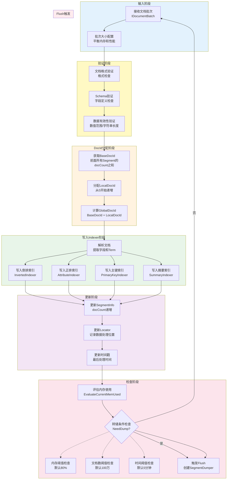

Build 流程包括以下步骤：

1. **接收文档批次**：`Build()` 接收 `IDocumentBatch`
   - **批次处理**：支持批量处理文档，减少函数调用开销
   - **批次大小**：批次大小可以配置，平衡内存和性能
   
2. **文档验证**：验证文档格式、Schema 等
   - **格式验证**：验证文档格式是否符合要求
   - **Schema 验证**：验证文档字段是否符合 Schema 定义
   - **数据验证**：验证数据有效性（如数值范围、字符串长度等）
   
3. **分配 DocId**：为文档分配全局 DocId
   - **BaseDocId 计算**：计算当前 MemSegment 的 BaseDocId
   - **LocalDocId 分配**：在 MemSegment 内分配局部 DocId（从 0 开始递增）
   - **GlobalDocId 计算**：`GlobalDocId = BaseDocId + LocalDocId`
   
4. **写入 Indexer**：将文档写入各个 Indexer（倒排索引、正排索引等）
   - **倒排索引**：将 term 写入倒排索引，建立 term 到文档的映射
   - **正排索引**：将文档属性写入正排索引，支持属性查询
   - **主键索引**：将主键写入主键索引，支持主键查询
   
5. **更新 SegmentInfo**：更新文档数量、Locator 等
   - **文档计数**：更新 SegmentInfo 的 docCount
   - **Locator 更新**：更新 Locator，记录最新的数据处理位置
   - **时间戳更新**：更新时间戳，记录最后处理时间

**Build 流程的序列图**：

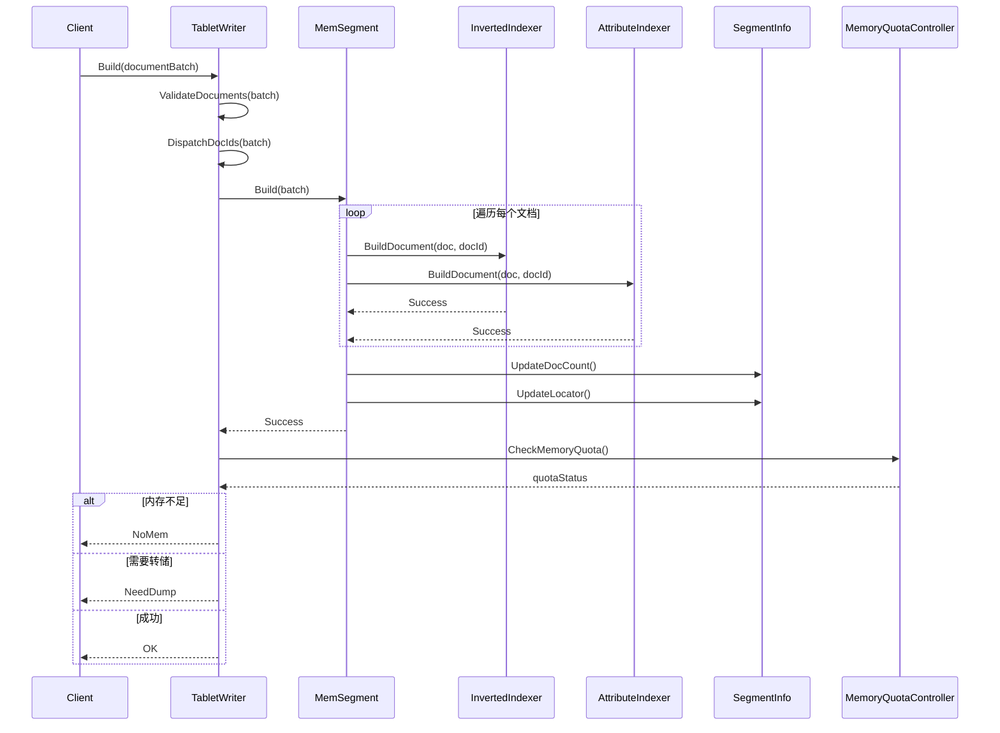

### 2.2 TabletWriter::Build()

`TabletWriter` 是构建的核心实现，定义在 `framework/TabletWriter.h` 中：

```cpp
// framework/TabletWriter.h
class TabletWriter : private autil::NoCopyable
{
public:
    // 构建文档批次
    // 返回值：
    // - OK: 构建成功
    // - NoMem: 内存不足，需要等待内存释放
    // - NeedDump: 触发转储，需要转储并重新打开
    virtual Status Build(const std::shared_ptr<document::IDocumentBatch>& batch) = 0;
    
    // 创建转储器：准备转储 MemSegment
    virtual std::unique_ptr<SegmentDumper> CreateSegmentDumper() = 0;
    
    // 获取总内存使用
    virtual size_t GetTotalMemSize() const = 0;
    
    // 获取构建 Segment 转储所需的内存扩展大小
    virtual size_t GetBuildingSegmentDumpExpandSize() const = 0;
    
    // 判断是否有未提交的数据
    virtual bool IsDirty() const = 0;
};
```

**Build 的返回值**：

Build 方法的返回值反映了构建的状态，调用方需要根据返回值采取相应的行动：

- **OK**：构建成功，可以继续构建
  - **含义**：文档已成功写入 MemSegment，可以继续接收新文档
  - **后续操作**：继续调用 Build 接收新文档，或检查是否需要 Flush
  
- **NoMem**：内存不足，需要等待内存释放或触发转储
  - **含义**：当前内存配额不足，无法继续构建
  - **后续操作**：
    - 等待转储完成释放内存
    - 或主动触发 Flush 释放内存
    - 或拒绝写入，返回错误给客户端
  
- **NeedDump**：触发转储条件，需要转储并重新打开
  - **含义**：MemSegment 已达到转储条件（内存阈值、文档数量等）
  - **后续操作**：
    - 调用 `CreateSegmentDumper()` 创建转储器
    - 调用 `Flush()` 执行转储
    - 转储完成后重新打开，创建新的 MemSegment

**状态转换图**：

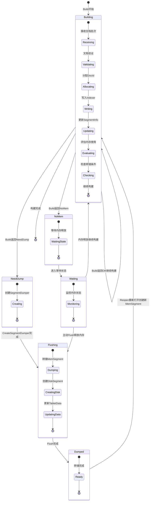

### 2.3 文档的 DocId 分配

在 Build 阶段，需要为文档分配 DocId。关键代码（`table/normal_table/NormalTabletWriter.h`）：

```cpp
// table/normal_table/NormalTabletWriter.h
class NormalTabletWriter : public table::CommonTabletWriter
{
private:
    // 分发 DocId：为文档分配 DocId
    void DispatchDocIds(document::IDocumentBatch* batch);
    
    docid_t _buildingSegmentBaseDocId;  // 当前构建 Segment 的基础 DocId
    std::shared_ptr<NormalMemSegment> _normalBuildingSegment;  // 当前构建中的 Segment
};
```

**DocId 分配机制**：

```mermaid
flowchart TD
    Start[文档写入IDocumentBatch] --> GetMem[获取当前MemSegment]
    GetMem --> GetBase[获取BaseDocId]
    
    GetBase --> BaseStart[BaseDocId计算]
    
    BaseStart --> C1[遍历TabletData中的Segment]
    C1 --> C2[累加前面Segment的docCount]
    C2 --> C3[BaseDocId等于docCount之和]
    
    C3 --> LocalStart[LocalDocId分配]
    
    LocalStart --> D1[获取当前MemSegment的docCount]
    D1 --> D2[LocalDocId从0开始]
    D2 --> D3[LocalDocId递增每个文档加1]
    D3 --> D4[更新docCount递增]
    
    D4 --> GlobalStart[GlobalDocId计算]
    
    GlobalStart --> E1[GlobalDocId等于BaseDocId加LocalDocId]
    E1 --> E2[全局唯一文档ID]
    E2 --> E3[写入Indexer使用GlobalDocId]
    
    E3 --> End[完成]
    
    subgraph BaseGroup["1. BaseDocId计算"]
        C1
        C2
        C3
    end
    
    subgraph LocalGroup["2. LocalDocId分配"]
        D1
        D2
        D3
        D4
    end
    
    subgraph GlobalGroup["3. GlobalDocId计算"]
        E1
        E2
        E3
    end
    
    style Start fill:#e3f2fd,stroke:#1976d2,stroke-width:2px
    style GetMem fill:#e3f2fd,stroke:#1976d2,stroke-width:1px
    style GetBase fill:#e3f2fd,stroke:#1976d2,stroke-width:1px
    style BaseStart fill:#e3f2fd,stroke:#1976d2,stroke-width:2px
    style BaseGroup fill:#e3f2fd,stroke:#1976d2,stroke-width:2px
    style C1 fill:#c5e1f5,stroke:#1976d2,stroke-width:1px
    style C2 fill:#c5e1f5,stroke:#1976d2,stroke-width:1px
    style C3 fill:#c5e1f5,stroke:#1976d2,stroke-width:1px
    style LocalStart fill:#fff3e0,stroke:#f57c00,stroke-width:2px
    style LocalGroup fill:#fff3e0,stroke:#f57c00,stroke-width:2px
    style D1 fill:#ffe0b2,stroke:#f57c00,stroke-width:1px
    style D2 fill:#ffe0b2,stroke:#f57c00,stroke-width:1px
    style D3 fill:#ffe0b2,stroke:#f57c00,stroke-width:1px
    style D4 fill:#ffe0b2,stroke:#f57c00,stroke-width:1px
    style GlobalStart fill:#e8f5e9,stroke:#2e7d32,stroke-width:2px
    style GlobalGroup fill:#e8f5e9,stroke:#2e7d32,stroke-width:2px
    style E1 fill:#c8e6c9,stroke:#2e7d32,stroke-width:1px
    style E2 fill:#c8e6c9,stroke:#2e7d32,stroke-width:1px
    style E3 fill:#c8e6c9,stroke:#2e7d32,stroke-width:1px
    style End fill:#e3f2fd,stroke:#1976d2,stroke-width:2px
```

- **BaseDocId**：当前 MemSegment 的全局 DocId 起始值
- **LocalDocId**：在 MemSegment 内的局部 DocId（从 0 开始递增）
- **GlobalDocId**：`baseDocId + localDocId`

### 2.4 文档写入 Indexer

文档写入各个 Indexer 的过程：

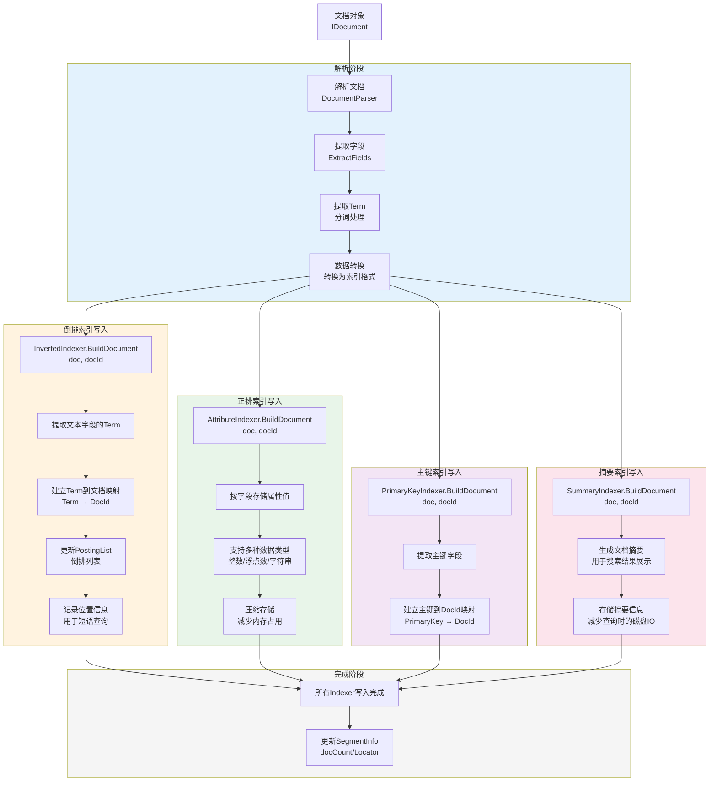

**写入流程**：

文档写入 Indexer 是构建的核心步骤，需要高效地处理大量文档。让我们通过序列图来理解详细的写入流程：

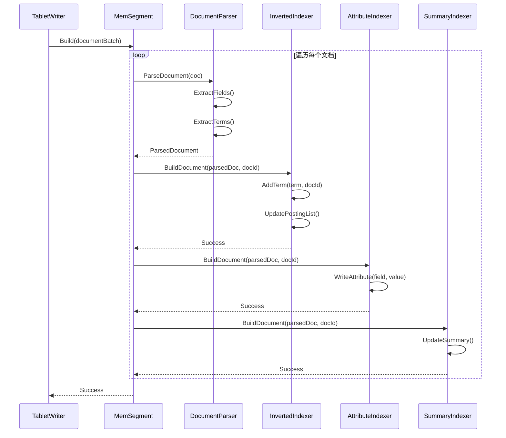

**写入流程详解**：

1. **解析文档**：解析文档字段，提取索引字段
   - **字段提取**：根据 Schema 提取需要索引的字段
   - **Term 提取**：对文本字段进行分词，提取 term
   - **数据转换**：将文档数据转换为索引格式
   
2. **写入倒排索引**：将 term 写入倒排索引
   - **Term 索引**：为每个 term 建立倒排列表
   - **Posting List**：记录包含该 term 的文档列表
   - **位置信息**：记录 term 在文档中的位置（用于短语查询）
   
3. **写入正排索引**：将文档属性写入正排索引
   - **属性存储**：按字段存储文档属性
   - **数据类型**：支持多种数据类型（整数、浮点数、字符串等）
   - **压缩存储**：采用压缩算法减少存储空间
   
4. **更新摘要**：更新文档摘要信息
   - **摘要生成**：生成文档摘要（用于搜索结果展示）
   - **摘要存储**：存储摘要信息，减少查询时的磁盘 IO
   - **摘要更新**：支持摘要的动态更新

**性能优化**：
- **批量写入**：批量处理文档，减少函数调用开销
- **并行写入**：多个 Indexer 可以并行写入，提高构建速度
- **内存优化**：使用内存池减少内存分配开销
- **数据结构优化**：采用高效的数据结构（如跳表、B+树）提高写入性能

### 2.5 内存控制

Build 阶段需要严格控制内存使用，避免内存溢出。关键机制：

**内存控制机制**：

内存控制是保证系统稳定性的关键。让我们通过流程图来理解完整的内存控制机制：

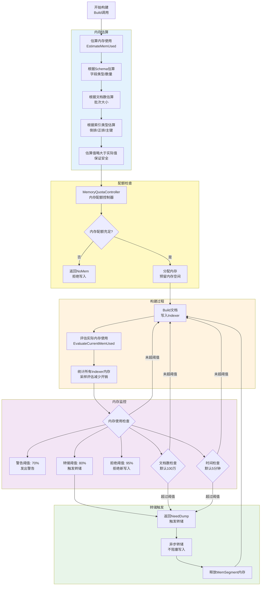

**内存控制机制详解**：

- **估算内存**：`EstimateMemUsed()` 估算构建所需内存
  - **目的**：在构建前预估内存需求，避免内存不足
  - **方法**：根据 Schema、文档数、索引类型等估算
  - **精度**：估算值通常略大于实际值，保证安全
  - **优化**：使用历史数据优化估算精度
  
- **评估内存**：`EvaluateCurrentMemUsed()` 评估当前实际内存使用
  - **目的**：实时监控内存使用，及时触发转储
  - **方法**：统计所有 Indexer 的内存使用
  - **频率**：每次 Build 后评估，或定期评估
  - **优化**：使用采样评估，减少评估开销
  
- **触发转储**：达到阈值时触发转储，释放内存
  - **触发条件**：
    - 内存使用超过阈值（如 80%）
    - 文档数超过阈值（如 100 万）
    - 时间间隔达到（如 5 分钟）
  - **转储策略**：异步转储，不阻塞写入
  - **内存释放**：转储完成后释放 MemSegment 的内存

**内存控制策略**：

1. **分级阈值**：
   - **警告阈值**：内存使用达到 70%，发出警告
   - **转储阈值**：内存使用达到 80%，触发转储
   - **拒绝阈值**：内存使用达到 95%，拒绝新写入
   
2. **动态调整**：
   - 根据系统负载动态调整阈值
   - 根据历史数据预测内存需求
   - 根据转储速度调整触发频率
   
3. **资源预留**：
   - 预留一定内存用于转储
   - 预留一定内存用于查询
   - 避免内存竞争导致系统不稳定

## 3. Flush：刷新到磁盘阶段

### 3.1 Flush 流程

Flush 阶段负责将内存数据刷新到磁盘，创建 DiskSegment。让我们先通过图来理解 Flush 流程：

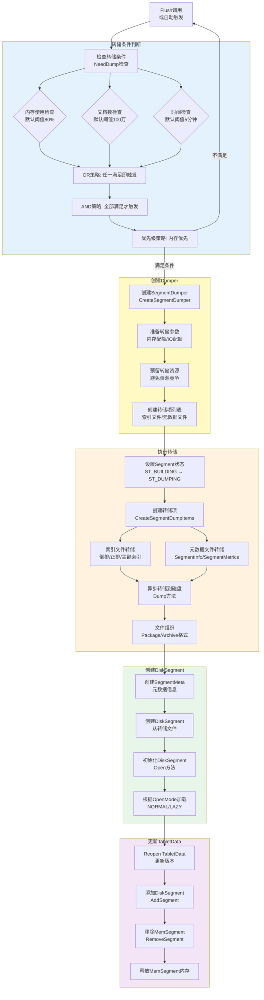

Flush 流程包括以下步骤：

1. **检查转储条件**：判断是否需要转储（内存阈值、文档数量等）
2. **创建 SegmentDumper**：创建转储器，准备转储任务
3. **创建转储参数**：计算转储所需的内存成本
4. **异步转储**：将内存数据写入磁盘
5. **创建 DiskSegment**：转储完成后创建 DiskSegment
6. **更新 TabletData**：更新 Segment 列表

### 3.2 转储条件判断

转储条件判断通过 `MemSegment::NeedDump()` 实现：

```cpp
// framework/MemSegment.h
class MemSegment : public Segment
{
public:
    // 是否需要转储：判断是否达到转储条件
    virtual bool NeedDump() const = 0;
    
    // 创建转储项：准备转储到磁盘
    virtual std::pair<Status, std::vector<std::shared_ptr<SegmentDumpItem>>> 
        CreateSegmentDumpItems() = 0;
};
```

**转储条件**：

转储条件的判断是 Flush 阶段的关键，需要综合考虑多个因素。让我们通过流程图来理解转储条件的判断逻辑：

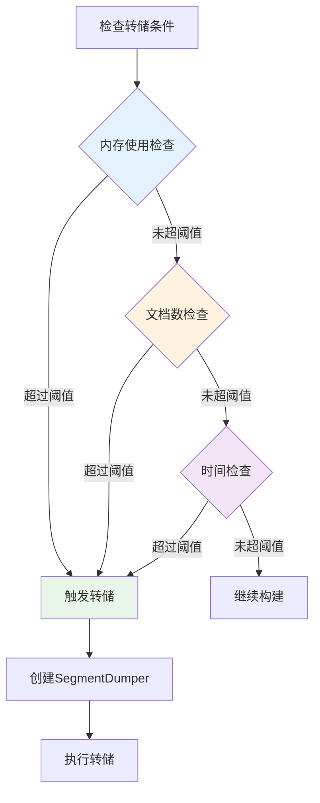

**转储条件详解**：

- **内存阈值**：内存使用达到配置的阈值
  - **默认阈值**：通常设置为内存配额的 80%
  - **动态调整**：根据系统负载动态调整阈值
  - **分级阈值**：设置多个阈值（警告、转储、拒绝）
  - **监控指标**：实时监控内存使用，及时触发转储
  
- **文档数量**：文档数量达到配置的阈值
  - **默认阈值**：通常设置为 100 万文档
  - **场景相关**：不同场景可以设置不同的阈值
  - **性能考虑**：文档数过多会影响查询性能
  - **合并优化**：合理的文档数有利于后续合并
  
- **时间阈值**：构建时间达到配置的阈值
  - **默认阈值**：通常设置为 5 分钟
  - **实时性**：保证数据的实时性，定期转储
  - **一致性**：定期转储保证数据一致性
  - **资源平衡**：避免长时间占用内存

**转储条件组合策略**：

1. **OR 策略**：满足任一条件即触发转储
   - **优势**：及时转储，避免内存溢出
   - **劣势**：可能频繁转储，影响性能
   
2. **AND 策略**：满足所有条件才触发转储
   - **优势**：减少转储频率，提高性能
   - **劣势**：可能延迟转储，增加内存压力
   
3. **优先级策略**：按优先级判断条件
   - **内存优先**：内存使用优先，避免溢出
   - **文档数次之**：文档数作为次要条件
   - **时间最后**：时间作为兜底条件

### 3.3 SegmentDumper：转储器

`SegmentDumper` 负责将 MemSegment 转储到磁盘，定义在 `framework/SegmentDumper.h` 中：

```cpp
// framework/SegmentDumper.h
class SegmentDumper : public SegmentDumpable
{
public:
    SegmentDumper(const std::string& tabletName, 
                  const std::shared_ptr<MemSegment>& segment,
                  int64_t dumpExpandMemSize,
                  std::shared_ptr<kmonitor::MetricsReporter> metricsReporter)
        : _tabletName(tabletName)
        , _dumpingSegment(segment)
        , _dumpExpandMemSize(dumpExpandMemSize)
    {
        // 设置 Segment 状态为 DUMPING
        _dumpingSegment->SetSegmentStatus(Segment::SegmentStatus::ST_DUMPING);
    }
    
    // 执行转储
    virtual Status Dump() = 0;
    
    // 获取转储的 SegmentMeta
    virtual std::pair<Status, SegmentMeta> GetDumpedSegmentMeta() = 0;
};
```

**转储流程**：

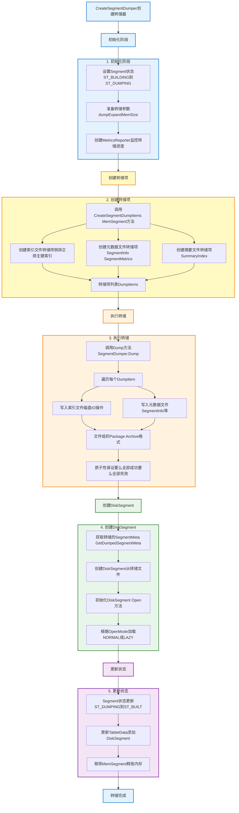

1. **创建 Dumper**：`CreateSegmentDumper()` 创建转储器
2. **设置状态**：将 MemSegment 状态设置为 `ST_DUMPING`
3. **执行转储**：调用 `Dump()` 将内存数据写入磁盘
4. **创建 DiskSegment**：转储完成后创建 DiskSegment
5. **更新状态**：MemSegment 状态变为 `ST_BUILT`（实际已被 DiskSegment 替代）

### 3.4 异步转储机制

转储是异步的，不会阻塞新的写入。关键设计：

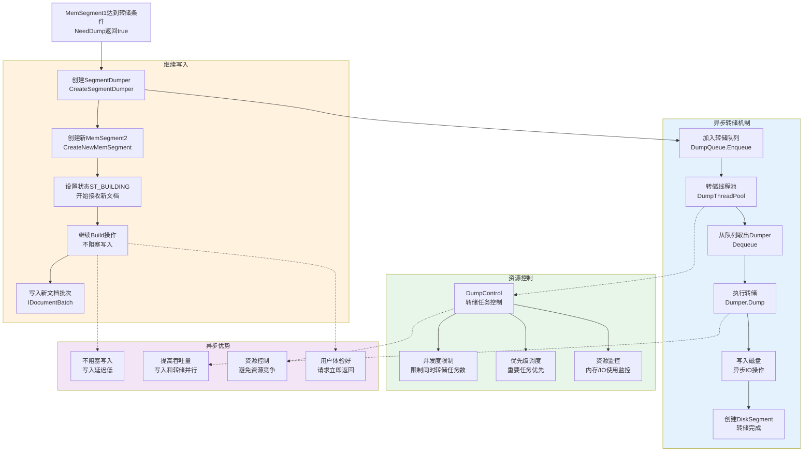

**异步转储的优势**：

异步转储是 IndexLib 高性能写入的关键设计。让我们通过序列图来理解异步转储的完整机制：

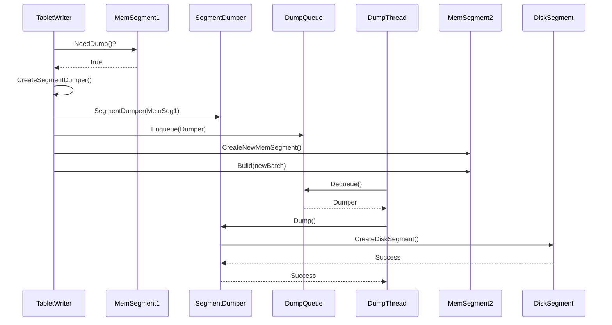

**异步转储的优势详解**：

- **不阻塞写入**：转储过程中可以创建新的 MemSegment 继续接收写入
  - **写入连续性**：写入操作不会被转储阻塞，保证低延迟
  - **吞吐量提升**：写入和转储并行，提高系统吞吐量
  - **用户体验**：用户写入请求可以立即返回，不需要等待转储完成
  
- **提高吞吐量**：写入和转储可以并行进行
  - **CPU 利用**：充分利用多核 CPU，写入和转储可以并行执行
  - **IO 优化**：转储 IO 和写入 IO 可以并行，提高 IO 利用率
  - **资源平衡**：通过资源控制平衡写入和转储的资源使用
  
- **资源控制**：通过 `DumpControl` 控制转储任务的并发度
  - **并发限制**：限制同时进行的转储任务数量，避免资源竞争
  - **优先级调度**：支持转储任务的优先级调度，重要任务优先执行
  - **资源监控**：监控转储任务的资源使用，及时调整策略

**异步转储的性能优化**：
- **写入延迟**：异步转储有效降低写入延迟
- **吞吐量**：并行写入和转储显著提高吞吐量
- **资源利用**：CPU 和 IO 利用率显著提升

### 3.5 转储的内存成本

转储需要额外的内存空间，通过 `DumpExpandMemSize` 控制：

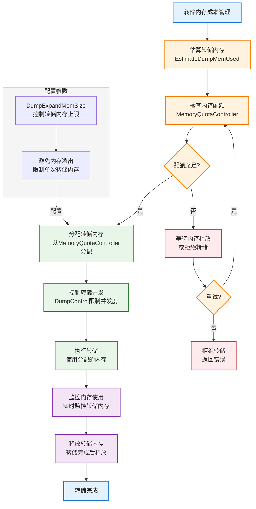

**内存成本控制**：
- **估算转储内存**：`EstimateDumpMemUsed()` 估算转储所需内存
- **检查内存配额**：检查是否有足够的内存配额
- **控制转储并发**：通过内存配额控制转储任务的并发度

## 4. Seal：封存阶段

### 4.1 Seal 流程

Seal 阶段负责封存 Segment，标记为只读，不再接收新文档。让我们先通过图来理解 Seal 流程：

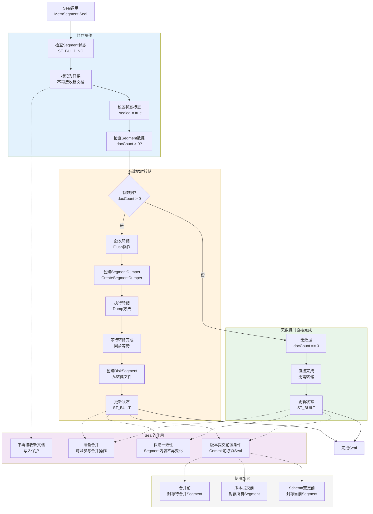

Seal 流程包括以下步骤：

1. **封存 MemSegment**：调用 `MemSegment::Seal()` 封存当前构建中的 Segment
2. **标记为只读**：Segment 不再接收新文档
3. **触发转储**：如果 MemSegment 有数据，触发转储
4. **等待转储完成**：等待转储完成，创建 DiskSegment
5. **更新状态**：Segment 状态变为 `ST_BUILT`

### 4.2 MemSegment::Seal()

`MemSegment::Seal()` 的实现：

```cpp
// framework/MemSegment.h
class MemSegment : public Segment
{
public:
    // 封存：标记为只读，不再接收新文档
    virtual void Seal() = 0;
};
```

**Seal 的作用**：
- **标记只读**：Segment 不再接收新文档
- **准备合并**：封存的 Segment 可以参与合并
- **保证一致性**：封存后 Segment 内容不再变化

### 4.3 Seal 的使用场景

Seal 通常在以下场景使用：

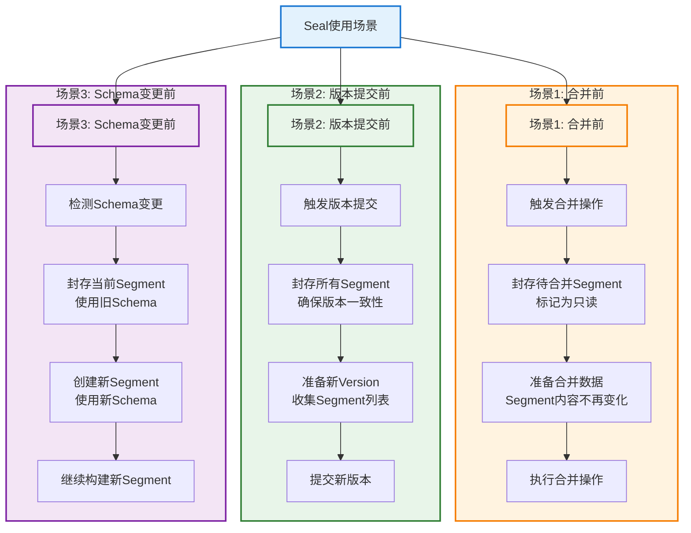

**使用场景**：
- **合并前**：合并前需要封存所有待合并的 Segment
- **版本提交前**：版本提交前需要封存所有 Segment
- **Schema 变更前**：Schema 变更前需要封存当前 Segment

## 5. Commit：提交版本阶段

### 5.1 Commit 流程

Commit 阶段负责提交新版本，更新 Version，持久化到磁盘。让我们先通过图来理解 Commit 流程：

```mermaid
flowchart TD
    Start[Commit调用VersionCommitter.Commit] --> Check[检查提交条件NeedCommit检查]
    
    Check --> ConditionStart[提交条件判断]
    
    ConditionStart --> C1{有新Segment?<br/>有新增的DiskSegment}
    ConditionStart --> C2{有数据变更?<br/>Locator更新}
    ConditionStart --> C3{强制提交?<br/>forceCommit=true}
    
    C1 --> C4[OR策略任一满足即提交]
    C2 --> C4
    C3 --> C4
    
    C4 --> ConditionCheck{满足提交条件?}
    
    ConditionCheck -->|否| Start
    ConditionCheck -->|是| PrepareStart[准备版本信息]
    
    PrepareStart --> D1[收集所有已构建Segment CreateSlice ST_BUILT]
    D1 --> D2[准备Segment列表SegmentInVersion]
    D2 --> D3[准备Locator最新数据处理位置]
    D3 --> D4[准备时间戳当前时间]
    D4 --> D5[计算新VersionId当前VersionId加1]
    
    D5 --> FenceStart[Fence机制原子性保证]
    
    FenceStart --> E1[创建Fence目录临时目录]
    E1 --> E2[写入Version文件版本信息]
    E2 --> E3[写入Segment列表SegmentInVersion]
    E3 --> E4[写入Locator位置信息]
    E4 --> E5[原子切换重命名为正式版本目录]
    
    E5 --> UpdateStart[更新TabletData]
    
    UpdateStart --> F1[更新Version _onDiskVersion]
    F1 --> F2[更新Segment列表 _segments]
    F2 --> F3[更新Locator最新位置信息]
    
    F3 --> CleanupStart[清理旧版本]
    
    CleanupStart --> G1[检查保留版本列表reservedVersions]
    G1 --> G2[删除不再需要的版本cleanVersion=true]
    G2 --> G3[清理旧Segment文件释放磁盘空间]
    
    G3 --> End[Commit完成返回VersionMeta]
    
    subgraph ConditionGroup["1. 提交条件判断"]
        C1
        C2
        C3
        C4
    end
    
    subgraph PrepareGroup["2. 准备版本信息"]
        D1
        D2
        D3
        D4
        D5
    end
    
    subgraph FenceGroup["3. Fence机制原子性保证"]
        E1
        E2
        E3
        E4
        E5
    end
    
    subgraph UpdateGroup["4. 更新TabletData"]
        F1
        F2
        F3
    end
    
    subgraph CleanupGroup["5. 清理旧版本"]
        G1
        G2
        G3
    end
    
    style Start fill:#e3f2fd,stroke:#1976d2,stroke-width:2px
    style Check fill:#e3f2fd,stroke:#1976d2,stroke-width:1px
    style ConditionStart fill:#e3f2fd,stroke:#1976d2,stroke-width:2px
    style ConditionGroup fill:#e3f2fd,stroke:#1976d2,stroke-width:2px
    style ConditionCheck fill:#fff3e0,stroke:#f57c00,stroke-width:2px
    style PrepareStart fill:#fff9c4,stroke:#f57f17,stroke-width:2px
    style PrepareGroup fill:#fff9c4,stroke:#f57f17,stroke-width:2px
    style FenceStart fill:#fff3e0,stroke:#f57c00,stroke-width:2px
    style FenceGroup fill:#fff3e0,stroke:#f57c00,stroke-width:2px
    style UpdateStart fill:#e8f5e9,stroke:#2e7d32,stroke-width:2px
    style UpdateGroup fill:#e8f5e9,stroke:#2e7d32,stroke-width:2px
    style CleanupStart fill:#f3e5f5,stroke:#7b1fa2,stroke-width:2px
    style CleanupGroup fill:#f3e5f5,stroke:#7b1fa2,stroke-width:2px
    style End fill:#e3f2fd,stroke:#1976d2,stroke-width:2px
```

Commit 流程包括以下步骤：

1. **检查提交条件**：判断是否需要提交（有新的 Segment、有数据变更等）
2. **准备版本信息**：准备新版本的 Segment 列表、Locator 等
3. **创建 Fence**：创建 Fence，保证原子性
4. **持久化 Version**：将 Version 写入磁盘
5. **更新 TabletData**：更新 TabletData 的 Version
6. **清理旧版本**：清理不再需要的旧版本文件

### 5.2 VersionCommitter：版本提交器

`VersionCommitter` 负责版本提交，定义在 `framework/VersionCommitter.h` 中：

```cpp
// framework/VersionCommitter.h
class VersionCommitter
{
public:
    // 提交版本
    static std::pair<Status, VersionMeta> Commit(
        const std::shared_ptr<TabletData>& tabletData,
        const std::shared_ptr<config::ITabletSchema>& schema,
        const CommitOptions& commitOptions);
};
```

**Commit 的关键步骤**：

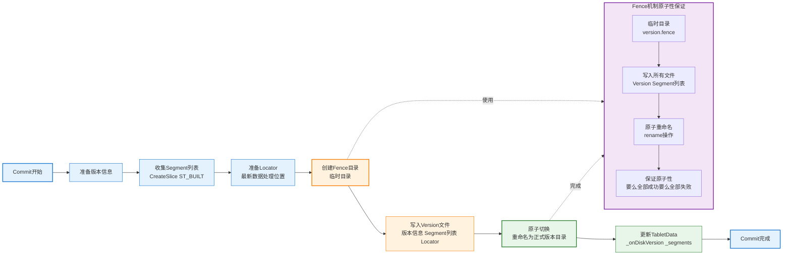

1. **准备版本信息**：收集所有已构建的 Segment，准备 Locator
2. **创建 Fence**：创建 Fence 目录，保证原子性
3. **写入 Version**：将 Version 写入 Fence 目录
4. **原子切换**：原子性地将 Fence 目录切换为正式版本目录
5. **更新 TabletData**：更新 TabletData 的 Version

### 5.3 Fence：原子性保证

Fence 机制保证版本提交的原子性：

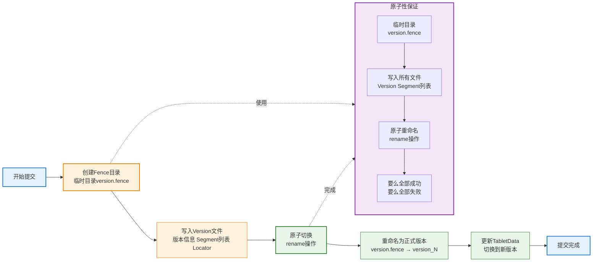

**Fence 机制**：
- **创建 Fence 目录**：在提交前创建临时目录（Fence）
- **写入 Version**：将 Version 写入 Fence 目录
- **原子切换**：原子性地将 Fence 目录重命名为正式版本目录
- **保证原子性**：要么全部成功，要么全部失败

### 5.4 CommitOptions：提交选项

`CommitOptions` 控制提交行为，定义在 `framework/CommitOptions.h` 中：

```cpp
// framework/CommitOptions.h
struct CommitOptions
{
    // 是否强制提交（即使没有数据变更）
    bool forceCommit = false;
    
    // 提交的描述信息
    std::string commitMessage;
    
    // 是否等待转储完成
    bool waitDumpFinish = true;
    
    // 是否清理旧版本
    bool cleanVersion = false;
    
    // 保留的版本列表
    std::vector<versionid_t> reservedVersions;
};
```

**提交选项的作用**：
- **forceCommit**：强制提交，即使没有数据变更
- **waitDumpFinish**：等待转储完成后再提交
- **cleanVersion**：清理不再需要的旧版本文件

### 5.5 版本演进

每次 Commit 都会创建新版本，版本号递增：

```mermaid
flowchart LR
    V1[Version 1<br/>versionId=1] --> V1Content[Segment 1,2<br/>Locator timestamp=100]
    
    V1Content --> Commit1[Commit操作]
    
    Commit1 --> V2[Version 2<br/>versionId=2]
    V2 --> V2Content[Segment 1,2,3<br/>Locator timestamp=200]
    
    V2Content --> Commit2[Commit操作]
    
    Commit2 --> V3[Version 3<br/>versionId=3]
    V3 --> V3Content[Segment 4<br/>Locator timestamp=300]
    
    subgraph Evolution["版本演进特点"]
        direction TB
        E1[版本号递增<br/>versionId单调递增]
        E2[Segment列表变化<br/>新增或合并Segment]
        E3[Locator更新<br/>记录最新处理位置]
        
        E1 --> E2
        E2 --> E3
    end
    
    V3Content -.->|演进特点| Evolution
    
    style V1 fill:#e3f2fd,stroke:#1976d2,stroke-width:2px
    style V1Content fill:#c5e1f5,stroke:#1976d2,stroke-width:1px
    style Commit1 fill:#fff3e0,stroke:#f57c00,stroke-width:2px
    style V2 fill:#fff3e0,stroke:#f57c00,stroke-width:2px
    style V2Content fill:#ffe0b2,stroke:#f57c00,stroke-width:1px
    style Commit2 fill:#fff3e0,stroke:#f57c00,stroke-width:2px
    style V3 fill:#e8f5e9,stroke:#2e7d32,stroke-width:2px
    style V3Content fill:#c8e6c9,stroke:#2e7d32,stroke-width:1px
    style Evolution fill:#f3e5f5,stroke:#7b1fa2,stroke-width:2px
```

**版本演进示例**：
- **V1**：包含 Segment [1, 2]，Locator 记录处理到 timestamp=100
- **V2**：新增 Segment 3，Locator 更新到 timestamp=200
- **V3**：Segment 1 和 2 合并为 Segment 4，Locator 更新到 timestamp=300

## 6. 完整构建流程示例

### 6.1 实时写入场景

在实时写入场景中，完整的构建流程：

```mermaid
graph LR
    A[持续Build] --> B[文档写入MemSegment]
    B --> C{达到阈值?}
    C -->|是| D[定期Flush]
    C -->|否| A
    D --> E[转储为DiskSegment]
    E --> F[创建新MemSegment]
    F --> A
    E --> G[定期Seal]
    G --> H[定期Commit]
    H --> I[更新Version]
    
    style A fill:#e3f2fd
    style D fill:#fff3e0
    style G fill:#e8f5e9
    style H fill:#f3e5f5
```

**流程示例**：
1. **持续 Build**：文档持续写入 MemSegment
2. **定期 Flush**：MemSegment 达到阈值后触发 Flush，转储为 DiskSegment
3. **创建新 Segment**：创建新的 MemSegment 继续接收写入
4. **定期 Seal**：定期 Seal 旧的 Segment，准备合并
5. **定期 Commit**：定期 Commit，更新 Version

### 6.2 批量构建场景

在批量构建场景中，完整的构建流程：

```mermaid
flowchart TD
    Start[批量构建场景] --> ProcessLayer[构建流程层]
    ProcessLayer --> CharacterLayer[场景特点层]
    
    subgraph ProcessGroup["批量构建流程：一次性完成所有操作"]
        direction TB
        P1[批量Build<br/>一次性构建大量文档<br/>接收所有文档批次]
        P2[Flush转储<br/>构建完成后触发Flush<br/>转储MemSegment]
        P3[转储为DiskSegment<br/>创建DiskSegment<br/>加载转储后的Segment]
        P4[Seal所有Segment<br/>封存所有Segment<br/>标记为只读]
        P5[Commit最终版本<br/>提交最终版本<br/>更新Version到磁盘]
        P1 --> P2
        P2 --> P3
        P3 --> P4
        P4 --> P5
    end
    
    ProcessLayer --> ProcessGroup
    
    ProcessGroup --> CharacterLayer
    
    subgraph CharacterGroup["批量场景特点：一次性处理"]
        direction TB
        C1[一次性构建<br/>所有文档一次性构建完成<br/>不进行增量构建]
        C2[完成后转储<br/>构建完成后统一转储<br/>不进行中间转储]
        C3[一次性提交<br/>所有操作完成后提交<br/>不进行多次提交]
        C4[适合离线场景<br/>批量导入数据<br/>全量索引构建]
    end
    
    CharacterLayer --> CharacterGroup
    
    CharacterGroup --> End[批量构建完成]
    
    style Start fill:#e3f2fd,stroke:#1976d2,stroke-width:3px
    style ProcessLayer fill:#e3f2fd,stroke:#1976d2,stroke-width:2px
    style ProcessGroup fill:#e3f2fd,stroke:#1976d2,stroke-width:2px
    style P1 fill:#c5e1f5,stroke:#1976d2,stroke-width:1px
    style P2 fill:#90caf9,stroke:#1976d2,stroke-width:2px
    style P3 fill:#c5e1f5,stroke:#1976d2,stroke-width:1px
    style P4 fill:#90caf9,stroke:#1976d2,stroke-width:2px
    style P5 fill:#90caf9,stroke:#1976d2,stroke-width:2px
    style CharacterLayer fill:#f3e5f5,stroke:#7b1fa2,stroke-width:2px
    style CharacterGroup fill:#f3e5f5,stroke:#7b1fa2,stroke-width:2px
    style C1 fill:#e1bee7,stroke:#7b1fa2,stroke-width:1px
    style C2 fill:#e1bee7,stroke:#7b1fa2,stroke-width:1px
    style C3 fill:#e1bee7,stroke:#7b1fa2,stroke-width:1px
    style C4 fill:#ce93d8,stroke:#7b1fa2,stroke-width:2px
    style End fill:#e3f2fd,stroke:#1976d2,stroke-width:2px
```

**流程示例**：
1. **批量 Build**：一次性构建大量文档
2. **Flush**：构建完成后 Flush，转储为 DiskSegment
3. **Seal**：Seal 所有 Segment
4. **Commit**：Commit 最终版本

## 7. 构建流程的关键设计

### 7.1 异步与并发

IndexLib 的构建流程支持异步和并发：

```mermaid
flowchart TD
    Start[异步与并发设计] --> AsyncLayer[异步处理层]
    Start --> ConcurrentLayer[并发处理层]
    
    subgraph AsyncGroup["异步处理层：异步转储机制"]
        direction TB
        A1[触发转储<br/>创建SegmentDumper]
        A2[提交转储任务<br/>提交到后台线程池]
        A3[立即返回<br/>不阻塞写入操作]
        A4[后台线程执行转储<br/>异步转储到磁盘]
        A5[转储完成回调<br/>更新Segment状态]
        A1 --> A2
        A2 --> A3
        A3 --> A4
        A4 --> A5
    end
    
    AsyncLayer --> AsyncGroup
    
    subgraph ConcurrentBuildGroup["并发处理层：并发构建"]
        direction TB
        CB1[接收文档批次<br/>IDocumentBatch]
        CB2[创建并行构建器<br/>NormalTabletParallelBuilder]
        CB3[多线程并行构建<br/>线程池处理文档]
        CB4[并行写入Indexer<br/>倒排/正排/主键索引]
        CB5[合并构建结果<br/>汇总各线程结果]
        CB1 --> CB2
        CB2 --> CB3
        CB3 --> CB4
        CB4 --> CB5
    end
    
    subgraph ConcurrentDumpGroup["并发处理层：并发转储"]
        direction TB
        CD1[多个Segment待转储<br/>收集需要转储的Segment]
        CD2[DumpControl控制并发度<br/>限制同时转储的Segment数]
        CD3[并发转储任务<br/>多个Segment并行转储]
        CD4[充分利用IO资源<br/>磁盘IO并行处理]
        CD5[转储完成<br/>所有Segment转储完成]
        CD1 --> CD2
        CD2 --> CD3
        CD3 --> CD4
        CD4 --> CD5
    end
    
    ConcurrentLayer --> ConcurrentBuildGroup
    ConcurrentLayer --> ConcurrentDumpGroup
    
    AsyncGroup --> Performance[性能优势]
    ConcurrentBuildGroup --> Performance
    ConcurrentDumpGroup --> Performance
    
    subgraph PerformanceGroup["性能优势：提升整体性能"]
        direction TB
        P1[提高吞吐量<br/>并行处理提高整体吞吐<br/>充分利用多核CPU]
        P2[充分利用资源<br/>CPU和IO并行利用<br/>避免资源闲置]
        P3[降低延迟<br/>异步转储不阻塞写入<br/>提升写入响应速度]
    end
    
    Performance --> PerformanceGroup
    
    style Start fill:#e3f2fd,stroke:#1976d2,stroke-width:3px
    style AsyncLayer fill:#e3f2fd,stroke:#1976d2,stroke-width:2px
    style AsyncGroup fill:#e3f2fd,stroke:#1976d2,stroke-width:2px
    style A1 fill:#c5e1f5,stroke:#1976d2,stroke-width:1px
    style A2 fill:#90caf9,stroke:#1976d2,stroke-width:2px
    style A3 fill:#90caf9,stroke:#1976d2,stroke-width:2px
    style A4 fill:#c5e1f5,stroke:#1976d2,stroke-width:1px
    style A5 fill:#c5e1f5,stroke:#1976d2,stroke-width:1px
    style ConcurrentLayer fill:#fff3e0,stroke:#f57c00,stroke-width:2px
    style ConcurrentBuildGroup fill:#fff3e0,stroke:#f57c00,stroke-width:2px
    style CB1 fill:#ffe0b2,stroke:#f57c00,stroke-width:1px
    style CB2 fill:#ffcc80,stroke:#f57c00,stroke-width:2px
    style CB3 fill:#ffcc80,stroke:#f57c00,stroke-width:2px
    style CB4 fill:#ffe0b2,stroke:#f57c00,stroke-width:1px
    style CB5 fill:#ffe0b2,stroke:#f57c00,stroke-width:1px
    style ConcurrentDumpGroup fill:#e8f5e9,stroke:#2e7d32,stroke-width:2px
    style CD1 fill:#c8e6c9,stroke:#2e7d32,stroke-width:1px
    style CD2 fill:#a5d6a7,stroke:#2e7d32,stroke-width:2px
    style CD3 fill:#a5d6a7,stroke:#2e7d32,stroke-width:2px
    style CD4 fill:#c8e6c9,stroke:#2e7d32,stroke-width:1px
    style CD5 fill:#c8e6c9,stroke:#2e7d32,stroke-width:1px
    style Performance fill:#f3e5f5,stroke:#7b1fa2,stroke-width:2px
    style PerformanceGroup fill:#f3e5f5,stroke:#7b1fa2,stroke-width:2px
    style P1 fill:#e1bee7,stroke:#7b1fa2,stroke-width:1px
    style P2 fill:#e1bee7,stroke:#7b1fa2,stroke-width:1px
    style P3 fill:#e1bee7,stroke:#7b1fa2,stroke-width:1px
```

**异步与并发设计**：
- **异步转储**：转储是异步的，不阻塞写入
- **并发构建**：支持多线程构建（NormalTabletParallelBuilder）
- **并发转储**：支持多个 Segment 并发转储

### 7.2 内存管理

构建流程需要严格控制内存使用：

```mermaid
flowchart TD
    Start[内存管理机制] --> MonitorLayer[内存监控层]
    MonitorLayer --> ControlLayer[内存控制层]
    ControlLayer --> ReleaseLayer[内存释放层]
    
    subgraph MonitorGroup["内存监控层：实时监控内存使用"]
        direction TB
        M1[构建前估算<br/>EstimateMemUsed方法]
        M2[根据Schema估算<br/>索引字段类型和数量]
        M3[根据文档数估算<br/>预期文档数量]
        M4[构建中评估<br/>EvaluateCurrentMemUsed方法]
        M5[实时监控内存使用<br/>统计实际内存占用]
        M1 --> M2
        M2 --> M3
        M3 --> M4
        M4 --> M5
    end
    
    MonitorLayer --> MonitorGroup
    
    subgraph ControlGroup["内存控制层：MemoryQuotaController"]
        direction TB
        C1[检查内存配额<br/>查询可用内存配额]
        C2{配额是否充足?}
        C3[分配内存配额<br/>从MemoryQuotaController分配]
        C4[拒绝分配<br/>等待或拒绝写入]
        C5[控制内存上限<br/>设置总内存配额]
        C1 --> C2
        C2 -->|充足| C3
        C2 -->|不足| C4
        C3 --> C5
        C4 --> C1
    end
    
    MonitorGroup --> ControlGroup
    
    subgraph TriggerGroup["触发转储：达到阈值时释放内存"]
        direction TB
        T1[检查转储条件<br/>内存使用/文档数/时间间隔]
        T2{是否达到阈值?}
        T3[内存超阈值<br/>当前内存使用超过限制]
        T4[文档数超阈值<br/>文档数量超过限制]
        T5[时间间隔达到<br/>达到转储时间间隔]
        T1 --> T2
        T2 -->|是| T3
        T2 -->|是| T4
        T2 -->|是| T5
        T2 -->|否| T1
    end
    
    ControlGroup --> TriggerGroup
    
    TriggerGroup --> ReleaseLayer
    
    subgraph ReleaseGroup["内存释放层：转储释放内存"]
        direction TB
        R1[触发转储操作<br/>创建SegmentDumper]
        R2[转储MemSegment<br/>异步转储到磁盘]
        R3[释放内存配额<br/>释放MemSegment内存]
        R4[创建新MemSegment<br/>继续构建]
        R1 --> R2
        R2 --> R3
        R3 --> R4
        R4 --> MonitorGroup
    end
    
    ReleaseLayer --> ReleaseGroup
    
    ReleaseGroup --> Result[内存管理目标<br/>保证系统稳定性<br/>避免内存溢出<br/>及时释放内存]
    
    style Start fill:#e3f2fd,stroke:#1976d2,stroke-width:3px
    style MonitorLayer fill:#e3f2fd,stroke:#1976d2,stroke-width:2px
    style MonitorGroup fill:#e3f2fd,stroke:#1976d2,stroke-width:2px
    style M1 fill:#c5e1f5,stroke:#1976d2,stroke-width:1px
    style M2 fill:#c5e1f5,stroke:#1976d2,stroke-width:1px
    style M3 fill:#c5e1f5,stroke:#1976d2,stroke-width:1px
    style M4 fill:#90caf9,stroke:#1976d2,stroke-width:2px
    style M5 fill:#c5e1f5,stroke:#1976d2,stroke-width:1px
    style ControlLayer fill:#fff3e0,stroke:#f57c00,stroke-width:2px
    style ControlGroup fill:#fff3e0,stroke:#f57c00,stroke-width:2px
    style C1 fill:#ffe0b2,stroke:#f57c00,stroke-width:1px
    style C2 fill:#ffcc80,stroke:#f57c00,stroke-width:2px
    style C3 fill:#ffcc80,stroke:#f57c00,stroke-width:2px
    style C4 fill:#ffebee,stroke:#c62828,stroke-width:1px
    style C5 fill:#ffe0b2,stroke:#f57c00,stroke-width:1px
    style TriggerGroup fill:#f3e5f5,stroke:#7b1fa2,stroke-width:2px
    style T1 fill:#e1bee7,stroke:#7b1fa2,stroke-width:1px
    style T2 fill:#ce93d8,stroke:#7b1fa2,stroke-width:2px
    style T3 fill:#e1bee7,stroke:#7b1fa2,stroke-width:1px
    style T4 fill:#e1bee7,stroke:#7b1fa2,stroke-width:1px
    style T5 fill:#e1bee7,stroke:#7b1fa2,stroke-width:1px
    style ReleaseLayer fill:#e8f5e9,stroke:#2e7d32,stroke-width:2px
    style ReleaseGroup fill:#e8f5e9,stroke:#2e7d32,stroke-width:2px
    style R1 fill:#c8e6c9,stroke:#2e7d32,stroke-width:1px
    style R2 fill:#a5d6a7,stroke:#2e7d32,stroke-width:2px
    style R3 fill:#a5d6a7,stroke:#2e7d32,stroke-width:2px
    style R4 fill:#c8e6c9,stroke:#2e7d32,stroke-width:1px
    style Result fill:#e3f2fd,stroke:#1976d2,stroke-width:2px
```

**内存管理机制**：
- **内存估算**：构建前估算所需内存
- **内存评估**：构建过程中评估实际内存使用
- **内存控制**：通过 `MemoryQuotaController` 控制内存上限
- **触发转储**：达到阈值时触发转储，释放内存

### 7.3 错误处理

构建流程需要完善的错误处理：

```mermaid
flowchart TD
    Start[错误处理机制] --> ErrorDetection[错误检测层]
    ErrorDetection --> ErrorHandling[错误处理层]
    ErrorHandling --> ErrorRecovery[错误恢复层]
    
    subgraph ErrorDetectionGroup["错误检测层：及时发现错误"]
        direction TB
        ED1[构建错误检测<br/>检测构建过程中的异常]
        ED2[转储错误检测<br/>检测转储过程中的异常]
        ED3[版本提交错误检测<br/>检测版本提交过程中的异常]
    end
    
    ErrorDetection --> ErrorDetectionGroup
    
    subgraph RetryGroup["1. 重试机制：构建失败处理"]
        direction TB
        R1[检测构建错误<br/>捕获异常和错误码]
        R2[判断是否可重试<br/>检查错误类型和重试次数]
        R3[自动重试构建<br/>重新执行构建操作]
        R4[记录重试信息<br/>记录重试次数和错误详情]
        R1 --> R2
        R2 -->|可重试| R3
        R2 -->|不可重试| R5[抛出错误]
        R3 --> R4
        R4 --> R2
    end
    
    subgraph RollbackGroup["2. 回滚机制：转储失败处理"]
        direction TB
        RB1[检测转储错误<br/>捕获转储异常]
        RB2[保存当前状态<br/>记录转储前的状态]
        RB3[回滚到稳定状态<br/>恢复到上一个成功版本]
        RB4[清理失败文件<br/>删除失败的转储文件]
        RB1 --> RB2
        RB2 --> RB3
        RB3 --> RB4
    end
    
    subgraph AtomicityGroup["3. 原子性保证：版本提交处理"]
        direction TB
        A1[创建Fence临时目录<br/>version.fence]
        A2[写入版本文件<br/>Version和Segment信息]
        A3[原子重命名操作<br/>rename临时目录为正式版本]
        A4[验证提交结果<br/>检查是否全部成功]
        A1 --> A2
        A2 --> A3
        A3 --> A4
        A4 -->|失败| A5[清理临时目录<br/>保证原子性]
        A4 -->|成功| A6[提交完成]
    end
    
    ErrorDetectionGroup --> RetryGroup
    ErrorDetectionGroup --> RollbackGroup
    ErrorDetectionGroup --> AtomicityGroup
    
    RetryGroup --> ErrorHandling
    RollbackGroup --> ErrorHandling
    AtomicityGroup --> ErrorHandling
    
    ErrorHandling --> ErrorRecovery
    
    subgraph RecoveryGroup["错误恢复层：保证系统稳定"]
        direction TB
        Recovery1[数据一致性保证<br/>保证数据完整性<br/>避免部分写入<br/>保证版本一致性]
        Recovery2[系统稳定性保证<br/>快速恢复服务<br/>避免数据丢失<br/>保证服务可用性]
    end
    
    ErrorRecovery --> RecoveryGroup
    
    style Start fill:#e3f2fd,stroke:#1976d2,stroke-width:3px
    style ErrorDetection fill:#e3f2fd,stroke:#1976d2,stroke-width:2px
    style ErrorDetectionGroup fill:#e3f2fd,stroke:#1976d2,stroke-width:2px
    style ED1 fill:#c5e1f5,stroke:#1976d2,stroke-width:1px
    style ED2 fill:#c5e1f5,stroke:#1976d2,stroke-width:1px
    style ED3 fill:#c5e1f5,stroke:#1976d2,stroke-width:1px
    style ErrorHandling fill:#fff3e0,stroke:#f57c00,stroke-width:2px
    style RetryGroup fill:#e3f2fd,stroke:#1976d2,stroke-width:2px
    style R1 fill:#c5e1f5,stroke:#1976d2,stroke-width:1px
    style R2 fill:#c5e1f5,stroke:#1976d2,stroke-width:1px
    style R3 fill:#90caf9,stroke:#1976d2,stroke-width:2px
    style R4 fill:#c5e1f5,stroke:#1976d2,stroke-width:1px
    style R5 fill:#ffebee,stroke:#c62828,stroke-width:1px
    style RollbackGroup fill:#fff3e0,stroke:#f57c00,stroke-width:2px
    style RB1 fill:#ffe0b2,stroke:#f57c00,stroke-width:1px
    style RB2 fill:#ffe0b2,stroke:#f57c00,stroke-width:1px
    style RB3 fill:#ffcc80,stroke:#f57c00,stroke-width:2px
    style RB4 fill:#ffe0b2,stroke:#f57c00,stroke-width:1px
    style AtomicityGroup fill:#e8f5e9,stroke:#2e7d32,stroke-width:2px
    style A1 fill:#c8e6c9,stroke:#2e7d32,stroke-width:1px
    style A2 fill:#c8e6c9,stroke:#2e7d32,stroke-width:1px
    style A3 fill:#a5d6a7,stroke:#2e7d32,stroke-width:2px
    style A4 fill:#c8e6c9,stroke:#2e7d32,stroke-width:1px
    style A5 fill:#ffebee,stroke:#c62828,stroke-width:1px
    style A6 fill:#a5d6a7,stroke:#2e7d32,stroke-width:2px
    style ErrorRecovery fill:#f3e5f5,stroke:#7b1fa2,stroke-width:2px
    style RecoveryGroup fill:#f3e5f5,stroke:#7b1fa2,stroke-width:2px
    style Recovery1 fill:#e1bee7,stroke:#7b1fa2,stroke-width:1px
    style Recovery2 fill:#e1bee7,stroke:#7b1fa2,stroke-width:1px
```

**错误处理机制**：
- **重试机制**：构建失败时可以重试
- **回滚机制**：转储失败时可以回滚
- **原子性保证**：通过 Fence 保证版本提交的原子性

## 8. 性能优化

### 8.1 构建性能优化

构建性能优化的关键点：

```mermaid
flowchart TD
    Start[构建性能优化] --> StrategyLayer[优化策略层]
    StrategyLayer --> EffectLayer[优化效果层]
    
    subgraph BatchGroup["1. 批量写入优化"]
        direction TB
        B1[批量接收文档<br/>IDocumentBatch]
        B2[批量处理文档<br/>减少函数调用次数]
        B3[批量写入Indexer<br/>减少索引更新开销]
        B4[减少调用开销<br/>降低系统调用成本]
        B1 --> B2
        B2 --> B3
        B3 --> B4
    end
    
    subgraph ParallelGroup["2. 并行构建优化"]
        direction TB
        P1[多线程并行构建<br/>NormalTabletParallelBuilder]
        P2[并行处理文档批次<br/>充分利用多核CPU]
        P3[并行写入索引<br/>倒排/正排/主键索引]
        P4[提高构建速度<br/>缩短构建时间]
        P1 --> P2
        P2 --> P3
        P3 --> P4
    end
    
    subgraph MemoryGroup["3. 内存优化"]
        direction TB
        M1[优化内存分配<br/>减少内存分配次数]
        M2[内存池管理<br/>复用内存对象]
        M3[减少内存拷贝<br/>使用移动语义]
        M4[减少内存分配开销<br/>降低GC压力]
        M1 --> M2
        M2 --> M3
        M3 --> M4
    end
    
    StrategyLayer --> BatchGroup
    StrategyLayer --> ParallelGroup
    StrategyLayer --> MemoryGroup
    
    BatchGroup --> EffectLayer
    ParallelGroup --> EffectLayer
    MemoryGroup --> EffectLayer
    
    subgraph EffectGroup["优化效果：提升整体性能"]
        direction TB
        E1[提高吞吐量<br/>单位时间处理更多文档<br/>提升整体处理能力]
        E2[降低延迟<br/>减少单次操作耗时<br/>提升响应速度]
        E3[提高资源利用率<br/>充分利用CPU和内存<br/>提升系统效率]
    end
    
    EffectLayer --> EffectGroup
    
    style Start fill:#e3f2fd,stroke:#1976d2,stroke-width:3px
    style StrategyLayer fill:#e3f2fd,stroke:#1976d2,stroke-width:2px
    style BatchGroup fill:#e3f2fd,stroke:#1976d2,stroke-width:2px
    style B1 fill:#c5e1f5,stroke:#1976d2,stroke-width:1px
    style B2 fill:#c5e1f5,stroke:#1976d2,stroke-width:1px
    style B3 fill:#90caf9,stroke:#1976d2,stroke-width:2px
    style B4 fill:#c5e1f5,stroke:#1976d2,stroke-width:1px
    style ParallelGroup fill:#fff3e0,stroke:#f57c00,stroke-width:2px
    style P1 fill:#ffe0b2,stroke:#f57c00,stroke-width:1px
    style P2 fill:#ffcc80,stroke:#f57c00,stroke-width:2px
    style P3 fill:#ffcc80,stroke:#f57c00,stroke-width:2px
    style P4 fill:#ffe0b2,stroke:#f57c00,stroke-width:1px
    style MemoryGroup fill:#e8f5e9,stroke:#2e7d32,stroke-width:2px
    style M1 fill:#c8e6c9,stroke:#2e7d32,stroke-width:1px
    style M2 fill:#a5d6a7,stroke:#2e7d32,stroke-width:2px
    style M3 fill:#a5d6a7,stroke:#2e7d32,stroke-width:2px
    style M4 fill:#c8e6c9,stroke:#2e7d32,stroke-width:1px
    style EffectLayer fill:#f3e5f5,stroke:#7b1fa2,stroke-width:2px
    style EffectGroup fill:#f3e5f5,stroke:#7b1fa2,stroke-width:2px
    style E1 fill:#e1bee7,stroke:#7b1fa2,stroke-width:1px
    style E2 fill:#e1bee7,stroke:#7b1fa2,stroke-width:1px
    style E3 fill:#e1bee7,stroke:#7b1fa2,stroke-width:1px
```

**优化策略**：
- **批量写入**：支持批量写入文档，减少调用开销
- **并行构建**：支持多线程构建，提高构建速度
- **内存优化**：优化内存使用，减少内存分配开销

### 8.2 转储性能优化

转储性能优化的关键点：

```mermaid
flowchart TD
    Start[转储性能优化] --> StrategyLayer[优化策略层]
    StrategyLayer --> EffectLayer[优化效果层]
    
    subgraph AsyncGroup["1. 异步转储优化"]
        direction TB
        A1[触发转储操作<br/>创建SegmentDumper]
        A2[提交转储任务<br/>提交到后台线程池]
        A3[立即返回<br/>不阻塞写入操作]
        A4[后台线程执行转储<br/>异步转储到磁盘]
        A5[不阻塞写入<br/>写入和转储并行进行]
        A1 --> A2
        A2 --> A3
        A3 --> A4
        A4 --> A5
    end
    
    subgraph ConcurrentGroup["2. 并发转储优化"]
        direction TB
        C1[收集待转储Segment<br/>多个Segment需要转储]
        C2[DumpControl控制并发度<br/>限制同时转储的Segment数]
        C3[并发转储任务<br/>多个Segment并行转储]
        C4[多个Segment并发<br/>充分利用IO资源]
        C5[转储完成<br/>所有Segment转储完成]
        C1 --> C2
        C2 --> C3
        C3 --> C4
        C4 --> C5
    end
    
    subgraph IOGroup["3. IO优化"]
        direction TB
        IO1[批量IO操作<br/>减少系统调用次数]
        IO2[顺序写入优化<br/>减少磁盘寻道时间]
        IO3[压缩优化<br/>减少IO数据量]
        IO4[减少IO开销<br/>提高IO效率]
        IO1 --> IO2
        IO2 --> IO3
        IO3 --> IO4
    end
    
    StrategyLayer --> AsyncGroup
    StrategyLayer --> ConcurrentGroup
    StrategyLayer --> IOGroup
    
    AsyncGroup --> EffectLayer
    ConcurrentGroup --> EffectLayer
    IOGroup --> EffectLayer
    
    subgraph EffectGroup["优化效果：提升转储性能"]
        direction TB
        E1[提高吞吐量<br/>单位时间转储更多数据<br/>提升整体转储能力]
        E2[降低延迟<br/>减少转储对写入的影响<br/>提升写入响应速度]
        E3[提高IO效率<br/>充分利用磁盘IO资源<br/>提升转储速度]
    end
    
    EffectLayer --> EffectGroup
    
    style Start fill:#e3f2fd,stroke:#1976d2,stroke-width:3px
    style StrategyLayer fill:#e3f2fd,stroke:#1976d2,stroke-width:2px
    style AsyncGroup fill:#e3f2fd,stroke:#1976d2,stroke-width:2px
    style A1 fill:#c5e1f5,stroke:#1976d2,stroke-width:1px
    style A2 fill:#90caf9,stroke:#1976d2,stroke-width:2px
    style A3 fill:#90caf9,stroke:#1976d2,stroke-width:2px
    style A4 fill:#c5e1f5,stroke:#1976d2,stroke-width:1px
    style A5 fill:#c5e1f5,stroke:#1976d2,stroke-width:1px
    style ConcurrentGroup fill:#fff3e0,stroke:#f57c00,stroke-width:2px
    style C1 fill:#ffe0b2,stroke:#f57c00,stroke-width:1px
    style C2 fill:#ffcc80,stroke:#f57c00,stroke-width:2px
    style C3 fill:#ffcc80,stroke:#f57c00,stroke-width:2px
    style C4 fill:#ffe0b2,stroke:#f57c00,stroke-width:1px
    style C5 fill:#ffe0b2,stroke:#f57c00,stroke-width:1px
    style IOGroup fill:#e8f5e9,stroke:#2e7d32,stroke-width:2px
    style IO1 fill:#c8e6c9,stroke:#2e7d32,stroke-width:1px
    style IO2 fill:#a5d6a7,stroke:#2e7d32,stroke-width:2px
    style IO3 fill:#a5d6a7,stroke:#2e7d32,stroke-width:2px
    style IO4 fill:#c8e6c9,stroke:#2e7d32,stroke-width:1px
    style EffectLayer fill:#f3e5f5,stroke:#7b1fa2,stroke-width:2px
    style EffectGroup fill:#f3e5f5,stroke:#7b1fa2,stroke-width:2px
    style E1 fill:#e1bee7,stroke:#7b1fa2,stroke-width:1px
    style E2 fill:#e1bee7,stroke:#7b1fa2,stroke-width:1px
    style E3 fill:#e1bee7,stroke:#7b1fa2,stroke-width:1px
```

**优化策略**：
- **异步转储**：转储不阻塞写入，提高吞吐量
- **并发转储**：支持多个 Segment 并发转储
- **IO 优化**：优化 IO 操作，减少 IO 开销

## 9. 性能优化与最佳实践

### 9.1 构建性能优化

**优化策略**：

1. **批量写入优化**：
   - **批次大小**：根据系统负载动态调整批次大小
   - **批次合并**：合并多个小批次为大批次，减少函数调用
   - **批次预分配**：预分配批次内存，减少内存分配开销
   
2. **并行构建优化**：
   - **多线程构建**：支持多线程并行构建，提高构建速度
   - **索引并行**：多个 Indexer 可以并行写入
   - **文档并行**：多个文档可以并行处理（如果无依赖）
   
3. **内存优化**：
   - **内存池**：使用内存池减少内存分配开销
   - **内存复用**：转储后复用内存，减少内存分配
   - **内存压缩**：对索引数据压缩，减少内存占用

### 9.2 转储性能优化

**优化策略**：

1. **异步转储优化**：
   - **转储队列**：使用队列管理转储任务，支持优先级调度
   - **并发控制**：控制转储任务的并发度，避免资源竞争
   - **资源预留**：预留转储所需的内存和 IO 资源
   
2. **IO 优化**：
   - **批量 IO**：批量写入文件，减少 IO 次数
   - **异步 IO**：使用异步 IO，提高 IO 吞吐量
   - **IO 合并**：合并多个小 IO 为大 IO，提高 IO 效率
   
3. **压缩优化**：
   - **压缩算法**：选择合适的压缩算法（LZ4、Zstd 等）
   - **压缩级别**：根据场景选择合适的压缩级别
   - **压缩缓存**：缓存压缩结果，减少重复压缩

### 9.3 版本提交优化

**优化策略**：

1. **提交频率优化**：
   - **批量提交**：批量提交多个 Segment，减少提交次数
   - **延迟提交**：延迟提交，合并多个变更
   - **条件提交**：只在有数据变更时提交
   
2. **Fence 优化**：
   - **Fence 复用**：复用 Fence 目录，减少目录创建开销
   - **原子操作**：使用原子操作保证切换的原子性
   - **失败恢复**：Fence 失败时支持恢复
   
3. **版本清理优化**：
   - **延迟清理**：延迟清理旧版本，避免影响查询
   - **批量清理**：批量清理旧版本，减少 IO 开销
   - **清理策略**：根据版本使用情况选择清理策略

## 10. 小结

索引构建流程是 IndexLib 的核心功能，包括 Build、Flush、Seal、Commit 四个阶段。通过本文的深入解析，我们了解到：

**核心流程**：

- **Build**：接收文档批次，构建索引到内存（MemSegment）
  - **文档处理**：文档验证、DocId 分配、写入 Indexer
  - **内存控制**：内存估算、评估、控制，避免内存溢出
  - **性能优化**：批量写入、并行构建，提高构建速度
  
- **Flush**：将内存数据刷新到磁盘，创建 DiskSegment
  - **转储条件**：内存阈值、文档数量、时间阈值
  - **异步转储**：转储是异步的，不阻塞写入，提高吞吐量
  - **资源控制**：通过内存配额和 IO 配额控制转储并发度
  
- **Seal**：封存 Segment，标记为只读，准备合并
  - **状态管理**：通过状态转换保证 Segment 的一致性
  - **合并准备**：封存后的 Segment 可以参与合并
  - **版本控制**：封存是版本提交的前置条件
  
- **Commit**：提交新版本，更新 Version，持久化到磁盘
  - **原子性保证**：通过 Fence 机制保证版本提交的原子性
  - **版本管理**：版本号单调递增，支持版本回滚
  - **增量更新**：通过 Locator 记录数据处理位置

**设计亮点**：

1. **异步转储**：转储不阻塞写入，写入和转储并行，提高系统吞吐量
2. **内存控制**：通过内存估算、评估、控制机制，避免内存溢出
3. **原子性保证**：通过 Fence 机制保证版本提交的原子性
4. **资源管理**：通过资源配额控制转储任务的并发度
5. **性能优化**：批量写入、并行构建、IO 优化等提高构建性能

**性能优化**：

- **构建吞吐量**：批量写入和并行构建显著提高吞吐量
- **写入延迟**：异步转储有效降低写入延迟
- **内存使用**：内存控制机制有效降低内存使用
- **转储性能**：异步转储和 IO 优化显著提高转储性能

理解索引构建流程，是掌握 IndexLib 索引机制的关键。在下一篇文章中，我们将深入介绍查询流程的实现细节，包括 TabletReader、IndexReader、查询解析、结果合并等各个组件的实现原理和性能优化策略。
