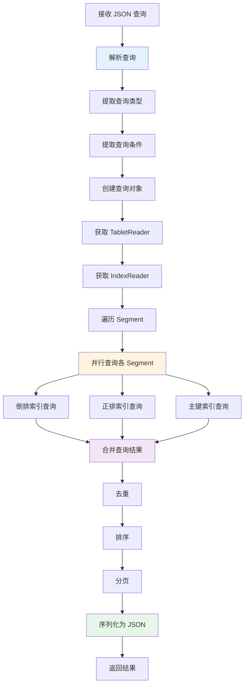
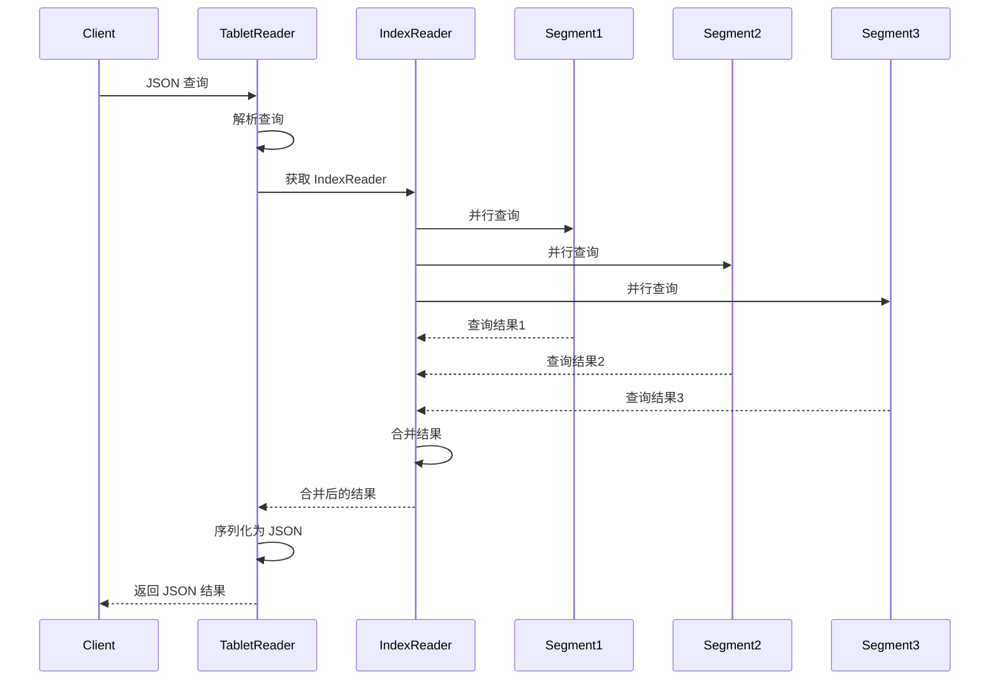
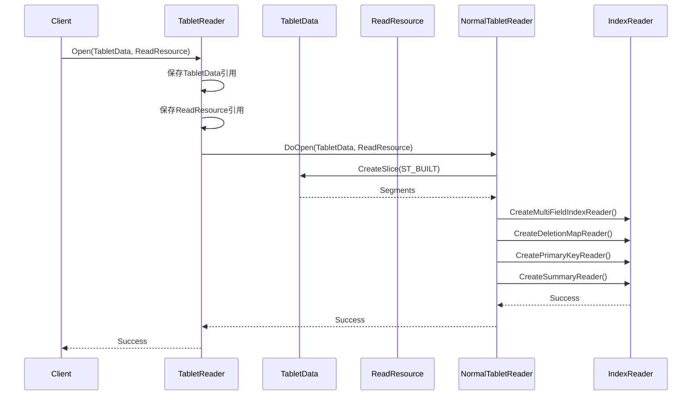
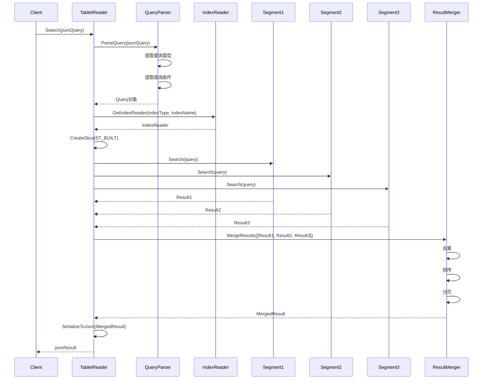
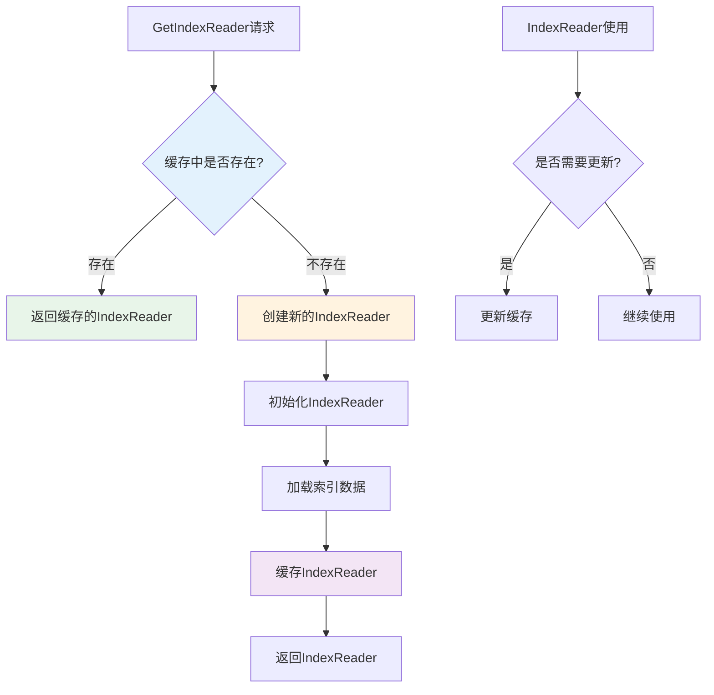
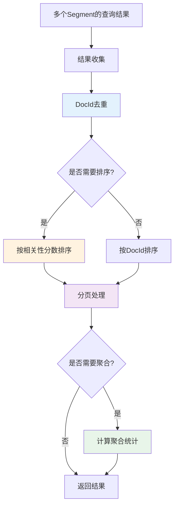

在上一篇文章中，我们深入了解了索引构建的完整流程。本文将继续深入，详细解析查询流程的实现，这是理解 IndexLib 如何从索引中查询数据的关键。


**查询流程图**：



## 1. 查询流程概览

### 1.1 整体流程

IndexLib 的查询流程包括以下核心步骤：

1. **解析查询**：将 JSON 格式的查询解析为内部查询对象
2. **获取 IndexReader**：根据索引类型和名称获取或创建 IndexReader
3. **遍历 Segment**：遍历所有已构建的 Segment
4. **并行查询**：对多个 Segment 进行并行查询
5. **合并结果**：将各 Segment 的查询结果合并（去重、排序等）
6. **返回结果**：序列化为 JSON 格式返回

让我们先通过图来理解整个流程：


**组件交互序列图**：



### 1.2 核心接口

查询的核心接口定义在 `framework/ITabletReader.h` 中：

```cpp
// framework/ITabletReader.h
class ITabletReader
{
public:
    // 搜索：JSON 格式的查询
    virtual Status Search(const std::string& jsonQuery, std::string& result) const = 0;
    
    // 获取索引 Reader：根据索引类型和名称获取
    virtual std::shared_ptr<index::IIndexReader> GetIndexReader(
        const std::string& indexType,
        const std::string& indexName) const = 0;
    
    // 获取 Schema
    virtual std::shared_ptr<config::ITabletSchema> GetSchema() const = 0;
};
```

**关键设计**：
- **Search**：提供 JSON 格式的查询接口，方便使用
  - **接口抽象**：通过 JSON 格式隐藏底层实现细节，提供统一的查询接口
  - **查询解析**：将 JSON 查询解析为内部查询对象，支持多种查询类型
  - **结果序列化**：将查询结果序列化为 JSON 格式，便于传输和展示
  
- **GetIndexReader**：根据索引类型和名称获取 IndexReader，支持缓存
  - **缓存机制**：通过 `_indexReaderMap` 缓存 IndexReader，避免重复创建
  - **延迟创建**：IndexReader 按需创建，减少初始化开销
  - **线程安全**：缓存操作是线程安全的，支持并发查询
  
- **GetSchema**：获取 Schema，用于查询验证和字段解析
  - **查询验证**：根据 Schema 验证查询条件的有效性
  - **字段解析**：根据 Schema 解析查询字段和返回字段
  - **类型转换**：根据 Schema 进行数据类型转换

## 2. TabletReader：查询入口

### 2.1 TabletReader 的实现

`TabletReader` 是查询的入口，定义在 `framework/TabletReader.h` 中：

```cpp
// framework/TabletReader.h
class TabletReader : public ITabletReader
{
public:
    explicit TabletReader(const std::shared_ptr<config::ITabletSchema>& schema);
    
    // 打开：初始化 TabletData 和读取资源
    Status Open(const std::shared_ptr<TabletData>& tabletData, 
                const framework::ReadResource& readResource);
    
    // 搜索：JSON 格式的查询
    Status Search(const std::string& jsonQuery, std::string& result) const override;
    
    // 获取索引 Reader：根据索引类型和名称获取（带缓存）
    std::shared_ptr<index::IIndexReader> GetIndexReader(
        const std::string& indexType,
        const std::string& indexName) const override;

protected:
    // 子类实现：具体的打开逻辑
    virtual Status DoOpen(const std::shared_ptr<TabletData>& tabletData, 
                          const framework::ReadResource& readResource) = 0;

protected:
    using IndexReaderMapKey = std::pair<std::string, std::string>;  // (indexType, indexName)
    
    std::shared_ptr<config::ITabletSchema> _schema;
    std::map<IndexReaderMapKey, std::shared_ptr<index::IIndexReader>> _indexReaderMap;  // 索引 Reader 缓存
    std::shared_ptr<IIndexMemoryReclaimer> _indexMemoryReclaimer;
};
```

**TabletReader 的关键组件**：


- **Schema**：索引的 Schema 定义，用于查询验证和字段解析
- **IndexReaderMap**：IndexReader 的缓存，避免重复创建
- **TabletData**：索引数据，包含所有 Segment
- **ReadResource**：读取资源（内存配额、缓存等）

### 2.2 TabletReader::Open()

`Open()` 方法初始化 TabletReader，准备查询：


**Open 流程**：

TabletReader 的 Open 流程是查询准备的关键步骤。让我们通过序列图来理解完整的 Open 流程：



**Open 流程详解**：

1. **设置 TabletData**：保存 TabletData 的引用
   - **数据访问**：通过 TabletData 访问所有 Segment
   - **版本管理**：通过 TabletData 获取当前版本信息
   - **资源管理**：通过 TabletData 访问共享资源
   
2. **设置 ReadResource**：保存读取资源（内存配额、缓存等）
   - **内存配额**：设置查询的内存配额，避免内存溢出
   - **缓存资源**：设置查询缓存，提高查询性能
   - **IO 资源**：设置 IO 资源，控制 IO 并发度
   
3. **调用 DoOpen()**：子类实现具体的打开逻辑
   - **NormalTabletReader**：创建各种 IndexReader（倒排、正排、主键等）
   - **KKVTabletReader**：创建 KKV 特定的 IndexReader
   - **KVTabletReader**：创建 KV 特定的 IndexReader
   
4. **初始化 IndexReader**：根据需要初始化 IndexReader
   - **延迟初始化**：IndexReader 按需初始化，减少启动时间
   - **缓存管理**：将 IndexReader 缓存到 `_indexReaderMap`
   - **资源分配**：为 IndexReader 分配必要的资源

### 2.3 TabletReader::Search()

`Search()` 方法是查询的入口，将 JSON 查询转换为结果：


**Search 流程**：

Search 方法是查询的核心，负责将 JSON 查询转换为结果。让我们通过详细的序列图来理解完整的查询流程：



**Search 流程详解**：

1. **解析查询**：将 JSON 查询解析为内部查询对象
   - **JSON 解析**：解析 JSON 格式的查询字符串
   - **查询类型识别**：识别查询类型（term 查询、范围查询、布尔查询等）
   - **查询条件提取**：提取查询条件（term、范围、排序字段等）
   - **查询对象创建**：创建内部查询对象，便于后续处理
   
2. **获取 IndexReader**：根据索引类型和名称获取 IndexReader
   - **缓存查找**：首先从 `_indexReaderMap` 查找缓存的 IndexReader
   - **创建 IndexReader**：如果缓存不存在，创建新的 IndexReader
   - **缓存 IndexReader**：将新创建的 IndexReader 缓存起来
   
3. **遍历 Segment**：通过 `TabletData->CreateSlice(ST_BUILT)` 获取所有已构建的 Segment
   - **Segment 筛选**：只查询已构建的 Segment，跳过构建中的 Segment
   - **Segment 排序**：按照 SegmentId 排序，保证查询顺序
   - **Segment 过滤**：可以根据 Locator 等条件过滤 Segment
   
4. **并行查询**：对多个 Segment 进行并行查询
   - **并行执行**：多个 Segment 的查询可以并行执行
   - **结果收集**：收集各 Segment 的查询结果
   - **错误处理**：单个 Segment 查询失败不影响其他 Segment
   
5. **合并结果**：将各 Segment 的查询结果合并（去重、排序等）
   - **去重处理**：根据 DocId 去重，避免重复文档
   - **排序处理**：按相关性分数或指定字段排序
   - **分页处理**：返回指定页的结果，支持分页查询
   - **聚合统计**：计算总数、平均值等统计信息
   
6. **返回结果**：序列化为 JSON 格式返回
   - **结果序列化**：将查询结果序列化为 JSON 格式
   - **字段选择**：根据查询条件选择返回的字段
   - **格式优化**：优化 JSON 格式，减少传输大小

### 2.4 IndexReader 缓存机制

`TabletReader` 维护 IndexReader 的缓存，避免重复创建：


**缓存机制**：

IndexReader 缓存是 TabletReader 性能优化的关键设计。让我们通过流程图来理解缓存机制的工作原理：



**缓存机制详解**：

- **缓存 Key**：`(indexType, indexName)` 对
  - **唯一性**：每个索引类型和名称的组合唯一标识一个 IndexReader
  - **查找效率**：使用 `std::map` 或 `std::unordered_map` 实现 O(log n) 或 O(1) 查找
  - **Key 设计**：使用 `std::pair` 作为 Key，支持多级索引
  
- **缓存 Value**：`IIndexReader` 指针
  - **生命周期**：IndexReader 的生命周期与 TabletReader 相同
  - **共享使用**：多个查询可以共享同一个 IndexReader
  - **内存管理**：通过 `shared_ptr` 管理内存，自动释放
  
- **优势**：避免重复创建 IndexReader，提高查询性能
  - **性能提升**：避免重复创建和初始化 IndexReader，显著提升查询性能
  - **内存优化**：多个查询共享 IndexReader，减少内存占用
  - **启动优化**：延迟创建 IndexReader，减少启动时间

**缓存策略**：

1. **LRU 策略**：
   - 当缓存满时，淘汰最近最少使用的 IndexReader
   - 适合内存受限的场景
   
2. **FIFO 策略**：
   - 当缓存满时，淘汰最早创建的 IndexReader
   - 实现简单，但可能淘汰常用 IndexReader
   
3. **无限制策略**：
   - 不限制缓存大小，所有 IndexReader 都缓存
   - 适合内存充足的场景，性能最好

**缓存实现**：

```cpp
// framework/TabletReader.h
std::shared_ptr<index::IIndexReader> TabletReader::GetIndexReader(
    const std::string& indexType,
    const std::string& indexName) const
{
    IndexReaderMapKey key = std::make_pair(indexType, indexName);
    auto it = _indexReaderMap.find(key);
    if (it != _indexReaderMap.end()) {
        return it->second;  // 返回缓存的 IndexReader
    }
    
    // 创建新的 IndexReader（子类实现）
    auto reader = DoGetIndexReader(indexType, indexName);
    if (reader) {
        _indexReaderMap[key] = reader;  // 缓存
    }
    return reader;
}
```

## 3. IndexReader：索引查询接口

### 3.1 IIndexReader 接口

`IIndexReader` 是索引查询的抽象接口，定义在 `index/IIndexReader.h` 中：

```cpp
// index/IIndexReader.h
class IIndexReader
{
public:
    virtual ~IIndexReader() = default;
    
    // 打开：初始化 IndexReader
    virtual Status Open(const std::shared_ptr<config::IIndexConfig>& indexConfig,
                       const IndexReaderParameter& indexReaderParam) = 0;
    
    // 查询：根据查询条件查询索引
    virtual Status Search(const std::shared_ptr<Query>& query,
                         std::shared_ptr<QueryResult>& result) = 0;
    
    // 获取索引统计信息
    virtual IndexStatistics GetStatistics() const = 0;
};
```

**IIndexReader 的关键方法**：


- **Open**：初始化 IndexReader，加载索引数据
- **Search**：根据查询条件查询索引，返回查询结果
- **GetStatistics**：获取索引统计信息（文档数、term 数等）

### 3.2 不同类型的 IndexReader

IndexLib 支持多种类型的 IndexReader：


**IndexReader 类型**：
- **InvertedIndexReader**：倒排索引 Reader，用于全文检索
- **AttributeReader**：正排索引 Reader，用于属性查询
- **PrimaryKeyIndexReader**：主键索引 Reader，用于主键查询
- **SummaryReader**：摘要 Reader，用于获取文档摘要
- **DeletionMapReader**：删除映射 Reader，用于过滤已删除文档

### 3.3 InvertedIndexReader：倒排索引查询

`InvertedIndexReader` 是倒排索引的查询接口：


**倒排索引查询流程**：
1. **解析查询**：解析 term 查询、范围查询等
2. **查找 term**：在倒排索引中查找 term
3. **获取倒排列表**：获取 term 对应的倒排列表（DocId 列表）
4. **过滤删除文档**：通过 DeletionMap 过滤已删除文档
5. **返回结果**：返回 DocId 列表和相关性分数

### 3.4 AttributeReader：正排索引查询

`AttributeReader` 是正排索引的查询接口：


**正排索引查询流程**：
1. **定位 DocId**：根据全局 DocId 定位到对应的 Segment
2. **转换为局部 DocId**：将全局 DocId 转换为局部 DocId
3. **读取属性值**：从正排索引中读取属性值
4. **返回结果**：返回属性值

## 4. 查询流程详解

### 4.1 查询解析

查询解析将 JSON 格式的查询转换为内部查询对象：


**查询解析流程**：
1. **解析 JSON**：解析 JSON 格式的查询字符串
2. **提取查询类型**：提取查询类型（term 查询、范围查询等）
3. **提取查询条件**：提取查询条件（term、范围等）
4. **创建查询对象**：创建内部查询对象

### 4.2 多 Segment 并行查询

查询时需要遍历多个 Segment，可以并行查询以提高性能：


**并行查询流程**：
1. **获取 Segment 列表**：`TabletData->CreateSlice(ST_BUILT)` 获取所有已构建的 Segment
2. **并行查询**：对每个 Segment 的 Indexer 进行查询（如果支持并行）
3. **合并结果**：将各 Segment 的查询结果合并（去重、排序等）

### 4.3 DocId 转换

查询时需要将全局 DocId 转换为局部 DocId：


**DocId 转换流程**：
1. **定位 Segment**：根据全局 DocId 找到对应的 Segment
2. **计算 BaseDocId**：计算该 Segment 的基础 DocId
3. **转换为局部 DocId**：`localDocId = globalDocId - baseDocId`
4. **Segment 内查询**：使用局部 DocId 在 Segment 内查询

### 4.4 结果合并

查询结果需要合并，包括去重、排序等：


**结果合并流程**：

结果合并是查询流程的关键步骤，需要高效地处理大量查询结果。让我们通过流程图来理解结果合并的详细过程：



**结果合并流程详解**：

1. **去重**：根据 DocId 去重，避免重复文档
   - **去重算法**：使用 `std::set` 或 `std::unordered_set` 实现 O(n) 去重
   - **去重时机**：在合并前或合并后去重，根据场景选择
   - **去重优化**：对于有序结果，可以使用双指针算法实现 O(n) 去重
   
2. **排序**：按相关性分数排序，返回最相关的文档
   - **排序算法**：使用堆排序或快速排序，时间复杂度 O(n log n)
   - **排序字段**：可以按相关性分数、时间、字段值等排序
   - **排序优化**：只对 Top-K 结果排序，减少排序开销
   
3. **聚合统计**：计算总数、平均值等统计信息
   - **总数统计**：统计匹配的文档总数
   - **平均值统计**：计算字段的平均值
   - **分组统计**：按字段分组统计
   - **聚合优化**：在查询过程中并行计算聚合，减少额外开销
   
4. **分页处理**：返回指定页的结果
   - **分页计算**：根据页码和每页大小计算结果范围
   - **分页优化**：只返回需要的文档，减少传输大小
   - **分页缓存**：缓存分页结果，提高重复查询性能

**结果合并的性能优化**：

1. **堆合并**：
   - 使用堆合并多个有序结果列表
   - 时间复杂度 O(n log k)，k 为结果列表数量
   - 适合 Top-K 查询场景
   
2. **并行合并**：
   - 多个结果列表可以并行合并
   - 充分利用多核 CPU，提高合并速度
   - 适合大量结果合并场景
   
3. **流式合并**：
   - 边查询边合并，不需要等待所有结果
   - 减少内存占用，提高响应速度
   - 适合实时查询场景

## 5. NormalTabletReader：标准表查询实现

### 5.1 NormalTabletReader 的实现

`NormalTabletReader` 是标准表的查询实现，定义在 `table/normal_table/NormalTabletReader.h` 中：

```cpp
// table/normal_table/NormalTabletReader.h
class NormalTabletReader : public framework::TabletReader
{
public:
    NormalTabletReader(const std::shared_ptr<config::ITabletSchema>& schema,
                       const std::shared_ptr<NormalTabletMetrics>& normalTabletMetrics);
    
    // 打开：初始化 TabletData 和读取资源
    Status DoOpen(const std::shared_ptr<framework::TabletData>& tabletData,
                  const framework::ReadResource& readResource) override;
    
    // 搜索：JSON 格式的查询
    Status Search(const std::string& jsonQuery, std::string& result) const override;
    
    // 获取各种 IndexReader
    std::shared_ptr<indexlib::index::InvertedIndexReader> GetMultiFieldIndexReader() const;
    const std::shared_ptr<index::DeletionMapIndexReader>& GetDeletionMapReader() const;
    const std::shared_ptr<indexlib::index::PrimaryKeyIndexReader>& GetPrimaryKeyReader() const;
    std::shared_ptr<index::SummaryReader> GetSummaryReader() const;
    std::shared_ptr<index::AttributeReader> GetAttributeReader(const std::string& attrName) const;
};
```

**NormalTabletReader 的关键组件**：


- **MultiFieldIndexReader**：多字段倒排索引 Reader
- **DeletionMapReader**：删除映射 Reader
- **PrimaryKeyReader**：主键索引 Reader
- **SummaryReader**：摘要 Reader
- **AttributeReader**：属性 Reader

### 5.2 NormalTabletReader::DoOpen()

`DoOpen()` 方法初始化 NormalTabletReader：


**DoOpen 流程**：
1. **初始化 TabletData**：保存 TabletData 的引用
2. **创建 MultiFieldIndexReader**：创建多字段倒排索引 Reader
3. **创建 DeletionMapReader**：创建删除映射 Reader
4. **创建 PrimaryKeyReader**：创建主键索引 Reader
5. **创建 SummaryReader**：创建摘要 Reader
6. **创建 AttributeReader**：根据需要创建属性 Reader

### 5.3 NormalTabletReader::Search()

`Search()` 方法实现标准表的查询：


**Search 流程**：
1. **解析查询**：将 JSON 查询解析为内部查询对象
2. **获取 IndexReader**：获取 MultiFieldIndexReader、DeletionMapReader 等
3. **遍历 Segment**：遍历所有已构建的 Segment
4. **并行查询**：对多个 Segment 进行并行查询
5. **过滤删除文档**：通过 DeletionMapReader 过滤已删除文档
6. **合并结果**：合并各 Segment 的查询结果
7. **返回结果**：序列化为 JSON 格式返回

## 6. 查询优化

### 6.1 查询剪枝

查询剪枝可以减少不必要的查询：


**查询剪枝策略**：
- **Locator 剪枝**：通过 Locator 判断哪些 Segment 可能包含查询结果
- **范围剪枝**：通过范围查询剪枝，减少查询范围
- **索引剪枝**：通过索引统计信息剪枝，跳过不相关的索引

### 6.2 查询缓存

查询缓存可以提高查询性能：


**查询缓存机制**：
- **结果缓存**：缓存查询结果，避免重复查询
- **索引缓存**：缓存索引数据，减少 IO 操作
- **统计缓存**：缓存统计信息，减少计算开销

### 6.3 并行查询优化

并行查询可以提高查询性能：


**并行查询优化**：
- **Segment 并行**：多个 Segment 可以并行查询
- **索引并行**：多个索引可以并行查询
- **结果并行合并**：查询结果可以并行合并

## 7. 查询性能优化

### 7.1 索引加载优化

索引加载优化可以减少查询延迟：


**索引加载优化**：
- **按需加载**：只加载查询需要的索引
- **懒加载**：在查询时才加载索引数据
- **预加载**：预加载常用索引，减少查询延迟

### 7.2 内存优化

内存优化可以减少内存使用：


**内存优化策略**：
- **内存池**：使用内存池减少内存分配开销
- **缓存控制**：控制缓存大小，避免内存溢出
- **内存回收**：及时回收不再使用的内存

### 7.3 IO 优化

IO 优化可以减少 IO 操作：


**IO 优化策略**：
- **批量读取**：批量读取索引数据，减少 IO 次数
- **预读**：预读可能需要的索引数据
- **IO 合并**：合并多个 IO 操作，减少 IO 开销

## 8. 查询场景示例

### 8.1 全文检索场景

在全文检索场景中，查询流程：


**全文检索流程**：
1. **解析查询**：解析 term 查询
2. **获取 InvertedIndexReader**：获取倒排索引 Reader
3. **查找 term**：在倒排索引中查找 term
4. **获取倒排列表**：获取 term 对应的倒排列表
5. **过滤删除文档**：通过 DeletionMap 过滤已删除文档
6. **计算相关性**：计算文档的相关性分数
7. **排序返回**：按相关性分数排序，返回结果

### 8.2 属性查询场景

在属性查询场景中，查询流程：


**属性查询流程**：
1. **解析查询**：解析属性查询条件
2. **获取 AttributeReader**：获取属性 Reader
3. **遍历 Segment**：遍历所有已构建的 Segment
4. **查询属性**：在 Segment 内查询属性值
5. **过滤匹配**：过滤匹配查询条件的文档
6. **返回结果**：返回匹配的文档列表

## 9. 性能优化与最佳实践

### 9.1 查询性能优化

**优化策略**：

1. **IndexReader 缓存优化**：
   - **缓存预热**：系统启动时预加载常用 IndexReader
   - **缓存策略**：根据查询模式选择合适的缓存策略（LRU、FIFO 等）
   - **缓存大小**：根据内存情况调整缓存大小，平衡性能和内存
   
2. **并行查询优化**：
   - **Segment 并行度**：根据 CPU 核心数调整 Segment 并行度
   - **索引并行度**：多个索引可以并行查询，提高查询速度
   - **结果并行合并**：查询结果可以并行合并，减少合并时间
   
3. **查询剪枝优化**：
   - **Locator 剪枝**：通过 Locator 判断哪些 Segment 需要查询
   - **范围剪枝**：通过范围查询剪枝，减少查询范围
   - **索引剪枝**：通过索引统计信息剪枝，跳过不相关的索引

### 9.2 内存优化

**优化策略**：

1. **索引加载优化**：
   - **按需加载**：只加载查询需要的索引，减少内存占用
   - **懒加载**：在查询时才加载索引数据，延迟内存分配
   - **预加载**：预加载常用索引，减少查询延迟
   
2. **结果缓存优化**：
   - **结果缓存**：缓存常用查询结果，避免重复查询
   - **缓存大小**：控制缓存大小，避免内存溢出
   - **缓存策略**：使用 LRU 等策略淘汰不常用的缓存
   
3. **内存池优化**：
   - **内存池**：使用内存池减少内存分配开销
   - **内存复用**：复用查询结果的内存，减少内存分配
   - **内存回收**：及时回收不再使用的内存

### 9.3 IO 优化

**优化策略**：

1. **批量读取优化**：
   - **批量读取**：批量读取索引数据，减少 IO 次数
   - **预读**：预读可能需要的索引数据，减少查询延迟
   - **IO 合并**：合并多个 IO 操作，减少 IO 开销
   
2. **索引压缩优化**：
   - **压缩算法**：选择合适的压缩算法（LZ4、Zstd 等）
   - **压缩级别**：根据场景选择合适的压缩级别
   - **压缩缓存**：缓存解压结果，减少重复解压
   
3. **IO 并发优化**：
   - **IO 并发度**：根据 IO 能力调整 IO 并发度
   - **IO 优先级**：重要查询的 IO 优先执行
   - **IO 限流**：控制 IO 速率，避免 IO 过载

## 10. 小结

查询流程是 IndexLib 的核心功能，包括 TabletReader 和 IndexReader 两个层次。通过本文的深入解析，我们了解到：

**核心组件**：

- **TabletReader**：查询入口，提供 JSON 格式的查询接口，管理 IndexReader 缓存
  - **接口设计**：通过 JSON 格式隐藏底层实现，提供统一的查询接口
  - **缓存机制**：通过 IndexReader 缓存避免重复创建，提高查询性能
  - **资源管理**：管理查询资源（内存配额、缓存等），保证查询稳定性
  
- **IndexReader**：索引查询接口，提供不同类型的索引查询能力
  - **接口抽象**：通过接口定义统一的查询能力，支持多种索引类型
  - **类型支持**：支持倒排索引、正排索引、主键索引等多种索引类型
  - **查询优化**：通过查询剪枝、缓存等机制优化查询性能
  
- **查询流程**：包括解析查询、获取 IndexReader、遍历 Segment、并行查询、合并结果等步骤
  - **查询解析**：将 JSON 查询解析为内部查询对象，支持多种查询类型
  - **并行查询**：支持多个 Segment 并行查询，提高查询性能
  - **结果合并**：包括去重、排序、分页等处理，保证查询结果的正确性

**设计亮点**：

1. **IndexReader 缓存**：通过缓存避免重复创建，显著提升查询性能
2. **并行查询**：支持多个 Segment 并行查询，显著提升查询性能
3. **查询剪枝**：通过 Locator、范围等机制剪枝，减少不必要的查询
4. **结果合并**：使用高效的合并算法（堆合并、并行合并），提高合并性能
5. **内存优化**：通过按需加载、懒加载等机制，减少内存占用

**性能优化**：

- **查询延迟**：通过并行查询和缓存，有效降低查询延迟
- **吞吐量**：并行查询显著提高吞吐量
- **内存使用**：按需加载和懒加载有效降低内存使用
- **IO 性能**：批量读取和预读显著提高 IO 性能

理解查询流程，是掌握 IndexLib 查询机制的关键。在下一篇文章中，我们将深入介绍版本管理和增量更新的实现细节，包括 Version 结构、Locator 机制、增量更新流程等各个组件的实现原理和性能优化策略。
