在上一篇文章中，我们深入了解了查询流程的实现。本文将继续深入，详细解析版本管理和增量更新的机制，这是理解 IndexLib 如何管理索引版本和实现增量更新的关键。

版本管理与增量更新概览：Version 与 Locator 的协同工作：

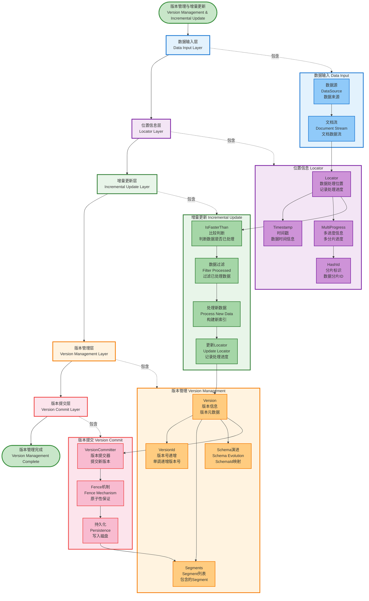

## 1. 版本管理概览

### 1.1 版本管理的核心概念

IndexLib 的版本管理包括以下核心概念：

1. **Version**：版本信息，记录索引包含哪些 Segment
2. **Locator**：位置信息，记录数据处理的位置，用于增量更新
3. **版本演进**：每次 Commit 都会创建新版本，版本号递增
4. **增量更新**：通过 Locator 判断哪些数据已处理，避免重复处理

让我们先通过图来理解版本管理的整体架构：

版本管理架构：Version、Locator、Segment 的关系：

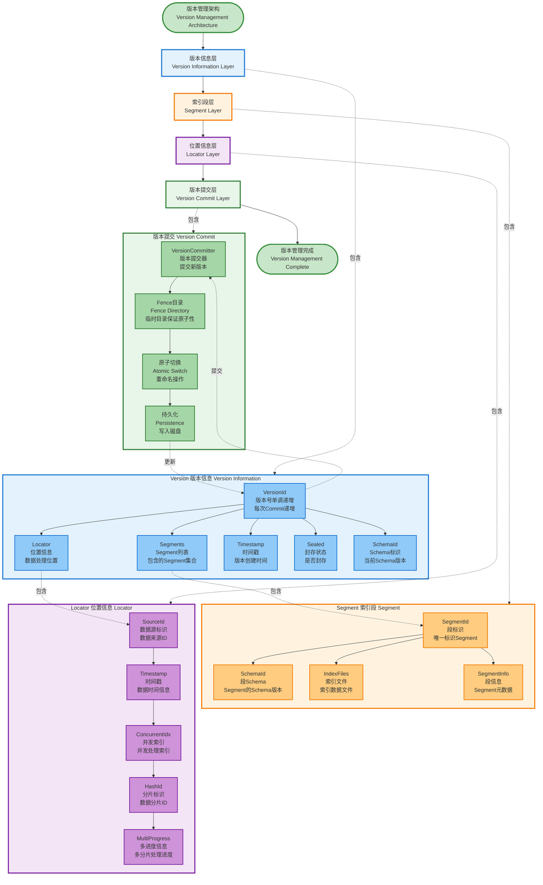

### 1.2 版本管理的作用

版本管理在 IndexLib 中起到关键作用，是系统稳定性和数据一致性的基础。让我们通过类图来理解版本管理的整体架构：

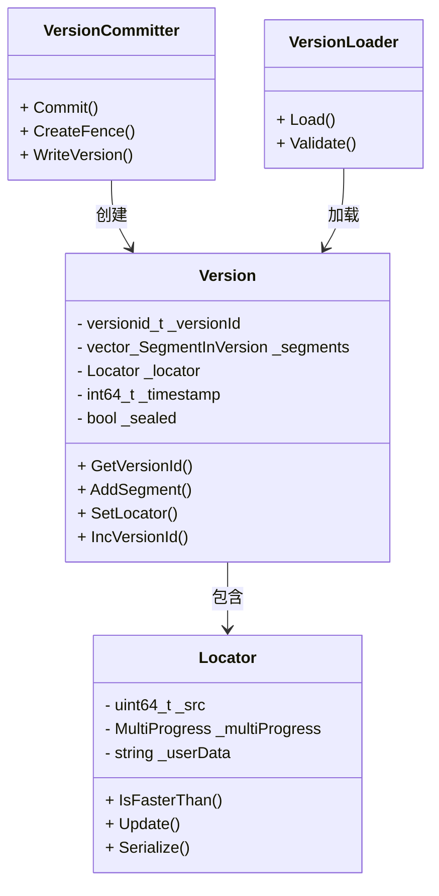

**版本管理的核心作用**：

- **版本控制**：记录索引的演进历史，支持版本回滚
  - **版本演进**：每次 Commit 创建新版本，版本号单调递增
  - **版本历史**：保留版本历史，支持查看和回滚到历史版本
  - **版本比较**：支持版本比较，判断版本之间的差异
  
- **增量更新**：通过 Locator 判断哪些数据已处理，实现增量更新
  - **数据定位**：通过 Locator 精确定位数据处理位置
  - **避免重复**：通过 Locator 比较避免重复处理数据
  - **进度追踪**：记录每个 HashId 的处理进度，支持分片处理
  
- **Schema 演进**：支持 Schema 变更，每个 Segment 记录自己的 SchemaId
  - **向后兼容**：新 Schema 向后兼容旧 Schema，旧 Segment 可以继续使用
  - **渐进式迁移**：新 Segment 使用新 Schema，旧 Segment 保持原样
  - **版本映射**：通过 SchemaVersionRoadMap 记录 Schema 版本映射
  
- **数据一致性**：保证数据不重复、不丢失，支持多数据源场景
  - **不重复保证**：通过 Locator 比较保证数据不重复处理
  - **不丢失保证**：通过 Locator 更新保证数据不丢失
  - **多数据源支持**：通过 `sourceIdx` 区分数据源，支持多数据源场景

## 2. Version：版本信息

### 2.1 Version 的结构

`Version` 记录索引的版本信息，定义在 `framework/Version.h` 中：

```cpp
// framework/Version.h
class Version : public autil::legacy::Jsonizable
{
private:
    struct SegmentInVersion {
        segmentid_t segmentId = INVALID_SEGMENTID;
        schemaid_t schemaId = DEFAULT_SCHEMAID;  // 每个 Segment 可以有不同的 Schema
    };

public:
    // 版本信息
    versionid_t GetVersionId() const { return _versionId; }
    void IncVersionId() { ++_versionId; }  // 每次 Commit 时递增
    
    // Segment 管理
    void AddSegment(segmentid_t segmentId, schemaid_t schemaId);
    void RemoveSegment(segmentid_t segmentId);
    size_t GetSegmentCount() const { return _segments.size(); }
    
    // Locator：数据位置信息
    void SetLocator(const Locator& locator);
    const Locator& GetLocator() const { return _locator; }
    
    // 时间戳
    void SetTimestamp(int64_t timestamp) { _timestamp = timestamp; }
    int64_t GetTimestamp() const { return _timestamp; }
    
    // 封存状态
    void SetSealed() { _sealed = true; }
    bool IsSealed() const { return _sealed; }

private:
    versionid_t _versionId;                    // 版本号，单调递增
    std::vector<SegmentInVersion> _segments;   // Segment 列表（有序）
    Locator _locator;                          // 位置信息，用于增量更新
    int64_t _timestamp;                        // 时间戳
    bool _sealed = false;                      // 是否封存
    schemaid_t _schemaId;                     // Schema ID
    std::string _fenceName;                    // Fence 名称
};
```

**Version 的关键字段**：

Version 的结构：包含 VersionId、Segments、Locator 等关键信息：

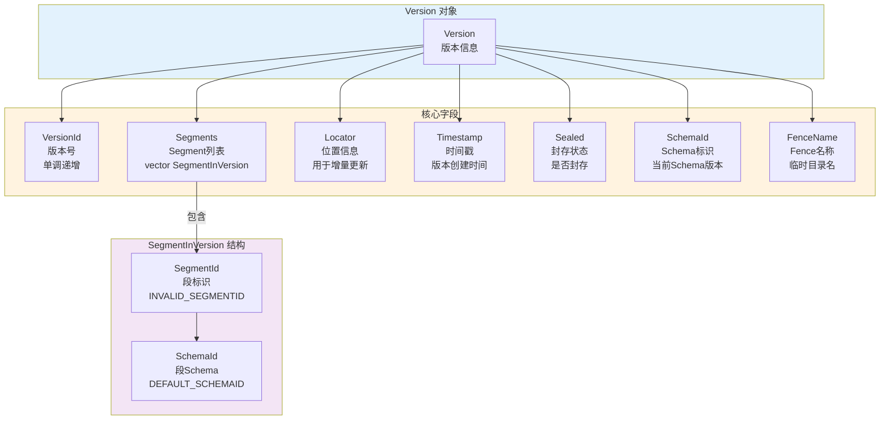

- **VersionId**：版本号，单调递增，每次 Commit 时递增
- **Segments**：该版本包含的 Segment 列表，每个 Segment 记录自己的 SchemaId
- **Locator**：数据位置信息，用于增量更新
- **Timestamp**：时间戳，记录版本创建时间
- **Sealed**：是否封存，封存后不再接收新 Segment

### 2.2 Version 的演进

每次 Commit 都会创建新版本，版本号递增：

Version 演进：从 V1 到 V2 的版本变化：

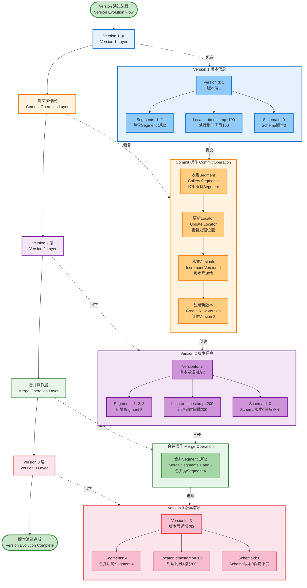

**版本演进示例**：
- **V1**：包含 Segment [1, 2]，Locator 记录处理到 timestamp=100
- **V2**：新增 Segment 3，Locator 更新到 timestamp=200
- **V3**：Segment 1 和 2 合并为 Segment 4，Locator 更新到 timestamp=300

**版本演进的关键设计**：

版本演进是 IndexLib 版本管理的核心机制。让我们通过序列图来理解版本演进的完整过程：

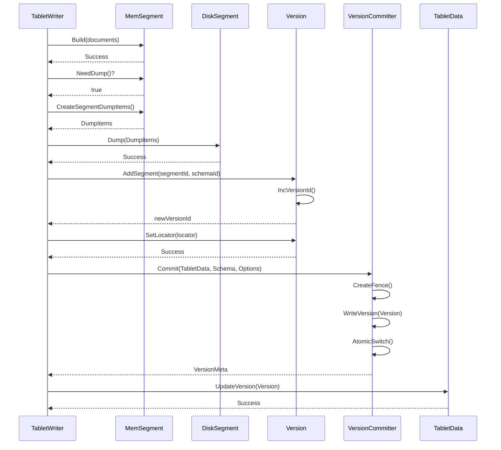

**版本演进的关键设计**：

- **版本号递增**：每次 Commit 时 `VersionId` 自动递增，保证版本顺序
  - **单调性**：版本号严格单调递增，保证版本顺序
  - **原子性**：版本号递增是原子操作，避免并发问题
  - **持久化**：版本号持久化到磁盘，保证重启后继续递增
  
- **Schema 演进**：每个 Segment 记录自己的 `SchemaId`，支持 Schema 变更
  - **Segment SchemaId**：每个 Segment 在创建时记录自己的 SchemaId
  - **Schema 映射**：Version 维护 SchemaVersionRoadMap，记录 Schema 版本映射
  - **兼容性检查**：Schema 变更时检查兼容性，保证数据一致性
  
- **Locator 更新**：每次 Commit 时更新 Locator，记录最新的数据处理位置
  - **位置记录**：Locator 记录每个 HashId 的处理进度
  - **更新条件**：只有当新的 Locator 完全比当前 Locator 快时，才更新
  - **一致性保证**：保证 Locator 只向前推进，不会回退

### 2.3 Version 的持久化

Version 需要持久化到磁盘，通过 Fence 机制保证原子性：

Version 持久化：通过 Fence 机制保证原子性：

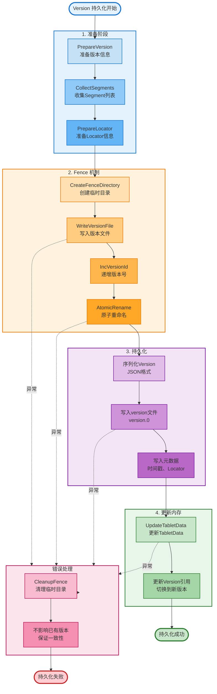

**持久化流程**：

Version 的持久化是版本管理的核心，通过 Fence 机制保证原子性。让我们通过序列图来理解完整的持久化流程：

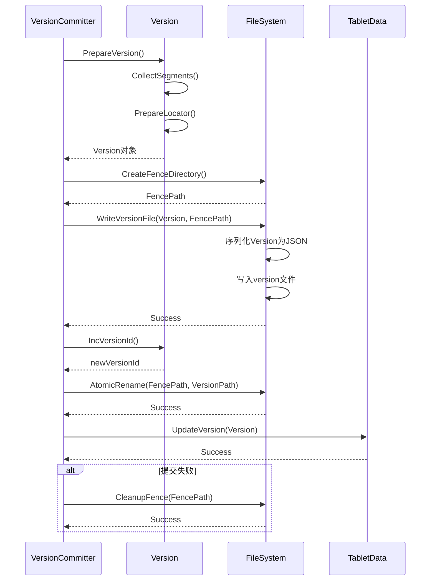

**持久化流程详解**：

1. **创建 Fence 目录**：在提交前创建临时目录（Fence）
   - **目录命名**：Fence 目录使用临时名称（如 `version.fence.1234567890`）
   - **目录隔离**：Fence 目录与正式版本目录隔离，避免冲突
   - **原子性准备**：Fence 目录为原子切换做准备
   
2. **写入 Version**：将 Version 写入 Fence 目录
   - **序列化**：将 Version 对象序列化为 JSON 格式
   - **文件写入**：将 JSON 写入版本文件（如 `version.0`）
   - **元数据写入**：写入版本元数据（时间戳、Locator 等）
   
3. **原子切换**：原子性地将 Fence 目录重命名为正式版本目录
   - **原子操作**：使用文件系统的原子重命名操作（`rename`）
   - **切换时机**：只有在所有文件写入成功后才切换
   - **失败处理**：如果切换失败，清理 Fence 目录，不影响已有版本
   
4. **保证原子性**：要么全部成功，要么全部失败
   - **事务性**：整个提交过程是事务性的，要么全部成功，要么全部失败
   - **错误恢复**：如果提交失败，可以清理 Fence 目录，不影响已有版本
   - **一致性保证**：保证版本文件的一致性，避免部分写入

**Fence 机制的设计优势**：

- **原子性**：通过原子重命名保证版本提交的原子性
- **性能**：Fence 机制不需要额外的锁，性能开销小
- **可靠性**：即使提交失败，也不会影响已有版本
- **简单性**：实现简单，易于理解和维护

### 2.4 Version 的加载

Version 的加载通过 `VersionLoader` 实现：

Version 加载：从磁盘加载版本信息：

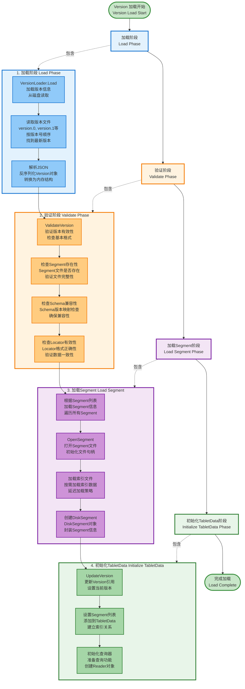

**加载流程**：
1. **读取版本文件**：从磁盘读取版本文件（version.0、version.1 等）
2. **解析 Version**：解析 JSON 格式的版本信息
3. **验证 Version**：验证版本的有效性（Segment 是否存在等）
4. **加载 Segment**：根据 Version 中的 Segment 列表加载 Segment

## 3. Locator：位置信息

### 3.1 Locator 的作用

Locator 是增量更新的核心，记录数据的位置信息：

Locator 的作用：记录数据处理位置，支持增量更新：

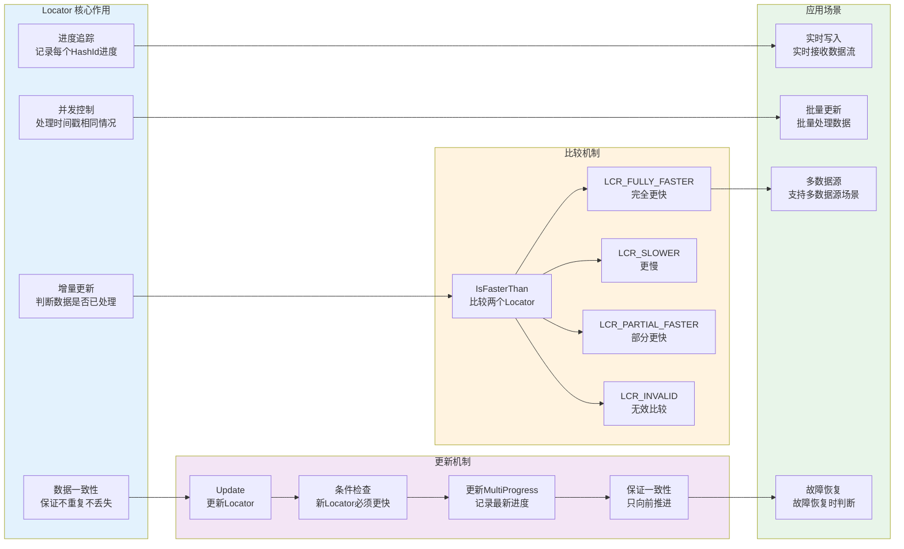

**Locator 的关键作用**：
1. **增量更新**：通过 `IsFasterThan()` 判断哪些数据已处理，避免重复处理
2. **数据一致性**：保证数据不重复、不丢失，支持多数据源场景
3. **进度追踪**：记录每个 HashId 的处理进度，支持分片处理
4. **并发控制**：通过 `concurrentIdx` 处理时间戳相同的情况

### 3.2 Locator 的结构

`Locator` 的结构定义在 `framework/Locator.h` 中：

```cpp
// framework/Locator.h
class Locator final
{
public:
    // Locator 比较结果
    enum class LocatorCompareResult {
        LCR_INVALID,        // 无效
        LCR_SLOWER,         // 比这个 locator 慢
        LCR_PARTIAL_FASTER, // 部分 hash id 更快
        LCR_FULLY_FASTER    // 完全比这个 locator 快（包括相等）
    };

    // 文档信息：记录文档在数据源中的位置
    struct DocInfo {
        int64_t timestamp;        // 时间戳
        uint32_t concurrentIdx;   // 并发索引（时间戳相同时的序号）
        uint16_t hashId;          // Hash ID（用于分片）
        uint8_t sourceIdx;        // 数据源索引
    };

    // 比较两个 Locator：判断数据是否已处理
    LocatorCompareResult IsFasterThan(const Locator& other, 
                                      bool ignoreLegacyDiffSrc) const;

private:
    uint64_t _src;                              // 数据源标识
    base::Progress::Offset _minOffset;          // 最小偏移量
    base::MultiProgress _multiProgress;        // 多进度信息（每个 hashId 的进度）
    std::string _userData;                      // 用户数据
};
```

**Locator 的关键字段**：

Locator 的结构：包含 timestamp、concurrentIdx、hashId 等信息：

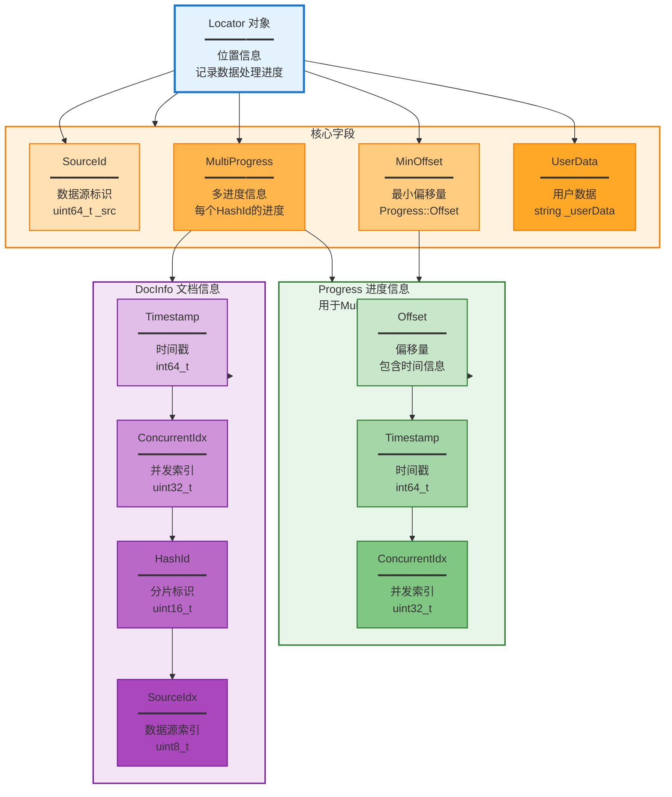

- **timestamp**：时间戳，记录数据的时间位置
- **concurrentIdx**：并发索引，处理时间戳相同的情况
- **hashId**：Hash ID，用于分片
- **sourceIdx**：数据源索引，支持多数据源
- **multiProgress**：多进度信息，每个 hashId 记录自己的进度

### 3.3 Locator 的比较逻辑

Locator 的比较逻辑用于判断数据是否已处理：

Locator 比较：判断数据是否已处理的逻辑（已在上面详细展示，此处不再重复）：

**比较示例**：
- **Locator A**：timestamp=100, hashId=0
- **Locator B**：timestamp=200, hashId=0
- **结果**：B 比 A 快（`LCR_FULLY_FASTER`），说明 B 包含 A 的所有数据

**比较逻辑**：

Locator 的比较逻辑是增量更新的核心算法。让我们通过流程图来理解详细的比较过程：

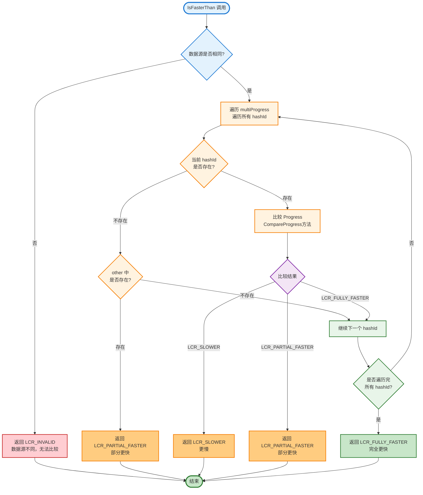

**比较逻辑详解**：

```cpp
// framework/Locator.h
LocatorCompareResult Locator::IsFasterThan(const Locator& other, 
                                            bool ignoreLegacyDiffSrc) const
{
    // 1. 检查数据源是否相同
    if (!IsSameSrc(other, ignoreLegacyDiffSrc)) {
        return LCR_INVALID;  // 数据源不同，无法比较
    }
    
    // 2. 比较每个 hashId 的进度
    for (size_t i = 0; i < _multiProgress.size(); ++i) {
        if (i >= other._multiProgress.size()) {
            // 当前 Locator 有更多的 hashId，部分更快
            return LCR_PARTIAL_FASTER;
        }
        
        // 比较该 hashId 的进度
        auto result = CompareProgress(_multiProgress[i], other._multiProgress[i]);
        if (result != LCR_FULLY_FASTER) {
            // 如果该 hashId 不是完全更快，返回结果
            return result;
        }
    }
    
    // 3. 所有 hashId 都完全更快，返回完全更快
    return LCR_FULLY_FASTER;
}
```

**比较算法的性能优化**：

1. **快速路径**：
   - 如果数据源不同，直接返回 `LCR_INVALID`，避免遍历 Progress
   - 如果 Progress 数量不同，快速判断部分更快
   
2. **短路优化**：
   - 如果某个 hashId 不是完全更快，立即返回结果
   - 不需要继续比较后续 hashId
   
3. **缓存优化**：
   - 比较结果可以缓存，避免重复计算
   - 对于相同的 Locator 对，直接返回缓存结果
   
4. **位运算优化**：
   - 使用位运算优化 Progress 的比较
   - 减少比较开销，提高比较性能

### 3.4 Locator 的更新

Locator 的更新通过 `Update()` 方法实现：

Locator 更新：更新数据处理位置：

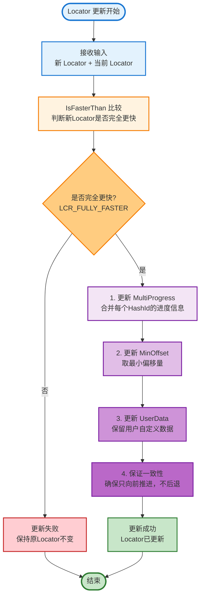

**更新逻辑**：
- **条件**：只有当新的 Locator 完全比当前 Locator 快时，才更新
- **更新内容**：更新 `multiProgress`，记录最新的数据处理位置
- **保证一致性**：保证 Locator 只向前推进，不会回退

## 4. 增量更新机制

### 4.1 增量更新的流程

增量更新通过 Locator 判断哪些数据已处理：

增量更新流程：通过 Locator 判断数据是否已处理（已在上面详细展示，此处不再重复）：

**增量更新流程图**：

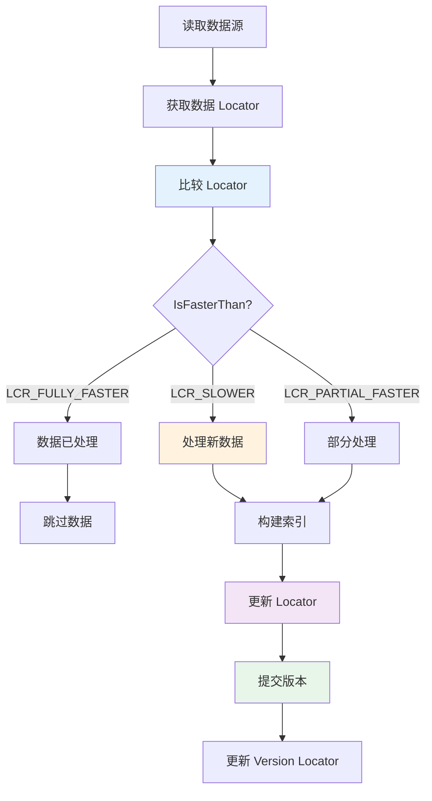

**增量更新流程**：
1. **读取数据源**：从数据源读取数据
2. **检查 Locator**：通过 `IsFasterThan()` 判断数据是否已处理
3. **处理新数据**：只处理未处理的数据
4. **更新 Locator**：处理完成后更新 Locator
5. **提交版本**：Commit 时更新 Version 的 Locator

### 4.2 增量更新的判断

增量更新的判断通过 Locator 比较实现：

增量更新判断：通过 Locator 比较判断数据是否已处理：

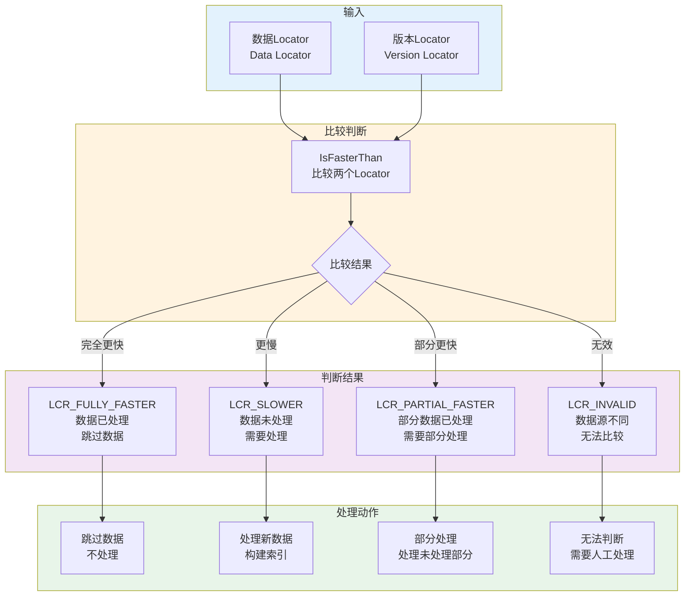

**判断逻辑**：
- **LCR_FULLY_FASTER**：数据已处理，跳过
- **LCR_SLOWER**：数据未处理，需要处理
- **LCR_PARTIAL_FASTER**：部分数据已处理，需要部分处理
- **LCR_INVALID**：数据源不同，无法比较

### 4.3 增量更新的场景

增量更新适用于以下场景：

增量更新场景：实时写入、批量更新等：

```mermaid
flowchart TD
    subgraph Realtime["1. 实时写入场景"]
        direction LR
        R1[实时接收数据流<br/>━━━━━━━━━━<br/>Continuous Data Stream<br/>持续接收新数据]
        R2[检查Locator<br/>━━━━━━━━━━<br/>IsFasterThan判断<br/>判断是否需要处理]
        R3[处理新数据<br/>━━━━━━━━━━<br/>只处理未处理数据<br/>避免重复处理]
        R4[更新Locator<br/>━━━━━━━━━━<br/>记录最新进度<br/>更新处理位置]
        R5[定期Commit<br/>━━━━━━━━━━<br/>提交版本<br/>持久化进度]
        R1 --> R2 --> R3 --> R4 --> R5
    end
    
    subgraph Batch["2. 批量更新场景"]
        direction LR
        B1[批量读取数据源<br/>━━━━━━━━━━<br/>Batch Read<br/>一次性读取大量数据]
        B2[检查Locator<br/>━━━━━━━━━━<br/>过滤已处理数据<br/>跳过已处理部分]
        B3[处理新数据<br/>━━━━━━━━━━<br/>批量构建索引<br/>高效处理]
        B4[更新Locator<br/>━━━━━━━━━━<br/>更新进度<br/>记录处理位置]
        B5[批量Commit<br/>━━━━━━━━━━<br/>提交版本<br/>批量持久化]
        B1 --> B2 --> B3 --> B4 --> B5
    end
    
    subgraph MultiSource["3. 多数据源场景"]
        direction LR
        M1[多个数据源<br/>━━━━━━━━━━<br/>Multiple Data Sources<br/>来自不同来源]
        M2[区分SourceIdx<br/>━━━━━━━━━━<br/>区分数据源<br/>标识来源]
        M3[分别处理<br/>━━━━━━━━━━<br/>独立处理每个数据源<br/>独立进度跟踪]
        M4[保证一致性<br/>━━━━━━━━━━<br/>数据不重复不丢失<br/>确保完整性]
        M1 --> M2 --> M3 --> M4
    end
    
    subgraph Recovery["4. 故障恢复场景"]
        direction LR
        F1[故障恢复<br/>━━━━━━━━━━<br/>Failure Recovery<br/>系统重启或恢复]
        F2[检查Locator<br/>━━━━━━━━━━<br/>判断需要重新处理的数据<br/>定位断点]
        F3[重新处理<br/>━━━━━━━━━━<br/>处理未处理数据<br/>从断点继续]
        F4[恢复完成<br/>━━━━━━━━━━<br/>恢复正常状态<br/>继续正常运行]
        F1 --> F2 --> F3 --> F4
    end
    
    style Realtime fill:#e3f2fd,stroke:#1976d2,stroke-width:2px
    style R1 fill:#c5e1f5,stroke:#1976d2,stroke-width:1.5px
    style R2 fill:#90caf9,stroke:#1976d2,stroke-width:1.5px
    style R3 fill:#64b5f6,stroke:#1976d2,stroke-width:1.5px
    style R4 fill:#42a5f5,stroke:#1976d2,stroke-width:1.5px
    style R5 fill:#2196f3,stroke:#1976d2,stroke-width:1.5px
    style Batch fill:#fff3e0,stroke:#f57c00,stroke-width:2px
    style B1 fill:#ffe0b2,stroke:#f57c00,stroke-width:1.5px
    style B2 fill:#ffcc80,stroke:#f57c00,stroke-width:1.5px
    style B3 fill:#ffb74d,stroke:#f57c00,stroke-width:1.5px
    style B4 fill:#ffa726,stroke:#f57c00,stroke-width:1.5px
    style B5 fill:#ff9800,stroke:#f57c00,stroke-width:1.5px
    style MultiSource fill:#f3e5f5,stroke:#7b1fa2,stroke-width:2px
    style M1 fill:#e1bee7,stroke:#7b1fa2,stroke-width:1.5px
    style M2 fill:#ce93d8,stroke:#7b1fa2,stroke-width:1.5px
    style M3 fill:#ba68c8,stroke:#7b1fa2,stroke-width:1.5px
    style M4 fill:#ab47bc,stroke:#7b1fa2,stroke-width:1.5px
    style Recovery fill:#e8f5e9,stroke:#2e7d32,stroke-width:2px
    style F1 fill:#c8e6c9,stroke:#2e7d32,stroke-width:1.5px
    style F2 fill:#a5d6a7,stroke:#2e7d32,stroke-width:1.5px
    style F3 fill:#81c784,stroke:#2e7d32,stroke-width:1.5px
    style F4 fill:#66bb6a,stroke:#2e7d32,stroke-width:1.5px
```

**使用场景**：
- **实时写入**：实时接收数据，通过 Locator 判断哪些数据已处理
- **批量更新**：批量处理数据，通过 Locator 避免重复处理
- **多数据源**：从多个数据源读取数据，通过 Locator 保证数据一致性
- **故障恢复**：故障恢复时，通过 Locator 判断需要重新处理的数据

## 5. 版本提交与加载

### 5.1 版本提交流程

版本提交通过 `VersionCommitter` 实现：

版本提交流程：从准备到持久化的完整过程（已在上面详细展示，此处不再重复）：

**版本提交流程图**：

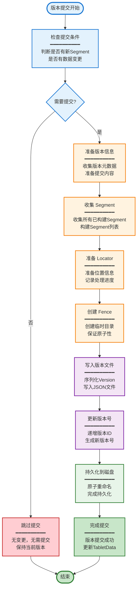

**提交流程**：
1. **检查提交条件**：判断是否需要提交（有新的 Segment、有数据变更等）
2. **准备版本信息**：收集所有已构建的 Segment，准备 Locator
3. **创建 Fence**：创建 Fence 目录，保证原子性
4. **持久化 Version**：将 Version 写入 Fence 目录
5. **原子切换**：原子性地将 Fence 目录切换为正式版本目录
6. **更新 TabletData**：更新 TabletData 的 Version

### 5.2 版本加载流程

版本加载通过 `VersionLoader` 实现：

版本加载流程：从磁盘加载版本信息（已在上面详细展示，此处不再重复）：

**加载流程**：
1. **读取版本文件**：从磁盘读取版本文件
2. **解析 Version**：解析 JSON 格式的版本信息
3. **验证 Version**：验证版本的有效性
4. **加载 Segment**：根据 Version 中的 Segment 列表加载 Segment
5. **初始化 TabletData**：初始化 TabletData，设置 Version 和 Segment 列表

### 5.3 版本回滚

版本回滚支持回滚到历史版本：

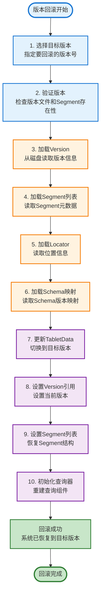

**回滚流程**：
1. **选择目标版本**：选择要回滚到的目标版本
2. **验证版本**：验证目标版本的有效性
3. **加载版本**：加载目标版本的 Version 和 Segment
4. **更新 TabletData**：更新 TabletData，恢复到目标版本

## 6. Schema 演进

### 6.1 Schema 演进机制

IndexLib 支持 Schema 演进，每个 Segment 可以有不同的 Schema：

Schema 演进：支持 Schema 变更，每个 Segment 记录自己的 SchemaId：

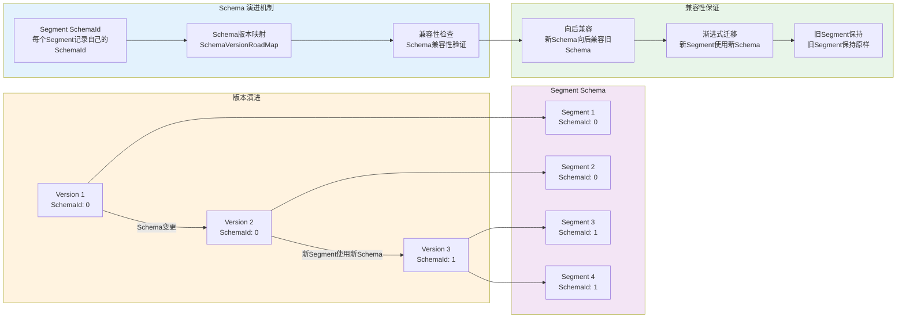

**Schema 演进机制**：
- **Segment SchemaId**：每个 Segment 记录自己的 `SchemaId`
- **Schema 版本映射**：Version 维护 `SchemaVersionRoadMap`，记录 Schema 版本映射
- **兼容性检查**：Schema 变更时检查兼容性，保证数据一致性

### 6.2 Schema 变更流程

Schema 变更的流程：

Schema 变更流程：从 Schema 变更到版本提交：

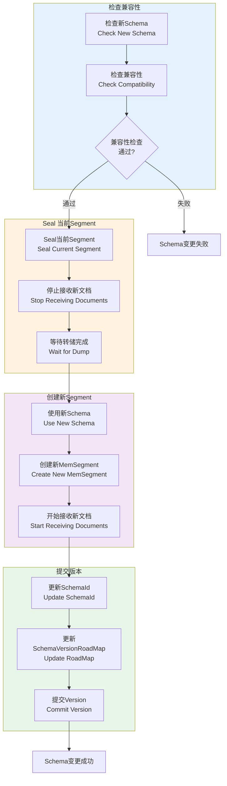

**变更流程**：
1. **检查兼容性**：检查新 Schema 与旧 Schema 的兼容性
2. **Seal 当前 Segment**：Seal 当前构建中的 Segment
3. **创建新 Segment**：使用新 Schema 创建新的 Segment
4. **提交版本**：Commit 时更新 SchemaId 和 SchemaVersionRoadMap

## 7. 版本清理

### 7.1 版本清理机制

版本清理用于清理不再需要的旧版本文件：

版本清理：清理不再需要的旧版本文件：

```mermaid
flowchart TD
    subgraph Identify["识别清理目标"]
        I1[保留版本列表<br/>Keep Recent N Versions]
        I2[识别旧版本<br/>Identify Old Versions]
        I3[检查版本引用<br/>Check Version References]
        I1 --> I2
        I2 --> I3
    end
    
    subgraph CleanSegment["清理Segment"]
        CS1[检查Segment引用<br/>Check Segment References]
        CS2{Segment是否<br/>被引用?}
        CS3[清理Segment文件<br/>Delete Segment Files]
        CS4[清理索引文件<br/>Delete Index Files]
        CS1 --> CS2
        CS2 -->|否| CS3
        CS3 --> CS4
    end
    
    subgraph CleanVersion["清理版本文件"]
        CV1[清理版本文件<br/>Delete Version Files]
        CV2[清理Fence目录<br/>Delete Fence Directories]
        CV3[清理元数据<br/>Delete Metadata]
        CV1 --> CV2
        CV2 --> CV3
    end
    
    subgraph Result["清理结果"]
        R1[释放存储空间<br/>Free Storage Space]
        R2[保持系统稳定<br/>Maintain System Stability]
        R1 --> R2
    end
    
    I3 --> CS1
    CS2 -->|是| Skip[跳过清理]
    CS4 --> CV1
    CV3 --> R1
    
    style Identify fill:#e3f2fd
    style CleanSegment fill:#fff3e0
    style CleanVersion fill:#f3e5f5
    style Result fill:#e8f5e9
```

**清理机制**：
- **保留版本列表**：保留指定数量的版本，清理其他版本
- **清理 Segment**：清理不再被任何版本引用的 Segment
- **清理索引文件**：清理不再使用的索引文件

### 7.2 版本清理策略

版本清理的策略：

版本清理策略：保留版本数量、清理时机等：

```mermaid
flowchart LR
    subgraph Strategy["清理策略"]
        S1[保留版本数<br/>Keep N Versions]
        S2[清理时机<br/>Cleanup Timing]
        S3[清理范围<br/>Cleanup Scope]
        S1 --> S2
        S2 --> S3
    end
    
    subgraph Keep["保留策略"]
        K1[保留最近N个版本<br/>Keep Recent N Versions]
        K2[保留活跃版本<br/>Keep Active Versions]
        K3[保留重要版本<br/>Keep Important Versions]
    end
    
    subgraph Timing["清理时机"]
        T1[Commit时清理<br/>Cleanup on Commit]
        T2[定期清理<br/>Periodic Cleanup]
        T3[手动清理<br/>Manual Cleanup]
    end
    
    subgraph Scope["清理范围"]
        SC1[版本文件<br/>Version Files]
        SC2[Segment文件<br/>Segment Files]
        SC3[索引文件<br/>Index Files]
        SC4[元数据文件<br/>Metadata Files]
    end
    
    S1 --> K1
    S2 --> T1
    S3 --> SC1
    K1 --> T1
    T1 --> SC1
    SC1 --> SC2
    SC2 --> SC3
    SC3 --> SC4
    
    style Strategy fill:#e3f2fd
    style Keep fill:#fff3e0
    style Timing fill:#f3e5f5
    style Scope fill:#e8f5e9
```

**清理策略**：
- **保留版本数**：保留最近 N 个版本，清理其他版本
- **清理时机**：在 Commit 时或定期清理
- **清理范围**：清理版本文件、Segment 文件、索引文件等

## 8. 增量更新的实际应用

### 8.1 实时写入场景

在实时写入场景中，增量更新的应用：

实时写入场景中的增量更新：通过 Locator 判断数据是否已处理：

```mermaid
flowchart TD
    subgraph Receive["接收数据"]
        R1[实时接收数据流<br/>Receive Data Stream]
        R2[解析文档<br/>Parse Documents]
        R3[提取Locator<br/>Extract Locator]
        R1 --> R2
        R2 --> R3
    end
    
    subgraph Check["检查Locator"]
        C1[获取Version Locator<br/>Get Version Locator]
        C2[IsFasterThan比较<br/>Compare Locators]
        C3{数据是否<br/>已处理?}
        C1 --> C2
        C2 --> C3
    end
    
    subgraph Process["处理新数据"]
        P1[处理新数据<br/>Process New Data]
        P2[构建索引<br/>Build Index]
        P3[更新Locator<br/>Update Locator]
        P1 --> P2
        P2 --> P3
    end
    
    subgraph Commit["提交版本"]
        CO1[定期Commit<br/>Periodic Commit]
        CO2[更新Version Locator<br/>Update Version Locator]
        CO3[持久化版本<br/>Persist Version]
        CO1 --> CO2
        CO2 --> CO3
    end
    
    R3 --> C1
    C3 -->|未处理| P1
    C3 -->|已处理| Skip[跳过数据]
    P3 --> CO1
    
    style Receive fill:#e3f2fd
    style Check fill:#fff3e0
    style Process fill:#f3e5f5
    style Commit fill:#e8f5e9
```

**实时写入流程**：
1. **接收数据**：实时接收数据流
2. **检查 Locator**：通过 `IsFasterThan()` 判断数据是否已处理
3. **处理新数据**：只处理未处理的数据
4. **更新 Locator**：处理完成后更新 Locator
5. **提交版本**：定期 Commit，更新 Version 的 Locator

### 8.2 批量更新场景

在批量更新场景中，增量更新的应用：

批量更新场景中的增量更新：批量处理数据，避免重复处理：

```mermaid
flowchart TD
    subgraph Read["读取数据源"]
        RD1[批量读取数据<br/>Batch Read Data]
        RD2[解析文档<br/>Parse Documents]
        RD3[提取Locator<br/>Extract Locators]
        RD1 --> RD2
        RD2 --> RD3
    end
    
    subgraph Filter["过滤已处理数据"]
        F1[获取Version Locator<br/>Get Version Locator]
        F2[批量比较Locator<br/>Batch Compare Locators]
        F3[过滤已处理数据<br/>Filter Processed Data]
        F1 --> F2
        F2 --> F3
    end
    
    subgraph Process["处理新数据"]
        P1[批量处理新数据<br/>Batch Process New Data]
        P2[批量构建索引<br/>Batch Build Index]
        P3[更新Locator<br/>Update Locator]
        P1 --> P2
        P2 --> P3
    end
    
    subgraph Commit["提交版本"]
        CO1[批量Commit<br/>Batch Commit]
        CO2[更新Version Locator<br/>Update Version Locator]
        CO3[持久化版本<br/>Persist Version]
        CO1 --> CO2
        CO2 --> CO3
    end
    
    RD3 --> F1
    F3 --> P1
    P3 --> CO1
    
    style Read fill:#e3f2fd
    style Filter fill:#fff3e0
    style Process fill:#f3e5f5
    style Commit fill:#e8f5e9
```

**批量更新流程**：
1. **读取数据源**：从数据源批量读取数据
2. **检查 Locator**：通过 `IsFasterThan()` 判断哪些数据已处理
3. **过滤已处理数据**：过滤掉已处理的数据
4. **处理新数据**：只处理未处理的数据
5. **更新 Locator**：处理完成后更新 Locator
6. **提交版本**：批量处理完成后 Commit

## 9. 版本管理的关键设计

### 9.1 原子性保证

版本管理的原子性通过 Fence 机制保证：

版本管理的原子性：通过 Fence 机制保证版本提交的原子性：

```mermaid
flowchart LR
    subgraph Fence["Fence 机制"]
        F1[创建Fence目录<br/>Create Fence Directory]
        F2[写入版本文件<br/>Write Version File]
        F3[原子重命名<br/>Atomic Rename]
        F1 --> F2
        F2 --> F3
    end
    
    subgraph Atomicity["原子性保证"]
        A1[要么全部成功<br/>All or Nothing]
        A2[要么全部失败<br/>Rollback on Failure]
        A3[避免部分写入<br/>Avoid Partial Write]
        A1 --> A2
        A2 --> A3
    end
    
    subgraph Error["错误处理"]
        E1[提交失败<br/>Commit Failure]
        E2[清理Fence目录<br/>Cleanup Fence]
        E3[不影响已有版本<br/>No Impact on Existing]
        E1 --> E2
        E2 --> E3
    end
    
    subgraph Advantage["设计优势"]
        AD1[原子性<br/>Atomicity]
        AD2[性能高<br/>High Performance]
        AD3[可靠性<br/>Reliability]
        AD4[简单性<br/>Simplicity]
    end
    
    F3 --> A1
    A3 --> E1
    E3 --> AD1
    
    style Fence fill:#e3f2fd
    style Atomicity fill:#fff3e0
    style Error fill:#f3e5f5
    style Advantage fill:#e8f5e9
```

**原子性保证**：
- **Fence 机制**：通过 Fence 目录保证版本提交的原子性
- **原子切换**：原子性地将 Fence 目录切换为正式版本目录
- **错误恢复**：如果提交失败，可以清理 Fence 目录，不影响已有版本

### 9.2 数据一致性

版本管理保证数据一致性：

版本管理的数据一致性：通过 Locator 保证数据不重复、不丢失：

```mermaid
flowchart TD
    subgraph Consistency["数据一致性保证"]
        C1[不重复保证<br/>No Duplication]
        C2[不丢失保证<br/>No Loss]
        C3[多数据源支持<br/>Multi-Source Support]
    end
    
    subgraph Locator["Locator 机制"]
        L1[Locator比较<br/>Locator Comparison]
        L2[IsFasterThan<br/>判断数据是否已处理]
        L3[Update机制<br/>保证只向前推进]
        L1 --> L2
        L2 --> L3
    end
    
    subgraph MultiSource["多数据源支持"]
        M1[SourceIdx区分<br/>Distinguish by SourceIdx]
        M2[独立处理<br/>Independent Processing]
        M3[保证一致性<br/>Ensure Consistency]
        M1 --> M2
        M2 --> M3
    end
    
    subgraph Concurrent["并发控制"]
        CO1[ConcurrentIdx<br/>处理时间戳相同]
        CO2[HashId分片<br/>Sharding by HashId]
        CO3[保证顺序<br/>Ensure Order]
        CO1 --> CO2
        CO2 --> CO3
    end
    
    C1 --> L1
    C2 --> L3
    C3 --> M1
    L3 --> CO1
    
    style Consistency fill:#e3f2fd
    style Locator fill:#fff3e0
    style MultiSource fill:#f3e5f5
    style Concurrent fill:#e8f5e9
```

**数据一致性保证**：
- **Locator 比较**：通过 Locator 比较判断数据是否已处理
- **多数据源支持**：支持多数据源场景，通过 `sourceIdx` 区分数据源
- **并发控制**：通过 `concurrentIdx` 处理时间戳相同的情况

### 9.3 性能优化

版本管理的性能优化：

版本管理的性能优化：版本缓存、懒加载等：

```mermaid
flowchart LR
    subgraph Cache["版本缓存"]
        CA1[缓存常用版本<br/>Cache Common Versions]
        CA2[LRU淘汰策略<br/>LRU Eviction]
        CA3[减少磁盘读取<br/>Reduce Disk Reads]
        CA1 --> CA2
        CA2 --> CA3
    end
    
    subgraph Lazy["懒加载"]
        L1[按需加载版本<br/>Load on Demand]
        L2[减少启动时间<br/>Reduce Startup Time]
        L3[并行加载<br/>Parallel Loading]
        L1 --> L2
        L2 --> L3
    end
    
    subgraph Batch["批量操作"]
        B1[批量处理版本<br/>Batch Process Versions]
        B2[批量清理<br/>Batch Cleanup]
        B3[提高效率<br/>Improve Efficiency]
        B1 --> B2
        B2 --> B3
    end
    
    subgraph Optimize["优化策略"]
        O1[快速路径<br/>Fast Path]
        O2[短路优化<br/>Short Circuit]
        O3[缓存优化<br/>Cache Optimization]
        O1 --> O2
        O2 --> O3
    end
    
    CA3 --> L1
    L3 --> B1
    B3 --> O1
    
    style Cache fill:#e3f2fd
    style Lazy fill:#fff3e0
    style Batch fill:#f3e5f5
    style Optimize fill:#e8f5e9
```

**性能优化策略**：
- **版本缓存**：缓存常用版本，减少磁盘读取
- **懒加载**：按需加载版本信息，减少启动时间
- **批量操作**：批量处理版本操作，提高效率

## 10. 性能优化与最佳实践

### 10.1 版本管理性能优化

**优化策略**：

1. **版本缓存优化**：
   - **缓存策略**：缓存常用版本，减少磁盘读取
   - **缓存大小**：根据内存情况调整缓存大小
   - **缓存淘汰**：使用 LRU 等策略淘汰不常用的版本
   
2. **版本加载优化**：
   - **懒加载**：按需加载版本信息，减少启动时间
   - **并行加载**：多个版本可以并行加载，提高加载速度
   - **预加载**：预加载常用版本，减少查询延迟
   
3. **版本清理优化**：
   - **延迟清理**：延迟清理旧版本，避免影响查询
   - **批量清理**：批量清理旧版本，减少 IO 开销
   - **清理策略**：根据版本使用情况选择清理策略

### 10.2 Locator 性能优化

**优化策略**：

1. **比较优化**：
   - **快速路径**：数据源不同时直接返回，避免遍历
   - **短路优化**：部分 hashId 不满足时立即返回
   - **缓存优化**：缓存比较结果，避免重复计算
   
2. **序列化优化**：
   - **压缩序列化**：使用压缩算法减少序列化大小
   - **增量序列化**：只序列化变更部分，减少序列化开销
   - **批量序列化**：批量序列化多个 Locator，提高效率
   
3. **更新优化**：
   - **批量更新**：批量更新多个 hashId 的进度
   - **增量更新**：只更新变更的进度，减少更新开销
   - **异步更新**：异步更新 Locator，不阻塞主流程

### 10.3 增量更新性能优化

**优化策略**：

1. **数据过滤优化**：
   - **批量过滤**：批量过滤已处理数据，减少比较次数
   - **索引优化**：使用索引加速数据过滤
   - **并行过滤**：多个数据源可以并行过滤
   
2. **处理优化**：
   - **批量处理**：批量处理新数据，提高处理效率
   - **并行处理**：多个 hashId 可以并行处理
   - **流式处理**：边读取边处理，减少内存占用
   
3. **Locator 更新优化**：
   - **延迟更新**：延迟更新 Locator，减少更新频率
   - **批量更新**：批量更新多个 hashId 的进度
   - **异步更新**：异步更新 Locator，不阻塞数据处理

## 11. 小结

版本管理和增量更新是 IndexLib 的核心功能，通过 Version 和 Locator 两个机制实现。通过本文的深入解析，我们了解到：

**核心机制**：

- **Version**：版本信息，记录索引包含哪些 Segment，支持版本演进和 Schema 演进
  - **版本控制**：版本号单调递增，支持版本回滚
  - **Schema 演进**：每个 Segment 记录自己的 SchemaId，支持 Schema 变更
  - **持久化**：通过 Fence 机制保证版本提交的原子性
  
- **Locator**：位置信息，记录数据处理位置，用于增量更新和数据一致性保证
  - **多维度定位**：通过 timestamp、concurrentIdx、hashId、sourceIdx 等多维度定位
  - **比较算法**：通过 `IsFasterThan()` 判断数据是否已处理
  - **更新机制**：保证 Locator 只向前推进，不会回退
  
- **版本演进**：每次 Commit 都会创建新版本，版本号递增，支持版本回滚
  - **版本号递增**：版本号严格单调递增，保证版本顺序
  - **版本历史**：保留版本历史，支持查看和回滚
  - **版本清理**：定期清理旧版本，释放存储空间
  
- **增量更新**：通过 Locator 判断哪些数据已处理，避免重复处理，支持实时写入和批量更新
  - **数据过滤**：通过 Locator 比较过滤已处理数据
  - **进度追踪**：记录每个 HashId 的处理进度，支持分片处理
  - **多数据源支持**：支持多数据源场景，保证数据一致性
  
- **Schema 演进**：支持 Schema 变更，每个 Segment 记录自己的 SchemaId
  - **向后兼容**：新 Schema 向后兼容旧 Schema
  - **渐进式迁移**：新 Segment 使用新 Schema，旧 Segment 保持原样
  - **版本映射**：通过 SchemaVersionRoadMap 记录 Schema 版本映射
  
- **原子性保证**：通过 Fence 机制保证版本提交的原子性
  - **Fence 目录**：创建临时目录，写入版本文件
  - **原子切换**：原子性地将 Fence 目录切换为正式版本目录
  - **错误恢复**：提交失败时清理 Fence 目录，不影响已有版本
  
- **数据一致性**：通过 Locator 保证数据不重复、不丢失，支持多数据源场景
  - **不重复保证**：通过 Locator 比较保证数据不重复处理
  - **不丢失保证**：通过 Locator 更新保证数据不丢失
  - **多数据源支持**：通过 `sourceIdx` 区分数据源，支持多数据源场景

**设计亮点**：

1. **Fence 机制**：通过原子重命名保证版本提交的原子性，实现简单、性能高
2. **Locator 比较算法**：多维度比较算法，支持精确的数据定位和增量更新
3. **Schema 演进**：支持 Schema 变更，每个 Segment 记录自己的 SchemaId，实现渐进式迁移
4. **版本清理**：定期清理旧版本，释放存储空间，保证系统稳定性
5. **性能优化**：通过缓存、懒加载、批量操作等机制优化性能

**性能优化**：

- **版本提交**：Fence 机制保证原子性，提交延迟较低
- **Locator 比较**：快速路径和短路优化，显著提升比较性能
- **增量更新**：通过 Locator 过滤，有效减少处理量
- **版本加载**：懒加载和并行加载，有效减少启动时间

理解版本管理和增量更新，是掌握 IndexLib 数据管理机制的关键。在下一篇文章中，我们将深入介绍 Segment 合并策略的实现细节，包括合并策略的选择、合并计划的创建、合并执行的流程等各个组件的实现原理和性能优化策略。
