在上一篇文章中，我们深入了解了版本管理和增量更新的机制。本文将继续深入，详细解析 Segment 合并策略的实现，这是理解 IndexLib 如何优化索引结构和提高查询性能的关键。

Segment 合并策略概览：从合并策略到合并执行的完整流程：

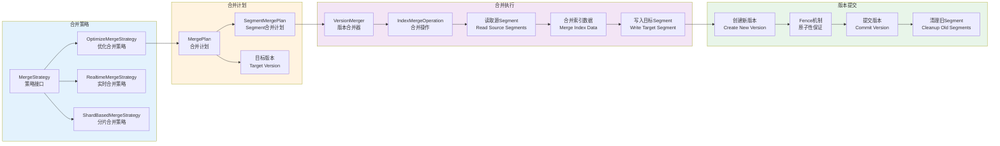

## 1. Segment 合并概览

### 1.1 合并的目的

Segment 合并的主要目的包括：

1. **减少 Segment 数量**：合并多个小 Segment 为一个大 Segment，减少查询时需要遍历的 Segment 数量
2. **优化查询性能**：减少 Segment 数量可以降低查询延迟，提高查询吞吐量
3. **释放存储空间**：合并可以删除重复数据，释放存储空间
4. **优化索引结构**：合并可以优化索引结构，提高索引效率

让我们先通过图来理解 Segment 合并的整体流程：

Segment 合并流程：从合并策略到合并执行的完整过程（已在上面详细展示，此处不再重复）：

**Segment 合并流程图**：

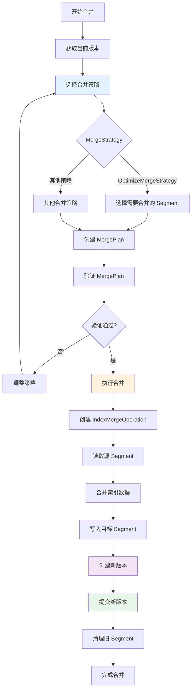

### 1.2 合并的核心组件

Segment 合并包括以下核心组件，它们协同工作完成合并任务。让我们通过类图来理解各组件的关系：

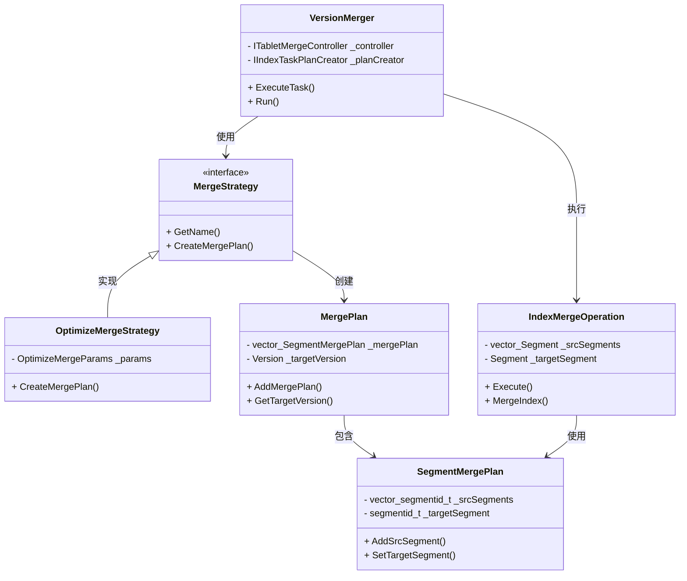

**核心组件详解**：

- **MergeStrategy**：合并策略，决定哪些 Segment 参与合并
  - **策略模式**：通过策略模式支持多种合并策略，便于扩展
  - **策略选择**：根据 Segment 特征和配置选择合适的合并策略
  - **计划创建**：根据策略创建合并计划，决定合并的 Segment 和目标
  
- **MergePlan**：合并计划，包含合并的 Segment 列表和目标 Segment 信息
  - **计划结构**：包含多个 SegmentMergePlan，每个计划合并一组 Segment
  - **目标版本**：记录合并后的目标版本，包含合并后的 Segment 列表
  - **计划验证**：创建后验证计划的有效性，确保可以执行
  
- **IndexMergeOperation**：合并操作，执行实际的合并工作
  - **数据读取**：读取所有源 Segment 的索引数据
  - **数据合并**：合并倒排索引、正排索引等索引数据
  - **数据写入**：将合并后的数据写入目标 Segment
  
- **VersionMerger**：版本合并器，管理合并流程和版本更新
  - **流程管理**：管理合并的完整流程，从计划创建到版本提交
  - **任务调度**：调度合并任务的执行，控制合并的并发度
  - **版本更新**：合并完成后更新版本，提交新版本

## 2. MergeStrategy：合并策略

### 2.1 MergeStrategy 接口

`MergeStrategy` 是合并策略的抽象接口，定义在 `table/index_task/merger/MergeStrategy.h` 中：

```cpp
// table/index_task/merger/MergeStrategy.h
class MergeStrategy
{
public:
    virtual ~MergeStrategy() {}
    
    // 获取策略名称
    virtual std::string GetName() const = 0;
    
    // 创建合并计划：根据 Context 创建合并计划
    virtual std::pair<Status, std::shared_ptr<MergePlan>>
    CreateMergePlan(const framework::IndexTaskContext* context) = 0;
};
```

**MergeStrategy 的关键方法**：

MergeStrategy 接口：提供合并策略的抽象：

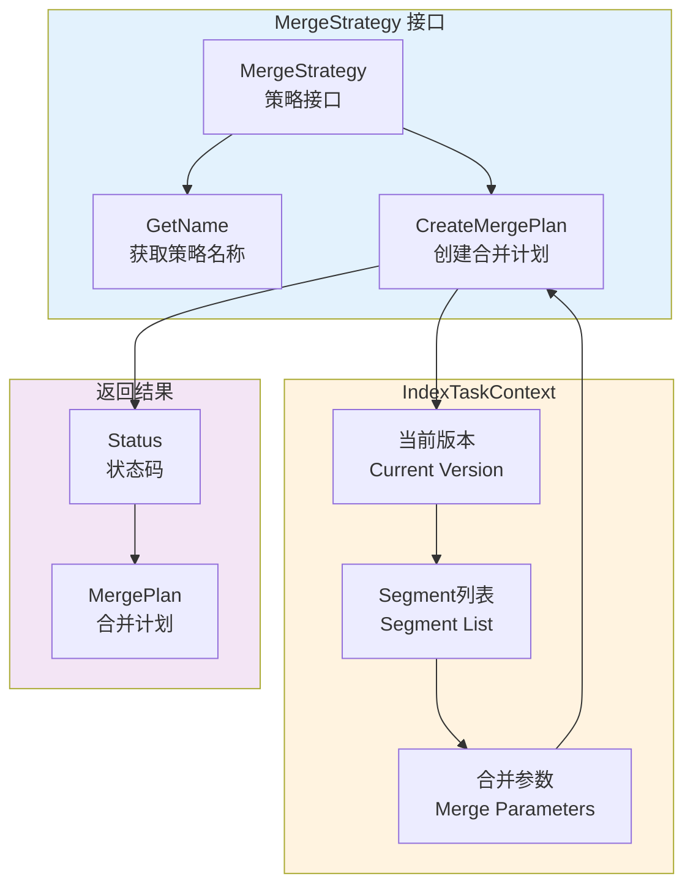

- **GetName()**：获取策略名称，用于标识不同的合并策略
- **CreateMergePlan()**：根据 IndexTaskContext 创建合并计划，决定哪些 Segment 参与合并

### 2.2 合并策略类型

IndexLib 支持多种合并策略：

合并策略类型：Optimize、Realtime、ShardBased 等：

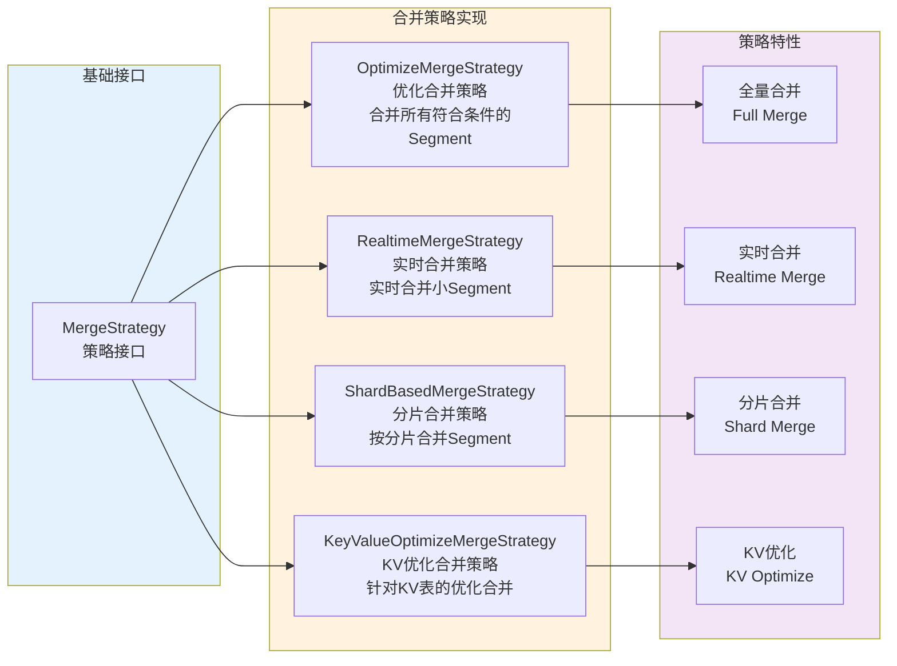

**合并策略类型**：
- **OptimizeMergeStrategy**：优化合并策略，合并所有符合条件的 Segment
- **RealtimeMergeStrategy**：实时合并策略，实时合并小 Segment
- **ShardBasedMergeStrategy**：分片合并策略，按分片合并 Segment
- **KeyValueOptimizeMergeStrategy**：KV 优化合并策略，针对 KV 表的优化合并

### 2.3 OptimizeMergeStrategy：优化合并策略

`OptimizeMergeStrategy` 是优化合并策略的实现，定义在 `table/index_task/merger/OptimizeMergeStrategy.h` 中：

```cpp
// table/index_task/merger/OptimizeMergeStrategy.h
class OptimizeMergeStrategy : public MergeStrategy
{
public:
    std::string GetName() const override { 
        return MergeStrategyDefine::OPTIMIZE_MERGE_STRATEGY_NAME; 
    }
    
    // 创建合并计划
    std::pair<Status, std::shared_ptr<MergePlan>>
    CreateMergePlan(const framework::IndexTaskContext* context) override;

private:
    // 合并参数
    struct OptimizeMergeParams {
        uint32_t maxDocCount;                    // 参与合并的 Segment 的最大文档数
        uint64_t afterMergeMaxDocCount;         // 合并后的最小文档数
        uint32_t afterMergeMaxSegmentCount;     // 合并后的最大 Segment 数
        bool skipSingleMergedSegment;           // 是否跳过单个已合并的 Segment
    };
    
    OptimizeMergeParams _params;
};
```

**OptimizeMergeStrategy 的关键参数**：

OptimizeMergeStrategy 参数：控制合并行为的关键参数：

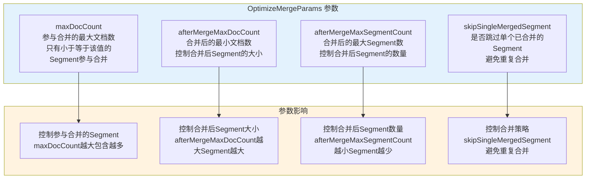

- **maxDocCount**：参与合并的 Segment 的最大文档数，只有小于等于该值的 Segment 才会参与合并
- **afterMergeMaxDocCount**：合并后的最小文档数，控制合并后 Segment 的大小
- **afterMergeMaxSegmentCount**：合并后的最大 Segment 数，控制合并后 Segment 的数量
- **skipSingleMergedSegment**：是否跳过单个已合并的 Segment，避免重复合并

### 2.4 合并策略的选择逻辑

合并策略的选择逻辑：

合并策略的选择逻辑：根据 Segment 特征选择合并策略（已在上面详细展示，此处不再重复）：

**选择逻辑**：

合并策略的选择逻辑是合并流程的关键。让我们通过流程图来理解详细的选择过程：

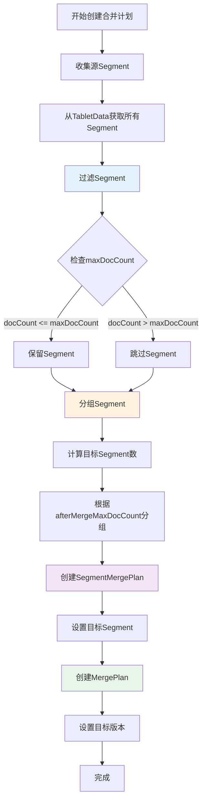

**选择逻辑详解**：

1. **收集源 Segment**：从 TabletData 中收集符合条件的 Segment
   - **Segment 筛选**：只收集已构建的 Segment（`ST_BUILT`）
   - **Segment 排序**：按照 SegmentId 排序，保证合并顺序
   - **Segment 过滤**：可以根据大小、时间等条件过滤 Segment
   
2. **过滤 Segment**：根据 `maxDocCount` 过滤 Segment，只保留符合条件的 Segment
   - **文档数检查**：只保留文档数小于等于 `maxDocCount` 的 Segment
   - **跳过已合并**：如果 `skipSingleMergedSegment` 为 true，跳过单个已合并的 Segment
   - **大小限制**：可以根据 Segment 大小进一步过滤
   
3. **分组 Segment**：根据 `afterMergeMaxDocCount` 和 `afterMergeMaxSegmentCount` 分组 Segment
   - **目标 Segment 数计算**：根据总文档数和 `afterMergeMaxDocCount` 计算目标 Segment 数
   - **Segment 分组**：将 Segment 分组，每组的文档数接近 `afterMergeMaxDocCount`
   - **分组优化**：优化分组策略，减少合并次数
   
4. **创建合并计划**：为每组 Segment 创建合并计划
   - **SegmentMergePlan 创建**：为每组 Segment 创建 SegmentMergePlan
   - **目标 Segment 设置**：为每个 SegmentMergePlan 设置目标 Segment
   - **MergePlan 组装**：将所有 SegmentMergePlan 添加到 MergePlan

## 3. MergePlan：合并计划

### 3.1 MergePlan 的结构

`MergePlan` 是合并计划，定义在 `table/index_task/merger/MergePlan.h` 中：

```cpp
// table/index_task/merger/MergePlan.h
class MergePlan : public framework::IndexTaskResource, 
                  public autil::legacy::Jsonizable
{
public:
    // 添加合并计划
    void AddMergePlan(const SegmentMergePlan& segmentMergePlan);
    
    // 获取合并计划
    const SegmentMergePlan& GetSegmentMergePlan(size_t index);
    
    // 获取目标版本
    const framework::Version& GetTargetVersion() const;
    void SetTargetVersion(framework::Version targetVersion);
    
    // 创建新版本
    static framework::Version CreateNewVersion(
        const std::shared_ptr<MergePlan>& mergePlan,
        const framework::IndexTaskContext* taskContext);

private:
    std::vector<SegmentMergePlan> _mergePlan;  // 合并计划列表
    framework::Version _targetVersion;          // 目标版本
};
```

**MergePlan 的关键字段**：

MergePlan 的结构：包含 SegmentMergePlan 列表和目标版本：

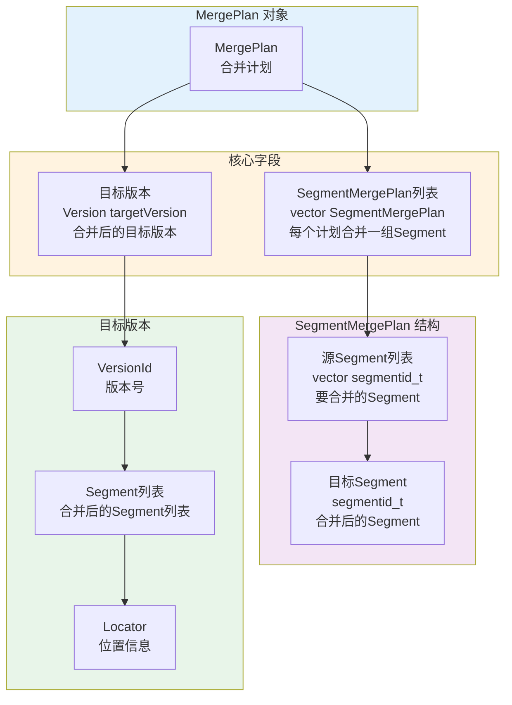

- **SegmentMergePlan 列表**：每个 SegmentMergePlan 包含一组要合并的 Segment
- **目标版本**：合并后的目标版本，包含合并后的 Segment 列表

### 3.2 SegmentMergePlan：Segment 合并计划

`SegmentMergePlan` 是单个 Segment 合并计划：

```cpp
// table/index_task/merger/SegmentMergePlan.h
class SegmentMergePlan
{
public:
    // 添加源 Segment
    void AddSrcSegment(segmentid_t segmentId);
    
    // 设置目标 Segment
    void SetTargetSegment(segmentid_t segmentId);
    
    // 获取源 Segment 列表
    const std::vector<segmentid_t>& GetSrcSegments() const;
    
    // 获取目标 Segment
    segmentid_t GetTargetSegment() const;

private:
    std::vector<segmentid_t> _srcSegments;  // 源 Segment 列表
    segmentid_t _targetSegment;            // 目标 Segment
};
```

**SegmentMergePlan 的关键字段**：

SegmentMergePlan 的结构：包含源 Segment 列表和目标 Segment（已在上面详细展示，此处不再重复）：

- **源 Segment 列表**：要合并的 Segment 列表
- **目标 Segment**：合并后的目标 Segment

### 3.3 合并计划的创建流程

合并计划的创建流程：

合并计划的创建流程：从收集 Segment 到创建合并计划（已在上面详细展示，此处不再重复）：

**创建流程**：
1. **收集源 Segment**：从 TabletData 中收集符合条件的 Segment
2. **过滤 Segment**：根据合并参数过滤 Segment
3. **分组 Segment**：根据合并参数分组 Segment
4. **创建 SegmentMergePlan**：为每组 Segment 创建 SegmentMergePlan
5. **设置目标 Segment**：为每个 SegmentMergePlan 设置目标 Segment
6. **创建 MergePlan**：将所有 SegmentMergePlan 添加到 MergePlan
7. **设置目标版本**：设置合并后的目标版本

## 4. 合并执行流程

### 4.1 VersionMerger：版本合并器

`VersionMerger` 是版本合并器，管理合并流程和版本更新，定义在 `framework/VersionMerger.h` 中：

```cpp
// framework/VersionMerger.h
class VersionMerger
{
public:
    // 执行合并任务
    future_lite::coro::Lazy<std::pair<Status, versionid_t>>
    ExecuteTask(const Version& sourceVersion, 
                const std::string& taskType,
                const std::string& taskName,
                const std::map<std::string, std::string>& params);
    
    // 运行合并流程
    future_lite::coro::Lazy<std::pair<Status, versionid_t>> Run();
    
    // 获取合并后的版本信息
    std::shared_ptr<MergedVersionInfo> GetMergedVersionInfo();
    
    // 判断是否需要提交
    bool NeedCommit() const;

private:
    std::string _tabletName;
    std::shared_ptr<ITabletMergeController> _controller;
    std::unique_ptr<IIndexTaskPlanCreator> _planCreator;
    Version _currentBaseVersion;
    std::shared_ptr<MergedVersionInfo> _mergedVersionInfo;
};
```

**VersionMerger 的关键组件**：

VersionMerger 的结构：管理合并流程和版本更新：

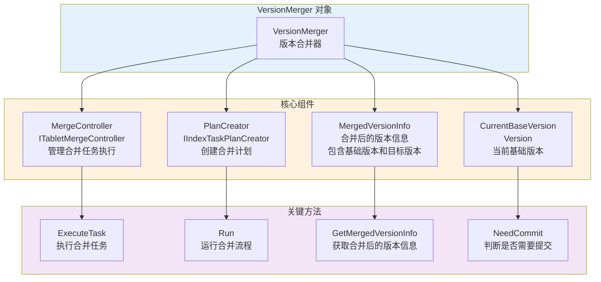

- **MergeController**：合并控制器，管理合并任务的执行
- **PlanCreator**：计划创建器，创建合并计划
- **MergedVersionInfo**：合并后的版本信息，包含基础版本和目标版本

### 4.2 合并执行流程

合并执行的完整流程：

合并执行流程：从创建合并计划到提交新版本（已在上面详细展示，此处不再重复）：

**执行流程**：

合并执行是合并流程的核心，需要高效地处理大量 Segment。让我们通过序列图来理解完整的执行流程：

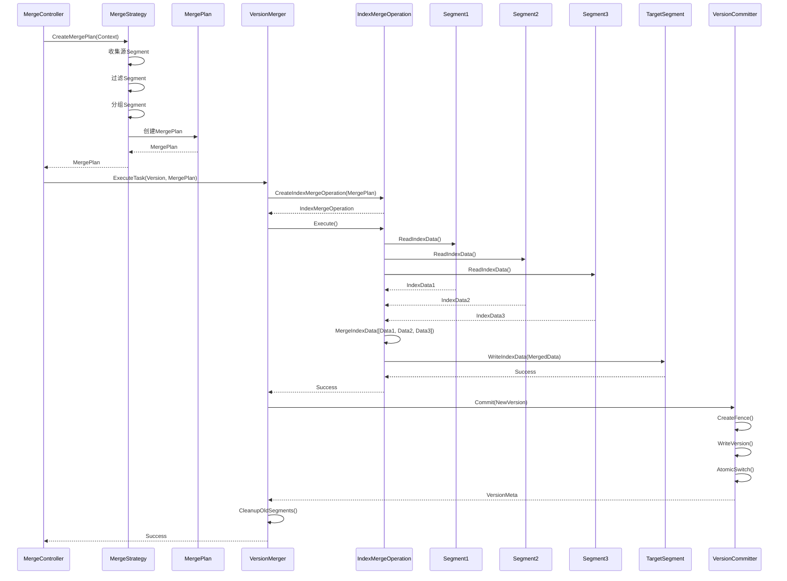

**执行流程详解**：

1. **检查合并条件**：判断是否需要合并（Segment 数量、大小等）
   - **Segment 数量检查**：当 Segment 数量超过阈值时触发合并
   - **Segment 大小检查**：当小 Segment 数量过多时触发合并
   - **查询性能检查**：当查询性能下降时触发合并
   - **存储空间检查**：当存储空间不足时触发合并
   
2. **创建合并计划**：调用 MergeStrategy 创建合并计划
   - **策略选择**：根据 Segment 特征选择合适的合并策略
   - **计划创建**：调用 `CreateMergePlan()` 创建合并计划
   - **计划验证**：验证合并计划的有效性，确保可以执行
   
3. **提交合并任务**：将合并任务提交到 MergeController
   - **任务调度**：MergeController 调度合并任务的执行
   - **资源分配**：为合并任务分配 CPU、内存、IO 资源
   - **并发控制**：控制同时进行的合并任务数量
   
4. **执行合并操作**：执行 IndexMergeOperation，合并 Segment
   - **数据读取**：并行读取所有源 Segment 的索引数据
   - **数据合并**：合并倒排索引、正排索引等索引数据
   - **数据写入**：将合并后的数据写入目标 Segment
   - **元数据更新**：更新 Segment 的元数据信息
   
5. **创建新版本**：合并完成后创建新版本
   - **版本信息准备**：准备新版本的 Segment 列表和 Locator
   - **版本号递增**：递增版本号，保证版本顺序
   - **版本验证**：验证新版本的有效性
   
6. **提交新版本**：提交新版本，更新 TabletData
   - **Fence 创建**：创建 Fence 目录，保证原子性
   - **版本持久化**：将新版本持久化到磁盘
   - **原子切换**：原子性地切换版本目录
   - **TabletData 更新**：更新 TabletData 的版本和 Segment 列表

### 4.3 IndexMergeOperation：合并操作

`IndexMergeOperation` 是合并操作，执行实际的合并工作：

IndexMergeOperation：执行实际的合并工作（已在上面详细展示，此处不再重复）：

**合并操作的关键步骤**：

IndexMergeOperation 是合并执行的核心，负责实际的合并工作。让我们通过流程图来理解详细的合并过程：

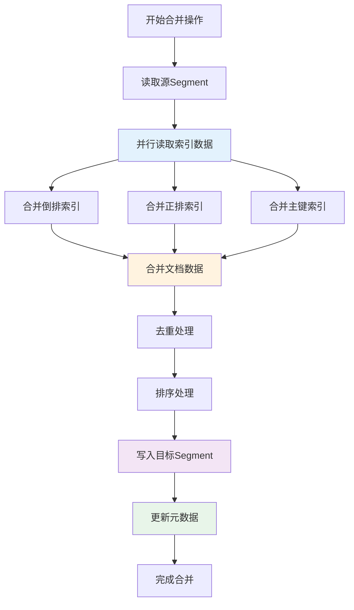

**合并操作的关键步骤详解**：

1. **读取源 Segment**：读取所有源 Segment 的数据
   - **并行读取**：多个源 Segment 可以并行读取，提高读取速度
   - **数据缓存**：读取的数据可以缓存在内存中，减少重复读取
   - **流式读取**：对于大 Segment，可以采用流式读取，减少内存占用
   
2. **合并索引**：合并倒排索引、正排索引等
   - **倒排索引合并**：合并 term 的倒排列表，去重、排序
   - **正排索引合并**：合并文档属性，保持属性顺序
   - **主键索引合并**：合并主键索引，去重主键
   - **索引优化**：合并过程中可以优化索引结构，提高索引效率
   
3. **合并文档**：合并文档数据，去重、排序等
   - **文档去重**：根据主键去重，避免重复文档
   - **文档排序**：按照 DocId 排序，保证文档顺序
   - **文档合并**：合并文档的各个字段，保持数据完整性
   
4. **写入目标 Segment**：将合并后的数据写入目标 Segment
   - **索引写入**：将合并后的索引数据写入目标 Segment
   - **文档写入**：将合并后的文档数据写入目标 Segment
   - **元数据写入**：写入 Segment 的元数据信息
   
5. **更新元数据**：更新 Segment 的元数据信息
   - **文档计数**：更新 Segment 的文档数量
   - **Locator 更新**：更新 Segment 的 Locator 信息
   - **统计信息**：更新 Segment 的统计信息（大小、索引数等）

**合并操作的性能优化**：

1. **并行合并**：
   - 多个索引可以并行合并，提高合并速度
   - 多个 Segment 可以并行读取，减少读取时间
   
2. **增量合并**：
   - 只合并变更的索引，减少合并工作量
   - 使用增量算法，避免重复处理
   
3. **内存优化**：
   - 使用内存池减少内存分配开销
   - 流式处理减少内存占用
   - 及时释放不再使用的内存

## 5. 合并策略详解

### 5.1 OptimizeMergeStrategy 的合并逻辑

OptimizeMergeStrategy 的合并逻辑：

OptimizeMergeStrategy 的合并逻辑：根据参数决定合并行为（已在上面详细展示，此处不再重复）：

**合并逻辑**：
1. **收集源 Segment**：从 TabletData 中收集所有符合条件的 Segment
2. **过滤 Segment**：根据 `maxDocCount` 过滤，只保留文档数小于等于该值的 Segment
3. **计算目标 Segment 数**：根据 `afterMergeMaxDocCount` 和 `afterMergeMaxSegmentCount` 计算目标 Segment 数
4. **分组 Segment**：将 Segment 分组，每组合并为一个目标 Segment
5. **创建合并计划**：为每组 Segment 创建 SegmentMergePlan

### 5.2 合并参数的影响

合并参数对合并行为的影响：

合并参数的影响：maxDocCount、afterMergeMaxDocCount 等参数的作用（已在上面详细展示，此处不再重复）：

**参数影响**：
- **maxDocCount**：控制哪些 Segment 参与合并，较大的值会包含更多 Segment
- **afterMergeMaxDocCount**：控制合并后 Segment 的大小，较大的值会产生更大的 Segment
- **afterMergeMaxSegmentCount**：控制合并后 Segment 的数量，较小的值会产生更少的 Segment
- **skipSingleMergedSegment**：控制是否跳过单个已合并的 Segment，避免重复合并

### 5.3 合并策略的选择

不同场景下的合并策略选择：

合并策略的选择：根据场景选择不同的合并策略：

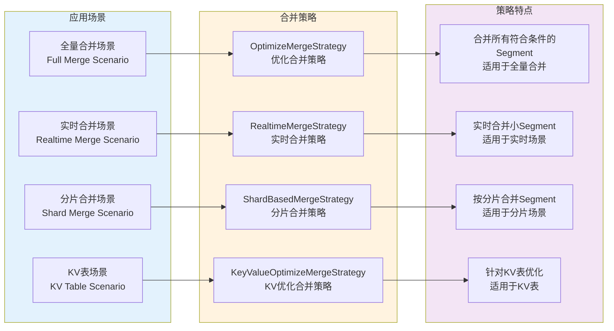

**策略选择**：
- **OptimizeMergeStrategy**：适用于全量合并，合并所有符合条件的 Segment
- **RealtimeMergeStrategy**：适用于实时合并，实时合并小 Segment
- **ShardBasedMergeStrategy**：适用于分片场景，按分片合并 Segment
- **KeyValueOptimizeMergeStrategy**：适用于 KV 表，针对 KV 表的优化合并

## 6. 合并的触发条件

### 6.1 合并触发条件

合并的触发条件：

合并触发条件：Segment 数量、大小等条件：

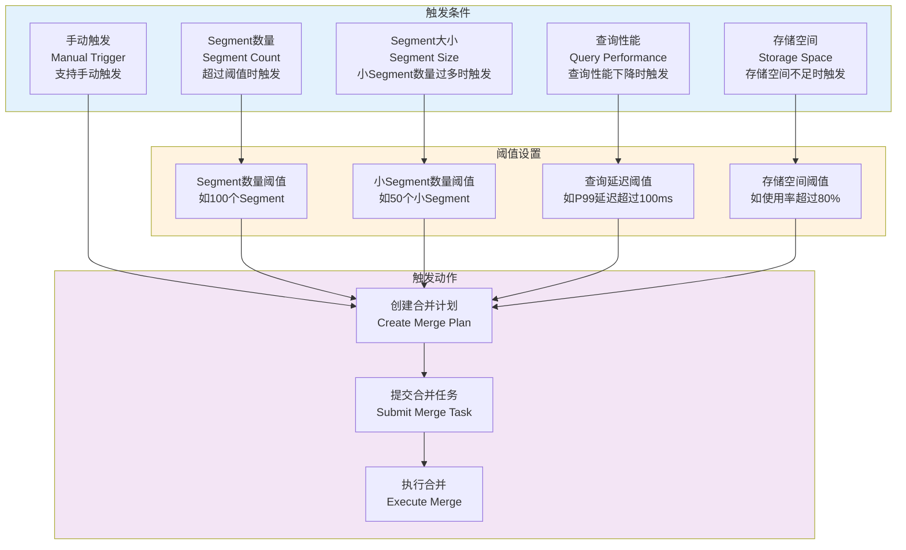

**触发条件**：
- **Segment 数量**：当 Segment 数量超过阈值时触发合并
- **Segment 大小**：当小 Segment 数量过多时触发合并
- **查询性能**：当查询性能下降时触发合并
- **存储空间**：当存储空间不足时触发合并
- **手动触发**：支持手动触发合并

### 6.2 合并时机的选择

合并时机的选择：

合并时机的选择：在线合并、离线合并等：

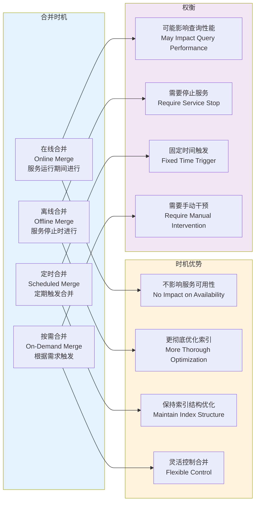

**合并时机**：
- **在线合并**：在服务运行期间进行合并，不影响服务可用性
- **离线合并**：在服务停止时进行合并，可以更彻底地优化索引
- **定时合并**：定期触发合并，保持索引结构优化
- **按需合并**：根据查询性能或存储空间按需触发合并

## 7. 合并的性能优化

### 7.1 合并性能优化策略

合并性能优化的策略：

合并性能优化：并行合并、增量合并等策略：

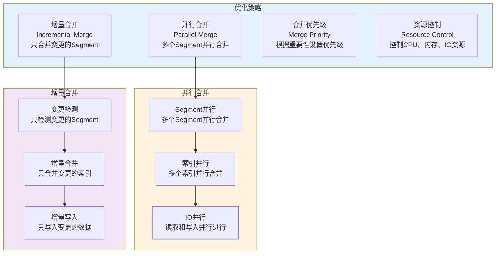

**优化策略**：
- **并行合并**：多个 Segment 可以并行合并，提高合并效率
- **增量合并**：只合并变更的 Segment，减少合并工作量
- **合并优先级**：根据 Segment 大小和重要性设置合并优先级
- **资源控制**：控制合并时的 CPU、内存、IO 资源使用

### 7.2 合并的资源控制

合并时的资源控制：

合并的资源控制：CPU、内存、IO 资源的控制：

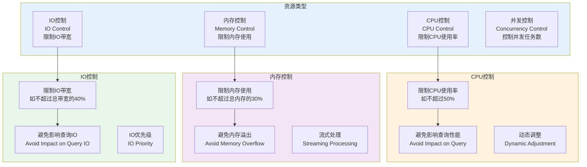

**资源控制**：
- **CPU 控制**：限制合并时的 CPU 使用率，避免影响查询性能
- **内存控制**：限制合并时的内存使用，避免内存溢出
- **IO 控制**：限制合并时的 IO 带宽，避免影响查询 IO
- **并发控制**：控制同时进行的合并任务数量

## 8. 合并的实际应用

### 8.1 全量合并场景

在全量合并场景中，合并的应用：

全量合并场景：合并所有符合条件的 Segment：

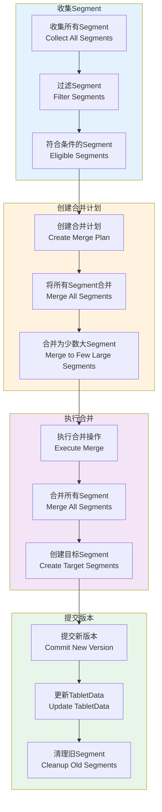

**全量合并流程**：
1. **收集所有 Segment**：收集所有符合条件的 Segment
2. **创建合并计划**：创建合并计划，将所有 Segment 合并为少数几个大 Segment
3. **执行合并**：执行合并操作，合并所有 Segment
4. **提交新版本**：提交新版本，更新 TabletData

### 8.2 增量合并场景

在增量合并场景中，合并的应用：

增量合并场景：只合并新增或变更的 Segment：

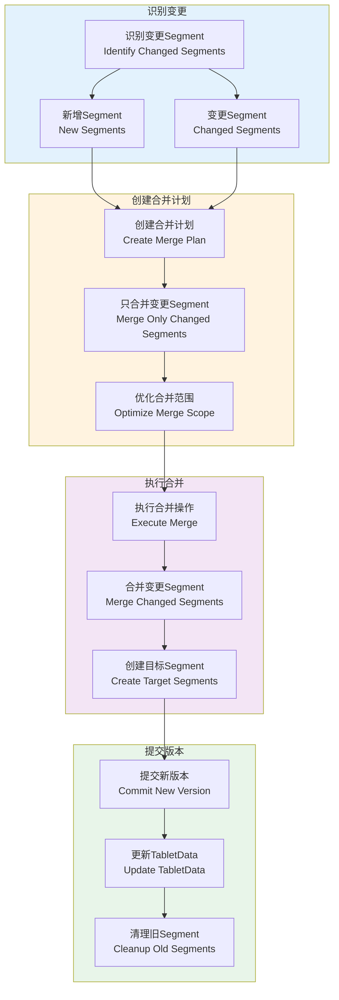

**增量合并流程**：
1. **识别变更 Segment**：识别新增或变更的 Segment
2. **创建合并计划**：创建合并计划，只合并变更的 Segment
3. **执行合并**：执行合并操作，合并变更的 Segment
4. **提交新版本**：提交新版本，更新 TabletData

## 9. 合并的关键设计

### 9.1 合并的原子性

合并的原子性保证：

合并的原子性：通过 Fence 机制保证合并的原子性：

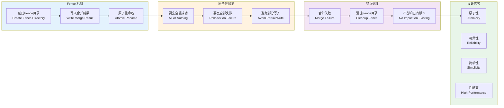

**原子性保证**：
- **Fence 机制**：通过 Fence 目录保证合并的原子性
- **事务性提交**：合并完成后原子性地提交新版本
- **错误恢复**：如果合并失败，可以回滚，不影响已有版本

### 9.2 合并的一致性

合并的一致性保证：

合并的一致性：保证合并后数据的一致性：

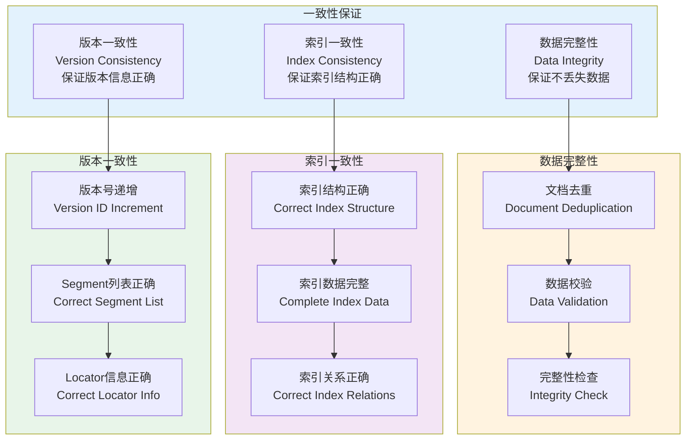

**一致性保证**：
- **数据完整性**：保证合并后数据的完整性，不丢失数据
- **索引一致性**：保证合并后索引的一致性，索引结构正确
- **版本一致性**：保证合并后版本的一致性，版本信息正确

### 9.3 合并的性能优化

合并的性能优化：

合并的性能优化：并行合并、资源控制等优化策略（已在上面详细展示，此处不再重复）：

**性能优化**：
- **并行合并**：多个 Segment 可以并行合并，提高合并效率
- **增量合并**：只合并变更的 Segment，减少合并工作量
- **资源控制**：控制合并时的资源使用，避免影响查询性能
- **合并优先级**：根据 Segment 重要性设置合并优先级

## 10. 性能优化与最佳实践

### 10.1 合并性能优化

**优化策略**：

1. **并行合并优化**：
   - **Segment 并行**：多个 Segment 可以并行合并，提高合并效率
   - **索引并行**：多个索引可以并行合并，充分利用多核 CPU
   - **IO 并行**：读取和写入可以并行进行，提高 IO 利用率
   
2. **增量合并优化**：
   - **变更检测**：只检测变更的 Segment，减少检测开销
   - **增量合并**：只合并变更的索引，减少合并工作量
   - **增量写入**：只写入变更的数据，减少写入量
   
3. **资源控制优化**：
   - **CPU 控制**：限制合并时的 CPU 使用率，避免影响查询性能
   - **内存控制**：限制合并时的内存使用，避免内存溢出
   - **IO 控制**：限制合并时的 IO 带宽，避免影响查询 IO
   - **并发控制**：控制同时进行的合并任务数量

### 10.2 合并策略优化

**优化策略**：

1. **参数调优**：
   - **maxDocCount**：根据 Segment 大小分布调整，平衡合并频率和效果
   - **afterMergeMaxDocCount**：根据查询性能调整，平衡 Segment 大小和查询延迟
   - **afterMergeMaxSegmentCount**：根据系统负载调整，平衡 Segment 数量和查询性能
   
2. **策略选择优化**：
   - **场景适配**：根据场景选择合适的合并策略
   - **动态调整**：根据系统负载动态调整合并策略
   - **策略组合**：可以组合使用多种合并策略
   
3. **触发条件优化**：
   - **智能触发**：根据查询性能和存储空间智能触发合并
   - **定时触发**：定期触发合并，保持索引结构优化
   - **按需触发**：根据实际需求按需触发合并

### 10.3 合并监控与调优

**监控指标**：

1. **合并性能指标**：
   - **合并耗时**：监控合并任务的执行时间
   - **合并吞吐量**：监控合并的数据量
   - **资源使用**：监控合并时的 CPU、内存、IO 使用
   
2. **合并效果指标**：
   - **Segment 数量变化**：监控合并前后 Segment 数量的变化
   - **查询性能变化**：监控合并前后查询性能的变化
   - **存储空间变化**：监控合并前后存储空间的变化
   
3. **调优策略**：
   - **参数调优**：根据监控数据调整合并参数
   - **策略调优**：根据监控数据调整合并策略
   - **时机调优**：根据监控数据调整合并触发时机

## 11. 小结

Segment 合并策略是 IndexLib 的核心功能，通过 MergeStrategy 和 MergePlan 实现。通过本文的深入解析，我们了解到：

**核心机制**：

- **MergeStrategy**：合并策略，决定哪些 Segment 参与合并，支持多种合并策略
  - **策略模式**：通过策略模式支持多种合并策略，便于扩展
  - **策略选择**：根据 Segment 特征和配置选择合适的合并策略
  - **计划创建**：根据策略创建合并计划，决定合并的 Segment 和目标
  
- **MergePlan**：合并计划，包含合并的 Segment 列表和目标 Segment 信息
  - **计划结构**：包含多个 SegmentMergePlan，每个计划合并一组 Segment
  - **目标版本**：记录合并后的目标版本，包含合并后的 Segment 列表
  - **计划验证**：创建后验证计划的有效性，确保可以执行
  
- **OptimizeMergeStrategy**：优化合并策略，根据参数控制合并行为
  - **参数控制**：通过 `maxDocCount`、`afterMergeMaxDocCount` 等参数控制合并行为
  - **分组策略**：根据参数将 Segment 分组，每组合并为一个目标 Segment
  - **合并优化**：优化合并策略，减少合并次数，提高合并效率
  
- **合并执行流程**：从创建合并计划到提交新版本的完整流程
  - **计划创建**：调用 MergeStrategy 创建合并计划
  - **任务执行**：执行 IndexMergeOperation，合并 Segment
  - **版本提交**：合并完成后提交新版本，更新 TabletData
  
- **合并触发条件**：根据 Segment 数量、大小等条件触发合并
  - **数量触发**：当 Segment 数量超过阈值时触发合并
  - **大小触发**：当小 Segment 数量过多时触发合并
  - **性能触发**：当查询性能下降时触发合并
  - **手动触发**：支持手动触发合并
  
- **合并性能优化**：通过并行合并、资源控制等策略优化合并性能
  - **并行合并**：多个 Segment 和索引可以并行合并，提高合并效率
  - **资源控制**：控制合并时的 CPU、内存、IO 资源使用，避免影响查询
  - **增量合并**：只合并变更的 Segment，减少合并工作量
  
- **合并的原子性和一致性**：通过 Fence 机制保证合并的原子性和一致性
  - **原子性保证**：通过 Fence 机制保证合并的原子性，要么全部成功，要么全部失败
  - **一致性保证**：保证合并后数据的完整性和索引的一致性
  - **错误恢复**：如果合并失败，可以回滚，不影响已有版本

**设计亮点**：

1. **策略模式**：通过策略模式支持多种合并策略，便于扩展和维护
2. **计划机制**：通过 MergePlan 将合并策略和执行分离，提高灵活性
3. **并行合并**：支持并行合并，充分利用多核 CPU，提高合并效率
4. **资源控制**：通过资源控制避免合并影响查询性能，保证系统稳定性
5. **原子性保证**：通过 Fence 机制保证合并的原子性，保证数据一致性

**性能优化**：

- **合并效率**：并行合并显著提高合并效率
- **查询性能**：合并后查询性能显著提升
- **存储空间**：合并后有效减少存储空间
- **资源使用**：资源控制有效降低对查询的影响

理解 Segment 合并策略，是掌握 IndexLib 索引优化机制的关键。在下一篇文章中，我们将深入介绍内存管理与资源控制的实现细节，包括 MemoryQuotaController、TabletMemoryCalculator、IIndexMemoryReclaimer 等各个组件的实现原理和性能优化策略。
